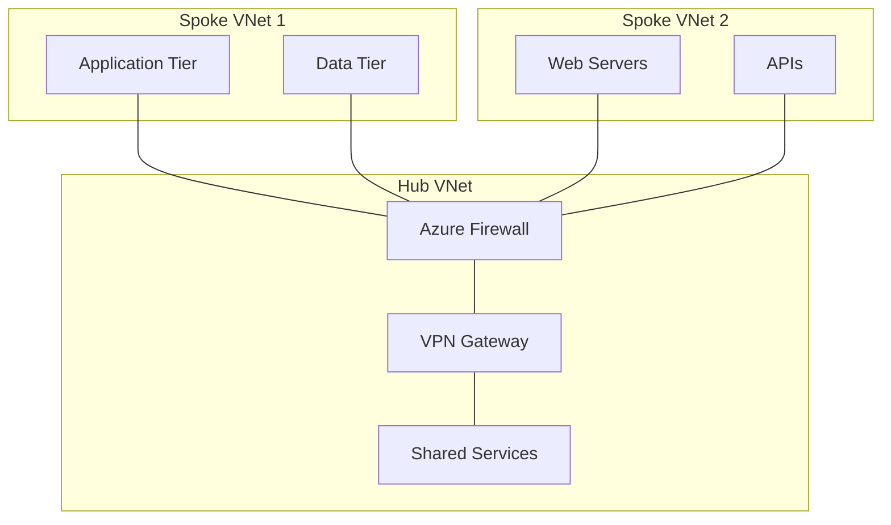
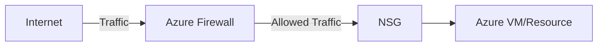
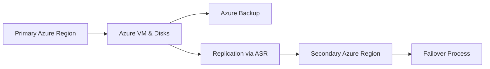
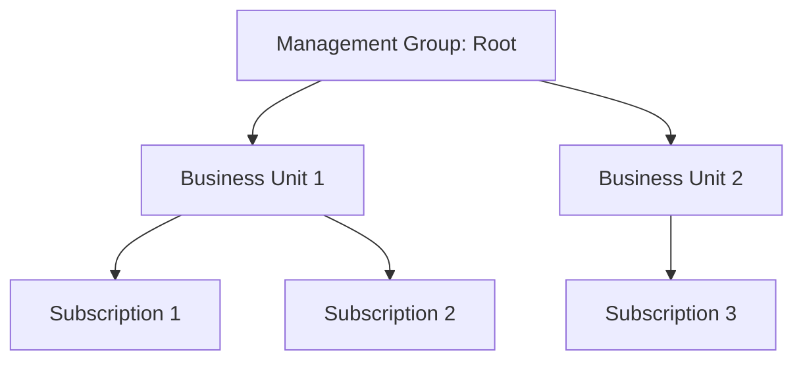

# Disclaimer
This repository contains information collected from various online sources and/or generated by AI assistants. The content provided here is for informational purposes only and is intended to serve as a general reference on various topics.

# Azure Administration: A Comprehensive Guide

## Table of Contents

1. [Introduction](#introduction)
2. [Overview of Microsoft Azure](#overview-of-microsoft-azure)
3. [Azure Subscriptions](#azure-subscriptions)
   - 3.1 [Subscription Concepts](#subscription-concepts)
   - 3.2 [Managing Subscriptions](#managing-subscriptions)
   - 3.3 [Billing and Cost Management](#billing-and-cost-management)
   - 3.4 [Subscription Governance and Policies](#subscription-governance-and-policies)
4. [Resource Groups](#resource-groups)
   - 4.1 [Resource Group Fundamentals](#resource-group-fundamentals)
   - 4.2 [Best Practices for Resource Groups](#best-practices-for-resource-groups)
   - 4.3 [Resource Tagging and Organization](#resource-tagging-and-organization)
5. [Hub-and-Spoke Architecture](#hub-and-spoke-architecture)
   - 5.1 [Conceptual Overview](#conceptual-overview)
   - 5.2 [Design Considerations](#design-considerations)
   - 5.3 [Implementation Details](#implementation-details)
   - 5.4 [Mermaid Diagram of Hub-and-Spoke Network](#mermaid-diagram-of-hub-and-spoke-network)
   - 5.5 [Table: Hub-and-Spoke Configuration Comparison](#table-hub-and-spoke-comparison)
6. [Azure Security Management](#azure-security-management)
   - 6.1 [Identity and Access Management (IAM)](#identity-and-access-management-iam)
   - 6.2 [Role-Based Access Control (RBAC)](#role-based-access-control-rbac)
   - 6.3 [Network Security Groups (NSGs) and Azure Firewall](#network-security-groups-and-azure-firewall)
   - 6.4 [Encryption and Data Protection](#encryption-and-data-protection)
   - 6.5 [Security Center and Sentinel](#security-center-and-sentinel)
   - 6.6 [Best Practices in Azure Security](#best-practices-in-azure-security)
7. [Governance, Compliance, and Policy Management](#governance-compliance-and-policy-management)
   - 7.1 [Azure Policy Overview](#azure-policy-overview)
   - 7.2 [Cost Management and Budgeting](#cost-management-and-budgeting)
   - 7.3 [Compliance Certifications and Standards](#compliance-certifications-and-standards)
8. [Management and Monitoring Tools](#management-and-monitoring-tools)
   - 8.1 [Azure Monitor and Log Analytics](#azure-monitor-and-log-analytics)
   - 8.2 [Application Insights](#application-insights)
   - 8.3 [Azure Service Health](#azure-service-health)
   - 8.4 [Automation with Azure Automation and Runbooks](#automation-with-azure-automation-and-runbooks)
9. [Automation, DevOps, and Deployment](#automation-devops-and-deployment)
   - 9.1 [Azure Resource Manager (ARM) Templates](#azure-resource-manager-arm-templates)
   - 9.2 [Azure CLI, PowerShell, and SDKs](#azure-cli-powershell-and-sdks)
   - 9.3 [Continuous Integration and Continuous Deployment (CI/CD)](#continuous-integration-and-continuous-deployment-cicd)
   - 9.4 [Infrastructure as Code (IaC)](#infrastructure-as-code-iac)
10. [Backups and Disaster Recovery](#backups-and-disaster-recovery)
    - 10.1 [Overview](#overview)
    - 10.2 [Azure Backup for VMs and Disks](#azure-backup-for-vms-and-disks)
    - 10.3 [Best Practices for Backups](#best-practices-for-backups)
    - 10.4 [Disaster Recovery with Azure Site Recovery](#disaster-recovery-with-azure-site-recovery)
    - 10.5 [Workflow and Integration](#workflow-for-implementing-backups-and-dr)
11. [Case Studies and Practical Scenarios](#case-studies-and-practical-scenarios)
    - 11.1 [Enterprise Multi-Subscription Strategy](#enterprise-multi-subscription-strategy)
    - 11.2 [Deploying a Hub-and-Spoke Network](#deploying-a-hub-and-spoke-network)
    - 11.3 [Securing a Complex Azure Environment](#securing-a-complex-azure-environment)
12. [Best Practices and Recommendations](#best-practices-and-recommendations)
13. [Advanced Topics in Azure Administration](#advanced-topics-in-azure-administration)
    - 13.1 [Multi-Region Deployments](#multi-region-deployments)
    - 13.2 [Hybrid Cloud Scenarios](#hybrid-cloud-scenarios)
    - 13.3 [Disaster Recovery and Business Continuity](#disaster-recovery-and-business-continuity)
    - 13.4 [Performance Optimization](#performance-optimization)
14. [Deployment Scenarios and Example Workflows](#deployment-scenarios-and-example-workflows)
    - 14.1 [Workflow: Deploying a Web Application in Azure](#workflow-deploying-a-web-application-in-azure)
    - 14.2 [Workflow: Implementing a Hub-and-Spoke Network](#workflow-implementing-a-hub-and-spoke-network)
15. [Troubleshooting and Maintenance](#troubleshooting-and-maintenance)
16. [Conclusion](#conclusion)
17. [References](#references)

---

## Introduction

In today’s cloud-centric IT landscape, Microsoft Azure stands out as one of the most robust and flexible cloud service providers. This document provides an exhaustive guide on Azure administration with a particular focus on:
- **Subscriptions:** How they serve as the billing and security boundaries.
- **Resource Groups:** Best practices for organizing and managing your cloud resources.
- **Hub-and-Spoke Configurations:** Network topology designs that improve security, manageability, and scalability.
- **Security:** A comprehensive overview of Azure security mechanisms including IAM, RBAC, NSGs, and firewalls.
- **Backups and Disaster Recovery:** Strategies to safeguard your Virtual Machines (VMs) and disks, along with robust disaster recovery planning.

This guide is intended for IT administrators, cloud architects, and DevOps professionals who are responsible for deploying, managing, and securing Azure environments.

---

## Overview of Microsoft Azure

Microsoft Azure is a leading cloud computing platform that provides an extensive range of services including computing, analytics, storage, and networking. Azure’s infrastructure is built around a highly resilient, globally distributed architecture that allows organizations to deploy mission-critical applications and services with high availability and security.

Key attributes of Azure include:
- **Scalability:** Easily scale resources up or down to meet fluctuating demands.
- **Global Reach:** Data centers in multiple geographic regions ensure low latency and compliance with local regulations.
- **Security:** Built-in security features, robust identity management, and compliance certifications across various industries.
- **Integration:** Seamless integration with other Microsoft products, as well as third-party tools and services.
- **Automation and DevOps:** Powerful automation tools such as ARM templates, Azure CLI, and integration with popular CI/CD pipelines.

The following sections dive deeper into the administrative aspects of managing Azure resources, starting with subscriptions.

---

## Azure Subscriptions

### Subscription Concepts

Azure subscriptions serve as a logical container for all your Azure resources. They are essential for several reasons:

- **Billing Boundaries:** Each subscription acts as a billing unit. Costs incurred by resources are tracked and billed under the associated subscription.
- **Security and Management Boundaries:** Subscriptions help define the scope of policies, role-based access control (RBAC), and compliance configurations.
- **Resource Isolation:** Using multiple subscriptions can help isolate environments (e.g., development, testing, production) to mitigate risk and improve manageability.
- **Quota Management:** Each subscription has resource limits and quotas that help manage resource consumption effectively.

A subscription can contain one or more resource groups, and each resource group is a logical container that holds related resources for an application or workload.

### Managing Subscriptions

Managing subscriptions efficiently is key to successful Azure administration. Here are some strategies and tools to consider:

- **Azure Portal:** The Azure Portal offers an intuitive user interface for subscription management, allowing administrators to create, modify, and delete subscriptions.
- **Azure CLI & PowerShell:** For automated and script-based management, Azure CLI and Azure PowerShell modules provide powerful commands to manage subscriptions programmatically.
- **Management Groups:** When managing multiple subscriptions, you can use management groups to create a hierarchy that helps organize and apply policies uniformly across all subscriptions.
- **Enterprise Agreement (EA):** Organizations that have an Enterprise Agreement with Microsoft often manage subscriptions centrally with additional governance controls, cost management dashboards, and reporting tools.

### Billing and Cost Management

Billing in Azure is inherently linked to subscriptions. Here are some key points:

- **Cost Allocation:** Each resource usage within a subscription is tracked, allowing for detailed cost analysis.
- **Budgets and Alerts:** You can set budgets and receive alerts if spending exceeds defined thresholds.
- **Cost Analysis Tools:** Azure provides built-in tools such as Cost Management + Billing to monitor and analyze expenses.
- **Billing APIs:** For advanced scenarios, Azure’s billing APIs enable integration with external cost management systems.

Below is a table summarizing key aspects of Azure billing and cost management:

| **Aspect**             | **Details**                                                                                                                                  |
|------------------------|----------------------------------------------------------------------------------------------------------------------------------------------|
| Billing Units          | Each subscription acts as a distinct billing unit.                                                                                         |
| Budget Management      | Set budgets at the subscription level; configure alerts to notify stakeholders of cost overruns.                                             |
| Cost Analysis          | Detailed dashboards and reports for tracking usage by service, resource group, or project.                                                   |
| Billing APIs           | Integration points for third-party tools and custom cost-management solutions.                                                               |
| Enterprise Agreements  | Centralized management and reporting for organizations under an Enterprise Agreement.                                                       |

### Subscription Governance and Policies

Effective governance is essential for managing a secure and cost-efficient cloud environment. Key governance mechanisms include:

- **Azure Policy:** Enforce standards and assess compliance across your resources by applying policies at the subscription level. This ensures that all resources adhere to organizational standards.
- **Resource Locks:** Prevent accidental deletion or modification of critical resources by applying locks at the subscription or resource group level.
- **Access Reviews:** Regularly review and audit access privileges to ensure that only authorized users have control over the subscription.
- **Tagging Strategies:** Use resource tagging to enforce organization standards, cost allocation, and operational policies.

By adopting these governance strategies, organizations can ensure that their subscriptions remain compliant, secure, and cost-effective.

---

## Resource Groups

### Resource Group Fundamentals

Resource groups are logical containers that help organize and manage resources within a subscription. They play a crucial role in:

- **Grouping Related Resources:** Organizing resources that share a common lifecycle, such as all components of a web application.
- **Simplifying Management:** Applying policies, role assignments, and cost management controls at the resource group level.
- **Enabling Resource Consistency:** Ensuring that resources within a group are deployed, updated, and decommissioned together.

Key concepts include:
- **Logical Grouping:** Unlike physical grouping, resource groups are a logical construct that aids in organization and management.
- **Lifecycle Management:** Resources within the same group often share similar deployment, monitoring, and management processes.
- **Dependency Management:** Grouping resources that are interdependent can simplify configuration and maintenance.

### Best Practices for Resource Groups

When designing and implementing resource groups, consider the following best practices:

- **Align with Application Lifecycles:** Create resource groups that reflect the lifecycle of your applications. For example, separate groups for development, staging, and production.
- **Apply Role-Based Access Control (RBAC):** Delegate management responsibilities by assigning roles at the resource group level. This minimizes the risk of unauthorized changes.
- **Use Consistent Naming Conventions:** Implement a naming strategy that includes key information (e.g., environment, project, and region) to easily identify and manage resources.
- **Monitor and Audit Regularly:** Use Azure Monitor and Log Analytics to track changes and ensure compliance with organizational policies.
- **Tagging:** Implement a robust tagging strategy for categorization, cost tracking, and automation purposes.

### Resource Tagging and Organization

Tagging is a fundamental aspect of resource group management. Tags are key-value pairs assigned to Azure resources and resource groups to facilitate:
- **Cost Tracking:** Allocate costs to departments, projects, or teams.
- **Automation:** Use tags as selectors in automation scripts and policies.
- **Reporting:** Generate detailed reports on resource usage, performance, and compliance.

Below is an example table outlining a recommended tagging strategy:

| **Tag Key**      | **Description**                            | **Example Values**              |
|------------------|--------------------------------------------|---------------------------------|
| Environment      | Indicates the deployment environment       | Production, Staging, Dev        |
| Project          | Identifies the associated project         | WebApp, MobileApp, Analytics    |
| Department       | Organizational department responsible      | IT, Finance, HR                 |
| Owner            | Primary owner or team responsible          | user@example.com, TeamX         |
| Cost Center      | Cost center for budgeting and tracking      | CC1001, CC1002                  |
| Compliance       | Regulatory or compliance requirement        | GDPR, HIPAA                     |

---

## Hub-and-Spoke Architecture

### Conceptual Overview

The hub-and-spoke architecture is a common network topology design used in Azure to simplify network management, enhance security, and optimize connectivity. In this model:
- **Hub:** Acts as a central point that contains shared services, such as identity providers, VPN gateways, and firewalls.
- **Spokes:** Represent individual workloads or environments (e.g., development, production) that connect to the hub for access to shared services.

This design offers numerous benefits:
- **Centralized Security:** Shared security controls and policies can be applied at the hub level.
- **Reduced Complexity:** Spoke networks can be managed independently while still benefiting from the centralized services.
- **Cost Optimization:** Centralized management reduces duplication of services and minimizes overall costs.

### Design Considerations

When designing a hub-and-spoke architecture in Azure, several factors must be considered:

1. **Network Isolation:**  
   - Ensure that each spoke is isolated from other spokes unless explicitly allowed via network peering or VPN connections.
   - Use Network Security Groups (NSGs) to enforce isolation and traffic rules.

2. **Connectivity:**  
   - Establish robust connectivity between the hub and spokes using Virtual Network (VNet) peering or VPN gateways.
   - Ensure low latency and high throughput, particularly for applications requiring real-time data transfer.

3. **Shared Services:**  
   - Centralize services such as DNS, Active Directory, and monitoring in the hub.
   - Configure service endpoints and private links to maintain secure access.

4. **Scalability:**  
   - Design the hub with scalability in mind to accommodate increasing spoke networks.
   - Use Azure Load Balancer or Application Gateway to manage traffic efficiently.

5. **Security and Compliance:**  
   - Implement strict access controls and monitor inter-VNet traffic.
   - Regularly review configurations to ensure compliance with security policies.

### Implementation Details

The following steps outline how to implement a hub-and-spoke network configuration in Azure:

1. **Create the Hub VNet:**  
   - Define an address space that is large enough to accommodate shared services.
   - Deploy critical services (e.g., firewall, VPN gateway) in this VNet.

2. **Create the Spoke VNets:**  
   - Allocate separate address spaces for each spoke to prevent IP conflicts.
   - Configure VNet peering between the hub and each spoke.

3. **Configure VNet Peering:**  
   - Set up peering connections between the hub and spoke networks.
   - Ensure that the peering configuration allows for proper routing and security.

4. **Deploy Shared Services:**  
   - Implement services such as Azure Firewall, VPN Gateway, and Azure Bastion in the hub.
   - Configure these services to handle traffic from all spokes.

5. **Enforce Security Controls:**  
   - Apply NSGs and Azure Policy to restrict and monitor traffic flows.
   - Utilize Azure Monitor and Network Watcher to track network performance and security events.

### Mermaid Diagram of Hub-and-Spoke Network

Below is a Mermaid diagram illustrating a typical hub-and-spoke architecture:



### Table: Hub-and-Spoke Configuration Comparison

The table below compares key configuration elements between a hub-and-spoke model and a flat network model:

| **Feature**                 | **Hub-and-Spoke Architecture**                                            | **Flat Network Architecture**                                  |
|-----------------------------|----------------------------------------------------------------------------|----------------------------------------------------------------|
| **Scalability**             | High – Centralized management allows adding new spokes easily              | Moderate – Adding new resources can complicate routing         |
| **Security**                | Enhanced – Centralized security controls in the hub                        | Variable – Decentralized security requires individual configuration |
| **Management Complexity**   | Reduced – Shared services and policies simplify management                 | Increased – Each resource requires independent management      |
| **Cost Optimization**       | Optimized – Shared services reduce duplication of resources                | Potentially higher – Duplication of services increases cost      |
| **Deployment Flexibility**  | High – Spokes can be deployed independently with controlled connectivity     | Lower – Changes affect the entire network                      |

---

## Azure Security Management

Security is a cornerstone of Azure administration. Azure offers a multitude of tools and frameworks designed to protect your environment from threats while ensuring compliance with various regulations.

### Identity and Access Management (IAM)

IAM is the process of ensuring the right individuals have the appropriate access to technology resources. In Azure, IAM is implemented primarily through:

- **Azure Active Directory (Azure AD):** Provides identity and access management for users, groups, and applications.
- **Single Sign-On (SSO):** Simplifies access across multiple services by reducing password fatigue and enhancing security.
- **Multi-Factor Authentication (MFA):** Adds an extra layer of security by requiring additional verification.
- **Conditional Access:** Enforces policies that control access based on user location, device state, and risk levels.

Azure AD integrates with many third-party services, making it a robust foundation for identity management in the cloud.

### Role-Based Access Control (RBAC)

RBAC is a key mechanism in Azure security. It allows you to assign permissions to users, groups, or service principals based on their roles. Key points include:

- **Built-in Roles:** Azure offers a variety of built-in roles (e.g., Owner, Contributor, Reader) that can be assigned as needed.
- **Custom Roles:** For more granular control, administrators can create custom roles that define specific permissions.
- **Scope of Access:** RBAC can be applied at various scopes, including subscriptions, resource groups, and individual resources.
- **Audit and Compliance:** RBAC assignments are logged and auditable, providing a clear record of who has access to what resources.

Below is an example table summarizing RBAC roles and their primary functions:

| **Role**         | **Permissions**                                        | **Typical Use Cases**                                 |
|------------------|--------------------------------------------------------|-------------------------------------------------------|
| Owner            | Full management, including RBAC assignment             | Administrators and IT leads                           |
| Contributor      | Create and manage resources                            | DevOps teams                                          |
| Reader           | View-only access to resources                          | Auditors, reviewers, or support teams                 |
| Custom Roles     | Defined by specific business requirements              | Specialized roles for granular control                |

### Network Security Groups (NSGs) and Azure Firewall

NSGs and Azure Firewall are critical components of network security within Azure.

#### Network Security Groups (NSGs)

NSGs allow you to control network traffic to and from Azure resources by creating rules that permit or deny traffic. Key features include:
- **Inbound and Outbound Rules:** Define rules for both incoming and outgoing traffic.
- **Application of NSGs:** Can be applied at the subnet or NIC level.
- **Stateless vs. Stateful:** NSGs are stateful, meaning that if an incoming packet is allowed, the response is automatically allowed.

#### Azure Firewall

Azure Firewall is a managed, cloud-based network security service that protects your Azure Virtual Network resources. Features include:
- **High Availability:** Built-in availability and scalability.
- **Centralized Policy Management:** Enforces security policies for all connected networks.
- **Threat Intelligence:** Integrates with threat intelligence feeds to block known malicious IP addresses and domains.
- **Logging and Monitoring:** Provides comprehensive logging and real-time alerts.

Below is a simple diagram depicting NSG and Firewall interaction:



### Encryption and Data Protection

Data protection in Azure involves several layers of encryption:
- **At-Rest Encryption:** Azure Storage and databases automatically encrypt data at rest using industry-standard encryption algorithms.
- **In-Transit Encryption:** Data transmitted between services is encrypted using TLS/SSL protocols.
- **Key Management:** Azure Key Vault allows you to manage encryption keys and secrets securely.
- **Disk Encryption:** Azure Disk Encryption uses BitLocker for Windows and DM-Crypt for Linux to secure virtual machine disks.

### Security Center and Sentinel

Azure Security Center and Azure Sentinel are advanced tools for monitoring and responding to security threats:

- **Azure Security Center:** Provides a unified security management system, offering recommendations, vulnerability assessments, and threat protection.
- **Azure Sentinel:** A cloud-native Security Information and Event Management (SIEM) solution that uses AI to analyze data across the enterprise, detect anomalies, and automate responses to threats.

### Best Practices in Azure Security

To maximize security in your Azure environment:
- **Enable MFA for all accounts.**
- **Use conditional access policies to limit access based on risk.**
- **Regularly audit RBAC assignments and remove unnecessary privileges.**
- **Keep software and OS images up-to-date.**
- **Monitor security alerts and integrate with automated remediation workflows.**

---

## Governance, Compliance, and Policy Management

### Azure Policy Overview

Azure Policy is a service that allows you to create, assign, and manage policies that enforce rules and effects over your resources. With Azure Policy, you can:
- **Enforce Organizational Standards:** Ensure that resources comply with corporate and regulatory requirements.
- **Audit and Remediate:** Automatically evaluate and remediate non-compliant resources.
- **Policy Definitions and Assignments:** Use built-in or custom policy definitions to control resource configurations at the subscription or resource group level.

### Cost Management and Budgeting

Effective cost management is crucial in a cloud environment. Azure offers:
- **Cost Analysis Tools:** Dashboards and reports to analyze spending.
- **Budgets:** Define spending limits and trigger alerts if thresholds are exceeded.
- **Recommendations:** Azure Advisor provides cost-saving recommendations by analyzing resource utilization.
- **Tag-Based Cost Allocation:** Use tagging to track costs by project, department, or application.

### Compliance Certifications and Standards

Azure complies with a wide range of industry standards and regulations, including:
- **ISO/IEC 27001, 27017, 27018:** International standards for information security.
- **GDPR:** European Union data protection regulations.
- **HIPAA:** U.S. healthcare data security standards.
- **FedRAMP and DoD:** Compliance for government agencies.

The comprehensive compliance framework ensures that your Azure environment can meet the regulatory requirements of your industry.

---

## Management and Monitoring Tools

### Azure Monitor and Log Analytics

Azure Monitor provides a comprehensive solution for collecting, analyzing, and acting on telemetry from your cloud and on-premises environments. Its components include:
- **Metrics:** Time-series data on resource performance.
- **Logs:** Collected data from applications, operating systems, and Azure resources.
- **Alerts:** Configurable rules to trigger notifications or automation in response to specific conditions.

Azure Log Analytics enables you to run queries against your log data to gain deeper insights into your system’s behavior and performance.

### Application Insights

Application Insights is an extensible Application Performance Management (APM) service for developers. It helps in:
- **Monitoring Application Performance:** Detect performance anomalies and diagnose issues.
- **Usage Analytics:** Understand how users interact with your applications.
- **End-to-End Tracing:** Trace requests and diagnose issues across distributed systems.

### Azure Service Health

Azure Service Health provides personalized alerts and guidance when Azure service issues affect your environment. It ensures you are informed about:
- **Planned Maintenance:** Scheduled updates or downtime.
- **Service Incidents:** Real-time information about service disruptions.
- **Health Advisories:** Recommendations and updates from Azure support.

### Automation with Azure Automation and Runbooks

Automation in Azure is essential for managing repetitive tasks and ensuring consistency across your environment. Azure Automation provides:
- **Runbooks:** Scripted processes that automate tasks such as resource provisioning, configuration management, and remediation.
- **Update Management:** Automate patching and software updates.
- **Process Automation:** Integration with IT service management (ITSM) tools to streamline operations.

---

## Automation, DevOps, and Deployment

### Azure Resource Manager (ARM) Templates

ARM templates are JSON-based configuration files that define the infrastructure and configuration for your Azure resources. They enable:
- **Declarative Syntax:** Specify what resources are needed, rather than how to deploy them.
- **Version Control:** Store templates in source control systems such as GitHub.
- **Repeatable Deployments:** Ensure consistency across multiple environments.
- **Parameterization:** Customize deployments by defining parameters, variables, and outputs.

Below is a simplified ARM template snippet:

```json
{
  "$schema": "https://schema.management.azure.com/schemas/2019-04-01/deploymentTemplate.json#",
  "contentVersion": "1.0.0.0",
  "parameters": {
    "storageAccountName": {
      "type": "string",
      "metadata": {
        "description": "Name of the storage account."
      }
    }
  },
  "resources": [
    {
      "type": "Microsoft.Storage/storageAccounts",
      "apiVersion": "2021-04-01",
      "name": "[parameters('storageAccountName')]",
      "location": "[resourceGroup().location]",
      "sku": {
        "name": "Standard_LRS"
      },
      "kind": "StorageV2",
      "properties": {}
    }
  ]
}
```

### Azure CLI, PowerShell, and SDKs

Automation and scripting are key for efficient Azure administration:
- **Azure CLI:** A cross-platform command-line tool that allows you to manage Azure resources from a terminal or script.
- **Azure PowerShell:** A set of cmdlets for managing Azure resources via PowerShell.
- **SDKs and REST APIs:** Programmatically interact with Azure services using a variety of programming languages.

### Continuous Integration and Continuous Deployment (CI/CD)

Azure integrates seamlessly with CI/CD pipelines, allowing you to automate the build, test, and deployment processes:
- **Azure DevOps:** Provides a full suite of services for CI/CD, including Pipelines, Repos, and Artifacts.
- **GitHub Actions:** Automate workflows directly from GitHub repositories.
- **Integration with Third-Party Tools:** Azure supports Jenkins, Travis CI, and other CI/CD platforms.

### Infrastructure as Code (IaC)

IaC is the practice of managing and provisioning computing infrastructure through machine-readable definition files:
- **Benefits:** Increases consistency, reduces manual errors, and enables version control of infrastructure.
- **Tools:** Azure Resource Manager templates, Terraform, and Bicep are popular IaC tools used with Azure.
- **Best Practices:** Keep IaC definitions in version control; use modular templates for reusability and maintainability.

---

## Backups and Disaster Recovery

### Overview

Ensuring that your critical workloads and data are safe and recoverable is a vital aspect of Azure administration. This section discusses key strategies and services used for:
- **Backups:** Creating regular, automated snapshots and backups of Azure VMs and managed disks.
- **Disaster Recovery (DR):** Implementing robust DR strategies to minimize downtime and data loss during catastrophic events.

### Azure Backup for VMs and Disks

**Azure Backup** is a built-in service that provides scalable and reliable backup solutions for Azure resources. Key components include:

- **VM Backups:**  
  Azure Backup enables you to create recovery points for your VMs, capturing the complete state of the machine. It supports both Windows and Linux VMs.
  
- **Disk Backups:**  
  Managed disks can be backed up as part of the VM backup process. This ensures that both the operating system and data disks are captured.

- **Backup Policies:**  
  Configure backup policies to define the frequency of backups (daily, weekly, etc.) and the retention period for recovery points. These policies help meet compliance and recovery objectives.
  
- **Application-Aware Backups:**  
  For workloads like SQL Server or SAP, Azure Backup supports application-consistent backups to ensure data integrity.

### Best Practices for Backups

- **Automate Backup Scheduling:**  
  Use Azure Backup policies to automate your backup schedules and reduce manual errors.
  
- **Verify Backup Integrity:**  
  Regularly test backup restorations to ensure that data can be recovered quickly in the event of a failure.
  
- **Optimize Retention Policies:**  
  Balance cost and recovery needs by adjusting retention periods for short-term and long-term backups.
  
- **Secure Backup Data:**  
  Ensure backup data is encrypted at rest and in transit. Use Azure Key Vault to manage encryption keys.

Below is an example table summarizing key aspects of Azure VM and disk backups:

| **Aspect**               | **Details**                                                                                                    |
|--------------------------|----------------------------------------------------------------------------------------------------------------|
| **Service**              | Azure Backup                                                                                                   |
| **Supported Workloads**  | Virtual Machines (Windows, Linux) and Managed Disks                                                            |
| **Backup Frequency**     | Configurable (daily, weekly, monthly)                                                                          |
| **Retention Period**     | Customizable per policy (e.g., 30 days for short-term, 1 year for long-term)                                   |
| **Encryption**           | Data encrypted at rest and in transit; integration with Azure Key Vault                                        |
| **Application Consistency** | Supported for applications like SQL Server using VSS (Windows) or native integration (Linux)                  |

### Disaster Recovery with Azure Site Recovery

**Azure Site Recovery (ASR)** is the primary DR service in Azure. It provides automated replication, failover, and failback of Azure VMs, as well as on-premises machines, ensuring business continuity during unexpected outages.

#### Key Features of Azure Site Recovery

- **Replication:**  
  ASR continuously replicates VMs and their disks to a secondary Azure region or on-premises site. This replication can be configured for both planned and unplanned failovers.
  
- **Orchestration:**  
  Automate the failover process with minimal downtime. ASR supports multi-VM failover, ensuring that interdependent systems come up in the correct order.
  
- **Testing:**  
  ASR allows you to perform non-disruptive DR drills to validate your recovery strategy without affecting production workloads.
  
- **Failback:**  
  Once the primary site is restored, ASR enables a controlled failback process to return operations to the original environment.

### Workflow for Implementing Backups and Disaster Recovery

#### 1. Assessment and Planning
- **Identify Critical Workloads:**  
  Determine which VMs and disks require backups and DR.
- **Define RTOs and RPOs:**  
  Establish the Recovery Time Objectives (RTO) and Recovery Point Objectives (RPO) based on business requirements.
- **Select Services:**  
  Use Azure Backup for regular VM/disk backups and ASR for disaster recovery replication and orchestration.

#### 2. Configuration
- **Backup Configuration:**  
  - Create and assign backup policies via the Azure Portal or through ARM templates.
  - Set automated backup schedules and retention periods.
- **Disaster Recovery Setup:**  
  - Configure ASR to replicate VMs to a secondary Azure region.
  - Establish failover groups and plan the orchestration sequence.

#### 3. Testing and Validation
- **Regular DR Drills:**  
  Conduct non-disruptive failover tests to ensure the DR plan functions as expected.
- **Backup Restorations:**  
  Periodically perform test restores to verify the integrity of backups.

#### 4. Monitoring and Reporting
- **Use Azure Monitor:**  
  Track backup job status and DR replication health.
- **Set Alerts:**  
  Configure alerts for backup failures, replication delays, or DR drill anomalies.
- **Compliance Reporting:**  
  Maintain records of backup and DR tests for audit and compliance purposes.

Below is a simplified Mermaid diagram illustrating the disaster recovery flow with ASR:



Below is a sample ARM template snippet for deploying an Azure Backup policy:

```json
{
  "$schema": "https://schema.management.azure.com/schemas/2019-04-01/deploymentTemplate.json#",
  "contentVersion": "1.0.0.0",
  "resources": [
    {
      "type": "Microsoft.RecoveryServices/vaults",
      "apiVersion": "2021-08-01",
      "name": "myRecoveryVault",
      "location": "[resourceGroup().location]",
      "properties": {}
    },
    {
      "type": "Microsoft.RecoveryServices/vaults/backupPolicies",
      "apiVersion": "2021-08-01",
      "name": "[concat('myRecoveryVault/', 'myBackupPolicy')]",
      "properties": {
        "backupManagementType": "AzureIaasVM",
        "schedulePolicy": {
          "schedulePolicyType": "SimpleSchedulePolicy",
          "scheduleRunFrequency": "Daily",
          "scheduleRunTimes": [
            "2025-03-10T02:00:00Z"
          ]
        },
        "retentionPolicy": {
          "retentionPolicyType": "LongTermRetentionPolicy",
          "dailySchedule": {
            "retentionTimes": [
              "2025-03-10T02:00:00Z"
            ],
            "retentionDuration": {
              "count": 30,
              "durationType": "Days"
            }
          }
        }
      }
    }
  ]
}
```

---

## Case Studies and Practical Scenarios

### Enterprise Multi-Subscription Strategy

For large organizations, managing resources across multiple subscriptions is a common strategy to ensure isolation and compliance.

#### Scenario Overview

An enterprise has multiple business units that require separate billing, security, and resource isolation. The strategy involves:
- **Management Groups:** Organizing subscriptions under management groups based on business units.
- **Centralized Policies:** Applying common policies at the management group level to enforce compliance.
- **Cost Allocation:** Using tags and cost centers to allocate expenses accurately.

#### Implementation Details

1. **Management Group Hierarchy:**
   - **Root:** The top-level container for all subscriptions.
   - **Business Unit Level:** Separate management groups for each business unit.
   - **Subscription Level:** Individual subscriptions under each management group.

2. **Policy Assignments:**
   - **Global Policies:** Applied at the root to ensure baseline security and compliance.
   - **Custom Policies:** Specific to each business unit’s requirements.

3. **Cost Management:**
   - **Tagging:** Implement consistent tagging across all subscriptions.
   - **Budgets:** Set up budgets for each subscription and monitor via Azure Cost Management.

#### Diagram



### Deploying a Hub-and-Spoke Network

A typical use case involves isolating a web application environment using a hub-and-spoke architecture.

#### Scenario Overview

An organization requires:
- **Centralized Services:** A shared hub hosting identity services, firewall, and VPN.
- **Isolated Workloads:** Multiple spokes for development, testing, and production.

#### Implementation Steps

1. **Designing the Hub:**
   - Create a VNet with an adequate address range.
   - Deploy shared services such as Azure Firewall, VPN Gateway, and Azure Bastion.

2. **Creating Spokes:**
   - Provision separate VNets for each environment.
   - Configure VNet peering with the hub.

3. **Security and Monitoring:**
   - Implement NSGs on each spoke.
   - Use Azure Monitor and Log Analytics to oversee traffic flows.

#### Table of Spoke Characteristics

| **Environment** | **Purpose**         | **Access Control**             | **Network Isolation**        |
|-----------------|---------------------|--------------------------------|------------------------------|
| Development     | Application testing | Limited user and developer access | Full isolation with controlled peering |
| Testing         | Pre-production validation | QA teams with strict controls   | Isolated with firewall rules |
| Production      | Live applications   | Strict RBAC, multi-factor auth  | Highly isolated and monitored |

### Securing a Complex Azure Environment

In this case study, an organization implements a comprehensive security framework across multiple subscriptions and resource groups.

#### Key Security Components

1. **Identity and Access Management:**
   - Leverage Azure AD for centralized identity management.
   - Implement conditional access and MFA.

2. **Network Security:**
   - Deploy NSGs and Azure Firewall across VNets.
   - Use Azure Bastion for secure remote administration.

3. **Data Protection:**
   - Enable encryption at rest and in transit.
   - Use Azure Key Vault for managing keys and secrets.

4. **Monitoring and Incident Response:**
   - Utilize Azure Security Center for continuous security assessments.
   - Integrate with Azure Sentinel for SIEM capabilities and threat detection.

#### Implementation Overview

- **RBAC:** Apply role-based access control across all resources with periodic audits.
- **Automation:** Use runbooks to automatically remediate security alerts.
- **Compliance:** Regularly review Azure Policy assignments to ensure adherence to industry standards.

---

## Best Practices and Recommendations

Implementing Azure administration effectively requires adherence to best practices that encompass governance, security, performance, and cost management. Below are some of the most important recommendations:

### General Administration

- **Plan Your Architecture:**  
  Spend time designing your Azure environment with clear boundaries (subscriptions, resource groups, management groups) before deploying resources.

- **Document Everything:**  
  Maintain detailed documentation for your architecture, naming conventions, tagging strategies, and governance policies.

- **Automate Routine Tasks:**  
  Use ARM templates, PowerShell, or Azure CLI scripts to automate deployments and configurations, reducing human error.

### Security Best Practices

- **Adopt a Zero Trust Model:**  
  Implement least-privilege access, continuous monitoring, and strict network segmentation.
  
- **Regularly Audit Access:**  
  Perform periodic reviews of RBAC assignments and adjust policies as needed.
  
- **Enable MFA Everywhere:**  
  Multi-Factor Authentication significantly reduces the risk of compromised credentials.

- **Implement Conditional Access Policies:**  
  Tailor access controls based on user roles, device compliance, and network conditions.

### Network and Hub-and-Spoke Considerations

- **Design for Scalability:**  
  The hub-and-spoke model should accommodate future growth. Allocate address spaces and plan for additional spokes.
  
- **Monitor Traffic Routinely:**  
  Utilize Azure Monitor and Network Watcher to inspect traffic patterns and detect anomalies.
  
- **Use Centralized Security Controls:**  
  Leverage the hub for shared services such as firewalls and VPN gateways to maintain consistent security policies.

### Cost Management

- **Establish Budgets:**  
  Set clear budgets at the subscription and resource group levels, and monitor them using Azure Cost Management.
  
- **Optimize Resource Utilization:**  
  Regularly review resource usage and scale down or decommission unused resources.
  
- **Implement Tagging:**  
  Use a consistent tagging strategy to attribute costs and streamline reporting.

### Compliance and Governance

- **Enforce Policies with Azure Policy:**  
  Regularly apply and update policies to ensure all resources meet your organization’s compliance requirements.
  
- **Use Management Groups:**  
  For enterprises with multiple subscriptions, management groups simplify policy enforcement and cost management.
  
- **Regularly Review Compliance Reports:**  
  Use Azure Security Center and Compliance Manager to monitor adherence to regulatory standards.

---

## Advanced Topics in Azure Administration

### Multi-Region Deployments

For global applications, deploying across multiple regions is crucial:
- **Redundancy and Resilience:** Deploying in multiple regions minimizes downtime.
- **Traffic Manager:** Azure Traffic Manager directs user traffic based on latency, geography, or performance.
- **Data Replication:** Use services like Azure SQL Database’s active geo-replication to ensure data availability.

### Hybrid Cloud Scenarios

Azure supports hybrid cloud configurations that integrate on-premises environments with the cloud:
- **Azure Arc:** Manage on-premises and multi-cloud resources from a single pane.
- **ExpressRoute:** Dedicated private network connections to Azure for improved performance and security.
- **Integration with On-Premises AD:** Use Azure AD Connect to synchronize identities between on-premises Active Directory and Azure AD.

### Disaster Recovery and Business Continuity

Developing robust DR and BC plans in Azure involves:
- **Azure Site Recovery:** Automate replication and failover of VMs and services.
- **Backup Solutions:** Use Azure Backup for regular backups of VMs, databases, and files.
- **Testing and Validation:** Regularly test your DR plans to ensure that recovery time objectives (RTOs) and recovery point objectives (RPOs) are met.

### Performance Optimization

Optimizing the performance of Azure resources includes:
- **Scaling:** Use auto-scaling rules to adjust resources based on demand.
- **Caching:** Implement caching solutions such as Azure Redis Cache to improve application performance.
- **Content Delivery Network (CDN):** Use Azure CDN to distribute static content globally, reducing latency for end users.

---

## Deployment Scenarios and Example Workflows

### Workflow: Deploying a Web Application in Azure

This section outlines a sample workflow for deploying a multi-tier web application using Azure services.

#### Step 1: Planning and Design

- **Define the Architecture:**  
  Use a hub-and-spoke model with the hub containing shared services (firewall, VPN gateway) and spokes for each application tier (web, app, database).
  
- **Select the Services:**  
  - **Web Tier:** Azure App Service or Virtual Machines running IIS/Apache.
  - **Application Tier:** Azure Kubernetes Service (AKS) or Virtual Machines.
  - **Database Tier:** Azure SQL Database or Cosmos DB.

#### Step 2: Infrastructure as Code

- **Create ARM Templates:**  
  Define your infrastructure with ARM templates, specifying resource groups, VNets, subnets, and services.
  
- **Version Control:**  
  Store templates in GitHub to track changes and enable continuous integration.

#### Step 3: Deployment Automation

- **CI/CD Pipeline:**  
  Use Azure DevOps or GitHub Actions to automate deployment. The pipeline triggers on code commits, runs tests, and deploys to a staging environment.
  
- **Approval Workflows:**  
  Implement manual approvals for production deployments.

#### Step 4: Post-Deployment Monitoring

- **Monitoring Setup:**  
  Configure Azure Monitor, Application Insights, and Log Analytics for real-time insights.
  
- **Alerts:**  
  Set up alerts for critical metrics, such as CPU usage, memory consumption, and response time.

#### Table: Sample Deployment Workflow

| **Step**                 | **Action**                                    | **Tools/Services**                         |
|--------------------------|-----------------------------------------------|--------------------------------------------|
| Planning and Design      | Define architecture and select services       | Architectural diagrams, whiteboard sessions|
| Infrastructure as Code   | Create ARM templates and store in GitHub       | ARM, GitHub, Visual Studio Code            |
| Deployment Automation    | Configure CI/CD pipelines and approval workflows | Azure DevOps, GitHub Actions                |
| Post-Deployment          | Monitor, set alerts, and review logs           | Azure Monitor, Log Analytics, Application Insights |

### Workflow: Implementing a Hub-and-Spoke Network

This workflow outlines the detailed steps to implement a hub-and-spoke network in Azure:

1. **Define VNets:**  
   - **Hub VNet:** Define an address range (e.g., 10.0.0.0/16).
   - **Spoke VNets:** Define distinct address ranges for each spoke (e.g., 10.1.0.0/16, 10.2.0.0/16).

2. **Deploy the Hub:**  
   - Create the hub VNet.
   - Deploy shared services: Azure Firewall, VPN Gateway, and Bastion host.

3. **Deploy the Spokes:**  
   - Create each spoke VNet.
   - Configure necessary resources (e.g., application servers, databases).

4. **Establish VNet Peering:**  
   - Configure peering between the hub and each spoke.
   - Verify that traffic flows correctly while maintaining security rules.

5. **Apply Security Controls:**  
   - Deploy NSGs on each subnet.
   - Enforce policies via Azure Policy to restrict traffic between spokes.

6. **Monitor and Validate:**  
   - Use Azure Monitor and Network Watcher to verify connectivity and performance.

---

## Troubleshooting and Maintenance

### Monitoring Logs and Metrics

Regular maintenance and troubleshooting are essential:
- **Log Aggregation:** Consolidate logs from various sources using Log Analytics.
- **Dashboards:** Create custom dashboards to monitor critical metrics.
- **Alerts and Notifications:** Set thresholds to trigger alerts for unusual activity.

### Regular Audits and Reviews

- **Security Audits:** Regularly review access permissions and compliance with policies.
- **Resource Reviews:** Check for orphaned resources, unutilized assets, or cost overruns.
- **Patch Management:** Automate patch deployment using Azure Automation or Update Management.

### Incident Response

Prepare for potential incidents by:
- **Defining Escalation Paths:** Establish clear procedures for incident management.
- **Backup and Recovery:** Ensure backups are configured and tested regularly.
- **Documentation:** Maintain a runbook for common issues and their resolutions.

---

## Conclusion

This guide has explored every facet of Azure administration—from managing subscriptions, resource groups, and hub-and-spoke network designs to implementing robust security practices, governance frameworks, automation, and comprehensive backup and disaster recovery strategies. The extensive details provided, including practical workflows, diagrams, and best practices, serve as a reference for IT professionals seeking to deploy, manage, and secure Azure environments effectively.

By following these guidelines and leveraging Azure’s powerful tools and services, organizations can achieve a scalable, secure, and resilient cloud infrastructure that meets modern business requirements while minimizing downtime and data loss in the event of unforeseen incidents.

---

## References

-  Microsoft Azure Documentation – [https://docs.microsoft.com/en-us/azure/](https://docs.microsoft.com/en-us/azure/)
-  Azure Architecture Center – [https://docs.microsoft.com/en-us/azure/architecture/](https://docs.microsoft.com/en-us/azure/architecture/)
-  Azure Security Center Documentation – [https://docs.microsoft.com/en-us/azure/security-center/](https://docs.microsoft.com/en-us/azure/security-center/)
-  Azure Policy Documentation – [https://docs.microsoft.com/en-us/azure/governance/policy/](https://docs.microsoft.com/en-us/azure/governance/policy/)
-  Azure DevOps Documentation – [https://docs.microsoft.com/en-us/azure/devops/](https://docs.microsoft.com/en-us/azure/devops/)

---
