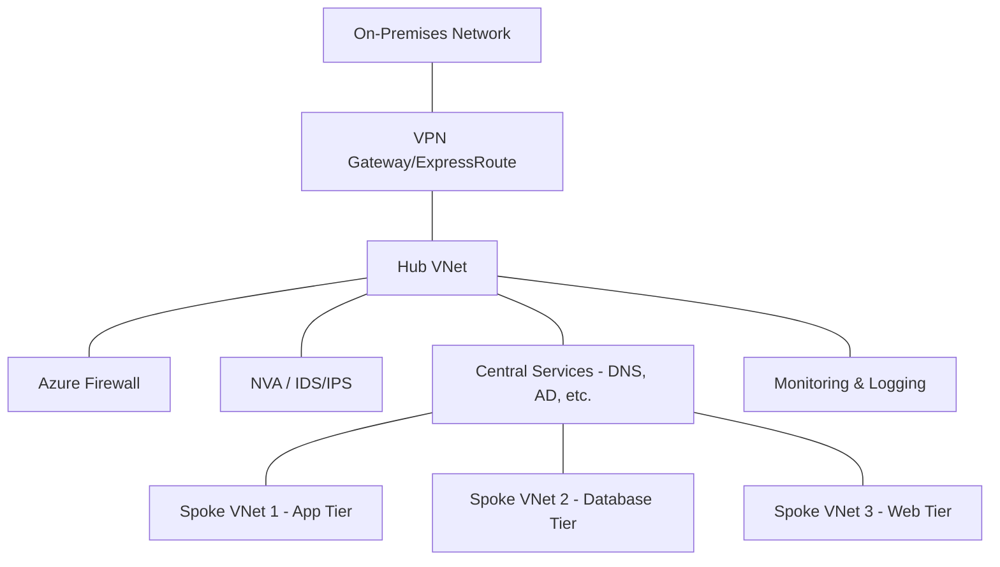
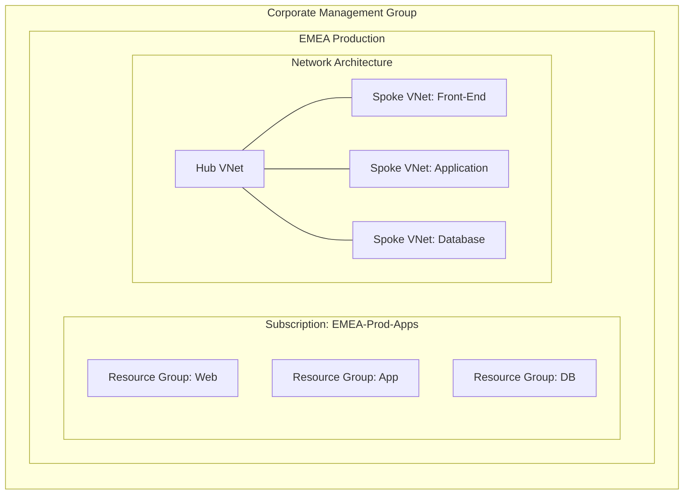

# Disclaimer
This repository contains information collected from various online sources and/or generated by AI assistants. The content provided here is for informational purposes only and is intended to serve as a general reference on various topics.

# Azure Architecture – The Ultimate Comprehensive Deep Dive for Administrators

---

## Table of Contents

1. [Introduction](#introduction)
2. [Core Azure Components](#core-azure-components)
   - [Azure Subscriptions](#azure-subscriptions)
   - [Resource Groups](#resource-groups)
   - [Management Groups](#management-groups)
3. [Networking in Azure](#networking-in-azure)
   - [Virtual Networks (VNets)](#virtual-networks-vnets)
   - [Hub‑Spoke Network Topology](#hub‑spoke-network-topology)
   - [Virtual Network Peering](#virtual-network-peering)
   - [Network Security: NSGs, Azure Firewall, and Beyond](#network-security)
4. [Identity and Access Management](#identity-and-access-management)
   - [Azure Active Directory (AAD)](#azure-active-directory-aad)
   - [Role‑Based Access Control (RBAC)](#role‑based-access-control-rbac)
   - [Privileged Identity Management (PIM)](#privileged-identity-management-pim)
   - [Conditional Access and Identity Protection](#conditional-access-and-identity-protection)
5. [Governance and Compliance](#governance-and-compliance)
   - [Azure Policy and Initiatives](#azure-policy-and-initiatives)
   - [Resource Tagging and Naming Conventions](#resource-tagging-and-naming-conventions)
   - [Management Groups for Governance](#management-groups-for-governance)
6. [Monitoring, Logging, and Diagnostics](#monitoring-logging-and-diagnostics)
   - [Azure Monitor and Metrics](#azure-monitor-and-metrics)
   - [Log Analytics and Kusto Query Language](#log-analytics-and-kusto-query-language)
   - [Alerts, Automation, and Incident Response](#alerts-automation-and-incident-response)
7. [Cost Management and Optimization](#cost-management-and-optimization)
   - [Budgeting and Cost Analysis](#budgeting-and-cost-analysis)
   - [Reserved Instances and Savings Plans](#reserved-instances-and-savings-plans)
   - [Tagging, Cost Allocation, and Chargeback Models](#tagging-cost-allocation-and-chargeback-models)
8. [Backup, Disaster Recovery, and High Availability](#backup-disaster-recovery-and-high-availability)
   - [Azure Backup and Recovery Services](#azure-backup-and-recovery-services)
   - [Site Recovery and Geo-Redundancy](#site-recovery-and-geo-redundancy)
   - [High Availability Options: Availability Sets and Zones](#high-availability-options)
9. [Automation and Infrastructure as Code](#automation-and-infrastructure-as-code)
   - [ARM Templates, Bicep, and Terraform](#arm-templates-bicep-and-terraform)
   - [Azure DevOps and CI/CD Pipelines](#azure-devops-and-ci-cd-pipelines)
   - [Automation Runbooks and PowerShell DSC](#automation-runbooks-and-powershell-dsc)
10. [Advanced Deployment Patterns and Best Practices](#advanced-deployment-patterns-and-best-practices)
    - [Blue/Green Deployments and Canary Releases](#bluegreen-deployments-and-canary-releases)
    - [Service Mesh and Microservices Architecture](#service-mesh-and-microservices-architecture)
    - [Containerization and Kubernetes on Azure](#containerization-and-kubernetes-on-azure)
11. [Security Best Practices](#security-best-practices)
    - [Data Encryption and Key Management](#data-encryption-and-key-management)
    - [Application Security and Web Application Firewalls](#application-security-and-web-application-firewalls)
    - [DDoS Protection and Threat Intelligence](#ddos-protection-and-threat-intelligence)
12. [Case Study: Enterprise‑Grade Azure Environment](#case-study-enterprise-grade-azure-environment)
    - [Scenario Overview](#scenario-overview)
    - [Step‑by‑Step Architectural Design](#step-by-step-architectural-design)
    - [Diagrams and Tables](#diagrams-and-tables)
13. [Appendices and Additional Resources](#appendices-and-additional-resources)
    - [Glossary of Terms](#glossary-of-terms)
    - [Further Reading and Resources](#further-reading-and-resources)
14. [Conclusion](#conclusion)
15. [References](#references)

---

## 1. Introduction

As enterprises migrate from traditional on‑premises data centers to cloud environments, Azure has become a central platform for scalable, secure, and cost‑effective IT infrastructure. This document offers an in‑depth examination of Azure’s architectural components from a system administrator’s perspective. The focus is on building resilient architectures that balance high availability, strong security, and streamlined management through modern practices such as Infrastructure as Code (IaC), continuous integration/continuous deployment (CI/CD), and centralized governance.

In the sections that follow, we will dissect each fundamental building block of Azure architecture and explore advanced topics that are critical to managing large‑scale enterprise deployments. Whether you are designing new environments or optimizing existing ones, this guide is intended to serve as a robust reference.

---

## 2. Core Azure Components

A robust Azure environment starts with a solid foundation. In this section, we delve into the core constructs—subscriptions, resource groups, and management groups—that form the backbone of Azure resource organization and management.

### 2.1 Azure Subscriptions

**Definition & Purpose:**  
An Azure subscription acts as a billing container, a security boundary, and an administrative unit. It aggregates services, resources, and deployments that share a single billing account. Each subscription isolates resource usage, making it easier to manage costs and enforce security policies.

**Key Considerations:**

- **Isolation:**  
  Isolate workloads by using separate subscriptions for production, development, testing, and staging environments. This not only simplifies cost tracking but also limits the blast radius in case of security breaches or misconfigurations.

- **Billing and Cost Management:**  
  Each subscription has its own billing data, allowing you to allocate costs by department, team, or project. You can monitor expenditures using Azure Cost Management and set up budgets and alerts to avoid overruns.

- **Access Control:**  
  Apply Role‑Based Access Control (RBAC) at the subscription level to delegate administrative privileges without exposing the entire environment.

- **Scalability:**  
  In very large organizations, multiple subscriptions can be grouped using management groups for easier policy enforcement and consolidated management.

### 2.2 Resource Groups

**Definition & Purpose:**  
Resource groups are logical containers within a subscription that hold related resources. They simplify the management of resources that share a common lifecycle or serve a single application.

**Advantages:**

- **Logical Organization:**  
  Group resources by application, service tier, or geographical location. This grouping aids in applying tags, policies, and access controls consistently.

- **Lifecycle Management:**  
  Resource groups allow bulk operations such as deployment, monitoring, updating, or deletion. For example, decommissioning an entire environment can be achieved by deleting its associated resource group.

- **Access and Delegation:**  
  Set RBAC policies at the resource group level to manage access without affecting resources outside the group.

- **Cost Attribution:**  
  Tagging within resource groups allows for more granular cost analysis and chargeback mechanisms.

### 2.3 Management Groups

**Definition & Purpose:**  
Management groups are a higher‑level container for organizing subscriptions into a hierarchical structure. They facilitate policy enforcement and role assignments across multiple subscriptions.

**Benefits:**

- **Centralized Policy Management:**  
  Apply Azure Policies and RBAC roles at the management group level to ensure compliance across all child subscriptions.

- **Scalability:**  
  Especially useful for organizations with numerous subscriptions, management groups provide a unified framework for governance.

- **Delegated Administration:**  
  Create management group hierarchies that mirror your organizational structure—such as by business unit, geography, or function—to delegate administrative responsibilities effectively.

- **Simplified Auditing:**  
  By enforcing and monitoring policies from a central point, management groups ease compliance audits and security assessments.

---

## 3. Networking in Azure

Networking is a critical component of any Azure architecture. In this section, we cover the design and management of virtual networks (VNets), delve into the hub‑spoke topology, and discuss essential connectivity and security measures.

### 3.1 Virtual Networks (VNets)

**Definition:**  
Virtual Networks (VNets) are logically isolated networks within Azure that provide secure communication between resources. They are the primary means to segment and protect resources in the cloud.

**Key Features:**

- **IP Addressing:**  
  VNets are assigned IP address spaces using RFC1918 private IP ranges. Planning non‑overlapping address ranges is crucial to avoid conflicts, especially when peering with other VNets or connecting to on‑premises networks.

- **Subnets:**  
  Within a VNet, you can divide the network into subnets. Each subnet can be assigned its own network security groups (NSGs) and route tables for enhanced security and traffic control.

- **DNS Integration:**  
  VNets can be configured with custom DNS servers or use Azure’s default DNS resolution services to facilitate service discovery and communication.

- **Service Endpoints & Private Links:**  
  Leverage service endpoints and private links to ensure that traffic between Azure services remains within the Azure backbone, thereby enhancing security.

**Best Practices:**

- **Plan IP Schemes Carefully:**  
  Use a hierarchical IP addressing plan that accommodates future growth and connectivity needs. Reserve address spaces for future VNets if necessary.

- **Segment by Function:**  
  Isolate critical workloads into separate subnets with strict NSG rules to minimize exposure.

- **Integrate with On‑Premises Networks:**  
  Use VPN or ExpressRoute gateways to securely connect on‑premises data centers to Azure VNets.

### 3.2 Hub‑Spoke Network Topology

**Concept Overview:**  
The hub‑spoke topology is a common pattern that centralizes shared services and connectivity while isolating application workloads. The “hub” acts as a central point for services like firewalls, VPN gateways, and monitoring tools, whereas “spokes” host specific workloads.

**Advantages:**

- **Centralized Security & Connectivity:**  
  The hub centralizes common services such as identity, security appliances, and logging systems. This simplifies policy enforcement and network monitoring.

- **Workload Isolation:**  
  Each spoke is isolated from other spokes, which improves security and fault isolation. If one spoke experiences issues, others remain unaffected.

- **Scalability and Flexibility:**  
  New spokes can be added with minimal impact on the hub, allowing for seamless growth and deployment of new applications.

**Detailed Topology Considerations:**

- **Routing and Traffic Flow:**  
  Configure route tables so that traffic from each spoke routes through the hub for inspection or filtering. This might involve forced tunnelling via the hub VNet.
  
- **Security Appliances in the Hub:**  
  Deploy Azure Firewall, third‑party Network Virtual Appliances (NVAs), or IDS/IPS systems in the hub to inspect and filter traffic from spokes.

- **Inter‑Spoke Connectivity:**  
  If necessary, configure peering between spokes with appropriate security controls while still routing through the hub for centralized logging.

#### Diagram: Hub‑Spoke Network Overview

*Figure 1: A detailed hub‑spoke network topology demonstrating centralized security and isolated application segments.*

### 3.3 Virtual Network Peering

**Definition & Purpose:**  
Virtual network peering connects two Azure VNets, enabling them to communicate privately as if they were on the same network. This is critical for scenarios where multiple VNets must interact without traversing the public internet.

**Key Considerations:**

- **Low Latency, High Bandwidth:**  
  Peering leverages Azure’s high‑speed backbone network, providing low‑latency communication between VNets.

- **Transitive Routing Limitations:**  
  While peering connects two networks, transitive peering (routing through a peered network to a third network) is not allowed by default. Plan your topology accordingly.

- **Cross‑Region Peering:**  
  Azure supports VNet peering across regions, which is useful for global deployments but requires careful planning of latency and cost implications.

### 3.4 Network Security: NSGs, Azure Firewall, and Beyond

**Network Security Groups (NSGs):**  
NSGs act as virtual firewalls that control inbound and outbound traffic at both the subnet and network interface levels. They enforce granular security policies based on IP addresses, ports, and protocols.

- **Rules & Prioritization:**  
  NSG rules are processed in order of priority. Define explicit rules for critical services and ensure that default rules do not inadvertently allow unwanted traffic.

- **Logging and Monitoring:**  
  Enable NSG flow logs to track traffic patterns, which can be useful for troubleshooting and forensic analysis.

**Azure Firewall:**  
Azure Firewall is a managed, cloud‑based network security service that protects your Azure VNets with stateful packet inspection, high availability, and centralized logging.

- **Advanced Threat Protection:**  
  Azure Firewall integrates with threat intelligence feeds to block known malicious IP addresses and domains.
  
- **Integration with Hub‑Spoke:**  
  In a hub‑spoke topology, Azure Firewall can be deployed in the hub to enforce policies across multiple spokes.

**Additional Network Security Tools:**

- **DDoS Protection:**  
  Azure’s DDoS Protection service safeguards your applications from large‑scale attacks. It provides always‑on monitoring and adaptive tuning of mitigation policies.

- **Web Application Firewall (WAF):**  
  Integrated with Azure Application Gateway, WAF protects web applications by filtering and monitoring HTTP traffic and blocking common exploits.

- **Network Virtual Appliances (NVAs):**  
  NVAs from third‑party vendors can be deployed to meet specialized security or traffic management needs.

---

## 4. Identity and Access Management

A secure Azure environment is built on robust identity and access management practices. This section provides an in‑depth look at Azure Active Directory, RBAC, PIM, and additional identity protection strategies.

### 4.1 Azure Active Directory (AAD)

**Overview:**  
Azure Active Directory is the cloud‑based identity and access management service at the heart of Microsoft’s cloud ecosystem. AAD provides authentication, authorization, and identity management for both internal and external users.

**Key Features:**

- **Single Sign‑On (SSO):**  
  Simplifies user access across multiple applications with a single set of credentials.
  
- **Multi‑Factor Authentication (MFA):**  
  Enforces a second factor of authentication, significantly reducing the risk of credential compromise.
  
- **Self‑Service Password Reset:**  
  Empowers users to reset their own passwords securely, reducing the load on IT support.

- **Application Integration:**  
  Integrates with thousands of SaaS applications, as well as on‑premises apps via federation.

**Best Practices:**

- **Enable MFA for All Users:**  
  Especially for administrative accounts, always require MFA to mitigate risk.

- **Implement Conditional Access Policies:**  
  Define policies based on user, device, location, and risk profile to enforce granular access controls.

- **Regularly Audit Directory Roles:**  
  Maintain the principle of least privilege by periodically reviewing user roles and permissions.

### 4.2 Role‑Based Access Control (RBAC)

**Overview:**  
RBAC is a fundamental Azure feature that grants permissions based on roles assigned to users, groups, or service principals at different scopes—from the management group to individual resources.

**Components:**

- **Roles:**  
  Pre‑defined roles (e.g., Owner, Contributor, Reader) or custom roles that aggregate specific permissions.

- **Role Assignments:**  
  The act of binding a role to a security principal at a given scope.

- **Scopes:**  
  RBAC scopes include management groups, subscriptions, resource groups, and individual resources. Scopes are hierarchical, meaning permissions assigned at a higher level cascade to lower levels unless explicitly overridden.

**Table: Common RBAC Roles**

| Role                      | Permissions                                               | Common Use Case                                            |
| ------------------------- | --------------------------------------------------------- | ---------------------------------------------------------- |
| Owner                     | Full control, including RBAC management                   | Administrators requiring full management capabilities      |
| Contributor               | Can create and manage all types of resources, but no role assignments | Developers deploying applications                          |
| Reader                    | View-only access to resources                             | Auditors or users needing read‑only access                 |
| User Access Administrator | Manage user access and role assignments                   | Delegated administrators focusing solely on access control  |

**Best Practices:**

- **Principle of Least Privilege:**  
  Assign the minimal permissions required for a task and regularly review assignments for unnecessary privileges.

- **Use Custom Roles When Necessary:**  
  When built‑in roles do not meet your needs, define custom roles tailored to specific job functions.

### 4.3 Privileged Identity Management (PIM)

**Overview:**  
Privileged Identity Management (PIM) helps organizations manage, control, and monitor access to critical Azure resources. It is particularly important for controlling elevated permissions and reducing the risk of misuse.

**Core Features:**

- **Just‑In‑Time (JIT) Access:**  
  Provides temporary elevated access to resources rather than permanently assigning privileged roles.
  
- **Approval Workflows:**  
  Requests for elevated permissions can require approval by designated administrators, ensuring that elevated access is justified and temporary.

- **Access Reviews:**  
  Regular reviews of privileged roles help to ensure that access remains appropriate and revoke privileges that are no longer needed.

- **Audit Trails:**  
  Detailed logs capture every activation, role assignment, and administrative action, facilitating compliance and forensic investigations.

**Implementation Considerations:**

- **Integrate with RBAC:**  
  Use PIM to complement RBAC by controlling the activation of high‑privilege roles.
  
- **Define Activation Policies:**  
  Configure policies that require multi‑factor authentication, justifications, and time‑bound activation.

### 4.4 Conditional Access and Identity Protection

**Conditional Access:**  
Conditional Access policies dynamically enforce access controls based on conditions such as user location, device compliance, and risk scores. For example, a user connecting from an unfamiliar IP address might be required to complete MFA or even be blocked.

- **Policy Layers:**  
  Configure policies that provide multiple layers of defense—such as requiring compliant devices, MFA, and real‑time risk evaluation.

- **Integration with Identity Protection:**  
  Azure AD Identity Protection uses machine learning to detect suspicious sign‑in activities and automatically trigger conditional access policies.

**Identity Protection Best Practices:**

- **Monitor Risky Sign‑Ins:**  
  Use Identity Protection to monitor and respond to suspicious activity in real time.
  
- **Configure Automated Remediation:**  
  Set up policies that automatically block or challenge risky sign‑ins based on defined thresholds.

---

## 5. Governance and Compliance

Effective governance ensures that your Azure environment remains compliant, secure, and cost‑effective. This section explores how to enforce standards using Azure Policy, resource tagging, and hierarchical management groups.

### 5.1 Azure Policy and Initiatives

**Azure Policy Overview:**  
Azure Policy enables you to create and enforce rules on your resources. Policies can ensure that resources adhere to naming conventions, location restrictions, tag usage, and other corporate standards.

- **Policy Definitions:**  
  Create JSON‑based definitions that include rules and effects. For example, a policy might prevent the creation of resources in non‑approved regions.

- **Initiatives:**  
  Group multiple policies into a single initiative to streamline management. This is particularly useful for large environments where multiple policies must be applied together.

- **Compliance Reporting:**  
  Azure Policy includes dashboards and reports to track compliance status and help identify non‑compliant resources.

### 5.2 Resource Tagging and Naming Conventions

**Resource Tagging:**  
Tags are key‑value pairs that help categorize resources. They are essential for cost management, operational management, and compliance.

- **Tagging Strategy:**  
  Define a consistent tagging strategy (e.g., environment, department, application, cost center) to allow for granular reporting and cost allocation.
  
- **Automated Tag Enforcement:**  
  Use Azure Policy to enforce tag usage, ensuring that all resources include required tags upon creation.

**Naming Conventions:**  
Adopt naming conventions that provide clarity and consistency. Standardized names make it easier to identify the purpose, environment, and ownership of resources.

- **Examples:**  
  A virtual machine for production might be named “prod-vm-web01,” while a development storage account might be “devstg01.”

### 5.3 Management Groups for Governance

**Revisited Use of Management Groups:**  
Management groups are not just for organizing subscriptions; they are a critical component of governance. They allow policies, RBAC roles, and compliance audits to be applied across multiple subscriptions uniformly.

- **Hierarchical Structures:**  
  Build a hierarchy that reflects your organizational structure (e.g., Corporate > Division > Department). This structure simplifies the enforcement of common policies and role assignments.

- **Delegation of Administration:**  
  By applying RBAC at the management group level, you can delegate responsibilities and ensure that local administrators operate within the broader governance framework.

---

## 6. Monitoring, Logging, and Diagnostics

Monitoring and diagnostics are essential for ensuring operational health, performance, and security. This section covers Azure Monitor, Log Analytics, and related automation for incident response.

### 6.1 Azure Monitor and Metrics

**Overview:**  
Azure Monitor provides a unified solution for collecting, analyzing, and acting on telemetry from your Azure environment. It helps you maintain performance, availability, and security.

- **Metrics Collection:**  
  Collect key performance metrics such as CPU usage, memory consumption, network traffic, and disk I/O. These metrics provide insights into resource health and performance trends.

- **Custom Dashboards:**  
  Build dashboards that aggregate metrics from various services into a single view, making it easier to monitor the overall state of your environment.

### 6.2 Log Analytics and Kusto Query Language

**Log Analytics:**  
Log Analytics is the engine behind Azure Monitor’s logging capabilities. It aggregates log data from various sources into a central repository.

- **Querying Logs:**  
  Use Kusto Query Language (KQL) to query and analyze logs. For example, you can write queries to detect anomalies or correlate events across multiple resources.

- **Integrating with Alerts:**  
  Configure queries to trigger alerts when certain thresholds are met (e.g., sudden spikes in error logs or unusual login patterns).

### 6.3 Alerts, Automation, and Incident Response

**Alerts and Notifications:**  
Set up alerts based on predefined metrics or log queries. These alerts can notify administrators via email, SMS, or integration with ITSM tools.

- **Action Groups:**  
  Define action groups that include recipients and automated remediation scripts. This ensures a rapid response when issues are detected.

**Automation Runbooks:**  
Automate responses to common incidents using Azure Automation. Runbooks can perform tasks such as restarting services, scaling resources, or remediating configuration drifts.

- **PowerShell and Python Integration:**  
  Write runbooks in PowerShell, Python, or other supported languages to integrate with existing workflows.
  
- **Continuous Improvement:**  
  Regularly review and update automation scripts to ensure they align with current operational procedures and security standards.

---

## 7. Cost Management and Optimization

Managing costs effectively is critical in any cloud environment. Azure provides multiple tools and strategies to help you optimize spending and ensure budget adherence.

### 7.1 Budgeting and Cost Analysis

**Cost Analysis Tools:**  
Azure Cost Management provides detailed insights into your spending. It breaks down costs by resource, resource group, and subscription.

- **Budgets and Alerts:**  
  Set budgets for subscriptions and resource groups. Alerts can notify you when spending approaches or exceeds set thresholds.

- **Forecasting and Recommendations:**  
  Use historical data and predictive analytics to forecast future spending. Azure Advisor and Cost Management provide recommendations on rightsizing resources and eliminating waste.

### 7.2 Reserved Instances and Savings Plans

**Reserved Instances (RIs):**  
Commit to one‑ or three‑year reservations for virtual machines and other services to benefit from significant cost savings.

- **Selection Criteria:**  
  Evaluate usage patterns to decide which instances to reserve. Use tools to forecast utilization and choose appropriate RI terms.

- **Flexibility and Exchange:**  
  Azure allows you to exchange or cancel RIs in some scenarios, providing flexibility as workloads evolve.

**Savings Plans:**  
For services like Azure SQL or compute services, savings plans provide discounts when you commit to a certain level of usage.

### 7.3 Tagging, Cost Allocation, and Chargeback Models

**Detailed Cost Allocation:**  
Implement a tagging strategy to attribute costs to departments, projects, or business units. This is essential for internal chargeback models.

- **Cost Allocation Reports:**  
  Generate reports that map expenses to tags, enabling precise cost attribution.
  
- **Chargeback and Showback:**  
  Use these reports to implement chargeback (actual billing) or showback (transparency in spending) models within your organization.

---

## 8. Backup, Disaster Recovery, and High Availability

Ensuring business continuity is paramount. This section details Azure Backup, disaster recovery (DR) strategies, and high availability (HA) configurations.

### 8.1 Azure Backup and Recovery Services

**Azure Backup:**  
A fully managed service that protects your data, applications, and VMs from data loss.

- **Backup Policies:**  
  Define backup schedules and retention policies. Automated backups reduce the risk of human error.
  
- **Incremental Backups:**  
  Use incremental backups to minimize storage usage and reduce backup windows.

### 8.2 Site Recovery and Geo‑Redundancy

**Azure Site Recovery (ASR):**  
ASR replicates workloads from primary to secondary locations, ensuring minimal downtime during a disaster.

- **Replication:**  
  Configure replication settings based on your Recovery Point Objective (RPO) and Recovery Time Objective (RTO). Use ASR for both physical and virtualized workloads.

- **Failover Testing:**  
  Regularly test failover processes without impacting production environments to ensure readiness.

**Geo‑Redundancy:**  
Implement geo‑redundant storage and database configurations (e.g., Active‑Geo Replication in SQL Database) to safeguard against regional outages.

### 8.3 High Availability Options: Availability Sets and Zones

**Availability Sets:**  
Group VMs into availability sets to ensure that not all VMs are placed on the same physical hardware.

- **Fault Domains and Update Domains:**  
  Understand the distinction between fault domains (physical hardware isolation) and update domains (planned maintenance groups).

**Availability Zones:**  
Deploy resources across physically separated zones within a region. This ensures that a data center outage does not affect overall service availability.

- **Zonal and Zone‑Redundant Services:**  
  Evaluate which services support zonal deployment versus zone‑redundant configurations.

---

## 9. Automation and Infrastructure as Code

Automation is essential for consistency, repeatability, and efficiency. In this section, we cover Infrastructure as Code (IaC), CI/CD, and various automation tools.

### 9.1 ARM Templates, Bicep, and Terraform

**ARM Templates:**  
Declarative JSON files that describe the infrastructure and configuration for your Azure resources.

- **Idempotency:**  
  ARM templates are idempotent, meaning they can be applied repeatedly without changing the final state.
  
- **Parameterization:**  
  Use parameters and variables to make templates reusable and adaptable to different environments.

**Bicep:**  
A domain‑specific language that simplifies ARM template authoring.

- **Simplified Syntax:**  
  Bicep reduces complexity by abstracting away some of the verbosity of JSON.
  
- **Seamless Integration:**  
  Bicep compiles directly to ARM templates, ensuring full compatibility with Azure deployments.

**Terraform:**  
An open‑source IaC tool that supports multiple cloud providers, including Azure.

- **State Management:**  
  Terraform maintains a state file that tracks resource changes over time.
  
- **Modularity:**  
  Use modules to encapsulate and reuse resource definitions across environments.

### 9.2 Azure DevOps and CI/CD Pipelines

**Azure DevOps:**  
Provides a complete suite for source control, build automation, testing, and deployment.

- **Repositories and Version Control:**  
  Store ARM templates, Bicep files, or Terraform scripts in Git repositories.
  
- **Pipelines:**  
  Automate the build, test, and deployment process with YAML‑based pipelines.
  
- **Integration with IaC:**  
  Automatically deploy infrastructure changes upon successful code reviews and testing.

### 9.3 Automation Runbooks and PowerShell DSC

**Azure Automation:**  
Automate routine tasks using runbooks written in PowerShell or Python.

- **Scheduled Tasks:**  
  Automate tasks such as scaling, backup validations, or log cleanups.
  
- **Integration with Alerts:**  
  Link runbooks to alerts for automated remediation of incidents.

**PowerShell Desired State Configuration (DSC):**  
Enforce configuration consistency on Windows-based systems.

- **Declarative Configuration:**  
  DSC allows you to define the desired state of your servers and automatically correct deviations.
  
- **Integration with Azure Automation:**  
  Use DSC within runbooks to maintain configuration compliance.

---

## 10. Advanced Deployment Patterns and Best Practices

This section explores advanced deployment patterns and modern practices that enhance deployment speed, reliability, and maintainability.

### 10.1 Blue/Green Deployments and Canary Releases

**Blue/Green Deployments:**  
Maintain two identical production environments (blue and green) to reduce downtime during deployments.

- **Seamless Switching:**  
  Traffic is directed to one environment while the other is updated, then switched back once the update is validated.

**Canary Releases:**  
Deploy new features to a small subset of users before a full rollout.

- **Incremental Rollouts:**  
  Monitor the performance and stability of new features with a fraction of traffic before wider deployment.
  
- **Risk Mitigation:**  
  Quickly roll back changes if issues are detected in the canary environment.

### 10.2 Service Mesh and Microservices Architecture

**Service Mesh:**  
An infrastructure layer for facilitating service‑to‑service communication in microservices architectures.

- **Sidecar Proxies:**  
  Use sidecar containers (e.g., Istio or Linkerd) to manage communication, security, and monitoring between services.
  
- **Observability:**  
  A service mesh provides detailed metrics, logs, and traces for inter‑service calls.

**Microservices Architecture:**  
Design applications as a collection of small, independent services.

- **Scalability and Resilience:**  
  Microservices allow for independent scaling and resilience in case one component fails.
  
- **Deployment Flexibility:**  
  Each microservice can be updated or deployed independently, reducing risk during upgrades.

### 10.3 Containerization and Kubernetes on Azure

**Containers and AKS:**  
Azure Kubernetes Service (AKS) is a managed Kubernetes solution that simplifies container orchestration.

- **Container Registries:**  
  Use Azure Container Registry (ACR) to store and manage container images.
  
- **Scaling and Auto‑Healing:**  
  Leverage Kubernetes’ native scaling and self‑healing features to maintain application performance and availability.

- **CI/CD Integration:**  
  Integrate container builds and deployments into your CI/CD pipelines for rapid, automated rollouts.

---

## 11. Security Best Practices

Security is a multi‑layered discipline in Azure. This section details best practices for data encryption, application security, and network protection.

### 11.1 Data Encryption and Key Management

**Encryption at Rest:**  
Azure encrypts data at rest using services such as Storage Service Encryption (SSE) and Transparent Data Encryption (TDE) for databases.

- **Encryption Protocols:**  
  Ensure that sensitive data is encrypted using industry‑standard protocols.
  
- **Key Management:**  
  Use Azure Key Vault to securely manage encryption keys, secrets, and certificates.

### 11.2 Application Security and Web Application Firewalls

**Secure Coding Practices:**  
Adopt secure coding practices to prevent vulnerabilities like SQL injection, cross‑site scripting (XSS), and other attacks.

- **Security Testing:**  
  Integrate static and dynamic code analysis into your CI/CD pipelines.

**Web Application Firewall (WAF):**  
Protect web applications by deploying WAF solutions on Azure Application Gateway or other supported services.

- **Rule Sets and Custom Rules:**  
  Customize WAF rules to meet your application’s specific security requirements.

### 11.3 DDoS Protection and Threat Intelligence

**DDoS Protection:**  
Leverage Azure’s DDoS Protection plans to mitigate distributed denial‑of‑service attacks.

- **Adaptive Mitigation:**  
  Azure DDoS Protection automatically adjusts to traffic patterns to block malicious traffic while allowing legitimate connections.

**Threat Intelligence:**  
Integrate threat intelligence feeds and security analytics to proactively identify and remediate potential threats.

- **Azure Sentinel:**  
  Use Azure Sentinel as a cloud‑native SIEM for centralized threat detection, investigation, and response.

---

## 12. Case Study: Enterprise‑Grade Azure Environment

This case study provides a step‑by‑step walkthrough of designing an enterprise‑grade Azure environment that integrates all the concepts covered in this document.

### 12.1 Scenario Overview

An international organization is migrating a complex, multi‑tier application from on‑premises data centers to Azure. The goals include:

- **Separation of Environments:**  
  Separate subscriptions and resource groups for development, testing, staging, and production.
  
- **Centralized Connectivity and Security:**  
  Use a hub‑spoke network topology to centralize security services and manage connectivity.
  
- **Robust Identity and Access:**  
  Integrate Azure AD, RBAC, and PIM to enforce strict security measures.
  
- **Resilient Operations:**  
  Implement comprehensive monitoring, backup, and disaster recovery strategies.
  
- **Automated Deployments:**  
  Use Infrastructure as Code and CI/CD pipelines for rapid, consistent deployments.

### 12.2 Step‑by‑Step Architectural Design

#### Step 1: Establishing the Hierarchy

- **Management Groups:**  
  Create a top‑level management group called “Corporate” with sub‑groups for each region or business unit. For instance:  
  - `Corporate/EMEA`  
  - `Corporate/AMER`  
  - `Corporate/APAC`

- **Subscriptions:**  
  Under each management group, create subscriptions for various environments (e.g., Development, Test, Production).  
  - Example:  
    - `EMEA-Prod-Apps`  
    - `EMEA-Test-Apps`

- **Resource Groups:**  
  Within each subscription, organize resources by application or service. For example:  
  - `RG-Web`, `RG-App`, and `RG-DB` for a multi‑tier application.

#### Step 2: Network Design

- **Hub VNet:**  
  Deploy a central hub virtual network in each region that includes:  
  - VPN Gateway/ExpressRoute for on‑premises connectivity.  
  - Azure Firewall and NVAs for centralized security.  
  - Shared services such as DNS, Active Directory (via Azure AD Connect), and monitoring systems.

- **Spoke VNets:**  
  Create multiple spoke VNets for different application tiers. Configure VNet peering with the hub to ensure all traffic passes through the central security layer.

- **Routing and NSGs:**  
  Define route tables to force traffic from spokes through the hub for inspection. Apply NSGs on subnets and NICs for fine‑grained control.

#### Step 3: Identity and Access Management

- **Azure AD Configuration:**  
  Set up a centralized Azure Active Directory tenant to manage all identities.  
  - Enable MFA for all administrative accounts.  
  - Configure Conditional Access policies based on risk, location, and device compliance.

- **RBAC Implementation:**  
  Define roles and assign them at the subscription and resource group levels.  
  - Example: Assign “Contributor” role to developers in test environments but restrict production access to “Reader” or custom minimal roles.

- **PIM Deployment:**  
  Enable PIM for privileged roles.  
  - Configure JIT access with an approval process.  
  - Schedule periodic access reviews to ensure permissions remain appropriate.

#### Step 4: Governance and Compliance

- **Azure Policy:**  
  Write policies to enforce:  
  - Allowed resource locations (e.g., only approved regions).  
  - Tagging requirements and naming conventions.
  
- **Initiatives:**  
  Group related policies into initiatives and assign them at the management group level.

- **Tagging Strategy:**  
  Define a standard tagging schema (e.g., Environment, Department, CostCenter) and enforce it using policies.

#### Step 5: Monitoring and Diagnostics

- **Azure Monitor:**  
  Deploy Azure Monitor agents on all VMs and services.  
  - Collect performance metrics and custom logs.
  
- **Log Analytics Workspace:**  
  Create a centralized Log Analytics workspace to aggregate logs from multiple subscriptions.  
  - Define queries to identify anomalies, errors, and performance issues.
  
- **Alerts and Automation:**  
  Configure alerts for critical metrics and integrate them with action groups.  
  - Link alerts to Azure Automation runbooks for automated remediation (e.g., restarting a failed service).

#### Step 6: Cost Management and Optimization

- **Budgeting:**  
  Set budgets for each subscription and resource group.  
  - Use cost analysis reports to track spending.
  
- **Right‑Sizing and Reservations:**  
  Analyze resource usage patterns using Azure Advisor and implement right‑sizing strategies.  
  - Commit to Reserved Instances where applicable.

#### Step 7: Backup, Disaster Recovery, and High Availability

- **Backup Solutions:**  
  Deploy Azure Backup for VMs, databases, and critical files.  
  - Define backup schedules and retention policies.
  
- **Site Recovery:**  
  Configure Azure Site Recovery for critical workloads to ensure minimal downtime during regional outages.
  
- **High Availability:**  
  Use Availability Sets and Zones to ensure that application tiers remain operational during maintenance or hardware failures.

#### Step 8: Automation and CI/CD

- **Infrastructure as Code (IaC):**  
  Store ARM, Bicep, or Terraform templates in Azure DevOps repositories.  
  - Use parameterization to tailor deployments for different environments.
  
- **CI/CD Pipelines:**  
  Set up Azure Pipelines to automate build, test, and deployment processes for both applications and infrastructure.
  
- **Runbooks:**  
  Develop runbooks for recurring tasks (e.g., scaling, backup verification) and link them with alert triggers.

### 12.3 Diagrams and Tables

#### Enterprise Architecture Diagram

*Figure 2: Enterprise‑grade architecture showing management groups, subscriptions, resource groups, and hub‑spoke networking.*

#### Role Assignment Table (Extended)

| Role                        | Scope                   | Permissions and Use Case                                             | Notes                                                  |
| --------------------------- | ----------------------- | ---------------------------------------------------------------------| ------------------------------------------------------ |
| Global Administrator        | Azure AD                | Full control over all Azure AD and integrated Microsoft 365 services  | Critical for identity management                     |
| Subscription Owner          | Subscription            | Full administrative access, including RBAC and policy management       | Typically limited to a small group of senior admins   |
| Resource Group Contributor  | Resource Group          | Manage all resources within the group (deploy, update, delete)           | Common for development teams                          |
| Virtual Machine Operator    | Specific Resource       | Manage VM lifecycle without full access to network or storage settings   | Ideal for operations teams managing VMs               |
| Network Administrator       | Virtual Network/Subnet  | Configure NSGs, VPN, ExpressRoute, and peering                          | Specialized role for network operations               |
| PIM Administrator           | Azure AD & RBAC         | Manage privileged roles, review access logs, enforce just‑in‑time access  | Ensures temporary access is controlled and audited    |

---

## 13. Appendices and Additional Resources

### 13.1 Glossary of Terms

- **Azure Subscription:** A billing and administrative container for Azure resources.
- **Resource Group:** A logical container grouping related Azure resources.
- **Management Group:** A higher‑level container for organizing subscriptions and enforcing policies.
- **VNet:** Virtual Network, a logically isolated network within Azure.
- **NSG:** Network Security Group, a virtual firewall to control traffic.
- **AAD:** Azure Active Directory, a cloud‑based identity service.
- **RBAC:** Role‑Based Access Control, a method for assigning permissions.
- **PIM:** Privileged Identity Management, a service for managing and auditing elevated access.
- **CI/CD:** Continuous Integration and Continuous Deployment.
- **IaC:** Infrastructure as Code.
- **DDoS:** Distributed Denial of Service.
- **ASR:** Azure Site Recovery.

### 13.2 Further Reading and Resources

- **Azure Official Documentation:**  
  [Microsoft Azure Documentation](https://docs.microsoft.com/azure)
- **Azure Architecture Center:**  
  [Azure Architecture Center](https://docs.microsoft.com/azure/architecture/)
- **Azure Security Best Practices:**  
  [Azure Security Documentation](https://docs.microsoft.com/azure/security/)
- **Azure DevOps Documentation:**  
  [Azure DevOps](https://docs.microsoft.com/azure/devops/)
- **Terraform on Azure:**  
  [Terraform Azure Provider](https://registry.terraform.io/providers/hashicorp/azurerm/latest)

---

## 14. Conclusion

This comprehensive guide has delved into every facet of Azure architecture essential for modern cloud administrators. By covering the foundational elements—such as subscriptions, resource groups, and management groups—and expanding into advanced topics including network design, identity management, automation, cost optimization, and disaster recovery, we have created an exhaustive reference tailored for enterprise environments.

Key takeaways include:

- **Foundational Organization:**  
  Use subscriptions, resource groups, and management groups to logically organize and secure your resources.

- **Network Design:**  
  Implement hub‑spoke architectures and robust security measures (NSGs, Azure Firewall, DDoS Protection) to protect your environment.

- **Identity and Access:**  
  Leverage Azure AD, RBAC, and PIM to enforce the principle of least privilege and manage access dynamically.

- **Governance and Monitoring:**  
  Enforce policies with Azure Policy and monitor system health using Azure Monitor and Log Analytics to maintain operational excellence.

- **Cost and Performance:**  
  Optimize spending through reserved instances, cost analysis, and continuous monitoring of resource usage.

- **Automation and Resilience:**  
  Implement Infrastructure as Code, CI/CD pipelines, and automation runbooks to streamline operations while ensuring high availability and robust disaster recovery.

The strategies and patterns described herein provide a blueprint for building and maintaining secure, scalable, and cost‑efficient Azure environments that meet the demands of modern enterprises.

---

## 15. References

-  – Official Microsoft documentation on Azure subscriptions, resource groups, and management groups.
-  – Detailed guidance on hub‑spoke network topologies and virtual networking best practices.
-  – In‑depth resources on Azure Active Directory, RBAC, and Privileged Identity Management.
-  – Comprehensive guides on Azure Policy, governance, and cost management.
-  – Documentation on Azure Backup, Site Recovery, and high availability architectures.
-  – Best practices for automation, Infrastructure as Code, and CI/CD in Azure environments.

---
