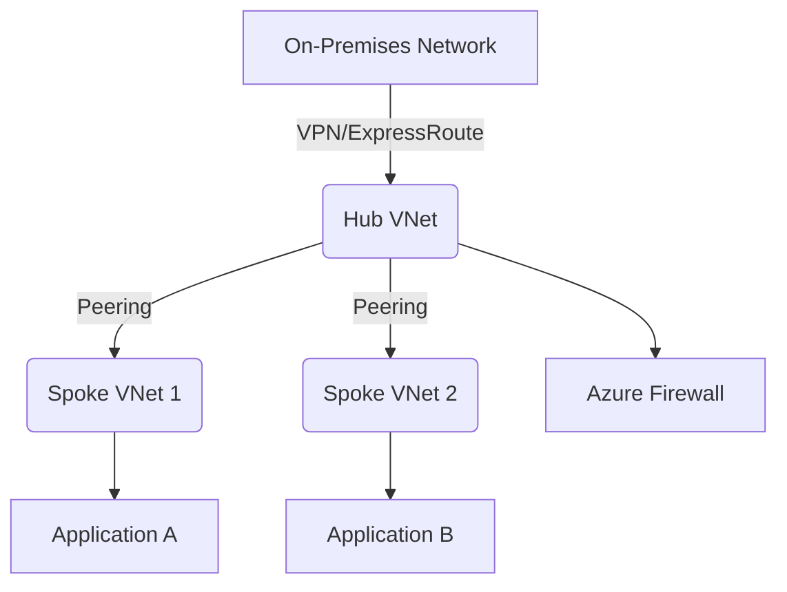
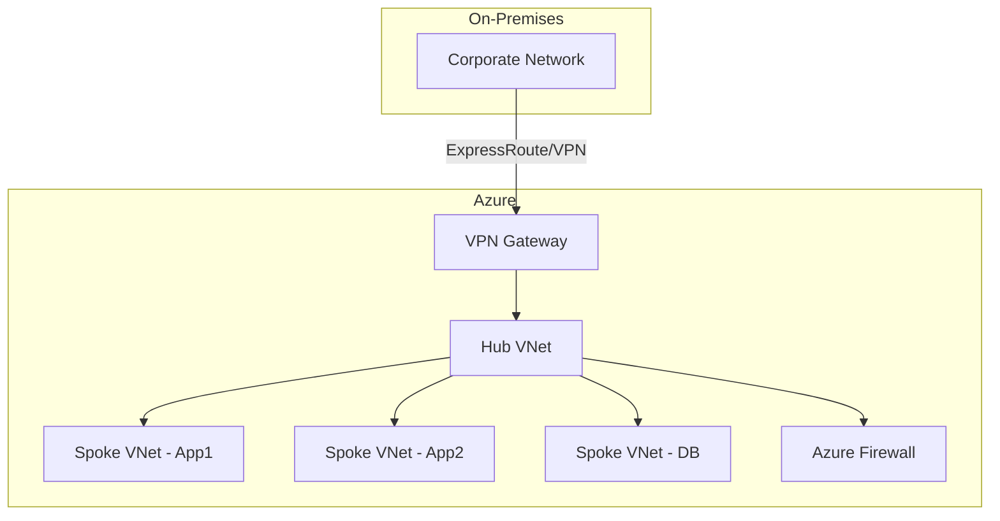

# Disclaimer
This repository contains information collected from various online sources and/or generated by AI assistants. The content provided here is for informational purposes only and is intended to serve as a general reference on various topics.

Below is a comprehensive guide to Azure architecture designed for administrators. This document is written in GitHub-flavored Markdown and covers a wide range of topics including subscriptions, resource groups, hub-spoke configurations, backup methods specific to Azure, and other critical considerations for managing a robust and secure cloud environment. The content is detailed and is structured into sections that include conceptual explanations, best practices, design examples, diagrams, and tables to aid clarity. Enjoy this in-depth exploration of Azure architecture!

---

# Comprehensive Azure Architecture Guide for Administrators

**Table of Contents**

- [1. Introduction](#1-introduction)
- [2. Azure Subscriptions](#2-azure-subscriptions)
  - [2.1 What is a Subscription?](#21-what-is-a-subscription)
  - [2.2 Subscription Management](#22-subscription-management)
  - [2.3 Billing and Cost Management](#23-billing-and-cost-management)
  - [2.4 Security and Access Control at the Subscription Level](#24-security-and-access-control-at-the-subscription-level)
- [3. Resource Groups](#3-resource-groups)
  - [3.1 Purpose and Benefits](#31-purpose-and-benefits)
  - [3.2 Best Practices and Naming Conventions](#32-best-practices-and-naming-conventions)
  - [3.3 Lifecycle Management and Dependency Mapping](#33-lifecycle-management-and-dependency-mapping)
- [4. Management Groups and Governance](#4-management-groups-and-governance)
  - [4.1 Structuring Multiple Subscriptions](#41-structuring-multiple-subscriptions)
  - [4.2 Policy Enforcement and Compliance](#42-policy-enforcement-and-compliance)
- [5. Hub-Spoke Architecture](#5-hub-spoke-architecture)
  - [5.1 Overview and Benefits](#51-overview-and-benefits)
  - [5.2 Design Considerations](#52-design-considerations)
  - [5.3 Network Topology and Connectivity](#53-network-topology-and-connectivity)
  - [5.4 Security and Traffic Management](#54-security-and-traffic-management)
  - [5.5 Example Diagrams and Tables](#55-example-diagrams-and-tables)
- [6. Azure Backup Methods](#6-azure-backup-methods)
  - [6.1 Azure Backup Overview](#61-azure-backup-overview)
  - [6.2 Recovery Services Vault](#62-recovery-services-vault)
  - [6.3 Backup Types and Strategies](#63-backup-types-and-strategies)
  - [6.4 Best Practices and Considerations](#64-best-practices-and-considerations)
- [7. Additional Key Azure Architectural Considerations](#7-additional-key-azure-architectural-considerations)
  - [7.1 Identity and Access Management (Azure AD)](#71-identity-and-access-management-azure-ad)
  - [7.2 Role-Based Access Control (RBAC)](#72-role-based-access-control-rbac)
  - [7.3 Monitoring, Logging, and Diagnostics](#73-monitoring-logging-and-diagnostics)
  - [7.4 Automation and Infrastructure as Code (IaC)](#74-automation-and-infrastructure-as-code-iac)
  - [7.5 Tagging and Resource Organization](#75-tagging-and-resource-organization)
  - [7.6 Azure Policy and Compliance](#76-azure-policy-and-compliance)
- [8. Advanced Architectural Patterns and Tools](#8-advanced-architectural-patterns-and-tools)
  - [8.1 DevOps Integration and CI/CD Pipelines](#81-devops-integration-and-cicd-pipelines)
  - [8.2 Cost Optimization Strategies](#82-cost-optimization-strategies)
  - [8.3 Disaster Recovery and Business Continuity](#83-disaster-recovery-and-business-continuity)
- [9. Conclusion](#9-conclusion)
- [10. Appendix: Sample Diagrams and Tables](#10-appendix-sample-diagrams-and-tables)

---

## 1. Introduction

Azure, Microsoft’s cloud platform, offers a comprehensive set of services and tools that enable organizations to build, deploy, and manage applications at scale. This guide covers the architectural aspects essential for Azure administrators—from setting up subscriptions and organizing resource groups to implementing robust network designs like hub-spoke architectures and ensuring business continuity through effective backup strategies.

The intent of this guide is to provide a step-by-step walkthrough of Azure’s building blocks, combined with practical insights and examples that will assist administrators in designing a secure, scalable, and cost-effective cloud environment. This document is especially useful if you are tasked with managing large-scale deployments, optimizing resource organization, and ensuring high availability and disaster recovery in Azure.

---

## 2. Azure Subscriptions

### 2.1 What is a Subscription?

In the Azure ecosystem, a **subscription** is a logical container used to provision resources and services. Each subscription represents a billing unit and helps in the separation of costs and resource usage. Subscriptions can be used to isolate environments (e.g., development, testing, production), support different departments or projects, and manage access and governance at scale.

Key points about subscriptions include:

- **Isolation:** Each subscription provides a boundary for resource deployment, access control, and billing.
- **Resource Quotas:** Subscriptions come with specific limits and quotas that govern how many resources you can deploy.
- **Billing Unit:** They serve as the primary unit for billing and cost management.
- **Administrative Boundary:** Administrators can delegate management at the subscription level, ensuring that only authorized users can create or modify resources.

### 2.2 Subscription Management

Managing multiple subscriptions effectively is a critical part of Azure architecture. This involves:

- **Subscription Organization:** Structuring subscriptions to separate production, development, and testing environments.
- **Role Assignments:** Using Role-Based Access Control (RBAC) to define who can manage and deploy resources.
- **Delegated Administration:** Splitting responsibilities between global administrators, subscription owners, and resource managers.
- **Cost Analysis:** Monitoring resource usage and spending per subscription to optimize costs.

Administrators often use tools like Azure Cost Management and Azure Advisor to continuously monitor subscription performance, identify anomalies, and manage cost overruns.

### 2.3 Billing and Cost Management

Each subscription is directly linked to billing accounts. Proper management of billing and cost involves:

- **Budgeting:** Setting budgets for each subscription and receiving alerts when spending thresholds are approached.
- **Cost Analysis Tools:** Leveraging Azure Cost Management to view historical usage, forecast future costs, and optimize spending.
- **Cost Allocation:** Using tags and resource groups to allocate costs across different departments or projects.
- **Reserved Instances:** Utilizing reserved instances and other pricing models to reduce costs.

### 2.4 Security and Access Control at the Subscription Level

Ensuring that subscriptions are secure is paramount. Best practices include:

- **Multi-Factor Authentication (MFA):** Enforcing MFA for all administrator accounts.
- **Conditional Access:** Applying conditional access policies to control access based on user location, device, and other risk factors.
- **RBAC:** Implementing Role-Based Access Control to ensure that only authorized users can manage subscription settings and deploy resources.
- **Audit Logs:** Regularly reviewing audit logs and subscription activity to detect unauthorized actions or security breaches.
- **Policy Enforcement:** Applying Azure Policies to enforce compliance and governance across all subscriptions.

---

## 3. Resource Groups

### 3.1 Purpose and Benefits

A **Resource Group** is a container that holds related Azure resources such as virtual machines, web apps, and databases. It is a key organizational unit that simplifies management, monitoring, and billing.

**Benefits include:**

- **Logical Organization:** Grouping related resources makes it easier to manage dependencies.
- **Unified Management:** Enables bulk actions (e.g., applying policies, starting/stopping resources) across the group.
- **Access Control:** RBAC can be applied at the resource group level, streamlining security management.
- **Lifecycle Management:** Resources that share the same lifecycle can be grouped together and managed collectively.

### 3.2 Best Practices and Naming Conventions

For efficient management, consider the following best practices:

- **Naming Conventions:** Develop and enforce a naming convention that reflects the resource’s purpose, environment, and location (e.g., `rg-prod-web-euw` for a production web resource group in West Europe).
- **Environment Segregation:** Create separate resource groups for different environments like development, testing, and production.
- **Tagging:** Use tags extensively to add metadata to resources for easier searching, grouping, and cost allocation.
- **Modularity:** Group resources that share dependencies to reduce complexity in management and deployment.

### 3.3 Lifecycle Management and Dependency Mapping

Resource groups also play an important role in managing the lifecycle of resources:

- **Deployment and Deletion:** Deploy resources together as a single unit; when a resource group is deleted, all contained resources are removed.
- **Dependencies:** Map dependencies within the group to ensure that updates or maintenance activities are coordinated.
- **Versioning:** Use infrastructure as code (IaC) tools such as Azure Resource Manager (ARM) templates or Terraform to version-control resource group configurations.

---

## 4. Management Groups and Governance

### 4.1 Structuring Multiple Subscriptions

For organizations with several subscriptions, **Management Groups** provide an additional level of hierarchy above subscriptions. They are ideal for:

- **Centralized Policy Enforcement:** Apply policies across multiple subscriptions to ensure compliance.
- **Organization Hierarchy:** Create a logical grouping that reflects your organizational structure (e.g., by business unit, geography, or project).
- **Simplified Management:** Manage access and apply RBAC settings at scale.

### 4.2 Policy Enforcement and Compliance

Management Groups are crucial for implementing Azure Policy, a service that enforces organizational standards and assesses compliance at scale:

- **Azure Policy:** Create policies to govern resource deployment, enforce security standards, and prevent misconfigurations.
- **Compliance Dashboard:** Use Azure Policy’s compliance dashboard to monitor adherence across subscriptions and management groups.
- **Remediation:** Automatically remediate non-compliant resources or flag them for administrative review.

---

## 5. Hub-Spoke Architecture

### 5.1 Overview and Benefits

The **Hub-Spoke** network architecture is one of the most popular designs in Azure. In this model, a central hub virtual network (VNet) provides shared services, connectivity, and security functions, while multiple spoke VNets isolate workloads and applications.

**Benefits include:**

- **Centralized Security:** Centralizes network security functions such as firewalls, VPN gateways, and routing.
- **Simplified Connectivity:** Provides a unified model for connecting on-premises networks or other VNets.
- **Cost Efficiency:** Reduces redundancy by centralizing common services.
- **Isolation:** Allows each spoke to have its own security and policy configurations while leveraging shared infrastructure.

### 5.2 Design Considerations

When designing a hub-spoke architecture, consider the following:

- **Hub VNet:** The hub should contain shared resources like a network virtual appliance (NVA), firewall, VPN gateway, or ExpressRoute gateway.
- **Spoke VNets:** Each spoke VNet should be designed for a specific application or workload, ensuring isolation.
- **Peering:** Use VNet peering to connect spokes to the hub while maintaining low-latency and high-throughput connections.
- **Routing:** Configure user-defined routes (UDRs) to direct traffic appropriately between spokes and the hub.
- **Security Boundaries:** Ensure that network security groups (NSGs) and Azure Firewall policies are in place to protect and monitor traffic flows.

### 5.3 Network Topology and Connectivity

Here is a simplified breakdown of a hub-spoke topology:

1. **Hub VNet:** Centralizes connectivity and security.
2. **Spoke VNet 1:** Hosts application A, isolated for security and compliance.
3. **Spoke VNet 2:** Hosts application B, with its own NSGs and route tables.
4. **Connectivity:** 
   - **VNet Peering:** Each spoke is peered with the hub for centralized service access.
   - **ExpressRoute or VPN:** The hub connects to on-premises networks or remote sites.
   - **User-Defined Routes (UDR):** Traffic is directed through the hub for security inspections.

### 5.4 Security and Traffic Management

Effective security in a hub-spoke architecture involves:

- **Azure Firewall:** Deploy in the hub to control inbound and outbound traffic across spokes.
- **NSGs:** Use network security groups at both the subnet and NIC levels to restrict traffic flow.
- **Application Gateway:** Optionally, use an application gateway or web application firewall (WAF) for enhanced security of web applications.
- **Monitoring and Logging:** Integrate with Azure Monitor, Log Analytics, and Network Watcher to track traffic and detect anomalies.

### 5.5 Example Diagrams and Tables

Below is an example of a high-level diagram representing a hub-spoke configuration using Mermaid syntax (if supported):



#### Table: Key Components in a Hub-Spoke Architecture

| Component              | Description                                                                       | Best Practice                                           |
|------------------------|-----------------------------------------------------------------------------------|---------------------------------------------------------|
| **Hub VNet**           | Central network hosting shared services (firewalls, VPN, ExpressRoute).           | Isolate critical services; monitor traffic flow.      |
| **Spoke VNet**         | VNets that host individual workloads or applications.                           | Isolate based on application, security, or environment.|
| **VNet Peering**       | Enables connectivity between hub and spokes without additional gateways.         | Ensure non-overlapping IP ranges.                       |
| **User-Defined Routes**| Direct traffic through the hub for security inspection.                          | Regularly review and update route tables.               |
| **NSGs**               | Control inbound and outbound traffic at subnet and network interface levels.      | Apply least-privilege rules and segment traffic.        |
| **Azure Firewall**     | Centralized firewall that inspects traffic across VNets.                         | Use threat intelligence and logging for monitoring.     |

This diagram and table help illustrate the overall design considerations and components that form a robust hub-spoke network.

---

## 6. Azure Backup Methods

### 6.1 Azure Backup Overview

Azure Backup is a cloud-based service that protects your data and applications from accidental loss or corruption. It provides an automated, secure, and cost-effective solution to back up your Azure resources as well as on-premises environments.

Key features include:

- **Cloud-Based Protection:** Backup data directly to Azure, ensuring off-site storage and disaster recovery readiness.
- **Automation:** Schedule backups and configure retention policies to meet business requirements.
- **Encryption:** Data is encrypted both in transit and at rest.
- **Integration:** Works with virtual machines, SQL databases, file shares, and more.

### 6.2 Recovery Services Vault

The **Recovery Services Vault** is the primary resource for managing backups in Azure:

- **Central Repository:** It is a storage entity in Azure that houses backup data and recovery points.
- **Multi-Workload Support:** Supports Azure Virtual Machines, SQL Server, Azure Files, and more.
- **Data Retention Policies:** Administrators can configure retention ranges based on recovery requirements.
- **Compliance:** Enables auditing and compliance with backup policies across the organization.

### 6.3 Backup Types and Strategies

Different backup types and strategies are available in Azure:

- **Full Backup:** Captures the entire dataset at a given point in time. Often used as a baseline.
- **Incremental Backup:** Backs up only changes since the last backup, reducing storage and network overhead.
- **Application-Aware Backup:** Integrates with applications (e.g., SQL Server, Exchange) to ensure consistency and recovery of application data.
- **File-Level Backup:** Useful for scenarios where only specific files or directories need to be backed up.

#### Backup Strategy Considerations:

- **Frequency:** Define backup intervals based on the criticality of data and recovery time objectives (RTOs).
- **Retention:** Establish retention policies to comply with legal, regulatory, and business requirements.
- **Recovery Point Objectives (RPOs):** Choose backup methods that align with your desired RPO.
- **Testing:** Regularly test recovery procedures to ensure data integrity and availability.

### 6.4 Best Practices and Considerations

For robust backup implementations, consider these best practices:

- **Automated Policies:** Use Azure Backup policies to automate the backup process and avoid manual errors.
- **Georedundancy:** Enable geo-redundant storage (GRS) to ensure data availability even in the event of a regional outage.
- **Encryption and Security:** Ensure backups are encrypted and access is controlled via RBAC.
- **Monitoring and Alerts:** Integrate with Azure Monitor to receive alerts for backup failures or issues.
- **Cost Management:** Monitor storage usage and optimize backup retention to balance cost and compliance needs.

---

## 7. Additional Key Azure Architectural Considerations

### 7.1 Identity and Access Management (Azure AD)

Azure Active Directory (Azure AD) is the backbone of identity management in Azure:

- **Single Sign-On (SSO):** Enables users to access multiple applications with one set of credentials.
- **Conditional Access:** Implements policies to enforce security requirements based on user context.
- **Multi-Factor Authentication (MFA):** Provides an additional layer of security.
- **Integration with Other Services:** Works seamlessly with Office 365, Dynamics 365, and third-party applications.
- **Federated Identity:** Supports federation with on-premises Active Directory for hybrid environments.

### 7.2 Role-Based Access Control (RBAC)

RBAC in Azure is essential for managing permissions and ensuring the principle of least privilege:

- **Granular Access:** Define permissions at the subscription, resource group, or resource level.
- **Built-In Roles:** Leverage built-in roles (e.g., Owner, Contributor, Reader) to simplify access control.
- **Custom Roles:** Create custom roles tailored to organizational needs.
- **Audit and Review:** Regularly review RBAC assignments to ensure compliance with security policies.

### 7.3 Monitoring, Logging, and Diagnostics

Comprehensive monitoring is crucial for operational excellence in Azure:

- **Azure Monitor:** Collects performance and usage metrics from all resources.
- **Log Analytics:** Aggregates logs and enables complex queries for troubleshooting.
- **Network Watcher:** Provides insights into network traffic, connection health, and diagnostics.
- **Alerts and Dashboards:** Configure alerts and build dashboards to visualize key performance indicators (KPIs) and system health.

### 7.4 Automation and Infrastructure as Code (IaC)

Automation in Azure enhances consistency and speeds up deployments:

- **Azure Resource Manager (ARM) Templates:** Declarative JSON templates that describe resource deployments.
- **Terraform:** An open-source tool that supports multi-cloud IaC management.
- **Azure CLI & PowerShell:** Automate tasks and manage resources via scripting.
- **Continuous Integration/Continuous Deployment (CI/CD):** Integrate with Azure DevOps or GitHub Actions to streamline infrastructure deployment and updates.
- **Configuration Management:** Use tools like Ansible, Chef, or Puppet to maintain configuration consistency.

### 7.5 Tagging and Resource Organization

Effective resource management in Azure requires proper tagging:

- **Consistent Tagging Policies:** Apply tags for environment, owner, cost center, project, and more.
- **Cost Allocation:** Use tags to generate cost reports and optimize spending.
- **Search and Discovery:** Facilitate easier resource discovery by filtering on tag metadata.
- **Automation:** Enforce tagging via policies or scripts to ensure compliance.

### 7.6 Azure Policy and Compliance

Azure Policy ensures that resources are deployed in compliance with organizational standards:

- **Policy Definitions:** Create policies that restrict or enforce certain configurations (e.g., allowed regions, naming conventions).
- **Initiatives:** Group multiple policies to achieve broader compliance goals.
- **Remediation:** Automatically remediate non-compliant resources or notify administrators.
- **Compliance Reporting:** Utilize dashboards and reports to continuously monitor the state of resource compliance.

---

## 8. Advanced Architectural Patterns and Tools

### 8.1 DevOps Integration and CI/CD Pipelines

Integrating DevOps practices into your Azure environment is essential for agile, efficient, and repeatable deployments:

- **Azure DevOps:** Provides services for version control, build and release pipelines, and test management.
- **GitHub Actions:** Automate workflows and integrate directly with code repositories.
- **Infrastructure as Code:** Version control ARM templates, Terraform scripts, or other IaC tools to manage deployments.
- **Continuous Testing:** Automate testing to ensure that each release meets quality and performance standards.
- **Monitoring Pipelines:** Use integrated monitoring to track build failures and deployment anomalies.

### 8.2 Cost Optimization Strategies

Optimizing costs in Azure is an ongoing challenge that requires a multifaceted approach:

- **Reserved Instances:** Purchase reserved instances for predictable workloads to secure discounted pricing.
- **Autoscaling:** Implement autoscaling for virtual machines and services to match demand dynamically.
- **Right-Sizing:** Regularly review resource usage to identify and decommission underutilized resources.
- **Azure Cost Management:** Leverage native tools for cost analysis, budgeting, and forecasting.
- **Dev/Test Environments:** Use cost-effective environments for non-production workloads, often with lower service tiers or auto-shutdown policies.

### 8.3 Disaster Recovery and Business Continuity

A robust disaster recovery (DR) plan is essential for maintaining business continuity in Azure:

- **Geo-Redundancy:** Utilize Azure’s built-in geo-redundant storage options to protect against regional failures.
- **Azure Site Recovery (ASR):** Automate the replication of virtual machines and on-premises workloads to a secondary site.
- **Backup and Restore:** Integrate Azure Backup with your DR strategy to ensure that data can be quickly restored.
- **Recovery Plans:** Develop and document detailed recovery plans, including runbooks and incident response procedures.
- **Testing:** Regularly simulate disaster scenarios to validate recovery procedures and update DR plans accordingly.

---

## 9. Conclusion

Designing and managing an effective Azure architecture requires an in-depth understanding of many interconnected components—from subscriptions and resource groups to network designs like hub-spoke configurations and robust backup solutions. In this guide, we have covered the following:

- **Azure Subscriptions:** Their role as billing units, administrative boundaries, and the importance of cost management and security.
- **Resource Groups:** The benefits of logically grouping resources, best practices in naming and tagging, and their role in lifecycle management.
- **Management Groups:** How they provide hierarchical organization for multiple subscriptions and help enforce governance.
- **Hub-Spoke Architecture:** A detailed look at designing secure, isolated, and interconnected networks with centralized management.
- **Azure Backup Methods:** Exploring the tools and strategies for protecting data and ensuring business continuity.
- **Additional Considerations:** Covering identity management, RBAC, monitoring, automation, and compliance to ensure a secure, well-managed environment.
- **Advanced Topics:** Integration with DevOps practices, cost optimization, and disaster recovery to further enhance your cloud operations.

This guide should serve as a detailed resource for administrators planning and managing Azure environments. By leveraging these architectural principles and best practices, organizations can achieve a scalable, secure, and resilient cloud infrastructure.

---

## 10. Appendix: Sample Diagrams and Tables

Below are some additional examples and detailed tables that encapsulate the architectural elements discussed throughout this guide.

### 10.1 Hub-Spoke Network Diagram (Mermaid)



### 10.2 Resource Organization Table

| Resource Category    | Description                                                  | Example Tagging Convention            |
|----------------------|--------------------------------------------------------------|---------------------------------------|
| **Compute**          | Virtual Machines, App Services, Kubernetes clusters          | `env:prod`, `app:webserver`, `owner:IT` |
| **Networking**       | VNets, Subnets, Network Security Groups, VPN Gateways          | `region:euwest`, `tier:front-end`      |
| **Storage**          | Blob Storage, File Shares, Data Lake Storage                   | `data:logs`, `compliance:PCI`          |
| **Databases**        | SQL Database, Cosmos DB, MySQL/PostgreSQL servers                | `env:dev`, `db:transactional`          |
| **Backup/DR**        | Recovery Services Vaults, Backup Instances                      | `backup:daily`, `DR:enabled`           |
| **Security & Monitoring** | Azure Monitor, Log Analytics, Security Center               | `compliance:HIPAA`, `monitoring:true`  |

### 10.3 Azure Backup Architecture Flowchart

```mermaid
flowchart TD
    A[Resource to be backed up]
    B[Azure Backup Agent / Integration]
    C[Recovery Services Vault]
    D[Storage: LRS/GRS]
    E[Backup Data (Full/Incremental)]
    F[Retention Policy]
    A --> B
    B --> C
    C --> D
    D --> E
    E --> F
```

### 10.4 RBAC Role Assignment Table

| Role Name          | Description                                               | Typical Scope              |
|--------------------|-----------------------------------------------------------|----------------------------|
| **Owner**          | Full management permissions, including RBAC assignments   | Subscription / Resource Group |
| **Contributor**    | Create and manage resources, but cannot assign roles      | Resource Group             |
| **Reader**         | View resources without making changes                    | Subscription / Resource Group |
| **Custom Role**    | Specific permissions tailored to a particular task         | Customized per resource    |

---

## Detailed Topics Recap

In the sections above, each component of the Azure architecture has been discussed in detail. Below is a recap of some critical areas:

### Azure Subscriptions Recap

- **Multiple Subscriptions:**  
  Administrators often use separate subscriptions for different environments or business units. This separation facilitates better cost tracking, administrative control, and compliance adherence. For example, having distinct subscriptions for development, testing, and production minimizes the risk of accidental resource changes in production environments.

- **Billing Integration:**  
  With detailed billing reports and cost management tools available in Azure, each subscription’s financial performance can be monitored closely. This allows for fine-tuning resource utilization and cost allocation strategies.

- **Security Practices:**  
  Implementing strict access control at the subscription level, including multi-factor authentication and conditional access, ensures that the core infrastructure remains secure against unauthorized access.

### Resource Groups Recap

- **Organizational Tool:**  
  Resource groups enable administrators to manage resources as a cohesive unit. Whether it’s deploying an entire application stack or grouping all related resources for a project, resource groups provide the necessary context to manage, monitor, and apply policies.

- **Lifecycle Management:**  
  Grouping resources by lifecycle simplifies operations such as updates, patch management, or deletion of temporary environments. Tools like ARM templates facilitate version control and reproducibility.

### Hub-Spoke Architecture Recap

- **Centralization and Isolation:**  
  The hub-spoke design strikes a balance between centralized control (via the hub) and isolated operational segments (via the spokes). This is particularly beneficial for organizations with diverse workloads that require separate security boundaries but also need to share common services.

- **Traffic Management:**  
  By routing traffic through a central hub—where firewalls and other security services reside—administrators can enforce consistent security policies across all spokes.

- **Scalability:**  
  The modularity of the hub-spoke model allows organizations to scale out by adding more spokes as new applications or services are onboarded.

### Azure Backup Recap

- **Comprehensive Data Protection:**  
  Azure Backup and Recovery Services Vaults provide enterprise-grade data protection, covering virtual machines, databases, and files.  
- **Automation and Policy:**  
  Automated backup schedules, along with configurable retention policies, ensure that data is regularly backed up without manual intervention.
- **Disaster Recovery Integration:**  
  Integrating Azure Backup with broader disaster recovery plans (using tools like Azure Site Recovery) ensures rapid restoration of services in the event of a disruption.

### Additional Considerations Recap

- **Identity and Security:**  
  A strong identity foundation using Azure AD and RBAC underpins all operations in Azure, ensuring that only authorized users can make critical changes.
- **Monitoring and Automation:**  
  Comprehensive monitoring and automation tools allow administrators to maintain high levels of performance and security while reducing manual overhead.
- **Cost and Governance:**  
  Proper tagging, policy enforcement, and governance mechanisms help maintain cost control and compliance across complex, multi-subscription environments.

---

## Final Thoughts

By understanding the intricacies of Azure architecture—from the way subscriptions are structured to the nuances of hub-spoke network design and backup strategies—administrators can build a cloud environment that is secure, resilient, and agile. Whether you are just starting your Azure journey or looking to optimize an existing setup, the concepts and best practices covered in this guide will help you make informed decisions that align with both technical requirements and business objectives.

This guide has been crafted to serve as a long-term reference, detailing not only the “what” but also the “how” and “why” behind each architectural choice. The principles of separation of concerns, centralized governance, and automation are at the core of successful cloud architectures, and Azure provides a rich set of tools to implement these principles effectively.

With the rapid evolution of cloud technologies, it is also essential to continuously monitor updates from Microsoft and industry best practices. Regular reviews of policies, cost structures, and security postures will ensure that your Azure environment remains robust and responsive to the needs of your organization.

---

## References and Further Reading

- **Microsoft Azure Documentation:**  
  Comprehensive documentation on Azure services including subscriptions, resource groups, networking, backup, and more.  
- **Azure Architecture Center:**  
  A collection of best practices, design patterns, and case studies that illustrate successful Azure deployments.
- **Azure Cost Management:**  
  Detailed guides and tools for budgeting, forecasting, and cost optimization.
- **Azure Security Center:**  
  Best practices and guidelines for maintaining security and compliance in Azure environments.

These resources provide additional details and are updated regularly by Microsoft, ensuring that you have access to the latest information and tools.

