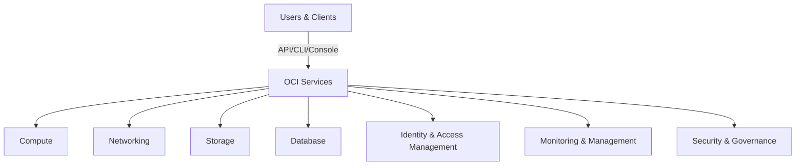
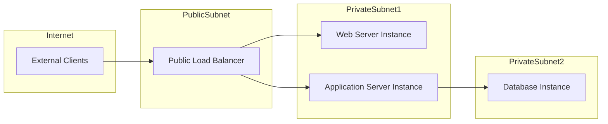

# Disclaimer
This repository contains information collected from various online sources and/or generated by AI assistants. The content provided here is for informational purposes only and is intended to serve as a general reference on various topics.

# Oracle Cloud Infrastructure (OCI) Architecture: A Detailed Overview

Oracle Cloud Infrastructure (OCI) is designed to provide high performance, high security, and high availability for enterprise workloads. In this document, we provide a detailed examination of OCI’s architectural components, best practices for administration, and key considerations for database administrators (DBAs). We include diagrams, tables, and design examples to illustrate various concepts. This guide is structured as follows:

- [1. Introduction](#introduction)
- [2. OCI Core Architecture Overview](#oci-core-architecture-overview)
- [3. OCI Regions, Availability Domains, and Fault Domains](#oci-regions-availability-domains-and-fault-domains)
- [4. Compute Services](#compute-services)
- [5. Networking Architecture](#networking-architecture)
- [6. Storage Options](#storage-options)
- [7. Database Services on OCI](#database-services-on-oci)
- [8. Identity and Access Management (IAM)](#identity-and-access-management-iam)
- [9. Security and Governance](#security-and-governance)
- [10. Monitoring, Management, and Automation](#monitoring-management-and-automation)
- [11. Integration, APIs, and Developer Tools](#integration-apis-and-developer-tools)
- [12. Administration Best Practices for DBAs](#administration-best-practices-for-dbas)
- [13. Sample Designs and Tables](#sample-designs-and-tables)
- [14. Conclusion](#conclusion)

---

## 1. Introduction

Oracle Cloud Infrastructure is Oracle’s next-generation cloud platform, engineered to support demanding enterprise workloads with unprecedented performance, security, and reliability. OCI is architected to support all types of cloud deployments – public, hybrid, and multi-cloud – and to simplify the management of complex IT environments. 

This document covers the key aspects of OCI architecture with a focus on the components that administrators and DBAs will interact with. By the end of this guide, readers will have a thorough understanding of OCI’s architecture, including network segmentation, compute models, storage paradigms, and specialized database services.

---

## 2. OCI Core Architecture Overview

OCI is built on a modern, purpose-built infrastructure that addresses the limitations of traditional cloud computing. Some of the highlights of OCI’s architecture include:

- **Bare-Metal Performance:** OCI provides direct access to physical hardware through its bare-metal compute instances. This allows organizations to run high-performance, latency-sensitive applications without the overhead of virtualization layers.
- **Multi-Tenancy and Isolation:** Resources are isolated across different tenants using Virtual Cloud Networks (VCNs) and compartmentalization, which ensures secure boundaries between different projects and environments.
- **High Availability and Resiliency:** With multiple regions, availability domains (ADs), and fault domains, OCI is designed for business continuity and disaster recovery.
- **Integrated Services:** OCI integrates compute, storage, networking, database, and security services into one seamless platform, streamlining management and operations.

Below is a high-level diagram representing OCI’s core architecture components:



In this diagram, you can see how different OCI services interact under a unified architecture accessible via multiple interfaces.

---

## 3. OCI Regions, Availability Domains, and Fault Domains

### 3.1 Regions
OCI’s infrastructure is globally distributed across multiple **Regions**. Each Region is an independent geographic area that contains a collection of data centers. When planning for high availability, administrators should select a Region that offers the best latency, compliance, and performance characteristics for their workloads.

#### Key points:
- **Geographic Isolation:** Regions are physically separated to reduce the risk of simultaneous failures.
- **Data Sovereignty:** Regions help organizations comply with data residency and local regulatory requirements.

### 3.2 Availability Domains (ADs)
Within a Region, there are multiple **Availability Domains**. Each AD is a physically separate data center within a Region. ADs are designed to be isolated from each other to mitigate the impact of a localized failure.

#### Considerations for ADs:
- **Redundancy:** Deploy workloads across multiple ADs to ensure high availability.
- **Performance:** ADs offer high-speed, low-latency connectivity within a Region.

### 3.3 Fault Domains
Fault Domains are a further subdivision within an AD. They represent logical groupings of hardware and power resources that can be affected by localized issues such as power failures. 

| Aspect             | Description                                                |
| ------------------ | ---------------------------------------------------------- |
| **Definition**     | Logical segmentation within an AD                         |
| **Purpose**        | Mitigate risk of failure within a single AD                 |
| **Use Cases**      | Deploying instances across fault domains to avoid single point failures |

Administrators can design their deployments by considering fault domains to improve resilience and ensure that system failures do not affect all resources simultaneously.

---

## 4. Compute Services

OCI offers flexible compute services to suit various application needs:

### 4.1 Bare-Metal Instances
Bare-metal instances provide direct access to the physical server without a hypervisor. This results in minimal overhead and near-hardware performance.

- **Use Cases:** High-performance computing, databases, large-scale enterprise applications.
- **Features:**
  - Dedicated physical resources
  - Full control over the server environment
  - Customizable hardware configurations

### 4.2 Virtual Machines (VMs)
OCI’s VM instances are built on the same underlying hardware as bare-metal but utilize virtualization for greater flexibility and density.

- **Use Cases:** Development, testing, general-purpose workloads.
- **Features:**
  - Rapid provisioning and scaling
  - High availability and fault tolerance
  - Various shapes (standard, compute-optimized, etc.)

### 4.3 Container Engine for Kubernetes (OKE)
OKE is Oracle’s managed Kubernetes service that simplifies the deployment and management of containerized applications.

- **Features:**
  - Managed Kubernetes clusters
  - Integration with other OCI services
  - Automated scaling and updates

### 4.4 Compute Service Best Practices for Administrators
- **Sizing and Scaling:** Understand workload requirements to choose between bare-metal and VM shapes. Leverage auto-scaling where applicable.
- **Performance Monitoring:** Utilize OCI’s monitoring services (detailed in Section 10) to continuously track performance metrics.
- **Security Hardening:** Apply recommended security configurations (e.g., secure boot, OS patching) and restrict access using IAM policies.
- **Disaster Recovery:** Distribute compute instances across ADs and fault domains to avoid single points of failure.

---

## 5. Networking Architecture

OCI’s networking model is designed to offer secure, high-performance connectivity for all cloud resources. The key component in OCI’s network is the **Virtual Cloud Network (VCN)**.

### 5.1 Virtual Cloud Network (VCN)
A VCN is a customizable, private network that closely resembles a traditional network, with firewall rules and access controls to secure traffic.

#### VCN Components:
- **Subnets:** Logical subdivisions within a VCN that isolate groups of resources.
- **Route Tables:** Define how traffic is directed between subnets and out to the Internet.
- **Internet Gateways and NAT Gateways:** Provide controlled access to external networks.
- **Service Gateways:** Allow access to Oracle services without using public IP addresses.
- **Dynamic Routing Gateways (DRG):** Enable connectivity between on-premises networks and OCI VCNs via VPN or FastConnect.

### 5.2 Load Balancers
OCI load balancers distribute incoming traffic across multiple compute instances to enhance availability and scalability.

- **Types:**
  - **Public Load Balancer:** Exposes applications to the Internet.
  - **Private Load Balancer:** Internal use only, for services accessible only within the VCN.
- **Features:**
  - High availability with automatic failover
  - SSL termination and session persistence
  - Advanced routing rules and health checks

### 5.3 Network Security
Administrators should leverage OCI’s network security features to ensure that only authorized traffic reaches critical resources:

- **Security Lists:** Stateless network security rules applied at the subnet level.
- **Network Security Groups (NSGs):** Stateful firewall rules applied to individual resources.
- **Virtual Firewalls:** For additional control, administrators can deploy virtual appliances.

### 5.4 Sample Network Architecture Diagram

Below is a sample network diagram illustrating a typical multi-tier application deployment on OCI:



This diagram shows a simplified multi-tier architecture:
- A public load balancer routes traffic from external clients to web and application servers located in private subnets.
- The application servers, in turn, connect to the database instance located in a separate subnet.

---

## 6. Storage Options

OCI provides a range of storage services to meet the varied needs of enterprise applications. Understanding these storage options is essential for administrators and DBAs.

### 6.1 Block Storage
Block Storage in OCI is a high-performance storage option ideal for workloads such as databases and transaction systems.

- **Key Features:**
  - High Input/Output Operations Per Second (IOPS)
  - Low latency
  - Ability to attach to compute instances as boot volumes or additional disks

| Feature             | Description                                                       |
| ------------------- | ----------------------------------------------------------------- |
| **Scalability**     | Easily scaled by attaching multiple volumes                      |
| **Redundancy**      | Replicated within the AD for high availability                     |
| **Performance**     | Configurable performance options based on workload requirements     |

### 6.2 Object Storage
OCI Object Storage is designed for scalability, durability, and high availability. It is well-suited for storing unstructured data such as logs, images, backups, and big data.

- **Key Benefits:**
  - Virtually unlimited capacity
  - Data encryption at rest and in transit
  - Lifecycle management policies

### 6.3 File Storage
OCI File Storage is a managed file system that provides scalable and shared file storage for enterprise applications.

- **Use Cases:**
  - Content management
  - Home directories and shared workspaces
  - Lift-and-shift migrations for legacy applications

### 6.4 Archive Storage
For data that is rarely accessed but must be retained for compliance or archival purposes, OCI provides Archive Storage.

- **Characteristics:**
  - Low-cost storage option
  - High durability
  - Designed for long-term data retention

### 6.5 Storage Administration Considerations for DBAs
- **Performance Tuning:** Choose the appropriate storage type (block, file, object) based on the workload’s I/O performance requirements.
- **Backup Strategies:** Use OCI’s native backup solutions and lifecycle management features to automate backup and archival processes.
- **Encryption:** Ensure that all storage resources are configured with proper encryption settings, both in transit and at rest.
- **Monitoring:** Regularly monitor storage performance metrics and capacity usage via OCI’s monitoring services.

---

## 7. Database Services on OCI

Oracle’s strength in databases is a cornerstone of OCI. OCI offers a wide range of database services that cater to different use cases and operational requirements.

### 7.1 Autonomous Database
The Autonomous Database is a self-driving, self-securing, and self-repairing cloud database service that leverages machine learning to automate many traditional administrative tasks.

- **Variants:**
  - **Autonomous Data Warehouse (ADW):** Optimized for analytics and data warehousing.
  - **Autonomous Transaction Processing (ATP):** Optimized for transactional and mixed workloads.
- **Features:**
  - Automated tuning, patching, and backups
  - Elastic scaling based on workload
  - Integrated security and compliance

### 7.2 Database Cloud Service (DBCS)
DBCS provides traditional Oracle Database deployments in the cloud. This service gives DBAs more control over the database environment compared to the Autonomous Database.

- **Features:**
  - Choice between VM-based and bare-metal deployment
  - Customizable database configurations
  - Support for Oracle Real Application Clusters (RAC)

### 7.3 Exadata Cloud Service
For mission-critical, high-performance workloads, Oracle offers Exadata Cloud Service. This service provides the power of Exadata combined with cloud flexibility.

- **Benefits:**
  - Extreme performance and reliability for large-scale OLTP and OLAP systems
  - Advanced storage optimization features
  - Integration with Oracle’s high-performance hardware

### 7.4 Database Administration Best Practices on OCI
DBAs managing Oracle databases on OCI should consider the following:
- **Backup and Recovery:** Leverage OCI’s native backup tools and Automated Recovery Manager (RMAN) integration for reliable data protection.
- **Performance Tuning:** Use Oracle Enterprise Manager (OEM) and OCI Monitoring services to continuously assess performance, identify bottlenecks, and tune the database.
- **Security:** Implement database security best practices including transparent data encryption (TDE), access control policies, and regular patching.
- **High Availability:** For critical databases, deploy using Oracle RAC or Data Guard configurations across multiple ADs for redundancy.
- **Automation:** Consider automating routine tasks like patching and backups using OCI’s automation tools and scripts.

---

## 8. Identity and Access Management (IAM)

IAM is a critical component in OCI that ensures secure and controlled access to cloud resources. The main elements of OCI’s IAM include:

### 8.1 Users and Groups
- **Users:** Represent individual accounts that can access OCI resources.
- **Groups:** Collections of users to which policies can be applied.

### 8.2 Compartments
Compartments are logical containers used to isolate and manage resources. They help administrators organize resources by department, project, or environment (e.g., production vs. development).

### 8.3 Policies
Policies are written in a declarative language that defines who can access which resources and what actions they can perform.

#### Example Policy:
```text
Allow group DatabaseAdmins to manage database-family in compartment Production
```

### 8.4 Federation and Identity Providers
OCI supports federated identity management, allowing integration with external identity providers (e.g., Oracle Identity Cloud Service, Microsoft Azure AD).

### 8.5 IAM Best Practices for Administrators
- **Principle of Least Privilege:** Grant users and groups only the permissions they need.
- **Use Compartments:** Organize resources in compartments for granular access control and easier management.
- **Regular Audits:** Perform regular reviews of policies and access logs to ensure compliance.
- **Enable MFA:** Enhance account security by enabling multi-factor authentication.

---

## 9. Security and Governance

OCI embeds security and governance into every layer of its infrastructure, providing a robust framework for protecting sensitive data and ensuring regulatory compliance.

### 9.1 Data Encryption
- **At Rest:** All data stored in OCI (block, object, file) is encrypted by default using strong encryption algorithms.
- **In Transit:** Data moving between services and to/from the Internet is protected by TLS/SSL.

### 9.2 Security Zones
OCI Security Zones enforce strict security controls for resources, ensuring that best practices are adhered to during resource provisioning.

### 9.3 Audit and Logging
OCI provides comprehensive logging and auditing capabilities:
- **Audit Logs:** Capture API calls and user activities.
- **Logging Service:** Aggregates logs from various services for analysis.
- **Monitoring Integration:** Logs can be integrated with OCI Monitoring for real-time alerts.

### 9.4 Compliance and Governance
OCI adheres to a range of compliance standards such as GDPR, HIPAA, ISO/IEC 27001, and more. Administrators can leverage OCI’s compliance reports and certifications for audit purposes.

### 9.5 Governance Best Practices
- **Implement Security Zones:** Enforce policies to ensure that only compliant resources are provisioned.
- **Use Tagging:** Apply consistent tags to resources for better tracking and management.
- **Monitor Logs:** Regularly review audit logs for suspicious activity.

---

## 10. Monitoring, Management, and Automation

Effective management of cloud resources requires robust monitoring, logging, and automation capabilities. OCI provides integrated tools to help administrators monitor and manage their environments.

### 10.1 OCI Monitoring
OCI Monitoring collects and displays metrics across various services. Key features include:
- **Custom Metrics:** Define your own metrics for application-specific monitoring.
- **Alarms:** Set up thresholds and notifications for when metrics exceed defined limits.
- **Dashboards:** Visualize performance data in real time.

### 10.2 Logging Service
OCI Logging aggregates logs from different sources:
- **Log Groups and Log Objects:** Organize logs for easier access and analysis.
- **Integration with Analytics:** Use integrated search and analytics tools to troubleshoot issues.

### 10.3 Events and Notifications
OCI Events service allows you to automate responses to specific events in your cloud environment:
- **Event Rules:** Define actions to be taken when events occur (e.g., scale out compute resources).
- **Notifications:** Send alerts via email, SMS, or integration with third-party tools.

### 10.4 Resource Manager
OCI Resource Manager is a managed Terraform service that simplifies provisioning and managing OCI resources using infrastructure as code (IaC).

### 10.5 Automation Best Practices
- **Use IaC:** Standardize deployments with Terraform scripts to ensure consistency.
- **Automate Routine Tasks:** Implement automation for backups, patching, and scaling to reduce manual errors.
- **Integrate Monitoring:** Ensure that automated workflows are integrated with monitoring tools to provide feedback and alert on issues.

---

## 11. Integration, APIs, and Developer Tools

OCI offers a wide range of APIs, SDKs, and developer tools that allow for seamless integration and automation.

### 11.1 APIs and SDKs
- **REST APIs:** OCI provides comprehensive REST APIs that allow programmatic management of all resources.
- **SDKs:** Software Development Kits are available in multiple languages (Java, Python, Go, .NET, etc.) to facilitate integration with your applications.
- **CLI:** The OCI Command Line Interface enables administrators to script and automate routine tasks.

### 11.2 Developer Tools
- **Resource Manager:** As discussed, this tool integrates with Terraform to allow IaC-based deployments.
- **OCI Console:** The web-based console offers a graphical interface to manage resources, monitor performance, and troubleshoot issues.
- **Oracle Cloud Shell:** A browser-based shell environment that provides pre-configured tools for interacting with OCI.

### 11.3 Best Practices for Integration
- **Version Control:** Manage your Terraform and API scripts using version control systems (e.g., GitHub).
- **Automation Pipelines:** Integrate OCI resource management into your CI/CD pipelines.
- **Security:** Ensure that API keys and credentials are securely stored using vaults or secret management tools.

---

## 12. Administration Best Practices for DBAs

For Database Administrators (DBAs) managing Oracle databases on OCI, there are several key considerations to ensure optimal performance, security, and availability.

### 12.1 Backup and Recovery
- **Automated Backups:** Use the built-in backup solutions in Autonomous Database or DBCS. Configure backup retention policies based on your recovery point objectives (RPO).
- **Manual Snapshots:** In some scenarios, manual snapshots may be useful for capturing the state of a database before a major change.
- **Recovery Strategies:** Leverage Oracle Recovery Manager (RMAN) for point-in-time recovery and to maintain backups across regions or ADs.

### 12.2 Performance Tuning
- **Monitoring Tools:** Utilize OCI Monitoring and Oracle Enterprise Manager (OEM) to track database performance metrics.
- **SQL Tuning:** Regularly analyze SQL execution plans and tune queries as necessary.
- **Resource Allocation:** Ensure that compute and storage resources are properly sized for database workloads. Consider autoscaling options where appropriate.

### 12.3 High Availability and Disaster Recovery
- **Oracle RAC:** For mission-critical systems, deploy Oracle Real Application Clusters (RAC) across multiple ADs.
- **Data Guard:** Implement Oracle Data Guard for standby database configurations.
- **Multi-AD Deployments:** Spread database instances across multiple availability and fault domains to mitigate risk.

### 12.4 Security Considerations
- **Access Controls:** Apply granular IAM policies to limit access to databases.
- **Encryption:** Use Transparent Data Encryption (TDE) to secure sensitive data.
- **Patch Management:** Regularly apply Oracle patches and updates using automated patching services where available.

### 12.5 Routine Maintenance and Monitoring
- **Log Analysis:** Regularly review database logs for anomalies.
- **Health Checks:** Schedule periodic health checks and capacity planning sessions.
- **Automation Scripts:** Automate repetitive tasks like performance checks, cleanup jobs, and index maintenance using PL/SQL scripts or Oracle Scheduler.

---

## 13. Sample Designs and Tables

Below are some sample designs and tables that illustrate how you can structure your OCI deployments.

### 13.1 Sample OCI Resource Architecture Table

| Component             | Description                                                            | Best Practice                                          |
| --------------------- | ---------------------------------------------------------------------- | ------------------------------------------------------ |
| **VCN**               | A virtual cloud network that serves as the foundational network layer. | Design VCNs with subnets for segmentation and security.|
| **Subnets**           | Logical subdivisions within a VCN for isolating resources.             | Separate subnets for public and private workloads.     |
| **Internet Gateway**  | Enables connectivity between your VCN and the Internet.                | Use with NAT Gateway to secure outbound traffic.       |
| **Dynamic Routing Gateway (DRG)** | Connects OCI with on-premises networks or other VCNs.         | Use for hybrid cloud configurations.                   |
| **Load Balancer**     | Distributes incoming traffic across multiple instances.                | Deploy both public and private load balancers.         |
| **Compute Instances** | VMs and Bare-Metal instances running applications and databases.      | Distribute across ADs and fault domains.               |
| **Block Storage**     | High-performance storage attached to compute instances.                | Monitor IOPS and scale as needed.                      |
| **Object Storage**    | Scalable storage for unstructured data.                                | Use lifecycle policies for archival.                 |
| **Database Services** | Autonomous, Exadata, and DBCS options available for relational workloads. | Choose based on workload characteristics.             |

### 13.2 Sample Architecture Diagram for a Multi-Tier Application

Below is a more detailed multi-tier application architecture diagram represented in Markdown with Mermaid syntax:

```mermaid
flowchart TD
    %% External Clients and Entry Points
    A[Internet Clients] -->|HTTP/HTTPS| B[Public Load Balancer]
    
    %% Web Tier (Public Subnet)
    B --> C[Web Server Cluster]
    
    %% Application Tier (Private Subnet)
    C --> D[Application Server Cluster]
    
    %% Database Tier (Private Subnet with High Availability)
    D --> E[Primary Database (AD1)]
    D --> F[Standby Database (AD2)]
    
    %% Supporting Components
    G[Object Storage: Backups & Logs] --- E
    G --- F
    H[DRG/VPN] --- B
```

### 13.3 Example IAM Policy Structure

Here is an example of a well-structured IAM policy for a production environment:

```text
# Allow DBA team full management access to database resources in the Production compartment
Allow group DBATeam to manage database-family in compartment Production

# Allow Application Developers to read specific network resources only
Allow group AppDevelopers to read virtual-network-family in compartment Production

# Allow Operations team to manage compute instances
Allow group OpsTeam to manage instance-family in compartment Production
```

### 13.4 OCI Terraform Example for Deploying a VCN

Below is an example Terraform configuration snippet for deploying a VCN and a couple of subnets:

```hcl
provider "oci" {
  tenancy_ocid        = var.tenancy_ocid
  user_ocid           = var.user_ocid
  fingerprint         = var.fingerprint
  private_key_path    = var.private_key_path
  region              = var.region
}

resource "oci_core_vcn" "my_vcn" {
  cidr_block     = "10.0.0.0/16"
  compartment_id = var.compartment_ocid
  display_name   = "MyVCN"
}

resource "oci_core_subnet" "public_subnet" {
  vcn_id              = oci_core_vcn.my_vcn.id
  cidr_block          = "10.0.1.0/24"
  compartment_id      = var.compartment_ocid
  display_name        = "PublicSubnet"
  prohibit_public_ip_on_vnic = false
}

resource "oci_core_subnet" "private_subnet" {
  vcn_id              = oci_core_vcn.my_vcn.id
  cidr_block          = "10.0.2.0/24"
  compartment_id      = var.compartment_ocid
  display_name        = "PrivateSubnet"
  prohibit_public_ip_on_vnic = true
}
```

This configuration illustrates how to define a VCN with two subnets—one public and one private—for your OCI environment.

---

## 14. Conclusion

Oracle Cloud Infrastructure (OCI) represents a significant leap in cloud architecture, designed to meet the high-performance, high-security, and high-availability demands of modern enterprise applications. In this guide, we have provided a detailed exploration of OCI’s core components, including compute, networking, storage, database services, and identity management. We have also outlined best practices for administrators and DBAs, including performance tuning, backup and recovery, security measures, and automation strategies.

Key takeaways include:
- **Multi-Layered Architecture:** OCI’s design revolves around Regions, Availability Domains, and Fault Domains to ensure resiliency.
- **Flexible Compute Options:** Whether you choose bare-metal or virtual machines, OCI provides the flexibility to match workload requirements.
- **Advanced Networking:** With VCNs, subnets, and load balancers, OCI ensures secure and scalable connectivity.
- **Diverse Storage Solutions:** Block, Object, File, and Archive Storage options cater to various use cases.
- **Robust Database Services:** From Autonomous Database to Exadata, OCI’s database services are tailored to meet both transactional and analytical needs.
- **Comprehensive Security and Governance:** Integrated IAM, encryption, audit, and compliance controls protect your data.
- **Monitoring and Automation:** Use OCI Monitoring, Logging, and Resource Manager to streamline operations and ensure proactive management.

For administrators and DBAs, OCI provides extensive tools and best practices that empower you to manage resources efficiently while maintaining robust security and high availability. By leveraging OCI’s integrated services and following the design recommendations outlined in this document, organizations can confidently deploy and manage complex workloads in the cloud.

---

