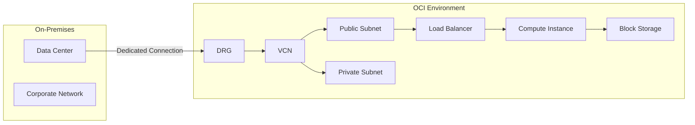

# Disclaimer
This repository contains information collected from various online sources and/or generated by AI assistants. The content provided here is for informational purposes only and is intended to serve as a general reference on various topics.

# Oracle Cloud Infrastructure (OCI) Administration: A Comprehensive Guide

## Table of Contents

1. [Introduction](#introduction)
2. [Overview of Oracle Cloud Infrastructure](#overview-of-oracle-cloud-infrastructure)
   - [History and Background](#history-and-background)
   - [Key Differentiators](#key-differentiators)
3. [OCI Architectural Fundamentals](#oci-architectural-fundamentals)
   - [Physical and Logical Architecture](#physical-and-logical-architecture)
   - [Regions, Availability Domains, and Fault Domains](#regions-availability-domains-and-fault-domains)
4. [Core OCI Services and Their Administration](#core-oci-services-and-their-administration)
   - [Compute Services](#compute-services)
   - [Storage Solutions](#storage-solutions)
   - [Networking Components](#networking-components)
5. [OCI Administration Tools and Interfaces](#oci-administration-tools-and-interfaces)
   - [OCI Console](#oci-console)
   - [CLI and SDKs](#cli-and-sdks)
   - [REST APIs](#rest-apis)
6. [Identity and Access Management (IAM)](#identity-and-access-management-iam)
   - [Core Concepts](#core-concepts)
   - [Policies and Compartments](#policies-and-compartments)
   - [Best Practices in IAM Administration](#best-practices-in-iam-administration)
7. [Networking Administration](#networking-administration)
   - [Virtual Cloud Networks (VCN)](#virtual-cloud-networks-vcn)
   - [Subnets, Route Tables, and Security Lists](#subnets-route-tables-and-security-lists)
   - [Gateways and Connectivity Options](#gateways-and-connectivity-options)
   - [Load Balancers and Traffic Management](#load-balancers-and-traffic-management)
8. [Compute Administration](#compute-administration)
   - [Managing Virtual Machine Instances](#managing-virtual-machine-instances)
   - [Bare Metal and Dedicated Virtual Machine Hosts](#bare-metal-and-dedicated-virtual-machine-hosts)
   - [Scaling and Autoscaling Strategies](#scaling-and-autoscaling-strategies)
9. [Storage Administration](#storage-administration)
   - [Block Storage Administration](#block-storage-administration)
   - [Object Storage Management](#object-storage-management)
   - [File Storage Services](#file-storage-services)
10. [Database Services in OCI](#database-services-in-oci)
    - [Oracle Autonomous Database](#oracle-autonomous-database)
    - [Database Cloud Service (DBCS)](#database-cloud-service-dbrcs)
    - [Administration and Tuning](#administration-and-tuning)
11. [Monitoring, Logging, and Alerts](#monitoring-logging-and-alerts)
    - [OCI Monitoring Service](#oci-monitoring-service)
    - [OCI Logging Service](#oci-logging-service)
    - [Integrating with Third-Party Tools](#integrating-with-third-party-tools)
12. [Security and Governance](#security-and-governance)
    - [Security Zones and Hardening](#security-zones-and-hardening)
    - [Audit and Compliance](#audit-and-compliance)
    - [Incident Response and Forensics](#incident-response-and-forensics)
13. [Automation and Infrastructure as Code (IaC)](#automation-and-infrastructure-as-code-iac)
    - [Terraform and OCI](#terraform-and-oci)
    - [OCI Resource Manager](#oci-resource-manager)
    - [Automating Common Tasks](#automating-common-tasks)
14. [Resource Management and Tagging](#resource-management-and-tagging)
    - [Compartments Overview](#compartments-overview)
    - [Tagging Strategies](#tagging-strategies)
15. [Disaster Recovery and Business Continuity](#disaster-recovery-and-business-continuity)
    - [Backup Strategies](#backup-strategies)
    - [High Availability Designs](#high-availability-designs)
16. [Cost Management and Optimization](#cost-management-and-optimization)
    - [Budgeting and Forecasting](#budgeting-and-forecasting)
    - [Cost Analysis Tools](#cost-analysis-tools)
17. [Advanced OCI Administration Topics](#advanced-oci-administration-topics)
    - [OCI Service Gateway and Private Connectivity](#oci-service-gateway-and-private-connectivity)
    - [Cross-Region VCN Connectivity](#cross-region-vcn-connectivity)
    - [FastConnect Overview](#fastconnect-overview)
18. [Sample Designs, Diagrams, and Tables](#sample-designs-diagrams-and-tables)
    - [Architecture Diagrams](#architecture-diagrams)
    - [Administration Workflow Tables](#administration-workflow-tables)
19. [Case Studies and Real-World Examples](#case-studies-and-real-world-examples)
20. [Conclusion](#conclusion)
21. [Appendices](#appendices)
    - [CLI Command Examples](#cli-command-examples)
    - [Policy Samples](#policy-samples)
    - [Glossary](#glossary)
22. [References and Further Reading](#references-and-further-reading)

---

## 1. Introduction

Oracle Cloud Infrastructure (OCI) represents Oracle’s modern, enterprise-grade public cloud platform, which is built on a high-performance foundation to deliver powerful, secure, and cost-efficient cloud computing solutions. In this comprehensive guide, we will explore OCI’s administrative facets in extensive detail, providing IT professionals with the knowledge necessary to efficiently manage and operate OCI environments.

OCI is renowned for its performance, scalability, and reliability, and it offers a broad array of services—from compute and storage to advanced analytics and machine learning. Its administration capabilities empower organizations to manage resources efficiently while ensuring security, compliance, and optimal performance across their cloud deployments.

In the sections that follow, we delve deeply into the critical components of OCI administration. We cover core services, interfaces, security practices, automation, and advanced configurations—all designed to provide you with a holistic understanding of the platform.

---

## 2. Overview of Oracle Cloud Infrastructure

### History and Background

Oracle entered the cloud arena with a vision to provide enterprise customers with a cloud infrastructure platform that delivers the performance, security, and reliability required by mission-critical applications. OCI evolved from decades of Oracle’s expertise in database and enterprise software solutions, blending traditional on-premises capabilities with the flexibility of the cloud.

Historically, Oracle leveraged its deep roots in database technology to introduce a platform that could support modern cloud applications while also addressing legacy workloads. This evolution has positioned OCI as a competitive alternative to other major public cloud providers.

### Key Differentiators

OCI offers several unique advantages:
- **Performance and Scalability:** High-performance computing with bare metal and virtualized options.
- **Enterprise-Grade Security:** Comprehensive security features, including isolated network virtualization and advanced encryption.
- **Cost Efficiency:** Transparent pricing models that help reduce overall cloud costs.
- **Integrated Services:** Tight integration with Oracle databases and applications, providing a seamless hybrid cloud experience.

These factors make OCI particularly well-suited for enterprises with demanding workloads that require both high performance and robust security.

---

## 3. OCI Architectural Fundamentals

Understanding OCI’s architecture is critical for any administrator. OCI is built on a modern, multi-tenant infrastructure that is both scalable and resilient.

### Physical and Logical Architecture

OCI’s physical architecture comprises state-of-the-art data centers distributed globally. These data centers are designed with redundancy, low latency, and high availability in mind. Administrators must be familiar with the following architectural layers:

- **Compute Layer:** Provides both virtualized and bare metal servers.
- **Storage Layer:** Supports various storage types including block, object, and file storage.
- **Networking Layer:** Comprises Virtual Cloud Networks (VCNs), subnets, and gateways for connectivity.
- **Management Layer:** Includes the OCI Console, CLI, SDKs, and APIs for resource management.

On the logical side, OCI organizes resources in a way that aligns with enterprise governance, using compartments and tagging to provide a clear separation of resources.

### Regions, Availability Domains, and Fault Domains

OCI is divided into multiple geographic regions, each containing one or more Availability Domains (ADs). Each AD is an isolated data center within a region, and they are designed to be independent to minimize the risk of failure.

- **Regions:** Represent broad geographic areas and are the top-level container for OCI resources.
- **Availability Domains:** Are isolated from one another to prevent single points of failure.
- **Fault Domains:** Provide further isolation within an AD, ensuring that maintenance or failures in one fault domain do not impact others.

Administrators must design their deployments to distribute critical resources across ADs and fault domains to ensure high availability and resilience.

> **Diagram 1: OCI Regions and Availability Domains**
> 
> ```mermaid
> graph TD;
>     Region1[Region 1] --> AD1[Availability Domain 1];
>     Region1 --> AD2[Availability Domain 2];
>     Region1 --> AD3[Availability Domain 3];
>     Region2[Region 2] --> AD1b[Availability Domain 1];
>     Region2 --> AD2b[Availability Domain 2];
> ```
>
> This simplified diagram illustrates how regions are composed of multiple Availability Domains. Each AD provides physical separation and fault isolation.

---

## 4. Core OCI Services and Their Administration

OCI is comprised of a wide array of services that fall into three primary categories: compute, storage, and networking. Each service requires specific administrative considerations.

### Compute Services

OCI offers two major types of compute instances:
- **Virtual Machines (VMs):** Provide scalable compute resources that run on virtualized hardware.
- **Bare Metal Instances:** Offer dedicated physical servers for workloads that require high performance and isolation.

Administrators must understand how to choose between these options based on workload requirements, performance needs, and cost considerations.

### Storage Solutions

OCI supports multiple storage options:
- **Block Storage:** Offers persistent, high-performance storage volumes that can be attached to compute instances.
- **Object Storage:** A highly scalable storage solution for unstructured data such as backups, logs, and media files.
- **File Storage:** Provides a managed file system that can be shared across multiple instances.

Each storage type has unique administrative procedures, including provisioning, backup management, and performance tuning.

### Networking Components

Networking is a critical part of OCI administration. The core networking components include:
- **Virtual Cloud Networks (VCNs):** These virtual networks are analogous to traditional on-premises networks.
- **Subnets:** Dividing the VCN into smaller segments.
- **Route Tables:** Directing traffic between subnets and the internet.
- **Security Lists and Network Security Groups (NSGs):** Controlling inbound and outbound traffic.
- **Gateways:** Enabling connectivity, including Internet Gateways, NAT Gateways, Service Gateways, and Dynamic Routing Gateways.

A deep understanding of these components is essential for secure and efficient network management in OCI.

---

## 5. OCI Administration Tools and Interfaces

Administrators can interact with OCI using a variety of tools and interfaces. Each tool offers unique benefits depending on the task at hand.

### OCI Console

The OCI Console is a web-based graphical interface that allows administrators to manage and monitor resources easily. Key features include:
- **Dashboard:** A customizable view of resources, metrics, and alerts.
- **Resource Management:** Intuitive interfaces for launching instances, configuring networks, and managing storage.
- **Monitoring and Alerts:** Real-time performance monitoring with graphical charts and alerts.

The console is ideal for tasks that require visual oversight and ad hoc management.

### CLI and SDKs

For automation and scripting, OCI provides a robust Command Line Interface (CLI) and several Software Development Kits (SDKs) for different programming languages (Python, Java, Go, etc.). These tools enable administrators to:
- Automate repetitive tasks.
- Integrate OCI management into existing DevOps pipelines.
- Create custom scripts for bulk resource management.

Using the CLI and SDKs, administrators can interact with OCI programmatically, which is essential for large-scale deployments.

### REST APIs

OCI’s REST APIs allow for granular control of resources. These APIs can be integrated into various management tools, enabling:
- Custom application development.
- Integration with third-party monitoring tools.
- Automation of complex workflows.

Understanding how to leverage the REST APIs is key to unlocking the full power of OCI administration.

---

## 6. Identity and Access Management (IAM)

A secure OCI environment starts with a robust Identity and Access Management (IAM) framework. IAM in OCI helps to enforce fine-grained control over who can access which resources.

### Core Concepts

- **Users and Groups:** Individual accounts and groups of accounts that require access to OCI resources.
- **Policies:** Statements that define what actions are allowed or denied for users and groups.
- **Compartments:** Logical containers that isolate resources, helping in managing permissions and organizational boundaries.

### Policies and Compartments

Policies in OCI are written in a declarative language that defines the permitted actions on resources. They are applied at the compartment level and enable centralized control of resource access.

**Example Policy:**

```text
Allow group Admins to manage all-resources in compartment Production
```

This policy grants the Admins group full management rights within the Production compartment.

### Best Practices in IAM Administration

- **Least Privilege:** Always assign the minimum required permissions to users and groups.
- **Compartmentalization:** Use compartments to segregate environments (e.g., Development, Testing, Production) and enforce security boundaries.
- **Regular Audits:** Perform periodic reviews of policies and access rights to ensure compliance and security.

---

## 7. Networking Administration

Networking is a cornerstone of OCI administration. A well-designed network ensures secure, scalable, and efficient communication between resources.

### Virtual Cloud Networks (VCN)

VCNs are the fundamental building blocks for networking in OCI. They allow administrators to create logically isolated networks that resemble traditional on-premises networks.

**Key VCN Concepts:**
- **CIDR Blocks:** Define the IP address range for the VCN.
- **Subnets:** Logical subdivisions of the VCN, which can be either public or private.
- **Internet Gateway (IGW):** Connects public subnets to the internet.
- **NAT Gateway:** Enables outbound internet connectivity for instances in private subnets without exposing them publicly.

### Subnets, Route Tables, and Security Lists

Each VCN is divided into subnets to segregate traffic. Administrators configure route tables to direct traffic between subnets and set up security lists to control inbound and outbound traffic.

**Example Subnet Configuration Table:**

| Subnet Name   | Type    | CIDR Block      | Associated IGW/NAT | Purpose              |
|---------------|---------|-----------------|--------------------|----------------------|
| Public-Subnet | Public  | 10.0.0.0/24     | IGW                | Web servers          |
| Private-Subnet| Private | 10.0.1.0/24     | NAT Gateway        | Application servers  |
| DMZ-Subnet    | Public  | 10.0.2.0/24     | IGW                | External services    |

### Gateways and Connectivity Options

Connectivity in OCI is achieved through various gateway configurations:
- **Internet Gateway (IGW):** Provides direct connectivity to the public internet.
- **NAT Gateway:** Secures outbound connectivity for private instances.
- **Service Gateway:** Enables access to Oracle services without using the public internet.
- **Dynamic Routing Gateway (DRG):** Facilitates connectivity between on-premises networks and OCI.

### Load Balancers and Traffic Management

OCI offers a managed load balancing service that distributes traffic among instances based on configurable rules. This service supports:
- **Layer 4 and Layer 7 Load Balancing:** For both TCP/UDP and HTTP/HTTPS traffic.
- **Health Checks:** Automatically monitors instance health to ensure traffic is routed only to healthy nodes.
- **SSL Termination:** Offloads SSL processing from backend instances.

---

## 8. Compute Administration

Compute resources are the workhorses of any cloud environment. OCI provides a range of compute options that administrators must be familiar with.

### Managing Virtual Machine Instances

Virtual Machine (VM) instances in OCI are highly scalable and offer flexible configurations. Administration tasks include:
- **Provisioning:** Creating and configuring new VM instances via the Console, CLI, or APIs.
- **Lifecycle Management:** Starting, stopping, and terminating instances as needed.
- **Scaling:** Adjusting instance shapes or using autoscaling features to respond to workload demands.

**Example VM Instance Management Workflow:**

1. **Launch Instance:**
   - Choose an image and shape.
   - Configure networking and security options.
   - Assign storage volumes.
2. **Monitor Performance:**
   - Use OCI Monitoring to track CPU, memory, and I/O.
3. **Scale or Migrate:**
   - Adjust instance configurations based on workload changes.
4. **Terminate Instance:**
   - Remove the instance while preserving necessary snapshots or backups.

### Bare Metal and Dedicated Virtual Machine Hosts

For workloads requiring the utmost performance and isolation, OCI provides bare metal and dedicated VM hosts. These options allow for:
- **Direct Access to Hardware:** Minimizing virtualization overhead.
- **Enhanced Performance:** Ideal for high-performance databases and transactional systems.
- **Custom Configurations:** Tailored resource allocation and network settings.

### Scaling and Autoscaling Strategies

Autoscaling in OCI enables dynamic adjustment of compute resources based on real-time metrics. Administrators can configure:
- **Thresholds:** Define metrics (e.g., CPU utilization) that trigger scaling events.
- **Minimum and Maximum Limits:** Set boundaries to control resource allocation.
- **Scheduled Scaling:** Pre-plan scaling events based on predictable workload patterns.

> **Table 2: Autoscaling Configuration Example**

| Parameter        | Description                                          | Example Value         |
|------------------|------------------------------------------------------|-----------------------|
| Metric           | CPU utilization threshold                            | 70%                   |
| Cool Down Period | Time to wait between scaling actions                 | 300 seconds           |
| Min Instance     | Minimum number of instances to maintain              | 2                     |
| Max Instance     | Maximum number of instances allowed                  | 10                    |
| Scale-Up Action  | Increase instance count by a specific increment      | +1 instance per event |
| Scale-Down Action| Decrease instance count when load is low             | -1 instance per event |

---

## 9. Storage Administration

Efficient storage management is paramount for maintaining performance and ensuring data integrity across OCI deployments.

### Block Storage Administration

Block storage in OCI provides high-performance, persistent storage that can be attached to compute instances. Key administrative tasks include:
- **Volume Provisioning:** Creating new block volumes and attaching them to instances.
- **Performance Tuning:** Adjusting volume performance settings based on IOPS and throughput requirements.
- **Backup and Recovery:** Scheduling regular backups and snapshots to safeguard data.

### Object Storage Management

OCI’s object storage service is designed for durability and scalability. Administrators use object storage to:
- **Store Unstructured Data:** Such as logs, images, and backups.
- **Set Up Buckets:** Create and manage storage buckets with configurable policies.
- **Access Control:** Use IAM policies and pre-signed URLs to secure access.

**Example Bucket Configuration:**

```yaml
Bucket:
  Name: logs-archive
  Region: us-phoenix-1
  StorageClass: Standard
  Versioning: Enabled
  LifecyclePolicy:
    Transition:
      - Days: 30
        StorageClass: Infrequent Access
      - Days: 90
        StorageClass: Archive
```

### File Storage Services

OCI File Storage Service (FSS) provides a fully managed Network File System (NFS) that can be mounted by multiple instances. Administrative aspects include:
- **Provisioning File Systems:** Creating file systems and assigning mount targets.
- **Access Controls:** Managing NFS export policies and access permissions.
- **Performance Management:** Monitoring throughput and latency to ensure smooth operation.

---

## 10. Database Services in OCI

OCI supports a range of database services, from traditional DB systems to autonomous databases, all of which are managed via a rich set of administrative tools.

### Oracle Autonomous Database

The Oracle Autonomous Database automates many aspects of database management, including patching, tuning, and backups. Administrators can focus on:
- **Provisioning Autonomous Instances:** Deploying databases with minimal manual intervention.
- **Performance Monitoring:** Leveraging integrated analytics for workload management.
- **Scaling:** Dynamically scaling compute and storage resources as needed.

### Database Cloud Service (DBCS)

For customers who require more control over their database configurations, OCI offers the Database Cloud Service. Administration includes:
- **Database Instance Management:** Provisioning and configuring database instances.
- **Patching and Upgrades:** Scheduling maintenance windows and applying patches.
- **Backup Strategies:** Configuring automated backups and point-in-time recovery.

### Administration and Tuning

Performance tuning is critical for database administration. Key techniques include:
- **SQL Optimization:** Analyzing query performance and indexing strategies.
- **Resource Management:** Adjusting compute and storage allocations to optimize throughput.
- **Monitoring Tools:** Using Oracle Enterprise Manager and OCI Monitoring for real-time insights.

---

## 11. Monitoring, Logging, and Alerts

Continuous monitoring and logging are vital for maintaining the health, performance, and security of OCI environments.

### OCI Monitoring Service

OCI Monitoring provides comprehensive tools for tracking metrics across compute, storage, and network resources. Features include:
- **Custom Metrics:** Create and monitor custom performance metrics.
- **Dashboards:** Build personalized dashboards for real-time insights.
- **Alarms:** Configure alarms that trigger notifications based on predefined thresholds.

### OCI Logging Service

The Logging Service aggregates logs from various OCI services, enabling administrators to:
- **Centralize Logs:** Collect logs from compute instances, databases, and applications.
- **Analyze Trends:** Use log analytics to identify performance issues and security incidents.
- **Integrate with SIEM:** Export logs to third-party security information and event management systems.

### Integrating with Third-Party Tools

OCI’s flexible APIs allow integration with popular monitoring and logging tools such as Prometheus, Grafana, Splunk, and ELK stacks. This interoperability facilitates:
- **Enhanced Visualization:** Custom dashboards for detailed insights.
- **Centralized Incident Management:** Seamless integration with incident response systems.
- **Correlated Analytics:** Combining OCI data with on-premises or hybrid cloud logs.

---

## 12. Security and Governance

A secure OCI environment requires a layered approach to security and governance, incorporating network, data, and identity management.

### Security Zones and Hardening

OCI Security Zones allow administrators to enforce strict security policies for resources in designated compartments. Key measures include:
- **Controlled Access:** Limit who can access and modify resources.
- **Policy Enforcement:** Automatically enforce security best practices.
- **Isolation:** Use dedicated networks and compartments to isolate sensitive workloads.

### Audit and Compliance

OCI provides detailed audit logs that capture administrative actions and resource changes. Administrators should:
- **Enable Audit Logging:** Ensure that all critical operations are logged.
- **Regular Reviews:** Conduct periodic audits to verify compliance.
- **Integrate with Compliance Tools:** Use tools that monitor regulatory compliance (e.g., PCI-DSS, HIPAA).

### Incident Response and Forensics

In the event of a security incident, OCI offers tools for:
- **Immediate Alerts:** Configuring notifications for suspicious activities.
- **Forensic Analysis:** Using audit logs and monitoring data to investigate incidents.
- **Remediation Workflows:** Automating responses to common security events.

---

## 13. Automation and Infrastructure as Code (IaC)

Automation is key to efficient and consistent OCI administration. OCI supports a wide range of IaC tools and practices.

### Terraform and OCI

Terraform is one of the most popular IaC tools used to manage OCI resources. Administrators can:
- **Define Resources Declaratively:** Use HCL (HashiCorp Configuration Language) to describe infrastructure.
- **Version Control:** Store Terraform configurations in Git repositories.
- **Automate Deployments:** Integrate Terraform with CI/CD pipelines for continuous delivery.

**Example Terraform Configuration:**

```hcl
provider "oci" {
  tenancy_ocid = var.tenancy_ocid
  user_ocid    = var.user_ocid
  fingerprint  = var.fingerprint
  private_key_path = var.private_key_path
  region       = var.region
}

resource "oci_core_virtual_network" "example_vcn" {
  cidr_block     = "10.0.0.0/16"
  compartment_id = var.compartment_id
  display_name   = "Example_VCN"
}

resource "oci_core_subnet" "example_subnet" {
  compartment_id      = var.compartment_id
  virtual_network_id  = oci_core_virtual_network.example_vcn.id
  cidr_block          = "10.0.1.0/24"
  display_name        = "Example_Subnet"
  prohibit_public_ip_on_vnic = false
}
```

### OCI Resource Manager

OCI Resource Manager is a fully managed service for provisioning OCI resources using Terraform. It offers:
- **State Management:** Automatically manages Terraform state files.
- **Versioning:** Tracks changes to infrastructure over time.
- **Rollback Capabilities:** Provides mechanisms to revert to previous configurations if needed.

### Automating Common Tasks

Common administrative tasks that can be automated include:
- **Resource Provisioning:** Automate the creation of compute instances, storage volumes, and networks.
- **Backup Scheduling:** Automatically trigger backups and snapshots.
- **Policy Enforcement:** Use scripts to ensure that IAM policies are up-to-date and compliant with organizational standards.

---

## 14. Resource Management and Tagging

Effective resource management is crucial for organizing and governing OCI environments. This is achieved through the use of compartments and tagging.

### Compartments Overview

Compartments in OCI are logical containers that help segregate resources based on project, department, or environment. Benefits include:
- **Improved Security:** Isolate resources to restrict access.
- **Cost Tracking:** Allocate expenses by compartment.
- **Simplified Administration:** Apply policies and permissions at the compartment level.

**Example Compartment Hierarchy:**

| Compartment Name | Description                    | Use Case                     |
|------------------|--------------------------------|------------------------------|
| Root             | Top-level container            | Global settings and billing  |
| Production       | Live production environment    | Running critical workloads   |
| Development      | Development and testing        | Non-critical applications    |
| Shared           | Resources shared across projects| Shared databases, storage    |

### Tagging Strategies

Tagging allows administrators to add metadata to OCI resources, aiding in search, organization, and cost management. Best practices include:
- **Standardized Keys:** Use consistent tag keys such as `Environment`, `Project`, and `Owner`.
- **Automated Tag Enforcement:** Use policies to require tags on new resources.
- **Reporting:** Leverage OCI’s reporting tools to analyze tagged resource usage.

---

## 15. Disaster Recovery and Business Continuity

Ensuring the continuity of operations during outages or disasters is a critical responsibility of OCI administrators.

### Backup Strategies

Regular backups are essential to protect data and ensure business continuity. Administrators should:
- **Schedule Automated Backups:** Use OCI’s native backup services for databases and block storage.
- **Store Backups in Different Regions:** To mitigate regional failures.
- **Test Restorations:** Regularly validate backup integrity with restoration drills.

### High Availability Designs

Designing for high availability involves:
- **Deploying Across Multiple Availability Domains:** To prevent single points of failure.
- **Using Load Balancers:** To distribute traffic across healthy resources.
- **Implementing Failover Mechanisms:** That automatically switch to standby resources during failures.

> **Diagram 2: High Availability Architecture Example**
>
> ```mermaid
> graph LR;
>     A[User Requests] --> LB[Load Balancer];
>     LB --> AD1[Availability Domain 1];
>     LB --> AD2[Availability Domain 2];
>     AD1 --> Instance1[Compute Instance 1];
>     AD2 --> Instance2[Compute Instance 2];
>     Instance1 --- Backup1[Backup Repository];
>     Instance2 --- Backup2[Backup Repository];
> ```
>
> This diagram shows a simplified high availability architecture with load balancing and multiple Availability Domains.

---

## 16. Cost Management and Optimization

Cost management is a crucial aspect of OCI administration. Administrators must balance performance with cost efficiency.

### Budgeting and Forecasting

OCI provides cost analysis and budgeting tools that allow administrators to:
- **Set Budgets:** Define spending limits at the compartment or project level.
- **Monitor Usage:** Track resource consumption in real time.
- **Forecast Expenses:** Use historical data to predict future costs.

### Cost Analysis Tools

OCI’s Cost Analysis service includes features such as:
- **Resource-Level Reporting:** Detailed breakdowns of costs by service.
- **Usage Trends:** Graphical representations of consumption patterns.
- **Custom Reports:** Create custom dashboards for detailed financial analysis.

**Example Cost Analysis Table:**

| Service        | Monthly Cost Estimate | Actual Usage (GB/Hrs) | Variance (%)  |
|----------------|-----------------------|-----------------------|---------------|
| Compute        | $5,000                | 12,000 instance hrs   | +5%           |
| Block Storage  | $2,500                | 10,000 GB             | -2%           |
| Networking     | $1,000                | 1,000 TB transferred  | 0%            |

---

## 17. Advanced OCI Administration Topics

For experienced administrators, OCI offers advanced features that can further optimize cloud deployments.

### OCI Service Gateway and Private Connectivity

The OCI Service Gateway provides secure and private connectivity to Oracle services without requiring public IP addresses. This feature:
- **Enhances Security:** By keeping traffic within the OCI network.
- **Simplifies Network Design:** By eliminating the need for NAT or IGW configurations for Oracle services.

### Cross-Region VCN Connectivity

Cross-region connectivity enables enterprises to build resilient, geographically distributed networks. Administrators must consider:
- **Latency and Bandwidth:** Differences between regions.
- **DRG Configuration:** Setting up Dynamic Routing Gateways for inter-region communication.
- **Security Implications:** Ensuring encrypted traffic across regions.

### FastConnect Overview

FastConnect provides dedicated, high-bandwidth connectivity between on-premises data centers and OCI. It offers:
- **Guaranteed Throughput:** Lower latency and higher reliability.
- **Cost Benefits:** Predictable pricing and reduced data transfer costs.
- **Private Connectivity:** Enhancing security by avoiding the public internet.

---

## 18. Sample Designs, Diagrams, and Tables

Visual aids are invaluable in understanding OCI’s architecture and administrative workflows. This section provides sample diagrams and tables for quick reference.

### Architecture Diagrams

**Diagram 3: End-to-End OCI Environment**



This diagram represents a typical OCI environment with connectivity from an on-premises data center to a VCN, showcasing how resources are segmented and interconnected.

### Administration Workflow Tables

**Table 3: Typical Administration Tasks and Tools**

| Task                         | Tool/Interface        | Frequency         | Notes                                  |
|------------------------------|-----------------------|-------------------|----------------------------------------|
| Provision Compute Instances  | OCI Console/CLI       | Ad hoc/Automated  | Can be automated using Terraform       |
| Configure Network Resources  | OCI Console/CLI       | Ongoing           | Regular updates for security policies  |
| Monitor Resource Usage       | OCI Monitoring        | Continuous        | Set alarms for threshold breaches      |
| Manage IAM Policies          | OCI Console/CLI/SDK   | Periodic          | Review policies for least privilege    |
| Backup and Recovery          | OCI Backup Service    | Scheduled         | Test restorations regularly            |
| Cost Analysis and Reporting  | OCI Cost Analysis     | Monthly/Quarterly | Adjust budgets and forecasts accordingly |

---

## 19. Case Studies and Real-World Examples

Understanding how organizations utilize OCI in real-world scenarios can provide practical insights. Below are several case studies that illustrate successful OCI administration practices.

### Case Study 1: Financial Services Firm

A large financial services company deployed OCI to manage its critical trading applications. Key aspects of the deployment included:
- **Multi-AD Deployment:** Instances were distributed across three Availability Domains to ensure high availability.
- **Strict IAM Policies:** Granular IAM policies were enforced, ensuring compliance with regulatory standards.
- **Automated Backups and DR:** Regular backups and automated disaster recovery plans minimized downtime during outages.
- **Cost Optimization:** Continuous monitoring and cost analysis helped optimize resource usage, reducing overall expenditures by 15%.

### Case Study 2: Global Retailer

A multinational retail corporation used OCI to handle peak seasonal traffic for its e-commerce platform. Highlights of the solution included:
- **Scalable Compute Instances:** Autoscaling was configured to automatically adjust resources during high traffic periods.
- **Integrated Load Balancing:** Load balancers managed traffic distribution, ensuring responsive user experiences.
- **Comprehensive Monitoring:** A combination of OCI Monitoring and third-party tools provided real-time alerts, helping the team quickly resolve performance bottlenecks.
- **Hybrid Connectivity:** FastConnect ensured seamless integration between the retailer’s on-premises systems and the OCI environment.

### Case Study 3: Technology Startup

A technology startup leveraged OCI for its application development and testing environments. Their focus was on agility and cost control:
- **Resource Tagging and Compartments:** Organized environments using compartments and standardized tagging.
- **Infrastructure as Code:** Utilized Terraform and OCI Resource Manager to provision environments on-demand, significantly reducing deployment times.
- **Security Automation:** Integrated automated compliance checks to ensure that all resources adhered to security best practices.

---

## 20. Conclusion

Oracle Cloud Infrastructure offers a robust, secure, and highly scalable cloud platform that is particularly well-suited for enterprise environments. Effective administration of OCI involves not only understanding the underlying services—compute, storage, and networking—but also mastering tools such as the OCI Console, CLI, REST APIs, and infrastructure-as-code solutions.

By focusing on best practices in IAM, network design, cost management, and automation, administrators can build and maintain environments that are resilient, compliant, and optimized for performance. The case studies provided demonstrate how organizations across different industries have successfully implemented OCI to meet their business needs.

This guide has provided an extensive look at OCI administration, covering both fundamental and advanced topics. Whether you are new to OCI or looking to refine your existing skills, the insights contained in this document should serve as a valuable resource.

---

## 21. Appendices

### Appendix A: CLI Command Examples

Below are some commonly used OCI CLI commands:

```bash
# List all instances in a compartment
oci compute instance list --compartment-id <compartment_ocid>

# Create a new virtual cloud network (VCN)
oci network vcn create --compartment-id <compartment_ocid> --cidr-block 10.0.0.0/16 --display-name "MyVCN"

# Attach a block storage volume to an instance
oci compute volume-attachment create --instance-id <instance_ocid> --volume-id <volume_ocid>
```

### Appendix B: Policy Samples

**Example IAM Policy:**

```text
Allow group DevOps to manage instances in compartment Development
Allow group DevOps to read virtual-network-family in compartment Development
```

These policies ensure that the DevOps group has appropriate permissions in the Development compartment.

### Appendix C: Glossary

- **AD (Availability Domain):** An isolated data center within a region.
- **VCN (Virtual Cloud Network):** A customizable, private network within OCI.
- **DRG (Dynamic Routing Gateway):** A virtual router for connecting on-premises networks to OCI.
- **IAM (Identity and Access Management):** A framework for managing user identities and permissions.
- **IaC (Infrastructure as Code):** The practice of managing and provisioning infrastructure through code.

---

## 22. References and Further Reading

For additional details and up-to-date information, refer to the following resources:

- [Oracle Cloud Infrastructure Documentation](https://docs.oracle.com/en-us/iaas/Content/home.htm)
- [OCI Security Best Practices](https://docs.oracle.com/en-us/iaas/Content/Security/Concepts/security_overview.htm)
- [OCI Monitoring and Logging](https://docs.oracle.com/en-us/iaas/Content/Monitoring/Concepts/monitoringoverview.htm)
- [Terraform Provider for OCI](https://registry.terraform.io/providers/oracle/oci/latest/docs)
- [OCI Cost Management](https://docs.oracle.com/en-us/iaas/Content/Billing/Concepts/billingoverview.htm)

---

## Appendix D: Additional Resources and Community Tools

The OCI community is active and continuously produces new tools, scripts, and best practices for administrators. Consider exploring the following:

- **GitHub Repositories:** Search for community-contributed OCI automation scripts.
- **Oracle Cloud Forums:** Participate in discussions and ask questions on Oracle Cloud forums.
- **OCI YouTube Channel:** Watch video tutorials and webinars on OCI best practices.
- **Third-Party Blogs:** Many industry experts regularly share their insights on optimizing OCI environments.

---

## Final Thoughts

Oracle Cloud Infrastructure is a robust and expansive platform that supports a wide variety of workloads and deployment scenarios. Through effective administration—leveraging the OCI Console, CLI, REST APIs, and IaC tools—IT professionals can harness the full power of OCI to drive innovation, ensure security, and maintain operational excellence.

This guide has provided a comprehensive walkthrough of OCI administration, from the fundamentals of compute, storage, and networking to advanced topics like cross-region connectivity and disaster recovery. With detailed diagrams, tables, code samples, and real-world case studies, administrators are equipped with the knowledge to manage OCI environments effectively.

By continuously reviewing and updating practices based on the latest Oracle recommendations and industry trends, administrators can ensure that their OCI deployments remain secure, efficient, and cost-effective. Use this guide as a living document—updating it as new features and best practices emerge in the rapidly evolving cloud landscape.

---
