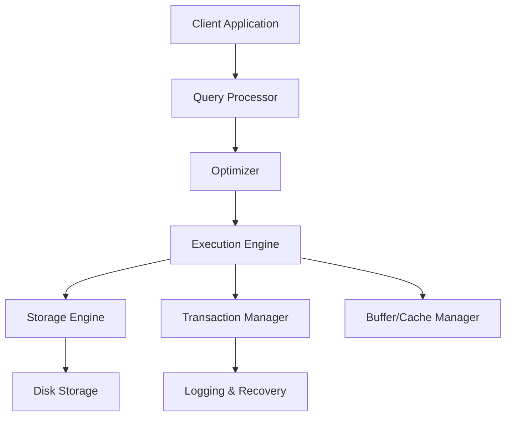
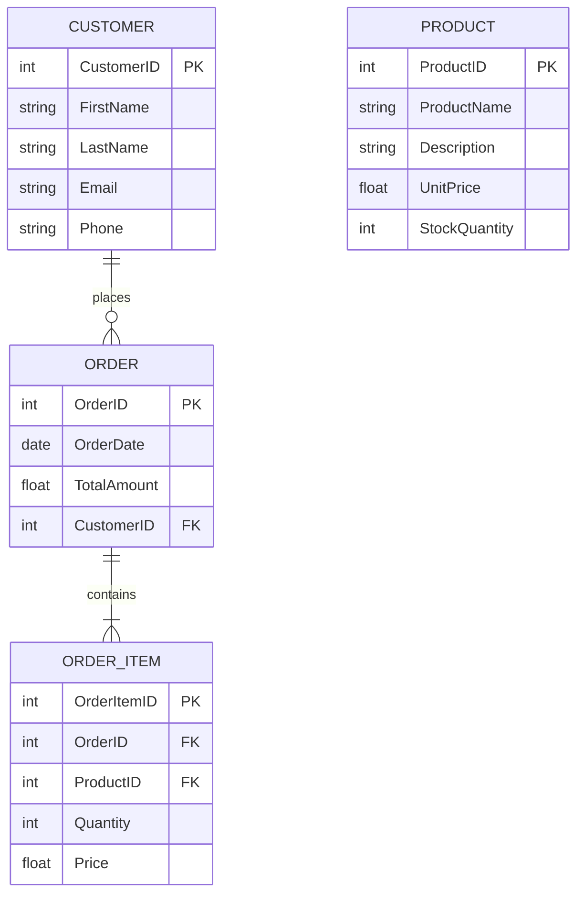
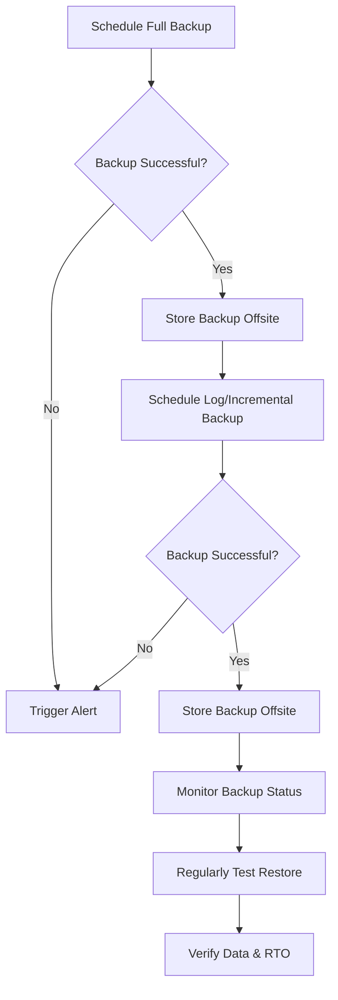

# Disclaimer
This repository contains information collected from various online sources and/or generated by AI assistants. The content provided here is for informational purposes only and is intended to serve as a general reference on various topics.

# Comprehensive Guide to Database Architectures with a Focus on Administration

Database architecture has long been a cornerstone of modern IT infrastructure. With the exponential growth of data in today’s digital age, efficient and scalable database systems are essential for ensuring the integrity, availability, and performance of information systems. This guide explores the various facets of database architecture, emphasizing not only design but also the crucial role of database administration.

At its core, database architecture encompasses the frameworks, models, and technology solutions that store, manage, and retrieve data. With the evolution from simple file storage systems to complex multi-model databases, administrators now face an array of challenges and opportunities when designing and maintaining systems that are robust, scalable, and secure.

This document is structured to provide a layered understanding, starting from historical context to modern implementations and future trends. Whether you are an experienced database administrator, a developer, or an IT strategist, the following sections aim to equip you with insights, methodologies, and best practices necessary for managing complex database environments.

## Table of Contents

  * [Introduction](#introduction)
  * [Historical Evolution of Database Architectures](#historical-evolution-of-database-architectures)
      * [The Early Days of Data Storage](#the-early-days-of-data-storage)
      * [Relational Database Revolution](#relational-database-revolution)
      * [The Emergence of NoSQL and NewSQL](#the-emergence-of-nosql-and-newsql)
  * [Core Concepts of Database Architecture](#core-concepts-of-database-architecture)
      * [Data Models and Schemas](#data-models-and-schemas)
      * [Database Engine Components](#database-engine-components)
      * [Storage, Memory, and Cache Management](#storage-memory-and-cache-management)
  * [Types of Database Architectures](#types-of-database-architectures)
      * [Relational Database Management Systems (RDBMS)](#relational-database-management-systems-rdbms)
      * [NoSQL Databases](#nosql-databases)
          * [Document Databases](#document-databases)
          * [Column-Family Stores](#column-family-stores)
          * [Key-Value Stores](#key-value-stores)
      * [NewSQL Databases](#newsql-databases)
      * [Graph Databases](#graph-databases)
      * [Time-Series Databases](#time-series-databases)
      * [In-Memory Databases](#in-memory-databases)
  * [Database Administration: Roles and Responsibilities](#database-administration-roles-and-responsibilities)
      * [Key Responsibilities](#key-responsibilities)
      * [Administration Tools and Interfaces](#administration-tools-and-interfaces)
      * [Security Management](#security-management)
  * [Designing a Robust Database Architecture](#designing-a-robust-database-architecture)
      * [Conceptual, Logical, and Physical Design](#conceptual-logical-and-physical-design)
      * [Entity Relationship (ER) Models and Diagrams](#entity-relationship-er-models-and-diagrams)
      * [Example: Designing a Retail Database](#example-designing-a-retail-database)
  * [Administration Techniques and Practices](#administration-techniques-and-practices)
      * [Backup and Recovery Strategies](#backup-and-recovery-strategies)
      * [Performance Tuning and Optimization](#performance-tuning-and-optimization)
      * [Replication, Clustering, and High Availability](#replication-clustering-and-high-availability)
      * [Monitoring and Logging](#monitoring-and-logging)
      * [Automation and Scripting](#automation-and-scripting)
  * [Scalability, Partitioning, and Sharding](#scalability-partitioning-and-sharding)
      * [Vertical vs. Horizontal Scaling](#vertical-vs-horizontal-scaling)
      * [Data Partitioning Techniques](#data-partitioning-techniques)
      * [Sharding Architecture](#sharding-architecture)
  * [Security Considerations in Database Administration](#security-considerations-in-database-administration)
      * [Access Control and User Management](#access-control-and-user-management)
      * [Encryption Techniques](#encryption-techniques)
      * [Auditing and Compliance](#auditing-and-compliance)
  * [Case Studies and Real-World Architectures](#case-studies-and-real-world-architectures)
      * [Enterprise Database Architecture](#enterprise-database-architecture)
      * [Cloud-Based Database Services](#cloud-based-database-services)
      * [Hybrid and Multi-Model Database Solutions](#hybrid-and-multi-model-database-solutions)
  * [Future Trends and Emerging Technologies](#future-trends-and-emerging-technologies)
      * [AI and Machine Learning in Database Administration](#ai-and-machine-learning-in-database-administration)
      * [Blockchain and Distributed Ledger Technologies](#blockchain-and-distributed-ledger-technologies)
  * [Detailed Administration Workflows](#detailed-administration-workflows)
      * [Workflow: Routine Backup and Recovery Process](#workflow-routine-backup-and-recovery-process)
      * [Workflow: Performance Monitoring and Tuning](#workflow-performance-monitoring-and-tuning)
      * [Workflow: Security Audit and Compliance](#workflow-security-audit-and-compliance)
  * [Advanced Topics in Database Administration](#advanced-topics-in-database-administration)
      * [Replication Conflict Resolution](#replication-conflict-resolution)
      * [Indexing Strategies for Large-Scale Systems](#indexing-strategies-for-large-scale-systems)
      * [Multi-Tenant Database Architectures](#multi-tenant-database-architectures)
      * [Disaster Recovery Planning](#disaster-recovery-planning)
      * [Automation in Large-Scale Environments](#automation-in-large-scale-environments)
  * [In-Depth Case Study: Designing and Administering an E-Commerce Database](#in-depth-case-study-designing-and-administering-an-e-commerce-database)
      * [Business Requirements](#business-requirements)
      * [Conceptual Design](#conceptual-design)
      * [Logical Schema](#logical-schema)
      * [Physical Design and Administration Considerations](#physical-design-and-administration-considerations)
      * [Monitoring and Maintenance](#monitoring-and-maintenance)
      * [Challenges and Solutions](#challenges-and-solutions)
  * [Emerging Trends and Future Directions](#emerging-trends-and-future-directions)
      * [Cloud-Native Databases](#cloud-native-databases)
      * [Serverless Database Architectures](#serverless-database-architectures)
      * [AI-Driven Administration](#ai-driven-administration)
      * [Blockchain and Distributed Ledger Databases](#blockchain-and-distributed-ledger-databases)
  * [Detailed Design Examples and Administration Tables](#detailed-design-examples-and-administration-tables)
      * [Example: Employee Management Database (RDBMS)](#example-employee-management-database-rdbms)
      * [Administration Tables](#administration-tables)
  * [Best Practices Recap](#best-practices-recap)
  * [In-Depth Administrative Strategies for Complex Systems](#in-depth-administrative-strategies-for-complex-systems)
      * [Multi-Layered Security Implementation](#multi-layered-security-implementation)
      * [Disaster Recovery: A Step-by-Step Plan](#disaster-recovery-a-step-by-step-plan)
      * [Cloud vs. On-Premise Administration](#cloud-vs-on-premise-administration)
  * [Future-Proofing Your Database Architecture](#future-proofing-your-database-architecture)
  * [Conclusion](#conclusion)
  * [References](#references-1)

## Introduction

In today’s digital age, data is a critical asset for all organizations. The way data is stored, managed, and accessed is defined by its database architecture. Choosing the right architecture and ensuring its effective administration are paramount for building applications that are performant, scalable, secure, and reliable. This guide delves into the world of database architectures, with a strong focus on the administrative considerations that ensure the health and efficiency of these systems.

From the early days of simple file-based systems to the complex, distributed databases of today, database technology has evolved dramatically. Understanding this evolution and the core concepts behind different data models is crucial for selecting the appropriate database type for a given use case.

This document will explore various types of database architectures, providing examples of popular database engines for each type and discussing their typical use cases. It will also provide a comprehensive overview of database administration, covering essential roles, responsibilities, techniques, and best practices needed to manage modern database environments effectively.

## Historical Evolution of Database Architectures

The journey of database systems reflects the increasing demands for more efficient, flexible, and scalable data storage and retrieval.

### The Early Days of Data Storage

Early data storage systems were largely file-based. Data was stored in flat files with simple structures. Accessing and managing this data was often cumbersome, requiring custom programming for each task.

Before the widespread adoption of dedicated database management systems, applications relied on file systems and custom data structures. Techniques like sequential access or indexed sequential access (ISAM) provided basic methods for organizing and retrieving records, but they lacked the power and flexibility of later database models.

#### Key Characteristics:

  * **Static Data Structures:** Data was often stored in a predefined layout, making schema evolution challenging.
  * **Limited Querying:** Searching and data manipulation were inefficient due to the absence of sophisticated query languages.
  * **High Redundancy:** Duplication of data was common, resulting in increased storage requirements and potential inconsistencies.
  * **Application-Specific Logic:** Data management rules were embedded within application code, making systems rigid and difficult to modify.

### Relational Database Revolution

The introduction of the relational model by Edgar F. Codd in the 1970s revolutionized data management. The relational model introduced the concept of organizing data into tables with defined relationships, based on mathematical set theory. This paved the way for Structured Query Language (SQL), a declarative language for querying and manipulating data.

Relational Database Management Systems (RDBMS) such as Oracle, IBM DB2, and later MySQL and PostgreSQL, implemented the relational model. Key features that contributed to their widespread adoption include:

  * **ACID Properties:** Guaranteeing transaction reliability (Atomicity, Consistency, Isolation, Durability).
  * **Data Integrity:** Enforced through schemas, keys (primary, foreign), and constraints.
  * **Declarative Querying (SQL):** Simplifying data retrieval and manipulation.
  * **Reduced Redundancy:** Through the process of normalization.

### The Emergence of NoSQL and NewSQL

As the volume, velocity, and variety of data exploded with the internet and big data trends, the scalability limitations of traditional RDBMS became apparent, particularly in handling massive amounts of unstructured or semi-structured data and requiring horizontal scaling. This led to the rise of NoSQL databases, which offered alternative data models and prioritized scalability and availability over strict ACID consistency (in some cases).

NoSQL (Not Only SQL) databases are a diverse group, categorized by their data models (document, key-value, column-family, graph). They were designed for specific use cases where the relational model was not the best fit, such as handling large amounts of streaming data, social network graphs, or content management systems.

NewSQL databases emerged as a response to the need for both the scalability of NoSQL and the transactional guarantees of RDBMS. These systems aim to provide the best of both worlds, often using distributed architectures while maintaining strong consistency.

## Core Concepts of Database Architecture

Understanding the foundational concepts of database architecture is crucial for both design and administration.

### Data Models and Schemas

A **data model** is an abstract model that organizes data and standardizes how data elements relate to each other and to the properties of real-world entities. It defines the logical structure of a database. Examples include the relational model, document model, graph model, key-value model, and column-family model.

A **schema** is the actual implementation of the data model within a specific database system. It defines the structure of the data, including table definitions, column names and data types (in relational databases), or the expected structure of documents and fields (in document databases), along with constraints and relationships. While some NoSQL databases are described as "schemaless," they typically have a flexible schema, meaning the structure can vary between data entries, but applications still rely on an understanding of the data's general form.

The choice of data model significantly impacts how data is stored, queried, and managed, influencing the overall database architecture and the required administrative tasks.

### Database Engine Components

The database engine is the core software component that processes data and manages database operations. While implementations vary across database types, common components often include:

1.  **Storage Engine:** Responsible for how data is physically stored on disk, managing file formats, indexing, data compression, and interaction with the file system or storage devices. Examples include InnoDB and MyISAM for MySQL, and WiredTiger for MongoDB.
2.  **Query Processor:** Parses, validates, and translates queries (e.g., SQL, declarative NoSQL queries, graph queries) into instructions that the database can execute.
3.  **Optimizer:** Analyzes potential query execution plans and selects the most efficient one based on factors like indexes, data statistics, and resource availability.
4.  **Execution Engine:** Carries out the chosen query execution plan by interacting with the storage engine and other components.
5.  **Transaction Manager:** Ensures that transactions adhere to ACID properties (or the specific consistency model of the database), managing concurrent access and maintaining data consistency.
6.  **Lock Manager:** Handles concurrency control by managing locks on data to prevent conflicts between simultaneous operations.
7.  **Logging and Recovery:** Maintains a log of all database changes to support transaction rollback and database recovery in case of system failures.
8.  **Buffer Manager/Cache Manager:** Manages the allocation of memory buffers and caches frequently accessed data to minimize expensive disk I/O operations.

#### Diagram: Simplified Database Engine Architecture



This diagram illustrates the simplified flow of a query from a client application through the core components of a database engine.

### Storage, Memory, and Cache Management

Efficiently managing storage and memory is crucial for database performance. Key aspects include:

  * **Disk Storage:** The physical medium where the database files reside. Performance is heavily influenced by the type of storage (HDD, SSD, NVMe) and the storage configuration (RAID levels).
  * **Memory (RAM):** Used for caching frequently accessed data, storing query execution plans, and supporting various database operations. Insufficient memory can lead to excessive disk I/O and performance bottlenecks.
  * **Caching:** Database systems utilize various caching mechanisms to store data, index blocks, and query results in memory, reducing the need to read from slower disk storage. The buffer pool (in RDBMS) or cache (in NoSQL) is a critical component that DBAs often tune.
  * **Buffer Management:** The process by which the database engine manages the transfer of data pages between disk and memory buffers. Efficient buffer management algorithms minimize disk reads and writes.
  * **Indexing:** While a data structure, indexes also have a storage and memory footprint. Properly designed and managed indexes are stored efficiently on disk and can be cached in memory to speed up lookups.

Administrators play a key role in monitoring memory and disk usage, configuring buffer pool sizes, and managing indexes to optimize performance based on the workload characteristics.

## Types of Database Architectures

Database systems can be categorized based on their underlying data model, architecture (centralized, distributed), and primary use case. Understanding these types is fundamental to choosing the right database and administering it effectively.

### Relational Database Management Systems (RDBMS)

RDBMS are based on the relational model, organizing data into tables with predefined schemas, rows, and columns. They excel at managing structured data and enforcing data integrity and relationships through constraints and foreign keys. They typically provide strong ACID guarantees.

  * **Database Engine Examples:**
    1.  **MySQL:** Popular open-source RDBMS, widely used for web applications. (e.g., InnoDB, MyISAM storage engines)
    2.  **PostgreSQL:** Powerful open-source RDBMS known for its extensibility and strong compliance with SQL standards.
    3.  **Oracle Database:** Leading commercial RDBMS, commonly used for enterprise-level applications and critical workloads.
    4.  **Microsoft SQL Server:** Commercial RDBMS developed by Microsoft, popular in enterprise Windows environments.
    5.  **IBM Db2:** Commercial RDBMS from IBM, used for mainframe, server, and cloud environments.
    6.  **MariaDB:** A community-developed fork of MySQL, offering enhanced features and performance.
    7.  **SQLite:** A small, self-contained, serverless, zero-configuration, transactional SQL database engine, often used for embedded applications or local data storage.
  * **Use Cases:**
      * Transactional applications (OLTP) like e-commerce platforms, banking systems, and CRM systems where data integrity and complex transactions are critical.
      * Applications with well-defined, structured data and complex relationships between entities.
      * Situations where strong consistency and ACID compliance are non-negotiable.

### NoSQL Databases

NoSQL (Not Only SQL) databases offer alternative data models and are designed for specific use cases that traditional RDBMS may not handle efficiently, particularly with large volumes of unstructured or semi-structured data and requiring high scalability and availability. They often relax some ACID constraints for performance and scalability. NoSQL databases are typically categorized by their data model:

#### Document Databases

Store data in flexible, semi-structured document formats (often JSON or BSON). They are schema-flexible, meaning documents within the same collection can have different structures. Ideal for content management, catalogs, and user profiles.

  * **Database Engine Examples:**
    1.  **MongoDB:** A widely popular general-purpose document database.
    2.  **Couchbase:** A distributed NoSQL document database often used for interactive applications.
    3.  **Amazon DocumentDB:** A managed document database service compatible with MongoDB workloads.
    4.  **Azure Cosmos DB (Document API):** Microsoft's globally distributed multi-model database service with a DocumentDB API for JSON documents.
    5.  **CouchDB:** A NoSQL document database that uses JSON for documents, combined with HTTP for an API and JavaScript for queries.
  * **Use Cases:**
      * Content Management Systems (CMS) where articles, blogs, or pages have varying structures.
      * User profiles and preferences, which can have diverse attributes.
      * Product catalogs with varying product specifications.
      * Applications requiring flexible schemas that can evolve quickly.

#### Column-Family Stores

Store data in rows and dynamic columns. They are optimized for writing large amounts of data and querying specific columns across many rows, making them suitable for analytics and time-series data.

  * **Database Engine Examples:**
    1.  **Apache Cassandra:** A highly scalable, distributed NoSQL database designed for handling large amounts of data across many commodity servers, providing high availability.
    2.  **HBase:** An open-source, non-relational, distributed database modeled after Google's Bigtable, often used with Apache Hadoop for large datasets.
    3.  **Google Bigtable:** A compressed, high-performance, proprietary data storage system, used by Google for web indexing and other applications.
    4.  **Apache Kudu:** A columnar storage engine for structured data, providing a combination of fast analytics and fast data ingestion.
    5.  **Azure Cosmos DB (Cassandra API):** Provides a managed Cassandra-compatible database service.
  * **Use Cases:**
      * Time-series data storage and analysis (e.g., sensor data, stock prices).
      * Big data analytics platforms.
      * Applications requiring high write throughput and read performance across specific columns.
      * Storing large amounts of semi-structured or sparse data.

#### Key-Value Stores

The simplest form of NoSQL database, storing data as a collection of key-value pairs. They are optimized for high-speed reads and writes of individual items based on their unique key.

  * **Database Engine Examples:**
    1.  **Redis:** An in-memory data structure store, used as a database, cache, and message broker. Known for its speed and support for various data structures (strings, lists, sets, hashes, etc.).
    2.  **Amazon DynamoDB:** A fully managed, serverless key-value and document database service provided by AWS.
    3.  **Riak:** A distributed NoSQL key-value data store designed for availability and fault tolerance.
    4.  **Memcached:** A high-performance, distributed memory object caching system.
    5.  **Etcd:** A distributed key-value store used for distributed systems, commonly used in Kubernetes for configuration management and service discovery.
  * **Use Cases:**
      * Caching layers for applications to reduce database load.
      * Storing session data for web applications.
      * Real-time leaderboards in gaming applications.
      * Storing simple configuration data.

### NewSQL Databases

NewSQL databases are a class of relational database systems that aim to provide the scalability of NoSQL while retaining the ACID properties and transactional consistency of traditional RDBMS. They are often designed for distributed environments and high throughput.

  * **Database Engine Examples:**
    1.  **CockroachDB:** A distributed SQL database designed for high availability and consistency, often described as "PostgreSQL compatible."
    2.  **Google Spanner:** A globally distributed, strongly consistent, and horizontally scalable database service.
    3.  **TiDB:** An open-source NewSQL database that aims to be MySQL compatible and provides horizontal scalability and strong consistency.
    4.  **VoltDB:** An in-memory NewSQL database designed for high-velocity data and real-time decision making.
    5.  **NuoDB:** A distributed relational database designed for elastic scalability and continuous availability.
  * **Use Cases:**
      * Applications requiring high transaction volumes and horizontal scalability while maintaining strong consistency (e.g., financial trading platforms, online gaming).
      * Migrating legacy RDBMS applications that require more scalability without a complete rewrite to a NoSQL model.

### Graph Databases

Graph databases use graph structures with nodes, edges, and properties to represent and store data. They are highly optimized for traversing and querying relationships between data entities.

  * **Database Engine Examples:**
    1.  **Neo4j:** A leading open-source graph database, known for its native graph storage and Cypher query language.
    2.  **Amazon Neptune:** A fully managed graph database service that supports popular graph models (Property Graph and RDF) and their query languages (Gremlin and SPARQL).
    3.  **ArangoDB:** A native multi-model database supporting document, key/value, and graph data models.
    4.  **OrientDB:** An open-source NoSQL database that supports document, graph, key/value, and object models.
    5.  **Microsoft Azure Cosmos DB (Graph API):** Provides a managed graph database service compatible with Apache TinkerPop Gremlin.
  * **Use Cases:**
      * Social networks (managing connections between users).
      * Recommendation engines (finding relationships between users and products).
      * Fraud detection (analyzing complex relationships in transaction data).
      * Knowledge graphs and identity management.

### Time-Series Databases

Time-series databases are specifically optimized for storing and querying data points that are indexed by time. They are designed for high-volume ingestion of time-stamped data and efficient queries over time ranges.

  * **Database Engine Examples:**
    1.  **InfluxDB:** An open-source time-series database optimized for handling high write and query loads.
    2.  **Prometheus:** An open-source monitoring system and time-series database, commonly used in cloud-native environments.
    3.  **TimescaleDB:** An open-source time-series database built as an extension on PostgreSQL.
    4.  **Amazon Timestream:** A fully managed time-series database service.
    5.  **Azure Time Series Insights:** A fully managed analytics, storage, and visualization service for time-series data.
  * **Use Cases:**
      * IoT (Internet of Things) data storage and analysis (e.g., sensor readings).
      * Monitoring and logging systems (storing system metrics and application logs).
      * Financial market data analysis.
      * Real-time analytics on streaming data with a time component.

### In-Memory Databases

In-memory databases store data primarily in random-access memory (RAM) rather than on disk. This allows for extremely fast data access and processing, making them suitable for applications requiring very low latency.

  * **Database Engine Examples:**
    1.  **Redis:** (Also a Key-Value store) Popular for its speed and versatile data structures.
    2.  **Memcached:** (Also a Key-Value store) Widely used as a caching layer.
    3.  **SAP HANA:** A commercial in-memory, column-oriented, relational database management system.
    4.  **Apache Ignite:** A distributed in-memory platform for high-performance computing and large-scale datasets.
    5.  **VoltDB:** (Also a NewSQL database) An in-memory RDBMS designed for high-velocity data.
  * **Use Cases:**
      * Real-time analytics and reporting.
      * High-frequency trading platforms.
      * Caching layers and session stores.
      * Gaming leaderboards and real-time data processing.

## Database Administration: Roles and Responsibilities

Database administration (DBA) is a critical role within IT departments, responsible for the design, implementation, maintenance, performance, security, and availability of databases. The specific tasks of a DBA can vary depending on the type of database architecture being managed.

### Key Responsibilities

Regardless of the database type, core DBA responsibilities include:

1.  **Installation and Configuration:**
      * Setting up database software and initial configurations.
      * Allocating system resources (memory, storage, CPU).
2.  **Maintenance and Upgrades:**
      * Applying patches, updates, and major version upgrades.
      * Performing routine maintenance tasks (e.g., monitoring log file growth, checking disk space).
3.  **Performance Monitoring and Tuning:**
      * Monitoring key performance metrics (query execution time, resource utilization).
      * Identifying and resolving performance bottlenecks (tuning queries, indexes, configuration parameters).
4.  **Backup and Recovery:**
      * Designing, implementing, and managing backup strategies.
      * Testing recovery procedures regularly to ensure data can be restored in case of failures or disasters.
5.  **Security Management:**
      * Implementing user authentication and authorization (access control).
      * Configuring encryption (at rest and in transit) and key management.
      * Monitoring security logs and responding to security incidents.
6.  **Disaster Recovery and High Availability:**
      * Implementing replication, clustering, or other HA/DR solutions.
      * Developing and testing comprehensive disaster recovery plans.
7.  **Compliance and Auditing:**
      * Ensuring database configurations and practices meet regulatory and organizational compliance requirements.
      * Enabling and reviewing audit logs to track database activity.
8.  **Automation and Scripting:**
      * Automating routine administrative tasks using scripts and automation tools.
      * Developing monitoring scripts and integrating with alerting systems.

### Administration Tools and Interfaces

DBAs utilize a variety of tools, which are often database-specific:

  * **Command-Line Interfaces (CLI):** Essential for direct interaction, scripting, and automation (e.g., `psql` for PostgreSQL, `mysql` command-line client, `mongo` shell, `cqlsh` for Cassandra, `redis-cli`).
  * **Graphical User Interfaces (GUI):** Provide visual interfaces for managing databases, Browse data, and performing administrative tasks (e.g., pgAdmin for PostgreSQL, SQL Server Management Studio, MongoDB Compass, Neo4j Browser, vendor-specific cloud provider consoles).
  * **Monitoring and Alerting Tools:** Used to track performance metrics, system health, and trigger alerts (e.g., Prometheus, Grafana, Nagios, Zabbix, Datadog, Azure Monitor, AWS CloudWatch).
  * **Backup and Recovery Utilities:** Database-native tools or third-party solutions for performing and managing backups (e.g., `pg_dump`/`pg_restore` for PostgreSQL, `mysqldump`/`mysqlrestore`, RMAN for Oracle).
  * **Automation and Configuration Management Tools:** For automating deployment, configuration, and routine tasks across multiple servers (e.g., Ansible, Puppet, Chef).
  * **Query Analysis Tools:** Help understand how queries are executed and identify bottlenecks (e.g., `EXPLAIN` in SQL databases, `explain()` in MongoDB).

### Security Management

Database security is paramount and involves multiple layers:

  * **Authentication and Authorization:** Verifying user identity and granting permissions based on roles and the principle of least privilege.
  * **Data Encryption:** Protecting sensitive data while it is stored on disk (at rest) and while it is being transmitted over a network (in transit).
  * **Auditing and Logging:** Recording database events and user actions to provide a trail for security analysis and compliance.
  * **Vulnerability Management:** Regularly scanning for vulnerabilities, applying security patches, and hardening the database system configuration.
  * **Network Security:** Using firewalls and network security groups to restrict access to database servers.

## Designing a Robust Database Architecture

Designing a database architecture is a structured process that moves from high-level concepts to detailed physical implementation.

### Conceptual, Logical, and Physical Design

1.  **Conceptual Design:** Focuses on understanding the business requirements and identifying the main entities and their relationships, independent of a specific database system. This typically results in an Entity-Relationship (ER) model.
2.  **Logical Design:** Translates the conceptual model into a detailed schema for a specific data model (e.g., relational schema with tables, columns, and constraints, or a document schema with document structures and relationships). This stage is independent of the specific database *product*.
3.  **Physical Design:** Maps the logical schema onto the physical storage structures of the chosen database system. This involves decisions about indexing strategies, partitioning, storage types (SSD vs. HDD), and replication/sharding configurations, optimizing for performance and cost on the specific hardware/cloud infrastructure.

### Entity Relationship (ER) Models and Diagrams

ER models are visual representations of the conceptual design, illustrating entities (things about which we store data), attributes (properties of entities), and relationships (how entities are connected). ER diagrams are essential for communicating the data structure to stakeholders and serve as a blueprint for the logical and physical design phases.

#### Example ER Diagram: Simplified Retail Database



This diagram shows the entities (`CUSTOMER`, `ORDER`, `ORDER_ITEM`, `PRODUCT`) and the relationships between them (`places`, `contains`). The attributes for each entity are listed, and primary keys (PK) and foreign keys (FK) are indicated.

### Example: Designing a Retail Database

Let's walk through a simplified design process for a retail database, illustrating the transition from conceptual to logical design for a relational database.

#### Step 1: Define Business Requirements

  * Manage customer information (name, contact, etc.).
  * Record product details and inventory levels.
  * Process customer orders, including items purchased.
  * Generate sales reports.

#### Step 2: Develop the Conceptual Model

  * Entities: Customer, Product, Order, OrderItem.
  * Relationships:
      * A Customer places one or more Orders.
      * An Order contains one or more OrderItems.
      * Each OrderItem refers to one Product.

#### Step 3: Logical Schema Definition (Relational Model)

Based on the conceptual model and normalization principles, we define tables:

  * **Customer Table:** Stores individual customer details.
  * **Product Table:** Stores information about each product.
  * **Order Table:** Records each customer order.
  * **OrderItem Table:** Details the specific products and quantities within each order, linking Orders and Products.

Example SQL CREATE TABLE statements for this logical design were provided in the previous section.

#### Step 4: Physical Design Considerations

This stage involves translating the logical schema to a specific RDBMS (e.g., PostgreSQL, MySQL) and making performance-related decisions:

  * **Indexing:** Based on expected queries (e.g., searching customers by email, querying orders by date or customer ID), create appropriate indexes.
  * **Data Types:** Choose specific SQL data types (e.g., `VARCHAR`, `INT`, `DECIMAL`, `DATE`) considering storage space and required precision.
  * **Partitioning:** If the `Orders` table is expected to grow very large, consider partitioning it by `OrderDate` to improve performance for queries filtering by date range.
  * **Storage Configuration:** Decide on the type of storage (SSD for performance-sensitive data) and potential RAID configurations for reliability and performance.

## Administration Techniques and Best Practices

Effective database administration goes beyond initial setup; it requires ongoing effort to ensure the database remains performant, secure, and available.

### Backup and Recovery Strategies

Having a robust and tested backup and recovery plan is paramount. Strategies include:

1.  **Full Backups:** Copying the entire database.
2.  **Differential Backups:** Copying data changed since the last full backup.
3.  **Incremental Backups:** Copying data changed since the last *any* backup (full or incremental).
4.  **Transaction Log Backups:** Capturing database changes in real-time or near-real-time to allow point-in-time recovery.

#### Key Practices:

  * **Automate Backups:** Use scheduling tools (cron, database agents, cloud backup services) to ensure backups happen regularly.
  * **Verify Backups:** Regularly test restoring data from backups to ensure they are valid and that recovery procedures work within the defined RTO.
  * **Offsite Storage:** Store backup copies in a separate physical location or a cloud storage service for disaster recovery purposes.
  * **Monitor Backup Jobs:** Implement monitoring to ensure backup jobs complete successfully and are within their scheduled windows.

### Performance Tuning and Optimization

This is an ongoing effort to maximize database efficiency:

1.  **Query Analysis and Tuning:** Identify slow-running queries using monitoring tools and logs. Use database-specific tools (`EXPLAIN`) to understand query execution plans and optimize SQL statements or indexing.
2.  **Index Management:** Create appropriate indexes to support common queries, but avoid excessive indexing, which can slow down writes. Regularly review index usage and remove unused indexes.
3.  **Database Configuration Tuning:** Adjust database server configuration parameters related to memory allocation, caching, and concurrent connections based on the workload.
4.  **Schema Optimization:** Refine the database schema based on performance bottlenecks identified. This might involve denormalization in RDBMS or changes to document structure in NoSQL.
5.  **Hardware/Infrastructure Optimization:** Ensure the underlying infrastructure (CPU, RAM, disk I/O, network) is sufficient for the workload.

### Replication, Clustering, and High Availability

These techniques ensure the database remains available even if a server fails:

1.  **Replication:** Creating copies of the database on other servers. Used for read scaling (directing read traffic to replicas) or as part of a high-availability strategy.
2.  **Clustering:** Linking multiple database servers together to work as a single unit, providing failover capabilities and sometimes load balancing for writes.
3.  **High Availability (HA):** Designing and implementing systems to minimize downtime. Often involves a combination of replication, clustering, and automated failover mechanisms.

#### Example: High Availability Setup Diagram (using Replication and Load Balancing)

```mermaid
flowchart TD
    A[Primary DB Node (Writes)] --> B[Replica Node 1 (Reads)]
    A --> C[Replica Node 2 (Reads)]
    B --> D[Read Load Balancer]
    C --> D[Read Load Balancer]
    D --> E[Client Application (Reads)]
    A --> F[Client Application (Writes)]
```

### Monitoring and Logging

Continuous monitoring is essential for detecting issues early:

  * **Collect Metrics:** Monitor server metrics (CPU, memory, disk I/O, network), database-specific metrics (connections, query throughput, cache hit ratio, replication lag), and application-level metrics (query response times).
  * **Centralize Logs:** Aggregate database logs (error logs, audit logs, slow query logs) into a central logging system for analysis.
  * **Set Up Alerts:** Configure alerts based on thresholds for critical metrics or specific log events.
  * **Use Monitoring Tools:** Leverage dedicated database monitoring tools, general-purpose monitoring systems (Prometheus, Grafana), or cloud provider monitoring services.

### Automation and Scripting

Automating routine and repetitive tasks is key to efficiency:

  * **Automated Backups and Restores:** Scripting backup procedures and testing restores.
  * **Automated Monitoring and Alerting:** Scripts to collect metrics, check logs, and trigger alerts.
  * **Automated Maintenance Tasks:** Scripts for index maintenance, statistics updates, and cleanup.
  * **Infrastructure as Code (IaC):** Using tools like Terraform or CloudFormation to automate database instance provisioning and configuration.
  * **Configuration Management:** Using tools like Ansible, Puppet, or Chef to automate database software installation and configuration on servers.

## Scalability, Partitioning, and Sharding

As data grows, scaling the database becomes a necessity.

### Vertical vs. Horizontal Scaling

  * **Vertical Scaling (Scaling Up):** Increasing the resources (CPU, RAM, storage) of a single database server. Simple to implement but has physical limits.
  * **Horizontal Scaling (Scaling Out):** Adding more database servers or nodes to the system to distribute the load. More complex but offers greater scalability potential, especially in distributed database architectures (many NoSQL and NewSQL databases are designed for horizontal scaling).

### Data Partitioning Techniques

Partitioning divides a large database table or collection into smaller, more manageable pieces within a single database instance. This can improve performance for queries that access specific partitions and make maintenance easier.

  * **Range Partitioning:** Dividing data based on ranges of a specific column's values (e.g., partitioning a sales table by year).
  * **List Partitioning:** Dividing data based on a list of discrete values in a column (e.g., partitioning by country or region).
  * **Hash Partitioning:** Dividing data based on a hash function applied to a column, aiming for even distribution across partitions.

### Sharding Architecture

Sharding is a type of horizontal scaling where data is divided into smaller pieces called shards, and each shard is stored on a separate database server or cluster. This allows the database to handle a much larger volume of data and traffic than a single server can.

  * **Shard Key:** The column(s) used to determine how data is distributed across shards. Choosing an effective shard key is critical for even data distribution and efficient query routing.
  * **Sharding Methods:** Common methods include range-based sharding, hash-based sharding, or directory-based sharding (using a lookup table).
  * **Sharding Components:** Sharded systems typically involve shard servers (storing the data), config servers (storing metadata about the shards), and query routers (directing queries to the appropriate shard(s)).

#### Example Sharding Design Diagram

```mermaid
flowchart LR
    A[Client Query] --> B[Query Router]
    B --> C[Shard 1 (Data Subset A)]
    B --> D[Shard 2 (Data Subset B)]
    B --> E[Shard 3 (Data Subset C)]
    B -- Reads Metadata --> F[Config Servers]
```

## Security Considerations in Database Administration

Database security is a critical concern, and DBAs play a central role in implementing and enforcing security measures.

### Access Control and User Management

  * **Authentication:** Verifying the identity of users and applications attempting to connect to the database. Strong authentication methods (passwords, certificates, integration with identity providers) are essential.
  * **Authorization:** Granting users and applications specific permissions (privileges) to perform actions (read, write, update, delete) on specific database objects (tables, collections, views). The principle of least privilege should always be applied.
  * **Role-Based Access Control (RBAC):** A common model for authorization where permissions are assigned to roles, and users are assigned to roles, simplifying management and ensuring consistency.

### Encryption Techniques

  * **Encryption at Rest:** Encrypting the data files stored on disk. This protects data in case of physical theft or unauthorized access to the storage media. Can be done at the database level (e.g., Transparent Data Encryption in SQL Server, WiredTiger encryption in MongoDB Enterprise) or at the filesystem/volume level.
  * **Encryption in Transit:** Encrypting data while it is being transmitted over a network. Using TLS/SSL for client-server communication is a standard practice.
  * **Key Management:** Securely managing the encryption keys used for encryption at rest and in transit. Hardware Security Modules (HSMs) or cloud key management services (e.g., AWS KMS, Azure Key Vault) are used for this purpose.

### Auditing and Compliance

  * **Auditing:** Recording database events and user actions in logs to provide a trail of activity. This is essential for security monitoring, forensic analysis, and accountability.
  * **Compliance:** Ensuring that database configurations and administrative practices adhere to relevant regulatory requirements (e.g., GDPR, HIPAA, PCI DSS) and internal organizational policies.
  * **Regular Reviews:** Periodically reviewing audit logs, security configurations, and access controls to ensure compliance and identify potential security gaps.

## Case Studies and Real-World Architectures

Understanding how different database architectures are applied in real-world scenarios provides valuable context.

### Enterprise Database Architecture

Large enterprises often utilize a complex database architecture that combines different database types to support diverse applications and workloads. This can include:

  * High-volume OLTP databases for core business applications (e.g., ERP, CRM) often using robust RDBMS with high availability and disaster recovery solutions.
  * Data warehouses or data lakes for business intelligence and analytics, often using columnar databases or distributed file systems with analytical processing engines.
  * NoSQL databases for specific applications like content management, IoT data ingestion, or user profile management.
  * Integration layers (ETL/ELT) to move and transform data between different systems.

#### Example Architecture Diagram (Simplified Enterprise)

```mermaid
flowchart TD
    A[Transactional Apps (RDBMS)] --> B[ETL Process]
    B --> C[Data Warehouse (Columnar)]
    A --> D[User Profile Service (Document DB)]
    C --> E[BI Tools]
    D --> F[Personalization Engine]
```

Administrators in this environment need expertise across multiple database technologies and focus on data integration, security across the landscape, and centralized monitoring.

### Cloud-Based Database Services

Cloud providers (AWS, Azure, Google Cloud) offer a wide range of managed database services based on various database types.

  * **Relational:** Amazon RDS, Azure SQL Database, Google Cloud SQL.
  * **NoSQL (Document):** Amazon DocumentDB, Azure Cosmos DB (Document API), MongoDB Atlas (managed service on cloud).
  * **NoSQL (Key-Value):** Amazon DynamoDB, Azure Cosmos DB (Key-Value API), Redis Enterprise Cloud.
  * **NoSQL (Column-Family):** Azure Cosmos DB (Cassandra API), managed Apache Cassandra services.
  * **Graph:** Amazon Neptune, Azure Cosmos DB (Graph API), Neo4j Aura (managed service on cloud).
  * **Time-Series:** Amazon Timestream, Azure Time Series Insights, InfluxDB Cloud.
  * **In-Memory:** Amazon ElastiCache (for Redis and Memcached), Azure Cache for Redis, SAP HANA Cloud.
  * **NewSQL:** CockroachDB Cloud, Google Spanner, Azure Cosmos DB (PostgreSQL API with Citus).

Cloud-based services reduce administrative overhead for tasks like patching, backups, and scaling, allowing DBAs to focus on performance tuning, security, and integration.

### Hybrid and Multi-Model Database Solutions

  * **Hybrid Cloud:** Combining on-premises databases with cloud databases, often for migration strategies or maintaining sensitive data on-premises. Requires robust connectivity and data synchronization.
  * **Multi-Model Databases:** Systems that natively support multiple data models within a single database engine (e.g., ArangoDB, Azure Cosmos DB). This simplifies managing diverse data types but requires administrators to understand the nuances of each model within the system.

## Future Trends and Emerging Technologies

The database landscape is continuously evolving, driven by new data challenges and technological advancements.

### AI and Machine Learning in Database Administration

AI and ML are being increasingly used to automate and optimize database administration tasks:

  * **Autonomous Databases:** Databases with built-in AI that can automatically tune performance, apply patches, and manage security with minimal human intervention (e.g., Oracle Autonomous Database).
  * **Predictive Monitoring:** Using ML to analyze monitoring data and predict potential performance issues or failures before they occur.
  * **Automated Anomaly Detection:** Using AI to identify unusual patterns in database activity that could indicate security threats or operational problems.

### Blockchain and Distributed Ledger Technologies

While not traditional databases, blockchain and distributed ledger technologies (DLTs) offer new paradigms for storing and managing data, particularly where immutability, transparency, and decentralization are required. They can be used in conjunction with traditional databases for specific use cases like supply chain tracking or verifiable logs.

## Detailed Administration Workflows

Below we outline detailed workflows for common database administration tasks.

### Workflow: Routine Backup and Recovery Process

1.  **Schedule Full Backups:** Configure the database system or external tool to perform a full backup at a regular interval (e.g., daily, weekly) during off-peak hours.
2.  **Configure Transaction Log/Incremental Backups:** For databases requiring point-in-time recovery, configure frequent transaction log backups (RDBMS) or incremental backups (some NoSQL) to capture changes between full backups.
3.  **Automate Backup Storage:** Configure backups to be stored automatically in a secure, reliable location, ideally offsite or in cloud storage. Implement data retention policies.
4.  **Implement Backup Monitoring:** Set up monitoring to verify that backup jobs complete successfully without errors or warnings. Configure alerts for failures.
5.  **Regularly Test Restorations:** Schedule and perform test recoveries from your backups regularly (e.g., monthly or quarterly) to a non-production environment. Verify that the data is consistent and that the recovery process meets your defined RTO.
6.  **Document and Review:** Maintain clear documentation of your backup and recovery procedures and the location of backup files. Review and update the plan based on testing results and changes in the environment or RPO/RTO requirements.

#### Backup Workflow Diagram



### Workflow: Performance Monitoring and Tuning

1.  **Establish Baseline Metrics:** Before making changes or when a system is stable, define and record normal performance metrics (CPU, RAM, Disk I/O, network, key database metrics like connections, query throughput, cache hit ratio, average query time) to understand typical behavior.
2.  **Continuous Monitoring:** Use monitoring tools to continuously collect real-time and historical performance data. Visualize key metrics on dashboards.
3.  **Identify Performance Issues:** Analyze dashboards for spikes, trends, or anomalies that indicate performance problems. Review error logs and slow query logs to pinpoint specific issues.
4.  **Analyze Root Cause:** Use database-specific tools (e.g., `EXPLAIN PLAN`, query profilers) to understand why a query is slow or why the system is experiencing bottlenecks. This might involve identifying missing indexes, inefficient query logic, locking issues, or resource contention.
5.  **Implement Tuning Changes:** Based on the analysis, implement tuning changes. This could involve creating or modifying indexes, rewriting inefficient queries, adjusting database configuration parameters, or optimizing the underlying infrastructure.
6.  **Test Changes:** Apply tuning changes first in a non-production environment and test their impact on performance using representative workloads.
7.  **Monitor After Changes:** Closely monitor performance metrics in production after deploying tuning changes to confirm they had the desired positive impact and did not introduce new issues.
8.  **Iterate and Refine:** Performance tuning is an ongoing process. Regularly review performance, analyze new bottlenecks, and continue to refine the database and queries.

#### Performance Tuning Script Example (PostgreSQL - using EXPLAIN)

```sql
-- Analyze the execution plan of a query
EXPLAIN ANALYZE
SELECT customer_name, order_date
FROM customers c JOIN orders o ON c.customer_id = o.customer_id
WHERE o.order_date > '2023-01-01'
ORDER BY o.order_date DESC;

-- (Output of EXPLAIN ANALYZE will show how the query was executed,
-- including index usage, join methods, and execution time)

-- Example: Create an index if the above analysis shows a sequential scan on orders.order_date
CREATE INDEX orders_order_date_idx ON orders (order_date DESC);
```

### Workflow: Security Audit and Compliance

1.  **Define Security Policies and Compliance Requirements:** Understand organizational security policies and relevant external regulations (e.g., GDPR, HIPAA, PCI DSS) that apply to the database.
2.  **Review Access Controls:** Regularly audit user accounts, roles, and permissions to ensure they adhere to the principle of least privilege. Remove unused accounts and excessive privileges.
3.  **Review Authentication and Authorization Settings:** Verify that strong authentication methods are enforced and that RBAC or other authorization mechanisms are correctly configured.
4.  **Check Encryption Status:** Verify that data at rest and in transit is encrypted according to policy. Review key management practices.
5.  **Review Audit Logs:** Regularly review database audit logs for suspicious activity, unauthorized access attempts, or unusual patterns. Use automated tools to flag anomalies.
6.  **Check for Vulnerabilities and Apply Patches:** Regularly scan the database system for known vulnerabilities. Ensure that security patches and updates are applied promptly.
7.  **Review Network Security:** Verify that network security controls (firewalls, NSGs) restricting access to database servers are correctly configured and aligned with policy.
8.  **Document and Report:** Document the findings of security audits and compliance checks. Report on compliance status to relevant stakeholders.
9.  **Remediate Findings:** Address any security vulnerabilities, policy violations, or non-compliant configurations identified during the audit.
10. **Schedule Regular Audits:** Establish a regular schedule for security audits and compliance reviews (e.g., quarterly, annually).

#### Security Audit Table Example (Tracking Access Reviews)

| Review ID | Date Completed | Database System | Scope (e.g., Subscription, DB Instance) | Reviewer(s) | Findings | Remediation Actions | Status |
| :-------- | :------------- | :-------------- | :-------------------------------------- | :---------- | :------- | :------------------ | :----- |
| SecAudit-001 | 2023-10-15     | PostgreSQL Prod | Subscription 'Production-Apps'          | Jane Doe, IT Security | Excessive 'Owner' roles found | Reduce privileges for non-admins | Completed |
| SecAudit-002 | 2023-11-20     | MongoDB Cluster | 'User Profiles' Collection              | John Smith | Missing audit logging for 'read' operations | Enable detailed read auditing | In Progress |

-----

## Advanced Topics in Database Administration

This section delves into more complex administrative areas often encountered in large-scale or distributed database environments.

### Replication Conflict Resolution

In multi-master replication setups (where writes can occur on multiple nodes), conflicts can arise when the same data is modified concurrently on different nodes before those changes are synchronized. Resolving these conflicts requires specific strategies:

  * **Last Write Wins (LWW):** The simplest approach; the change with the most recent timestamp prevails. This can lead to data loss.
  * **Merge Strategies:** Application-defined logic or database features that attempt to merge conflicting changes intelligently.
  * **Conflict Detection and Reporting:** Identifying conflicts and logging them for manual resolution or review.
  * **Application-Level Resolution:** Designing the application logic to prevent or handle potential conflicts before writing to the database.

### Indexing Strategies for Large-Scale Systems

Managing indexes in very large databases requires advanced techniques:

  * **Partitioned Indexes:** Creating indexes that align with data partitions, which can improve performance for queries filtered by the partitioning key.
  * **Covering Indexes:** Indexes that include all the columns needed by a query (both in the `WHERE` clause and the `SELECT` list), allowing the database to retrieve all necessary data directly from the index without accessing the main table, significantly speeding up read queries.
  * **Functional Indexes:** Indexes based on the result of a function or expression applied to one or more columns.
  * **Geospatial and Text Indexes:** Specialized indexes for specific data types and query patterns.

### Multi-Tenant Database Architectures

Administering databases that serve multiple independent customers (tenants) from a single database instance requires careful isolation and management:

  * **Tenant Isolation:** Ensuring that data and operations from one tenant are securely separated from others. This is achieved through schema design (shared table with tenant ID, isolated schemas) and strict access control.
  * **Resource Management:** Monitoring and managing resource consumption (CPU, memory, storage, connections) per tenant to prevent one tenant from impacting the performance of others ("noisy neighbor" problem).
  * **Backup and Restore:** Developing strategies for backing up and restoring individual tenant data, which can be complex in shared-schema models.

#### Multi-Tenant Design Table (Recap)

| Approach          | Isolation Level | Scalability | Complexity (Admin/Dev) | Data Redundancy | Cost (Infrastructure) |
| :---------------- | :-------------- | :---------- | :--------------------- | :-------------- | :-------------------- |
| **Shared Schema** | Low             | High        | Low                    | Low             | Low                   |
| **Isolated Schema**| Medium          | Medium-High | Medium                 | Low             | Medium                |
| **Dedicated DB** | High            | Lower\* | High                   | Low             | High                  |

\*Lower scalability *per database instance*, but overall application scalability is achieved by adding more database instances.

### Disaster Recovery Planning

Developing a robust DR plan is crucial for business continuity:

  * **Business Impact Analysis (BIA):** Identify critical business processes and the databases they rely on. Define the maximum acceptable downtime (RTO) and data loss (RPO) for each.
  * **Threat and Risk Assessment:** Identify potential threats (natural disasters, cyberattacks, hardware failure) and their potential impact on database availability and data integrity.
  * **Strategy Selection:** Choose DR strategies (e.g., backup/restore to a secondary site/region, replication to a secondary site/region, active-passive clustering, active-active clustering) that meet the defined RTO and RPO objectives.
  * **Implementation:** Configure the necessary infrastructure (secondary site, network connectivity) and database features (replication, clustering, backup automation).
  * **Documentation:** Create a detailed, step-by-step DR plan that includes roles, responsibilities, procedures for failover and failback, and communication plans.
  * **Testing:** Regularly conduct non-disruptive DR drills to validate the plan, procedures, and RTO/RPO objectives. Identify and address any issues found during testing.
  * **Maintenance:** Periodically review and update the DR plan based on changes in the IT environment, business requirements, and testing results.

### Automation in Large-Scale Environments

In environments with many database instances or complex management tasks, automation is not just a best practice; it's a necessity.

  * **Automated Provisioning:** Use IaC tools (Terraform, CloudFormation) to automate the creation and initial configuration of database instances.
  * **Automated Configuration Management:** Use tools like Ansible, Puppet, or Chef to automate the installation, configuration, and patching of database software and operating systems.
  * **Automated Monitoring Deployment:** Automate the deployment and configuration of monitoring agents and alerting rules.
  * **Automated Remediation:** Create scripts or automation runbooks that automatically respond to specific alerts (e.g., automatically restart a service, scale up resources).
  * **Automated Testing:** Automate the testing of backups, DR failover, and application performance after deployment or configuration changes.

## In-Depth Case Study: Designing and Administering an E-Commerce Database

This section delves deeper into the design and administration considerations for an e-commerce database, illustrating how various architectural and administrative concepts come together.

### Business Requirements

  * High volume of read traffic (Browse products).
  * Moderate volume of write traffic (placing orders, updating inventory).
  * Need for real-time inventory updates.
  * Requirement for secure handling of customer and payment data.
  * Need for analytics on sales data and customer behavior.
  * Ability to scale to handle peak traffic (e.g., holiday seasons).
  * High availability and disaster recovery are critical.

### Conceptual Design

Entities: `User`, `Product`, `Category`, `Order`, `OrderItem`, `Review`, `PaymentTransaction`.
Relationships: User places Order, Order contains OrderItem, OrderItem refers to Product, Product belongs to Category, User writes Review for Product, Order has PaymentTransaction.

### Logical Schema (Considering a Primary Relational Model with Potential NoSQL Augmentation)

  * **Relational Tables:**
      * `Users`: User details (UserID PK, Username, PasswordHash, Email, RegistrationDate).
      * `Products`: Product details (ProductID PK, ProductName, Description, Price, CategoryID FK, StockQuantity).
      * `Categories`: Product categories (CategoryID PK, CategoryName).
      * `Orders`: Order header details (OrderID PK, UserID FK, OrderDate, TotalAmount, OrderStatus).
      * `OrderItems`: Details of items in an order (OrderItemID PK, OrderID FK, ProductID FK, Quantity, UnitPrice).
      * `PaymentTransactions`: Payment details (TransactionID PK, OrderID FK, Amount, PaymentStatus, TransactionDate).
  * **Potential NoSQL Augmentation:**
      * `ProductReviews` (Document DB): Store potentially varied review data (ProductID, UserID, Rating, Comment, ReviewDate, nested fields for votes, etc.). This allows for flexible schema for reviews and easier querying by ProductID.
      * `UserActivityStream` (Time-Series/Document DB): Store user Browse behavior, clicks, etc., for personalization and analytics.

### Physical Design and Administration Considerations

  * **RDBMS (e.g., PostgreSQL/MySQL Cluster):**
      * High Availability: Implement a multi-node cluster with synchronous replication for critical tables (Orders, OrderItems, PaymentTransactions) to prevent data loss on node failure. Use asynchronous replicas for read scaling (Product catalog, User profiles).
      * Indexing: Create indexes on frequently queried fields (e.g., `email` in Users, `CategoryID` and `ProductName` in Products, `OrderDate` and `UserID` in Orders, `ProductID` and `OrderID` in OrderItems). Consider compound indexes for common query patterns (e.g., querying OrderItems by `OrderID` and `ProductID`).
      * Partitioning: Partition large tables like `Orders` and `PaymentTransactions` by date range for improved performance and manageability of historical data.
      * Storage: Use SSDs for all database storage for high performance.
  * **NoSQL (e.g., MongoDB Cluster for Reviews):**
      * Sharding: If the number of product reviews is expected to be massive, shard the `ProductReviews` collection, possibly using `ProductID` as the shard key for efficient querying of reviews for a specific product.
      * Indexing: Index `ProductID` and `ReviewDate` in the `ProductReviews` collection for efficient querying and sorting.
      * High Availability: Deploy the MongoDB cluster as a replica set (for data redundancy and failover) and potentially with sharding (for scalability).
  * **Security:**
      * Implement strong authentication and RBAC for all database access. Separate credentials for application access vs. administration.
      * Encrypt sensitive data: Use encryption at rest for all storage. Use encryption in transit (TLS/SSL) for all connections. Hash user passwords. Encrypt payment details using column-level encryption or dedicated payment processing services.
      * Auditing: Enable detailed auditing for sensitive tables (Users, PaymentTransactions, Orders).
  * **Performance Tuning:**
      * Monitor query performance on both RDBMS and NoSQL databases. Analyze slow queries and optimize indexes and queries.
      * Implement caching (e.g., Redis) for frequently accessed product catalog data to reduce load on the RDBMS.
      * Monitor replication lag in the RDBMS cluster.
  * **Backup and Recovery:**
      * Implement automated daily full backups and frequent transaction log backups for the RDBMS.
      * Configure scheduled backups for the MongoDB cluster.
      * Store backups offsite/in cloud storage.
      * Regularly test recovery procedures for both database types.
  * **Disaster Recovery:**
      * Implement cross-region replication for both the RDBMS and NoSQL clusters.
      * Develop a comprehensive DR plan with automated failover procedures and regularly test it.

### Monitoring and Maintenance

  * **Centralized Monitoring:** Use a single monitoring system (e.g., Prometheus with exporters for RDBMS and MongoDB, Grafana for dashboards) to monitor all database components (RDBMS nodes, MongoDB replica sets/shards) and key metrics.
  * **Alerting:** Configure alerts for critical issues (e.g., replication lag, high resource utilization, low disk space, backup failures, security alerts).
  * **Automated Maintenance:** Script routine tasks like index maintenance (RDBMS), log rotation, and certificate renewal.
  * **Patch Management:** Implement a process for applying database software patches and updates to address security vulnerabilities and bugs.

### Challenges and Solutions

  * **Real-time Inventory:** Use transactional RDBMS with appropriate locking for accurate stock updates during order placement. Consider optimistic concurrency or queuing for high-volume updates if strict real-time consistency is not required for every read.
  * **Analytics:** Replicate transactional data to a separate data warehouse or use analytical databases/tools (e.g., a data lake with Spark or Snowflake) for complex reporting to avoid impacting the performance of the transactional RDBMS.
  * **Scalability:** Implement horizontal scaling (read replicas for RDBMS, sharding for MongoDB). Use load balancers to distribute traffic.
  * **Data Consistency (Hybrid):** Implement robust ETL/ELT processes or change data capture (CDC) to synchronize data between the RDBMS and any analytical stores or other databases.

## Emerging Trends and Future Directions

  * **Cloud-Native Services:** Increasingly leveraging fully managed cloud database services (RDS, Aurora, DocumentDB, Cosmos DB) to reduce operational overhead.
  * **Serverless Databases:** Exploring serverless options (Aurora Serverless, Cosmos DB) for variable workloads.
  * **AI-Driven Administration:** Utilizing cloud provider AI/ML services for automated performance tuning, anomaly detection, and cost optimization.
  * **Multi-Cloud and Hybrid:** Designing architectures that span multiple cloud providers or combine cloud and on-premises resources, requiring expertise in managing connectivity, data synchronization, and security across diverse environments.

## Detailed Design Examples and Administration Tables

### Example: Employee Management Database (RDBMS - PostgreSQL)

#### Table Designs and Relationships

  * **Employee Table:** Stores employee details. `EmployeeID` is the primary key. `DepartmentID` is a foreign key referencing the `Department` table.
  * **Department Table:** Stores department details. `DepartmentID` is the primary key. `ManagerID` could be a foreign key referencing `EmployeeID` (representing the employee who is the manager of the department).

<!-- end list -->

```sql
CREATE TABLE Department (
    DepartmentID SERIAL PRIMARY KEY, -- Use SERIAL for auto-incrementing integer
    DepartmentName VARCHAR(100) NOT NULL,
    ManagerID INT UNIQUE, -- ManagerID should be unique to avoid one employee managing multiple departments in this simple model
    Location VARCHAR(100),
    -- Add a self-referencing foreign key constraint later if the Employee table is created first
    CONSTRAINT fk_department_manager FOREIGN KEY (ManagerID) REFERENCES Employee(EmployeeID)
);

CREATE TABLE Employee (
    EmployeeID SERIAL PRIMARY KEY,
    FirstName VARCHAR(50) NOT NULL,
    LastName VARCHAR(50) NOT NULL,
    Email VARCHAR(100) UNIQUE NOT NULL,
    HireDate DATE NOT NULL,
    DepartmentID INT,
    Salary DECIMAL(10,2),
    -- Foreign key to Department
    CONSTRAINT fk_employee_department FOREIGN KEY (DepartmentID) REFERENCES Department(DepartmentID)
    -- CHECK constraint for Salary
    CONSTRAINT chk_employee_salary CHECK (Salary >= 0)
);

-- Now add the foreign key constraint to the Department table, referencing the Employee table
ALTER TABLE Department
ADD CONSTRAINT fk_department_manager FOREIGN KEY (ManagerID) REFERENCES Employee(EmployeeID);

-- Example Data Insertion:
INSERT INTO Department (DepartmentName, Location) VALUES ('IT', 'Headquarters'); -- Insert department first
INSERT INTO Employee (FirstName, LastName, Email, HireDate, DepartmentID, Salary) VALUES ('Alice', 'Johnson', 'alice.johnson@example.com', '2018-05-01', 1, 75000.00); -- Insert employee
UPDATE Department SET ManagerID = (SELECT EmployeeID FROM Employee WHERE FirstName = 'Alice') WHERE DepartmentName = 'IT'; -- Update manager ID

INSERT INTO Department (DepartmentName, Location) VALUES ('Finance', 'Branch Office');
INSERT INTO Employee (FirstName, LastName, Email, HireDate, DepartmentID, Salary) VALUES ('Bob', 'Smith', 'bob.smith@example.com', '2019-06-15', 2, 68000.00);
UPDATE Department SET ManagerID = (SELECT EmployeeID FROM Employee WHERE FirstName = 'Bob') WHERE DepartmentName = 'Finance';
```

#### Indexing Example:

  * Index on `DepartmentID` in the `Employee` table to speed up queries joining `Employee` and `Department` or filtering by department.
  * Index on `LastName` in the `Employee` table for searching employees by last name.

<!-- end list -->

```sql
CREATE INDEX idx_employee_department_id ON Employee (DepartmentID);
CREATE INDEX idx_employee_last_name ON Employee (LastName);
```

### Administration Tables (Example Templates)

These tables serve as templates for administrative documentation and processes.

#### Database Maintenance Schedule Template

| Task                          | Frequency   | Responsible Team | Tools/Commands                     | Monitoring        | Notes                             |
| :---------------------------- | :---------- | :--------------- | :--------------------------------- | :---------------- | :-------------------------------- |
| Full Backup                   | Daily       | DBA Team         | Vendor Backup Tool / Custom Script | Backup Job Status | Run during maintenance window     |
| Incremental/Log Backup        | Hourly      | DBA Team         | Vendor Backup Tool / Custom Script | Backup Job Status | Ensure sufficient log space       |
| Backup Restoration Test       | Monthly     | DBA Team         | Vendor Restore Tool                | Recovery Time     | Verify data integrity             |
| Index Maintenance (Rebuild/Reorganize) | Weekly/Monthly | DBA Team         | SQL Scripts / Vendor Tools         | Query Performance | Based on fragmentation levels     |
| Statistics Updates            | Daily/Weekly | DBA Team         | SQL Scripts / Vendor Tools         | Query Performance | Ensure optimizer has accurate data |
| Disk Space Check              | Daily       | Operations/DBA   | Monitoring Tools                   | Disk Usage        | Alert on high utilization         |
| Error Log Review              | Daily       | DBA Team         | Log Monitoring Tool                | Error Counts      | Investigate critical errors       |
| Security Patching             | Quarterly   | DBA Team         | Vendor Update Tools                | Vulnerability Scans | Coordinate with change management |

#### Example Database Inventory Table

| Database Name     | Database Type   | Version | Hostname/Cluster Name | Primary Region | DR Region | Primary Use Case        | Owner Team | RTO  | RPO  | Backup Method | DR Method      |
| :---------------- | :-------------- | :------ | :-------------------- | :------------- | :-------- | :---------------------- | :--------- | :--- | :--- | :------------ | :------------- |
| OrdersDB          | PostgreSQL RDBMS | 14      | pg-cluster-prod       | East US        | West US   | E-commerce Transactions | App Team 1 | 4h   | 15m  | pg\_dump/logs  | ASR / Replication |
| UserProfilesDB    | MongoDB Document | 5.0     | mongo-cluster-prod    | East US        | West US   | User Management         | App Team 2 | 8h   | 1h   | Scheduled Backups | Cross-Region Replication |
| ProductCatalogDB  | MySQL RDBMS     | 8.0     | mysql-cluster-prod    | East US        | N/A       | Read-heavy Catalog      | App Team 1 | 24h  | 4h   | mysqldump     | None (Less Critical) |
| AnalyticsDW       | Snowflake       | N/A     | snowflake-account     | Central US     | N/A       | Data Warehousing        | Data Team  | N/A  | Daily | Built-in      | N/A            |

-----

## Best Practices Recap

To ensure the smooth operation and effectiveness of database systems, database administrators should consistently apply these best practices:

  * **Prioritize Backup and Recovery:** A well-defined, automated, and regularly tested backup and recovery strategy is fundamental. Data is your most valuable asset; ensure you can recover it.
  * **Focus on Performance:** Continuously monitor database performance, analyze slow queries, and optimize indexing and configurations to ensure the database meets application performance requirements.
  * **Implement Robust Security:** Enforce strong authentication and authorization (RBAC with least privilege), encrypt data at rest and in transit, conduct regular security audits, and manage vulnerabilities proactively.
  * **Design for High Availability and Disaster Recovery:** Implement replication, clustering, and failover mechanisms to minimize downtime. Develop, document, and regularly test a comprehensive DR plan.
  * **Automate Repetitive Tasks:** Leverage scripting, IaC, and configuration management tools to automate routine administrative tasks, reducing manual effort, ensuring consistency, and minimizing human error.
  * **Monitor Proactively:** Implement comprehensive monitoring of database and system metrics, logs, and security events. Set up effective alerting to detect and respond to issues promptly.
  * **Document Thoroughly:** Maintain clear, up-to-date documentation of database architecture, configurations, policies, procedures, and recovery plans.
  * **Plan for Scalability:** Design your architecture with future growth in mind, considering partitioning, sharding, or horizontal scaling strategies where appropriate.
  * **Stay Updated:** Continuously learn about new database technologies, versions, features, and security best practices.
  * **Communicate Effectively:** Maintain clear communication with development teams, stakeholders, and other IT teams regarding database status, performance, and requirements.

-----

## In-Depth Administrative Strategies for Complex Systems

### Multi-Layered Security Implementation

A layered security approach provides defense in depth:

1.  **Perimeter Security:** Firewalls, VPNs, and Network Security Groups to control network access to database servers.
2.  **Host Security:** Hardening the operating system, applying OS patches, using host-based firewalls, and implementing intrusion detection/prevention systems on database servers.
3.  **Database Software Security:** Configuring database authentication and authorization (RBAC), enabling auditing, encrypting data at rest and in transit, and applying database software patches and updates.
4.  **Application Security:** Designing applications to prevent common vulnerabilities like SQL injection, securely handling user credentials, and encrypting sensitive data before storing it.
5.  **Physical Security:** Protecting the physical servers and storage media where the database resides (especially for on-premises deployments).

### Disaster Recovery: A Step-by-Step Plan (Detailed)

1.  **Business Impact Analysis (BIA):** Work with business stakeholders to identify critical business functions, the IT systems (including databases) that support them, and define the acceptable downtime (RTO) and data loss (RPO) for each.
2.  **Risk Assessment:** Identify potential threats (natural disasters, cyberattacks, power outages, hardware failures) and assess their likelihood and potential impact on critical databases.
3.  **Strategy Selection:** Choose DR strategies (e.g., backup/restore, warm standby, hot standby/active-passive, active-active) that meet the defined RTO/RPO objectives and fit within budget constraints. Consider using cloud regions for secondary DR sites.
4.  **Implementation:**
      * Set up the secondary infrastructure in the DR site/region (servers, storage, networking).
      * Configure database replication to the secondary site (synchronous or asynchronous based on RPO).
      * Implement automated failover mechanisms to switch to the secondary site if the primary fails.
      * Configure backups and ensure they are stored in a separate location (offsite or in a different cloud region).
5.  **Documentation:** Create a detailed DR plan document outlining:
      * Contact information for key personnel (DBA, Infrastructure, Application teams, Business stakeholders).
      * Step-by-step procedures for declaring a disaster.
      * Detailed failover procedures for each critical database system, including dependencies.
      * Procedures for verifying system functionality in the DR site.
      * Procedures for failback once the primary site is restored.
      * Communication plans.
6.  **Testing:** Regularly conduct DR drills (simulated failovers) to validate the plan and procedures. Test drills should be non-disruptive to production where possible (e.g., using ASR test failovers). Measure the actual recovery time achieved during the drill and compare it to the RTO.
7.  **Training:** Ensure that all personnel involved in the DR plan are trained on their roles and responsibilities and the execution procedures.
8.  **Maintenance:** Review and update the DR plan documentation and configurations periodically (e.g., annually or whenever there are significant changes to the database architecture or business requirements). Review the results of DR drills and testing to identify areas for improvement.

### Cloud vs. On-Premise Administration

  * **Cloud-Based Administration:**
      * **Pros:** Reduced infrastructure management (patching, hardware maintenance), easier scalability, built-in HA/DR options, global reach, often pay-as-you-go pricing.
      * **Cons:** Potential vendor lock-in, reliance on cloud provider for underlying infrastructure health, need for cloud-specific expertise, network latency considerations, data sovereignty concerns.
      * **Administration Focus:** Performance tuning of the database engine and queries, security configuration within the cloud platform, monitoring cloud metrics, managing costs, planning for elasticity and cloud-specific DR.
  * **On-Premise Administration:**
      * **Pros:** Full control over hardware, network, and software stack; potentially higher customization; can be more cost-effective for stable, predictable, large workloads over long periods.
      * **Cons:** Higher initial capital expenditure, manual hardware maintenance and patching, manual HA/DR implementation and testing, scalability challenges, limited global reach, requires in-house expertise across hardware, OS, and database layers.
      * **Administration Focus:** Hardware management, operating system administration and patching, network configuration, manual installation and patching of database software, manual HA/DR setup and testing, capacity planning, power and cooling management.

-----

## Future-Proofing Your Database Architecture

Staying ahead in the rapidly evolving database landscape requires conscious effort:

  * **Embrace Cloud Computing:** Leverage cloud database services for scalability, managed administration, and access to new technologies.
  * **Adopt IaC and Automation:** Automate database provisioning, configuration, and management to improve efficiency and repeatability.
  * **Explore Multi-Model Capabilities:** Consider databases that support multiple data models to handle diverse data types within a single system where appropriate.
  * **Invest in AI/ML for Administration:** Explore tools and services that use AI/ML for automated tuning, monitoring, and anomaly detection.
  * **Stay Informed on Emerging Technologies:** Keep an eye on trends like blockchain, serverless databases, and new database paradigms.
  * **Foster a Culture of Learning:** Encourage your team to continuously learn and adapt to new technologies and practices.

-----

## Conclusion

Database architectures are the foundational element of any data-driven application. The choice of architecture, driven by the data model and use case, profoundly impacts performance, scalability, and cost. However, the most sophisticated architecture is only as effective as its administration.

This comprehensive guide has traversed the historical evolution of database systems, dissected the core concepts, explored the diverse landscape of database types with examples and use cases, and provided an in-depth look at the critical roles and responsibilities of database administrators. From mastering backup and recovery and performance tuning to implementing robust security measures, managing scalability through partitioning and sharding, and navigating advanced topics like replication conflict resolution and multi-tenant architectures, effective administration is the key to unlocking the full potential of any database system.

By understanding the interplay between database design and ongoing administration, leveraging appropriate tools and automation, and committing to continuous learning and adaptation, organizations can build and maintain database architectures that are not only robust and performant today but also resilient and ready for the challenges of tomorrow's data landscape.

-----

## References

  * [Database System Concepts](https://en.wikipedia.org/wiki/Database_system)
  * [SQL Tutorial](https://www.w3schools.com/sql/)
  * [NoSQL Databases](https://www.mongodb.com/nosql-explained)
  * [High Availability Architectures](https://www.google.com/search?q=https://docs.microsoft.com/en-us/sql/high-availability)
  * [Cloud Database Services](https://aws.amazon.com/rds/)
  * [MongoDB Data Modeling](https://www.google.com/search?q=https://docs.mongodb.com/manual/core/data-model-design/)
  * [Graph Database Concepts](https://neo4j.com/developer/graph-database/)
  * [Time Series Database Explained](https://www.influxdata.com/time-series-database/)
  * [In-Memory Databases](https://www.google.com/search?q=https://redis.io/topics/inmemory-database)
  * [NewSQL Databases Explained](https://www.google.com/search?q=https://www.cockroachlabs.com/topics/newsql/)
  * [Columnar Databases Explained](https://www.google.com/search?q=https://aws.amazon.com/big-data/columnar-storage/)

-----
