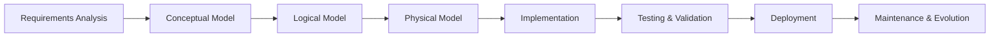
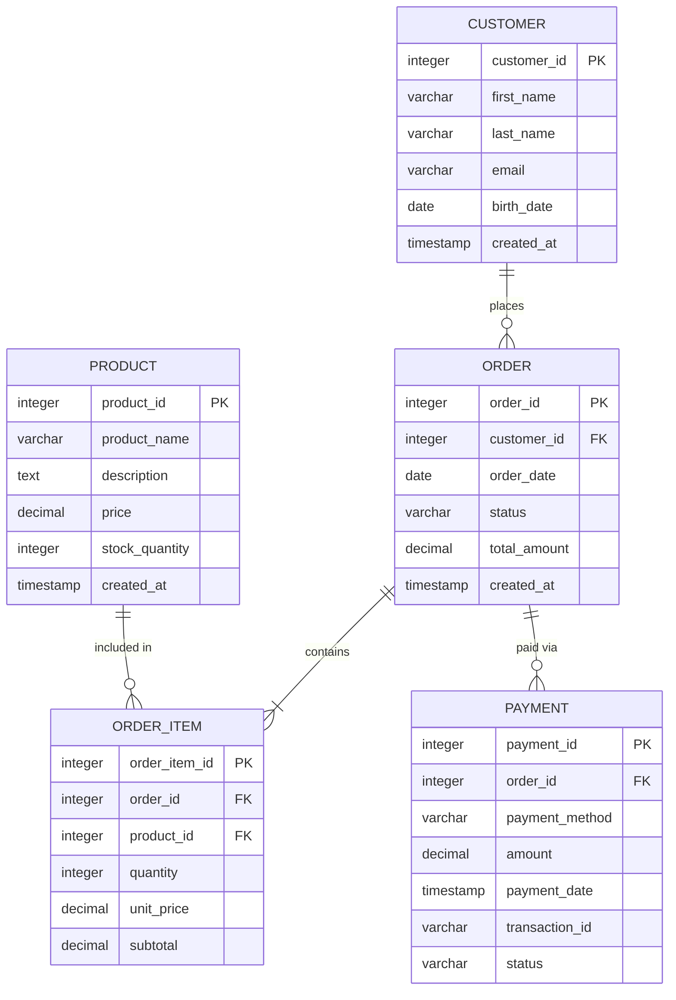
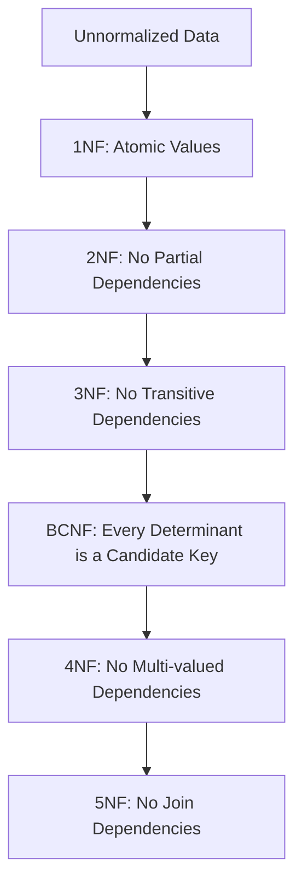
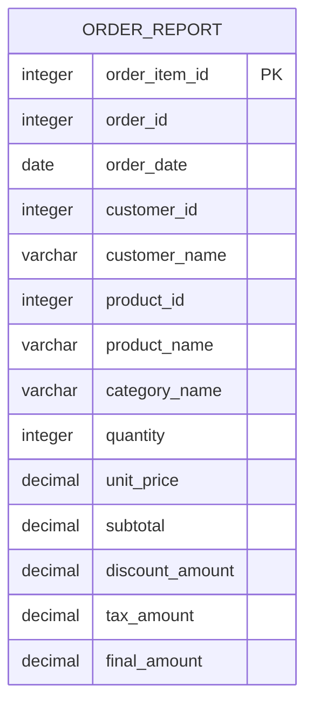

# Disclaimer
This repository contains information collected from various online sources and/or generated by AI assistants. The content provided here is for informational purposes only and is intended to serve as a general reference on various topics.

# PostgreSQL Data Modeling Best Practices

## Table of Contents

1. [Introduction](#introduction)
2. [Fundamental Principles of Data Modeling](#fundamental-principles-of-data-modeling)
   - [What is Data Modeling?](#what-is-data-modeling)
   - [Importance in PostgreSQL](#importance-in-postgresql)
   - [The Data Modeling Process](#the-data-modeling-process)
3. [Entity-Relationship Modeling and Schema Design](#entity-relationship-modeling-and-schema-design)
   - [ER Diagrams and Their Role](#er-diagrams-and-their-role)
   - [Entity Types and Attributes](#entity-types-and-attributes)
   - [Case Study: Modeling a Retail System](#case-study-modeling-a-retail-system)
4. [Naming Conventions](#naming-conventions)
   - [Schema Naming](#schema-naming)
   - [Table Naming](#table-naming)
   - [Column Naming](#column-naming)
   - [Index and Constraint Naming](#index-and-constraint-naming)
   - [Function and Procedure Naming](#function-and-procedure-naming)
5. [Table Design Best Practices](#table-design-best-practices)
   - [Defining Tables and Columns](#defining-tables-and-columns)
   - [Primary Keys](#primary-keys)
   - [Foreign Keys and Referential Integrity](#foreign-keys-and-referential-integrity)
   - [Check Constraints and Domain Constraints](#check-constraints-and-domain-constraints)
   - [Default Values and Generated Columns](#default-values-and-generated-columns)
6. [Choosing Appropriate Data Types](#choosing-appropriate-data-types)
   - [Numeric Types](#numeric-types)
   - [Character and String Types](#character-and-string-types)
   - [Temporal Data Types](#temporal-data-types)
   - [Boolean Type](#boolean-type)
   - [UUID Type](#uuid-type)
   - [JSON and JSONB Types](#json-and-jsonb-types)
   - [Array Types](#array-types)
   - [Geometric and Network Data Types](#geometric-and-network-data-types)
   - [Custom and Domain Types](#custom-and-domain-types)
7. [Normalization: Theory and Practice](#normalization-theory-and-practice)
   - [Understanding Normal Forms](#understanding-normal-forms)
   - [Benefits and Limitations](#benefits-and-limitations)
   - [Practical Examples of Normalization](#practical-examples-of-normalization)
8. [Denormalization: When and How to Use It](#denormalization-when-and-how-to-use-it)
   - [Trade-offs Between Normalization and Denormalization](#trade-offs-between-normalization-and-denormalization)
   - [Real-world Denormalization Strategies](#real-world-denormalization-strategies)
   - [Examples of Denormalized Schemas](#examples-of-denormalized-schemas)
9. [Inheritance and Partitioning](#inheritance-and-partitioning)
   - [Table Inheritance](#table-inheritance)
   - [Partitioning Strategies](#partitioning-strategies)
   - [When to Use Partitioning](#when-to-use-partitioning)
10. [Views and Materialized Views](#views-and-materialized-views)
    - [Designing Views](#designing-views)
    - [Materialized Views: When to Use Them](#materialized-views-when-to-use-them)
    - [Performance Considerations](#performance-considerations)
11. [Indexing Strategies](#indexing-strategies)
    - [B-tree Indexes](#b-tree-indexes)
    - [Hash Indexes](#hash-indexes)
    - [GIN and GiST Indexes](#gin-and-gist-indexes)
    - [BRIN Indexes](#brin-indexes)
    - [Composite Indexes](#composite-indexes)
    - [Partial and Expression-based Indexes](#partial-and-expression-based-indexes)
    - [Index Maintenance](#index-maintenance)
12. [Security Best Practices](#security-best-practices)
    - [Role-Based Access Control (RBAC)](#role-based-access-control-rbac)
    - [Row-Level Security](#row-level-security)
    - [Data Encryption](#data-encryption)
13. [Case Studies and Real-World Examples](#case-studies-and-real-world-examples)
    - [E-Commerce Database Design](#e-commerce-database-design)
    - [Financial Systems](#financial-systems)
    - [Content Management System](#content-management-system)
14. [Common Pitfalls and How to Avoid Them](#common-pitfalls-and-how-to-avoid-them)
15. [Conclusion](#conclusion)
16. [References and Further Reading](#references-and-further-reading)

## Introduction

Data modeling is the cornerstone of designing efficient, scalable, and maintainable databases. In PostgreSQL, renowned for its advanced features and compliance with SQL standards, a robust data model not only enables optimal performance but also contributes to overall system stability.

This comprehensive guide covers PostgreSQL data modeling best practices, from fundamental principles to advanced techniques. Whether you're designing a small application database or architecting a large enterprise system, these practices will help you create well-structured, performant, and maintainable PostgreSQL databases.

## Fundamental Principles of Data Modeling

### What is Data Modeling?

Data modeling is the process of creating a conceptual framework for how data is stored, accessed, and managed in a database. It involves defining:

- **Entities**: The real-world objects or concepts that will be represented (e.g., customers, products, orders)
- **Attributes**: Properties that describe each entity (e.g., name, price, date)
- **Relationships**: How entities interact with each other (e.g., customers place orders)
- **Constraints**: Rules that govern data integrity (e.g., a product must have a non-negative price)

### Importance in PostgreSQL

A well-designed PostgreSQL database:

- **Enhances Performance**: Optimizes query execution and resource utilization
- **Ensures Data Integrity**: Enforces business rules through constraints
- **Simplifies Maintenance**: Makes future modifications and expansions easier
- **Improves Scalability**: Provides a solid foundation as your application grows
- **Enables Better Security**: Facilitates proper access control implementation

### The Data Modeling Process

The data modeling process typically involves three phases:

1. **Conceptual Model**: High-level view focusing on entities and relationships without technical details
2. **Logical Model**: Detailed representation of entities, attributes, and relationships independent of any database system
3. **Physical Model**: Implementation-specific design tailored to PostgreSQL features

Example workflow:



## Entity-Relationship Modeling and Schema Design

### ER Diagrams and Their Role

Entity-Relationship (ER) diagrams visually represent the logical structure of a database, showing:

- Entities (tables)
- Attributes (columns)
- Relationships between entities
- Cardinality of relationships (one-to-one, one-to-many, many-to-many)

ER diagrams help stakeholders:
- Validate the data model against business requirements
- Identify potential issues before implementation
- Communicate the database design clearly

### Entity Types and Attributes

Entities in a data model fall into several categories:

1. **Independent/Strong Entities**: Exist independently (e.g., Customer)
2. **Dependent/Weak Entities**: Depend on another entity (e.g., OrderItem depends on Order)
3. **Associative Entities**: Resolve many-to-many relationships (e.g., StudentCourse linking Student and Course)
4. **Subtype Entities**: Specialized versions of a supertype (e.g., SavingsAccount as a type of Account)

Attributes can be:

1. **Simple**: Single value (e.g., first_name)
2. **Composite**: Multiple components (e.g., address with street, city, state)
3. **Single-valued**: One value per entity (e.g., birth_date)
4. **Multi-valued**: Multiple values (e.g., phone_numbers)
5. **Derived**: Calculated from other attributes (e.g., age derived from birth_date)

### Case Study: Modeling a Retail System

Let's model a simple retail system with customers, products, orders, and payments.



## Naming Conventions

Consistent naming conventions enhance readability, maintainability, and reduce errors.

### Schema Naming

- Use lowercase, singular nouns
- Use underscores for multi-word names
- Reflect functional area or module

Examples:
```sql
CREATE SCHEMA accounting;
CREATE SCHEMA human_resources;
CREATE SCHEMA inventory;
```

### Table Naming

- Use lowercase, singular nouns
- Use snake_case (underscores between words)
- Be descriptive but concise
- For junction tables (many-to-many relationships), combine both entity names

Examples:
```sql
CREATE TABLE customer;
CREATE TABLE product;
CREATE TABLE order;
CREATE TABLE order_item;  -- Not "items" (singular)
CREATE TABLE student_course;  -- Junction table
```

### Column Naming

- Use lowercase, snake_case
- Include table name in primary key: `table_name_id`
- Use consistent suffixes:
  - Boolean columns: prefix with `is_`, `has_`, or `can_`
  - Date/time: suffix with `_date`, `_time`, `_at`
  - FK columns: same name as the referenced PK

Examples:
```sql
-- Primary key examples
customer_id         -- In customer table
product_id          -- In product table
order_id            -- In order table

-- Foreign key examples
customer_id         -- In order table, referencing customer.customer_id
order_id            -- In order_item table, referencing order.order_id

-- Boolean examples
is_active           -- Not "active"
has_subscription    -- Not "subscription"
is_deleted          -- For soft delete

-- Date/time examples
created_at          -- Timestamp of creation
updated_at          -- Timestamp of last update
birth_date          -- Date only
start_time          -- Time only

-- Regular columns
first_name          -- Not "firstName" (no camelCase)
last_name
email_address       -- Not "email" (be specific)
product_description -- Not "desc" (no abbreviations)
```

### Index and Constraint Naming

Use consistent patterns to easily identify constraint types:

- Primary Key: `pk_table_name`
- Foreign Key: `fk_table_name_referenced_table_name`
- Unique Constraint: `uq_table_name_column_name`
- Check Constraint: `ck_table_name_column_name`
- Index: `idx_table_name_column_name`

Examples:
```sql
-- Primary key
CONSTRAINT pk_customer ON customer(customer_id)

-- Foreign key
CONSTRAINT fk_order_customer ON order(customer_id)
  REFERENCES customer(customer_id)

-- Unique constraint
CONSTRAINT uq_customer_email ON customer(email)

-- Check constraint
CONSTRAINT ck_product_price_positive ON product(price)
  CHECK (price > 0)

-- Index
CREATE INDEX idx_customer_last_name ON customer(last_name);
CREATE INDEX idx_order_created_at ON order(created_at);
```

### Function and Procedure Naming

- Use verb_noun format
- Use lowercase and snake_case
- Group related functions with common prefixes

Examples:
```sql
CREATE FUNCTION calculate_order_total(order_id INTEGER) RETURNS DECIMAL...
CREATE FUNCTION get_customer_orders(customer_id INTEGER) RETURNS TABLE...
CREATE FUNCTION validate_credit_card(card_number VARCHAR) RETURNS BOOLEAN...
```

## Table Design Best Practices

### Defining Tables and Columns

Well-designed tables should:

- Represent a single entity or concept
- Have clear, well-defined purposes
- Follow normalization principles (with strategic exceptions)
- Include proper documentation via comments

Example table definition with comments:

```sql
-- Represents a customer who makes purchases
CREATE TABLE customer (
    customer_id SERIAL PRIMARY KEY,
    first_name VARCHAR(50) NOT NULL,
    last_name VARCHAR(50) NOT NULL,
    email VARCHAR(100) UNIQUE NOT NULL,
    phone VARCHAR(20),
    birth_date DATE,
    is_active BOOLEAN DEFAULT TRUE,
    created_at TIMESTAMPTZ DEFAULT CURRENT_TIMESTAMP,
    updated_at TIMESTAMPTZ DEFAULT CURRENT_TIMESTAMP
);

COMMENT ON TABLE customer IS 'Stores information about customers who make purchases';
COMMENT ON COLUMN customer.customer_id IS 'Unique identifier for each customer';
COMMENT ON COLUMN customer.email IS 'Email address used for communication and account recovery';
COMMENT ON COLUMN customer.is_active IS 'Indicates if customer account is currently active';
```

Best practices for column definitions:

1. **Be specific with data types**
   - Use the most restrictive type possible
   - Set appropriate length limits

2. **Include nullability constraints**
   - Make columns NOT NULL by default
   - Only allow NULL when a value genuinely might not exist

3. **Set default values when appropriate**
   - Simplifies inserts and provides consistent data

4. **Add value constraints**
   - CHECK constraints for validation
   - UNIQUE constraints where needed

### Primary Keys

Primary keys uniquely identify each row in a table. Best practices include:

1. **Naming convention**: Use `table_name_id` format
2. **Type selection**:
   - SERIAL/BIGSERIAL for auto-incrementing integers
   - UUID for distributed systems or when hiding sequential IDs
   - Consider BIGINT for tables expected to grow beyond 2.1 billion rows

3. **Avoid composite keys** for most use cases (simplifies foreign key relationships)
4. **Never use mutable columns** (values that might change)
5. **Consider surrogate keys** over natural keys for stability

Examples:

```sql
-- Integer primary key (most common)
CREATE TABLE product (
    product_id SERIAL PRIMARY KEY,
    product_name VARCHAR(100) NOT NULL,
    /* other columns */
);

-- BIGINT primary key (for tables expected to grow very large)
CREATE TABLE log_entry (
    log_entry_id BIGSERIAL PRIMARY KEY,
    log_message TEXT NOT NULL,
    log_level VARCHAR(10) NOT NULL,
    created_at TIMESTAMPTZ DEFAULT CURRENT_TIMESTAMP
);

-- UUID primary key (for distributed systems)
CREATE TABLE document (
    document_id UUID PRIMARY KEY DEFAULT gen_random_uuid(),
    document_name VARCHAR(200) NOT NULL,
    content TEXT NOT NULL,
    created_at TIMESTAMPTZ DEFAULT CURRENT_TIMESTAMP
);
```

### Foreign Keys and Referential Integrity

Foreign keys establish relationships between tables and enforce referential integrity:

1. **Naming convention**: Use the same name as the referenced primary key
2. **Always define constraints**: Don't rely on application code for integrity
3. **Consider ON DELETE and ON UPDATE actions**:
   - CASCADE: Propagate changes/deletions
   - RESTRICT: Prevent changes that would break references
   - SET NULL: Allow changes but set references to NULL
   - SET DEFAULT: Reset to default value

4. **Index foreign key columns**: Improves JOIN performance

Examples:

```sql
-- Basic foreign key
CREATE TABLE order (
    order_id SERIAL PRIMARY KEY,
    customer_id INTEGER NOT NULL,
    order_date DATE NOT NULL DEFAULT CURRENT_DATE,
    /* other columns */
    
    CONSTRAINT fk_order_customer FOREIGN KEY (customer_id)
        REFERENCES customer (customer_id)
);

-- Foreign key with CASCADE delete
CREATE TABLE order_item (
    order_item_id SERIAL PRIMARY KEY,
    order_id INTEGER NOT NULL,
    product_id INTEGER NOT NULL,
    quantity INTEGER NOT NULL CHECK (quantity > 0),
    unit_price NUMERIC(10, 2) NOT NULL,
    
    CONSTRAINT fk_order_item_order FOREIGN KEY (order_id)
        REFERENCES order (order_id) ON DELETE CASCADE,
    CONSTRAINT fk_order_item_product FOREIGN KEY (product_id)
        REFERENCES product (product_id)
);

-- Foreign key with SET NULL
CREATE TABLE document (
    document_id SERIAL PRIMARY KEY,
    title VARCHAR(200) NOT NULL,
    content TEXT NOT NULL,
    author_id INTEGER,
    
    CONSTRAINT fk_document_author FOREIGN KEY (author_id)
        REFERENCES author (author_id) ON DELETE SET NULL
);

-- Creating index on foreign key
CREATE INDEX idx_order_customer_id ON order(customer_id);
```

### Check Constraints and Domain Constraints

Check constraints enforce business rules at the database level:

1. **Validate data ranges**
2. **Ensure logical consistency**
3. **Prevent invalid combinations**
4. **Create reusable domain types**

Examples:

```sql
-- Simple check constraints
CREATE TABLE product (
    product_id SERIAL PRIMARY KEY,
    product_name VARCHAR(100) NOT NULL,
    price NUMERIC(10, 2) NOT NULL CONSTRAINT ck_product_price_positive CHECK (price > 0),
    weight NUMERIC(8, 2) CONSTRAINT ck_product_weight_positive CHECK (weight > 0),
    stock_quantity INTEGER NOT NULL CONSTRAINT ck_product_stock_non_negative CHECK (stock_quantity >= 0)
);

-- Complex check constraint
CREATE TABLE rental (
    rental_id SERIAL PRIMARY KEY,
    start_date DATE NOT NULL,
    end_date DATE NOT NULL,
    
    CONSTRAINT ck_rental_end_after_start CHECK (end_date >= start_date)
);

-- Domain constraint (reusable)
CREATE DOMAIN email_address AS VARCHAR(255)
    CHECK (VALUE ~ '^[a-zA-Z0-9._%+-]+@[a-zA-Z0-9.-]+\.[a-zA-Z]{2,}$');

CREATE TABLE customer (
    customer_id SERIAL PRIMARY KEY,
    first_name VARCHAR(50) NOT NULL,
    last_name VARCHAR(50) NOT NULL,
    email email_address NOT NULL UNIQUE
);
```

### Default Values and Generated Columns

Use default values and generated columns to:

1. **Simplify inserts**
2. **Ensure consistency**
3. **Automatically compute derived data**
4. **Track metadata**

Examples:

```sql
-- Default values
CREATE TABLE task (
    task_id SERIAL PRIMARY KEY,
    title VARCHAR(200) NOT NULL,
    description TEXT,
    is_completed BOOLEAN DEFAULT FALSE,
    priority INTEGER DEFAULT 1,
    created_at TIMESTAMPTZ DEFAULT CURRENT_TIMESTAMP,
    due_date DATE DEFAULT (CURRENT_DATE + INTERVAL '7 days')
);

-- Generated columns (PostgreSQL 12+)
CREATE TABLE rectangle (
    rectangle_id SERIAL PRIMARY KEY,
    width NUMERIC(5,2) NOT NULL CHECK (width > 0),
    height NUMERIC(5,2) NOT NULL CHECK (height > 0),
    area NUMERIC(10,4) GENERATED ALWAYS AS (width * height) STORED
);

CREATE TABLE order_item (
    order_item_id SERIAL PRIMARY KEY,
    order_id INTEGER NOT NULL REFERENCES order(order_id),
    product_id INTEGER NOT NULL REFERENCES product(product_id),
    quantity INTEGER NOT NULL CHECK (quantity > 0),
    unit_price NUMERIC(10,2) NOT NULL CHECK (unit_price > 0),
    subtotal NUMERIC(12,2) GENERATED ALWAYS AS (quantity * unit_price) STORED
);
```

## Choosing Appropriate Data Types

Selecting the right data types impacts storage efficiency, query performance, and data integrity.

### Numeric Types

PostgreSQL offers various numeric types for different precision and range requirements:

| Type | Storage Size | Range | Use Case |
|------|--------------|-------|----------|
| SMALLINT | 2 bytes | -32,768 to 32,767 | Small integer values |
| INTEGER | 4 bytes | -2.1B to 2.1B | General-purpose integers |
| BIGINT | 8 bytes | -9.2E18 to 9.2E18 | Large integers or IDs |
| NUMERIC(p,s) | Variable | Up to 131,072 digits | Exact decimal values |
| REAL | 4 bytes | 6 decimal digits | Inexact, single precision |
| DOUBLE PRECISION | 8 bytes | 15 decimal digits | Inexact, double precision |

Examples:

```sql
-- Choosing appropriate numeric types
CREATE TABLE product (
    product_id SERIAL PRIMARY KEY,
    name VARCHAR(100) NOT NULL,
    -- Price needs exact decimal representation
    price NUMERIC(10, 2) NOT NULL,
    -- Stock quantity won't exceed 2.1B
    stock_quantity INTEGER NOT NULL,
    -- Small categorical values
    category_id SMALLINT NOT NULL,
    -- Weight doesn't need exact precision
    weight_kg REAL,
    -- Large values for metrics
    lifetime_views BIGINT DEFAULT 0
);

-- Financial data requiring exact precision
CREATE TABLE transaction (
    transaction_id SERIAL PRIMARY KEY,
    account_id INTEGER NOT NULL,
    amount NUMERIC(12, 2) NOT NULL,
    balance NUMERIC(15, 2) NOT NULL,
    transaction_date TIMESTAMPTZ DEFAULT CURRENT_TIMESTAMP
);
```

Best practices:

1. Use INTEGER for most counting purposes
2. Use NUMERIC for financial and other exact decimal values
3. Use REAL/DOUBLE only when exact precision isn't required
4. Use SMALLINT for limited-range values (e.g., ratings 1-5)
5. Use BIGINT for IDs in tables expected to grow very large

### Character and String Types

PostgreSQL provides several string data types for different use cases:

| Type | Description | Use Case |
|------|-------------|----------|
| VARCHAR(n) | Variable-length with limit | Names, emails, etc. |
| TEXT | Unlimited-length text | Long descriptions, content |
| CHAR(n) | Fixed-length, space-padded | Fixed-format codes |

Examples:

```sql
CREATE TABLE customer (
    customer_id SERIAL PRIMARY KEY,
    -- Fixed length, like postal codes
    postal_code CHAR(5),
    -- Variable length with reasonable limits
    first_name VARCHAR(50) NOT NULL,
    last_name VARCHAR(50) NOT NULL,
    email VARCHAR(100) NOT NULL,
    -- Unlimited length text
    notes TEXT,
    -- Fixed length for codes
    status CHAR(1) NOT NULL DEFAULT 'A'
);

CREATE TABLE article (
    article_id SERIAL PRIMARY KEY,
    title VARCHAR(200) NOT NULL,
    subtitle VARCHAR(500),
    -- Long content, unlimited
    content TEXT NOT NULL,
    author_id INTEGER NOT NULL REFERENCES author(author_id)
);
```

Best practices:

1. Use VARCHAR with appropriate length limits for most string data
2. Use TEXT for unlimited-length fields (descriptions, content)
3. Use CHAR only for truly fixed-length data
4. Consider COLLATION settings for international text

### Temporal Data Types

PostgreSQL offers specialized types for date and time data:

| Type | Storage Size | Range | Use Case |
|------|--------------|-------|----------|
| DATE | 4 bytes | 4713 BC to 5874897 AD | Calendar dates |
| TIME | 8 bytes | 00:00:00 to 24:00:00 | Time of day |
| TIMESTAMP | 8 bytes | 4713 BC to 294276 AD | Date and time |
| TIMESTAMPTZ | 8 bytes | Same as TIMESTAMP | Date and time with timezone |
| INTERVAL | 16 bytes | ±178,000,000 years | Time periods |

Examples:

```sql
CREATE TABLE appointment (
    appointment_id SERIAL PRIMARY KEY,
    -- Calendar date only
    appointment_date DATE NOT NULL,
    -- Time without date
    start_time TIME NOT NULL,
    end_time TIME NOT NULL,
    -- Full date and time with timezone
    created_at TIMESTAMPTZ DEFAULT CURRENT_TIMESTAMP,
    -- Duration
    duration INTERVAL,
    patient_id INTEGER NOT NULL REFERENCES patient(patient_id)
);

CREATE TABLE employee (
    employee_id SERIAL PRIMARY KEY,
    first_name VARCHAR(50) NOT NULL,
    last_name VARCHAR(50) NOT NULL,
    -- Calendar date only
    birth_date DATE NOT NULL,
    hire_date DATE NOT NULL,
    -- Full timestamp with timezone for audit
    created_at TIMESTAMPTZ DEFAULT CURRENT_TIMESTAMP,
    updated_at TIMESTAMPTZ DEFAULT CURRENT_TIMESTAMP
);
```

Best practices:

1. Always use TIMESTAMPTZ (not TIMESTAMP) for most date-time data
2. Use DATE when you only need calendar dates
3. Use TIME when you only need time of day
4. Always store dates and times in UTC, converting to local time zones in the application
5. Use INTERVAL for durations and time periods

### Boolean Type

The BOOLEAN type stores true/false values:

```sql
CREATE TABLE subscription (
    subscription_id SERIAL PRIMARY KEY,
    customer_id INTEGER NOT NULL REFERENCES customer(customer_id),
    is_active BOOLEAN NOT NULL DEFAULT TRUE,
    is_auto_renew BOOLEAN NOT NULL DEFAULT TRUE,
    has_trial_used BOOLEAN NOT NULL DEFAULT FALSE
);

CREATE TABLE product (
    product_id SERIAL PRIMARY KEY,
    name VARCHAR(100) NOT NULL,
    price NUMERIC(10, 2) NOT NULL,
    is_featured BOOLEAN NOT NULL DEFAULT FALSE,
    is_available BOOLEAN NOT NULL DEFAULT TRUE,
    is_taxable BOOLEAN NOT NULL DEFAULT TRUE
);
```

Best practices:

1. Use BOOLEAN instead of INTEGER/CHAR codes for true/false data
2. Name columns with `is_`, `has_`, or `can_` prefixes
3. Set DEFAULT values for boolean columns
4. Use NOT NULL constraint on boolean columns

### UUID Type

The UUID (Universally Unique Identifier) type stores 128-bit identifiers:

```sql
CREATE EXTENSION IF NOT EXISTS "uuid-ossp";

CREATE TABLE document (
    document_id UUID PRIMARY KEY DEFAULT uuid_generate_v4(),
    title VARCHAR(200) NOT NULL,
    content TEXT NOT NULL,
    created_at TIMESTAMPTZ DEFAULT CURRENT_TIMESTAMP
);

CREATE TABLE api_key (
    api_key_id UUID PRIMARY KEY DEFAULT gen_random_uuid(),
    customer_id INTEGER NOT NULL REFERENCES customer(customer_id),
    description VARCHAR(200),
    secret VARCHAR(100) NOT NULL,
    expires_at TIMESTAMPTZ NOT NULL,
    is_active BOOLEAN NOT NULL DEFAULT TRUE
);
```

Best practices:

1. Use UUIDs when you need:
   - Non-sequential, non-predictable IDs
   - IDs generated outside the database
   - Distributed systems without central ID coordination
2. Be aware of increased storage requirements
3. Consider performance implications for indexes
4. Use gen_random_uuid() (PostgreSQL 13+) or uuid-ossp extension

### JSON and JSONB Types

PostgreSQL supports storing JSON data with two types:

| Type | Description | Use Case |
|------|-------------|----------|
| JSON | Text storage, slower retrieval | When data is rarely queried |
| JSONB | Binary storage, indexed, faster retrieval | For queried/updated JSON data |

Examples:

```sql
CREATE TABLE user_profile (
    user_id INTEGER PRIMARY KEY REFERENCES user_account(user_id),
    -- Structured data in normalized columns
    display_name VARCHAR(100) NOT NULL,
    bio TEXT,
    -- Semi-structured or variable data in JSONB
    preferences JSONB NOT NULL DEFAULT '{}',
    metadata JSONB NOT NULL DEFAULT '{}'
);

CREATE TABLE event_log (
    event_id SERIAL PRIMARY KEY,
    event_type VARCHAR(50) NOT NULL,
    created_at TIMESTAMPTZ DEFAULT CURRENT_TIMESTAMP,
    -- Variable payload data
    event_data JSONB NOT NULL,
    
    -- Index for querying nested JSON properties
    CONSTRAINT valid_event_data CHECK (jsonb_typeof(event_data) = 'object')
);

-- Creating indexes on JSONB fields
CREATE INDEX idx_user_profile_preferences ON user_profile USING GIN (preferences);
CREATE INDEX idx_event_log_type ON event_log ((event_data->>'type'));
```

Best practices:

1. Use JSONB over JSON in most cases
2. Create GIN indexes for frequently queried fields
3. Use JSON/JSONB for:
   - Semi-structured data
   - Schema-less data
   - Data with variable attributes
4. Don't use JSON/JSONB when standard normalized tables would work better
5. Set default values ('{}' or '[]') and NOT NULL constraints

### Array Types

PostgreSQL allows columns to store arrays of values:

```sql
CREATE TABLE product (
    product_id SERIAL PRIMARY KEY,
    name VARCHAR(100) NOT NULL,
    price NUMERIC(10, 2) NOT NULL,
    -- Array of tags
    tags VARCHAR[] DEFAULT '{}',
    -- Array of category IDs
    category_ids INTEGER[] DEFAULT '{}'
);

CREATE TABLE survey_response (
    response_id SERIAL PRIMARY KEY,
    survey_id INTEGER NOT NULL REFERENCES survey(survey_id),
    respondent_id INTEGER NOT NULL REFERENCES user_account(user_id),
    -- Array of integer ratings (1-5)
    ratings INTEGER[] NOT NULL,
    -- Array of text answers
    text_responses TEXT[] DEFAULT '{}'
);
```

Best practices:

1. Use arrays when you need to store multiple values of the same type
2. Create GIN indexes for searchable arrays
3. Be cautious with very large arrays (consider normalization instead)
4. Set default values (typically empty array) and NOT NULL constraints
5. Use array functions for manipulation (array_append, unnest, etc.)

### Geometric and Network Data Types

PostgreSQL includes specialized types for geometric and network data:

| Type | Description | Use Case |
|------|-------------|----------|
| POINT | 2D point (x,y) | Geographic locations |
| LINE | Infinite line | Linear equations |
| POLYGON | Closed geometric shape | Geographic regions |
| INET | IPv4/IPv6 address | Network addresses |
| CIDR | Network specification | Network CIDR blocks |
| MACADDR | MAC address | Network hardware |

Examples:

```sql
CREATE TABLE location (
    location_id SERIAL PRIMARY KEY,
    name VARCHAR(100) NOT NULL,
    -- Geographic coordinates
    coordinates POINT NOT NULL,
    -- Service area
    service_area POLYGON
);

CREATE TABLE network_device (
    device_id SERIAL PRIMARY KEY,
    hostname VARCHAR(100) NOT NULL,
    -- IP address
    ip_address INET NOT NULL,
    -- Network subnet
    subnet CIDR NOT NULL,
    -- MAC address
    mac_address MACADDR NOT NULL UNIQUE
);
```

Best practices:

1. Use geometric types for spatial data (consider PostGIS for advanced GIS needs)
2. Use network types for network-related data:
   - INET for IP addresses (supports both IPv4 and IPv6)
   - CIDR for network specifications
   - MACADDR for MAC addresses
3. Create appropriate indexes for search operations

### Custom and Domain Types

PostgreSQL allows creating custom types to encapsulate business logic:

```sql
-- Create an enumeration type
CREATE TYPE subscription_status AS ENUM ('active', 'expired', 'canceled', 'pending');

-- Use the enum type
CREATE TABLE subscription (
    subscription_id SERIAL PRIMARY KEY,
    customer_id INTEGER NOT NULL REFERENCES customer(customer_id),
    status subscription_status NOT NULL DEFAULT 'pending',
    start_date DATE NOT NULL,
    end_date DATE NOT NULL,
    created_at TIMESTAMPTZ DEFAULT CURRENT_TIMESTAMP
);

-- Create a domain type with validation
CREATE DOMAIN us_postal_code AS CHAR(5)
    CHECK (VALUE ~ '^\d{5});

CREATE DOMAIN us_phone AS VARCHAR(12)
    CHECK (VALUE ~ '^\d{3}-\d{3}-\d{4});

CREATE TABLE us_customer (
    customer_id SERIAL PRIMARY KEY,
    first_name VARCHAR(50) NOT NULL,
    last_name VARCHAR(50) NOT NULL,
    -- Using domain types with validation
    postal_code us_postal_code NOT NULL,
    phone us_phone NOT NULL
);
```

Best practices:

1. Use ENUM types for fields with a fixed set of values
2. Use DOMAINs to enforce validation rules and improve reusability
3. Create composite types for data that's always used together
4. Document custom types thoroughly

## Normalization: Theory and Practice

Normalization is the process of organizing data to reduce redundancy and improve data integrity.

### Understanding Normal Forms

The most common normal forms are:

1. **First Normal Form (1NF)**
   - Each column contains atomic (indivisible) values
   - Each row is unique (has a unique identifier)
   - No repeating groups or arrays

2. **Second Normal Form (2NF)**
   - Table is in 1NF
   - All non-key attributes depend on the entire primary key
   - Eliminates partial dependencies

3. **Third Normal Form (3NF)**
   - Table is in 2NF
   - All attributes depend directly on the primary key, not on other attributes
   - Eliminates transitive dependencies

4. **Boyce-Codd Normal Form (BCNF)**
   - A stricter version of 3NF
   - Every determinant (column that determines other columns) must be a candidate key

5. **Fourth Normal Form (4NF)** and **Fifth Normal Form (5NF)**
   - Deal with multi-valued dependencies and join dependencies
   - Rarely needed in most applications



### Benefits and Limitations

**Benefits of Normalization:**
- Eliminates data redundancy
- Reduces storage space
- Improves data integrity and consistency
- Makes the database more flexible for future changes
- Simplifies data maintenance

**Limitations of Normalization:**
- Increases complexity of queries (more joins)
- Can reduce read performance
- May make reporting more difficult

### Practical Examples of Normalization

**Unnormalized Data Example:**

Consider this unnormalized table:

| OrderID | CustomerName | CustomerEmail | ProductName | ProductPrice | Quantity | OrderDate |
|---------|--------------|---------------|-------------|--------------|----------|-----------|
| 1001    | John Smith   | john@example.com | Laptop     | 1200.00      | 1        | 2023-06-15 |
| 1001    | John Smith   | john@example.com | Mouse      | 25.00        | 2        | 2023-06-15 |
| 1002    | Jane Doe     | jane@example.com | Monitor    | 300.00       | 1        | 2023-06-16 |

**First Normal Form (1NF):**

After applying 1NF, we've ensured all values are atomic:

| OrderID | CustomerName | CustomerEmail | ProductName | ProductPrice | Quantity | OrderDate |
|---------|--------------|---------------|-------------|--------------|----------|-----------|
| 1001    | John Smith   | john@example.com | Laptop     | 1200.00      | 1        | 2023-06-15 |
| 1001    | John Smith   | john@example.com | Mouse      | 25.00        | 2        | 2023-06-15 |
| 1002    | Jane Doe     | jane@example.com | Monitor    | 300.00       | 1        | 2023-06-16 |

**Second Normal Form (2NF):**

Moving to 2NF by removing partial dependencies:

Table: `customer`

| customer_id | customer_name | customer_email     |
|-------------|---------------|-------------------|
| 101         | John Smith    | john@example.com  |
| 102         | Jane Doe      | jane@example.com  |

Table: `order`

| order_id | customer_id | order_date  |
|----------|-------------|-------------|
| 1001     | 101         | 2023-06-15  |
| 1002     | 102         | 2023-06-16  |

Table: `product`

| product_id | product_name | product_price |
|------------|--------------|---------------|
| 201        | Laptop       | 1200.00       |
| 202        | Mouse        | 25.00         |
| 203        | Monitor      | 300.00        |

Table: `order_item`

| order_item_id | order_id | product_id | quantity |
|---------------|----------|------------|----------|
| 301           | 1001     | 201        | 1        |
| 302           | 1001     | 202        | 2        |
| 303           | 1002     | 203        | 1        |

**Third Normal Form (3NF):**

3NF is achieved when we ensure no non-key column depends on another non-key column. In this example, we've already reached 3NF with our 2NF structure since there are no transitive dependencies.

## Denormalization: When and How to Use It

Denormalization introduces controlled redundancy to improve query performance.

### Trade-offs Between Normalization and Denormalization

| Aspect | Normalization | Denormalization |
|--------|--------------|-----------------|
| Data Redundancy | Minimized | Increased |
| Storage Space | Optimized | Increased |
| Data Integrity | Enhanced | Must be carefully managed |
| Read Performance | May be slower (joins) | Typically faster |
| Write Performance | Typically faster | Slower (multiple updates) |
| Query Complexity | More complex (joins) | Simpler |
| Maintenance | Easier | More challenging |

### Real-world Denormalization Strategies

1. **Precomputed Aggregates**
   - Store calculated values like totals, counts, averages
   - Update via triggers or scheduled processes

2. **Materialized Views**
   - Store the results of complex queries
   - Refresh on schedule or when data changes

3. **Redundant Columns**
   - Duplicate key information across related tables
   - Helps avoid joins for common queries

4. **Flattened Data**
   - Combine data from multiple related tables
   - Useful for reporting and analytics

5. **Summary Tables**
   - Store summarized or aggregated data
   - Often used for time-series analysis

### Examples of Denormalized Schemas

**Example 1: Adding redundant columns to avoid joins**

```sql
-- Normalized (3NF)
CREATE TABLE order (
    order_id SERIAL PRIMARY KEY,
    customer_id INTEGER NOT NULL REFERENCES customer(customer_id),
    order_date DATE NOT NULL DEFAULT CURRENT_DATE,
    total_amount NUMERIC(10, 2) NOT NULL
);

-- Denormalized (with redundant customer information)
CREATE TABLE order_denormalized (
    order_id SERIAL PRIMARY KEY,
    customer_id INTEGER NOT NULL REFERENCES customer(customer_id),
    -- Redundant customer information to avoid joins
    customer_name VARCHAR(100) NOT NULL,
    customer_email VARCHAR(100) NOT NULL,
    order_date DATE NOT NULL DEFAULT CURRENT_DATE,
    total_amount NUMERIC(10, 2) NOT NULL
);
```

**Example 2: Creating a reporting-oriented denormalized table**

```sql
-- Normalized tables (already shown above)

-- Denormalized table for reporting
CREATE TABLE order_report (
    order_item_id SERIAL PRIMARY KEY,
    order_id INTEGER NOT NULL,
    order_date DATE NOT NULL,
    customer_id INTEGER NOT NULL,
    customer_name VARCHAR(100) NOT NULL,
    product_id INTEGER NOT NULL,
    product_name VARCHAR(100) NOT NULL,
    category_name VARCHAR(50) NOT NULL,
    quantity INTEGER NOT NULL,
    unit_price NUMERIC(10, 2) NOT NULL,
    subtotal NUMERIC(10, 2) NOT NULL,
    -- Additional calculated/aggregated fields
    discount_amount NUMERIC(10, 2) NOT NULL DEFAULT 0,
    tax_amount NUMERIC(10, 2) NOT NULL DEFAULT 0,
    final_amount NUMERIC(10, 2) NOT NULL
);
```



## Inheritance and Partitioning

### Table Inheritance

PostgreSQL supports table inheritance, allowing tables to inherit columns from a parent table:

```sql
-- Parent table
CREATE TABLE vehicle (
    vehicle_id SERIAL PRIMARY KEY,
    manufacturer VARCHAR(100) NOT NULL,
    model VARCHAR(100) NOT NULL,
    year INTEGER NOT NULL,
    price NUMERIC(10, 2) NOT NULL
);

-- Child tables inherit from parent
CREATE TABLE car (
    doors INTEGER NOT NULL,
    trunk_capacity NUMERIC(5, 2) NOT NULL,
    fuel_type VARCHAR(20) NOT NULL
) INHERITS (vehicle);

CREATE TABLE motorcycle (
    engine_displacement INTEGER NOT NULL,
    has_sidecar BOOLEAN NOT NULL DEFAULT FALSE
) INHERITS (vehicle);

-- Querying can include child table data
SELECT * FROM vehicle;  -- Gets all vehicles (including cars and motorcycles)
```

Benefits of inheritance:
- Organizes related tables
- Enables polymorphic queries
- Shares common column definitions

Limitations:
- Constraints and indexes aren't inherited
- Foreign keys aren't fully supported across inheritance
- Being replaced by partitioning in modern PostgreSQL

### Partitioning Strategies

Partitioning divides large tables into smaller physical pieces while maintaining a single logical table view:

1. **Range Partitioning**
   - Partitions based on value ranges (e.g., dates, IDs)
   - Good for time-series data

2. **List Partitioning**
   - Partitions based on discrete values (e.g., regions, categories)
   - Good for categorical data

3. **Hash Partitioning**
   - Distributes data evenly based on hash of partition key
   - Good for data without natural partitioning boundaries

Examples:

```sql
-- Range Partitioning (by date)
CREATE TABLE sales (
    sale_id SERIAL,
    sale_date DATE NOT NULL,
    customer_id INTEGER NOT NULL,
    product_id INTEGER NOT NULL,
    quantity INTEGER NOT NULL,
    amount NUMERIC(10, 2) NOT NULL,
    PRIMARY KEY (sale_id, sale_date)
) PARTITION BY RANGE (sale_date);

-- Create yearly partitions
CREATE TABLE sales_2022 PARTITION OF sales
    FOR VALUES FROM ('2022-01-01') TO ('2023-01-01');

CREATE TABLE sales_2023 PARTITION OF sales
    FOR VALUES FROM ('2023-01-01') TO ('2024-01-01');

CREATE TABLE sales_2024 PARTITION OF sales
    FOR VALUES FROM ('2024-01-01') TO ('2025-01-01');

-- List Partitioning (by region)
CREATE TABLE customer_data (
    customer_id INTEGER NOT NULL,
    region VARCHAR(20) NOT NULL,
    name VARCHAR(100) NOT NULL,
    email VARCHAR(100),
    data JSONB NOT NULL,
    PRIMARY KEY (customer_id, region)
) PARTITION BY LIST (region);

CREATE TABLE customer_data_na PARTITION OF customer_data
    FOR VALUES IN ('us', 'ca', 'mx');

CREATE TABLE customer_data_eu PARTITION OF customer_data
    FOR VALUES IN ('uk', 'fr', 'de', 'it', 'es');

CREATE TABLE customer_data_asia PARTITION OF customer_data
    FOR VALUES IN ('cn', 'jp', 'kr', 'in');

-- Hash Partitioning (by customer_id)
CREATE TABLE orders (
    order_id SERIAL,
    customer_id INTEGER NOT NULL,
    order_date DATE NOT NULL,
    total_amount NUMERIC(10, 2) NOT NULL,
    PRIMARY KEY (order_id, customer_id)
) PARTITION BY HASH (customer_id);

-- Create 4 partitions
CREATE TABLE orders_p0 PARTITION OF orders
    FOR VALUES WITH (MODULUS 4, REMAINDER 0);

CREATE TABLE orders_p1 PARTITION OF orders
    FOR VALUES WITH (MODULUS 4, REMAINDER 1);

CREATE TABLE orders_p2 PARTITION OF orders
    FOR VALUES WITH (MODULUS 4, REMAINDER 2);

CREATE TABLE orders_p3 PARTITION OF orders
    FOR VALUES WITH (MODULUS 4, REMAINDER 3);
```

### When to Use Partitioning

Partitioning is beneficial for:

1. **Very large tables** (millions of rows)
2. **Time-series data** with frequent pruning of old data
3. **Tables with distinct data segments** with separate access patterns
4. **High-throughput OLTP systems** requiring performance optimization

Benefits of partitioning:
- Improved query performance through partition pruning
- Faster maintenance operations (vacuum, reindex on smaller tables)
- Efficient archiving of older data
- Better parallelism for queries

## Views and Materialized Views

### Designing Views

Views are virtual tables defined by a query. They have multiple purposes:

1. **Simplify complex queries**
2. **Abstract underlying table structure**
3. **Implement security (row/column level access)**
4. **Present denormalized data views**

```sql
-- Simple view joining multiple tables
CREATE VIEW customer_order_summary AS
SELECT 
    c.customer_id,
    c.first_name,
    c.last_name,
    c.email,
    COUNT(o.order_id) AS total_orders,
    SUM(o.total_amount) AS total_spent
FROM 
    customer c
LEFT JOIN 
    order o ON c.customer_id = o.customer_id
GROUP BY 
    c.customer_id, c.first_name, c.last_name, c.email;

-- View with security considerations (row-level)
CREATE VIEW my_orders AS
SELECT 
    o.order_id,
    o.order_date,
    o.total_amount,
    oi.product_id,
    p.product_name,
    oi.quantity,
    oi.unit_price
FROM 
    order o
JOIN 
    order_item oi ON o.order_id = oi.order_id
JOIN 
    product p ON oi.product_id = p.product_id
WHERE 
    o.customer_id = (SELECT customer_id FROM current_user_info);
```

Best practices for views:

1. Use views to encapsulate complex business logic
2. Create views for commonly used queries
3. Document views thoroughly with comments
4. Consider performance implications for complex views
5. Use security definer views when necessary

### Materialized Views: When to Use Them

Materialized views store the results of the query physically:

```sql
-- Materialized view for analytics
CREATE MATERIALIZED VIEW monthly_sales_summary AS
SELECT 
    DATE_TRUNC('month', o.order_date) AS month,
    p.category_id,
    c.category_name,
    SUM(oi.quantity) AS units_sold,
    SUM(oi.unit_price * oi.quantity) AS total_revenue
FROM 
    order o
JOIN 
    order_item oi ON o.order_id = oi.order_id
JOIN 
    product p ON oi.product_id = p.product_id
JOIN 
    category c ON p.category_id = c.category_id
WHERE 
    o.status = 'completed'
GROUP BY 
    DATE_TRUNC('month', o.order_date),
    p.category_id,
    c.category_name
ORDER BY 
    month DESC, total_revenue DESC;

-- Create an index on the materialized view
CREATE UNIQUE INDEX idx_monthly_sales_month_category 
    ON monthly_sales_summary(month, category_id);

-- Refresh the materialized view
REFRESH MATERIALIZED VIEW monthly_sales_summary;

-- Refresh without blocking concurrent reads (requires unique index)
REFRESH MATERIALIZED VIEW CONCURRENTLY monthly_sales_summary;
```

When to use materialized views:

1. For expensive queries used frequently
2. When data changes infrequently relative to reads
3. For complex analytical queries and reports
4. When query performance is critical

### Performance Considerations

For both regular and materialized views:

1. **View Performance**
   - Views don't improve performance by themselves
   - Complex views with many joins can perform poorly
   - Consider indexing underlying tables appropriately

2. **Materialized View Performance**
   - Very efficient for read operations
   - Consider refresh timing and frequency
   - Create appropriate indexes on materialized views
   - Use CONCURRENTLY option for refreshes when possible
   - Monitor size and refresh time

## Indexing Strategies

Proper indexing is crucial for PostgreSQL performance.

### B-tree Indexes

B-tree is the default index type in PostgreSQL:

```sql
-- Basic B-tree index
CREATE INDEX idx_customer_last_name 
    ON customer(last_name);

-- Multicolumn B-tree index
CREATE INDEX idx_order_customer_date 
    ON order(customer_id, order_date DESC);

-- Unique index
CREATE UNIQUE INDEX idx_product_sku 
    ON product(sku);
```

Best practices:

1. Index columns used in WHERE, JOIN, and ORDER BY clauses
2. Put the most selective columns first in multicolumn indexes
3. Consider index-only scans by including needed columns
4. Don't over-index (indexes slow down writes)

### Hash Indexes

Hash indexes are optimized for equality comparisons:

```sql
-- Hash index for exact matches
CREATE INDEX idx_user_session_token 
    ON user_session USING HASH (token);
```

Best practices:

1. Use only for equality (=) operations
2. Consider when space efficiency is important
3. Not useful for range queries or sorting

### GIN and GiST Indexes

These are specialized indexes for complex data types:

```sql
-- GIN index for full-text search
CREATE INDEX idx_product_description_search 
    ON product USING GIN (to_tsvector('english', description));

-- GIN index for JSONB
CREATE INDEX idx_user_profile_preferences 
    ON user_profile USING GIN (preferences);

-- GIN index for array
CREATE INDEX idx_product_tags 
    ON product USING GIN (tags);

-- GiST index for geospatial data
CREATE INDEX idx_location_coordinates 
    ON location USING GIST (coordinates);
```

Best practices:

1. Use GIN for full-text search, JSONB, and arrays
2. Use GiST for geometric and complex custom types
3. Be aware these indexes can be larger than B-tree

### BRIN Indexes

Block Range INdexes are designed for very large tables with naturally ordered data:

```sql
-- BRIN index for time-series data
CREATE INDEX idx_sensor_reading_timestamp 
    ON sensor_reading USING BRIN (timestamp);

-- BRIN index with larger block range
CREATE INDEX idx_log_entry_created_at 
    ON log_entry USING BRIN (created_at) WITH (pages_per_range = 128);
```

Best practices:

1. Use for very large tables (millions of rows)
2. Most effective when data is ordered physically on disk
3. Good for time-series or sequential ID columns
4. Much smaller than B-tree but less precise

### Composite Indexes

Composite indexes cover multiple columns:

```sql
-- Index for queries filtering on both columns
CREATE INDEX idx_order_customer_date 
    ON order(customer_id, order_date);

-- Index for sorting and filtering
CREATE INDEX idx_product_category_name 
    ON product(category_id, product_name);
```

Best practices:

1. Match query patterns (columns used together)
2. Most selective column first generally works best
3. Consider both filtering and sorting needs
4. Limit to 3-4 columns maximum in most cases

### Partial and Expression-based Indexes

These indexes cover only a subset of rows or transformed data:

```sql
-- Partial index for active users only
CREATE INDEX idx_user_account_email_active 
    ON user_account(email) 
    WHERE is_active = TRUE;

-- Expression-based index for case-insensitive search
CREATE INDEX idx_customer_email_lower 
    ON customer(LOWER(email));

-- Expression-based index for date extraction
CREATE INDEX idx_order_year_month 
    ON order(EXTRACT(YEAR FROM order_date), EXTRACT(MONTH FROM order_date));

-- Combined partial and expression index
CREATE INDEX idx_product_discounted_name 
    ON product(LOWER(product_name)) 
    WHERE is_discounted = TRUE;
```

Best practices:

1. Use partial indexes when queries consistently filter a subset of data
2. Use expression indexes when queries use expressions or functions
3. Ensure queries use the exact same expression as the index

### Index Maintenance

Maintaining indexes is crucial for performance:

```sql
-- Rebuild index
REINDEX INDEX idx_customer_email_lower;

-- Rebuild all indexes on a table
REINDEX TABLE customer;

-- Monitor index usage
SELECT 
    schemaname || '.' || relname AS table_name,
    indexrelname AS index_name,
    idx_scan AS index_scans,
    idx_tup_read AS tuples_read,
    idx_tup_fetch AS tuples_fetched
FROM 
    pg_stat_user_indexes
ORDER BY 
    index_scans DESC;

-- Find unused indexes
SELECT 
    schemaname || '.' || relname AS table_name,
    indexrelname AS index_name,
    idx_scan AS index_scans
FROM 
    pg_stat_user_indexes
WHERE 
    idx_scan = 0
ORDER BY 
    relname, indexrelname;
```

Best practices:

1. Regularly analyze tables to update statistics
2. Monitor index usage and remove unused indexes
3. Schedule REINDEX operations during low-usage periods
4. Consider FILLFACTOR setting for frequently updated indexes

## Security Best Practices

### Role-Based Access Control (RBAC)

PostgreSQL's security model is based on roles and privileges:

```sql
-- Create application roles
CREATE ROLE app_readonly;
CREATE ROLE app_readwrite;
CREATE ROLE app_admin;

-- Grant appropriate privileges
GRANT SELECT ON ALL TABLES IN SCHEMA public TO app_readonly;

GRANT SELECT, INSERT, UPDATE ON ALL TABLES IN SCHEMA public TO app_readwrite;
GRANT USAGE, SELECT ON ALL SEQUENCES IN SCHEMA public TO app_readwrite;

-- Admin gets all privileges
GRANT ALL PRIVILEGES ON ALL TABLES IN SCHEMA public TO app_admin;
GRANT ALL PRIVILEGES ON ALL SEQUENCES IN SCHEMA public TO app_admin;

-- Create user roles
CREATE ROLE analyst WITH LOGIN PASSWORD 'secure_password';
CREATE ROLE operator WITH LOGIN PASSWORD 'secure_password';
CREATE ROLE administrator WITH LOGIN PASSWORD 'secure_password';

-- Assign application roles to user roles
GRANT app_readonly TO analyst;
GRANT app_readwrite TO operator;
GRANT app_admin TO administrator;

-- Fine-grained control: restrict access to specific table
REVOKE SELECT ON customer_credit_card FROM app_readonly;

-- Default privileges for future objects
ALTER DEFAULT PRIVILEGES IN SCHEMA public
    GRANT SELECT ON TABLES TO app_readonly;

ALTER DEFAULT PRIVILEGES IN SCHEMA public
    GRANT SELECT, INSERT, UPDATE ON TABLES TO app_readwrite;
```

Best practices:

1. Follow the principle of least privilege
2. Use role inheritance for permission management
3. Create functional roles (e.g., reporting_role) and user roles separately
4. Never use the postgres superuser for applications
5. Regularly audit role permissions

### Row-Level Security

Row-Level Security (RLS) restricts which rows users can access:

```sql
-- Enable row-level security
ALTER TABLE customer ENABLE ROW LEVEL SECURITY;

-- Create policy allowing users to see only their own customers
CREATE POLICY customer_tenant_isolation ON customer
    USING (tenant_id = current_setting('app.current_tenant_id')::INTEGER);

-- Policy for multi-tenant application
CREATE POLICY tenant_isolation ON customer
    USING (tenant_id = (SELECT tenant_id FROM app_users WHERE user_id = current_user));

-- Different policies for different roles
CREATE POLICY admin_all_access ON order
    FOR ALL
    TO app_admin
    USING (TRUE);  -- Admins see everything

CREATE POLICY user_own_orders ON order
    FOR ALL
    TO app_user
    USING (customer_id = (SELECT customer_id FROM user_profile WHERE username = current_user));
```

Best practices:

1. Design your schema with RLS in mind
2. Test RLS policies thoroughly with different roles
3. Use the current_user or application-specific variables
4. Create policies that are simple and efficient
5. Remember that superusers bypass RLS

### Data Encryption

PostgreSQL offers multiple encryption options:

```sql
-- Install encryption extension
CREATE EXTENSION pgcrypto;

-- Hash passwords
CREATE TABLE app_user (
    user_id SERIAL PRIMARY KEY,
    username VARCHAR(50) UNIQUE NOT NULL,
    -- Store passwords as hashes, not plain text
    password_hash TEXT NOT NULL,
    -- Salt is included in the hash with crypt()
    created_at TIMESTAMPTZ DEFAULT CURRENT_TIMESTAMP
);

-- Insert with hashed password
INSERT INTO app_user (username, password_hash) 
VALUES ('john_doe', crypt('secure_password', gen_salt('bf')));

-- Verify password
SELECT user_id 
FROM app_user 
WHERE username = 'john_doe' 
AND password_hash = crypt('password_to_check', password_hash);

-- Encrypt sensitive data
CREATE TABLE customer_payment (
    payment_id SERIAL PRIMARY KEY,
    customer_id INTEGER NOT NULL REFERENCES customer(customer_id),
    -- Encrypted credit card number
    card_number_encrypted BYTEA NOT NULL,
    card_expiry VARCHAR(5) NOT NULL,
    created_at TIMESTAMPTZ DEFAULT CURRENT_TIMESTAMP
);

-- Insert with encrypted data
INSERT INTO customer_payment (customer_id, card_number_encrypted, card_expiry)
VALUES (
    1001, 
    pgp_sym_encrypt('4111111111111111', 'encryption_key'), 
    '12/25'
);

-- Decrypt data
SELECT 
    payment_id,
    customer_id,
    pgp_sym_decrypt(card_number_encrypted, 'encryption_key') AS card_number,
    card_expiry
FROM 
    customer_payment
WHERE 
    customer_id = 1001;
```

Best practices:

1. Never store passwords in plain text, always hash them
2. Use strong encryption algorithms (AES, Blowfish)
3. Store encryption keys outside the database
4. Encrypt truly sensitive data (PII, financial information)
5. Consider column-level encryption for selective protection
6. Use TLS/SSL for data-in-transit protection
