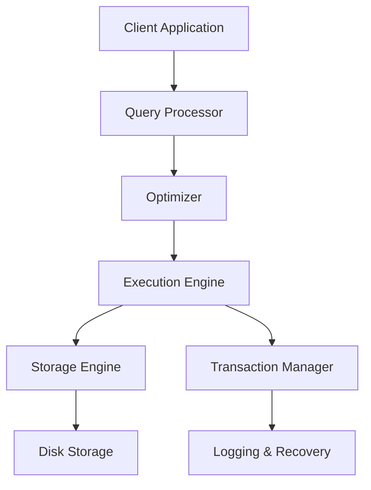
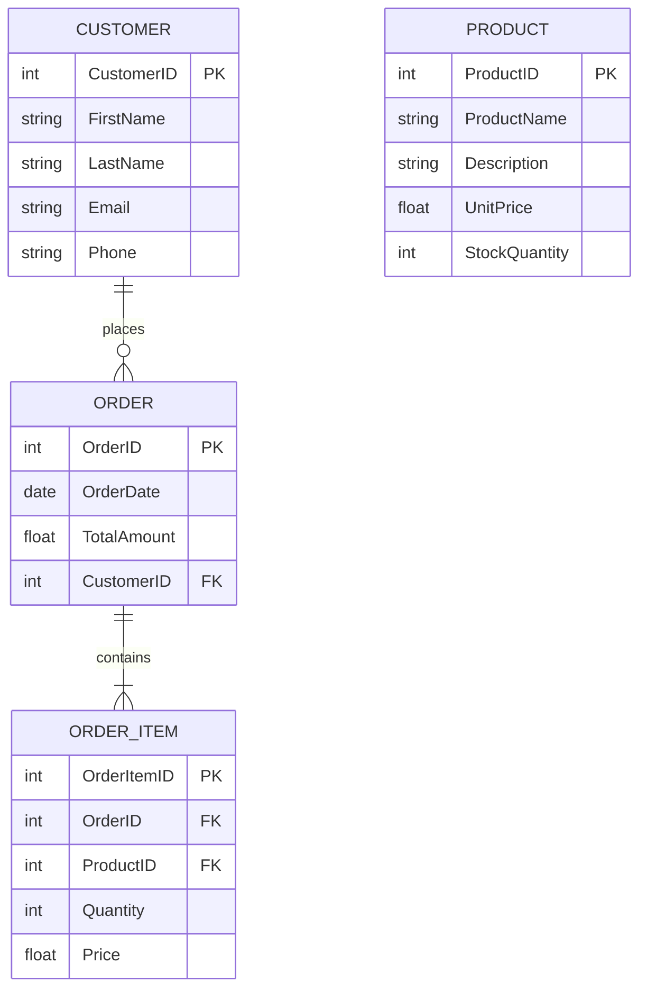
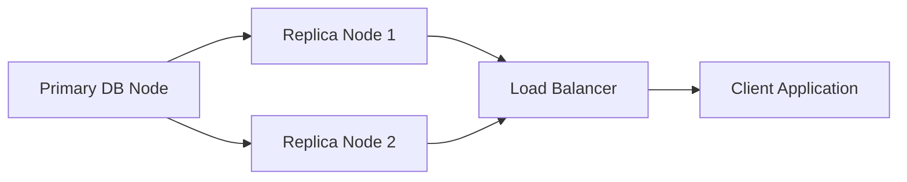
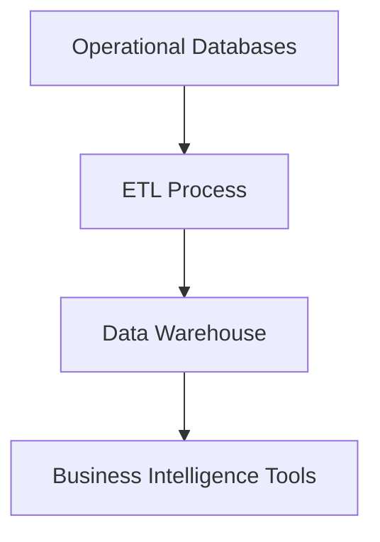
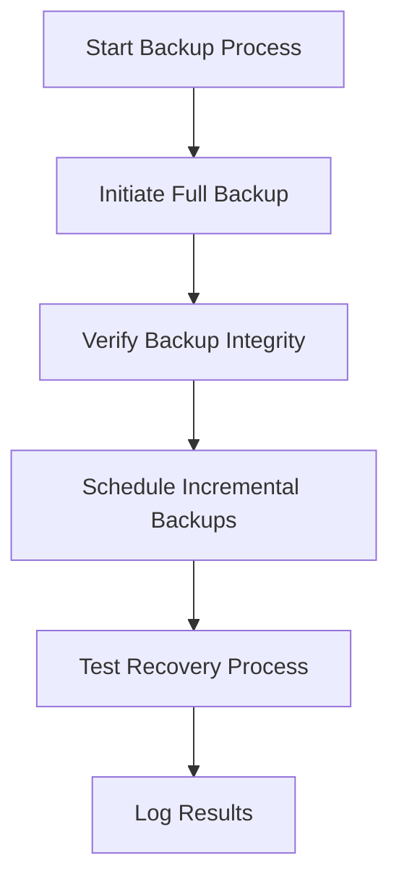

# Disclaimer
This repository contains information collected from various online sources and/or generated by AI assistants. The content provided here is for informational purposes only and is intended to serve as a general reference on various topics.

# Comprehensive Guide to Database Architectures with a Focus on Administration

## Table of Contents

1. [Introduction](#introduction)
2. [Historical Evolution of Database Architectures](#historical-evolution-of-database-architectures)
   - [The Early Days of Data Storage](#the-early-days-of-data-storage)
   - [Relational Database Revolution](#relational-database-revolution)
   - [The Emergence of NoSQL and NewSQL](#the-emergence-of-nosql-and-newsql)
3. [Core Concepts of Database Architecture](#core-concepts-of-database-architecture)
   - [Data Models and Schemas](#data-models-and-schemas)
   - [Database Engine Components](#database-engine-components)
   - [Storage, Memory, and Cache Management](#storage-memory-and-cache-management)
4. [Types of Database Architectures](#types-of-database-architectures)
   - [Relational Database Management Systems (RDBMS)](#relational-database-management-systems-rdbms)
   - [NoSQL Databases](#nosql-databases)
   - [NewSQL Databases](#newsql-databases)
   - [Graph Databases](#graph-databases)
   - [Time-Series Databases](#time-series-databases)
   - [In-Memory Databases](#in-memory-databases)
5. [Database Administration: Roles and Responsibilities](#database-administration-roles-and-responsibilities)
   - [Key Responsibilities](#key-responsibilities)
   - [Administration Tools and Interfaces](#administration-tools-and-interfaces)
   - [Security Management](#security-management)
6. [Designing a Robust Database Architecture](#designing-a-robust-database-architecture)
   - [Conceptual, Logical, and Physical Design](#conceptual-logical-and-physical-design)
   - [Entity Relationship (ER) Models and Diagrams](#entity-relationship-er-models-and-diagrams)
   - [Example: Designing a Retail Database](#example-designing-a-retail-database)
7. [Administration Techniques and Best Practices](#administration-techniques-and-best-practices)
   - [Backup and Recovery Strategies](#backup-and-recovery-strategies)
   - [Performance Tuning and Optimization](#performance-tuning-and-optimization)
   - [Replication, Clustering, and High Availability](#replication-clustering-and-high-availability)
   - [Monitoring and Logging](#monitoring-and-logging)
   - [Automation and Scripting](#automation-and-scripting)
8. [Scalability, Partitioning, and Sharding](#scalability-partitioning-and-sharding)
   - [Vertical vs. Horizontal Scaling](#vertical-vs-horizontal-scaling)
   - [Data Partitioning Techniques](#data-partitioning-techniques)
   - [Sharding Architecture](#sharding-architecture)
9. [Security Considerations in Database Administration](#security-considerations-in-database-administration)
   - [Access Control and User Management](#access-control-and-user-management)
   - [Encryption Techniques](#encryption-techniques)
   - [Auditing and Compliance](#auditing-and-compliance)
10. [Case Studies and Real-World Architectures](#case-studies-and-real-world-architectures)
    - [Enterprise Database Architecture](#enterprise-database-architecture)
    - [Cloud-Based Database Services](#cloud-based-database-services)
    - [Hybrid and Multi-Model Database Solutions](#hybrid-and-multi-model-database-solutions)
11. [Future Trends and Emerging Technologies](#future-trends-and-emerging-technologies)
    - [AI and Machine Learning in Database Administration](#ai-and-machine-learning-in-database-administration)
    - [Blockchain and Distributed Ledger Technologies](#blockchain-and-distributed-ledger-technologies)
12. [Conclusion](#conclusion)
13. [References](#references)

---

## Introduction

Database architecture has long been a cornerstone of modern IT infrastructure. With the exponential growth of data in today’s digital age, efficient and scalable database systems are essential for ensuring the integrity, availability, and performance of information systems. This guide explores the various facets of database architecture, emphasizing not only design but also the crucial role of database administration.

At its core, database architecture encompasses the frameworks, models, and technology solutions that store, manage, and retrieve data. With the evolution from simple file storage systems to complex multi-model databases, administrators now face an array of challenges and opportunities when designing and maintaining systems that are robust, scalable, and secure.

This document is structured to provide a layered understanding, starting from historical context to modern implementations and future trends. Whether you are an experienced database administrator, a developer, or an IT strategist, the following sections aim to equip you with insights, methodologies, and best practices necessary for managing complex database environments.

---

## Historical Evolution of Database Architectures

### The Early Days of Data Storage

The earliest systems for data storage were based on flat files and hierarchical structures. These systems were limited by their lack of flexibility, high redundancy, and inefficient querying capabilities. In these early architectures, data was stored in a fixed, predetermined structure, often leading to difficulties in data retrieval and integration.

Before the advent of relational databases, mainframe systems and legacy technologies dominated the landscape. File-based storage methods, such as ISAM (Indexed Sequential Access Method), were common. These methods offered limited indexing and lacked the dynamic capabilities required for modern data needs.

#### Key Characteristics:
- **Static Data Structures:** Data was often stored in a predefined layout, making schema evolution challenging.
- **Limited Querying:** Searching and data manipulation were inefficient due to the absence of sophisticated query languages.
- **High Redundancy:** Duplication of data was common, resulting in increased storage requirements and potential inconsistencies.

### Relational Database Revolution

The introduction of the relational database model by Edgar F. Codd in the 1970s marked a turning point in database technology. The relational model introduced the concept of data normalization, allowing for the reduction of redundancy and improvement in data integrity. SQL (Structured Query Language) soon became the standard language for querying relational databases, further cementing their popularity.

Relational Database Management Systems (RDBMS) such as Oracle, IBM DB2, and Microsoft SQL Server were developed to implement Codd’s model. These systems provided the following key features:
- **ACID Properties:** Ensuring atomicity, consistency, isolation, and durability in transactions.
- **Declarative Querying:** The use of SQL enabled users to focus on the “what” rather than the “how” of data retrieval.
- **Data Integrity:** The use of keys, constraints, and normalization reduced data redundancy and improved accuracy.

### The Emergence of NoSQL and NewSQL

As the volume, variety, and velocity of data increased—especially with the rise of the internet and big data—the limitations of traditional RDBMS became evident. This gave rise to NoSQL databases, which are designed to scale horizontally and handle unstructured or semi-structured data efficiently.

NoSQL databases such as MongoDB, Cassandra, and Couchbase offer flexibility in data modeling and are optimized for performance in distributed environments. However, they often sacrifice some of the ACID guarantees in favor of scalability and speed.

NewSQL databases emerged as a hybrid solution, aiming to provide the scalability benefits of NoSQL while maintaining the transactional integrity of traditional relational systems. These databases, like Google Spanner and CockroachDB, strive to offer the best of both worlds.

---

## Core Concepts of Database Architecture

Understanding the core components and design principles of database architectures is essential for effective administration and design.

### Data Models and Schemas

A **data model** defines how data is logically structured, while a **schema** represents the actual implementation of that model within a database system. The most common data models include:

- **Relational Model:** Data is organized in tables (relations) with rows and columns.
- **Document Model:** Data is stored as JSON-like documents, common in NoSQL databases.
- **Graph Model:** Data is stored as nodes and edges, representing relationships between entities.
- **Key-Value Model:** A simple model where data is stored as a collection of key-value pairs.

Each model has its strengths and is chosen based on the requirements of the application, such as query complexity, data structure, and scalability needs.

### Database Engine Components

A modern database engine typically comprises several components:

1. **Storage Engine:** Manages how data is stored on disk, including file formats, indexing, and data compression.
2. **Query Processor:** Interprets and optimizes queries to efficiently retrieve data.
3. **Transaction Manager:** Ensures that transactions are executed in a reliable and consistent manner.
4. **Concurrency Control:** Manages simultaneous data access, ensuring that database operations do not interfere with one another.
5. **Logging and Recovery:** Tracks changes to data and provides mechanisms to restore data in the event of a failure.

#### Diagram: Simplified Database Engine Architecture



This diagram shows the interaction between the client application and the underlying components of a typical database engine.

### Storage, Memory, and Cache Management

Efficient storage management is critical for ensuring fast data retrieval and processing. This involves:
- **Caching:** Temporarily storing frequently accessed data in memory.
- **Buffer Management:** Allocating memory buffers to manage the I/O operations between disk storage and main memory.
- **Indexing:** Creating data structures (like B-trees or hash indexes) that speed up data retrieval.

Administrators need to carefully tune these components to balance performance with resource usage.

---

## Types of Database Architectures

Database architectures vary widely based on their intended use, scalability requirements, and underlying data models. Below, we discuss several key types of database architectures:

### Relational Database Management Systems (RDBMS)

Relational databases have been the workhorse of enterprise data storage for decades. They use tables with rows and columns and enforce a strict schema that helps maintain data integrity.

#### Key Features:
- **Structured Query Language (SQL):** The standard language for data manipulation and query.
- **Normalization:** A process to reduce redundancy and improve data integrity.
- **ACID Transactions:** Guarantee that transactions are processed reliably.

#### Example Table: Customers in an RDBMS

| CustomerID | FirstName | LastName  | Email                    | Phone        |
|------------|-----------|-----------|--------------------------|--------------|
| 1          | John      | Doe       | john.doe@example.com     | 123-456-7890 |
| 2          | Jane      | Smith     | jane.smith@example.com   | 098-765-4321 |

#### Administration Considerations:
- **Backup and Recovery:** Regular full and incremental backups are critical.
- **Index Optimization:** Frequent monitoring and tuning of indexes to ensure optimal query performance.
- **Data Security:** Implementing access controls, auditing, and encryption.

### NoSQL Databases

NoSQL databases are designed to handle unstructured or semi-structured data and to scale out across many servers. They can be categorized as follows:
- **Document Stores:** (e.g., MongoDB, CouchDB) store data in JSON-like documents.
- **Column-Family Stores:** (e.g., Cassandra, HBase) store data in column families, ideal for large-scale data analytics.
- **Key-Value Stores:** (e.g., Redis, Riak) are used for simple, fast data retrieval.
- **Graph Databases:** (e.g., Neo4j, Amazon Neptune) are optimized for managing interconnected data.

#### Example Document (JSON Format)

```json
{
  "customerId": 1,
  "firstName": "John",
  "lastName": "Doe",
  "email": "john.doe@example.com",
  "phone": "123-456-7890",
  "orders": [
    {
      "orderId": 1001,
      "orderDate": "2023-08-01",
      "amount": 250.75
    },
    {
      "orderId": 1002,
      "orderDate": "2023-09-15",
      "amount": 75.50
    }
  ]
}
```

#### Administration Considerations:
- **Scalability:** Horizontal scaling is a key benefit, with many systems using automatic sharding.
- **Consistency Models:** Many NoSQL systems use eventual consistency, which requires careful design for write operations.
- **Monitoring and Performance Tuning:** Tools like MongoDB Atlas and Cassandra’s monitoring systems help track performance metrics and node health.

### NewSQL Databases

NewSQL databases strive to combine the best features of traditional RDBMS (ACID transactions, structured query language) with the scalability benefits of NoSQL systems. They are designed to run on modern hardware and distributed environments.

#### Key Characteristics:
- **Distributed Architecture:** Many NewSQL systems are designed to operate in cloud environments.
- **High Throughput:** Optimized for both OLTP (Online Transaction Processing) and OLAP (Online Analytical Processing).
- **Strong Consistency:** They maintain the transactional integrity of classic relational databases.

#### Administration Considerations:
- **Complexity:** Administration may involve managing distributed transactions and ensuring consistency across nodes.
- **Cloud Integration:** Many NewSQL solutions integrate seamlessly with cloud platforms, allowing for automated scaling and resource management.
- **Monitoring Tools:** These systems often provide sophisticated dashboards for tracking transaction performance and system health.

### Graph Databases

Graph databases are specifically designed to model and query relationships between data. They are ideal for applications where relationships are first-class citizens, such as social networks, recommendation engines, and fraud detection systems.

#### Example Graph Model: Social Network

- **Nodes:** Represent entities such as users, posts, or comments.
- **Edges:** Represent relationships such as friendships, likes, or comments.
  
A simple graph might include:
- **Nodes:** `User (id, name, age)`, `Post (id, content, timestamp)`
- **Edges:** `LIKES (user -> post)`, `FRIENDS_WITH (user -> user)`

#### Administration Considerations:
- **Indexing Relationships:** Special indexing techniques are required to quickly traverse graph relationships.
- **Query Optimization:** Graph databases often use specialized query languages (e.g., Cypher for Neo4j) that require fine-tuning.
- **Data Import/Export:** Efficient methods to import large volumes of connected data and maintain data integrity across nodes and relationships.

### Time-Series Databases

Time-series databases are optimized for handling time-stamped data, such as sensor data, financial transactions, and logs. They are engineered for high-speed writes and efficient querying of time-based data.

#### Key Features:
- **Efficient Storage:** Compression algorithms to reduce storage overhead for time-stamped data.
- **Retention Policies:** Automatic management of data retention based on time windows.
- **Query Language:** Specialized time-series query functions that allow aggregation and interpolation over time intervals.

#### Administration Considerations:
- **Data Ingestion:** Ensuring that high-frequency data streams are reliably written to the database.
- **Retention Management:** Configuring policies to purge old data and optimize storage.
- **Performance Tuning:** Balancing write throughput with read/query performance.

### In-Memory Databases

In-memory databases store data primarily in RAM to achieve ultra-fast read and write speeds. They are used in scenarios where performance is critical, such as real-time analytics and caching.

#### Key Characteristics:
- **Speed:** Orders of magnitude faster than disk-based databases.
- **Volatility:** Data is lost if the system fails, unless mechanisms like persistence or replication are used.
- **Simplicity:** Often have simpler data models due to their focus on speed and low-latency operations.

#### Administration Considerations:
- **Memory Management:** Ensuring that sufficient RAM is allocated and properly managed.
- **Persistence Strategies:** Techniques to periodically write data to disk or replicate it across nodes.
- **High Availability:** Using replication and clustering to avoid single points of failure.

---

## Database Administration: Roles and Responsibilities

Database administration (DBA) is a critical role within IT departments. DBAs are responsible for ensuring that databases operate reliably, securely, and at peak performance. Their responsibilities extend from routine maintenance tasks to strategic planning and emergency response.

### Key Responsibilities

1. **Installation and Configuration:**  
   - Installing database software.
   - Configuring the database environment, including memory allocation, storage paths, and network settings.

2. **Maintenance and Upgrades:**  
   - Applying patches and upgrades to the database management system.
   - Regularly performing system health checks and maintenance tasks.

3. **Performance Monitoring and Tuning:**  
   - Monitoring query performance and system resource usage.
   - Tuning indexes, queries, and configurations to improve performance.

4. **Backup and Recovery:**  
   - Developing and implementing backup strategies.
   - Testing recovery procedures to ensure data can be restored after failures.

5. **Security Management:**  
   - Implementing user authentication and access controls.
   - Encrypting sensitive data and monitoring for suspicious activity.

6. **Disaster Recovery and High Availability:**  
   - Designing architectures for replication, clustering, and failover.
   - Developing disaster recovery plans.

7. **Compliance and Auditing:**  
   - Ensuring databases meet regulatory requirements.
   - Conducting audits and maintaining logs of database activities.

8. **Automation and Scripting:**  
   - Automating routine tasks using scripting languages (e.g., Bash, Python, PowerShell).
   - Implementing monitoring scripts and alert systems.

### Administration Tools and Interfaces

A wide range of tools assist DBAs in managing databases effectively. These include:
- **Graphical Interfaces:** Tools such as Oracle Enterprise Manager, SQL Server Management Studio (SSMS), and pgAdmin.
- **Command-Line Interfaces (CLI):** Utilities like `psql`, `mysql`, and `mongo` shell.
- **Monitoring Tools:** Solutions like Prometheus, Grafana, Nagios, and vendor-specific monitoring suites.
- **Automation and Configuration Management:** Tools like Ansible, Puppet, and Chef to automate deployment and configuration tasks.

### Security Management

Security is a top priority for database administrators. Effective security measures include:
- **Authentication and Authorization:**  
  - Implementing robust authentication mechanisms.
  - Enforcing least privilege access policies.

- **Data Encryption:**  
  - Encrypting data at rest and in transit.
  - Using key management solutions.

- **Auditing and Logging:**  
  - Maintaining detailed logs of database activity.
  - Implementing automated alerts for suspicious activity.

- **Vulnerability Management:**  
  - Regularly updating and patching the database software.
  - Conducting security assessments and penetration testing.

---

## Designing a Robust Database Architecture

The process of designing a database architecture involves multiple layers, from conceptual planning to physical implementation. A robust design is essential for ensuring scalability, performance, and data integrity.

### Conceptual, Logical, and Physical Design

1. **Conceptual Design:**  
   - Focuses on high-level data relationships and business requirements.
   - Creates an Entity Relationship (ER) model that outlines the main entities and their relationships.
  
2. **Logical Design:**  
   - Translates the conceptual model into a detailed schema.
   - Defines tables, columns, primary keys, foreign keys, and constraints.
   - Normalizes the data to eliminate redundancy.
  
3. **Physical Design:**  
   - Maps the logical design onto the physical storage structures.
   - Optimizes for performance based on hardware and expected workload.
   - Includes indexing strategies, partitioning, and storage allocation.

### Entity Relationship (ER) Models and Diagrams

ER diagrams are crucial tools for visualizing the database structure. Below is an example ER diagram for a simplified retail database system.

#### Example ER Diagram: Retail Database



This diagram shows the relationships between customers, orders, order items, and products. The keys (PK for Primary Key, FK for Foreign Key) are clearly indicated.

### Example: Designing a Retail Database

Let’s detail a sample design process for a retail database. This database will store customer information, product details, orders, and order items.

#### Step 1: Define Business Requirements
- **Customer Management:** Capture customer details such as name, contact information, and loyalty points.
- **Order Processing:** Record customer orders, including order date, total amount, and associated order items.
- **Inventory Management:** Track product details, stock levels, and supplier information.
- **Reporting:** Generate sales reports, inventory reports, and customer activity logs.

#### Step 2: Develop the Conceptual Model
- Identify the main entities: `Customer`, `Order`, `OrderItem`, `Product`, and optionally `Supplier` for inventory purposes.
- Define the relationships: A customer places many orders, an order contains many order items, and each order item references a single product.

#### Step 3: Logical Schema Definition
- **Customer Table:**

```sql
CREATE TABLE Customer (
    CustomerID INT PRIMARY KEY,
    FirstName VARCHAR(50) NOT NULL,
    LastName VARCHAR(50) NOT NULL,
    Email VARCHAR(100) UNIQUE NOT NULL,
    Phone VARCHAR(20),
    LoyaltyPoints INT DEFAULT 0
);
```

- **Product Table:**

```sql
CREATE TABLE Product (
    ProductID INT PRIMARY KEY,
    ProductName VARCHAR(100) NOT NULL,
    Description TEXT,
    UnitPrice DECIMAL(10,2) NOT NULL,
    StockQuantity INT NOT NULL,
    SupplierID INT
);
```

- **Order Table:**

```sql
CREATE TABLE Order (
    OrderID INT PRIMARY KEY,
    OrderDate DATE NOT NULL,
    TotalAmount DECIMAL(10,2) NOT NULL,
    CustomerID INT,
    FOREIGN KEY (CustomerID) REFERENCES Customer(CustomerID)
);
```

- **OrderItem Table:**

```sql
CREATE TABLE OrderItem (
    OrderItemID INT PRIMARY KEY,
    OrderID INT,
    ProductID INT,
    Quantity INT NOT NULL,
    Price DECIMAL(10,2) NOT NULL,
    FOREIGN KEY (OrderID) REFERENCES Order(OrderID),
    FOREIGN KEY (ProductID) REFERENCES Product(ProductID)
);
```

#### Step 4: Physical Design Considerations
- **Indexing:** Create indexes on frequently queried fields (e.g., Email in the Customer table, OrderDate in the Order table).
- **Partitioning:** For very large tables (e.g., Order), partitioning by date can improve query performance.
- **Storage:** Determine whether to use SSDs for faster read/write operations.

---

## Administration Techniques and Best Practices

Effective database administration requires a systematic approach to ensure high performance, security, and data integrity. Below are detailed techniques and best practices that every DBA should consider.

### Backup and Recovery Strategies

Regular backups are crucial for data safety. Backup strategies can include:

1. **Full Backups:**  
   - Capture the entire database at a given point in time.
   - Typically scheduled during periods of low activity.

2. **Incremental Backups:**  
   - Only capture changes made since the last backup.
   - Reduce storage requirements and backup time.

3. **Differential Backups:**  
   - Capture all changes since the last full backup.
   - Provide a balance between full and incremental backups.

4. **Point-in-Time Recovery:**  
   - Use transaction logs to restore the database to a specific point in time.
   - Essential for recovering from data corruption or accidental deletions.

#### Example Backup Script (PostgreSQL)

```bash
#!/bin/bash
# Full backup using pg_dump
PGPASSWORD="your_password" pg_dump -U your_user -h localhost your_database > full_backup.sql
```

#### Administration Considerations:
- **Testing Recovery:** Regularly test backup files by performing trial recoveries.
- **Offsite Storage:** Store backup copies in a separate location or cloud service.
- **Automation:** Use cron jobs or scheduling tools to automate backup tasks.

### Performance Tuning and Optimization

Performance tuning is an ongoing process. Key techniques include:

1. **Query Optimization:**  
   - Analyze slow queries using tools like `EXPLAIN` and query profilers.
   - Optimize SQL queries by indexing, rewriting, or caching results.

2. **Index Management:**  
   - Regularly review index usage and remove unused or redundant indexes.
   - Consider composite indexes when multiple columns are frequently queried together.

3. **Memory Tuning:**  
   - Allocate appropriate amounts of RAM to cache frequently accessed data.
   - Adjust configuration parameters such as buffer pool size.

4. **Disk I/O Optimization:**  
   - Use RAID configurations and SSDs to improve read/write speeds.
   - Distribute database files across multiple disks for load balancing.

5. **Connection Pooling:**  
   - Use connection poolers to manage multiple database connections efficiently.
   - Reduces overhead by reusing existing connections.

### Replication, Clustering, and High Availability

To ensure data availability and fault tolerance, many systems employ replication and clustering.

1. **Replication:**
   - **Master-Slave Replication:** The master handles write operations while slaves replicate data for read scaling.
   - **Master-Master Replication:** All nodes can handle write operations, requiring conflict resolution mechanisms.
   - **Asynchronous vs. Synchronous:** Asynchronous replication is faster but may result in slight data lag, whereas synchronous replication ensures consistency at the cost of speed.

2. **Clustering:**
   - Clustered databases share data across multiple nodes.
   - Provides load balancing and failover capabilities.
   - Tools like Oracle RAC (Real Application Clusters) or MySQL Cluster are common examples.

3. **High Availability (HA):**
   - Deploy redundant systems to minimize downtime.
   - Implement failover strategies using load balancers and automated recovery scripts.

#### Example: High Availability Setup Diagram



### Monitoring and Logging

Continuous monitoring of database performance is essential. Effective monitoring includes:
- **Performance Metrics:** Track CPU usage, memory consumption, disk I/O, and query response times.
- **Error Logs:** Regularly review error logs to identify potential issues.
- **Automated Alerts:** Configure alerts for performance degradation, replication lag, or other critical events.
- **Third-Party Tools:** Use tools such as Grafana, Prometheus, or vendor-specific dashboards to visualize data and set thresholds.

### Automation and Scripting

Automation can significantly reduce the workload of DBAs by handling routine tasks. Common automation tasks include:
- **Scheduled Backups:** Automating backups with cron jobs.
- **Routine Maintenance:** Scripts to rebuild indexes, clear cache, and update statistics.
- **Deployment Automation:** Using tools like Ansible or Puppet to deploy configuration changes across environments.

#### Sample Automation Script (Bash)

```bash
#!/bin/bash
# Script to rebuild indexes for a specific database
psql -U your_user -d your_database -c "REINDEX DATABASE your_database;"
```

---

## Scalability, Partitioning, and Sharding

As data volumes grow, it becomes necessary to design database architectures that can scale efficiently. Below we discuss several strategies.

### Vertical vs. Horizontal Scaling

- **Vertical Scaling (Scaling Up):**  
  - Involves adding more resources (CPU, RAM, SSD) to an existing server.
  - Simpler to implement but has hardware limits.

- **Horizontal Scaling (Scaling Out):**  
  - Involves adding more nodes to a system.
  - More complex but offers virtually unlimited scaling.
  - Essential for distributed database systems.

### Data Partitioning Techniques

Partitioning divides a large database table into smaller, more manageable pieces, improving performance and manageability. Common partitioning methods include:

- **Range Partitioning:**  
  - Divides data based on a range of values (e.g., date ranges).
- **Hash Partitioning:**  
  - Uses a hash function to distribute rows evenly across partitions.
- **List Partitioning:**  
  - Data is partitioned based on a list of discrete values.
  
#### Example: Range Partitioning a Sales Table

```sql
CREATE TABLE Sales (
    SaleID INT,
    SaleDate DATE,
    Amount DECIMAL(10,2)
) PARTITION BY RANGE (SaleDate);

CREATE TABLE Sales_Q1 PARTITION OF Sales FOR VALUES FROM ('2023-01-01') TO ('2023-04-01');
CREATE TABLE Sales_Q2 PARTITION OF Sales FOR VALUES FROM ('2023-04-01') TO ('2023-07-01');
```

### Sharding Architecture

Sharding distributes data across multiple databases or servers. This strategy is often used in NoSQL environments and high-volume RDBMS setups.

#### Key Considerations:
- **Shard Key:**  
  - The attribute used to determine which shard a record belongs to.
- **Rebalancing:**  
  - As data grows, shards might need to be rebalanced.
- **Complex Queries:**  
  - Queries that span shards require careful planning.

#### Example Sharding Design Diagram

```mermaid
flowchart LR
    A[Client Query] --> B[Shard Router]
    B --> C[Shard 1 (User IDs 1-10000)]
    B --> D[Shard 2 (User IDs 10001-20000)]
    B --> E[Shard 3 (User IDs 20001-30000)]
```

Administrators must design sharding strategies to ensure that data distribution is even and that query performance remains optimal across shards.

---

## Security Considerations in Database Administration

In today’s threat landscape, ensuring the security of database systems is paramount. Security measures must encompass both the physical and logical aspects of the database environment.

### Access Control and User Management

- **Role-Based Access Control (RBAC):**  
  - Define roles and permissions for users based on their responsibilities.
- **Authentication Methods:**  
  - Integrate with centralized authentication systems (e.g., LDAP, Active Directory).
- **Audit Trails:**  
  - Maintain detailed logs of user activity and changes to the database.

### Encryption Techniques

- **Data-at-Rest Encryption:**  
  - Encrypt database files and backups to protect against unauthorized physical access.
- **Data-in-Transit Encryption:**  
  - Use protocols like TLS/SSL to secure data during network transmission.
- **Key Management:**  
  - Securely store and rotate encryption keys using hardware security modules (HSMs) or cloud key management services.

### Auditing and Compliance

- **Regulatory Compliance:**  
  - Ensure that database practices meet legal and regulatory requirements (e.g., GDPR, HIPAA).
- **Audit Logging:**  
  - Enable detailed logging to trace access and modifications.
- **Periodic Reviews:**  
  - Regularly review security policies and conduct vulnerability assessments.

---

## Case Studies and Real-World Architectures

Learning from real-world examples helps ground theoretical concepts in practical applications. Below are case studies of different database architectures in action.

### Enterprise Database Architecture

An enterprise typically employs a layered architecture that supports various types of applications, including transactional systems (OLTP) and reporting systems (OLAP). The architecture may include:

- **Data Warehousing:**  
  - A centralized repository for analytics and reporting.
- **Transactional Databases:**  
  - High-performance RDBMS systems for day-to-day operations.
- **Data Integration Layers:**  
  - ETL (Extract, Transform, Load) processes to move data between systems.

#### Example Architecture Diagram



Administrators in an enterprise environment focus on ensuring seamless integration between systems, data consistency across platforms, and robust backup and disaster recovery plans.

### Cloud-Based Database Services

Cloud services such as Amazon RDS, Google Cloud SQL, and Azure SQL Database have transformed how organizations manage databases. Key aspects include:
- **Managed Services:**  
  - Offload routine administrative tasks to cloud providers.
- **Scalability:**  
  - Elastic scaling to meet variable demand.
- **High Availability:**  
  - Built-in replication and failover mechanisms.
- **Security and Compliance:**  
  - Providers often offer enhanced security features and compliance certifications.

### Hybrid and Multi-Model Database Solutions

Hybrid architectures combine on-premise systems with cloud solutions, while multi-model databases support more than one data model (e.g., relational and document). These solutions require specialized administration techniques to:
- **Integrate Data Silos:**  
  - Ensure seamless data flow between systems.
- **Maintain Consistency:**  
  - Synchronize data across different platforms.
- **Optimize Performance:**  
  - Tune each model according to its specific requirements.

---

## Future Trends and Emerging Technologies

As technology evolves, new trends are shaping the future of database architectures and administration.

### AI and Machine Learning in Database Administration

- **Predictive Maintenance:**  
  - Using machine learning to predict potential issues before they cause downtime.
- **Automated Tuning:**  
  - AI-powered tools that automatically adjust indexes, query plans, and configuration parameters.
- **Anomaly Detection:**  
  - Leveraging AI to detect unusual patterns that may indicate security breaches or system failures.

### Blockchain and Distributed Ledger Technologies

Blockchain technologies offer new paradigms for data integrity and decentralization. While still emerging in the database space, they promise:
- **Tamper-Proof Records:**  
  - Immutable logs of transactions that enhance trust and security.
- **Decentralized Administration:**  
  - Distributed consensus mechanisms that reduce reliance on a central authority.
- **Smart Contracts:**  
  - Automated, self-executing contracts embedded in the database.

---

## Detailed Administration Workflows

Below we outline several workflows that DBAs might employ in day-to-day operations.

### Workflow: Routine Backup and Recovery Process

1. **Daily Full Backups:**  
   - Schedule full backups during off-peak hours.
   - Verify the integrity of backup files post-completion.

2. **Incremental Backups Every Hour:**  
   - Capture all changes made since the last full backup.
   - Store these backups in a secure, offsite location.

3. **Testing Recovery:**  
   - Perform weekly drills to restore from backups.
   - Document recovery time objectives (RTO) and recovery point objectives (RPO).

#### Backup Workflow Diagram



### Workflow: Performance Monitoring and Tuning

1. **Monitoring Phase:**
   - Use monitoring tools to collect performance metrics.
   - Identify slow queries and resource bottlenecks.

2. **Analysis Phase:**
   - Analyze query execution plans using the EXPLAIN command.
   - Identify missing indexes and inefficient queries.

3. **Tuning Phase:**
   - Create or rebuild indexes.
   - Optimize SQL queries and adjust configurations.
   - Re-run performance tests to confirm improvements.

#### Performance Tuning Script Example (SQL Server)

```sql
-- Analyze query plan
SET SHOWPLAN_XML ON;
GO
SELECT * FROM Orders WHERE OrderDate > '2023-01-01';
GO
SET SHOWPLAN_XML OFF;
GO
```

### Workflow: Security Audit and Compliance

1. **Audit Log Review:**
   - Configure and review logs for unauthorized access attempts.
   - Identify anomalies and suspicious patterns.

2. **User Access Reviews:**
   - Periodically review user roles and permissions.
   - Remove or adjust access for inactive or unnecessary accounts.

3. **Compliance Checks:**
   - Ensure that encryption and security policies comply with regulations.
   - Document audit trails for regulatory review.

#### Security Audit Table Example

| AuditID | Timestamp           | UserID | Action        | Outcome  | Comments                  |
|---------|---------------------|--------|---------------|----------|---------------------------|
| 101     | 2023-10-01 10:15:00 | 501    | Login Attempt | Success  | Valid credentials         |
| 102     | 2023-10-01 10:17:00 | 502    | Data Export   | Failure  | Insufficient privileges   |
| 103     | 2023-10-01 10:20:00 | 503    | Update Record | Success  | Approved by supervisor    |

---

## Advanced Topics in Database Administration

This section covers several advanced topics that require in-depth understanding and expertise.

### Replication Conflict Resolution

In multi-master replication environments, conflicts can occur when the same data is updated concurrently in different nodes. Techniques to resolve conflicts include:
- **Last Write Wins (LWW):** The most recent write operation takes precedence.
- **Merge Strategies:** Custom logic to merge conflicting changes.
- **Application-Level Resolution:** Let the application handle conflicts using business rules.

### Indexing Strategies for Large-Scale Systems

Large databases require sophisticated indexing strategies to maintain performance. Some techniques include:
- **Partial Indexes:** Index only a subset of data that meets certain criteria.
- **Covering Indexes:** Index that includes all columns needed for a query, eliminating the need to access the table.
- **Columnstore Indexes:** Optimized for data warehousing and analytics workloads.

### Multi-Tenant Database Architectures

Multi-tenancy involves serving multiple customers (tenants) using a single database instance. Approaches include:
- **Shared Schema:** All tenants share the same tables with a tenant identifier column.
- **Isolated Schema:** Each tenant has its own schema within the same database.
- **Dedicated Databases:** Each tenant has a completely separate database instance.

#### Multi-Tenant Design Table

| TenantID | Schema Type    | Isolation Level   | Pros                              | Cons                             |
|----------|----------------|-------------------|-----------------------------------|----------------------------------|
| 1        | Shared Schema  | Low               | Cost-effective, easy maintenance  | Potential performance impact     |
| 2        | Isolated Schema| Medium            | Better isolation                  | Increased complexity             |
| 3        | Dedicated DB   | High              | Strong isolation and security     | Higher cost and maintenance      |

### Disaster Recovery Planning

A robust disaster recovery plan is essential for minimizing downtime and data loss. Steps include:
- **Risk Assessment:** Identify potential threats and vulnerabilities.
- **Recovery Objectives:** Define RTO and RPO.
- **Redundancy Planning:** Implement geographically distributed replicas.
- **Regular Drills:** Conduct periodic disaster recovery tests.

### Automation in Large-Scale Environments

As organizations grow, manual administration becomes unsustainable. Automation through scripting and configuration management tools (like Ansible, Puppet, or Chef) is essential. Automated tasks include:
- **Provisioning new database instances.**
- **Automated scaling and load balancing.**
- **Routine health checks and alerting.**

---

## In-Depth Case Study: Designing and Administering an E-Commerce Database

In this case study, we’ll explore the complete lifecycle of designing, implementing, and administering a database architecture for an e-commerce platform.

### Business Requirements

The e-commerce platform must support:
- **User Management:** Registration, authentication, and profile management.
- **Product Catalog:** Dynamic listing of products, including categories, prices, and descriptions.
- **Order Processing:** Shopping cart, order placement, and payment processing.
- **Inventory Management:** Real-time stock levels and supplier information.
- **Analytics and Reporting:** Sales data, customer behavior, and performance metrics.

### Conceptual Design

The conceptual design identifies key entities:
- **Users:** Store customer details.
- **Products:** Store product information.
- **Orders:** Capture order details.
- **OrderItems:** Capture details of products in each order.
- **Categories:** Organize products.
- **Reviews:** Customer reviews of products.

### Logical Schema

Define tables based on the conceptual design.

#### Example: Users Table

```sql
CREATE TABLE Users (
    UserID INT PRIMARY KEY,
    Username VARCHAR(50) UNIQUE NOT NULL,
    PasswordHash VARCHAR(256) NOT NULL,
    Email VARCHAR(100) UNIQUE NOT NULL,
    RegistrationDate DATETIME DEFAULT CURRENT_TIMESTAMP
);
```

#### Example: Products Table

```sql
CREATE TABLE Products (
    ProductID INT PRIMARY KEY,
    ProductName VARCHAR(100) NOT NULL,
    Description TEXT,
    Price DECIMAL(10,2) NOT NULL,
    CategoryID INT,
    StockQuantity INT NOT NULL,
    FOREIGN KEY (CategoryID) REFERENCES Categories(CategoryID)
);
```

#### Example: Orders and OrderItems Tables

```sql
CREATE TABLE Orders (
    OrderID INT PRIMARY KEY,
    UserID INT,
    OrderDate DATETIME DEFAULT CURRENT_TIMESTAMP,
    TotalAmount DECIMAL(10,2) NOT NULL,
    OrderStatus VARCHAR(20) NOT NULL,
    FOREIGN KEY (UserID) REFERENCES Users(UserID)
);

CREATE TABLE OrderItems (
    OrderItemID INT PRIMARY KEY,
    OrderID INT,
    ProductID INT,
    Quantity INT NOT NULL,
    UnitPrice DECIMAL(10,2) NOT NULL,
    FOREIGN KEY (OrderID) REFERENCES Orders(OrderID),
    FOREIGN KEY (ProductID) REFERENCES Products(ProductID)
);
```

### Physical Design and Administration Considerations

- **Indexing:**  
  - Create indexes on `Username`, `Email` in the Users table, `ProductName` in the Products table, and `OrderDate` in the Orders table.

- **Partitioning:**  
  - Partition the Orders table by month or quarter to improve query performance on historical data.

- **High Availability:**  
  - Use master-slave replication for the Orders and Users databases.
  - Configure automated failover using clustering technologies.

- **Security:**  
  - Encrypt sensitive data such as user passwords (using salted hashes) and payment details.
  - Implement regular security audits.

### Monitoring and Maintenance

- **Performance Monitoring:**  
  - Set up dashboards using Grafana to monitor query response times and server resource utilization.
  - Regularly analyze slow query logs and adjust indexes or queries accordingly.

- **Backup Strategies:**  
  - Implement daily full backups and hourly incremental backups.
  - Store backups offsite and test recovery procedures monthly.

- **Automated Tasks:**  
  - Schedule routine tasks like index rebuilding and log purging using cron jobs or SQL Server Agent.

### Challenges and Solutions

- **Scaling Under High Traffic:**  
  - Implement load balancing with read replicas.
  - Use caching mechanisms (like Redis) to cache frequently accessed product data.

- **Ensuring Data Consistency:**  
  - Use transactional processing for order placement.
  - Implement conflict resolution in multi-master setups.

- **Security Threats:**  
  - Regularly update database software and apply patches.
  - Monitor for suspicious activity using automated alerting systems.

---

## Emerging Trends and Future Directions

The database landscape is constantly evolving. Several emerging trends promise to further revolutionize database architectures and administration:

### Cloud-Native Databases

Cloud-native databases are designed from the ground up for the cloud. They offer:
- **Elastic Scaling:** Seamless adjustment of resources based on demand.
- **Managed Services:** Reduced administrative overhead.
- **Global Distribution:** Data can be distributed across multiple geographic regions for lower latency.

### Serverless Database Architectures

Serverless databases abstract the underlying infrastructure from the user. They provide:
- **On-Demand Scaling:** Resources are allocated dynamically.
- **Cost Efficiency:** Pay only for the compute resources used.
- **Simplified Management:** No need to manage servers or clusters manually.

### AI-Driven Administration

AI is increasingly being integrated into database management to provide:
- **Predictive Analytics:** Anticipating performance bottlenecks and proactively adjusting resources.
- **Self-Healing Systems:** Automatic resolution of common issues without human intervention.
- **Intelligent Query Optimization:** Machine learning models that optimize query plans based on historical data.

### Blockchain and Distributed Ledger Databases

Blockchain-based databases are being explored for use cases requiring:
- **Immutable Data Storage:** Enhanced security and auditability.
- **Decentralized Administration:** Reduction of single points of failure.
- **Smart Contracts:** Automated execution of business rules embedded directly in the database layer.

---

## Detailed Design Examples and Administration Tables

Below are additional examples and tables that further illustrate various concepts discussed in this guide.

### Example: Employee Management Database (RDBMS)

#### Table Designs

- **Employee Table:**

```sql
CREATE TABLE Employee (
    EmployeeID INT PRIMARY KEY,
    FirstName VARCHAR(50) NOT NULL,
    LastName VARCHAR(50) NOT NULL,
    Email VARCHAR(100) UNIQUE NOT NULL,
    HireDate DATE NOT NULL,
    DepartmentID INT,
    Salary DECIMAL(10,2)
);
```

- **Department Table:**

```sql
CREATE TABLE Department (
    DepartmentID INT PRIMARY KEY,
    DepartmentName VARCHAR(100) NOT NULL,
    ManagerID INT,
    Location VARCHAR(100)
);
```

- **Example Data Insertion:**

```sql
INSERT INTO Department (DepartmentID, DepartmentName, ManagerID, Location)
VALUES (1, 'IT', 100, 'Headquarters'),
       (2, 'Finance', 101, 'Branch Office');

INSERT INTO Employee (EmployeeID, FirstName, LastName, Email, HireDate, DepartmentID, Salary)
VALUES (100, 'Alice', 'Johnson', 'alice.johnson@example.com', '2018-05-01', 1, 75000.00),
       (101, 'Bob', 'Smith', 'bob.smith@example.com', '2019-06-15', 2, 68000.00);
```

### Administration Tables

#### Database Maintenance Schedule

| Task                          | Frequency  | Responsible   | Tools/Commands                      | Comments                              |
|-------------------------------|------------|---------------|-------------------------------------|---------------------------------------|
| Full Backup                   | Daily      | DBA Team      | `pg_dump`/`mysqldump`               | Run during off-peak hours             |
| Incremental Backup            | Hourly     | DBA Team      | Custom scripts                      | Store in secure offsite location      |
| Index Rebuild                 | Weekly     | DBA Team      | SQL scripts (`REINDEX`, `OPTIMIZE`) | Monitor query performance post-task   |
| Security Audit                | Monthly    | Security Team | Custom logs and auditing tools      | Review access logs and permissions    |
| Performance Monitoring Review | Daily      | DBA Team      | Grafana/Prometheus dashboards       | Analyze slow query logs               |
| System Updates and Patches    | As Needed  | DBA Team      | Vendor-specific update tools        | Ensure compatibility with production  |

#### Example Log Entry Format (CSV)

```csv
Timestamp,UserID,Action,Status,Description
2023-10-01 10:15:00,501,Login,Success,User logged in from IP 192.168.1.10
2023-10-01 10:20:00,502,Data Export,Failure,Attempt to export data without proper privileges
```

---

## Best Practices Recap

To ensure the smooth operation of database systems, DBAs should adhere to these best practices:
- **Regular Backups:** Always have a tested backup and recovery plan.
- **Performance Tuning:** Continuously monitor and optimize query performance.
- **Security Hardening:** Implement strong authentication, encryption, and auditing.
- **Automation:** Automate routine tasks to reduce human error.
- **Scalability Planning:** Design architectures that can grow with the business.
- **Documentation:** Maintain detailed documentation of configurations, policies, and procedures.

---

## In-Depth Administrative Strategies for Complex Systems

### Multi-Layered Security Implementation

1. **Network Security:**  
   - Use firewalls, VPNs, and secure network protocols to protect database servers.
   - Limit access to database servers by IP whitelisting.

2. **Host Security:**  
   - Harden operating systems with regular updates and minimal services.
   - Use intrusion detection systems (IDS) to monitor for suspicious activity.

3. **Database Security:**  
   - Enforce role-based access control (RBAC).
   - Regularly update credentials and use multi-factor authentication (MFA).

### Disaster Recovery: A Step-by-Step Plan

1. **Risk Analysis:**  
   - Identify potential disasters (hardware failure, natural disasters, cyberattacks).
2. **Define Objectives:**  
   - Establish RTO (Recovery Time Objective) and RPO (Recovery Point Objective).
3. **Implement Redundancy:**  
   - Set up replication and clustering.
4. **Documentation and Training:**  
   - Maintain a detailed disaster recovery plan.
   - Regularly train staff on recovery procedures.
5. **Testing:**  
   - Conduct simulations and drills to ensure readiness.

### Cloud vs. On-Premise Administration

- **Cloud Administration:**
  - Advantages: Scalability, reduced hardware management, managed security updates.
  - Considerations: Vendor lock-in, network latency, data sovereignty.
  
- **On-Premise Administration:**
  - Advantages: Full control over hardware and software, customizable security policies.
  - Considerations: Higher capital expenditure, manual maintenance, scaling challenges.

---

## Future-Proofing Your Database Architecture

As technologies evolve, DBAs must remain proactive. Future-proofing strategies include:
- **Regular Training and Certification:**  
  - Stay updated with the latest developments in database technology.
- **Flexible Architecture Design:**  
  - Design systems that can incorporate new technologies, such as AI-driven optimization or blockchain features.
- **Cloud Migration Readiness:**  
  - Plan for potential migration to cloud-based architectures.
- **Continuous Integration/Continuous Deployment (CI/CD):**  
  - Integrate CI/CD pipelines to streamline database changes and updates.

---

## Conclusion

Database architectures are the backbone of modern IT infrastructures, supporting everything from enterprise applications to cloud services. Effective database administration is essential to ensure data integrity, performance, security, and scalability. This comprehensive guide has covered the evolution of database systems—from early file-based systems to sophisticated multi-model architectures—detailing the roles and responsibilities of DBAs, best practices, and advanced techniques in backup, performance tuning, replication, security, and automation.

The case studies and examples provided illustrate real-world applications of these principles, highlighting the challenges and solutions in managing complex database environments. As the technological landscape continues to evolve with trends like cloud-native databases, AI-driven administration, and blockchain, staying informed and adaptable is key for database professionals.

By implementing the strategies, designs, and best practices outlined in this guide, organizations can build robust, scalable, and secure database systems that meet current needs and are well-prepared for future challenges.

---

## References

- [Database System Concepts](https://en.wikipedia.org/wiki/Database_system)  
- [SQL Tutorial](https://www.w3schools.com/sql/)  
- [NoSQL Databases](https://www.mongodb.com/nosql-explained)  
- [High Availability Architectures](https://docs.microsoft.com/en-us/sql/high-availability)  
- [Cloud Database Services](https://aws.amazon.com/rds/)  

---
