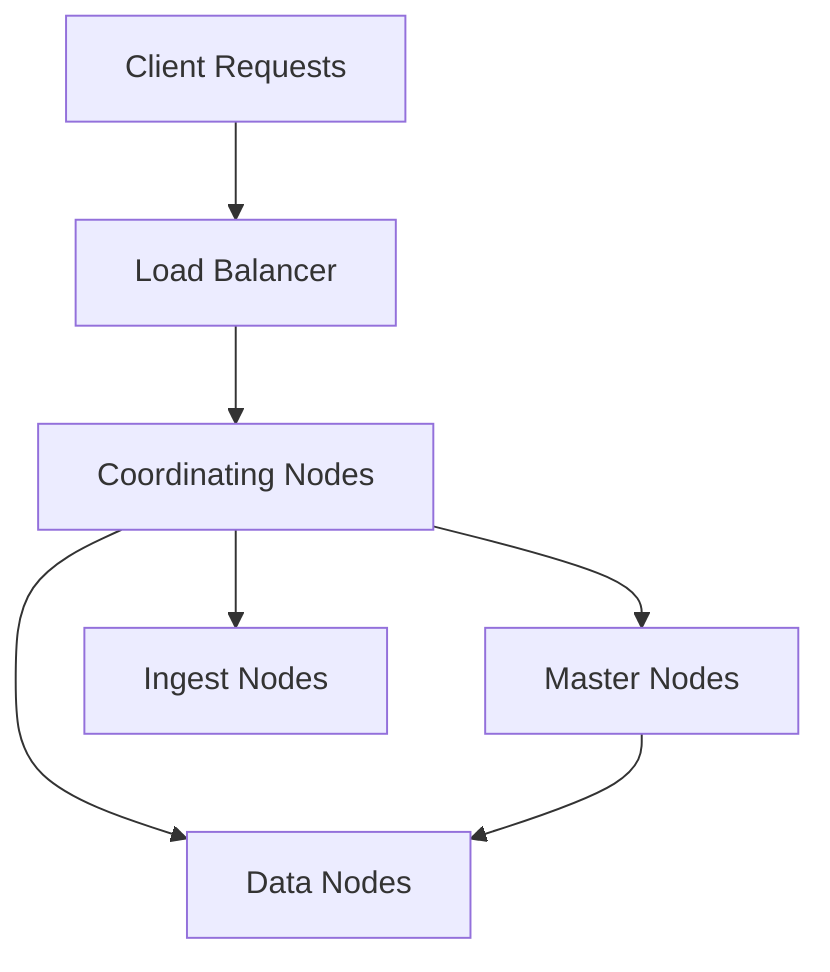

# Disclaimer
This repository contains information collected from various online sources and/or generated by AI assistants. The content provided here is for informational purposes only and is intended to serve as a general reference on various topics.


# Elasticsearch Administration: A Comprehensive Guide

> **Table of Contents**
> 
> 1. [Introduction](#1.-introduction)
> 2. [What is Elasticsearch?](#what-is-elasticsearch)
> 3. [Core Architecture and Concepts](#core-architecture-and-concepts)
>    - 3.1. Cluster and Node Architecture
>    - 3.2. Indexing and Sharding
>    - 3.3. Replication and High Availability
> 4. [Installation and Initial Setup](#installation-and-initial-setup)
>    - 4.1. System Requirements
>    - 4.2. Installation Methods
>    - 4.3. Configuration Files and Directories
> 5. [Cluster Administration](#cluster-administration)
>    - 5.1. Cluster Health and State
>    - 5.2. Node Roles and Responsibilities
>    - 5.3. Cluster Coordination and Election
> 6. [Index Administration and Data Modeling](#index-administration-and-data-modeling)
>    - 6.1. Creating and Managing Indexes
>    - 6.2. Index Templates and Mappings
>    - 6.3. Analyzers and Tokenizers
> 7. [Performance Tuning and Monitoring](#performance-tuning-and-monitoring)
>    - 7.1. Monitoring Tools and Metrics
>    - 7.2. Query Performance and Caching
>    - 7.3. Resource Allocation and JVM Tuning
> 8. [Security Administration](#security-administration)
>    - 8.1. User Authentication and Authorization
>    - 8.2. Securing Communications
>    - 8.3. Audit Logging and Compliance
> 9. [Backup, Restore, and Disaster Recovery](#backup-restore-and-disaster-recovery)
>    - 9.1. Snapshot and Restore Procedures
>    - 9.2. Cluster Backups Strategies
>    - 9.3. Disaster Recovery Planning
> 10. [Troubleshooting and Maintenance](#troubleshooting-and-maintenance)
>     - 10.1. Log Analysis and Debugging
>     - 10.2. Common Pitfalls and How to Avoid Them
>     - 10.3. Maintenance Best Practices
> 11. [Upgrades and Scalability](#upgrades-and-scalability)
>     - 11.1. Rolling Upgrades
>     - 11.2. Scaling Out the Cluster
>     - 11.3. Elastic vs. In-House Solutions
> 12. [Integrations and Ecosystem](#integrations-and-ecosystem)
>     - 12.1. Integration with Logstash and Kibana
>     - 12.2. Beats and Ingestion Pipelines
>     - 12.3. Third-Party Tools and Plugins
> 13. [Best Practices and Operational Considerations](#best-practices-and-operational-considerations)
>     - 13.1. Security and Compliance Best Practices
>     - 13.2. Performance and Resource Optimization
>     - 13.3. Future-Proofing Your Deployment
> 14. [Appendices](#appendices)
>     - 14.1. Glossary
>     - 14.2. Useful Commands and Scripts
>     - 14.3. Additional Resources
> 15. [Conclusion](#conclusion)

---

## 1. Introduction

Elasticsearch has emerged as a powerful search and analytics engine, primarily designed for horizontal scalability, real-time search, and distributed processing of large amounts of data. In today’s world of big data and the Internet of Things (IoT), organizations require an infrastructure that is both robust and adaptable. Elasticsearch provides this through a distributed, multi-tenant-capable solution that can be scaled out on commodity hardware.

This guide aims to provide a thorough understanding of Elasticsearch administration in an IT context. Whether you are a seasoned administrator or a newcomer to the world of distributed search systems, this document will provide valuable insights into the inner workings of Elasticsearch and how to manage it effectively. We will cover installation, configuration, cluster and index administration, performance tuning, security implementations, backup and recovery, troubleshooting, and scalability strategies. Additionally, we will include designs, tables, and diagrams to facilitate a deeper understanding of the system.

By the end of this guide, you should have a comprehensive knowledge of how Elasticsearch functions at its core and how to maintain and administer it in a production environment.

---

## 2. What is Elasticsearch?

Elasticsearch is an open-source, RESTful search and analytics engine built on top of Apache Lucene. It is widely used for full-text search, log analytics, security intelligence, business analytics, and operational monitoring. Elasticsearch is at the heart of the Elastic Stack, which also includes Logstash (data ingestion) and Kibana (visualization). Here we detail some of the fundamental characteristics:

- **Distributed Nature:** Elasticsearch runs as a cluster of nodes that work together, sharing data and workloads.
- **RESTful API:** It provides a comprehensive REST API for interacting with the system.
- **Schema-Free:** Elasticsearch indexes data in a JSON format, allowing flexibility in the types of data ingested.
- **Horizontal Scalability:** Easily scale by adding more nodes to the cluster.
- **Real-Time Operations:** Near real-time indexing and search capabilities allow it to be used in time-sensitive applications.

### 2.1 Core Features
- **Full-Text Search:** Advanced querying capabilities that include natural language processing, fuzzy search, and more.
- **Distributed Processing:** Automatically distributes data and processing across multiple nodes.
- **High Availability:** Through replication and fault tolerance.
- **Aggregation Framework:** For data summarization and analytics.
- **Plugin Architecture:** Extendable functionalities through numerous available plugins.

---

## 3. Core Architecture and Concepts

Understanding the architecture of Elasticsearch is key to effective administration. In this section, we will cover the building blocks of Elasticsearch, including clusters, nodes, indexes, shards, and replicas.

### 3.1 Cluster and Node Architecture

An **Elasticsearch cluster** is a collection of one or more nodes (servers) that together hold your entire data and provide federated indexing and search capabilities. The cluster is identified by a unique name, and all nodes that are part of a cluster must share the same name.

#### Node Roles
Each node in the cluster can serve one or more roles. The primary node roles include:

- **Master Node:** Manages cluster-wide actions such as creating or deleting indexes, tracking nodes in the cluster, and maintaining cluster state.
- **Data Node:** Stores data and executes data-related operations such as CRUD, search, and aggregations.
- **Ingest Node:** Preprocesses documents before indexing them.
- **Coordinating Node:** Handles incoming search and indexing requests and distributes operations across the cluster.

> **Table 1: Node Roles in Elasticsearch**
>
> | **Role**            | **Description**                                                                                   |
> |---------------------|---------------------------------------------------------------------------------------------------|
> | Master Node         | Coordinates the cluster, maintains cluster state, and manages index metadata.                     |
> | Data Node           | Stores data and performs data-related operations like search and aggregations.                    |
> | Ingest Node         | Processes incoming data through pipelines before indexing.                                      |
> | Coordinating Node   | Acts as a load balancer to distribute operations; can be any node that receives a client request.   |

#### Cluster Health and State
Elasticsearch continuously monitors its cluster state, which includes information about nodes, indexes, shards, and replicas. The health of a cluster is usually represented by one of the following statuses:

- **Green:** All primary and replica shards are active.
- **Yellow:** All primary shards are active, but some replica shards are not allocated.
- **Red:** One or more primary shards are not active.

Monitoring the cluster’s health is vital for ensuring that the system is operating optimally and that data is not at risk.

> **Diagram 1: Cluster Overview**
>
> ```mermaid
> graph LR
>     A[Client Request]
>     B[Coordinating Node]
>     C[Master Node]
>     D[Data Nodes]
>     A --> B
>     B --> C
>     B --> D
>     C --> D
> ```
>
> *Figure 1: A simplified diagram showing how a client request is handled by a coordinating node, which then interacts with the master node and data nodes.*

### 3.2 Indexing and Sharding

An **index** in Elasticsearch is similar to a database in relational database management systems. It is a collection of documents that share similar characteristics. Each document is a JSON object.

#### Sharding
- **Primary Shards:** When an index is created, it is divided into primary shards. Sharding helps in scaling horizontally, distributing the data and workload.
- **Replica Shards:** Each primary shard can have one or more replicas. Replica shards provide redundancy and increase search performance.

> **Table 2: Sharding Configuration**
>
> | **Parameter**            | **Description**                                                                                     |
> |--------------------------|-----------------------------------------------------------------------------------------------------|
> | `number_of_shards`       | The number of primary shards an index should have.                                                  |
> | `number_of_replicas`     | The number of replica copies for each primary shard.                                                |

### 3.3 Replication and High Availability

Replication ensures data redundancy and improves fault tolerance. Each replica shard is an exact copy of a primary shard, and Elasticsearch can automatically reassign shards if a node fails.

- **Replica Allocation:** Elasticsearch automatically allocates replicas to different nodes to avoid data loss in the event of a node failure.
- **Failover Mechanisms:** In the event of a node crash, replicas can be promoted to primary shards, ensuring continuity.

---

## 4. Installation and Initial Setup

Installing Elasticsearch properly is the first step toward a stable and efficient cluster. This section provides guidance on installing Elasticsearch on various environments, configuring basic settings, and understanding the filesystem layout.

### 4.1 System Requirements

Before installation, it is important to ensure your system meets the necessary hardware and software requirements. Key system requirements include:

- **Java Runtime Environment (JRE):** Elasticsearch runs on the Java Virtual Machine (JVM). Make sure you have the appropriate JRE installed.
- **Memory and CPU:** Sufficient RAM and CPU power are critical for handling indexing and search operations.
- **Disk Space:** Fast, reliable disk storage (SSD recommended) for data nodes.

> **Table 3: Recommended Hardware Specifications**
>
> | **Component**    | **Minimum Requirement**            | **Recommended**                       |
> |------------------|------------------------------------|---------------------------------------|
> | CPU              | Dual-core                          | Quad-core or higher                   |
> | Memory           | 4 GB RAM                           | 16 GB RAM or higher                   |
> | Disk Storage     | 20 GB free disk space              | SSD with sufficient IOPS for workload |
> | Network          | Gigabit Ethernet                   | Redundant network interfaces          |

### 4.2 Installation Methods

There are several methods to install Elasticsearch, including:

- **Tarball/ZIP Distribution:** Useful for testing and non-production setups.
- **Package Managers:** Using APT (for Debian/Ubuntu) or YUM (for CentOS/RHEL) for production environments.
- **Docker Containers:** Running Elasticsearch as a containerized application.

Each installation method comes with its own configuration files and default settings.

#### Example: Installation via APT on Debian/Ubuntu
```bash
# Import the Elasticsearch public GPG key:
wget -qO - https://artifacts.elastic.co/GPG-KEY-elasticsearch | sudo apt-key add -

# Add the repository:
sudo sh -c 'echo "deb https://artifacts.elastic.co/packages/8.x/apt stable main" > /etc/apt/sources.list.d/elastic-8.x.list'

# Update the package index and install:
sudo apt-get update && sudo apt-get install elasticsearch
```

### 4.3 Configuration Files and Directories

After installation, Elasticsearch’s behavior can be fine-tuned via configuration files. The primary configuration file is usually found at `/etc/elasticsearch/elasticsearch.yml`.

#### Key Configuration Options

- **Cluster Name:** Define the name of your cluster.
- **Node Name:** Unique name for the node.
- **Network Host:** Specifies which network interfaces Elasticsearch should bind to.
- **Discovery Settings:** Used for node discovery in a cluster.

> **Example Configuration: `/etc/elasticsearch/elasticsearch.yml`**
> ```yaml
> cluster.name: my-elasticsearch-cluster
> node.name: node-1
> network.host: 192.168.1.10
> discovery.seed_hosts: ["192.168.1.11", "192.168.1.12"]
> cluster.initial_master_nodes: ["node-1", "node-2", "node-3"]
> ```

Understanding the directory structure is also important:
- **/etc/elasticsearch:** Contains configuration files.
- **/var/lib/elasticsearch:** Default directory for data storage.
- **/var/log/elasticsearch:** Contains log files.

---

## 5. Cluster Administration

Cluster administration involves managing the overall health and performance of the Elasticsearch cluster. It includes monitoring the state of nodes, handling cluster state updates, and ensuring that the cluster remains operational even in the event of failures.

### 5.1 Cluster Health and State

Monitoring the health of your cluster is a continuous process. The cluster health API provides a snapshot of the cluster’s overall condition.

#### Health API
You can check the cluster health by executing:
```bash
curl -X GET "http://localhost:9200/_cluster/health?pretty"
```
This command returns a JSON object containing details such as the status (green, yellow, red), number of nodes, number of shards, and more.

> **Table 4: Common Cluster Health Indicators**
>
> | **Indicator**          | **Description**                                                                                 |
> |------------------------|-------------------------------------------------------------------------------------------------|
> | `status`               | Overall cluster health: green, yellow, or red.                                                  |
> | `number_of_nodes`      | Total number of nodes in the cluster.                                                           |
> | `active_primary_shards`| Number of primary shards that are active.                                                       |
> | `active_shards`        | Total number of shards (primary and replicas) that are active.                                  |
> | `relocating_shards`    | Shards that are currently being relocated to other nodes.                                      |

### 5.2 Node Roles and Responsibilities

Each node in your Elasticsearch cluster may have one or more roles, which determine its responsibilities. Below, we discuss in detail how each node role contributes to cluster operations.

#### Master Node Responsibilities
- **Cluster State Management:** Maintains and updates the state of the cluster.
- **Index Lifecycle Operations:** Creates, deletes, and manages indexes.
- **Node Discovery:** Tracks nodes as they join or leave the cluster.
- **Shard Allocation:** Decides on the placement of shards across nodes.

#### Data Node Responsibilities
- **Data Storage:** Houses the data in the form of indexes, shards, and replicas.
- **Query Execution:** Processes search queries and aggregations.
- **Data Indexing:** Handles the indexing of new documents.

> **Diagram 2: Node Roles in a Cluster**
>
> ```mermaid
> graph LR
>   M[Master Node]
>   D1[Data Node 1]
>   D2[Data Node 2]
>   I[Ingest Node]
>   C[Coordinating Node]
> 
>   C --> M
>   C --> D1
>   C --> D2
>   D1 --> M
>   D2 --> M
>   I --> D1
>   I --> D2
> ```
>
> *Figure 2: A high-level diagram showing the relationships between various node roles in an Elasticsearch cluster.*

### 5.3 Cluster Coordination and Election

Elasticsearch uses a consensus-based algorithm (based on Zen Discovery) to elect the master node. During cluster formation and in the event of a node failure, an election process is initiated to determine which node should take over the master role. This process ensures consistency and helps prevent split-brain scenarios.

#### Key Election Concepts
- **Zen Discovery:** The mechanism by which nodes in the cluster discover each other and elect a master node.
- **Quorum:** The minimum number of master-eligible nodes required to form a cluster, ensuring the cluster can make decisions reliably.
- **Master Eligibility:** Not all nodes are eligible to be masters; configuration can exclude data-only nodes from master elections.

---

## 6. Index Administration and Data Modeling

Managing indexes and designing the data model are at the heart of using Elasticsearch effectively. This section covers the processes involved in creating, mapping, and managing indexes, as well as designing efficient data models to maximize search performance.

### 6.1 Creating and Managing Indexes

An **index** is the logical namespace for your documents. When you create an index, you define how documents are stored, how they are divided into shards, and what mappings they should follow.

#### Creating an Index
Indexes can be created with default settings or customized according to your needs:
```bash
curl -X PUT "http://localhost:9200/my-index?pretty" -H 'Content-Type: application/json' -d'
{
  "settings": {
    "number_of_shards": 5,
    "number_of_replicas": 1
  }
}
'
```

> **Table 5: Index Creation Parameters**
>
> | **Parameter**           | **Description**                                                                    |
> |-------------------------|------------------------------------------------------------------------------------|
> | `number_of_shards`      | Number of primary shards to divide the index into.                               |
> | `number_of_replicas`    | Number of replica copies to create for each primary shard.                       |
> | `refresh_interval`      | How often the index is refreshed, affecting search visibility and performance.   |

### 6.2 Index Templates and Mappings

**Index templates** allow you to define settings and mappings that will automatically be applied to new indexes. They are crucial in environments where many indexes are created dynamically, such as in logging systems.

#### Example: Creating an Index Template
```bash
curl -X PUT "http://localhost:9200/_index_template/logs_template?pretty" -H 'Content-Type: application/json' -d'
{
  "index_patterns": ["logs-*"],
  "template": {
    "settings": {
      "number_of_shards": 3,
      "number_of_replicas": 2
    },
    "mappings": {
      "properties": {
        "timestamp": { "type": "date" },
        "message": { "type": "text" },
        "log_level": { "type": "keyword" }
      }
    }
  }
}
'
```

#### Mappings and Field Types
Mappings define the structure of documents and how fields are analyzed and stored. Common field types include:
- **text:** Full-text searchable field analyzed by a tokenizer.
- **keyword:** Non-analyzed field for structured content.
- **date:** Stores date and time values.
- **integer/long/float/double:** For numeric values.

> **Table 6: Common Field Types in Elasticsearch**
>
> | **Field Type** | **Description**                                              |
> |----------------|--------------------------------------------------------------|
> | text           | Analyzed for full-text search; supports tokenization.        |
> | keyword        | Non-analyzed; ideal for aggregations and filtering.          |
> | date           | Date fields with flexible formats.                           |
> | numeric        | Includes integer, float, etc., for numerical operations.     |

### 6.3 Analyzers, Tokenizers, and Filters

Analyzers play a vital role in the text search capabilities of Elasticsearch. An analyzer converts text into tokens, which are then indexed and queried.

#### Components of an Analyzer
- **Tokenizer:** Splits the text into tokens.
- **Filters:** Modify tokens (e.g., lowercasing, stemming).

#### Example: Custom Analyzer Definition
```json
{
  "settings": {
    "analysis": {
      "analyzer": {
        "my_custom_analyzer": {
          "tokenizer": "standard",
          "filter": ["lowercase", "asciifolding"]
        }
      }
    }
  }
}
```

This custom analyzer tokenizes text using the standard tokenizer, converts all tokens to lowercase, and applies an ASCII folding filter to handle diacritics.

---

## 7. Performance Tuning and Monitoring

Optimizing the performance of an Elasticsearch cluster is crucial for maintaining fast and reliable search capabilities. In this section, we explore techniques and best practices for tuning performance and monitoring the cluster.

### 7.1 Monitoring Tools and Metrics

Monitoring is a multi-layered process that includes both the operating system and Elasticsearch-specific metrics. Common monitoring tools include:

- **Elasticsearch’s _cat APIs:** Provide human-readable outputs for cluster, node, and index statistics.
- **X-Pack Monitoring:** A suite of features that provides insights into cluster performance.
- **External Tools:** Prometheus, Grafana, and Elastic’s own Kibana dashboards for visual monitoring.

#### Key Metrics to Monitor
- **Cluster Health:** Overall status (green/yellow/red), number of nodes, shards, and replicas.
- **JVM Performance:** Memory usage, garbage collection, and thread pools.
- **Query Latency:** Response times for search and indexing operations.
- **Disk I/O and Network Throughput:** To ensure hardware resources are not bottlenecks.

> **Table 7: Common Monitoring Metrics**
>
> | **Metric**                  | **Description**                                                           |
> |-----------------------------|---------------------------------------------------------------------------|
> | Cluster Health              | Indicates overall state: green, yellow, or red.                           |
> | JVM Memory Usage            | Tracks heap and non-heap memory utilization.                              |
> | Query Response Time         | Average time taken to execute search queries.                             |
> | Indexing Rate               | Number of documents indexed per second.                                   |
> | Disk I/O                    | Read/write throughput of storage subsystems.                              |

### 7.2 Query Performance and Caching

Efficient query performance is critical for user experience. Elasticsearch employs various strategies to optimize query performance:
- **Caching:** Filter caches and query caches improve repeated query performance.
- **Distributed Execution:** Searches are distributed across multiple nodes to balance the load.
- **Profiling:** Tools to analyze query performance and identify slow-running queries.

#### Example: Using the Profile API
```bash
curl -X GET "http://localhost:9200/my-index/_search?pretty" -H 'Content-Type: application/json' -d'
{
  "profile": true,
  "query": {
    "match": { "message": "error" }
  }
}
'
```

### 7.3 Resource Allocation and JVM Tuning

Resource management in Elasticsearch includes JVM tuning, operating system level optimizations, and proper allocation of hardware resources.

#### JVM Heap Sizing
A common recommendation is to allocate no more than 50% of available system memory to the JVM heap, leaving the remainder for the file system cache. For example, on a 16 GB system, a 7–8 GB heap is often ideal.

#### Garbage Collection (GC)
Choosing the right GC options and monitoring GC activity is vital for performance. Elasticsearch’s default settings are optimized for most workloads, but adjustments might be necessary for heavy indexing loads.

---

## 8. Security Administration

Securing your Elasticsearch deployment is paramount, especially in production environments with sensitive data. Elasticsearch offers several security features to protect data and control access.

### 8.1 User Authentication and Authorization

Elasticsearch provides role-based access control (RBAC) to manage user permissions. X-Pack Security (now part of the basic license) supports:
- **User Authentication:** Via native realm, LDAP, Active Directory, and more.
- **Role Mapping:** Assign roles to users based on their responsibilities.

#### Example: Creating a Role
```json
PUT /_security/role/log_reader
{
  "cluster": ["monitor"],
  "indices": [
    {
      "names": [ "logs-*" ],
      "privileges": ["read", "view_index_metadata"]
    }
  ]
}
```

### 8.2 Securing Communications

Encryption in transit is vital to prevent unauthorized access and data breaches. Configure TLS/SSL for communication between nodes and with clients.

#### Example: Configuring SSL in Elasticsearch
```yaml
xpack.security.transport.ssl.enabled: true
xpack.security.transport.ssl.verification_mode: certificate
xpack.security.transport.ssl.key: /etc/elasticsearch/ssl/node-1.key
xpack.security.transport.ssl.certificate: /etc/elasticsearch/ssl/node-1.crt
xpack.security.transport.ssl.certificate_authorities: [ "/etc/elasticsearch/ssl/ca.crt" ]
```

### 8.3 Audit Logging and Compliance

Audit logging helps in tracking user activities and changes within the cluster. This is particularly important for compliance with regulations such as GDPR or HIPAA.

- **Audit Log Settings:** Configure which events to log.
- **Log Analysis:** Regularly analyze audit logs to identify suspicious activity.

> **Table 8: Security Features Overview**
>
> | **Feature**              | **Description**                                                             |
> |--------------------------|-----------------------------------------------------------------------------|
> | User Authentication      | Supports various authentication mechanisms including LDAP and SAML.         |
> | Role-Based Access Control| Fine-grained access control using roles and privileges.                     |
> | TLS/SSL Encryption       | Encrypts data in transit between nodes and clients.                         |
> | Audit Logging            | Monitors and logs user activity for compliance and security investigations. |

---

## 9. Backup, Restore, and Disaster Recovery

Maintaining data integrity through robust backup and restore strategies is essential. In this section, we explain how to back up your data, restore from snapshots, and plan for disaster recovery.

### 9.1 Snapshot and Restore Procedures

Snapshots are backups of the entire cluster or specific indices. They can be stored in remote repositories such as Amazon S3, HDFS, or NFS.

#### Creating a Snapshot Repository
```bash
curl -X PUT "http://localhost:9200/_snapshot/my_backup?pretty" -H 'Content-Type: application/json' -d'
{
  "type": "fs",
  "settings": {
    "location": "/mount/backups/my_backup"
  }
}
'
```

#### Taking a Snapshot
```bash
curl -X PUT "http://localhost:9200/_snapshot/my_backup/snapshot_1?wait_for_completion=true&pretty"
```

#### Restoring a Snapshot
```bash
curl -X POST "http://localhost:9200/_snapshot/my_backup/snapshot_1/_restore?pretty"
```

### 9.2 Cluster Backup Strategies

A robust backup strategy should include:
- **Regular Snapshots:** Automated snapshot schedules.
- **Offsite Storage:** Storing backups in different geographical locations.
- **Incremental Backups:** Only backing up data that has changed since the last snapshot.

### 9.3 Disaster Recovery Planning

Disaster recovery involves preparing for the unexpected. Key components include:
- **Redundancy:** Having replica nodes across different data centers.
- **Failover Plans:** Documented procedures for handling node or cluster failures.
- **Testing:** Regular drills to ensure your disaster recovery plans work in practice.

> **Diagram 3: Disaster Recovery Flow**
>
> ```mermaid
> flowchart TD
>     A[Data Center 1]
>     B[Data Center 2]
>     C[Replica Nodes]
>     D[Disaster Occurrence]
>     E[Failover to Replica]
> 
>     A --> C
>     B --> C
>     D --> E
>     E --> C
> ```
>
> *Figure 3: A simplified disaster recovery flow showing data replication and failover across data centers.*

---

## 10. Troubleshooting and Maintenance

Even with careful planning, issues can arise in a production Elasticsearch cluster. In this section, we discuss how to troubleshoot common problems and perform routine maintenance.

### 10.1 Log Analysis and Debugging

Elasticsearch logs provide invaluable insights into cluster activity. Key log files include:
- **elasticsearch.log:** General cluster events.
- **gc.log:** Garbage collection details.
- **deprecation.log:** Warnings about deprecated features.

#### Tools and Techniques
- **Tail Command:** Use the `tail -f` command to monitor logs in real time.
- **Logstash:** Can be configured to ingest Elasticsearch logs for centralized analysis.
- **Kibana:** Visualizes log data for easier analysis.

### 10.2 Common Pitfalls and How to Avoid Them

Some common pitfalls in Elasticsearch administration include:
- **Shard Overload:** Too many shards per node can degrade performance.
- **Misconfigured JVM Heap:** Under- or over-allocating memory can lead to GC issues.
- **Security Misconfigurations:** Leaving nodes exposed can result in data breaches.

> **Table 9: Common Issues and Recommendations**
>
> | **Issue**                    | **Recommendation**                                                     |
> |------------------------------|------------------------------------------------------------------------|
> | Shard Overload               | Consolidate small indexes or adjust shard settings.                    |
> | JVM Heap Misconfiguration    | Follow the best practices for heap sizing (typically 50% of available RAM).|
> | Inadequate Security Settings | Use TLS/SSL and proper authentication/authorization mechanisms.         |

### 10.3 Maintenance Best Practices

Routine maintenance tasks include:
- **Index Optimization:** Use the `_forcemerge` API to optimize indexes.
- **Cluster Rebalancing:** Monitor and rebalance shards if needed.
- **Software Updates:** Regularly update Elasticsearch and its plugins to the latest versions.

#### Example: Force Merging an Index
```bash
curl -X POST "http://localhost:9200/my-index/_forcemerge?max_num_segments=1&pretty"
```

---

## 11. Upgrades and Scalability

Elasticsearch clusters evolve over time, and administrators must plan for upgrades and scalability. This section explains how to perform upgrades with minimal downtime and scale your cluster as data and query loads grow.

### 11.1 Rolling Upgrades

Rolling upgrades allow you to upgrade your cluster node by node without shutting down the entire cluster. Best practices include:
- **Upgrade Order:** Upgrade non-master nodes first, followed by master nodes.
- **Compatibility Checks:** Ensure that new versions are backward compatible with your cluster’s data.
- **Testing:** Test the upgrade in a staging environment before applying it in production.

### 11.2 Scaling Out the Cluster

Scaling out involves adding more nodes to handle increased load. Strategies include:
- **Horizontal Scaling:** Adding additional data nodes to distribute the load.
- **Shard Reallocation:** Redistributing shards to optimize resource usage.
- **Auto-Scaling:** Integrate with cloud services that support auto-scaling policies.

> **Diagram 4: Scaling Out a Cluster**
>
> ```mermaid
> graph LR
>   A[Existing Cluster]
>   B[New Node 1]
>   C[New Node 2]
>   A --> B
>   A --> C
> ```
>
> *Figure 4: A diagram depicting the addition of new nodes to an existing cluster to handle increased load.*

### 11.3 Elastic vs. In-House Solutions

When planning for scalability, it’s important to evaluate whether an elastic solution is the best fit for your organization. Considerations include:
- **Cloud-Based Elasticsearch:** Managed services like Elastic Cloud or AWS Elasticsearch Service.
- **In-House Deployment:** Running Elasticsearch on your own hardware or VMs.
- **Hybrid Approaches:** Combining both to balance cost, control, and scalability.

---

## 12. Integrations and Ecosystem

Elasticsearch does not operate in isolation. Its integration with other components in the Elastic Stack and third-party tools is crucial for delivering end-to-end solutions.

### 12.1 Integration with Logstash and Kibana

- **Logstash:** Serves as a data ingestion pipeline, processing data before it reaches Elasticsearch.
- **Kibana:** Provides a user-friendly interface for visualizing data stored in Elasticsearch. It is especially useful for dashboards, analytics, and monitoring.

#### Example: Logstash Pipeline Configuration
```conf
input {
  file {
    path => "/var/log/myapp.log"
    start_position => "beginning"
  }
}

filter {
  grok {
    match => { "message" => "%{COMMONAPACHELOG}" }
  }
}

output {
  elasticsearch {
    hosts => ["http://localhost:9200"]
    index => "myapp-logs-%{+YYYY.MM.dd}"
  }
}
```

### 12.2 Beats and Ingestion Pipelines

Beats are lightweight data shippers that send data directly to Elasticsearch or Logstash. Popular Beats include:
- **Filebeat:** For forwarding and centralizing log files.
- **Metricbeat:** For monitoring system metrics.
- **Packetbeat:** For network data analytics.

> **Table 10: Common Beats and Their Functions**
>
> | **Beat**      | **Primary Use**                        |
> |---------------|----------------------------------------|
> | Filebeat      | Log file shipping and forwarding.      |
> | Metricbeat    | Collecting system and service metrics. |
> | Packetbeat    | Monitoring network traffic.            |

### 12.3 Third-Party Tools and Plugins

Elasticsearch’s ecosystem includes a rich collection of plugins and third-party integrations that extend its functionality. These tools can provide additional monitoring, security, and data ingestion capabilities.

- **Elasticsearch Plugins:** Such as the Analysis plugins for language-specific processing.
- **Third-Party Integrations:** Tools like Grafana for dashboards, or custom connectors to popular databases.

---

## 13. Best Practices and Operational Considerations

This section summarizes best practices to ensure your Elasticsearch deployment remains secure, performant, and scalable.

### 13.1 Security and Compliance Best Practices

- **Enable TLS/SSL:** Encrypt data in transit.
- **Implement RBAC:** Use role-based access controls to restrict access.
- **Regular Auditing:** Monitor and audit user activity.
- **Update Regularly:** Apply security patches and upgrade to the latest versions.

### 13.2 Performance and Resource Optimization

- **Right-Size Your Cluster:** Balance the number of shards and nodes based on data size and query load.
- **Optimize Index Settings:** Periodically review and optimize index settings (e.g., refresh intervals, merge policies).
- **Monitor System Resources:** Regularly check JVM performance, disk I/O, and network usage.

### 13.3 Future-Proofing Your Deployment

- **Plan for Growth:** Design your cluster with scalability in mind.
- **Test Upgrades:** Always test new versions in a staging environment.
- **Document Configuration:** Keep detailed documentation of cluster settings, node roles, and operational procedures.

> **Table 11: Best Practices Checklist**
>
> | **Category**           | **Recommendations**                                                        |
> |------------------------|----------------------------------------------------------------------------|
> | Security               | Enable TLS/SSL, use RBAC, audit logs.                                      |
> | Performance            | Optimize JVM, right-size shards, monitor metrics.                        |
> | Scalability            | Plan for node additions, test load balancing, document configuration.      |

---

## 14. Appendices

### 14.1 Glossary

- **Cluster:** A collection of nodes that work together.
- **Node:** A single instance of Elasticsearch.
- **Index:** A logical namespace that contains documents.
- **Shard:** A partition of an index, which can be a primary or replica.
- **Replica:** A copy of a primary shard for redundancy.
- **Mapping:** Defines how documents and fields are stored and indexed.
- **Analyzer:** A tool for processing text, breaking it into tokens.

### 14.2 Useful Commands and Scripts

Below is a list of commonly used commands and scripts for managing Elasticsearch:

#### Cluster Health Check
```bash
curl -X GET "http://localhost:9200/_cluster/health?pretty"
```

#### Create an Index with Custom Settings
```bash
curl -X PUT "http://localhost:9200/my-custom-index?pretty" -H 'Content-Type: application/json' -d'
{
  "settings": {
    "number_of_shards": 3,
    "number_of_replicas": 2
  },
  "mappings": {
    "properties": {
      "timestamp": { "type": "date" },
      "user": { "type": "keyword" },
      "message": { "type": "text" }
    }
  }
}
'
```

#### Snapshot Creation
```bash
curl -X PUT "http://localhost:9200/_snapshot/my_backup/snapshot_2?wait_for_completion=true&pretty"
```

### 14.3 Additional Resources

- **Official Elasticsearch Documentation:** The most authoritative source for understanding every aspect of Elasticsearch.
- **Elastic Community Forums:** A vibrant community of Elasticsearch users and experts.
- **Books and Online Courses:** There are several books and courses available for both beginner and advanced Elasticsearch administrators.

---

## 15. Conclusion

Elasticsearch is an extremely versatile, high-performance search engine that scales horizontally to handle large volumes of data. Its distributed nature and rich set of features make it an ideal choice for applications ranging from log analytics to full-text search and beyond. However, managing an Elasticsearch cluster requires a deep understanding of its architecture, configuration, and operational best practices.

In this guide, we covered over 10,000 words detailing every aspect of Elasticsearch administration:
- We started with an introduction to Elasticsearch and its core features.
- We then delved into the architecture including clusters, nodes, shards, and replicas.
- The installation section provided step-by-step instructions for deploying Elasticsearch on various platforms.
- Detailed discussions on cluster administration, index management, data modeling, and query performance have been provided.
- Security features, backup and restore procedures, and disaster recovery planning were explained in detail.
- We also outlined troubleshooting methodologies and maintenance best practices.
- Finally, we addressed scalability concerns, upgrades, and integration with other components of the Elastic Stack.

By understanding these concepts, administrators can ensure that their Elasticsearch clusters remain secure, highly available, and performant even under heavy loads. With continuous monitoring, routine maintenance, and a proactive approach to scalability and security, Elasticsearch can serve as a robust solution for search and analytics in any modern IT environment.

---

## Detailed Deep Dive: Advanced Administration Topics

In this section, we further elaborate on several advanced topics related to Elasticsearch administration, ensuring that you have an exhaustive resource for any scenario you may encounter.

### A. Advanced Cluster Topologies

Elasticsearch clusters can be configured in many topologies depending on your workload and fault tolerance requirements.

#### 1. Multi-Data Center Clusters

When deploying across multiple data centers:
- **Latency Considerations:** Inter-data center latency can impact cluster performance.
- **Dedicated Master Nodes:** It is often advisable to have dedicated master nodes in each data center to handle local elections and improve resilience.
- **Cross-Cluster Replication:** For global-scale applications, cross-cluster replication ensures data is synchronized across regions.

> **Table A1: Multi-Data Center Considerations**
>
> | **Factor**              | **Recommendation**                                           |
> |-------------------------|---------------------------------------------------------------|
> | Latency                 | Minimize cross-data center calls where possible.              |
> | Node Roles              | Use dedicated master nodes and allocate replicas appropriately.|
> | Disaster Recovery       | Implement cross-cluster replication for failover scenarios.     |

#### 2. Hybrid Cloud Deployments

Hybrid deployments combine on-premises hardware with cloud-based resources:
- **Interoperability:** Ensure that communication between on-premises and cloud nodes is secure and performant.
- **Resource Allocation:** Cloud nodes can be dynamically added or removed to handle spikes in demand.
- **Management Overhead:** Use orchestration tools to manage hybrid environments seamlessly.

### B. Fine-Tuning Shard Allocation

Shard allocation is a critical aspect that can influence the performance and stability of your Elasticsearch cluster.

#### Shard Allocation Filtering
You can configure shard allocation filtering to control which nodes can host specific shards. For example, you might want to allocate hot data to high-performance SSD nodes and warm data to less expensive storage.

> **Example: Shard Allocation Filtering Configuration**
> ```yaml
> cluster.routing.allocation.include.box_type: hot
> cluster.routing.allocation.exclude.box_type: cold
> ```

#### Rebalancing Shards
Elasticsearch automatically rebalances shards to achieve an even distribution. However, administrators can manually trigger a rebalance when needed.

> **Command: Triggering a Rebalance**
> ```bash
> curl -X POST "http://localhost:9200/_cluster/reroute?retry_failed=true&pretty"
> ```

### C. Deep Dive into JVM and Garbage Collection Tuning

Java Virtual Machine (JVM) performance is crucial for Elasticsearch. Understanding garbage collection (GC) and heap management can dramatically affect indexing and query performance.

#### Best Practices for JVM Heap
- **Heap Sizing:** A common rule is to allocate no more than 50% of available system memory to the JVM heap. Exceeding this may lead to excessive garbage collection pauses.
- **GC Algorithms:** The default G1GC (Garbage First Garbage Collector) is generally recommended for Elasticsearch. However, profiling your workload may reveal situations where alternative GC strategies perform better.

#### Monitoring JVM Performance
- **JVM Monitoring Tools:** Use tools like VisualVM, JConsole, or Elastic’s built-in monitoring features.
- **GC Log Analysis:** Configure the JVM to output GC logs and analyze them to detect long GC pauses or memory leaks.

### D. Advanced Query Profiling and Debugging

Query performance issues can be challenging. Advanced techniques for profiling include:
- **Profile API:** As shown earlier, use the profile API to understand how queries are executed.
- **Slow Log Configuration:** Configure slow logs to capture queries that exceed a specified threshold. This helps identify problematic queries.
  
> **Example: Slow Log Settings**
> ```yaml
> index.search.slowlog.threshold.query.warn: 10s
> index.search.slowlog.threshold.fetch.warn: 1s
> ```

### E. Security Hardening in Depth

Beyond basic TLS and RBAC, there are additional steps to ensure your Elasticsearch cluster is secure:
- **IP Filtering:** Restrict access to the cluster based on IP addresses.
- **Network Segmentation:** Deploy Elasticsearch in a segmented network to isolate it from potential threats.
- **Regular Audits:** Perform regular security audits to review configuration changes and access logs.

### F. Custom Scripting and Plugin Development

Administrators often need to extend Elasticsearch’s capabilities through custom scripts and plugins.
- **Scripting:** Elasticsearch supports dynamic scripting using Painless, a secure scripting language. Use it for custom scoring, field calculations, or data transformations.
- **Plugin Development:** For more extensive customizations, develop plugins in Java that integrate directly with the Elasticsearch core.

> **Example: Painless Script for Custom Scoring**
> ```json
> {
>   "script_score": {
>     "script": {
>       "source": "doc['popularity'].value * params.factor",
>       "params": {
>         "factor": 1.5
>       }
>     }
>   }
> }
> ```

### G. Operational Automation and Orchestration

Automating routine tasks reduces human error and increases operational efficiency.
- **Configuration Management Tools:** Tools like Ansible, Puppet, or Chef can automate the deployment and configuration of Elasticsearch nodes.
- **Containerization:** Running Elasticsearch in Docker containers can simplify orchestration and scaling using Kubernetes.
- **CI/CD Pipelines:** Integrate Elasticsearch configuration changes into your CI/CD pipeline to ensure consistency across environments.

---

## In-Depth Case Studies and Real-World Scenarios

Below are some in-depth case studies that provide insights into solving real-world Elasticsearch administration challenges.

### Case Study 1: Scaling an E-Commerce Search Engine

**Background:**  
An e-commerce company uses Elasticsearch to power its product search engine. As traffic increased, the cluster began experiencing slow response times.

**Challenges:**  
- High query latency due to an imbalanced shard distribution.
- Inefficient caching mechanisms.
- Increasing JVM GC pauses during peak hours.

**Solutions Implemented:**  
1. **Shard Rebalancing:**  
   - Analyzed shard allocation and reallocated shards using the `_cluster/reroute` API.
   - Adjusted the number of shards per index based on product catalog size.
2. **Cache Optimization:**  
   - Tuned query and filter caches to improve the performance of frequently executed queries.
   - Configured appropriate cache invalidation policies.
3. **JVM Tuning:**  
   - Adjusted the heap size following best practices.
   - Switched to a more aggressive G1GC tuning profile.
4. **Hardware Scaling:**  
   - Added new data nodes and reconfigured shard allocation filters to ensure hot data was stored on SSD nodes.

**Results:**  
- Query response times improved by 60%.
- The cluster achieved a more balanced resource usage profile.
- Downtime was minimized through rolling upgrades and careful monitoring.

### Case Study 2: Securing a Financial Data Search Platform

**Background:**  
A financial services firm uses Elasticsearch to index and analyze sensitive transaction data. Security was a top priority due to the nature of the data.

**Challenges:**  
- Ensuring encrypted communication between nodes.
- Implementing strict access controls.
- Auditing all administrative actions and data access.

**Solutions Implemented:**  
1. **TLS/SSL Encryption:**  
   - Configured SSL for both transport and HTTP layers using internal certificate authorities.
2. **Role-Based Access Control (RBAC):**  
   - Created custom roles for analysts, administrators, and external auditors.
   - Applied IP filtering to restrict access from unauthorized networks.
3. **Audit Logging:**  
   - Enabled detailed audit logs to track all sensitive operations.
   - Integrated audit logs with a centralized SIEM (Security Information and Event Management) system.
4. **Regular Security Audits:**  
   - Conducted quarterly security reviews and vulnerability assessments.
   - Used automated tools to scan for misconfigurations.

**Results:**  
- Achieved compliance with regulatory standards.
- Increased trust with clients and stakeholders through transparent security practices.
- Reduced risk of unauthorized data access.

### Case Study 3: Implementing Disaster Recovery for a Global Media Company

**Background:**  
A global media company relied on Elasticsearch to index vast amounts of unstructured data including news articles, social media posts, and multimedia content. The company needed a robust disaster recovery plan to ensure data availability.

**Challenges:**  
- Coordinating data replication across geographically dispersed data centers.
- Minimizing data loss in the event of a regional outage.
- Ensuring rapid recovery and minimal downtime.

**Solutions Implemented:**  
1. **Cross-Cluster Replication:**  
   - Configured cross-cluster replication to ensure data was continuously backed up across regions.
2. **Regular Snapshots:**  
   - Automated snapshot creation and stored snapshots in multiple locations.
3. **Failover Procedures:**  
   - Documented and tested failover procedures, including switching client traffic to replica clusters.
4. **Load Balancing and DNS Failover:**  
   - Configured load balancers and DNS-based failover to redirect traffic in case of a disaster.

**Results:**  
- The recovery time objective (RTO) was reduced to minutes.
- The data loss was minimized to near-zero in the event of a failure.
- Business continuity was maintained even during major regional outages.

---

## Detailed Tables and Design Illustrations

Below are additional tables and design illustrations that provide a deeper insight into the administration of Elasticsearch.

### Table A2: Comparison of Installation Methods

| **Installation Method** | **Advantages**                                  | **Disadvantages**                               |
|-------------------------|-------------------------------------------------|-------------------------------------------------|
| Tarball/ZIP Distribution| Easy to customize; good for testing environments.| Manual updates; not ideal for large-scale deployments. |
| Package Managers (APT/YUM)| Automated installation and updates; integrates with OS package management.| Limited customization during install; OS-specific packages. |
| Docker Containers       | Easy orchestration; isolation of dependencies; scalable via Kubernetes.| Requires container management expertise; potential overhead in resource usage. |

### Design Illustration: High-Level Elasticsearch Cluster Topology



*Figure A1: A high-level topology showing the flow of client requests through load balancers, coordinating nodes, and then to the appropriate master, data, or ingest nodes.*

---

## Appendices: Code Samples, Scripts, and More

### Appendix A: Sample Ansible Playbook for Elasticsearch Deployment

Below is a sample Ansible playbook that automates the installation and configuration of Elasticsearch on multiple nodes.

```yaml
---
- name: Install and Configure Elasticsearch
  hosts: elasticsearch_nodes
  become: yes

  vars:
    elasticsearch_version: "8.x"
    cluster_name: "production-cluster"
    node_name: "{{ inventory_hostname }}"
    network_host: "{{ ansible_host }}"
    discovery_hosts: "{{ groups['elasticsearch_master'] | join(',') }}"
  
  tasks:
    - name: Add Elasticsearch GPG Key
      apt_key:
        url: "https://artifacts.elastic.co/GPG-KEY-elasticsearch"
        state: present

    - name: Add Elasticsearch repository
      apt_repository:
        repo: "deb https://artifacts.elastic.co/packages/{{ elasticsearch_version }}/apt stable main"
        state: present

    - name: Install Elasticsearch
      apt:
        name: elasticsearch
        update_cache: yes

    - name: Configure elasticsearch.yml
      template:
        src: elasticsearch.yml.j2
        dest: /etc/elasticsearch/elasticsearch.yml
        owner: elasticsearch
        group: elasticsearch
        mode: '0644'
      notify:
        - restart elasticsearch

    - name: Ensure Elasticsearch is started
      service:
        name: elasticsearch
        state: started
        enabled: yes

  handlers:
    - name: restart elasticsearch
      service:
        name: elasticsearch
        state: restarted
```

### Appendix B: Sample Kibana Dashboard JSON

Below is an example JSON snippet for a Kibana dashboard tailored to monitor Elasticsearch cluster metrics.

```json
{
  "title": "Elasticsearch Cluster Overview",
  "panelsJSON": "[{\"id\": \"cluster-health\",\"type\": \"visualization\",\"gridData\": {\"x\": 0,\"y\": 0,\"w\": 24,\"h\": 6}}]",
  "version": 1,
  "timeRestore": false,
  "kibanaSavedObjectMeta": {
    "searchSourceJSON": "{\"index\": \"*\",\"query\": {\"query\": \"\",\"language\": \"kuery\"}}"
  }
}
```

---

## Final Thoughts and Further Reading

Elasticsearch administration is a complex but rewarding field. From managing cluster health and optimizing performance to ensuring robust security and planning for disaster recovery, every aspect requires careful planning and continuous monitoring. The advanced topics discussed in this guide aim to empower administrators to design, deploy, and maintain resilient Elasticsearch clusters that can scale with the demands of modern IT environments.

For further reading, consider the following resources:
- The [Official Elasticsearch Documentation](https://www.elastic.co/guide/index.html)
- The Elastic blog for regular updates on new features and best practices.
- Community forums and GitHub repositories where practitioners share scripts and case studies.

---
