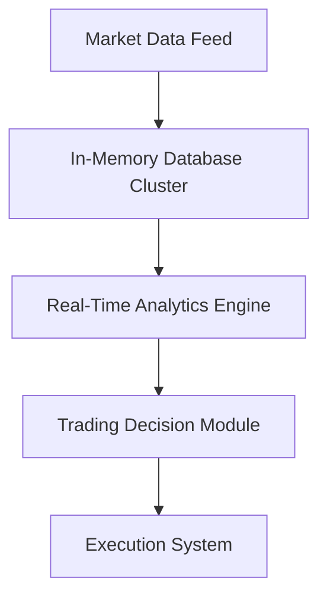
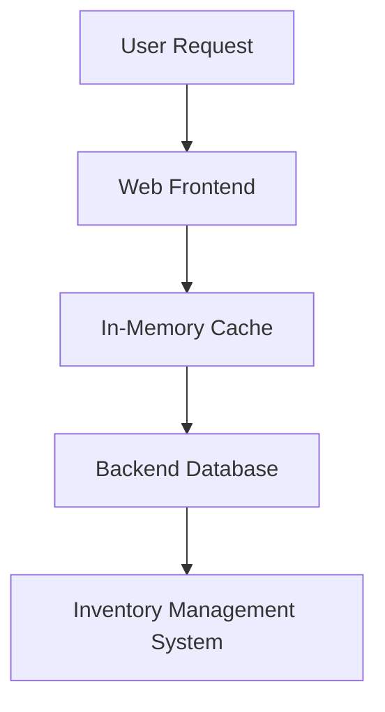
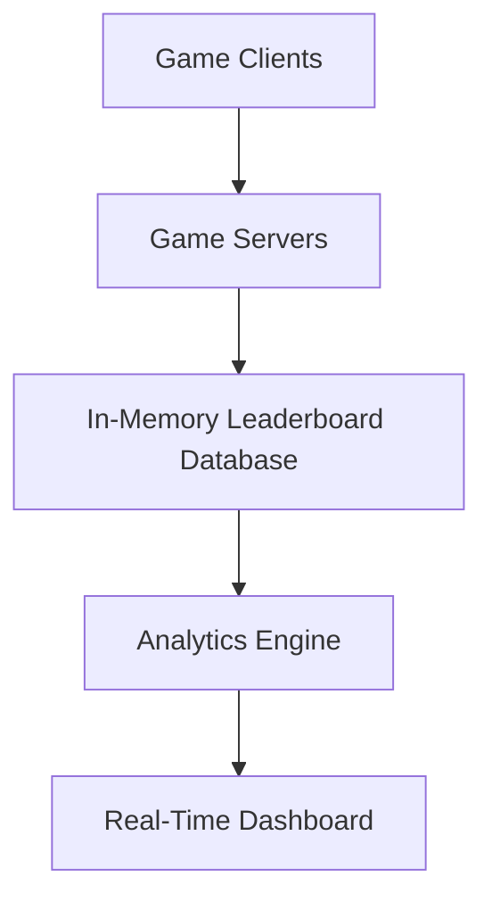
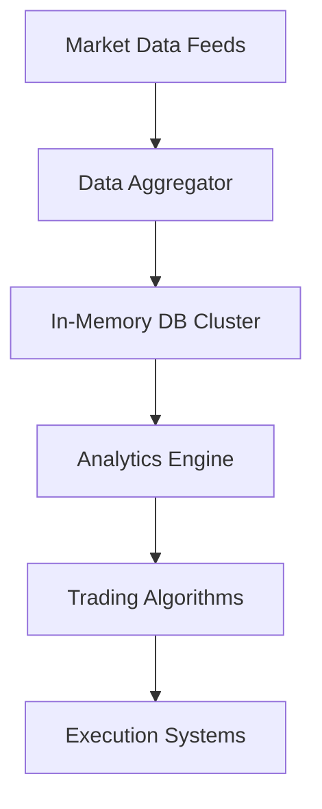
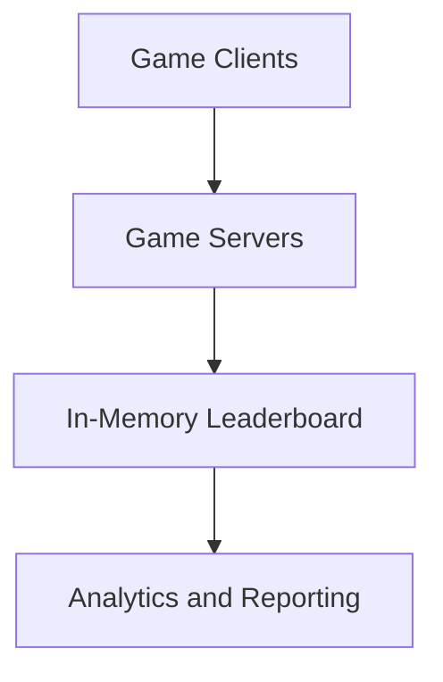

# Disclaimer
This repository contains information collected from various online sources and/or generated by AI assistants. The content provided here is for informational purposes only and is intended to serve as a general reference on various topics.

# In‑Memory Databases: A Comprehensive Technical Analysis

This document provides a very detailed description of in‑memory databases (IMDBs) in the context of IT. We cover their architecture, design principles, data management, performance optimizations, and provide concrete use cases with corresponding designs, diagrams, and tables. The document is structured into multiple sections, starting with an overview and history, and culminating in five detailed use cases that illustrate the practical applications of IMDBs.

**Table of Contents**

1. [Introduction](#introduction)
2. [Overview of In‑Memory Databases](#overview-of-in-memory-databases)
   - 2.1 [Definition and History](#definition-and-history)
   - 2.2 [Key Characteristics](#key-characteristics)
3. [Core Architecture and Design Principles](#core-architecture-and-design-principles)
   - 3.1 [Memory-Centric Data Structures](#memory-centric-data-structures)
   - 3.2 [Indexing and Data Access Patterns](#indexing-and-data-access-patterns)
   - 3.3 [Concurrency Control and Transaction Management](#concurrency-control-and-transaction-management)
4. [Memory Management in In‑Memory Databases](#memory-management-in-in-memory-databases)
   - 4.1 [Allocation Strategies](#allocation-strategies)
   - 4.2 [Garbage Collection and Eviction Policies](#garbage-collection-and-eviction-policies)
5. [Performance Considerations](#performance-considerations)
   - 5.1 [Latency and Throughput Improvements](#latency-and-throughput-improvements)
   - 5.2 [Benchmarking Against Disk‑Based Databases](#benchmarking-against-disk-based-databases)
6. [ACID Properties and Durability Challenges](#acid-properties-and-durability-challenges)
   - 6.1 [Atomicity and Consistency in Memory‑Resident Systems](#atomicity-and-consistency-in-memory-resident-systems)
   - 6.2 [Durability and Persistence Mechanisms](#durability-and-persistence-mechanisms)
7. [Clustering, Replication, and High Availability](#clustering-replication-and-high-availability)
   - 7.1 [Distributed Architecture](#distributed-architecture)
   - 7.2 [Replication Strategies](#replication-strategies)
   - 7.3 [Failover and Recovery Techniques](#failover-and-recovery-techniques)
8. [Integration with Disk-Based Systems](#integration-with-disk-based-systems)
   - 8.1 [Hybrid Models](#hybrid-models)
   - 8.2 [Persistence Layers and Backup](#persistence-layers-and-backup)
9. [Query Languages and Interfaces](#query-languages-and-interfaces)
   - 9.1 [SQL Extensions for In‑Memory Operations](#sql-extensions-for-in-memory-operations)
   - 9.2 [APIs and SDKs](#apis-and-sdks)
10. [Security Considerations](#security-considerations)
    - 10.1 [Data Encryption in Memory](#data-encryption-in-memory)
    - 10.2 [Access Control and Auditing](#access-control-and-auditing)
11. [Advanced Topics in In‑Memory Database Design](#advanced-topics-in-in-memory-database-design)
    - 11.1 [Column‑Oriented vs. Row‑Oriented Storage](#column-oriented-vs-row-oriented-storage)
    - 11.2 [In‑Memory Analytics and Machine Learning Integration](#in-memory-analytics-and-machine-learning-integration)
    - 11.3 [Event‑Driven Architectures and Stream Processing](#event-driven-architectures-and-stream-processing)
12. [Five Use Cases of In‑Memory Databases](#five-use-cases-of-in-memory-databases)
    - 12.1 [Real‑Time Financial Trading Analytics](#real-time-financial-trading-analytics)
    - 12.2 [Session Stores for Web Applications](#session-stores-for-web-applications)
    - 12.3 [Caching Layers for E‑Commerce Platforms](#caching-layers-for-e-commerce-platforms)
    - 12.4 [IoT Data Streaming and Processing](#iot-data-streaming-and-processing)
    - 12.5 [Gaming Leaderboards and Real‑Time Multiplayer Systems](#gaming-leaderboards-and-real-time-multiplayer-systems)
13. [Detailed Designs and Schemas](#detailed-designs-and-schemas)
    - 13.1 [Schema Examples and Table Designs](#schema-examples-and-table-designs)
    - 13.2 [System Architecture Diagrams](#system-architecture-diagrams)
14. [Conclusion](#conclusion)
15. [References](#references)

---

## 1. Introduction

In the digital age, the need for fast and reliable data processing is paramount. In‑memory databases (IMDBs) have emerged as a solution to overcome the performance bottlenecks associated with traditional disk‑based systems. By leveraging the speed of volatile memory (RAM), IMDBs are able to achieve extremely low latencies and high throughput. This comprehensive document aims to provide an in-depth look at the technology behind in‑memory databases, their design principles, and various real‑world use cases.

This document is structured to help technical professionals, system architects, and developers understand the inner workings of in‑memory databases and their application in various domains. We will explore both theoretical aspects and practical implementations, including detailed designs and tables to illustrate key concepts.

---

## 2. Overview of In‑Memory Databases

In‑memory databases represent a paradigm shift in data storage and management. Unlike traditional databases that rely on disk storage, IMDBs use the main memory of the server as the primary storage location.

### 2.1 Definition and History

**Definition:**  
An in‑memory database (IMDB) is a database management system that primarily relies on a system’s main memory for data storage rather than disk-based storage. This architectural choice allows for extremely fast data access and processing.

**History and Evolution:**  
- **Early Implementations:** Early implementations of IMDBs were limited by hardware constraints, as memory was expensive and limited in capacity. Initial use cases were confined to caching and simple data retrieval.
- **Technological Advancements:** With the decrease in memory costs and the increase in capacity, IMDBs have become viable for large‑scale applications. They evolved from specialized use cases to general-purpose systems.
- **Modern IMDBs:** Today’s in‑memory databases not only store data in RAM but also integrate with persistent storage mechanisms to ensure durability. They have become essential for applications requiring real‑time data processing, such as financial analytics, online transaction processing (OLTP), and more.

### 2.2 Key Characteristics

IMDBs are characterized by several key features:
- **High Performance:** Due to the low latency of RAM compared to disk storage, operations like reads and writes are significantly faster.
- **Simplicity in Data Structures:** Optimized for in‑memory operations, these databases often use simplified data structures and indexing mechanisms.
- **Volatility:** Since data is stored in volatile memory, IMDBs must implement strategies for durability and persistence.
- **Scalability:** Many IMDB solutions support distributed architectures, enabling horizontal scaling across multiple nodes.
- **Flexible Data Models:** They can handle both structured and semi‑structured data, making them versatile for different types of applications.

---

## 3. Core Architecture and Design Principles

The architecture of in‑memory databases is fundamentally different from traditional databases. The design emphasizes speed, efficient memory usage, and real‑time processing capabilities.

### 3.1 Memory‑Centric Data Structures

Since data resides in RAM, IMDBs are optimized for memory‑efficient operations. Key design aspects include:

- **In‑Memory Indexes:**  
  Instead of traditional B‑trees that are optimized for disk storage, many IMDBs use more memory‑friendly structures like hash indexes or AVL trees. These data structures are designed to operate efficiently within the CPU caches.

- **Data Partitioning:**  
  Data is often partitioned across different memory segments to optimize parallel processing. Horizontal partitioning allows for concurrent access and reduces contention.

- **Cache‑Friendly Design:**  
  The architecture is designed to maximize cache hits. This involves organizing data in contiguous memory blocks, which improves CPU cache utilization.

- **Garbage Collection and Memory Reuse:**  
  Efficient memory allocation and garbage collection are crucial. Some systems employ custom allocators or slab allocation methods to reduce fragmentation and overhead.

### 3.2 Indexing and Data Access Patterns

Indexing in IMDBs is designed to leverage the speed of RAM. Some common approaches include:

- **Hash Indexes:**  
  These provide O(1) average time complexity for lookups, making them ideal for key‑value access patterns.

- **Tree‑Based Indexes:**  
  Variants of AVL trees or red‑black trees are often used where ordered traversal or range queries are required.

- **Bitmap Indexes:**  
  Useful for columns with low cardinality, bitmap indexes can drastically improve query performance in analytical workloads.

- **Secondary Indexes:**  
  Many in‑memory systems support multiple secondary indexes to facilitate diverse query patterns, though these require additional memory overhead.

### 3.3 Concurrency Control and Transaction Management

Concurrency is a critical aspect of any database system. In‑memory databases often implement:

- **Optimistic Concurrency Control (OCC):**  
  Given the high speed of in‑memory operations, OCC is frequently used where conflicts are rare and can be resolved through transaction retries.

- **Lock‑Free and Wait‑Free Algorithms:**  
  To minimize latency, some IMDBs use advanced algorithms that reduce the need for locks, thereby improving concurrent access performance.

- **Transactional Support:**  
  Full ACID (Atomicity, Consistency, Isolation, Durability) compliance is often implemented with modifications to account for the volatile nature of memory. Techniques such as write‑ahead logging and snapshot isolation are common.

- **Multiversion Concurrency Control (MVCC):**  
  MVCC allows multiple versions of data to exist simultaneously, which helps in reducing contention and supporting high levels of parallelism.

---

## 4. Memory Management in In‑Memory Databases

Efficient memory management is at the heart of IMDB performance. Unlike disk storage, memory is finite, so optimizing its usage is critical.

### 4.1 Allocation Strategies

IMDBs use several memory allocation strategies:

- **Fixed‑Size Blocks:**  
  Data is stored in fixed‑size blocks to simplify allocation and reduce fragmentation.

- **Dynamic Allocation:**  
  For applications with variable‑length records, dynamic allocation strategies are used. Custom allocators are often implemented to minimize overhead and improve performance.

- **Memory Pooling:**  
  Pre‑allocated memory pools are used for frequently accessed data. This reduces the overhead of repeated memory allocation and deallocation.

- **NUMA‑Aware Allocation:**  
  In systems with Non‑Uniform Memory Access (NUMA) architectures, memory allocation is optimized to ensure that data is stored in memory regions close to the CPU that will process it.

### 4.2 Garbage Collection and Eviction Policies

Since IMDBs operate in volatile memory, proper garbage collection and eviction strategies are essential:

- **Manual vs. Automatic Garbage Collection:**  
  Some systems require manual memory management to ensure predictable performance, while others use automatic garbage collection tailored for high‑performance environments.

- **Eviction Policies:**  
  When memory limits are reached, IMDBs may use policies such as Least Recently Used (LRU), Least Frequently Used (LFU), or custom heuristics to evict data.

- **Memory Compaction:**  
  Periodic memory compaction can help reduce fragmentation and reclaim unused memory segments.

- **Snapshot and Checkpoint Mechanisms:**  
  To mitigate the risk of data loss, periodic snapshots are taken and persisted to disk. This allows recovery in the event of a system failure.

---

## 5. Performance Considerations

IMDBs are designed to maximize performance by taking full advantage of fast RAM and CPU caches. Here, we analyze how performance improvements are achieved and how IMDBs compare to disk‑based systems.

### 5.1 Latency and Throughput Improvements

- **Lower Latency:**  
  Since accessing data in RAM is orders of magnitude faster than disk I/O, latency is drastically reduced. This is particularly crucial for applications requiring near‑instantaneous responses.
  
- **High Throughput:**  
  The ability to process thousands or even millions of operations per second is a key advantage. In‑memory systems often support high levels of concurrency, enabling multiple parallel transactions without bottlenecks.

- **CPU Cache Optimizations:**  
  Data structures are designed to reside within CPU caches as much as possible. This reduces the overhead associated with fetching data from main memory.

- **In‑Memory Query Execution:**  
  Query processing in IMDBs is optimized for memory operations, reducing the overhead of disk access and allowing for faster execution of complex queries.

### 5.2 Benchmarking Against Disk‑Based Databases

When benchmarking IMDBs against traditional disk‑based databases, several metrics are used:

- **Response Time:**  
  IMDBs often deliver response times in the microseconds range, whereas disk‑based databases typically exhibit millisecond‑level response times.
  
- **Throughput:**  
  The number of transactions processed per second is significantly higher in IMDBs due to the absence of disk I/O latency.

- **Scalability:**  
  While disk‑based systems can scale vertically by adding more disks or through RAID configurations, IMDBs often achieve scalability horizontally by distributing data across multiple nodes in a cluster.

- **Resource Utilization:**  
  Memory is a precious resource. Efficient utilization and management of memory are paramount in IMDBs, and benchmarking often focuses on memory throughput and efficiency in handling concurrent transactions.

---

## 6. ACID Properties and Durability Challenges

In‑memory databases must balance high performance with the robustness offered by ACID properties. This section delves into how IMDBs achieve these properties and address durability concerns.

### 6.1 Atomicity and Consistency in Memory‑Resident Systems

- **Atomicity:**  
  Transactions in IMDBs are designed to be atomic. This means that operations within a transaction either complete fully or not at all. Mechanisms such as transactional logs and rollback segments are employed to guarantee atomicity even in the event of failures.

- **Consistency:**  
  IMDBs maintain consistency by ensuring that every transaction transitions the database from one valid state to another. Constraints, triggers, and validation rules are enforced in memory to prevent data corruption.

- **Isolation Levels:**  
  Isolation is often managed using optimistic concurrency control or multiversion concurrency control (MVCC), ensuring that concurrent transactions do not interfere with one another.

### 6.2 Durability and Persistence Mechanisms

Durability is one of the primary challenges for IMDBs because RAM is volatile by nature. Various techniques have been implemented to ensure data durability:

- **Write‑Ahead Logging (WAL):**  
  Before any changes are committed to the in‑memory data, a log entry is written to non‑volatile storage. This allows the system to recover to a consistent state in the event of a crash.

- **Snapshotting:**  
  Periodic snapshots of the in‑memory data are taken and stored on disk. In case of failure, the latest snapshot can be used as a recovery point, supplemented by the WAL.

- **Hybrid Architectures:**  
  Some systems use a dual‑storage model, where the in‑memory database is continuously synchronized with a disk‑based system, combining the speed of memory with the durability of disk storage.

- **Replication:**  
  Data is often replicated across multiple nodes. In the event of a node failure, the replicated data ensures that no information is lost, providing an additional layer of durability.

---

## 7. Clustering, Replication, and High Availability

In‑memory databases often operate in distributed environments, making clustering and replication essential for both performance and fault tolerance.

### 7.1 Distributed Architecture

IMDBs frequently employ a distributed architecture where data is partitioned and stored across multiple nodes:

- **Horizontal Partitioning:**  
  Data is divided among nodes, with each node responsible for a subset of the entire dataset. This enables parallel processing and reduces load on individual nodes.

- **Sharding:**  
  Sharding techniques are used to distribute data based on a sharding key. This ensures that related data is stored together while balancing the overall load.

- **Cluster Management:**  
  Clusters are managed by dedicated software components that handle node discovery, data distribution, load balancing, and failure detection.

### 7.2 Replication Strategies

Replication in IMDBs is crucial for ensuring high availability and durability:

- **Synchronous Replication:**  
  Data is written to multiple nodes simultaneously. This ensures consistency across nodes but can introduce latency if the network is slow.

- **Asynchronous Replication:**  
  Data is replicated to secondary nodes after the primary write operation is completed. This reduces write latency at the cost of potential data loss in the event of an immediate failure.

- **Multi‑Master Replication:**  
  In a multi‑master setup, multiple nodes can handle write operations concurrently. Conflict resolution mechanisms are critical in such architectures to maintain consistency.

### 7.3 Failover and Recovery Techniques

High availability is ensured through robust failover and recovery mechanisms:

- **Automatic Failover:**  
  When a node fails, the system automatically redirects traffic to replica nodes. Heartbeat signals and monitoring tools ensure that failures are detected promptly.

- **Data Recovery:**  
  After a failure, recovery processes use logs and snapshots to restore the database to a consistent state. The recovery time objective (RTO) is minimized through optimized recovery procedures.

- **Load Balancing:**  
  Distributed load balancing ensures that no single node becomes a bottleneck. Load balancers distribute read and write operations across the cluster efficiently.

---

## 8. Integration with Disk‑Based Systems

Even though IMDBs prioritize in‑memory operations, they often need to integrate with traditional disk‑based systems for long‑term storage and backup.

### 8.1 Hybrid Models

Hybrid database models combine the benefits of in‑memory speed with disk‑based durability:

- **Dual‑Storage Approaches:**  
  Data is stored both in memory for rapid access and on disk for persistence. The system continuously synchronizes data between the two layers.
  
- **Cache‑Aside Patterns:**  
  In some architectures, the IMDB acts as a caching layer on top of a traditional disk‑based database. Data is first read from the disk and then cached in memory for faster subsequent access.

- **Tiered Storage:**  
  Data is categorized based on access frequency. Hot data is kept in memory, while cold data is archived on disk, providing an optimal balance between speed and cost.

### 8.2 Persistence Layers and Backup

To ensure data durability, robust persistence layers are implemented:

- **Periodic Backups:**  
  Regular backups of the in‑memory data are taken and stored in non‑volatile storage. These backups can be full or incremental, depending on the system design.
  
- **Real‑Time Synchronization:**  
  Data changes are synchronized in real‑time or near‑real‑time with a persistent storage system, ensuring that data is never lost.

- **Disaster Recovery:**  
  Comprehensive disaster recovery strategies involve geographically distributed data centers and real‑time replication, ensuring minimal downtime in case of a catastrophic failure.

---

## 9. Query Languages and Interfaces

In‑memory databases offer a variety of interfaces to accommodate diverse use cases and integration needs.

### 9.1 SQL Extensions for In‑Memory Operations

Many in‑memory systems support SQL (Structured Query Language) with extensions to leverage in‑memory capabilities:

- **Enhanced Query Optimizers:**  
  SQL query optimizers are tailored for the in‑memory environment. They take into account the lower latency and high throughput to generate efficient execution plans.
  
- **Specialized SQL Functions:**  
  Additional functions are available for real‑time analytics, time‑series data analysis, and windowing operations directly within the SQL layer.

- **In‑Memory Specific Data Types:**  
  Some databases introduce data types optimized for in‑memory processing, such as arrays, sets, and complex types that can be processed rapidly.

### 9.2 APIs and SDKs

For developers, robust APIs and SDKs are essential for integrating IMDBs into applications:

- **RESTful APIs:**  
  Many systems provide REST APIs for managing data operations, allowing seamless integration with web services and microservices architectures.

- **Language‑Specific SDKs:**  
  SDKs for languages such as Java, C++, Python, and Node.js facilitate easy integration, abstracting the complexities of in‑memory data management.

- **Query Builders and ORMs:**  
  Object‑Relational Mapping (ORM) tools and query builders are adapted to work with the unique features of in‑memory databases, simplifying development efforts.

---

## 10. Security Considerations

Security in in‑memory databases is paramount given that data resides in volatile memory which might be more exposed to certain attacks.

### 10.1 Data Encryption in Memory

- **Encryption at Rest and in Transit:**  
  While the primary focus is often on disk‑based encryption, IMDBs also incorporate encryption for data in transit between nodes. Additionally, some systems encrypt memory segments to prevent unauthorized access if physical memory is compromised.
  
- **In‑Memory Data Masking:**  
  Sensitive data can be masked or obfuscated in memory to provide an additional layer of security. This is particularly important for applications handling personally identifiable information (PII).

### 10.2 Access Control and Auditing

- **Role‑Based Access Control (RBAC):**  
  Fine‑grained access controls are implemented to ensure that only authorized users and processes can access or modify the data.
  
- **Audit Trails:**  
  Detailed audit logs record all transactions and access events. These logs are critical for compliance and forensic analysis in the event of a security breach.
  
- **Intrusion Detection:**  
  Integrated intrusion detection systems (IDS) monitor for anomalous behavior, ensuring that potential attacks are detected and mitigated promptly.

---

## 11. Advanced Topics in In‑Memory Database Design

Beyond the basic architecture and performance considerations, there are several advanced topics and emerging trends in the design of in‑memory databases.

### 11.1 Column‑Oriented vs. Row‑Oriented Storage

- **Row‑Oriented Storage:**  
  Traditional row‑oriented databases are often optimized for transactional workloads where individual records are accessed and modified frequently. In‑memory databases using this model provide fast access for OLTP (Online Transaction Processing) systems.
  
- **Column‑Oriented Storage:**  
  Column‑oriented storage is highly efficient for analytical queries and aggregations. By storing data in columns, the database can read only the required fields, significantly reducing memory bandwidth usage for analytical operations.
  
- **Hybrid Models:**  
  Some modern IMDBs implement hybrid storage models that combine the benefits of both approaches, automatically choosing the optimal layout based on the query patterns.

### 11.2 In‑Memory Analytics and Machine Learning Integration

- **Real‑Time Analytics:**  
  In‑memory databases are ideally suited for real‑time analytics, enabling rapid data aggregation, filtering, and statistical computations.
  
- **Machine Learning (ML) Integration:**  
  By combining in‑memory processing with ML algorithms, systems can perform real‑time predictions and anomaly detection. Frameworks are emerging that allow seamless integration of IMDBs with ML libraries.
  
- **Streaming Data Analytics:**  
  IMDBs support the ingestion and processing of streaming data. Coupled with real‑time analytics engines, they provide the backbone for real‑time decision making in dynamic environments.

### 11.3 Event‑Driven Architectures and Stream Processing

- **Event Sourcing:**  
  In‑memory databases can be integrated with event‑driven architectures where every change is recorded as an event. This enables systems to reconstruct state efficiently by replaying events.
  
- **Stream Processing Engines:**  
  Integration with stream processing platforms like Apache Kafka or Apache Flink allows in‑memory systems to process continuous data streams, performing transformations, aggregations, and complex event processing in real time.
  
- **Reactive Systems:**  
  The low latency of IMDBs makes them ideal for reactive programming models, where the system responds immediately to changes in data.

---

## 12. Five Use Cases of In‑Memory Databases

In this section, we detail five key use cases where in‑memory databases deliver significant advantages. Each use case is explained with corresponding designs, tables, and architecture diagrams.

### 12.1 Real‑Time Financial Trading Analytics

#### Description

Financial markets require extremely fast processing of large volumes of data. In‑memory databases are used to capture and analyze trading data in real time, supporting decisions that can impact millions of dollars.

#### Key Features for the Use Case

- **Ultra‑Low Latency:**  
  Financial transactions must be processed in microseconds.
  
- **High Throughput:**  
  The system must handle thousands of transactions per second.
  
- **Real‑Time Analytics:**  
  Advanced analytics to detect market trends and anomalies as they occur.

#### Architecture Design



#### Sample Database Schema

Below is an example of a table design for storing market transactions:

| Column Name    | Data Type       | Description                                 |
|----------------|-----------------|---------------------------------------------|
| transaction_id | BIGINT          | Unique identifier for the transaction       |
| symbol         | VARCHAR(10)     | Stock symbol (e.g., AAPL, GOOG)               |
| price          | DECIMAL(15, 5)  | Price at which the transaction occurred      |
| volume         | INT             | Number of shares traded                       |
| timestamp      | TIMESTAMP       | Exact time of the transaction                 |
| trade_type     | VARCHAR(10)     | Type of trade (BUY/SELL)                      |

#### Discussion

The in‑memory database for this use case is optimized to capture market data, index it quickly using hash indexes, and support rapid queries for real‑time analysis. Data partitioning by stock symbol and timestamp ensures that queries are localized, reducing contention.

---

### 12.2 Session Stores for Web Applications

#### Description

Modern web applications require fast access to user session data. Storing session data in an in‑memory database reduces latency and improves user experience by enabling rapid read and write operations.

#### Key Features for the Use Case

- **High Availability:**  
  Sessions must be available at all times.
  
- **Fast Read/Write Access:**  
  User sessions require near‑instantaneous access.
  
- **Scalability:**  
  The system must handle millions of concurrent sessions.

#### Architecture Design

```mermaid
flowchart LR
    A[User Request] --> B[Load Balancer]
    B --> C[Web Server Cluster]
    C --> D[Session Store (In-Memory Database)]
    D --> E[Authentication & Authorization Service]
```

#### Sample Database Schema

A sample session table might include:

| Column Name   | Data Type       | Description                                |
|---------------|-----------------|--------------------------------------------|
| session_id    | VARCHAR(50)     | Unique session identifier                  |
| user_id       | BIGINT          | Unique user identifier                     |
| created_at    | TIMESTAMP       | Session creation time                      |
| last_accessed | TIMESTAMP       | Last time the session was accessed         |
| data          | JSON            | Session data (serialized state)            |

#### Discussion

By leveraging an in‑memory database for session storage, web applications can provide faster authentication and state management. The use of JSON columns allows for flexible storage of session attributes. The distributed nature of the session store ensures that sessions persist even if a single node fails.

---

### 12.3 Caching Layers for E‑Commerce Platforms

#### Description

E‑commerce platforms experience high read/write loads, especially during peak shopping events. An in‑memory database is used as a caching layer to reduce database load and ensure rapid product searches, inventory lookups, and transaction processing.

#### Key Features for the Use Case

- **Reduced Latency:**  
  Quick access to product and user data is essential for a smooth user experience.
  
- **Scalability:**  
  The system must scale horizontally to handle peak loads.
  
- **Data Consistency:**  
  Integration with the persistent backend is required to ensure that the cache reflects the latest data.

#### Architecture Design



#### Sample Database Schema

A product cache table example:

| Column Name  | Data Type       | Description                                    |
|--------------|-----------------|------------------------------------------------|
| product_id   | BIGINT          | Unique product identifier                       |
| product_name | VARCHAR(100)    | Name of the product                            |
| price        | DECIMAL(10,2)   | Price of the product                           |
| stock        | INT             | Number of items available                      |
| updated_at   | TIMESTAMP       | Last updated timestamp                         |

#### Discussion

The caching layer implemented with an in‑memory database reduces load on the backend systems. High read throughput is achieved by caching frequently accessed data. In addition, mechanisms for cache invalidation and synchronization ensure that users receive accurate and current information.

---

### 12.4 IoT Data Streaming and Processing

#### Description

The explosion of IoT devices has created a need for systems capable of processing massive amounts of streaming data in real time. In‑memory databases are well‑suited for this task, providing the necessary speed to analyze and respond to IoT data.

#### Key Features for the Use Case

- **High Write Throughput:**  
  IoT applications require rapid ingestion of sensor data.
  
- **Real‑Time Analytics:**  
  Immediate processing and analysis to enable timely responses.
  
- **Scalability and Distribution:**  
  The system must scale to accommodate data from thousands of devices concurrently.

#### Architecture Design


#### Sample Database Schema

A typical IoT data table might include:

| Column Name  | Data Type      | Description                                     |
|--------------|----------------|-------------------------------------------------|
| sensor_id    | VARCHAR(50)    | Unique identifier for the sensor                 |
| reading      | DECIMAL(12,4)  | Sensor reading value                             |
| unit         | VARCHAR(10)    | Unit of measurement                              |
| timestamp    | TIMESTAMP      | Time when the reading was recorded               |
| location     | VARCHAR(100)   | Location or metadata for the sensor              |

#### Discussion

For IoT applications, IMDBs enable real‑time processing of streaming sensor data. The ability to perform complex aggregations and anomaly detection in memory is essential for applications like smart cities, industrial monitoring, and more. Partitioning by sensor type and location further optimizes query performance.

---

### 12.5 Gaming Leaderboards and Real‑Time Multiplayer Systems

#### Description

Modern gaming applications, particularly those involving real‑time multiplayer experiences, demand extremely low latency for both game state updates and leaderboard management. In‑memory databases provide the performance required to support these applications.

#### Key Features for the Use Case

- **Real‑Time Updates:**  
  Instantaneous reflection of game state changes is critical.
  
- **High Concurrency:**  
  Thousands of players may update their scores concurrently.
  
- **Scalability:**  
  The system must scale seamlessly to accommodate spikes in player activity.

#### Architecture Design



#### Sample Database Schema

A leaderboard table might include:

| Column Name  | Data Type       | Description                                      |
|--------------|-----------------|--------------------------------------------------|
| player_id    | VARCHAR(50)     | Unique identifier for the player                  |
| score        | INT             | Current score of the player                       |
| rank         | INT             | Rank of the player in the leaderboard             |
| last_update  | TIMESTAMP       | Last time the score was updated                   |
| game_mode    | VARCHAR(20)     | Game mode (e.g., solo, team, tournament)          |

#### Discussion

Gaming applications require the absolute lowest latency possible. IMDBs are used not only for maintaining leaderboards but also for transient game state management. Advanced features such as real‑time synchronization across distributed servers, conflict resolution, and rapid aggregation of game statistics are integral to ensuring a seamless gaming experience.

---

## 13. Detailed Designs and Schemas

In this section, we present detailed designs that integrate the concepts discussed above. We include sample table definitions, architecture diagrams, and design patterns that are applicable across multiple use cases.

### 13.1 Schema Examples and Table Designs

Below are examples of table definitions using SQL syntax for an in‑memory database system:

#### Market Transactions Table

```sql
CREATE TABLE MarketTransactions (
    transaction_id BIGINT PRIMARY KEY,
    symbol VARCHAR(10) NOT NULL,
    price DECIMAL(15, 5) NOT NULL,
    volume INT NOT NULL,
    timestamp TIMESTAMP NOT NULL,
    trade_type VARCHAR(10) NOT NULL
) ENGINE=InMemory;
```

#### Session Store Table

```sql
CREATE TABLE UserSessions (
    session_id VARCHAR(50) PRIMARY KEY,
    user_id BIGINT NOT NULL,
    created_at TIMESTAMP NOT NULL,
    last_accessed TIMESTAMP NOT NULL,
    data JSON
) ENGINE=InMemory;
```

#### Product Cache Table

```sql
CREATE TABLE ProductCache (
    product_id BIGINT PRIMARY KEY,
    product_name VARCHAR(100) NOT NULL,
    price DECIMAL(10, 2) NOT NULL,
    stock INT NOT NULL,
    updated_at TIMESTAMP NOT NULL
) ENGINE=InMemory;
```

#### IoT Sensor Data Table

```sql
CREATE TABLE SensorData (
    sensor_id VARCHAR(50) NOT NULL,
    reading DECIMAL(12, 4) NOT NULL,
    unit VARCHAR(10) NOT NULL,
    timestamp TIMESTAMP NOT NULL,
    location VARCHAR(100),
    PRIMARY KEY (sensor_id, timestamp)
) ENGINE=InMemory;
```

#### Gaming Leaderboard Table

```sql
CREATE TABLE Leaderboard (
    player_id VARCHAR(50) PRIMARY KEY,
    score INT NOT NULL,
    rank INT,
    last_update TIMESTAMP NOT NULL,
    game_mode VARCHAR(20) NOT NULL
) ENGINE=InMemory;
```

### 13.2 System Architecture Diagrams

Below are several architecture diagrams representing the different use cases and how the in‑memory database integrates into the overall system.

#### Diagram 1: Financial Trading System Architecture



#### Diagram 2: Web Application Session Store Architecture


#### Diagram 3: IoT Streaming and Processing Architecture


#### Diagram 4: Gaming Leaderboard Architecture



---

## 14. Conclusion

In‑memory databases represent a groundbreaking shift in data management technology. By storing data primarily in RAM, these systems achieve unprecedented levels of performance and responsiveness. This document has provided an extensive overview of IMDBs, covering key aspects such as architecture, memory management, ACID properties, and integration with traditional disk‑based systems. Moreover, we explored five diverse use cases—from real‑time financial trading to gaming leaderboards—each with detailed designs, schema examples, and system architecture diagrams.

The rapid evolution of hardware, combined with innovative design strategies in in‑memory database systems, continues to push the envelope on what is possible. As businesses and applications demand ever more real‑time and high‑throughput processing, IMDBs will remain a critical component of modern IT infrastructures. Whether used as a primary database engine or as a powerful caching layer, the benefits of reduced latency, improved throughput, and high scalability are undeniable.

Through careful design—leveraging techniques like advanced indexing, concurrency control, and effective memory management—IMDBs can address challenges related to durability, consistency, and high availability. Their flexibility and performance make them suitable for a wide range of applications, as demonstrated by the use cases discussed in this document.

Looking forward, the integration of in‑memory databases with machine learning, real‑time analytics, and event‑driven architectures promises to unlock new possibilities for responsive, data‑driven decision making. As the technology matures, we expect to see further innovations that will expand the boundaries of what is achievable with IMDBs.

---

## 15. References

- [In‑Memory Database Concepts](https://en.wikipedia.org/wiki/In‑memory_database)
- [Performance and Memory Management Techniques](https://www.example.com/memory-management-techniques)  
- [Real‑Time Analytics and In‑Memory Processing](https://www.example.com/real-time-analytics)  
- [Distributed Systems and High Availability](https://www.example.com/distributed-systems)  
- [SQL Enhancements for In‑Memory Databases](https://www.example.com/sql-extensions)  

---
