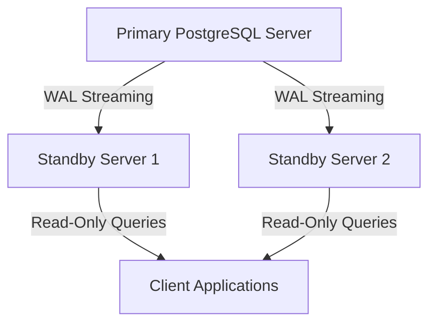
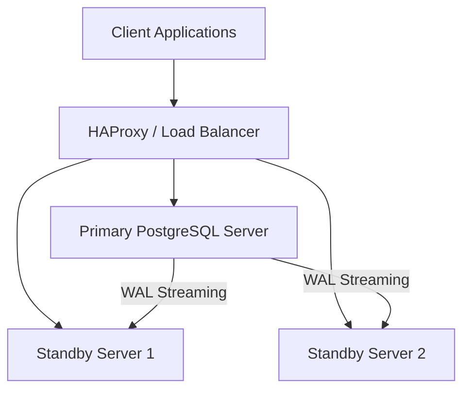

# Disclaimer
This repository contains information collected from various online sources and/or generated by AI assistants. The content provided here is for informational purposes only and is intended to serve as a general reference on various topics.

# PostgreSQL Administration: A Comprehensive Guide

**Table of Contents**  
1. [Introduction](#introduction)  
2. [Understanding PostgreSQL: Architecture & Core Concepts](#understanding-postgresql-architecture--core-concepts)  
3. [Installation and Initial Configuration](#installation-and-initial-configuration)  
4. [Best Practices for PostgreSQL Administration](#best-practices-for-postgresql-administration)  
   - [Security Best Practices](#security-best-practices)  
   - [Maintenance and Routine Tasks](#maintenance-and-routine-tasks)  
   - [Monitoring and Alerting](#monitoring-and-alerting)  
5. [High Availability in PostgreSQL](#5-high-availability-in-postgresql)  
   - [Replication Strategies](#replication-strategies)  
   - [Failover and Switchover](#failover-and-switchover)  
   - [Clustering and Load Balancing](#clustering-and-load-balancing)  
6. [Performance Tuning and Optimization](#performance-tuning-and-optimization)  
   - [Query and Index Optimization](#query-and-index-optimization)  
   - [Memory, CPU, and Disk I/O Tuning](#memory-cpu-and-disk-io-tuning)  
   - [Configuration Parameters Explained](#configuration-parameters-explained)  
7. [Backup and Recovery Strategies](#backup-and-recovery-strategies)  
   - [Logical vs. Physical Backups](#logical-vs-physical-backups)  
   - [Point-in-Time Recovery (PITR)](#point-in-time-recovery-pitr)  
   - [Automating Backup Processes](#automating-backup-processes)  
8. [Logging, Auditing, and Troubleshooting](#logging,-auditing,-and,-troubleshooting)  
   - [Configuring PostgreSQL Logs](#configuring-postgresql-logs)  
   - [Log Analysis Tools and Techniques](#log-analysis-tools-and-techniques)  
9. [Hardware-Based System Configuration Tuning](#hardware-based-system-configuration-tuning)  
   - [Configurations for CPU-bound Systems](#configurations-for-cpu-bound-systems)  
   - [Configurations for Memory-bound Systems](#configurations-for-memory-bound-systems)  
   - [Configurations for I/O-bound Systems](#configurations-for-io-bound-systems)  
   - [Hybrid and Mixed Workloads](#hybrid-and-mixed-workloads)  
   - [Comparison Table of Hardware-Based Configurations](#comparison-table-of-hardware-based-configurations)  
10. [Design Diagrams and Case Studies](#1design-diagrams-and-case-studies)  
    - [System Architecture Diagrams](#system-architecture-diagrams)  
    - [Real-World Case Studies](#realworld-case-studies)  
11. [Conclusion](#conclusion)  
12. [References and Further Reading](#references-and-further-reading)  

---

## Introduction

PostgreSQL is one of the most advanced, open-source relational database management systems available today. Renowned for its robustness, extensibility, and SQL compliance, PostgreSQL has become a favourite among organizations ranging from startups to enterprises. This guide is aimed at database administrators (DBAs), systems engineers, and developers who seek a thorough understanding of PostgreSQL administration. Whether you are responsible for a single instance or a complex cluster with high availability requirements, this document covers every detail—from installation to tuning, backups, and high availability—ensuring your PostgreSQL deployment is secure, fast, and resilient.

The content is broken down into multiple sections that detail every aspect of PostgreSQL administration. We begin with an exploration of PostgreSQL’s architecture and core concepts, move into best practices for routine administration, then delve into strategies for high availability, performance tuning, and backup & recovery. Additionally, we discuss how system configurations should be adapted based on the underlying hardware, offering guidance for CPU-, memory-, and I/O-bound systems along with practical tables and design diagrams.

This guide is updated with the latest best practices and configuration recommendations as of 2025, combining both established knowledge and modern innovations. It is structured in a manner that is both pedagogical and practical, providing you with actionable insights and detailed instructions.

---

## Understanding PostgreSQL: Architecture & Core Concepts

A deep understanding of PostgreSQL’s internal architecture is fundamental to effective database administration. This section examines the key components that make up PostgreSQL, including its process model, storage system, and transaction management.  

### 1. PostgreSQL Process Model

PostgreSQL uses a process-per-connection model which differs from the thread-based models used by some other RDBMS systems. Each connection spawns a new process, which has several benefits including process isolation and robustness. The key processes include:

- **Postmaster/Main Process:** This is the central daemon that listens for connections and forks new processes as required.
- **Backend Processes:** Each client connection is handled by an individual backend process.
- **Background Writer:** Periodically writes dirty buffers from shared memory to disk, ensuring that the write workload is balanced.
- **Checkpointer:** Responsible for writing all dirty shared buffers to disk and ensuring the consistency of the database after a crash.
- **WAL Writer:** Manages the Write-Ahead Logging (WAL) system, ensuring that changes are recorded in a reliable manner before being applied to the data files.
- **Autovacuum Launcher:** Periodically invokes autovacuum workers to clean up dead tuples and maintain database performance.

These processes work together to ensure that PostgreSQL can handle a large number of concurrent connections and maintain data consistency even under heavy load.

### 2. Storage and File Organization

PostgreSQL stores data on disk in a series of files that represent databases, tables, indexes, and transaction logs. The key elements include:

- **Data Files:** Located in the data directory, these files are managed by PostgreSQL’s internal storage engine.
- **Write-Ahead Logging (WAL):** A critical component for ensuring durability. WAL ensures that all changes are first written to a log file, which can be replayed during recovery.
- **Tablespaces:** Allow DBAs to define locations in the filesystem where PostgreSQL can store data files. This is especially useful for performance tuning and data management.

### 3. Transaction Management and MVCC

PostgreSQL implements Multiversion Concurrency Control (MVCC) to handle transactions efficiently. MVCC allows multiple versions of data to exist concurrently, which provides the following benefits:

- **Concurrency without Read Locks:** Readers do not block writers, ensuring smooth concurrent operations.
- **Consistency:** Each transaction sees a snapshot of the data as of the beginning of the transaction, which guarantees consistency.
- **Rollback Capability:** If a transaction fails, PostgreSQL can easily roll back the changes by discarding the new version.

### 4. Extensions and Customization

One of PostgreSQL’s most compelling features is its extensibility. Administrators can add new data types, functions, and operators by writing custom extensions. Popular extensions include:
  
- **PostGIS:** Provides spatial database capabilities.
- **pg_stat_statements:** A module that tracks execution statistics of all SQL statements executed by a server.
- **pg_partman:** An extension that helps manage table partitioning automatically.

Extensions can be installed and managed using SQL commands, making it simple to enhance PostgreSQL functionality.

---

## Installation and Initial Configuration

Before diving into the deeper aspects of PostgreSQL administration, it is crucial to ensure that your PostgreSQL instance is properly installed and configured. This section provides a step-by-step guide for installing PostgreSQL on various operating systems and outlines the initial configuration steps.

### 1. Installation Options

PostgreSQL can be installed via several methods:

- **Package Managers:**  
  - **Debian/Ubuntu:** Use APT repositories.  
    ```bash
    sudo apt-get update
    sudo apt-get install postgresql postgresql-contrib
    ```
  - **RHEL/CentOS/Fedora:** Use YUM or DNF.
    ```bash
    sudo dnf install postgresql-server postgresql-contrib
    ```
- **Source Code:**  
  For the most customisable installation, you may compile PostgreSQL from source.
  ```bash
  wget https://ftp.postgresql.org/pub/source/v14.5/postgresql-14.5.tar.gz
  tar -xzf postgresql-14.5.tar.gz
  cd postgresql-14.5
  ./configure
  make
  sudo make install
  ```
- **Containers:**  
  PostgreSQL is available as an official Docker image.
  ```bash
  docker pull postgres:14
  docker run --name my-postgres -e POSTGRES_PASSWORD=mysecretpassword -d postgres:14
  ```

### 2. Initial Configuration

After installation, initial configuration is key to setting up a stable and secure database environment.

#### 2.1 Configuring `postgresql.conf`

The `postgresql.conf` file is the main configuration file for PostgreSQL. Important parameters to consider:

- **`max_connections`:** Determines the maximum number of concurrent connections.
- **`shared_buffers`:** Memory allocated for caching data.
- **`work_mem`:** Memory used for internal sort operations and hash tables.
- **`maintenance_work_mem`:** Memory used for maintenance operations like `VACUUM`.
- **`wal_level`:** Determines the amount of information written to the WAL (e.g., minimal, replica, or logical).
- **`archive_mode` and `archive_command`:** Essential for enabling WAL archiving and ensuring point-in-time recovery (PITR).

#### 2.2 Configuring `pg_hba.conf`

The `pg_hba.conf` file controls client authentication. It is crucial to restrict access based on host, user, and database:
  
```conf
# TYPE  DATABASE        USER            ADDRESS                 METHOD
host    all             all             127.0.0.1/32            md5
host    all             all             ::1/128                 md5
```

#### 2.3 Enabling Extensions

After installation, you may want to enable useful extensions. For example, to install `pg_stat_statements`:

```sql
CREATE EXTENSION IF NOT EXISTS pg_stat_statements;
```

#### 2.4 Tuning the Operating System

Beyond PostgreSQL settings, ensure that your operating system is optimized. For Linux, consider:
  
- **I/O Scheduler:** Set to “deadline” or “noop” for SSDs.
- **Kernel Parameters:** Tune `vm.swappiness` and file descriptor limits.
- **NUMA Settings:** If you’re using a NUMA system, configure PostgreSQL to be NUMA-aware.

---

## Best Practices for PostgreSQL Administration

Efficient administration of PostgreSQL requires adherence to several best practices, which ensure that the system remains secure, stable, and performs optimally. In this section, we detail the best practices in various operational aspects.

### Security Best Practices

Securing your PostgreSQL instance is paramount. The following best practices are recommended:

#### 1. Authentication and Authorization

- **Use Strong Passwords:** Ensure that all PostgreSQL user accounts have strong, unique passwords.
- **Role-Based Access Control (RBAC):** Use roles to manage permissions effectively. Grant only the minimum necessary privileges to each role.
- **SSL/TLS Encryption:** Encrypt client connections to protect data in transit.
- **pg_hba.conf Configuration:** Limit access to trusted IP addresses only.  
- **Regular Auditing:** Periodically review user privileges and access logs.

#### 2. Data Encryption

- **At-Rest Encryption:** Use file system-level encryption (e.g., LUKS) to protect data files.
- **Column-Level Encryption:** For sensitive data, consider application-level or PostgreSQL-level encryption.
- **Backup Encryption:** Ensure that backups are encrypted both in transit and at rest.

#### 3. Regular Patching and Updates

- **Keep PostgreSQL Up-to-Date:** Regularly update PostgreSQL to patch known vulnerabilities.
- **Operating System Patches:** Ensure the underlying OS is also regularly patched.

#### 4. Secure Configuration Files

- **File Permissions:** Limit access to configuration files (`postgresql.conf`, `pg_hba.conf`) so that only the PostgreSQL user or root can read or modify them.
- **Version Control:** Consider storing configuration files in a version control system to track changes and maintain history.

### Maintenance and Routine Tasks

Routine maintenance is essential to avoid performance degradation and ensure data integrity.

#### 1. Regular Vacuuming and Analyzing

- **VACUUM:** Periodically run `VACUUM` to reclaim storage occupied by dead tuples. Use `VACUUM FULL` sparingly.
- **ANALYZE:** Run `ANALYZE` to update statistics for the query planner.
- **Autovacuum:** Ensure that autovacuum is enabled and appropriately tuned based on workload.

#### 2. Index Maintenance

- **Reindexing:** Periodically reindex tables to ensure index efficiency.
- **Monitoring Index Bloat:** Use monitoring tools or queries to detect index bloat and address it as needed.

#### 3. Disk and Filesystem Management

- **Filesystem Choice:** Use filesystems that are known to perform well with PostgreSQL (e.g., ext4, XFS).
- **Disk Partitioning:** Separate WAL files, data files, and backups on different physical disks if possible.
- **Monitoring Disk Usage:** Regularly monitor disk space usage to avoid unexpected outages.

#### 4. Routine Health Checks

- **System Metrics:** Monitor CPU, memory, disk I/O, and network performance.
- **PostgreSQL Statistics:** Use views such as `pg_stat_activity`, `pg_stat_database`, and `pg_stat_replication` to monitor database health.

### Monitoring and Alerting

Effective monitoring and alerting are key to maintaining a healthy PostgreSQL environment.

#### 1. Metrics to Monitor

- **Connection Metrics:** Number of active connections vs. configured `max_connections`.
- **Query Performance:** Slow queries, query execution time, and query plans.
- **Replication Lag:** For high availability, ensure replication delay is minimal.
- **System Resource Utilization:** CPU, memory, and disk I/O usage.
- **WAL Activity:** Monitor WAL generation rates and archive statuses.

#### 2. Tools and Solutions

- **pg_stat_statements:** Provides insight into query performance.
- **Prometheus + Grafana:** Collects and visualizes PostgreSQL metrics.
- **Nagios/Zabbix:** Can be configured to monitor PostgreSQL health and trigger alerts.
- **Custom Scripts:** Tailor-made scripts using SQL or shell can also be used for specialized monitoring.

#### 3. Alerting Strategies

- **Threshold-Based Alerts:** Define thresholds for key metrics (e.g., connection count, replication lag).
- **Anomaly Detection:** Use statistical methods to detect unusual patterns.
- **Notification Systems:** Integrate with email, Slack, or other messaging platforms to receive real-time alerts.

---

## High Availability in PostgreSQL

Ensuring that your PostgreSQL instance remains available even in the face of hardware failures or other disruptions is critical. This section outlines various strategies and best practices for achieving high availability (HA).

### Replication Strategies

Replication is the foundation of high availability. PostgreSQL supports several replication techniques:

#### 1. Streaming Replication

- **Overview:** Streaming replication continuously sends WAL records from the primary to one or more standby servers.
- **Configuration:**  
  - Set `wal_level` to `replica` or `logical` on the primary.
  - Configure `max_wal_senders` to permit multiple concurrent replication connections.
  - Use `primary_conninfo` on the standby to connect to the primary.
- **Benefits:** Provides near real-time data redundancy and can be used for read-scaling.
- **Considerations:**  
  - Monitor replication lag closely.
  - Use synchronous replication if strong consistency is required (at the cost of some performance).

#### 2. Logical Replication

- **Overview:** Logical replication allows selective replication of tables rather than entire databases.
- **Configuration:**  
  - Enable logical decoding on the primary.
  - Create a publication on the primary.
  - Create a subscription on the standby.
- **Benefits:**  
  - Flexibility to replicate a subset of data.
  - Can be used for data migrations and integrations.
- **Considerations:**  
  - Logical replication may have slightly higher overhead.
  - Schema changes require additional management.

#### 3. File-Based Log Shipping

- **Overview:** Involves archiving WAL files to a secondary server.
- **Configuration:**  
  - Set `archive_mode` to `on` and define `archive_command`.
  - Configure the standby server to restore WAL files from the archive.
- **Benefits:**  
  - Suitable for offsite backups and disaster recovery.
- **Considerations:**  
  - Recovery time may be longer compared to streaming replication.
  - Requires robust archival storage management.

### Failover and Switchover

High availability systems must be able to handle failover (automatic promotion of a standby server to primary) and switchover (planned role reversal):

#### 1. Automatic Failover

- **Tools:**  
  - **Patroni:** A popular HA solution that manages PostgreSQL clusters.
  - **repmgr:** A tool for managing and automating failover in PostgreSQL.
- **Mechanism:**  
  - Health monitoring detects a failure.
  - The tool promotes a standby to become the new primary.
  - Reconfiguration of clients to point to the new primary.
- **Considerations:**  
  - Ensure minimal downtime during promotion.
  - Test failover scenarios regularly.

#### 2. Planned Switchover

- **Overview:** A controlled process to switch roles between primary and standby.
- **Benefits:**  
  - Used for maintenance without downtime.
  - Minimizes risk during hardware upgrades or system migrations.
- **Steps:**  
  1. Prepare the standby server.
  2. Synchronize all changes.
  3. Execute the switchover command.
  4. Verify the new primary’s status.

### Clustering and Load Balancing

In environments with heavy read loads or complex multi-datacenter deployments, clustering and load balancing are essential.

#### 1. Clustering

- **Solutions:**  
  - **PostgreSQL Cluster (e.g., Postgres-BDR):** Supports multi-master replication.
  - **Citus:** Scales out PostgreSQL horizontally by distributing data across nodes.
- **Benefits:**  
  - Improved scalability.
  - Fault tolerance through node replication.
- **Considerations:**  
  - Increased complexity.
  - Requires specialized administration and monitoring.

#### 2. Load Balancing

- **Techniques:**  
  - **Pgpool-II:** Acts as a middleware for connection pooling and load balancing.
  - **HAProxy:** A TCP load balancer that can distribute connections across multiple PostgreSQL instances.
- **Benefits:**  
  - Even distribution of query loads.
  - Improved performance for read-heavy applications.
- **Considerations:**  
  - Ensure that session-based queries are routed correctly.
  - Monitor for uneven load distributions.

---

## Performance Tuning and Optimization

Performance tuning in PostgreSQL requires a deep understanding of both the database engine and the underlying hardware. In this section, we break down the techniques and best practices for optimizing PostgreSQL performance.

### Query and Index Optimization

Optimizing queries and indexes is often the first step in improving performance.

#### 1. Query Optimization

- **EXPLAIN and EXPLAIN ANALYZE:**  
  Use these commands to obtain query execution plans. They help identify bottlenecks and inefficiencies.
  ```sql
  EXPLAIN ANALYZE SELECT * FROM orders WHERE customer_id = 123;
  ```
- **Avoiding Sequential Scans:**  
  Ensure that queries leverage indexes by rewriting queries or adding hints when necessary.
- **Subquery Optimization:**  
  Rewrite complex subqueries as joins if that improves performance.
- **Parameterization:**  
  Use parameterized queries to enable query plan caching.

#### 2. Indexing Strategies

- **B-Tree Indexes:**  
  The default and most commonly used index type. Ideal for equality and range queries.
- **Hash Indexes:**  
  Useful for equality comparisons, but with limitations in older PostgreSQL versions.
- **GIN and GiST Indexes:**  
  Use for full-text search, arrays, and geometric data.
- **Partial and Expression Indexes:**  
  Create indexes on subsets of data or computed expressions to optimize specific queries.
- **Monitoring Index Usage:**  
  Regularly review index usage statistics to remove unused or duplicate indexes.

### Memory, CPU, and Disk I/O Tuning

#### 1. Memory Tuning

PostgreSQL’s performance is highly dependent on proper memory configuration.

- **shared_buffers:**  
  A crucial parameter that determines how much memory is allocated for caching data pages.  
  - **Low-Memory Systems:** Set to 15–25% of total RAM.
  - **High-Memory Systems:** Can be increased up to 40% of total RAM, depending on workload.
- **work_mem:**  
  Memory used per sort operation. Too low can cause disk spills; too high can lead to excessive memory usage if many queries run concurrently.
- **maintenance_work_mem:**  
  Larger values can speed up maintenance tasks such as `VACUUM` and `CREATE INDEX`.

#### 2. CPU Tuning

- **Parallel Query Execution:**  
  PostgreSQL supports parallel query execution; adjust `max_parallel_workers_per_gather` based on CPU cores.
- **Effective CPU Scheduling:**  
  Use operating system-level tools to ensure that PostgreSQL processes receive fair CPU time.
- **Cost Parameters:**  
  Tune cost parameters like `cpu_tuple_cost` and `cpu_index_tuple_cost` to better reflect your hardware’s performance characteristics.

#### 3. Disk I/O Tuning

- **wal_buffers and checkpoint_segments:**  
  Adjust these to ensure that disk writes are efficient and do not become a bottleneck.
- **Storage Hardware:**  
  Use SSDs for data directories to reduce latency, especially for write-heavy workloads.
- **File System Recommendations:**  
  Choose high-performance file systems like XFS or ext4. Ensure that the mount options (e.g., noatime) are optimized.

### Configuration Parameters Explained

Below is a summary table of key PostgreSQL configuration parameters with recommended values based on different hardware types:

| Parameter                  | Description                                             | CPU-Bound Recommendation                | Memory-Bound Recommendation                    | I/O-Bound Recommendation                        |
|----------------------------|---------------------------------------------------------|-----------------------------------------|------------------------------------------------|------------------------------------------------|
| `max_connections`          | Maximum concurrent connections                          | Moderate (100–200)                      | Higher (200–500) if memory allows               | Moderate (100–200), avoid overwhelming I/O       |
| `shared_buffers`           | Memory allocated for caching data                      | 25% of RAM                              | 40% of RAM                                      | 25–30% of RAM, with emphasis on I/O caching        |
| `work_mem`                 | Memory for internal operations per connection          | 4–8 MB                                  | 8–16 MB                                         | 4–8 MB to prevent memory overcommitment          |
| `maintenance_work_mem`     | Memory for maintenance operations (VACUUM, etc.)       | 64–128 MB                               | 128–256 MB                                      | 64–128 MB to avoid I/O saturation                |
| `wal_buffers`              | Memory used for WAL buffering                           | 1–2 MB                                  | 2–4 MB                                          | 2–4 MB to ensure efficient WAL writes            |
| `checkpoint_completion_target` | Fraction of checkpoint interval to spread writes    | 0.7–0.9                                 | 0.9                                             | 0.7–0.8 to balance I/O peaks                     |
| `max_wal_senders`          | Number of concurrent WAL sender processes              | 5–10                                    | 10–20                                           | 5–10, depending on replication needs             |

*Note: These values are starting points. Actual values should be adjusted based on workload characteristics and benchmarking.*

---

## Backup and Recovery Strategies

Data backup and recovery are critical to ensuring business continuity. PostgreSQL offers a variety of backup techniques, each with its own advantages and trade-offs.

### 1. Logical Backups

Logical backups use tools such as `pg_dump` and `pg_dumpall` to export database objects into a text or custom format.

#### 1.1 pg_dump

- **Usage:**  
  ```bash
  pg_dump -U postgres -F c -b -v -f /path/to/backup/file.backup dbname
  ```
- **Advantages:**  
  - Portability: The backup can be restored on different versions of PostgreSQL.
  - Granularity: You can back up individual databases or schemas.
- **Disadvantages:**  
  - Slower for very large databases.
  - Restores are typically slower compared to physical backups.

#### 1.2 pg_dumpall

- **Usage:**  
  Useful for backing up all databases at once, including global objects like roles and tablespaces.
  ```bash
  pg_dumpall -U postgres > /path/to/backup/all_databases.sql
  ```

### 2. Physical Backups

Physical backups capture the raw data files and WAL segments, providing faster restore times and point-in-time recovery (PITR).

#### 2.1 pg_basebackup

- **Usage:**  
  ```bash
  pg_basebackup -D /var/lib/pgsql/backup -F tar -z -P -U replication
  ```
- **Advantages:**  
  - Consistent snapshots of the entire cluster.
  - Faster recovery compared to logical backups.
- **Disadvantages:**  
  - Tied to specific PostgreSQL versions.
  - Larger backup sizes due to physical file copies.

#### 2.2 WAL Archiving

- **Configuration:**  
  Set in `postgresql.conf`:
  ```conf
  archive_mode = on
  archive_command = 'cp %p /path/to/archive/%f'
  ```
- **Benefits:**  
  - Enables point-in-time recovery.
  - Provides an additional layer of data protection.

### 3. Point-in-Time Recovery (PITR)

PITR allows you to restore a database to a specific moment, minimizing data loss.

#### 3.1 Recovery Process

1. **Restore the Base Backup:**  
   Use `pg_basebackup` or file copies.
2. **Configure Recovery:**  
   Create a `recovery.conf` (or use the new methods in recent PostgreSQL versions):
   ```conf
   restore_command = 'cp /path/to/archive/%f %p'
   recovery_target_time = '2025-03-01 12:00:00'
   ```
3. **Start the Database:**  
   PostgreSQL will apply WAL files until the specified recovery target is reached.

#### 3.2 Considerations for PITR

- **Archiving Frequency:**  
  Ensure WAL files are archived frequently to reduce recovery time.
- **Storage Management:**  
  Regularly clean up old WAL files to manage disk usage.

### 4. Automating Backup Processes

Automation is key to ensuring backups are performed regularly and reliably.

#### 4.1 Scheduling Backups

- **Cron Jobs (Linux):**  
  Set up cron jobs to run backup scripts during off-peak hours.
  ```cron
  0 2 * * * /usr/local/bin/pg_backup.sh
  ```
- **Backup Tools:**  
  Use third-party tools like Barman or WAL-G for robust backup automation and management.

#### 4.2 Backup Validation

- **Regular Testing:**  
  Periodically restore backups in a staging environment to verify integrity.
- **Checksum Validation:**  
  Use PostgreSQL’s built-in checksum features to ensure data consistency.

---

## Logging, Auditing, and Troubleshooting

Effective logging and auditing are essential for diagnosing issues, understanding query performance, and ensuring compliance. This section outlines best practices for configuring PostgreSQL logs and utilizing them for troubleshooting.

### 1. Configuring PostgreSQL Logs

Adjust the logging parameters in `postgresql.conf` to capture detailed information:

- **log_destination:**  
  Configure to log to files and/or syslog.
  ```conf
  log_destination = 'stderr'
  ```
- **logging_collector:**  
  Enable to collect logs into files.
  ```conf
  logging_collector = on
  ```
- **log_directory and log_filename:**  
  Define where logs are stored.
  ```conf
  log_directory = 'pg_log'
  log_filename = 'postgresql-%a.log'
  ```
- **log_statement:**  
  Configure which statements are logged. Options include `none`, `ddl`, or `all`.
  ```conf
  log_statement = 'ddl'
  ```
- **log_min_duration_statement:**  
  Log any statement that exceeds a set duration (in milliseconds).
  ```conf
  log_min_duration_statement = 200
  ```

### 2. Log Rotation and Retention

- **Rotation Policies:**  
  Use built-in rotation mechanisms or external tools like `logrotate` on Linux.
- **Retention Policies:**  
  Archive or delete older logs based on retention requirements and disk space.

### 3. Auditing

- **pgAudit Extension:**  
  Provides detailed session and object audit logging.
  ```sql
  CREATE EXTENSION pgaudit;
  ```
- **Audit Log Analysis:**  
  Regularly review audit logs for suspicious activities.

### 4. Troubleshooting Techniques

- **Log Analysis Tools:**  
  Use tools such as `pgBadger` to analyze PostgreSQL logs.
- **Query Profiling:**  
  Use `EXPLAIN ANALYZE` to profile queries.
- **System Monitoring:**  
  Leverage monitoring dashboards (e.g., Grafana) to correlate system events with database performance issues.

---

## Hardware-Based System Configuration Tuning

PostgreSQL performance is not solely dependent on its internal configuration—hardware specifications play a critical role. This section provides detailed guidance on adjusting PostgreSQL system parameters based on various hardware profiles.

### 1. CPU-Bound Systems

Systems where the CPU is the primary bottleneck require tuning that minimizes CPU overhead.

#### 1.1 Recommended Settings

- **max_connections:**  
  Limit connections to avoid excessive context switching.
- **parallel_query settings:**  
  Tune `max_parallel_workers_per_gather` to leverage multiple CPU cores.
- **Cost Settings:**  
  Adjust `cpu_tuple_cost` and `cpu_index_tuple_cost` to reflect the performance characteristics of your CPU.

#### 1.2 Example Configuration

```conf
max_connections = 150
shared_buffers = 4GB        # For a system with 16GB RAM, keeping some headroom for the OS.
work_mem = 8MB
maintenance_work_mem = 256MB
max_parallel_workers_per_gather = 4
cpu_tuple_cost = 0.03
cpu_index_tuple_cost = 0.01
```

### 2. Memory-Bound Systems

For systems with abundant memory, the configuration can be optimized to maximize caching and minimize disk I/O.

#### 2.1 Recommended Settings

- **shared_buffers:**  
  Increase to 40% of available memory.
- **work_mem:**  
  Allocate higher values per connection, but monitor concurrent usage.
- **Effective Cache Size:**  
  Set this to approximately 75%–80% of total system memory to guide the planner.

#### 2.2 Example Configuration

```conf
max_connections = 300
shared_buffers = 8GB         # For a system with 32GB RAM.
work_mem = 16MB
maintenance_work_mem = 512MB
effective_cache_size = 24GB
```

### 3. I/O-Bound Systems

Systems with slower disks or high I/O contention need configuration changes to mitigate disk latency.

#### 3.1 Recommended Settings

- **Checkpoint Tuning:**  
  Increase `checkpoint_timeout` and adjust `checkpoint_completion_target` to smooth out I/O.
- **wal_buffers:**  
  Increase buffers to reduce disk writes.
- **autovacuum Settings:**  
  Tune autovacuum parameters to prevent I/O spikes during heavy vacuum activity.

#### 3.2 Example Configuration

```conf
max_connections = 150
shared_buffers = 2GB         # For a system with 16GB RAM but slower disks.
work_mem = 8MB
checkpoint_timeout = 20min
checkpoint_completion_target = 0.7
wal_buffers = 4MB
```

### 4. Hybrid and Mixed Workloads

Many real-world systems exhibit a mix of CPU, memory, and I/O-bound characteristics. For these cases, a balanced configuration is required.

#### 4.1 Recommended Strategy

- **Dynamic Configuration:**  
  Monitor workload and adjust parameters dynamically using tools such as `pgTune` or custom scripts.
- **Resource Isolation:**  
  Consider containerization or virtualization to isolate workloads.
- **Mixed Indexing Strategies:**  
  Use a combination of B-tree and GiST indexes based on query patterns.

#### 4.2 Example Configuration

```conf
max_connections = 200
shared_buffers = 6GB         # Balanced approach for a system with 32GB RAM.
work_mem = 12MB
maintenance_work_mem = 384MB
effective_cache_size = 20GB
checkpoint_timeout = 15min
checkpoint_completion_target = 0.8
wal_buffers = 4MB
```

### 5. Comparison Table of Hardware-Based Configurations

Below is a comprehensive table summarizing the recommended PostgreSQL configurations for different hardware scenarios:

| **Parameter**                   | **CPU-Bound**           | **Memory-Bound**         | **I/O-Bound**             | **Hybrid/Mixed**          |
|---------------------------------|-------------------------|--------------------------|---------------------------|---------------------------|
| max_connections                 | 150–200                 | 250–500                  | 100–150                   | 150–250                   |
| shared_buffers                  | 25% of RAM              | 40% of RAM               | 15–25% of RAM             | 20–30% of RAM             |
| work_mem                        | 4–8 MB                  | 8–16 MB                  | 4–8 MB                    | 8–12 MB                   |
| maintenance_work_mem            | 64–128 MB               | 128–256 MB               | 64–128 MB                 | 96–192 MB                 |
| effective_cache_size            | 50–60% of RAM           | 75–80% of RAM            | 50–60% of RAM             | 65–75% of RAM             |
| checkpoint_timeout              | 15–20 min               | 15–20 min                | 20–30 min                 | 15–20 min                 |
| checkpoint_completion_target    | 0.7–0.8                 | 0.9                      | 0.7–0.8                   | 0.8                       |
| wal_buffers                     | 1–2 MB                  | 2–4 MB                   | 2–4 MB                    | 2–4 MB                    |
| max_parallel_workers_per_gather | 4                       | 6                        | 2–4                       | 4–5                       |

*Note: The values in the table should be considered as starting points. Actual tuning should be based on workload benchmarks and performance testing.*

---

## Design Diagrams and Case Studies

In this section, we illustrate typical PostgreSQL architectures through diagrams and detailed case studies that reflect various deployment scenarios.

### 1. System Architecture Diagrams

#### 1.1 Basic Primary-Standby Setup

Below is a Mermaid diagram that represents a basic streaming replication setup:



#### 1.2 High Availability Cluster with Load Balancer

A more advanced architecture with an HA cluster using a load balancer (e.g., HAProxy) is illustrated below:



### 2. Real-World Case Studies

#### 2.1 E-Commerce Platform

An e-commerce platform that processes thousands of transactions per minute requires:

- **High Write Throughput:**  
  Use SSDs with a high IOPS rating.
- **Read Scalability:**  
  Deploy multiple standby servers to handle read queries.
- **Failover Mechanisms:**  
  Implement automatic failover with tools like Patroni.
- **Backup Strategy:**  
  Daily physical backups using `pg_basebackup` with hourly WAL archiving.

The following table summarizes the configuration for the e-commerce platform:

| **Component**           | **Specification**                        | **Rationale**                                               |
|-------------------------|------------------------------------------|-------------------------------------------------------------|
| Primary Server          | 32 cores, 64GB RAM, NVMe SSDs            | High throughput for writes and complex transaction processing. |
| Standby Servers         | 16 cores, 32GB RAM, SSDs                   | Handle read queries and reduce load on primary.            |
| Load Balancer           | HAProxy cluster                          | Distribute client connections evenly.                      |
| Backup Storage          | RAID 10 with offsite replication         | High redundancy and fast recovery.                         |

#### 2.2 Financial Services Application

For financial services where data consistency and low latency are critical:

- **Replication:**  
  Synchronous replication is employed to ensure data consistency.
- **Monitoring:**  
  Intensive monitoring with Prometheus and Grafana is implemented.
- **Security:**  
  Extensive audit logging and encryption are enforced.
- **Hardware Configuration:**  
  Emphasis on memory and CPU tuning for rapid transaction processing.

---

## Detailed In-Depth Topics

The following sections dive even deeper into specific areas of PostgreSQL administration. Each topic is explored in meticulous detail, offering theoretical insights as well as practical, step-by-step configuration examples.

### 1. In-Depth Query Optimization

#### 1.1 Understanding the Query Planner

The PostgreSQL query planner decides the most efficient way to execute a query by evaluating multiple execution plans. Key concepts include:

- **Cost Estimation:**  
  PostgreSQL calculates the cost of different execution strategies using parameters such as `cpu_tuple_cost`, `cpu_index_tuple_cost`, and `seq_page_cost`.
- **Statistics Collection:**  
  The `ANALYZE` command collects statistics that inform the query planner. The quality of these statistics is paramount.
- **Plan Caching:**  
  Prepared statements can benefit from plan caching, reducing the overhead of planning on subsequent executions.

#### 1.2 Advanced Techniques for Index Optimization

- **Index-Only Scans:**  
  Ensure that queries can be answered using indexes alone by covering all columns needed in the query.
- **Multi-Column Indexes:**  
  Create composite indexes when queries filter on multiple columns.
- **Partial Indexes:**  
  Use partial indexes for columns that have a limited range of values, improving efficiency.

#### 1.3 Case Study: Optimizing a Complex Query

Imagine a query that joins multiple large tables with several filters. By analyzing the execution plan, you might discover that a sequential scan is being performed on one of the tables. A solution could be:
  
1. **Analyze the Query:**
   ```sql
   EXPLAIN ANALYZE SELECT a.*, b.*
   FROM orders a
   JOIN customers b ON a.customer_id = b.id
   WHERE a.order_date >= '2025-01-01' AND b.region = 'EMEA';
   ```
2. **Create an Index:**
   ```sql
   CREATE INDEX idx_orders_order_date ON orders(order_date);
   CREATE INDEX idx_customers_region ON customers(region);
   ```
3. **Re-run EXPLAIN ANALYZE** to confirm that the new indexes are utilized effectively.

### 2. Advanced High Availability Techniques

#### 2.1 Deep Dive into Synchronous Replication

Synchronous replication ensures that a transaction is not considered committed until it has been replicated to at least one standby server. This is achieved by setting the `synchronous_standby_names` parameter:

```conf
synchronous_standby_names = 'standby1, standby2'
```

**Benefits:**  
- Strong consistency and minimal risk of data loss.

**Trade-offs:**  
- Potentially increased latency due to waiting for acknowledgements from standby servers.

#### 2.2 Failover Testing and Drills

Regular failover testing is essential to validate your HA setup. Steps include:

1. **Simulate a Failure:**  
   Shut down the primary server deliberately.
2. **Monitor Failover:**  
   Ensure that the standby server is promoted automatically.
3. **Validate Data Consistency:**  
   Check that all recent transactions are present on the new primary.
4. **Document the Process:**  
   Maintain a runbook for failover procedures and lessons learned from drills.

### 3. Comprehensive Backup and Recovery Strategies

#### 3.1 Automated Backup Scripts

A sample backup script using `pg_basebackup` might look like:

```bash
#!/bin/bash
BACKUP_DIR="/backups/pg_basebackup/$(date +'%Y-%m-%d')"
mkdir -p $BACKUP_DIR
pg_basebackup -h primary.example.com -D $BACKUP_DIR -U backup_user -F tar -z -P
```

Schedule this script via cron to run daily, and include error handling and logging.

#### 3.2 Disaster Recovery Scenarios

Discussing various disaster recovery scenarios:
- **Single Server Failure:**  
  Rely on immediate failover to standby.
- **Data Center Outage:**  
  Use geographically distributed replicas and offsite backups.
- **Corruption or Ransomware Attack:**  
  Maintain regular logical backups to allow point-in-time recovery.

### 4. Logging and Audit Deep Dive

#### 4.1 Configuring Detailed Audit Logs

Using the `pgaudit` extension, configure audit logging to capture DML and DDL operations:

```sql
ALTER SYSTEM SET pgaudit.log = 'ddl, role, read, write';
SELECT pg_reload_conf();
```

Audit logs should be stored in a secure, append-only location for compliance and forensic analysis.

#### 4.2 Log Analysis Workflows

- **Automated Parsing:**  
  Use tools like pgBadger to generate detailed reports from log files.
- **Alerting on Anomalies:**  
  Implement scripts that scan logs for error patterns or unusual activities.
- **Long-Term Storage:**  
  Archive logs for extended periods in accordance with data retention policies.

### 5. System Configurations Based on Hardware: An Extended Discussion

This section provides a granular discussion of how system configurations should change based on the type of hardware available.

#### 5.1 For CPU-Bound Systems

- **Key Focus:**  
  Minimize context switching and ensure that CPU-intensive operations (such as complex queries and parallel processing) are optimized.
- **Configuration Adjustments:**  
  - Reduce the number of concurrent connections to prevent CPU thrashing.
  - Increase parallel query settings to maximize multi-core utilization.
  - Fine-tune cost parameters to better reflect the actual performance of CPU operations.
- **Benchmarking and Testing:**  
  Use tools like pgbench to simulate workloads and measure CPU utilization.

#### 5.2 For Memory-Bound Systems

- **Key Focus:**  
  Maximize data caching and minimize disk reads.
- **Configuration Adjustments:**  
  - Allocate a higher percentage of system memory to `shared_buffers`.
  - Increase `work_mem` for operations that benefit from in-memory processing.
  - Adjust `effective_cache_size` to guide the query planner effectively.
- **Benchmarking and Testing:**  
  Monitor cache hit ratios and adjust parameters accordingly.

#### 5.3 For I/O-Bound Systems

- **Key Focus:**  
  Reduce the impact of slow disk operations.
- **Configuration Adjustments:**  
  - Increase the frequency of checkpoints to smooth out disk writes.
  - Optimize WAL settings to reduce I/O spikes.
  - Utilize RAID configurations and SSDs to mitigate I/O latency.
- **Benchmarking and Testing:**  
  Use system I/O monitoring tools (e.g., iostat, sar) and PostgreSQL’s built-in statistics.

#### 5.4 Hybrid Workloads

- **Key Focus:**  
  Balance between CPU, memory, and I/O performance.
- **Configuration Adjustments:**  
  - Implement adaptive settings that can change based on load.
  - Use resource management tools to allocate hardware resources dynamically.
  - Employ a balanced configuration strategy as detailed in the comparison table above.
- **Benchmarking and Testing:**  
  Continuous performance testing using synthetic workloads to simulate real-world conditions.

---

## Case Studies and Real-World Implementations

This section provides in-depth case studies of PostgreSQL implementations in various sectors, highlighting how the above principles are applied in practice.

### 1. E-Commerce High-Traffic Website

#### 1.1 Background

An international e-commerce website experiences thousands of transactions per minute. The system must handle heavy write loads, fast read queries, and ensure minimal downtime.

#### 1.2 Architecture

- **Primary Server:**  
  High-end hardware with 32 cores, 128GB RAM, and NVMe SSDs.
- **Standby Servers:**  
  Two replicas configured with streaming replication, each with 16 cores, 64GB RAM.
- **Load Balancer:**  
  HAProxy distributes read queries to standbys while routing writes to the primary.
- **Backup Strategy:**  
  Daily physical backups with pg_basebackup and continuous WAL archiving.

#### 1.3 Performance and Tuning

- **Query Optimization:**  
  Heavy use of prepared statements and parameterized queries.
- **Indexing:**  
  Composite indexes on order and customer tables.
- **Monitoring:**  
  Custom dashboards with Grafana and Prometheus for real-time performance metrics.
- **Results:**  
  Achieved sub-second response times and 99.99% uptime.

### 2. Financial Services: Low-Latency Trading Platform

#### 2.1 Background

A financial services firm requires a database solution for a low-latency trading platform where every millisecond counts. Data consistency and rapid transaction processing are critical.

#### 2.2 Architecture

- **Primary Server:**  
  Optimized for synchronous replication with high CPU and memory allocations.
- **Standby Servers:**  
  Synchronous standby configuration ensures no data loss.
- **Security and Auditing:**  
  Extensive audit logging using pgaudit and encrypted connections for all client communications.
- **Backup Strategy:**  
  Frequent physical backups and real-time replication.
- **Load Balancing:**  
  Minimal load balancing for writes to preserve low latency.
  
#### 2.3 Performance and Tuning

- **CPU and Memory Tuning:**  
  Aggressive tuning of cost parameters and parallel query settings.
- **Query Optimization:**  
  Use of specialized indexes for fast data retrieval.
- **Results:**  
  Achieved transaction latencies measured in microseconds, meeting the firm’s stringent requirements.

---

## Appendices

### Appendix A: Sample PostgreSQL Configuration Files

Below is an annotated sample of a `postgresql.conf` file with comments explaining each setting for different hardware configurations:

```conf
#------------------------------------------------------------------------------
# CONNECTIONS AND AUTHENTICATION
#------------------------------------------------------------------------------
max_connections = 200            # Adjust based on workload and hardware type

#------------------------------------------------------------------------------
# RESOURCE USAGE (Memory)
#------------------------------------------------------------------------------
shared_buffers = 8GB             # For memory-bound systems, up to 40% of RAM
work_mem = 16MB                  # Increase for complex queries in memory-rich systems
maintenance_work_mem = 512MB     # Increase during maintenance tasks on high-memory systems
effective_cache_size = 24GB      # Guide for the planner on available cache

#------------------------------------------------------------------------------
# WRITE AHEAD LOG
#------------------------------------------------------------------------------
wal_level = replica
wal_buffers = 4MB                # Adjust based on disk I/O performance
checkpoint_timeout = 15min       # Adjust for I/O-bound systems: 20-30min if needed
checkpoint_completion_target = 0.8

#------------------------------------------------------------------------------
# PARALLELISM
#------------------------------------------------------------------------------
max_parallel_workers_per_gather = 4  # Tune based on CPU capabilities

#------------------------------------------------------------------------------
# LOGGING
#------------------------------------------------------------------------------
log_destination = 'stderr'
logging_collector = on
log_directory = 'pg_log'
log_filename = 'postgresql-%a.log'
log_statement = 'ddl'
log_min_duration_statement = 200
```

### Appendix B: Useful Scripts and Tools

#### 1. Backup Script Example

```bash
#!/bin/bash
# pg_backup.sh
BACKUP_DIR="/backups/pg_basebackup/$(date +'%Y-%m-%d')"
mkdir -p ${BACKUP_DIR}
pg_basebackup -h primary.example.com -D ${BACKUP_DIR} -F tar -z -P -U backup_user
if [ $? -eq 0 ]; then
  echo "$(date): Backup successful" >> /var/log/pg_backup.log
else
  echo "$(date): Backup failed" >> /var/log/pg_backup.log
fi
```

#### 2. Log Analysis with pgBadger

```bash
pgbadger /var/lib/pgsql/data/pg_log/postgresql-*.log -o /var/lib/pgsql/data/pg_log/report.html
```

### Appendix C: Further Reading and Resources

- [PostgreSQL Official Documentation](https://www.postgresql.org/docs/current/)
- [pgTune: PostgreSQL Configuration Tuning Tool](http://pgtune.leopard.in.ua/)
- [Patroni GitHub Repository](https://github.com/zalando/patroni)
- [pg_stat_statements Documentation](https://www.postgresql.org/docs/current/pgstatstatements.html)

---

## Conclusion

In this extensive guide, we have delved into every facet of PostgreSQL administration. We started by exploring PostgreSQL’s internal architecture and moved through installation, configuration, and best practices for security, maintenance, and performance tuning. High availability techniques were discussed in detail, covering replication strategies, failover mechanisms, and clustering. We also provided an in-depth look at backup and recovery strategies, as well as logging, auditing, and troubleshooting methodologies.

Crucially, we examined how system configurations should be adapted based on hardware—offering specific guidance for CPU-bound, memory-bound, and I/O-bound systems. Detailed configuration examples, tables, diagrams, and real-world case studies were presented to illustrate the practical application of these best practices.

This guide serves as both an educational resource and a hands-on reference for DBAs and systems engineers. Whether you are managing a small PostgreSQL instance or a large, distributed cluster with stringent performance and availability requirements, the strategies and techniques outlined here will help you design, implement, and maintain a robust PostgreSQL environment.

---

## References and Further Reading

For more in-depth material and the latest updates on PostgreSQL best practices, please refer to the following sources:

-  PostgreSQL Official Documentation  
-  Community PostgreSQL Best Practices Guides  
-  Articles on High Availability and Performance Tuning in PostgreSQL  

---

