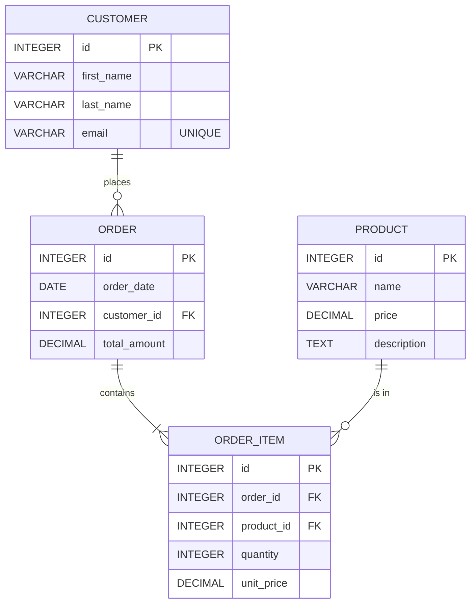
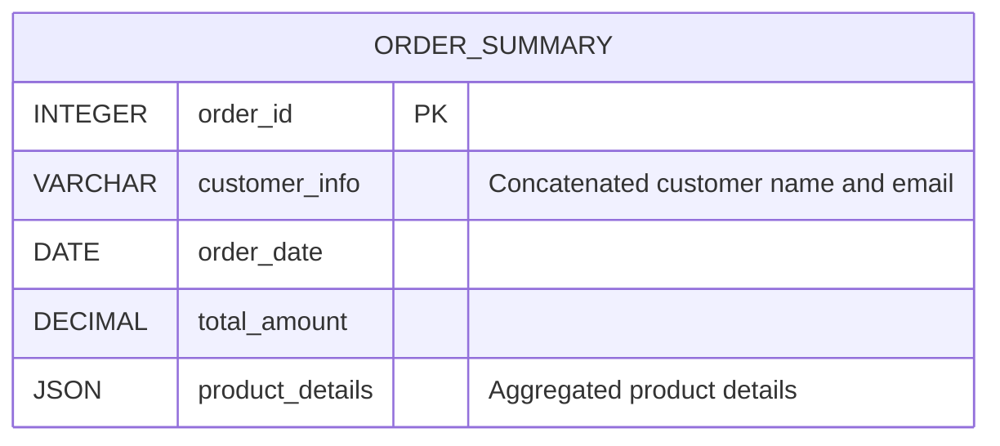

# Disclaimer
This repository contains information collected from various online sources and/or generated by AI assistants. The content provided here is for informational purposes only and is intended to serve as a general reference on various topics.

# Comprehensive Guide to PostgreSQL Data Modeling Best Practices

---

## Table of Contents

1. [Introduction](#introduction)
2. [Fundamental Principles of Data Modeling](#fundamental-principles-of-data-modeling)
   - [What is Data Modeling?](#what-is-data-modeling)
   - [Importance in PostgreSQL](#importance-in-postgresql)
3. [Entity-Relationship Modeling and Schema Design](#entity-relationship-modeling-and-schema-design)
   - [ER Diagrams and Their Role](#er-diagrams-and-their-role)
   - [Case Study: Modeling a Retail System](#case-study-modeling-a-retail-system)
4. [Table Design Best Practices](#table-design-best-practices)
   - [Defining Tables and Columns](#defining-tables-and-columns)
   - [Naming Conventions](#naming-conventions)
   - [Primary Keys and Unique Constraints](#primary-keys-and-unique-constraints)
   - [Foreign Keys and Referential Integrity](#foreign-keys-and-referential-integrity)
   - [Check Constraints and Domain Constraints](#check-constraints-and-domain-constraints)
5. [Choosing Appropriate Data Types](#choosing-appropriate-data-types)
   - [Numeric Types](#numeric-types)
   - [Character and String Types](#character-and-string-types)
   - [Temporal Data Types](#temporal-data-types)
   - [Geometric and Network Data Types](#geometric-and-network-data-types)
   - [Custom and Domain Types](#custom-and-domain-types)
6. [Normalization: Theory and Practice](#normalization-theory-and-practice)
   - [Understanding Normal Forms](#understanding-normal-forms)
   - [Benefits and Limitations](#benefits-and-limitations)
   - [Mermaid Diagram for a Normalized Schema](#mermaid-diagram-for-a-normalized-schema)
   - [Practical Examples of Normalization](#practical-examples-of-normalization)
7. [Denormalization: When and How to Use It](#denormalization-when-and-how-to-use-it)
   - [Trade-offs Between Normalization and Denormalization](#trade-offs-between-normalization-and-denormalization)
   - [Mermaid Diagram for a Denormalized Schema](#mermaid-diagram-for-a-denormalized-schema)
   - [Real-world Denormalization Strategies](#real-world-denormalization-strategies)
8. [Views and Materialized Views](#views-and-materialized-views)
   - [Designing Views](#designing-views)
   - [Materialized Views: When to Use Them](#materialized-views-when-to-use-them)
   - [Performance Considerations](#performance-considerations)
9. [Indexing Strategies](#indexing-strategies)
   - [B-tree, Hash, GIN, and GiST Indexes](#b-tree-hash-agin-and-gist-indexes)
   - [Index Maintenance and Performance](#index-maintenance-and-performance)
   - [Partial and Expression-based Indexes](#partial-and-expression-based-indexes)
10. [Advanced PostgreSQL Features](#advanced-postgresql-features)
    - [Partitioning](#partitioning)
    - [Foreign Data Wrappers (FDWs)](#foreign-data-wrappers-fdws)
    - [Table Inheritance](#table-inheritance)
11. [Concurrency, Transactions, and MVCC](#concurrency-transactions-and-mvcc)
    - [ACID Principles in PostgreSQL](#acid-principles-in-postgresql)
    - [Locking Mechanisms and Deadlock Prevention](#locking-mechanisms-and-deadlock-prevention)
12. [Performance Tuning and Query Optimization](#performance-tuning-and-query-optimization)
    - [Query Planning and Explain Analyze](#query-planning-and-explain-analyze)
    - [Optimizing Data Retrieval](#optimizing-data-retrieval)
    - [Maintenance: VACUUM, ANALYZE, and REINDEX](#maintenance-vacuum-analyze-and-reindex)
13. [Security Best Practices](#security-best-practices)
    - [Role-Based Access Control (RBAC)](#role-based-access-control-rbac)
    - [Data Encryption and Security Extensions](#data-encryption-and-security-extensions)
14. [Backup, Recovery, and Migration Strategies](#backup-recovery-and-migration-strategies)
    - [Backup Best Practices](#backup-best-practices)
    - [Point-in-Time Recovery (PITR)](#point-in-time-recovery-pitr)
    - [Migration Strategies](#migration-strategies)
15. [Case Studies and Real-World Examples](#case-studies-and-real-world-examples)
    - [E-Commerce Database Design](#e-commerce-database-design)
    - [Financial Systems and Transactional Data](#financial-systems-and-transactional-data)
    - [IoT Data Storage and Analysis](#iot-data-storage-and-analysis)
16. [Common Pitfalls and How to Avoid Them](#common-pitfalls-and-how-to-avoid-them)
17. [Conclusion](#conclusion)
18. [References and Further Reading](#references-and-further-reading)
19. [Appendix: Extended Discussions and Additional Examples](#appendix-extended-discussions-and-additional-examples)

---

## Introduction

Data modeling is the cornerstone of designing efficient, scalable, and maintainable databases. In PostgreSQL, renowned for its advanced features and compliance with SQL standards, a robust data model not only enables optimal performance but also contributes to overall system stability. Whether you’re designing a small web application or a large-scale enterprise system, understanding the underlying principles of data modeling and applying best practices can significantly affect how your application scales and performs under load.

In this guide, we cover everything you need to know about PostgreSQL data modeling best practices. We explain table design, appropriate data types, views, and—importantly—how to balance normalization and denormalization. Detailed Mermaid diagrams (now corrected to avoid syntax errors) are included to help visualize both approaches. This comprehensive resource covers topics ranging from basic table creation to advanced PostgreSQL features, enabling you to design robust, performant databases tailored to your application’s needs.

---

## Fundamental Principles of Data Modeling

### What is Data Modeling?

Data modeling is the process of creating a conceptual framework for how data is stored, accessed, and managed in a database. It involves defining the structure, relationships, constraints, and semantics of the data. The primary goals are:
- **Defining Entities and Relationships:** Identify entities (e.g., customers, orders, products) and their interconnections.
- **Ensuring Data Integrity:** Enforce data validity and consistency via constraints and keys.
- **Optimizing Data Access:** Structure data for efficient querying and reporting.

### Importance in PostgreSQL

PostgreSQL is celebrated for its extensibility and robust feature set. A well-designed PostgreSQL database:
- **Enhances Performance:** Optimizes query execution and resource utilization.
- **Simplifies Maintenance:** Facilitates future modifications and expansions.
- **Ensures Data Consistency:** Enforces business rules and integrity through constraints.
- **Supports Scalability:** Provides a solid foundation to scale applications as data grows.

---

## Entity-Relationship Modeling and Schema Design

### ER Diagrams and Their Role

ER diagrams are essential tools for planning and visualizing your database’s structure. They allow you to:
- **Visualize Relationships:** Map out how tables relate.
- **Identify Redundancies:** Recognize where normalization can minimize duplication.
- **Plan Schema Evolution:** Understand the impact of schema changes.

### Case Study: Modeling a Retail System

Imagine a retail system that manages customers, orders, products, and payments. An ER diagram for such a system might include:

- **Customer:** Represents individuals making purchases.
- **Order:** Captures order details.
- **Product:** Lists available products.
- **Payment:** Tracks payment transactions.

Mermaid diagram illustrating a normalized ER model for this retail system:



In the diagram above, each entity is clearly defined with its attributes and relationships. Notice that attribute definitions now use proper data type names and quotes for special text (e.g., `"UNIQUE"`).

---

## Table Design Best Practices

Effective table design is essential for ensuring a well-performing PostgreSQL database. Key considerations include:

### Defining Tables and Columns

- **Simplicity:** Keep designs simple yet sufficient.
- **Atomicity:** Store atomic values (e.g., separate first and last names).
- **Clear Semantics:** Use descriptive, consistent column names.
- **Documentation:** Annotate tables and columns with comments.

Example table definition for a `customer` table:

```sql
CREATE TABLE customer (
    id SERIAL PRIMARY KEY,
    first_name VARCHAR(50) NOT NULL,
    last_name VARCHAR(50) NOT NULL,
    email VARCHAR(100) UNIQUE NOT NULL,
    created_at TIMESTAMPTZ DEFAULT CURRENT_TIMESTAMP
);
```

### Naming Conventions

- **Use snake_case:** Lowercase letters with underscores for table and column names.
- **Avoid Reserved Keywords:** Do not use SQL reserved words.
- **Descriptive Names:** Choose clear, descriptive names.
- **Prefixing for Join Tables:** Consider combined names (e.g., `customer_order`).

### Primary Keys and Unique Constraints

- **Surrogate Keys:** Prefer auto-incrementing integers over composite keys.
- **Natural Keys:** Use natural keys (e.g., email) only if performance allows.
- **Unique Constraints:** Apply these to columns that require uniqueness.

### Foreign Keys and Referential Integrity

- **Define Foreign Keys:** Always create foreign keys to maintain relationships.
- **Cascading Rules:** Use cascading updates/deletes judiciously.
- **Index Foreign Keys:** Improve join performance with proper indexing.

### Check Constraints and Domain Constraints

- **Check Constraints:** Enforce business rules at the database level.
- **Domain Constraints:** Create reusable domains with embedded validations.

---

## Choosing Appropriate Data Types

Choosing the correct data types is vital for data integrity, storage efficiency, and query performance.

### Numeric Types

- **Integer Types:** `SMALLINT`, `INTEGER`, `BIGINT`.
- **Floating Point Types:** `REAL`, `DOUBLE PRECISION`.
- **Exact Numeric Types:** `NUMERIC` for arbitrary precision (ideal for finance).

### Character and String Types

- **VARCHAR:** Variable-length with optional length limits.
- **TEXT:** Unlimited-length text.
- **CHAR:** Fixed-length strings.

### Temporal Data Types

- **DATE, TIME, TIMESTAMP, TIMESTAMPTZ:** Use time zone–aware types when needed.

### Geometric and Network Data Types

- **Geometric Types:** `POINT`, `LINE`, `POLYGON`, etc.
- **Network Address Types:** `INET`, `CIDR`.

### Custom and Domain Types

Create custom data types or domains to encapsulate business rules:

```sql
CREATE DOMAIN email AS VARCHAR(100)
    CHECK (VALUE ~ '^[A-Za-z0-9._%+-]+@[A-Za-z0-9.-]+\.[A-Za-z]{2,}$');
```

---

## Normalization: Theory and Practice

Normalization structures a relational database into normal forms to reduce redundancy and improve data integrity.

### Understanding Normal Forms

- **1NF (First Normal Form):** Each table cell contains a single value; each record is unique.
- **2NF (Second Normal Form):** Table is in 1NF and all non-key attributes are fully functionally dependent on the primary key.
- **3NF (Third Normal Form):** Table is in 2NF and all columns depend only on the primary key.
- **BCNF (Boyce-Codd Normal Form):** A stricter version of 3NF to address certain anomalies.

### Benefits and Limitations

**Benefits:**
- Eliminates data redundancy.
- Enhances data integrity.
- Improves maintainability and flexibility.

**Limitations:**
- Can lead to complex joins impacting read performance.
- May require more complex SQL queries.

### Mermaid Diagram for a Normalized Schema

Mermaid diagram representing a normalized order management system:


### Practical Examples of Normalization

Consider a denormalized table holding customer order data:

| order_id | customer_name  | customer_email        | product_name | product_price | order_date  |
|----------|----------------|-----------------------|--------------|---------------|-------------|
| 1        | John Doe       | john.doe@example.com  | Widget A     | 19.99         | 2023-03-15  |
| 2        | Jane Smith     | jane.smith@example.com| Widget B     | 29.99         | 2023-03-16  |

A normalized design splits this data into separate tables (e.g., `customer`, `order`, `order_item`, and `product`), reducing redundancy and easing updates.

---

## Denormalization: When and How to Use It

Denormalization introduces redundancy intentionally to improve read performance. This approach is beneficial when the cost of joins in highly normalized databases outweighs the benefits of strict normalization.

### Trade-offs Between Normalization and Denormalization

- **Normalization:**
  - *Pros:* Data integrity, reduced redundancy, easier updates.
  - *Cons:* More joins required, potentially slower reads.
- **Denormalization:**
  - *Pros:* Faster query performance, simpler read queries.
  - *Cons:* Increased redundancy, potential data inconsistency, more complex updates.

### Mermaid Diagram for a Denormalized Schema

Mermaid diagram illustrating a denormalized order summary table:



In this design, data from multiple entities (customers, orders, products) is aggregated into a single table for faster querying, especially in reporting or analytics scenarios.

### Real-world Denormalization Strategies

- **Reporting and Analytics:**  
  Create aggregated views or summary tables.
- **Read-heavy Applications:**  
  Denormalized structures can boost performance when the system is read-dominated.
- **Caching Layers:**  
  Use denormalized tables as caches, updating them via triggers or scheduled jobs to keep data synchronized.

---

## Views and Materialized Views

Views encapsulate complex queries while materialized views store results physically to improve performance for resource-intensive queries.

### Designing Views

- **Encapsulate Complexity:** Hide multiple joins and calculations.
- **Enhance Security:** Expose only the required data.
- **Simplify Maintenance:** Provide a simple interface to underlying data.

Example view for customer orders:

```sql
CREATE VIEW customer_orders AS
SELECT 
    c.id AS customer_id,
    c.first_name,
    c.last_name,
    o.id AS order_id,
    o.order_date,
    o.total_amount
FROM customer c
JOIN orders o ON c.id = o.customer_id;
```

### Materialized Views

Materialized views store the result of a query for faster access. They are useful when data changes infrequently:

```sql
CREATE MATERIALIZED VIEW monthly_sales AS
SELECT 
    date_trunc('month', order_date) AS month,
    COUNT(*) AS order_count,
    SUM(total_amount) AS total_sales
FROM orders
GROUP BY date_trunc('month', order_date);
```

Refresh materialized views as needed:

```sql
REFRESH MATERIALIZED VIEW monthly_sales;
```

---

## Indexing Strategies

Indexes are vital for query performance. Key types include:

### B-tree, Hash, GIN, and GiST Indexes

- **B-tree:** Default, effective for most queries.
- **Hash:** Optimized for equality comparisons.
- **GIN:** Suitable for full-text search and array indexing.
- **GiST:** Good for geometric data and complex searches.

### Partial and Expression-based Indexes

- **Partial Indexes:** Index only a subset of rows.
- **Expression-based Indexes:** Index computed values.

Example of an expression-based index:

```sql
CREATE INDEX idx_lower_email ON customer (LOWER(email));
```

---

## Advanced PostgreSQL Features

### Partitioning

Partition large tables to improve query performance and maintenance. For example:

```sql
CREATE TABLE logs (
    log_id SERIAL,
    log_time TIMESTAMPTZ,
    message TEXT
) PARTITION BY RANGE (log_time);

CREATE TABLE logs_2023 PARTITION OF logs
    FOR VALUES FROM ('2023-01-01') TO ('2024-01-01');
```

### Foreign Data Wrappers (FDWs) and Table Inheritance

FDWs allow querying external data sources, and table inheritance enables shared columns among related tables.

---

## Concurrency, Transactions, and MVCC

PostgreSQL uses Multi-Version Concurrency Control (MVCC) to handle concurrent operations. Understanding transaction isolation levels and locking is key.

### ACID Principles and Locking

- **Atomicity, Consistency, Isolation, Durability (ACID)**
- **Row-level and Table-level Locks:** Keep transactions short and in a consistent order to prevent deadlocks.

---

## Performance Tuning and Query Optimization

### Query Planning and Execution

- **EXPLAIN and EXPLAIN ANALYZE:** Use these commands to optimize query performance.
- **Query Rewriting:** Optimize SQL by avoiding unnecessary joins and using explicit join syntax.

### Maintenance Tasks

- **VACUUM and ANALYZE:** Maintain table health.
- **REINDEX:** Rebuild indexes when necessary.

---

## Security Best Practices

### Role-Based Access Control (RBAC)

- **Least Privilege:** Grant only necessary permissions.
- **Audit Trails:** Log access and changes.

### Encryption

- **In Transit and At Rest:** Use SSL/TLS and filesystem encryption where needed.
- **Security Extensions:** Tools like `pgcrypto` help secure sensitive data.

---

## Backup, Recovery, and Migration Strategies

### Backup Best Practices

- **Regular Backups:** Schedule full and incremental backups.
- **Automated Tools:** Use `pg_dump` and `pg_basebackup`.

### Point-in-Time Recovery (PITR) and High Availability

- **Continuous WAL Archiving:** Enable recovery to a specific point in time.
- **Replication:** Use streaming replication and failover mechanisms.

---

## Case Studies and Real-World Examples

### E-Commerce, Financial Systems, and IoT

- **E-Commerce:**  
  Use normalized designs for transactional integrity and denormalized views for reporting.
- **Financial Systems:**  
  Use precise data types and rigorous audit trails.
- **IoT:**  
  Combine normalized raw data storage with denormalized summary tables for analytics.

---

## Common Pitfalls and How to Avoid Them

- **Over-Normalization:**  
  Balance joins and performance.
- **Inconsistent Naming:**  
  Follow clear naming conventions.
- **Ignoring Index Maintenance:**  
  Schedule regular reindexing and monitor performance.
- **Poor Data Type Selection:**  
  Choose data types that match the data.
- **Insufficient Documentation:**  
  Document your schema thoroughly.

---

## Conclusion

This guide has provided an extensive exploration of PostgreSQL data modeling best practices. From foundational principles to advanced features and performance tuning, the strategies presented here aim to help you design robust, efficient, and scalable PostgreSQL databases.

In summary:
- **Effective Data Modeling:** Is the foundation of scalable, maintainable databases.
- **Normalization vs. Denormalization:** Each approach has its benefits and trade-offs; use the provided Mermaid diagrams to help visualize your design.
- **Advanced Features and Best Practices:** Leverage PostgreSQL’s advanced features while following strict security and backup practices.

---

## References and Further Reading

- [PostgreSQL Documentation](https://www.postgresql.org/docs/)
- [High Performance PostgreSQL](https://www.enterprisedb.com/blog/10-tips-high-performance-postgresql)
- [Data Modeling for PostgreSQL](https://www.cybertec-postgresql.com/en/data-modeling-postgresql/)
- [Indexing Best Practices](https://www.postgresql.org/docs/current/indexes.html)
- [Normalization in Database Design](https://www.databasejournal.com/features/mssql/article.php/3896941/Database-Normalization-What-Is-It-and-Why-Does-It-Matter.htm)

---

## Appendix: Extended Discussions and Additional Examples

### Extended Discussion on Data Modeling Principles

Data modeling is an iterative process. It evolves as business requirements change. In this section, we discuss:
- **Iterative Model Development:** From conceptual to logical to physical models.
- **Balancing Flexibility and Rigor:** When to use JSONB columns or EAV models.
- **Collaboration and Documentation:** Tools and practices for maintaining a clear data model.

### Detailed Explanation of Table Partitioning

Partitioning is essential for large datasets:
- **Types:** Range, list, and hash partitioning.
- **Best Practices:** Choose an even partition key, index partitions, and automate maintenance.

### In-Depth Indexing Strategies

- **Composite and Unique Indexes:** Optimize multi-column queries.
- **BRIN Indexes:** Ideal for large, time-ordered datasets.
- **Monitoring Index Usage:** Use PostgreSQL’s built-in statistics and maintenance commands.

### Transaction Management and MVCC

- **Isolation Levels:** Read Committed, Repeatable Read, Serializable.
- **Best Practices:** Keep transactions short, use explicit locking when needed, and implement error handling.

---
