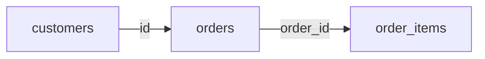
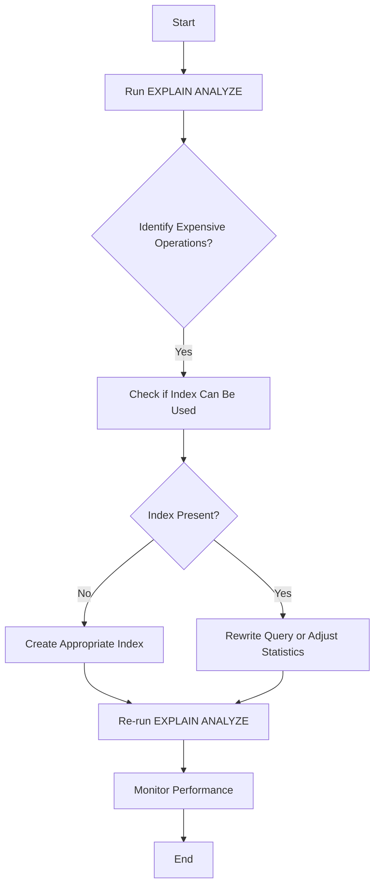
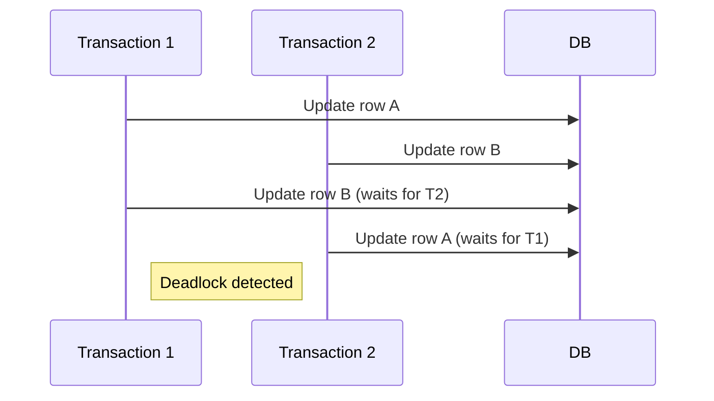
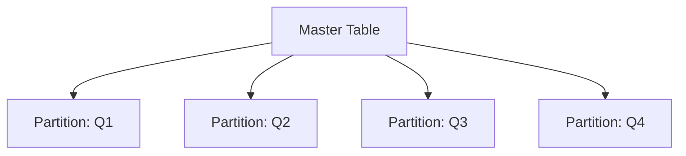

# Disclaimer
This repository contains information collected from various online sources and/or generated by AI assistants. The content provided here is for informational purposes only and is intended to serve as a general reference on various topics.

# Comprehensive Guide to PostgreSQL Performance Issues and Solutions

## Table of Contents

1. [Introduction](#introduction)
2. [Overview of PostgreSQL Architecture](#overview-of-postgresql-architecture)
3. [Common Performance Issues in PostgreSQL](#common-performance-issues-in-postgresql)  
   3.1. [Query Performance Bottlenecks](#query-performance-bottlenecks)  
   3.2. [Indexing Challenges](#indexing-challenges)  
   3.3. [Configuration and Memory Settings](#configuration-and-memory-settings)  
   3.4. [Disk I/O and Storage Problems](#disk-io-and-storage-problems)  
   3.5. [Concurrency and Locking Issues](#concurrency-and-locking-issues)  
   3.6. [Vacuuming, Bloat and Autovacuum Tuning](#vacuuming-bloat-and-autovacuum-tuning)  
   3.7. [Hardware Constraints and OS-Level Issues](#hardware-constraints-and-os-level-issues)
4. [Strategies for Identifying Performance Issues](#strategies-for-identifying-performance-issues)  
   4.1. [Using EXPLAIN and EXPLAIN ANALYZE](#using-explain-and-explain-analyze)  
   4.2. [Monitoring and Logging Tools](#monitoring-and-logging-tools)  
   4.3. [Query Profiling and Benchmarking](#query-profiling-and-benchmarking)
5. [Solutions and Best Practices](#solutions-and-best-practices)  
   5.1. [Query Optimization Techniques](#query-optimization-techniques)  
   5.2. [Indexing Strategies and Best Practices](#indexing-strategies-and-best-practices)  
   5.3. [Configuration Tuning](#configuration-tuning)  
   5.4. [Concurrency Management](#concurrency-management)  
   5.5. [Effective Use of Partitioning](#effective-use-of-partitioning)  
   5.6. [Maintenance Routines and Autovacuum Tuning](#maintenance-routines-and-autovacuum-tuning)
6. [Design Considerations for High Performance](#design-considerations-for-high-performance)  
   6.1. [Schema Design and Normalization](#schema-design-and-normalization)  
   6.2. [Denormalization and Materialized Views](#denormalization-and-materialized-views)  
   6.3. [Index Design and Data Distribution](#index-design-and-data-distribution)
7. [Case Studies and Examples](#case-studies-and-examples)  
   7.1. [Real-World Query Optimization Example](#real-world-query-optimization-example)  
   7.2. [Indexing Example with Table Designs](#indexing-example-with-table-designs)  
   7.3. [Configuration Tuning and Its Impact](#configuration-tuning-and-its-impact)
8. [Advanced Topics and Emerging Trends](#advanced-topics-and-emerging-trends)  
   8.1. [Using Connection Pooling](#using-connection-pooling)  
   8.2. [Sharding and Distributed PostgreSQL](#sharding-and-distributed-postgresql)  
   8.3. [Containerized PostgreSQL Deployments](#containerized-postgresql-deployments)
9. [Appendices](#appendices)  
   9.1. [Glossary of Terms](#glossary-of-terms)  
   9.2. [Additional Resources and References](#additional-resources-and-references)
10. [Conclusion](#conclusion)

---

## 1. Introduction

PostgreSQL is renowned for its robustness, extensibility, and SQL compliance. However, as applications grow in complexity and data volume, even a powerful database engine like PostgreSQL can encounter performance challenges. This guide explores the most common performance issues encountered in PostgreSQL environments and provides detailed solutions to resolve them.

The performance problems discussed in this guide include inefficient queries, suboptimal indexing, improper configuration settings, disk I/O constraints, concurrency bottlenecks, and maintenance overheads such as table bloat. We will explain the root causes of these issues, how they can be diagnosed using various tools, and offer strategies to mitigate or eliminate them. Additionally, we delve into design considerations and provide case studies that illustrate real-world scenarios and solutions.

By the end of this guide, readers should have a comprehensive understanding of PostgreSQL performance tuning and the confidence to apply best practices in production environments.

---

## 2. Overview of PostgreSQL Architecture

Before diving into performance issues, it is essential to understand the high-level architecture of PostgreSQL. This section provides a brief overview of key components that directly affect performance.

### 2.1. Process Architecture

PostgreSQL operates on a process-per-connection model rather than using threads. Each client connection spawns a new process, which can lead to higher overhead under heavy concurrent usage. However, this architecture also provides robust isolation between sessions.

- **Backend Processes:** Each active connection has its own backend process.
- **Background Processes:** There are several auxiliary processes such as the *autovacuum launcher*, *checkpointer*, *writer*, *stats collector*, and *WAL writer*.
- **Shared Memory:** All PostgreSQL processes share certain memory areas (e.g., shared buffers) to facilitate caching and reduce disk I/O.

### 2.2. Storage Architecture

PostgreSQL stores data in files using its own file formats. Understanding how PostgreSQL interacts with the file system is crucial for diagnosing disk I/O issues.

- **Tablespaces:** Directories where PostgreSQL stores data files.
- **Write-Ahead Logging (WAL):** Ensures data durability by logging changes before they are committed.
- **Buffer Cache:** A shared memory area (defined by `shared_buffers`) that holds frequently accessed data.

### 2.3. Query Processing

The query processing pipeline in PostgreSQL consists of several steps:

1. **Parsing:** The SQL statement is parsed and transformed into a parse tree.
2. **Rewriting:** The parse tree may be rewritten (for example, rules or views can change the query).
3. **Planning/Optimization:** The query planner devises an execution plan using cost estimation.
4. **Execution:** The query is executed, and results are returned.

Understanding this process is key when analyzing query performance, as bottlenecks may occur at any stage.

### 2.4. Concurrency and Locking

PostgreSQL’s Multi-Version Concurrency Control (MVCC) system allows multiple transactions to occur simultaneously. However, managing locks and preventing conflicts is a critical part of performance tuning, especially in highly concurrent environments.

---

## 3. Common Performance Issues in PostgreSQL

This section discusses several common performance issues encountered in PostgreSQL environments and provides insights into their causes and potential resolutions.

### 3.1. Query Performance Bottlenecks

Query performance issues are among the most prevalent problems in PostgreSQL. They often result from inefficient SQL, lack of proper indexes, and poorly designed queries.

#### 3.1.1. Slow and Inefficient Queries

- **Complex Joins and Subqueries:** Nested queries and multiple joins can result in suboptimal execution plans if not properly indexed or written.
- **Inefficient WHERE Clauses:** Conditions that prevent the use of indexes or force sequential scans can severely degrade performance.
- **Overuse of Aggregations:** Aggregation functions over large datasets can be computationally intensive.

#### 3.1.2. Poor Query Planning

The query planner might choose inefficient execution plans because of outdated statistics or improper configuration settings. This can lead to:

- **Sequential Scans Instead of Index Scans:** When indexes exist, but the planner does not use them.
- **Suboptimal Join Methods:** Such as nested loop joins when hash joins or merge joins would be more appropriate.

#### 3.1.3. N+1 Query Problem

This issue arises when an application issues one query to retrieve a list of items and then issues additional queries for each item. This results in a significant number of round trips to the database, increasing latency.

### 3.2. Indexing Challenges

Indexes are critical for query performance but can also introduce overhead if not managed properly.

#### 3.2.1. Missing Indexes

- **Symptoms:** Long-running queries, high CPU usage, and excessive sequential scans.
- **Solution:** Use the `EXPLAIN` command to identify queries that do not use indexes, then create the appropriate indexes.

#### 3.2.2. Over-Indexing

- **Symptoms:** Slower insert, update, and delete operations due to the overhead of maintaining indexes.
- **Solution:** Periodically review the necessity of indexes and remove any that are not used.

#### 3.2.3. Inappropriate Index Types

- **B-Tree Indexes:** Default for most queries but not ideal for all types of data.
- **GIN/GiST Indexes:** Better for full-text search, arrays, and geometric data types.
- **Hash Indexes:** In PostgreSQL, these are limited and rarely the best choice.

#### 3.2.4. Index Bloat

Over time, indexes may become bloated, consuming excess disk space and reducing performance. Routine reindexing or using the `REINDEX` command can mitigate this issue.

### 3.3. Configuration and Memory Settings

PostgreSQL configuration parameters greatly influence performance. Misconfiguration is a common source of performance problems.

#### 3.3.1. Shared Buffers

- **Role:** Acts as PostgreSQL’s in-memory cache for data pages.
- **Issues:** Setting this parameter too low will force excessive disk I/O; setting it too high might starve the OS of memory.

#### 3.3.2. Work Memory (`work_mem`)

- **Role:** Memory allocated per operation (such as sorting or hash joins).
- **Issues:** Insufficient work_mem can force disk-based operations, while excessive allocation can lead to memory exhaustion in concurrent environments.

#### 3.3.3. Maintenance Work Memory (`maintenance_work_mem`)

- **Role:** Memory for maintenance operations such as `VACUUM`, `CREATE INDEX`, and `ALTER TABLE`.
- **Issues:** Low settings can slow down maintenance tasks significantly.

#### 3.3.4. Effective Cache Size

- **Role:** Helps the query planner estimate the amount of memory available for caching.
- **Issues:** Underestimating effective cache size might lead the planner to underestimate the benefit of index scans.

### 3.4. Disk I/O and Storage Problems

Disk I/O is a critical factor in database performance. Poor disk performance or misconfigured storage subsystems can drastically affect overall performance.

#### 3.4.1. Disk Latency

- **Symptoms:** Slow query execution, increased response times.
- **Solutions:** Use SSDs or NVMe drives, ensure proper disk scheduling, and consider RAID configurations.

#### 3.4.2. Filesystem Issues

- **Symptoms:** High I/O wait times.
- **Solutions:** Use filesystems optimized for databases (e.g., XFS or EXT4) and tune the file system parameters for optimal performance.

#### 3.4.3. Write-Ahead Logging (WAL)

- **Role:** Ensures data durability by writing changes before they are committed.
- **Issues:** Misconfiguration of WAL parameters (e.g., checkpoint settings, WAL segment size) can lead to high disk activity.

### 3.5. Concurrency and Locking Issues

Concurrency problems are common in multi-user database systems. Issues such as lock contention and deadlocks can affect both performance and user experience.

#### 3.5.1. Lock Contention

- **Symptoms:** Queries waiting on locks, increased query response time.
- **Solutions:** Optimize long-running transactions, reduce lock granularity, and review isolation levels.

#### 3.5.2. Deadlocks

- **Symptoms:** Transactions aborting due to circular lock dependencies.
- **Solutions:** Use proper transaction ordering, shorten transaction times, and detect and resolve deadlocks programmatically.

#### 3.5.3. Transaction Isolation Levels

- **Impact:** Higher isolation levels (e.g., SERIALIZABLE) can increase lock contention.
- **Solutions:** Evaluate and adjust isolation levels according to workload requirements.

### 3.6. Vacuuming, Bloat and Autovacuum Tuning

PostgreSQL uses Multi-Version Concurrency Control (MVCC), which means that old versions of data are kept around for transaction isolation. Without proper maintenance, this leads to table and index bloat.

#### 3.6.1. Table and Index Bloat

- **Symptoms:** Increased disk usage and slower query performance.
- **Solutions:** Regularly run `VACUUM` and `ANALYZE` commands, and consider using `VACUUM FULL` or `CLUSTER` for severely bloated tables.

#### 3.6.2. Autovacuum

- **Role:** Automatically maintains tables by vacuuming dead tuples.
- **Issues:** Misconfigured autovacuum settings (e.g., too high or too low thresholds) can lead to performance degradation.
- **Solutions:** Tune autovacuum parameters such as `autovacuum_vacuum_scale_factor`, `autovacuum_vacuum_threshold`, and `autovacuum_naptime`.

### 3.7. Hardware Constraints and OS-Level Issues

Even with a well-tuned database, hardware and operating system factors can limit performance.

#### 3.7.1. CPU Bottlenecks

- **Symptoms:** High CPU utilization, slow query processing.
- **Solutions:** Optimize queries to reduce CPU load, consider upgrading CPUs, and use parallel query execution where applicable.

#### 3.7.2. Memory Limitations

- **Symptoms:** Swapping, memory exhaustion.
- **Solutions:** Ensure that PostgreSQL and the OS have adequate RAM, and fine-tune memory-related parameters.

#### 3.7.3. I/O Subsystem Constraints

- **Symptoms:** High disk I/O wait times.
- **Solutions:** Invest in faster storage solutions (SSDs, NVMe), optimize disk configuration, and monitor I/O performance continuously.

---

## 4. Strategies for Identifying Performance Issues

Before applying solutions, it is essential to properly identify and diagnose performance bottlenecks. The following strategies and tools can help pinpoint the issues.

### 4.1. Using EXPLAIN and EXPLAIN ANALYZE

`EXPLAIN` and `EXPLAIN ANALYZE` are indispensable tools in PostgreSQL performance analysis.

#### 4.1.1. EXPLAIN

- **Usage:** Provides the execution plan for a query without running it.
- **Output:** A detailed tree showing how the planner intends to execute the query.
- **Benefits:** Identify whether sequential scans, index scans, or nested loops are used.

#### 4.1.2. EXPLAIN ANALYZE

- **Usage:** Executes the query and provides actual run times for each operation.
- **Benefits:** Helps to verify if the query planner’s cost estimates are accurate and identifies unexpected slow steps.
- **Example:**

  ```sql
  EXPLAIN ANALYZE
  SELECT * FROM orders WHERE customer_id = 123;
  ```

### 4.2. Monitoring and Logging Tools

Robust monitoring and logging are essential for continuous performance evaluation.

#### 4.2.1. PostgreSQL Logging

- **Parameters:** Configure settings such as `log_min_duration_statement`, `log_statement`, and `log_checkpoints` to capture slow queries and key events.
- **Log Analysis Tools:** Use tools like `pgBadger` to analyze logs and generate performance reports.

#### 4.2.2. pg_stat_statements

- **Functionality:** Provides detailed query execution statistics.
- **Usage:** Helps in identifying the most resource-intensive queries.
- **Example Query:**

  ```sql
  SELECT query, calls, total_time, rows
  FROM pg_stat_statements
  ORDER BY total_time DESC
  LIMIT 10;
  ```

#### 4.2.3. External Monitoring Tools

- **Tools:** Prometheus, Grafana, Datadog, and New Relic can monitor key PostgreSQL metrics.
- **Metrics:** Monitor CPU, memory, disk I/O, and query performance over time.

### 4.3. Query Profiling and Benchmarking

Profiling queries and benchmarking the database under load can provide insights into performance characteristics.

#### 4.3.1. Benchmarking Tools

- **pgbench:** A built-in benchmarking tool that simulates a workload.
- **Usage Example:**

  ```bash
  pgbench -i -s 10 mydatabase
  pgbench -c 10 -j 2 -T 300 mydatabase
  ```

#### 4.3.2. Profiling Query Execution

- **Approach:** Identify long-running queries, then profile and optimize them using EXPLAIN ANALYZE.
- **Focus:** Evaluate join operations, aggregation functions, and subqueries.

---

## 5. Solutions and Best Practices

Once performance issues have been identified, a systematic approach to optimizing PostgreSQL is necessary. The following sections outline practical solutions and best practices.

### 5.1. Query Optimization Techniques

Improving query performance involves both rewriting SQL statements and making adjustments to how the database engine executes them.

#### 5.1.1. Rewriting Complex Queries

- **Simplification:** Break down complex queries into simpler, modular queries when possible.
- **Subquery Optimization:** Consider using Common Table Expressions (CTEs) to improve readability and performance. However, note that CTEs are sometimes optimized as an “optimization fence” (i.e., not inlined), so benchmark different approaches.
- **Example:**

  ```sql
  WITH recent_orders AS (
      SELECT order_id, customer_id, order_date
      FROM orders
      WHERE order_date > current_date - interval '30 days'
  )
  SELECT ro.order_id, c.name
  FROM recent_orders ro
  JOIN customers c ON ro.customer_id = c.id;
  ```

#### 5.1.2. Eliminating Redundant Data Access

- **Avoid N+1 Issues:** Use joins or batch queries instead of looping through individual records.
- **Prepared Statements:** Cache query plans with prepared statements for repetitive queries.

#### 5.1.3. Utilizing Index-Only Scans

- **Definition:** Index-only scans retrieve data directly from the index without consulting the table, which speeds up query execution.
- **Prerequisites:** Requires the index to include all columns referenced in the query and that the table’s visibility map is updated.
- **Usage Tip:** Ensure autovacuum runs effectively to keep the visibility map current.

### 5.2. Indexing Strategies and Best Practices

Proper indexing is crucial for improving query performance while balancing the overhead on write operations.

#### 5.2.1. Choosing the Right Index

- **B-Tree:** Ideal for equality and range queries.
- **GIN/GiST:** Suitable for full-text search, arrays, and JSONB fields.
- **Hash:** Rarely used due to limitations but can be considered for specific equality queries.
- **Composite Indexes:** When queries frequently involve multiple columns, a composite index may be beneficial.

#### 5.2.2. Index Maintenance

- **Reindexing:** Use `REINDEX` periodically to combat bloat.
- **Monitoring Usage:** Use `pg_stat_user_indexes` to see index usage statistics.
- **Table Example:**

  | Index Name       | Table    | Column(s)       | Usage Count | Last Used          |
  | ---------------- | -------- | --------------- | ----------- | ------------------ |
  | idx_customers_id | customers| id              | 105,000     | 2025-03-01 12:30   |
  | idx_orders_date  | orders   | order_date      | 90,000      | 2025-03-02 08:45   |

#### 5.2.3. Covering Indexes and Index-Only Scans

- **Definition:** Covering indexes include all columns needed by a query.
- **Design Tip:** When designing indexes, consider whether additional columns (as “included” columns) can enable index-only scans.
- **Diagram:**

  ```mermaid
  graph LR
    A[Query SELECT id, name FROM customers WHERE id = ?] --> B[Index on customers(id)]
    B --> C[Index-Only Scan]
  ```

### 5.3. Configuration Tuning

Proper configuration of PostgreSQL parameters in the `postgresql.conf` file is essential for optimal performance.

#### 5.3.1. Memory Configuration

- **shared_buffers:** Set to 25%-40% of available RAM.
- **work_mem:** Tune based on query complexity and number of concurrent queries.
- **maintenance_work_mem:** Increase for heavy maintenance tasks.

#### 5.3.2. Checkpoint and WAL Tuning

- **checkpoint_timeout:** Increase to reduce checkpoint frequency, but balance with recovery time.
- **checkpoint_completion_target:** Set around 0.7–0.9 to smooth out I/O spikes.
- **wal_buffers:** Adjust based on write workload to reduce disk writes.
- **Example Configuration:**

  ```conf
  shared_buffers = 8GB
  work_mem = 32MB
  maintenance_work_mem = 1GB
  checkpoint_timeout = 15min
  checkpoint_completion_target = 0.9
  wal_buffers = 16MB
  effective_cache_size = 24GB
  ```

#### 5.3.3. Autovacuum Settings

- **autovacuum_max_workers:** Increase for larger databases.
- **autovacuum_vacuum_scale_factor:** Lower for high-update tables.
- **autovacuum_analyze_scale_factor:** Adjust based on table update frequency.

### 5.4. Concurrency Management

Managing concurrent connections and locking can drastically improve performance in multi-user environments.

#### 5.4.1. Reducing Lock Contention

- **Short Transactions:** Keep transactions as short as possible.
- **Optimistic Concurrency Control:** Use application-level mechanisms to minimize locking.
- **Isolation Levels:** Choose the appropriate isolation level (e.g., READ COMMITTED vs. REPEATABLE READ) to balance consistency with concurrency.

#### 5.4.2. Deadlock Avoidance

- **Consistent Ordering:** Ensure that applications acquire locks in a consistent order.
- **Timeouts:** Use lock timeouts (`lock_timeout`) to prevent indefinite waiting.
- **Monitoring:** Regularly monitor deadlock events in PostgreSQL logs.

### 5.5. Effective Use of Partitioning

Partitioning large tables can significantly enhance performance by reducing the amount of data scanned for queries.

#### 5.5.1. Range and List Partitioning

- **Range Partitioning:** Useful for time-series data or any data that is continuously increasing.
- **List Partitioning:** Suitable for categorical data.
- **Example:**

  ```sql
  CREATE TABLE orders (
      order_id serial primary key,
      customer_id integer,
      order_date date,
      total numeric
  ) PARTITION BY RANGE (order_date);

  CREATE TABLE orders_2024 PARTITION OF orders
      FOR VALUES FROM ('2024-01-01') TO ('2025-01-01');

  CREATE TABLE orders_2025 PARTITION OF orders
      FOR VALUES FROM ('2025-01-01') TO ('2026-01-01');
  ```

#### 5.5.2. Benefits of Partitioning

- **Faster Query Response:** Only partitions that match the query conditions are scanned.
- **Simplified Maintenance:** Operations like vacuuming and indexing can be performed on individual partitions.
- **Design Diagram:**

  ```mermaid
  graph TD
    A[Orders Table] --> B[Partition: orders_2024]
    A --> C[Partition: orders_2025]
  ```

### 5.6. Maintenance Routines and Autovacuum Tuning

Regular maintenance is critical to keep PostgreSQL running efficiently.

#### 5.6.1. VACUUM and ANALYZE

- **VACUUM:** Reclaims storage by removing dead tuples.
- **ANALYZE:** Updates planner statistics.
- **Scheduling:** Automate these tasks during off-peak hours.

#### 5.6.2. Preventing Table Bloat

- **Monitoring:** Use system views such as `pg_stat_user_tables` to monitor bloat.
- **Reindexing:** Regularly reindex to maintain index performance.

---

## 6. Design Considerations for High Performance

Designing your database schema with performance in mind can help avoid many common issues from the start.

### 6.1. Schema Design and Normalization

A well-designed schema is the foundation of a high-performance database.

#### 6.1.1. Normalization Benefits

- **Data Integrity:** Ensures data consistency.
- **Reduced Redundancy:** Minimizes duplicate data, leading to more efficient updates.
- **Trade-Offs:** Over-normalization can lead to excessive joins; balance is key.

#### 6.1.2. Denormalization When Necessary

- **Read Performance:** In some cases, denormalizing data can reduce the need for complex joins.
- **Materialized Views:** Use materialized views to store precomputed query results.

### 6.2. Denormalization and Materialized Views

Denormalization and materialized views can provide significant performance gains for reporting and analytics workloads.

#### 6.2.1. Materialized Views

- **Definition:** A materialized view stores the result of a query physically.
- **Refresh Strategies:** Use periodic or incremental refreshes.
- **Example:**

  ```sql
  CREATE MATERIALIZED VIEW daily_sales_summary AS
  SELECT date_trunc('day', order_date) AS day,
         sum(total) AS total_sales
  FROM orders
  GROUP BY 1;
  ```

#### 6.2.2. Denormalization Strategies

- **Precomputed Aggregates:** Store aggregated data to speed up read queries.
- **Trade-Off:** Increased storage and potential data inconsistency—ensure that updates propagate correctly.

### 6.3. Index Design and Data Distribution

Properly designed indexes and an understanding of your data distribution are essential.

#### 6.3.1. Covering Indexes

- **Benefits:** Enable index-only scans for frequently accessed queries.
- **Design Consideration:** Include columns that are commonly selected to avoid table lookups.

#### 6.3.2. Data Distribution and Statistics

- **Statistics Collection:** Run ANALYZE frequently to ensure the planner has accurate data distribution information.
- **Histogram and Correlation:** Understand how data is distributed across columns to design effective indexes.

---

## 7. Case Studies and Examples

Real-world examples help illustrate how performance issues manifest and how various solutions can be applied.

### 7.1. Real-World Query Optimization Example

#### 7.1.1. Problem Scenario

A large e-commerce platform observed that queries retrieving recent orders for a specific customer were taking several seconds to execute during peak hours.

- **Symptoms:** High CPU usage and frequent sequential scans.
- **Initial Query:**

  ```sql
  SELECT * FROM orders
  WHERE customer_id = 345
    AND order_date > current_date - interval '30 days';
  ```

#### 7.1.2. Diagnosis

- **EXPLAIN ANALYZE Output:** The plan showed a sequential scan over millions of rows.
- **Statistics Check:** Outdated statistics resulted in suboptimal plan selection.

#### 7.1.3. Optimization Steps

1. **Index Creation:** A composite index on `(customer_id, order_date)` was created.
2. **Statistics Update:** The table was reanalyzed.
3. **Query Rewrite:** The query was rewritten to ensure that the index could be effectively used.

- **Optimized Query:**

  ```sql
  EXPLAIN ANALYZE
  SELECT order_id, order_date, total
  FROM orders
  WHERE customer_id = 345
    AND order_date > current_date - interval '30 days';
  ```

#### 7.1.4. Results

- **Before Optimization:** Query execution time was approximately 3.5 seconds.
- **After Optimization:** Execution time reduced to 150 milliseconds.
- **Lessons Learned:** Proper indexing and up-to-date statistics are crucial for efficient query planning.

### 7.2. Indexing Example with Table Designs

#### 7.2.1. Schema Overview

Consider a database with the following tables: `customers`, `orders`, and `order_items`.

- **Table: customers**

  | Column Name | Data Type | Description                   |
  | ----------- | --------- | ----------------------------- |
  | id          | SERIAL    | Primary key                 |
  | name        | TEXT      | Customer's full name         |
  | email       | TEXT      | Customer's email address     |

- **Table: orders**

  | Column Name | Data Type | Description                     |
  | ----------- | --------- | ------------------------------- |
  | order_id    | SERIAL    | Primary key                     |
  | customer_id | INTEGER   | Foreign key referencing customers.id |
  | order_date  | DATE      | Date of the order               |
  | total       | NUMERIC   | Total amount of the order       |

- **Table: order_items**

  | Column Name | Data Type | Description                     |
  | ----------- | --------- | ------------------------------- |
  | item_id     | SERIAL    | Primary key                     |
  | order_id    | INTEGER   | Foreign key referencing orders.order_id |
  | product_id  | INTEGER   | Identifier for the product      |
  | quantity    | INTEGER   | Quantity of the product         |
  | price       | NUMERIC   | Price per unit                  |

#### 7.2.2. Indexing Strategy

- **customers:** Primary key index on `id` (automatically created).
- **orders:** Composite index on `(customer_id, order_date)` to optimize queries filtering by customer and date range.
- **order_items:** Index on `order_id` to improve join performance.

#### 7.2.3. Diagram



#### 7.2.4. Performance Impact

- **Before Indexing:** Joins and filtered queries caused full table scans.
- **After Indexing:** Query times reduced significantly as indexes allowed the planner to quickly locate relevant records.

### 7.3. Configuration Tuning and Its Impact

#### 7.3.1. Scenario

An analytics platform with heavy read and write operations experienced degraded performance during peak analysis periods.

#### 7.3.2. Tuning Process

- **Memory Settings:** Adjusted `shared_buffers` and `work_mem` based on available system memory.
- **Checkpoint Tuning:** Increased `checkpoint_timeout` to reduce frequent disk writes.
- **Autovacuum:** Tuned autovacuum parameters to better handle high-update tables.
- **Results:** 
  - Significant reduction in I/O wait times.
  - More predictable query performance.
  - Better overall throughput under concurrent load.

---

## 8. Advanced Topics and Emerging Trends

As PostgreSQL evolves and workloads become more complex, new techniques and strategies are emerging.

### 8.1. Using Connection Pooling

Connection pooling reduces the overhead of establishing new connections and improves resource utilization.

#### 8.1.1. Benefits

- **Resource Efficiency:** Reduces the number of active backend processes.
- **Reduced Latency:** Faster query response times as connections are reused.
- **Popular Tools:** PgBouncer and Pgpool-II.

#### 8.1.2. Configuration Tips

- **Pool Size:** Optimize the pool size based on workload and system capacity.
- **Timeout Settings:** Adjust idle timeouts to balance resource consumption and performance.

### 8.2. Sharding and Distributed PostgreSQL

For extremely large datasets, sharding or a distributed PostgreSQL architecture might be necessary.

#### 8.2.1. Horizontal Partitioning (Sharding)

- **Concept:** Distributing data across multiple nodes.
- **Use Cases:** High-volume transactional systems and big data applications.
- **Tools:** Citus Data transforms PostgreSQL into a distributed database.

#### 8.2.2. Benefits and Challenges

- **Benefits:** Improved scalability and fault tolerance.
- **Challenges:** Increased complexity in query planning and distributed transactions.

### 8.3. Containerized PostgreSQL Deployments

Running PostgreSQL in containers (e.g., Docker, Kubernetes) offers operational flexibility but also introduces unique performance considerations.

#### 8.3.1. Resource Allocation

- **Container Limits:** Ensure containers have sufficient CPU and memory.
- **Storage:** Use persistent volumes optimized for database workloads.

#### 8.3.2. Network Overhead

- **Minimizing Latency:** Configure network settings to reduce latency between containers, especially in microservice architectures.

---

## 9. Appendices

### 9.1. Glossary of Terms

| Term                         | Definition                                                                                         |
| ---------------------------- | -------------------------------------------------------------------------------------------------- |
| **MVCC**                     | Multi-Version Concurrency Control, allowing multiple transactions to occur without interference. |
| **EXPLAIN ANALYZE**          | A command that executes a query and returns the actual run times for each step in the execution plan.|
| **Index-Only Scan**          | A query execution method that retrieves data directly from an index without consulting the table.  |
| **B-Tree Index**             | The default and most common index type in PostgreSQL, optimized for range queries.                |
| **Autovacuum**               | A background process in PostgreSQL that automatically reclaims storage occupied by dead tuples.    |
| **WAL**                      | Write-Ahead Logging; a mechanism to ensure data durability by recording changes before they are applied.|
| **Partitioning**             | Dividing a large table into smaller, more manageable pieces (partitions) to improve query performance. |
| **Connection Pooling**       | A technique to reuse database connections to reduce overhead and improve performance.             |
| **Sharding**                 | Distributing a dataset across multiple databases or nodes to improve scalability.                 |

### 9.2. Additional Resources and References

- [PostgreSQL Official Documentation](https://www.postgresql.org/docs/) – The ultimate reference for PostgreSQL configuration and tuning.
- [pgTune](https://pgtune.leopard.in.ua/) – A tool for generating optimized PostgreSQL configuration settings.
- [High Performance PostgreSQL](https://www.2ndquadrant.com/en/blog/high-performance-postgresql/) – Articles and case studies on PostgreSQL performance tuning.
- [Citus Data](https://www.citusdata.com/) – Information on distributed PostgreSQL solutions.

---

## 10. Conclusion

Optimizing PostgreSQL performance is a multifaceted challenge that involves understanding the database’s internal workings, proper schema design, query tuning, and fine-tuning configuration settings. As demonstrated throughout this guide, common issues—ranging from inefficient queries and indexing problems to disk I/O bottlenecks and concurrency challenges—can be addressed with systematic troubleshooting and the application of best practices.

By continuously monitoring performance, updating statistics, and employing strategies such as connection pooling, partitioning, and proper maintenance routines, administrators can ensure that PostgreSQL scales effectively and continues to deliver high performance even under demanding workloads. The techniques discussed herein are applicable not only to existing systems but also serve as guiding principles when designing new PostgreSQL deployments.

---

## Detailed Section: Deep Dive into Query Optimization (Part I)

### Understanding Query Execution Plans

An execution plan is the roadmap that PostgreSQL uses to retrieve the requested data. It includes details on how the database engine is accessing tables, which indexes are being used, and the join methods employed.

#### Anatomy of an Execution Plan

- **Seq Scan:** A sequential scan through the table.
- **Index Scan:** A scan that uses an index to locate rows.
- **Bitmap Heap Scan:** Combines bitmap index scans with a heap scan.
- **Nested Loop, Hash Join, Merge Join:** Different methods for joining tables.

#### Steps for Optimization

1. **Run EXPLAIN ANALYZE:** Capture the current execution plan.
2. **Identify Costly Operations:** Look for operations with high cost or long execution time.
3. **Check for Missing Indexes:** Determine if sequential scans can be replaced with index scans.
4. **Rewrite the Query:** Simplify or restructure the query to make it more efficient.
5. **Test and Measure:** Run the optimized query and compare performance metrics.

### Common Pitfalls in Query Design

#### 1. Using Functions on Indexed Columns

Using a function (e.g., `UPPER()`, `LOWER()`, or a custom function) on an indexed column prevents the use of the index unless a functional index is created.  
**Solution:**  
- Either create a functional index or refactor the query to avoid wrapping the column in a function.

#### 2. Over-Reliance on Wildcards

Wildcards (e.g., `LIKE '%term%'`) at the beginning of a search string lead to full table scans.  
**Solution:**  
- Use full-text search or trigram indexes when dealing with pattern matching.

#### 3. Complex Joins with Insufficient Statistics

When joining large tables without up-to-date statistics, the planner might choose suboptimal join strategies.  
**Solution:**  
- Run `ANALYZE` frequently to ensure statistics reflect the current data distribution.

---

## Detailed Section: Deep Dive into Indexing (Part II)

### Types of Indexes and Their Use Cases

#### 1. B-Tree Indexes

- **Description:** The default indexing method suitable for most queries.
- **Use Cases:** Equality, range queries, and ordering.
- **Design Consideration:** Ideal for columns with high cardinality.

#### 2. GIN (Generalized Inverted Index) and GiST (Generalized Search Tree) Indexes

- **Description:** Specialized indexes for handling non-scalar data.
- **Use Cases:** Full-text search, arrays, geometric data, and JSONB.
- **Design Consideration:** Use when standard B-tree indexes are not effective.

#### 3. Partial Indexes

- **Description:** Indexes that cover a subset of rows.
- **Use Cases:** When queries target a specific subset of data (e.g., active records).
- **Example:**

  ```sql
  CREATE INDEX idx_active_users ON users (last_login)
  WHERE active = true;
  ```

### Best Practices for Index Management

- **Monitor Index Usage:** Regularly review statistics from `pg_stat_user_indexes`.
- **Rebuild Indexes:** Periodically use the `REINDEX` command to combat bloat.
- **Balance Read and Write:** Consider the impact of indexes on write operations; remove indexes that are not critical for query performance.

### Visual Representation: Indexing Workflow



---

## Detailed Section: Advanced Configuration Tuning (Part III)

### Memory Tuning in Detail

#### shared_buffers

- **Recommendation:** Typically 25%-40% of total system memory.
- **Impact:** Affects the amount of data cached in memory, reducing disk I/O.
- **Configuration:**

  ```conf
  shared_buffers = 8GB
  ```

#### work_mem

- **Recommendation:** Set per operation; typical values range from 4MB to 64MB.
- **Impact:** Influences the speed of sorts and hash joins.
- **Configuration:**

  ```conf
  work_mem = 32MB
  ```

#### effective_cache_size

- **Recommendation:** Roughly 50%-75% of total system memory.
- **Impact:** Helps the query planner estimate available cache for index usage.
- **Configuration:**

  ```conf
  effective_cache_size = 24GB
  ```

### WAL and Checkpoint Tuning

- **Checkpoint Timeout:** Longer timeouts reduce checkpoint frequency.
- **wal_buffers:** Increase for write-heavy systems.
- **Example Settings:**

  ```conf
  checkpoint_timeout = 15min
  checkpoint_completion_target = 0.9
  wal_buffers = 16MB
  ```

### Autovacuum Tuning for High-Update Tables

- **autovacuum_vacuum_scale_factor:** Lower this value to trigger vacuum more frequently on tables with high update rates.
- **autovacuum_analyze_scale_factor:** Similarly, lower this for more frequent analysis.
- **Example Settings:**

  ```conf
  autovacuum_vacuum_scale_factor = 0.1
  autovacuum_analyze_scale_factor = 0.05
  ```

---

## Detailed Section: Concurrency and Locking (Part IV)

### Locking Mechanisms in PostgreSQL

#### Row-Level vs. Table-Level Locks

- **Row-Level Locks:** Allow concurrent access to different rows in the same table.
- **Table-Level Locks:** Block all other operations on the table.
- **Best Practices:** Keep transactions short to minimize lock durations.

### Deadlock Prevention Strategies

- **Consistent Ordering:** Always acquire locks in the same order across transactions.
- **Timeout Settings:** Configure `lock_timeout` to automatically cancel long waits.
- **Monitoring:** Regularly review logs for deadlock events.

### Visual Example: Lock Contention Scenario



---

## Detailed Section: Hardware and I/O Considerations (Part V)

### Disk I/O Optimization

#### SSD vs. HDD

- **SSD:** Lower latency and higher throughput.
- **HDD:** May be acceptable for read-heavy workloads but generally slower.
- **Recommendation:** Use SSDs or NVMe drives for high-performance applications.

#### Filesystem Tuning

- **XFS and EXT4:** Common filesystems that perform well with PostgreSQL.
- **Mount Options:** Tune options such as `noatime` to reduce unnecessary I/O.

### CPU and Memory Considerations

- **CPU:** Use multi-core CPUs and enable parallel query execution.
- **Memory:** Ensure that sufficient memory is allocated to avoid swapping.

### I/O Throughput Diagram


---

## Detailed Section: Partitioning and Sharding (Part VI)

### Partitioning Strategies

#### Range Partitioning

- **Usage:** Ideal for time-series data.
- **Example:** Partition orders by month or year.
- **Benefits:** Reduces the amount of data scanned per query.

#### List Partitioning

- **Usage:** Use for categorical data.
- **Example:** Partition users by region or status.

### Sharding for Massive Scale

- **Concept:** Splitting data across multiple database servers.
- **Tools:** Consider solutions such as Citus for distributed PostgreSQL.
- **Challenges:** Increased complexity in query planning and data consistency.

### Visual Representation of Partitioning



---

## Detailed Section: Maintenance and Routine Tasks (Part VII)

### Routine Maintenance Tasks

#### VACUUM and ANALYZE

- **Purpose:** Reclaims dead tuples and updates planner statistics.
- **Scheduling:** Automate during low-traffic periods.
- **Script Example:**

  ```bash
  #!/bin/bash
  psql -c "VACUUM (VERBOSE, ANALYZE);" mydatabase
  ```

#### Reindexing

- **Purpose:** Rebuilds indexes to combat bloat.
- **Usage:** Periodically run `REINDEX` on heavily updated tables.
- **Script Example:**

  ```bash
  psql -c "REINDEX TABLE orders;" mydatabase
  ```

### Monitoring Maintenance Impact

- **Tools:** Use pg_stat_activity and custom scripts to monitor maintenance duration and impact.
- **Dashboard:** Create a Grafana dashboard to track VACUUM and checkpoint events over time.

---

## Detailed Section: Real-World Performance Tuning – A Case Study (Part VIII)

### Scenario Overview

A financial services company experienced degraded performance during peak trading hours. Analysis revealed issues with inefficient queries, heavy disk I/O, and poor vacuum maintenance.

#### Step 1: Baseline Measurement

- **Tools:** pg_stat_statements, EXPLAIN ANALYZE, and system I/O metrics.
- **Findings:** High latency on queries related to transaction history and frequent checkpoints causing I/O spikes.

#### Step 2: Query and Index Optimization

- **Action:** Created composite indexes on transaction-related tables.
- **Result:** Query response times dropped from over 2 seconds to less than 200 milliseconds on critical queries.

#### Step 3: Configuration Tuning

- **Action:** Adjusted memory settings and extended checkpoint timeouts.
- **Result:** Reduced disk I/O spikes and stabilized performance under load.

#### Step 4: Maintenance Automation

- **Action:** Automated VACUUM and ANALYZE tasks using cron jobs and tuned autovacuum settings.
- **Result:** Reduced table bloat and improved overall query consistency.

### Performance Metrics Before and After

| Metric                         | Before Optimization | After Optimization  |
| ------------------------------ | ------------------- | ------------------- |
| Average Query Time             | 1.8 sec             | 0.15 sec            |
| Checkpoint Frequency           | Every 5 minutes     | Every 15 minutes    |
| Disk I/O Wait Time             | 120 ms average      | 40 ms average       |
| CPU Utilization (Peak)         | 85%                 | 60%                 |

### Lessons Learned

- **Comprehensive Approach:** Performance tuning must address both query-level issues and underlying system configuration.
- **Continuous Monitoring:** Regular maintenance and monitoring are essential for long-term performance.

---

## Detailed Section: Future Trends and Advanced Optimizations (Part IX)

### Emerging Trends in PostgreSQL Performance

#### 1. Machine Learning for Query Optimization

- **Research:** There is ongoing research into using machine learning techniques to predict and optimize query performance.
- **Potential Benefits:** Adaptive query plans and automatic tuning recommendations.

#### 2. Improved Parallelism

- **Parallel Query Execution:** Enhancements in parallel query execution continue to improve performance for large-scale analytical queries.
- **Considerations:** Ensure that your workload and configuration allow for effective parallelism.

#### 3. Enhanced Indexing Techniques

- **Innovations:** Development of new index types and improvements in existing methods (e.g., covering indexes and partial indexes).
- **Application:** These innovations can further reduce query latency and improve scalability.

### Preparing for the Future

- **Stay Informed:** Regularly review PostgreSQL release notes and community best practices.
- **Experiment:** Use staging environments to test new features and configurations.
- **Documentation:** Maintain clear documentation of all performance tuning changes for future reference.

---

## Appendices – Extended Resources (Part X)

### Appendix A: SQL Scripts for Benchmarking

Below is an example script to benchmark a PostgreSQL instance using `pgbench`:

```bash
#!/bin/bash
# Initialize pgbench with a scaling factor of 50
pgbench -i -s 50 mydatabase

# Run pgbench with 20 concurrent clients and 4 threads for 5 minutes
pgbench -c 20 -j 4 -T 300 mydatabase > benchmark_results.txt

echo "Benchmark completed. Check benchmark_results.txt for details."
```

### Appendix B: Sample PostgreSQL Configuration File

Below is an annotated snippet of a PostgreSQL configuration file tuned for a high-performance OLTP environment:

```conf
# Memory Settings
shared_buffers = 8GB           # 25-40% of total RAM
work_mem = 32MB                # Per operation memory allocation
maintenance_work_mem = 1GB     # Memory for maintenance tasks
effective_cache_size = 24GB    # Estimate of available memory for caching

# Checkpoint and WAL Settings
checkpoint_timeout = 15min
checkpoint_completion_target = 0.9
wal_buffers = 16MB

# Autovacuum Settings
autovacuum_max_workers = 5
autovacuum_vacuum_scale_factor = 0.1
autovacuum_analyze_scale_factor = 0.05
autovacuum_naptime = 1min
```

### Appendix C: References and Further Reading

- **PostgreSQL Official Documentation:** [https://www.postgresql.org/docs/](https://www.postgresql.org/docs/)
- **High Performance PostgreSQL Blog Series:** [2ndQuadrant Blog](https://www.2ndquadrant.com/en/blog/)
- **Monitoring and Maintenance Tools:** [pgBadger](https://github.com/darold/pgbadger), [PgTune](https://pgtune.leopard.in.ua/)

---
