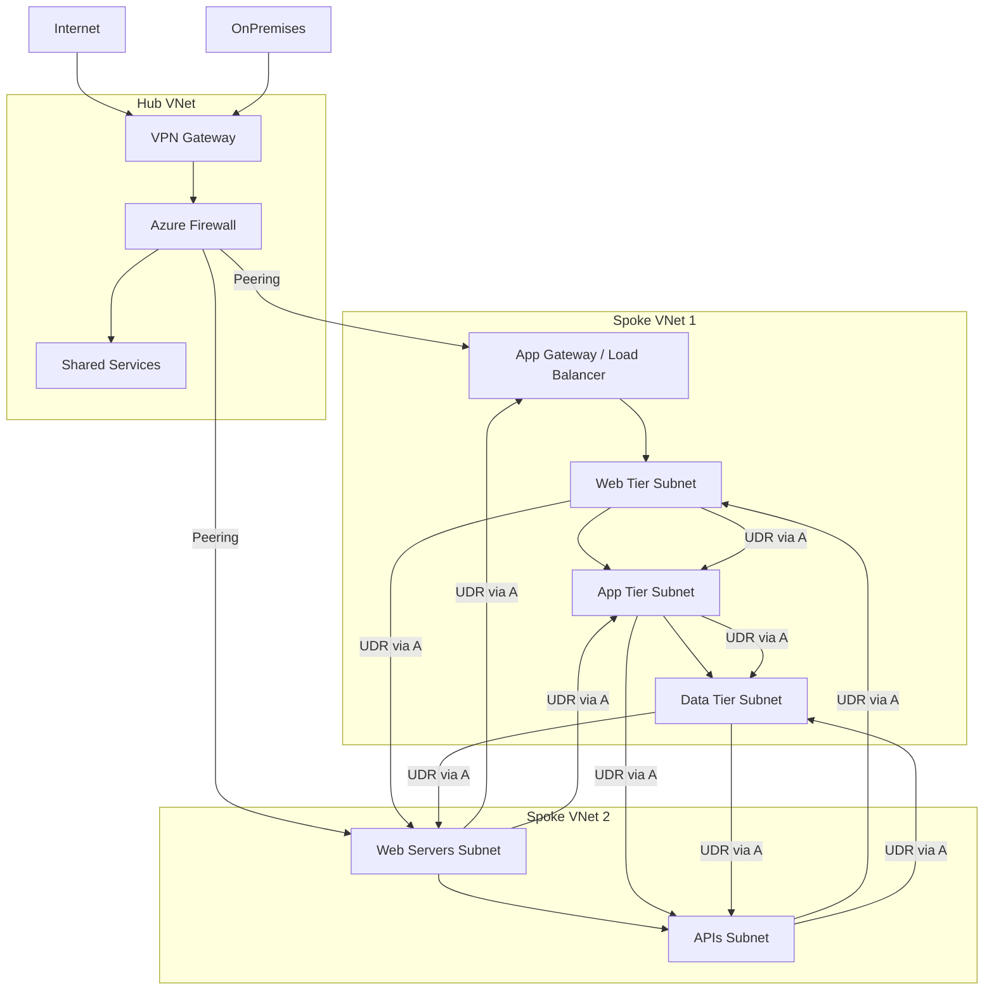
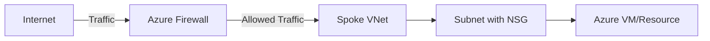
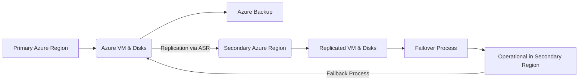
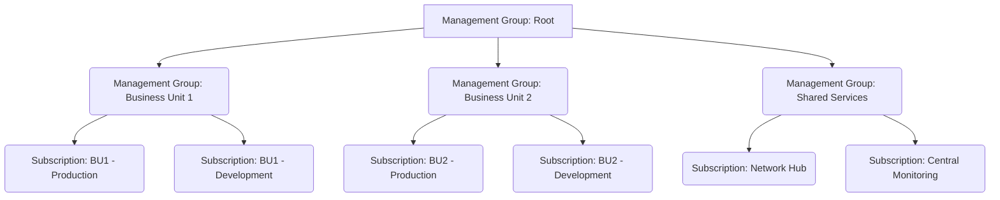

# Disclaimer
This repository contains information collected from various online sources and/or generated by AI assistants. The content provided here is for informational purposes only and is intended to serve as a general reference on various topics.


# Azure Architecture and Administration: A Comprehensive Guide

Microsoft Azure is a leading cloud computing platform offering a vast array of services that enable organizations to build, deploy, and manage applications and services through Microsoft-managed data centers. Understanding Azure's fundamental architectural components and administrative practices is crucial for designing, implementing, and maintaining scalable, secure, and cost-effective cloud solutions. This document provides a comprehensive guide covering key architectural concepts, administrative units, security frameworks, operational tools, and deployment strategies within the Azure ecosystem.

## Table of Contents

  * [Introduction](#introduction)
  * [Overview of Microsoft Azure](#overview-of-microsoft-azure)
  * [Azure Foundational Architecture: Management Hierarchy](#azure-foundational-architecture-management-hierarchy)
      * [Azure Subscriptions](#azure-subscriptions)
          * [Subscription Concepts](#subscription-concepts)
          * [Managing Subscriptions](#managing-subscriptions)
          * [Billing and Cost Management](#billing-and-cost-management)
          * [Subscription Governance and Policies](#subscription-governance-and-policies)
      * [Management Groups](#management-groups)
      * [Resource Groups](#resource-groups)
          * [Resource Group Fundamentals](#resource-group-fundamentals)
          * [Best Practices for Resource Groups](#best-practices-for-resource-groups)
          * [Resource Tagging and Organization](#resource-tagging-and-organization)
      * [Resources](#resources)
  * [Azure Network Architecture: Hub-and-Spoke Model](#azure-network-architecture-hub-and-spoke-model)
      * [Conceptual Overview](#conceptual-overview)
      * [Design Considerations](#design-considerations)
      * [Implementation Details](#implementation-details)
      * [Mermaid Diagram of Hub-and-Spoke Network](#mermaid-diagram-of-hub-and-spoke-network)
      * [Table: Hub-and-Spoke Configuration Comparison](#table-hub-and-spoke-configuration-comparison)
  * [Azure Security Architecture and Management](#azure-security-architecture-and-management)
      * [Identity and Access Management (IAM)](#identity-and-access-management-iam)
      * [Role-Based Access Control (RBAC)](#role-based-access-control-rbac)
      * [Network Security Groups (NSGs) and Azure Firewall](#network-security-groups-nsgs-and-azure-firewall)
      * [Encryption and Data Protection](#encryption-and-data-protection)
      * [Security Center and Sentinel](#security-center-and-sentinel)
      * [Best Practices in Azure Security](#best-practices-in-azure-security)
  * [Governance, Compliance, and Policy Management](#governance-compliance-and-policy-management)
      * [Azure Policy Overview](#azure-policy-overview)
      * [Cost Management and Budgeting](#cost-management-and-budgeting)
      * [Compliance Certifications and Standards](#compliance-certifications-and-standards)
  * [Management and Monitoring Tools](#management-and-monitoring-tools)
      * [Azure Monitor and Log Analytics](#azure-monitor-and-log-analytics)
      * [Application Insights](#application-insights)
      * [Azure Service Health](#azure-service-health)
      * [Automation with Azure Automation and Runbooks](#automation-with-azure-automation-and-runbooks)
  * [Automation, DevOps, and Deployment Architectures](#automation-devops-and-deployment-architectures)
      * [Azure Resource Manager (ARM) Templates](#azure-resource-manager-arm-templates)
      * [Azure CLI, PowerShell, and SDKs](#azure-cli-powershell-and-sdks)
      * [Continuous Integration and Continuous Deployment (CI/CD)](#continuous-integration-and-continuous-deployment-cicd)
      * [Infrastructure as Code (IaC)](#infrastructure-as-code-iac)
  * [Backups and Disaster Recovery Architecture](#backups-and-disaster-recovery-architecture)
      * [Overview](#overview)
      * [Azure Backup for VMs and Disks](#azure-backup-for-vms-and-disks)
      * [Best Practices for Backups](#best-practices-for-backups)
      * [Disaster Recovery with Azure Site Recovery](#disaster-recovery-with-azure-site-recovery)
      * [Workflow for Implementing Backups and Disaster Recovery](#workflow-for-implementing-backups-and-disaster-recovery)
  * [Case Studies and Practical Scenarios](#case-studies-and-practical-scenarios)
      * [Enterprise Multi-Subscription Strategy](#enterprise-multi-subscription-strategy)
      * [Deploying a Hub-and-Spoke Network](#deploying-a-hub-and-spoke-network)
      * [Securing a Complex Azure Environment](#securing-a-complex-azure-environment)
  * [Best Practices and Recommendations](#best-practices-and-recommendations)
  * [Advanced Topics in Azure Administration](#advanced-topics-in-azure-administration)
      * [Multi-Region Deployments](#multi-region-deployments)
      * [Hybrid Cloud Scenarios](#hybrid-cloud-scenarios)
      * [Disaster Recovery and Business Continuity](#disaster-recovery-and-business-continuity)
      * [Performance Optimization](#performance-optimization)
  * [Deployment Scenarios and Example Workflows](#deployment-scenarios-and-example-workflows)
      * [Workflow: Deploying a Web Application in Azure](#workflow-deploying-a-web-application-in-azure)
      * [Workflow: Implementing a Hub-and-Spoke Network](#workflow-implementing-a-hub-and-spoke-network)
  * [Troubleshooting and Maintenance](#troubleshooting-and-maintenance)
  * [Conclusion](#conclusion)
  * [References](#references)

## Introduction

In today’s cloud-centric IT landscape, Microsoft Azure stands out as one of the most robust and flexible cloud service providers. This document provides an exhaustive guide on Azure administration with a particular focus on foundational architectural components and how they are managed and secured. We will delve into:

  * **Foundational Architecture:** Understanding the hierarchy of management units like Subscriptions and Resource Groups.
  * **Network Architecture:** Exploring common patterns like the Hub-and-Spoke model.
  * **Security Architecture:** Overview of Azure's security mechanisms including IAM, RBAC, NSGs, and Firewalls.
  * **Operational Architecture:** Tools for monitoring, management, and automation.
  * **Deployment Architecture:** Strategies using IaC, ARM templates, and CI/CD.
  * **Resilience Architecture:** Implementing Backups and Disaster Recovery.

This guide is intended for IT administrators, cloud architects, and DevOps professionals who are responsible for designing, deploying, managing, and securing Azure environments.

## Overview of Microsoft Azure

Microsoft Azure is a leading cloud computing platform that provides an extensive range of services including computing, analytics, storage, and networking. Azure’s infrastructure is built around a highly resilient, globally distributed architecture that allows organizations to deploy mission-critical applications and services with high availability and security.

Key attributes of Azure include:

  * **Scalability:** Easily scale resources up or down to meet fluctuating demands.
  * **Global Reach:** Data centers in multiple geographic regions ensure low latency and compliance with local regulations.
  * **Security:** Built-in security features, robust identity management, and compliance certifications across various industries.
  * **Integration:** Seamless integration with other Microsoft products, as well as third-party tools and services.
  * **Automation and DevOps:** Powerful automation tools such as ARM templates, Azure CLI, and integration with popular CI/CD pipelines.

The following sections dive deeper into the administrative and architectural aspects of managing Azure resources, starting with the foundational management hierarchy.

## Azure Foundational Architecture: Management Hierarchy

Azure organizes resources in a hierarchical structure that defines scope for management, governance, and billing. Understanding this hierarchy is fundamental to designing a well-structured Azure environment. The key levels are Management Groups, Subscriptions, Resource Groups, and Resources.

### Azure Subscriptions

Azure subscriptions serve as a logical container for all your Azure resources and act as a primary administrative and billing unit.

#### Subscription Concepts

Azure subscriptions are essential for several reasons:

  * **Billing Boundaries:** Each subscription acts as a billing unit. Costs incurred by resources are tracked and billed under the associated subscription.
  * **Security and Management Boundaries:** Subscriptions help define the scope of policies, role-based access control (RBAC), and compliance configurations.
  * **Resource Isolation:** Using multiple subscriptions can help isolate environments (e.g., development, testing, production) to mitigate risk and improve manageability.
  * **Quota Management:** Each subscription has resource limits and quotas that help manage resource consumption effectively.

A subscription can contain one or more resource groups, and each resource group is a logical container that holds related resources for an application or workload.

#### Managing Subscriptions

Managing subscriptions efficiently is key to successful Azure administration. Here are some strategies and tools to consider:

  * **Azure Portal:** The Azure Portal offers an intuitive user interface for subscription management, allowing administrators to create, modify, and delete subscriptions.
  * **Azure CLI & PowerShell:** For automated and script-based management, Azure CLI and Azure PowerShell modules provide powerful commands to manage subscriptions programmatically.
  * **Management Groups:** When managing multiple subscriptions, you can use management groups to create a hierarchy that helps organize and apply policies uniformly across all subscriptions.
  * **Enterprise Agreement (EA):** Organizations that have an Enterprise Agreement with Microsoft often manage subscriptions centrally with additional governance controls, cost management dashboards, and reporting tools.

#### Billing and Cost Management

Billing in Azure is inherently linked to subscriptions. Here are some key points:

  * **Cost Allocation:** Each resource usage within a subscription is tracked, allowing for detailed cost analysis.
  * **Budgets and Alerts:** You can set budgets and receive alerts if spending exceeds defined thresholds.
  * **Cost Analysis Tools:** Azure provides built-in tools such as Cost Management + Billing to monitor and analyze expenses.
  * **Billing APIs:** For advanced scenarios, Azure’s billing APIs enable integration with external cost management systems.

Below is a table summarizing key aspects of Azure billing and cost management:

| **Aspect** | **Details** |
| :-------------------- | :-------------------------------------------------------------------------------------------------------------------------------------------- |
| Billing Units         | Each subscription acts as a distinct billing unit.                                                                                          |
| Budget Management     | Set budgets at the subscription level; configure alerts to notify stakeholders of cost overruns.                                              |
| Cost Analysis         | Detailed dashboards and reports for tracking usage by service, resource group, or project.                                                    |
| Billing APIs          | Integration points for third-party tools and custom cost-management solutions.                                                                |
| Enterprise Agreements | Centralized management and reporting for organizations under an Enterprise Agreement.                                                         |

#### Subscription Governance and Policies

Effective governance is essential for managing a secure and cost-efficient cloud environment. Key governance mechanisms include:

  * **Azure Policy:** Enforce standards and assess compliance across your resources by applying policies at the subscription level. This ensures that all resources adhere to organizational standards.
  * **Resource Locks:** Prevent accidental deletion or modification of critical resources by applying locks at the subscription or resource group level.
  * **Access Reviews:** Regularly review and audit access privileges to ensure that only authorized users have control over the subscription.
  * **Tagging Strategies:** Use resource tagging to enforce organization standards, cost allocation, and operational policies.

By adopting these governance strategies, organizations can ensure that their subscriptions remain compliant, secure, and cost-effective.

### Management Groups

Management groups are containers that help you manage access, policies, and compliance across multiple subscriptions. They form a hierarchy that can be used to logically group subscriptions. Policies and RBAC roles inherited from a management group are applied to all subscriptions within that group. This provides a level of scope above subscriptions, useful for large organizations with many subscriptions.

### Resource Groups

Resource groups are logical containers that help organize and manage resources *within* a subscription.

#### Resource Group Fundamentals

Resource groups play a crucial role in:

  * **Grouping Related Resources:** Organizing resources that share a common lifecycle, such as all components of a web application (VMs, databases, networking).
  * **Simplifying Management:** Applying policies, role assignments, and cost management controls at the resource group level.
  * **Enabling Resource Consistency:** Ensuring that resources within a group are deployed, updated, and decommissioned together.

Key concepts include:

  * **Logical Grouping:** Unlike physical grouping, resource groups are a logical construct that aids in organization and management.
  * **Lifecycle Management:** Resources within the same group often share similar deployment, monitoring, and management processes.
  * **Dependency Management:** Grouping resources that are interdependent can simplify configuration and maintenance.

#### Best Practices for Resource Groups

When designing and implementing resource groups, consider the following best practices:

  * **Align with Application Lifecycles:** Create resource groups that reflect the lifecycle of your applications or workloads. For example, separate groups for development, staging, and production environments of the same application.
  * **Apply Role-Based Access Control (RBAC):** Delegate management responsibilities by assigning roles at the resource group level. This minimizes the risk of unauthorized changes to specific sets of resources.
  * **Use Consistent Naming Conventions:** Implement a naming strategy that includes key information (e.g., environment, project, and region) to easily identify and manage resources within a group.
  * **Monitor and Audit Regularly:** Use Azure Monitor and Log Analytics to track changes and ensure compliance with organizational policies applied at the resource group level.
  * **Tagging:** Implement a robust tagging strategy for categorization, cost tracking, and automation purposes across resources within the group.

#### Resource Tagging and Organization

Tagging is a fundamental aspect of resource group and resource management. Tags are key-value pairs assigned to Azure resources and resource groups to facilitate:

  * **Cost Tracking:** Allocate costs to departments, projects, or teams.
  * **Automation:** Use tags as selectors in automation scripts and policies.
  * **Reporting:** Generate detailed reports on resource usage, performance, and compliance.

Below is an example table outlining a recommended tagging strategy:

| **Tag Key** | **Description** | **Example Values** |
| :------------ | :------------------------------------------ | :------------------------------ |
| Environment   | Indicates the deployment environment        | Production, Staging, Dev        |
| Project       | Identifies the associated project           | WebApp, MobileApp, Analytics    |
| Department    | Organizational department responsible       | IT, Finance, HR                 |
| Owner         | Primary owner or team responsible           | user@example.com, TeamX         |
| Cost Center   | Cost center for budgeting and tracking      | CC1001, CC1002                  |
| Compliance    | Regulatory or compliance requirement        | GDPR, HIPAA                     |

### Resources

Resources are the individual instances of Azure services that you create within Resource Groups, such as Virtual Machines, Storage Accounts, Virtual Networks, Databases, etc. They are the fundamental building blocks of your Azure architecture.

## Azure Network Architecture: Hub-and-Spoke Model

Designing a robust and secure network is a critical part of your Azure architecture. The Hub-and-Spoke model is a widely adopted topology.

### Conceptual Overview

The hub-and-spoke architecture is a common network topology design used in Azure to simplify network management, enhance security, and optimize connectivity. In this model:

  * **Hub:** Acts as a central point that contains shared services, such as identity providers, VPN gateways, and firewalls.
  * **Spokes:** Represent individual workloads or environments (e.g., development, production) that connect to the hub for access to shared services and connectivity to other networks (like on-premises or the internet, via the hub).

This design offers numerous benefits:

  * **Centralized Security:** Shared security controls and policies can be applied and managed at the hub level (e.g., a single Azure Firewall protecting all spoke traffic).
  * **Reduced Complexity:** Spoke networks can be managed independently while still benefiting from the centralized services in the hub.
  * **Cost Optimization:** Centralizing shared services (like VPN gateways or ExpressRoute circuits) reduces duplication and minimizes overall costs.
  * **Scalability:** New spokes can be easily added to the hub as new workloads or environments are required.

### Design Considerations

When designing a hub-and-spoke architecture in Azure, several factors must be considered:

1.  **Network Isolation:**

      * Ensure that each spoke is isolated from other spokes by default. Communication between spokes should typically route *through* the hub, where it can be inspected and controlled by the central firewall.
      * Use Network Security Groups (NSGs) within spokes and potentially in the hub to enforce isolation and traffic rules at the subnet or NIC level.

2.  **Connectivity:**

      * Establish robust connectivity between the hub and spokes using Virtual Network (VNet) peering. Peering provides low-latency, high-bandwidth connections between VNets.
      * Configure routing (User Defined Routes - UDRs) in spoke VNets to forward traffic destined for other spokes, on-premises networks, or the internet through the hub's firewall.
      * Ensure low latency and high throughput, particularly for applications requiring real-time data transfer.

3.  **Shared Services:**

      * Centralize services such as DNS, Active Directory Domain Services (AD DS), identity providers, and monitoring infrastructure in the hub VNet.
      * Configure service endpoints and private links to maintain secure access from spokes to shared Azure platform services.

4.  **Scalability:**

      * Design the hub VNet and its resources with scalability in mind to accommodate increasing numbers of spoke networks and growing traffic volume.
      * Consider using Azure Load Balancer or Application Gateway for distributing traffic within the hub or to external services.

5.  **Security and Compliance:**

      * Implement strict access controls using RBAC to manage who can configure network resources.
      * Deploy a central firewall (Azure Firewall, Network Virtual Appliance) in the hub to inspect and filter traffic between spokes, and between spokes and external networks.
      * Monitor inter-VNet traffic and firewall logs routinely.
      * Regularly review network configurations to ensure compliance with security policies.

### Implementation Details

The following steps outline a common approach to implement a hub-and-spoke network configuration in Azure:

1.  **Create the Hub VNet:**

      * Define an address space that is large enough to accommodate shared services and potential future expansion.
      * Deploy critical shared network infrastructure services (e.g., Azure Firewall subnet, Gateway Subnet for VPN/ExpressRoute) within this VNet.

2.  **Create the Spoke VNets:**

      * Allocate separate, non-overlapping address spaces for each spoke VNet to prevent IP conflicts.
      * Plan the subnets within each spoke based on application tiers or workload requirements.

3.  **Configure VNet Peering:**

      * Set up peering connections between the hub VNet and each spoke VNet. Ensure that "Allow gateway transit" is enabled on the hub peering link (if using a VPN/ExpressRoute gateway in the hub) and "Allow remote gateways" is enabled on the spoke peering links.
      * Ensure that "Allow forwarded traffic" is enabled on the peering links if traffic needs to flow between peered networks via an appliance in one of the networks (e.g., traffic from Spoke A to Spoke B routing through the Hub firewall).

4.  **Deploy Shared Services:**

      * Implement services such as Azure Firewall, VPN Gateway, and Azure Bastion in the hub VNet.
      * Configure these services to handle and inspect traffic flows originating from or destined for the spoke VNets.

5.  **Configure Routing (UDRs):**

      * Create User Defined Routes (UDRs) and associate them with subnets in the spoke VNets. These UDRs should direct traffic that needs to be inspected (e.g., traffic to other spokes, on-premises, or the internet) to the private IP address of the Azure Firewall instance in the hub.

6.  **Enforce Security Controls:**

      * Apply NSGs to individual subnets or network interfaces in both the hub and spoke VNets to filter traffic based on port, protocol, and source/destination IP addresses.
      * Configure Azure Firewall rules to inspect and control traffic flowing through it.
      * Utilize Azure Policy to enforce consistent network configurations and security settings.

7.  **Monitor and Validate:**

      * Use Azure Monitor, Network Watcher, and Firewall logs to track network performance, monitor traffic flows, and detect security events.

### Mermaid Diagram of Hub-and-Spoke Network

Below is a Mermaid diagram illustrating a typical hub-and-spoke architecture:



*Note: The diagram illustrates traffic routing between spokes via the firewall (A) in the hub, enabled by VNet peering and UDRs.*

### Table: Hub-and-Spoke Configuration Comparison

The table below compares key configuration elements between a hub-and-spoke model and a flat network model:

| **Feature** | **Hub-and-Spoke Architecture** | **Flat Network Architecture** |
| :------------------------ | :---------------------------------------------------------------------------- | :----------------------------------------------------------------------------- |
| **Scalability** | High – Centralized management allows adding new spokes easily                 | Moderate – Adding new resources can complicate routing                       |
| **Security** | Enhanced – Centralized security controls in the hub                           | Variable – Decentralized security requires individual configuration           |
| **Management Complexity** | Reduced – Shared services and policies simplify management across spokes      | Increased – Each resource/subnet requires independent security/routing config |
| **Cost Optimization** | Optimized – Shared services reduce duplication (e.g., one VPN gateway for all) | Potentially higher – Duplication of services increases cost                    |
| **Deployment Flexibility** | High – Spokes can be deployed independently with controlled connectivity      | Lower – Changes to routing/security affect the entire network                  |

## Azure Security Architecture and Management

Security is a cornerstone of Azure administration and architecture design. Azure offers a multitude of tools and frameworks designed to protect your environment from threats while ensuring compliance with various regulations.

### Identity and Access Management (IAM)

IAM is the process of ensuring the right individuals have the appropriate access to technology resources. In Azure, IAM is implemented primarily through:

  * **Azure Active Directory (Azure AD):** Provides a cloud-based identity and access management service for users, groups, and applications. It acts as the central directory for managing identities and their permissions.
  * **Single Sign-On (SSO):** Simplifies access across multiple applications and services (both Azure and third-party) by allowing users to log in once with a single set of credentials.
  * **Multi-Factor Authentication (MFA):** Adds an extra layer of security by requiring users to provide more than one form of verification before granting access.
  * **Conditional Access:** Enforces policies that control access to resources based on specific conditions, such as user location, device state, application being accessed, and sign-in risk levels.

Azure AD integrates with many third-party services, making it a robust foundation for identity management in the cloud and hybrid environments.

### Role-Based Access Control (RBAC)

RBAC is a key mechanism in Azure security for managing who has what permissions to Azure resources. It allows you to assign granular permissions to users, groups, service principals, or managed identities based on their roles within a specific scope. Key points include:

  * **Built-in Roles:** Azure offers a variety of built-in roles (e.g., Owner, Contributor, Reader, Virtual Machine Contributor) with predefined sets of permissions.
  * **Custom Roles:** For more specific requirements, administrators can create custom roles that define tailored permission sets.
  * **Scope of Access:** RBAC assignments can be applied at various levels of the Azure hierarchy: Management Group, Subscription, Resource Group, or individual Resource. Permissions assigned at a higher level are inherited by levels below it.
  * **Principle of Least Privilege:** A core security principle that should guide RBAC implementation – grant users only the minimum permissions necessary to perform their job functions.
  * **Audit and Compliance:** RBAC assignments are logged and auditable, providing a clear record of who has access to what resources for compliance purposes.

Below is an example table summarizing common built-in RBAC roles and their primary functions:

| **Role** | **Permissions** | **Typical Use Cases** |
| :---------------- | :--------------------------------------------------- | :--------------------------------------------- |
| Owner             | Full management, including RBAC assignment           | Administrators and IT leads                    |
| Contributor       | Create and manage all types of Azure resources       | DevOps teams, application administrators       |
| Reader            | View-only access to all Azure resources              | Auditors, reviewers, or support teams          |
| Virtual Machine Contributor | Create and manage virtual machines          | VM administrators                              |
| Custom Roles      | Defined by specific business requirements            | Specialized roles for granular control         |

### Network Security Groups (NSGs) and Azure Firewall

NSGs and Azure Firewall are critical components of network security within Azure Virtual Networks, allowing you to control traffic flow.

#### Network Security Groups (NSGs)

NSGs are stateful packet filters that allow you to control network traffic to and from Azure resources by creating rules that permit or deny traffic based on various factors. Key features include:

  * **Inbound and Outbound Rules:** Define rules for both incoming and outgoing traffic.
  * **Rule Properties:** Rules are defined by source and destination IP addresses (individual, CIDR blocks, Service Tags, Application Security Groups), ports, protocols, and direction (inbound/outbound).
  * **Priority:** Rules are processed based on priority numbers (lower numbers are processed first).
  * **Application of NSGs:** NSGs can be applied at the subnet level (affecting all resources in that subnet) or associated directly with a Virtual Machine's Network Interface Card (NIC).
  * **Default Security Rules:** Every NSG comes with a set of default rules that can be overridden by higher-priority custom rules.

#### Azure Firewall

Azure Firewall is a managed, cloud-based network security service that protects your Azure Virtual Network resources. It's a stateful firewall-as-a-service with built-in high availability and cloud scalability. Features include:

  * **High Availability:** Built-in availability and scalability to handle fluctuating traffic loads.
  * **Centralized Policy Management:** Enforces network connectivity policies across multiple Azure Virtual Networks and subscriptions.
  * **Threat Intelligence:** Integrates with Microsoft Threat Intelligence feeds to block known malicious IP addresses and domains.
  * **Logging and Monitoring:** Provides comprehensive logging and real-time alerts through Azure Monitor.
  * **Network and Application Rule Filtering:** Allows filtering traffic based on Layer 3/4 protocols (Network Rules) and Layer 7 protocols (Application Rules).

Below is a simple diagram depicting NSG and Firewall interaction in a common scenario:



*Note: Traffic from the internet first hits the Azure Firewall for centralized inspection before being routed to a Spoke VNet. NSGs on subnets within the spoke provide an additional layer of security.*

### Encryption and Data Protection

Data protection in Azure involves several layers of encryption to secure data at various stages:

  * **At-Rest Encryption:** Azure Storage, databases (like Azure SQL Database and Cosmos DB), and managed disks automatically encrypt data at rest using industry-standard encryption algorithms (like AES-256). You can often use Microsoft-managed keys or customer-managed keys (CMK) via Azure Key Vault.
  * **In-Transit Encryption:** Data transmitted between services within Azure and between on-premises networks and Azure is encrypted using industry-standard protocols like TLS/SSL, IPSec VPNs, or ExpressRoute.
  * **Key Management:** Azure Key Vault is a cloud service for securely storing and managing cryptographic keys, secrets, and certificates. It's essential for managing keys used for CMK and application secrets.
  * **Disk Encryption:** Azure Disk Encryption uses BitLocker for Windows VMs and DM-Crypt for Linux VMs to encrypt the OS and data disks attached to Azure VMs. This provides volume encryption for enhanced data protection.

### Security Center and Sentinel

Azure provides advanced tools for continuous security posture management, threat detection, and response:

  * **Microsoft Defender for Cloud (formerly Azure Security Center):** Provides a unified security management system that strengthens the security posture of your cloud resources. It offers security recommendations, performs vulnerability assessments, and provides threat protection for various Azure services and hybrid workloads.
  * **Microsoft Sentinel (formerly Azure Sentinel):** A cloud-native Security Information and Event Management (SIEM) and Security Orchestration, Automation, and Response (SOAR) solution. It uses AI and machine learning to collect security data across your enterprise, detect anomalies and threats, investigate incidents, and automate responses.

### Best Practices in Azure Security

To maximize security in your Azure environment:

  * **Implement a Zero Trust Model:** Assume breach and verify explicitly. Enforce least-privilege access, micro-segmentation, and continuous monitoring.
  * **Enable MFA for all accounts:** Especially for administrative users.
  * **Use Conditional Access Policies:** To enforce strong authentication and access controls based on context.
  * **Regularly Audit RBAC Assignments:** And remove unnecessary privileges based on the principle of least privilege.
  * **Apply Network Security Groups (NSGs) and Azure Firewall:** To control network traffic flow effectively.
  * **Keep Software and OS Images Up-to-Date:** Implement a robust patch management strategy.
  * **Utilize Azure Security Center (Microsoft Defender for Cloud):** For continuous security posture assessment and recommendations.
  * **Monitor Security Alerts and Integrate with Automated Remediation:** Use Azure Sentinel for threat detection and response.
  * **Implement Encryption:** Encrypt data at rest and in transit.
  * **Use Azure Key Vault:** For secure key and secret management.

-----

## Governance, Compliance, and Policy Management

Establishing strong governance is crucial for managing a secure, compliant, and cost-efficient Azure environment, especially at scale.

### Azure Policy Overview

Azure Policy is a service that allows you to create, assign, and manage policies that enforce rules and effects over your resources. It helps to ensure that resources stay compliant with organizational standards, regulatory requirements, and service level agreements. With Azure Policy, you can:

  * **Enforce Organizational Standards:** Define rules that resources must adhere to (e.g., allowed resource types, allowed locations, mandatory tags).
  * **Assess Compliance:** Get a view of which resources are compliant and which are not.
  * **Audit and Remediate:** Policies can have effects that audit non-compliant resources or automatically remediate them to bring them back into compliance.
  * **Policy Definitions and Assignments:** Use built-in policy definitions or create custom ones. Assign policies at various scopes (Management Group, Subscription, Resource Group).

### Cost Management and Budgeting

Effective cost management is crucial in a cloud environment where resources are consumed on demand. Azure offers robust tools for monitoring, analyzing, and optimizing cloud spending:

  * **Azure Cost Management + Billing:** Provides dashboards and reports to monitor and analyze expenses by service, resource group, tags, or departments.
  * **Budgets:** Define spending limits at various scopes (Management Group, Subscription, Resource Group) and trigger alerts if thresholds are exceeded.
  * **Recommendations:** Azure Advisor provides cost-saving recommendations by analyzing resource utilization (e.g., identifying underutilized VMs).
  * **Tag-Based Cost Allocation:** Implement a consistent tagging strategy to accurately attribute costs to specific projects, departments, or teams.
  * **Reserved Instances and Savings Plans:** Commit to using certain resources for a period (1 or 3 years) to get significant cost reductions compared to pay-as-you-go rates.

### Compliance Certifications and Standards

Azure complies with a wide range of industry standards and regulations globally. This helps organizations meet their own compliance obligations when using Azure services. Examples include:

  * **ISO/IEC 27001, 27017, 27018, 27701:** International standards for information security management, cloud security, privacy information management.
  * **GDPR:** European Union data protection regulations.
  * **HIPAA:** U.S. healthcare data security standards.
  * **SOC 1, 2, 3:** Service Organization Control reports.
  * **FedRAMP and DoD:** Compliance frameworks for U.S. government agencies.

Azure Compliance Manager in Microsoft Defender for Cloud helps you manage your compliance posture by providing assessments based on common regulatory standards and offering recommendations for improvement.

-----

## Management and Monitoring Tools

Azure provides a comprehensive suite of tools for managing and monitoring your cloud resources, ensuring performance, availability, and health.

### Azure Monitor and Log Analytics

Azure Monitor provides a comprehensive solution for collecting, analyzing, and acting on telemetry from your cloud and on-premises environments. Its components include:

  * **Metrics:** Numerical values collected at regular intervals that describe some aspect of a system at a particular time (e.g., CPU utilization, network in/out).
  * **Logs:** Event-based data collected from applications, operating systems, and Azure resources. Logs contain different types of data organized into records with different sets of properties (e.g., system event logs, application trace logs, diagnostic logs).
  * **Alerts:** Configurable rules that trigger notifications or automated actions in response to specific conditions detected in metrics or logs.

Azure Log Analytics is a service within Azure Monitor used to query and analyze log data. It uses the Kusto Query Language (KQL) to perform complex analysis and identify patterns or issues.

### Application Insights

Application Insights is an extensible Application Performance Management (APM) service for developers and DevOps professionals. It monitors your live web applications and provides tools to:

  * **Monitor Application Performance:** Detect performance anomalies, diagnose issues, and understand user behavior.
  * **Usage Analytics:** Understand how users interact with your applications, where they are located, and which features they use most.
  * **End-to-End Tracing:** Trace requests across distributed systems to identify bottlenecks and failures.
  * **Availability Testing:** Monitor the availability of your web application from various locations.

### Azure Service Health

Azure Service Health provides personalized alerts and guidance when Azure service issues affect your environment. It informs you about:

  * **Planned Maintenance:** Scheduled updates or downtime for Azure services.
  * **Service Incidents:** Real-time information about active service disruptions that may impact your resources.
  * **Health Advisories:** Recommendations and updates from Azure support and engineering teams regarding potential issues or required actions.

### Automation with Azure Automation and Runbooks

Automation in Azure is essential for managing repetitive tasks, ensuring consistency, and responding to events automatically. Azure Automation provides a service for:

  * **Runbooks:** Scripted processes (written in PowerShell, Python, Graphical Runbooks, etc.) that automate tasks such as resource provisioning, configuration management, remediation of alerts, and routine maintenance.
  * **Update Management:** Automate patch deployment and software updates for Azure VMs and on-premises machines.
  * **Configuration Management (Azure Automation State Configuration):** Manage the desired state configuration of VMs using PowerShell DSC.
  * **Process Automation:** Integration with IT service management (ITSM) tools to streamline operational workflows.

-----

## Automation, DevOps, and Deployment Architectures

Azure provides a rich set of tools and services to support Automation, DevOps practices, and various deployment architectures, enabling faster and more reliable delivery of applications and infrastructure.

### Azure Resource Manager (ARM) Templates

ARM templates are JSON-based Infrastructure as Code (IaC) files that declaratively define the infrastructure and configuration for your Azure resources. They enable:

  * **Declarative Syntax:** Specify *what* resources are needed and their desired configuration, rather than writing imperative scripts that define *how* to deploy them.
  * **Idempotence:** Deploying the same template multiple times will result in the same resource state, making deployments repeatable and consistent.
  * **Version Control:** Store templates in source control systems such as GitHub or Azure Repos to track changes and collaborate.
  * **Repeatable Deployments:** Ensure consistency across multiple environments (development, staging, production).
  * **Parameterization:** Customize deployments by defining parameters, variables, and outputs, making templates reusable for different scenarios.
  * **Dependency Management:** ARM templates automatically handle dependencies between resources, ensuring they are deployed in the correct order.

Below is a simplified ARM template snippet for deploying an Azure Storage Account:

```json
{
  "$schema": "https://schema.management.azure.com/schemas/2019-04-01/deploymentTemplate.json#",
  "contentVersion": "1.0.0.0",
  "parameters": {
    "storageAccountName": {
      "type": "string",
      "metadata": {
        "description": "Name of the storage account."
      }
    }
  },
  "resources": [
    {
      "type": "Microsoft.Storage/storageAccounts",
      "apiVersion": "2021-04-01",
      "name": "[parameters('storageAccountName')]",
      "location": "[resourceGroup().location]",
      "sku": {
        "name": "Standard_LRS"
      },
      "kind": "StorageV2",
      "properties": {}
    }
  ]
}
```

### Azure CLI, PowerShell, and SDKs

Automation and scripting are key for efficient Azure administration and integrating with deployment pipelines:

  * **Azure CLI:** A cross-platform command-line tool that allows you to manage Azure resources from a terminal or script. It is available for Windows, macOS, and Linux.
  * **Azure PowerShell:** A set of cmdlets for managing Azure resources via PowerShell, a task automation and configuration management framework.
  * **SDKs and REST APIs:** Programmatically interact with Azure services using Software Development Kits (SDKs) available for various programming languages (e.g., .NET, Java, Python, Node.js) or directly via the Azure REST APIs.

These tools are used to deploy ARM templates, manage resources, configure settings, and integrate Azure operations into custom scripts or applications.

### Continuous Integration and Continuous Deployment (CI/CD)

Azure integrates seamlessly with CI/CD pipelines, allowing you to automate the build, test, and deployment processes for both applications and infrastructure. This is a core practice in DevOps.

  * **Azure DevOps:** Provides a full suite of services for CI/CD, including Azure Pipelines (for building, testing, and deploying code), Azure Repos (for Git repositories), Azure Boards (for work item tracking), and Azure Artifacts (for package management).
  * **GitHub Actions:** Automate workflows directly from GitHub repositories to build, test, and deploy code to Azure.
  * **Integration with Third-Party Tools:** Azure supports integration with other popular CI/CD platforms like Jenkins, Travis CI, CircleCI, and more.

A typical CI/CD pipeline for Azure infrastructure might involve: storing ARM templates (or Terraform code) in Git, triggering an automated pipeline on commit, running linting and validation checks, generating an execution plan, requiring approval, and then applying the plan to deploy or update infrastructure.

### Infrastructure as Code (IaC)

IaC is the practice of managing and provisioning computing infrastructure through machine-readable definition files. ARM templates are Azure's native IaC offering, but other tools like Terraform and Bicep are also widely used with Azure.

  * **Benefits:** Increases consistency, reduces manual errors, enables version control and peer review of infrastructure configurations, and accelerates deployment times.
  * **Tools:** Azure Resource Manager templates (JSON), Bicep (a more concise language for deploying ARM templates), Terraform (multi-cloud IaC tool), and Pulumi (IaC using general-purpose programming languages) are popular IaC tools used with Azure.
  * **Best Practices:** Keep IaC definitions in version control; use modular templates/code for reusability and maintainability; integrate IaC deployment into CI/CD pipelines; use parameters and variables to manage differences between environments; secure sensitive data using secret management tools.

-----

## Backups and Disaster Recovery Architecture

Designing for business continuity and disaster recovery (BC/DR) is a critical aspect of any Azure architecture. Azure provides built-in services to help you safeguard your data and applications and ensure they can be recovered in the event of an outage.

### Overview

Ensuring that your critical workloads and data are safe and recoverable is a vital aspect of Azure administration and architecture design. This section discusses key strategies and services used for:

  * **Backups:** Creating regular, automated snapshots and backups of Azure VMs, managed disks, databases, and other data sources.
  * **Disaster Recovery (DR):** Implementing robust DR strategies to minimize downtime (measured by Recovery Time Objective - RTO) and data loss (measured by Recovery Point Objective - RPO) during catastrophic events that affect an entire region or datacenter.

### Azure Backup for VMs and Disks

**Azure Backup** is a built-in service that provides scalable and reliable backup solutions for Azure resources and on-premises workloads. Key components include:

  * **VM Backups:**
    Azure Backup enables you to create recovery points for your Azure VMs, capturing the complete state of the machine (OS disk, data disks, and VM configuration). It supports both Windows and Linux VMs.
  * **Disk Backups:**
    Managed disks can be backed up independently or as part of the VM backup process.
  * **Backup Policies:**
    Configure backup policies to define the frequency of backups (daily, weekly, etc.) and the retention period for recovery points (short-term and long-term). These policies help meet compliance and recovery objectives.
  * **Application-Aware Backups:**
    For workloads like SQL Server or SAP, Azure Backup supports application-consistent backups using VSS (Volume Shadow Copy Service) on Windows or pre/post scripts on Linux to ensure data integrity for applications running on VMs.
  * **Recovery Services Vault:**
    Azure Backup uses a Recovery Services vault as a storage entity that houses backup data.

### Best Practices for Backups

  * **Automate Backup Scheduling:**
    Use Azure Backup policies to automate your backup schedules and reduce manual errors.
  * **Verify Backup Integrity:**
    Regularly test backup restorations to ensure that data can be recovered quickly and successfully in the event of a failure.
  * **Optimize Retention Policies:**
    Balance cost and recovery needs by adjusting retention periods for short-term (operational recovery) and long-term (compliance/archival) backups.
  * **Secure Backup Data:**
    Ensure backup data is encrypted at rest within the Recovery Services vault. Use security features like Multi-User Authorization (MUA) for increased protection.
  * **Monitor Backup Jobs:**
    Use Azure Monitor to track backup job status, identify failures, and configure alerts.

Below is an example table summarizing key aspects of Azure VM and disk backups:

| **Aspect** | **Details** |
| :---------------------- | :-------------------------------------------------------------------------------------------------------------- |
| **Service** | Azure Backup                                                                                                    |
| **Supported Workloads** | Virtual Machines (Windows, Linux), Managed Disks, SQL Server in Azure VMs, SAP HANA in Azure VMs, Azure Files, Azure Blobs, Azure Database for PostgreSQL servers, On-premises servers |
| **Backup Frequency** | Configurable (daily, weekly, monthly, hourly for some workloads)                                              |
| **Retention Period** | Customizable per policy (e.g., 30 days for short-term, multiple years for long-term)                          |
| **Encryption** | Data encrypted at rest in the vault; integration with Azure Key Vault for CMK                                   |
| **Application Consistency** | Supported for applications using VSS or pre/post scripts                                                        |
| **Storage** | Recovery Services Vault                                                                                         |

### Disaster Recovery with Azure Site Recovery

**Azure Site Recovery (ASR)** is the primary service in Azure for orchestrating disaster recovery and ensuring business continuity. It provides automated replication, failover, and failback of Azure VMs, as well as on-premises machines and machines from other clouds, to Azure or a secondary site.

#### Key Features of Azure Site Recovery

  * **Replication:**
    ASR continuously replicates VMs and their disks to a secondary Azure region (for Azure-to-Azure DR), another Azure zone, or an on-premises site. This replication can be configured for both planned (e.g., for maintenance) and unplanned (disaster) failovers.
  * **Orchestration:**
    ASR allows you to create recovery plans that automate the failover process, bringing up interdependent VMs and services in the correct order with minimal downtime. This helps achieve defined RTOs.
  * **Testing:**
    ASR allows you to perform non-disruptive DR drills or test failovers. These tests create copies of your replicated VMs in the secondary region without impacting ongoing replication or production workloads, allowing you to validate your recovery strategy and RTO/RPO without risk.
  * **Failback:**
    Once the primary site or region is restored, ASR enables a controlled failback process to return operations to the original environment.

### Workflow for Implementing Backups and Disaster Recovery

Implementing a comprehensive BC/DR strategy involves several key stages:

#### 1\. Assessment and Planning

  * **Identify Critical Workloads:**
    Determine which applications and data are essential for business operations and require specific RTOs and RPOs.
  * **Define RTOs and RPOs:**
    Establish clear Recovery Time Objectives (maximum acceptable downtime) and Recovery Point Objectives (maximum acceptable data loss) based on business requirements for each critical workload.
  * **Select Services:**
    Choose the appropriate Azure services (Azure Backup for backups, Azure Site Recovery for replication and orchestration) based on your RTO/RPO and workload types.
  * **Design DR Architecture:**
    Plan your DR topology (e.g., Azure-to-Azure replication, hybrid scenarios) and network connectivity in the secondary region.

#### 2\. Configuration

  * **Backup Configuration:**
      * Create a Recovery Services vault.
      * Define and assign backup policies to VMs and other data sources via the Azure Portal, ARM templates, or PowerShell.
      * Configure automated backup schedules and retention periods according to RPO and compliance needs.
  * **Disaster Recovery Setup:**
      * Enable replication for critical VMs using Azure Site Recovery, specifying the target region and replication policy.
      * Establish network mappings between primary and secondary regions.
      * Create and configure recovery plans to automate the failover sequence for interdependent VMs and services.

#### 3\. Testing and Validation

  * **Regular DR Drills:**
    Conduct non-disruptive failover tests using ASR to validate your recovery plans and ensure they meet RTOs. Test failovers should be performed regularly (e.g., quarterly).
  * **Backup Restorations:**
    Periodically perform test restores of VMs and data from backups to verify the integrity of backup data and the restoration process.
  * **Review Test Results:**
    Analyze the results of DR drills and backup tests to identify any issues or areas for improvement in your BC/DR plan and configurations.

#### 4\. Monitoring and Reporting

  * **Use Azure Monitor:**
    Track backup job status, DR replication health, and the status of ASR components.
  * **Set Alerts:**
    Configure alerts for backup failures, replication errors or delays, and the completion or failure of DR drill or failover operations.
  * **Compliance Reporting:**
    Maintain records of backup job success rates, DR test results, and policy adherence for audit and compliance purposes.
  * **Regular Review:**
    Periodically review and update your BC/DR plan and configurations based on changes in your architecture, business requirements, and test results.

Below is a simplified Mermaid diagram illustrating the disaster recovery flow with ASR:



Below is a sample ARM template snippet for deploying an Azure Backup policy:

```json
{
  "$schema": "https://schema.management.azure.com/schemas/2019-04-01/deploymentTemplate.json#",
  "contentVersion": "1.0.0.0",
  "resources": [
    {
      "type": "Microsoft.RecoveryServices/vaults",
      "apiVersion": "2021-08-01",
      "name": "myRecoveryVault", // Replace with a unique vault name
      "location": "[resourceGroup().location]",
      "properties": {}
    },
    {
      "type": "Microsoft.RecoveryServices/vaults/backupPolicies",
      "apiVersion": "2021-08-01",
      "name": "[concat(variables('recoveryVaultName'), '/', 'myBackupPolicy')]", // Policy name
      "properties": {
        "backupManagementType": "AzureIaasVM",
        "schedulePolicy": {
          "schedulePolicyType": "SimpleSchedulePolicy",
          "scheduleRunFrequency": "Daily",
          "scheduleRunTimes": [
            "2025-03-10T02:00:00Z" // Use UTC time
          ]
        },
        "retentionPolicy": {
          "retentionPolicyType": "LongTermRetentionPolicy", // Example using long-term policy, short-term is also available
          "dailySchedule": {
            "retentionTimes": [
              "2025-03-10T02:00:00Z" // Use UTC time
            ],
            "retentionDuration": {
              "count": 30, // Retain daily backups for 30 days
              "durationType": "Days"
            }
          }
        }
      }
    }
  ],
  "variables": {
    "recoveryVaultName": "myRecoveryVault" // Define the vault name as a variable
  }
}
```

-----

## Case Studies and Practical Scenarios

Examining practical scenarios helps illustrate how Azure architectural components and administrative practices are applied in real-world situations.

### Enterprise Multi-Subscription Strategy

For large organizations, managing resources across multiple subscriptions is a common architectural strategy to ensure isolation, decentralize management, and enforce compliance across different business units or environments.

#### Scenario Overview

An enterprise with several distinct business units (e.g., Finance, Marketing, Engineering) needs to manage their Azure resources with:

  * **Separate Billing:** Each business unit tracks and is responsible for its own cloud spending.
  * **Security Isolation:** Resources and data belonging to one business unit are logically and often network-isolated from others.
  * **Decentralized Management:** Business unit IT teams have control over their own resources within defined boundaries.
  * **Centralized Governance:** Core policies and compliance requirements are enforced consistently across all business units.

#### Implementation Details

1.  **Management Group Hierarchy:**
      * Establish a hierarchy of Management Groups (e.g., Root Management Group -\> Business Unit Management Groups -\> Environment Management Groups). This structure mirrors the organizational hierarchy and provides a scope for applying policies and RBAC.
2.  **Subscription Allocation:**
      * Allocate subscriptions to each business unit or project within the Management Group hierarchy. Subscriptions serve as the billing and primary policy/RBAC boundaries.
3.  **Centralized Services Subscription (Optional but Recommended):**
      * Create a dedicated subscription for shared services that all business units consume (e.g., a hub network with shared firewalls, VPN gateways, Azure AD Domain Services, logging and monitoring infrastructure). This subscription is typically managed by a central IT team.
4.  **Policy Assignments:**
      * Apply core Azure Policies (e.g., allowed locations, required tags, enforced security settings) at higher levels of the Management Group hierarchy to ensure consistent governance across all subscriptions.
      * Apply business-unit-specific policies at lower levels.
5.  **RBAC Implementation:**
      * Assign RBAC roles at the appropriate scope (Management Group, Subscription, Resource Group) to delegate permissions according to roles and responsibilities within each business unit and central IT.
6.  **Cost Allocation:**
      * Implement a consistent tagging strategy across all subscriptions to enable accurate cost allocation to business units, projects, or cost centers using Azure Cost Management.

#### Diagram



### Deploying a Hub-and-Spoke Network

A typical use case involves isolating different application environments or business units using a hub-and-spoke network architecture within one or across multiple subscriptions.

#### Scenario Overview

An organization needs to deploy a multi-tier application in Azure with separate environments for Development, Testing, and Production. They want to centralize network security and shared services.

#### Implementation Steps

1.  **Designing the Hub:**
      * Create a dedicated VNet to serve as the hub.
      * Plan subnets for shared services (e.g., GatewaySubnet, AzureFirewallSubnet, Management Subnet).
      * Deploy shared network virtual appliances (NVAs) like Azure Firewall or a third-party firewall, VPN Gateways, ExpressRoute Gateways, and management jump boxes (Azure Bastion) in the hub.
2.  **Creating Spokes:**
      * Create separate VNets for each environment (Dev VNet, Test VNet, Prod VNet). These VNets serve as the spokes.
      * Plan subnets within each spoke based on application tiers (e.g., Web Subnet, Application Subnet, Database Subnet).
3.  **Establishing Connectivity:**
      * Configure VNet peering between the hub VNet and each spoke VNet.
      * Configure UDRs in spoke subnets to route traffic destined for other spokes, on-premises networks, or the internet through the Azure Firewall in the hub.
4.  **Implementing Security:**
      * Deploy NSGs on subnets within each spoke to control traffic flow at a granular level within and between application tiers.
      * Configure Azure Firewall rules to control traffic between spokes, between spokes and the internet, and between spokes and on-premises networks.
      * Use Application Security Groups (ASGs) within NSG rules to group VMs by application function instead of explicit IP addresses.
5.  **Monitoring:**
      * Use Azure Monitor Network Insights, Network Watcher, and Azure Firewall logs to monitor network traffic, performance, and security events.

#### Table of Spoke Characteristics

| **Environment** | **Purpose** | **Access Control** | **Network Isolation** | **Connectivity to Hub** |
| :-------------- | :-------------------------- | :--------------------------------------------------- | :-------------------------------------------------- | :---------------------- |
| Development     | Application development/testing | Limited user and developer access via VPN/Bastion  | Isolated VNet with controlled peering to hub        | VNet Peering            |
| Testing         | Pre-production validation   | QA teams with restricted access                      | Isolated VNet with firewall control via hub         | VNet Peering            |
| Production      | Live applications           | Strict RBAC, multi-factor auth, minimal direct access | Highly isolated VNet with strict firewall control via hub | VNet Peering            |

### Securing a Complex Azure Environment

In this case study, an organization implements a comprehensive security framework across multiple subscriptions and resource groups, leveraging various Azure security services.

#### Key Security Components

1.  **Identity and Access Management (IAM):**
      * Leverage Azure AD as the central identity provider. Implement Azure AD Connect for hybrid identity if needed.
      * Implement Conditional Access policies to enforce MFA, device compliance, and restricted access based on user context.
2.  **Role-Based Access Control (RBAC):**
      * Define and assign RBAC roles (built-in and custom) at the appropriate scopes (Management Group, Subscription, Resource Group) based on the principle of least privilege.
      * Regularly review RBAC assignments using Access Reviews.
3.  **Network Security:**
      * Deploy NSGs on subnets to filter traffic.
      * Use Azure Firewall (or NVAs) for centralized network security and traffic inspection (e.g., in a hub-and-spoke model).
      * Implement Just-In-Time (JIT) VM access in Microsoft Defender for Cloud to reduce the attack surface.
      * Use Azure Private Link to access Azure PaaS services securely over a private endpoint within your VNet.
4.  **Data Protection:**
      * Enable encryption at rest for storage accounts, databases, and managed disks. Use CMK via Azure Key Vault where required for compliance.
      * Ensure data in transit is encrypted using TLS/SSL, VPNs, or ExpressRoute.
      * Use Azure Key Vault for secure storage and management of cryptographic keys, secrets, and certificates.
5.  **Security Monitoring and Incident Response:**
      * Utilize Microsoft Defender for Cloud for continuous security posture management, vulnerability assessments, and threat protection.
      * Integrate logs from various Azure services (Firewall, NSG flow logs, activity logs) into Azure Sentinel for SIEM and SOAR capabilities, enabling threat detection, investigation, and automated response.
      * Develop and regularly test a comprehensive security incident response plan.

#### Implementation Overview

  * **Automation:** Use IaC (ARM templates, Terraform, Bicep) to deploy security configurations consistently. Use Azure Automation runbooks or Azure Functions to automate responses to security alerts.
  * **Policy Enforcement:** Implement Azure Policy to enforce security configurations and compliance standards across the environment (e.g., requiring encryption, restricting public IP addresses, enforcing tagging).
  * **Compliance:** Regularly review Azure's compliance certifications and use Azure Compliance Manager to assess and improve your organization's compliance posture against relevant standards.
  * **Education:** Provide ongoing security awareness training to all users and technical teams.

-----

## Best Practices and Recommendations

Implementing Azure administration and architecture effectively requires adherence to best practices that encompass governance, security, reliability, performance, and cost optimization. Below are some of the most important recommendations:

### General Architecture and Administration

  * **Plan Your Architecture:**
    Spend time designing your Azure environment with a well-defined hierarchy (Management Groups, Subscriptions, Resource Groups) and network topology (e.g., hub-and-spoke) before deploying resources at scale.
  * **Document Everything:**
    Maintain detailed documentation for your architecture, including network diagrams, naming conventions, tagging strategies, governance policies, and deployment procedures.
  * **Automate Routine Tasks:**
    Use IaC (ARM templates, Bicep, Terraform), PowerShell, or Azure CLI scripts, and Azure Automation to automate deployments, configurations, and operational tasks, reducing manual effort and potential for errors.
  * **Implement Naming and Tagging Standards:**
    Use consistent naming conventions and a well-defined tagging strategy from the outset to ensure resources are easily identifiable, manageable, and attributable for cost and governance.

### Security Best Practices

  * **Adopt a Zero Trust Model:**
    Implement least-privilege access (RBAC), micro-segmentation (NSGs, Azure Firewall), continuous monitoring (Microsoft Defender for Cloud, Sentinel), and assume breach to strengthen security posture.
  * **Enable MFA for all accounts:**
    Especially for administrative users and access to sensitive systems.
  * **Use Conditional Access Policies:**
    To enforce strong authentication and access controls based on context.
  * **Regularly Audit RBAC Assignments:**
    And remove unnecessary privileges based on the principle of least privilege.
  * **Apply Network Security Controls (NSGs, Azure Firewall):**
    To control network traffic flow effectively within and between networks.
  * **Keep Software and OS Images Up-to-Date:**
    Implement a robust patch management strategy using tools like Azure Update Management.
  * **Utilize Microsoft Defender for Cloud and Sentinel:**
    For continuous security posture assessment, threat detection, investigation, and response.
  * **Implement Encryption:**
    Encrypt data at rest and in transit using Azure's built-in capabilities and Key Vault for key management.

### Network and Hub-and-Spoke Considerations

  * **Design for Scalability:**
    Ensure your network topology (e.g., hub-and-spoke) can accommodate future growth in spokes and traffic volume.
  * **Monitor Network Traffic:**
    Utilize Azure Monitor Network Insights, Network Watcher, and firewall logs to inspect traffic patterns, identify anomalies, and troubleshoot connectivity issues.
  * **Use Centralized Network Security Controls:**
    Leverage the hub in a hub-and-spoke model for shared security services like Azure Firewall to enforce consistent policies.

### Cost Management

  * **Establish Budgets:**
    Set clear budgets at the subscription and resource group levels, and monitor them using Azure Cost Management + Billing.
  * **Optimize Resource Utilization:**
    Regularly review resource usage using Azure Advisor and Azure Monitor metrics. Scale down or decommission underutilized resources.
  * **Implement Tagging for Cost Allocation:**
    Use a consistent tagging strategy to attribute costs accurately and streamline reporting.
  * **Consider Reserved Instances and Savings Plans:**
    For stable, long-term workloads, these can provide significant cost savings.

### Compliance and Governance

  * **Enforce Policies with Azure Policy:**
    Regularly apply and update policies at appropriate scopes (Management Group, Subscription, Resource Group) to ensure all resources meet your organization’s compliance requirements.
  * **Use Management Groups:**
    For enterprises with multiple subscriptions, Management Groups simplify policy enforcement and RBAC management across the organization.
  * **Regularly Review Compliance Reports:**
    Use Azure Security Center (Microsoft Defender for Cloud) and Azure Compliance Manager to monitor adherence to regulatory standards and internal policies.

-----

## Advanced Topics in Azure Administration

### Multi-Region Deployments

For global applications requiring high availability and low latency, deploying across multiple Azure regions is a common architectural pattern.

  * **Redundancy and Resilience:** Deploying application components and data in multiple regions minimizes downtime in case of a regional outage.
  * **Traffic Management:** Azure Traffic Manager or Azure Front Door can be used to direct user traffic to the geographically closest or healthiest application endpoint across regions.
  * **Data Replication:** Use Azure services that support cross-region data replication, such as Azure SQL Database’s active geo-replication, Azure Cosmos DB’s global distribution, or Azure Storage geo-redundant options.

### Hybrid Cloud Scenarios

Azure supports hybrid cloud configurations that integrate on-premises environments with Azure.

  * **Azure Arc:** Extend Azure management and services to on-premises, multi-cloud, and edge environments, allowing centralized management of diverse resources.
  * **Azure Network Connectivity:** Utilize Azure VPN Gateway (site-to-site VPN) or Azure ExpressRoute (dedicated private network connection) to establish secure and reliable connectivity between on-premises networks and Azure VNets.
  * **Hybrid Identity:** Use Azure AD Connect to synchronize identities between on-premises Active Directory Domain Services and Azure AD for unified identity management.

### Disaster Recovery and Business Continuity

Developing robust DR and BC plans in Azure involves ensuring applications and data can be recovered and operations resumed within acceptable RTOs and RPOs.

  * **Azure Site Recovery (ASR):** Automate replication and failover of Azure VMs, on-premises machines, and machines from other clouds to Azure.
  * **Azure Backup:** Implement regular backups of VMs, databases, and files for data recovery.
  * **Azure Database DR Options:** Utilize built-in database DR features like geo-replication, auto-failover groups, or backup/restore to replicate or back up database data to a secondary region.
  * **Testing and Validation:** Regularly test your DR plans (using ASR test failovers) and backup restorations to ensure they meet defined RTOs and RPOs.

### Performance Optimization

Optimizing the performance of Azure resources and applications is an ongoing process.

  * **Scaling:** Use Azure Monitor metrics and auto-scaling rules to automatically adjust the number of instances for VMs, App Services, or other scalable resources based on demand.
  * **Caching:** Implement caching solutions such as Azure Cache for Redis or Azure Content Delivery Network (CDN) to reduce latency and improve application response times.
  * **Monitoring and Profiling:** Use Azure Monitor, Application Insights, and other profiling tools to identify performance bottlenecks in your applications and infrastructure.
  * **Network Optimization:** Optimize network routes, consider accelerated networking for VMs, and use proximity placement groups for low-latency communication between VMs.

-----

## Deployment Scenarios and Example Workflows

### Workflow: Deploying a Web Application in Azure

This section outlines a sample workflow for deploying a multi-tier web application using Azure services, often incorporating IaC and CI/CD.

#### Step 1: Planning and Design

  * **Define the Architecture:**
    Use a layered architecture (e.g., presentation, application, data) and choose appropriate Azure services for each layer (e.g., Azure App Service for web/app tiers, Azure SQL Database for data). Plan the network topology (e.g., VNet with subnets, possibly within a hub-and-spoke).
  * **Select the Services:**
    Choose specific Azure services based on requirements (e.g., Azure App Service Plan, Azure SQL Database tier, VNet configuration, NSGs).
  * **Plan for Resilience and Scalability:**
    Consider using Availability Zones for high availability, configure auto-scaling for stateless tiers, and plan for database replication or backups.

#### Step 2: Infrastructure as Code

  * **Create IaC Definitions:**
    Define your infrastructure using ARM templates, Bicep, or Terraform to specify resource groups, VNets, subnets, network security groups, App Service Plans, App Services, SQL Databases, etc.
  * **Version Control:**
    Store your IaC code in a source control repository (GitHub, Azure Repos).

#### Step 3: Application Development and CI/CD

  * **Develop Application Code:**
    Write the application code for each tier.
  * **Implement CI/CD Pipeline:**
    Use Azure DevOps Pipelines or GitHub Actions to:
      * Build application code on commit.
      * Run automated tests (unit, integration).
      * Package the application.
      * Build/update infrastructure using IaC (potentially in a separate infrastructure pipeline or as part of the application pipeline).
      * Deploy the application to a staging environment.
      * Run automated acceptance tests in staging.
      * Potentially deploy to production (either automated after staging success or with manual approval).

#### Step 4: Post-Deployment Monitoring and Management

  * **Monitoring Setup:**
    Configure Azure Monitor, Application Insights, and Log Analytics to collect metrics and logs from the deployed application and infrastructure.
  * **Alerts:**
    Set up alerts for critical metrics (e.g., CPU usage, memory, response time, error rate).
  * **Security Monitoring:**
    Integrate with Microsoft Defender for Cloud and Sentinel for continuous security monitoring.
  * **Regular Review:**
    Periodically review performance data, security recommendations, and costs to optimize the deployment.

#### Table: Sample Deployment Workflow

| **Step** | **Action** | **Tools/Services** |
| :----------------------- | :---------------------------------------------------------------------- | :--------------------------------------------------------------------------------- |
| Planning and Design      | Define architecture, select services, plan network, resilience, security  | Architectural diagrams, whiteboard sessions, Azure Architecture Center             |
| Infrastructure as Code   | Create IaC definitions for infrastructure                               | ARM templates, Bicep, Terraform, VS Code, Source Control (GitHub, Azure Repos)     |
| Application Development  | Write application code                                                  | Development environment (VS Code, Visual Studio), Source Control                 |
| CI/CD Pipeline           | Automate build, test, infrastructure deployment, application deployment | Azure DevOps Pipelines, GitHub Actions, CI/CD server (Jenkins)                     |
| Post-Deployment          | Monitor, set alerts, review logs, manage security                       | Azure Monitor, Log Analytics, Application Insights, Microsoft Defender for Cloud, Sentinel |

### Workflow: Implementing a Hub-and-Spoke Network

This workflow outlines the detailed steps to implement a hub-and-spoke network in Azure, typically using IaC for consistency and repeatability.

1.  **Define VNets (IaC):**
      * Use ARM templates, Bicep, or Terraform to define the Hub VNet with its address space and planned subnets (including GatewaySubnet, AzureFirewallSubnet).
      * Define each Spoke VNet with its distinct address space and subnets.
2.  **Deploy the Hub (IaC):**
      * Deploy the Hub VNet using your IaC tool.
      * Deploy shared services within the Hub VNet: Azure Firewall (or NVA), VPN Gateway or ExpressRoute Gateway, Azure Bastion, central logging server, etc. Define these resources in your IaC as well.
3.  **Deploy the Spokes (IaC):**
      * Deploy each Spoke VNet using your IaC tool.
      * Deploy initial resources within each spoke VNet (e.g., application subnets, basic NSGs).
4.  **Establish Connectivity (IaC):**
      * Define and deploy VNet peering configurations between the Hub VNet and each Spoke VNet using IaC.
      * Define and deploy User Defined Routes (UDRs) in the spoke subnets to route traffic through the Azure Firewall in the hub for centralized inspection.
5.  **Apply Security Controls (IaC & Policy):**
      * Define NSG rules for subnets in both the hub and spokes using IaC.
      * Define Azure Firewall network and application rules using IaC or Azure Firewall Policy.
      * Implement Azure Policy assignments at the Management Group, Subscription, or Resource Group level to enforce consistent network configurations (e.g., mandatory NSGs on subnets, restricted network peering).
6.  **Monitor and Validate:**
      * Use Azure Monitor Network Insights and Network Watcher to verify VNet peering status, UDR effectiveness, and network topology.
      * Review Azure Firewall logs and NSG flow logs in Log Analytics to monitor traffic patterns and security events.

-----

## Troubleshooting and Maintenance

Regular maintenance and effective troubleshooting are essential for ensuring the ongoing health, performance, and security of your Azure architecture.

### Monitoring Logs and Metrics

Proactive monitoring is key:

  * **Log Aggregation:** Use Azure Monitor Log Analytics to collect and centralize logs from various Azure resources (VMs, VNets, Firewalls, applications, etc.).
  * **Metrics Analysis:** Utilize Azure Monitor Metrics Explorer to analyze time-series data on resource performance and utilization.
  * **Dashboards:** Create custom dashboards in Azure Monitor to visualize key metrics and logs relevant to your architecture's health and performance.
  * **Alerts and Notifications:** Set up metric and log-based alerts in Azure Monitor to proactively notify administrators of potential issues.

### Regular Audits and Reviews

Periodic reviews and audits help identify potential problems and ensure compliance:

  * **Security Audits:** Regularly review access permissions (RBAC), network security configurations (NSGs, Firewall rules), and security recommendations in Microsoft Defender for Cloud.
  * **Resource Reviews:** Check for orphaned resources, underutilized assets (using Azure Advisor), or cost overruns using Azure Cost Management. Decommission unnecessary resources.
  * **Configuration Audits:** Use Azure Policy compliance reports to identify resources that are not compliant with your defined policies.
  * **Patch Management:** Automate patching and software updates for VMs using Azure Update Management to address vulnerabilities.

### Incident Response

Prepare for potential incidents and outages:

  * **Define Escalation Paths:** Establish clear procedures and roles for incident management and escalation paths.
  * **Implement Backup and Recovery:** Ensure backups are configured and tested regularly (as outlined in the Backups and DR section).
  * **Disaster Recovery Plan:** Develop, document, and regularly test your disaster recovery plan using Azure Site Recovery.
  * **Runbooks and Documentation:** Maintain runbooks for responding to common issues and ensure documentation for your architecture is up-to-date and accessible.
  * **Post-Incident Reviews:** Conduct blameless postmortems after incidents to understand root causes and implement preventative measures.

-----

## Conclusion

This guide has explored key aspects of Azure architecture and administration, covering the foundational management hierarchy, network topologies like the hub-and-spoke model, the robust security framework, essential management and monitoring tools, automation and deployment strategies, and critical backup and disaster recovery capabilities.

By understanding and effectively utilizing Azure's architectural components and administrative services, organizations can design, deploy, manage, and secure their cloud environments to be scalable, reliable, and cost-effective. Leveraging Infrastructure as Code, embracing DevOps practices, and committing to continuous monitoring and improvement are crucial for success in the dynamic Azure landscape. The principles and practices outlined here provide a strong foundation for IT professionals to build and maintain robust cloud solutions that align with business objectives and meet the demands of modern IT.

-----

## References

  * Microsoft Azure Documentation – [https://docs.microsoft.com/en-us/azure/](https://docs.microsoft.com/en-us/azure/)
  * Azure Architecture Center – [https://docs.microsoft.com/en-us/azure/architecture/](https://docs.microsoft.com/en-us/azure/architecture/)
  * Microsoft Defender for Cloud Documentation – [https://docs.microsoft.com/en-us/azure/defender-for-cloud/](https://docs.microsoft.com/en-us/azure/defender-for-cloud/)
  * Azure Policy Documentation – [https://docs.microsoft.com/en-us/azure/governance/policy/](https://docs.microsoft.com/en-us/azure/governance/policy/)
  * Azure DevOps Documentation – [https://docs.microsoft.com/en-us/azure/devops/](https://docs.microsoft.com/en-us/azure/devops/)

-----
