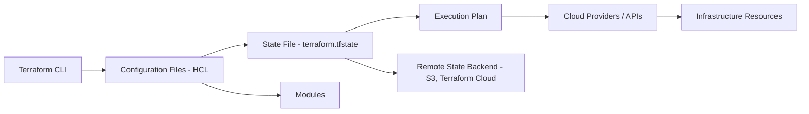

# Disclaimer
This repository contains information collected from various online sources and/or generated by AI assistants. The content provided here is for informational purposes only and is intended to serve as a general reference on various topics.

Okay, I will add a section to the documentation discussing when to use Infrastructure as Code and when it might not be the most suitable approach.

Here is the updated detailed documentation:

# Infrastructure as Code (IaC): Terraform, Terragrunt, and Other Tools

Infrastructure as Code (IaC) has become a fundamental practice in modern cloud computing and IT operations. It enables teams to manage and provision infrastructure resources through machine-readable configuration files, bringing the principles of software development to infrastructure management. This approach ensures consistency, repeatability, and efficiency at scale. This document provides a comprehensive guide to IaC, with a strong focus on Terraform and Terragrunt, and explores other tools in the IaC ecosystem, clarifying their relationship with Terraform.

## Table of Contents

  * [Introduction to Infrastructure as Code (IaC)](#introduction-to-infrastructure-as-code-iac)
  * [Core Concepts of IaC](#core-concepts-of-iac)
      * [Benefits and Challenges](#benefits-and-challenges)
      * [Declarative vs. Imperative](#declarative-vs.-imperative)
  * [When to Use IaC and When Not to Use IaC](#when-to-use-iac-and-when-not-to-use-iac)
      * [When to Use IaC](#when-to-use-iac)
      * [When Not to Use IaC](#when-not-to-use-iac)
  * [Terraform: An Overview](#terraform-an-overview)
      * [History and Evolution](#history-and-evolution)
      * [Key Features](#key-features)
  * [How Terraform Works](#how-terraform-works)
      * [Configuration Files and HCL](#configuration-files-and-hcl)
      * [State Management](#state-management)
      * [Provisioners, Providers, and Modules](#provisioners,-providers,-and-modules)
      * [The Terraform Lifecycle](#the-terraform-lifecycle)
  * [Terraform Architecture Diagram](#terraform-architecture-diagram-from-source)
  * [Best Practices in Terraform](#best-practices-in-terraform)
      * [Code Organization](#code-organization)
      * [Security Considerations](#security-considerations)
      * [Testing and Validation](#testing-and-validation)
  * [Terragrunt: Enhancing Terraform Workflows](#terragrunt-enhancing-terraform-workflows)
      * [What is Terragrunt?](#what-is-terragrunt)
      * [Key Features and Benefits](#key-features-and-benefits)
      * [How Terragrunt Works with Terraform](#how-terragrunt-works-with-terraform)
      * [Example Directory Structure with Terragrunt](#example-directory-structure-with-terragrunt)
  * [Other IaC and Related Tools](#other-iac-and-related-tools)
      * [OpenTofu](#opentofu)
      * [Pulumi](#pulumi)
      * [Crossplane](#crossplane)
      * [Atlantis](#atlantis)
      * [Spacelift](#spacelift)
      * [Ansible](#ansible)
      * [CloudFormation](#cloudformation)
  * [Additional Considerations in IaC](#additional-considerations-in-iac)
      * [Version Control and CI/CD Integration](#version-control-and-ci/cd-integration)
      * [Security and Compliance](#security-and-compliance)
      * [Collaboration and Code Reviews](#collaboration-and-code-reviews)
  * [Conclusion](#conclusion)
  * [References](#references)

## Introduction to Infrastructure as Code (IaC)

Infrastructure as Code (IaC) is a modern approach to managing and provisioning computing infrastructure through machine-readable configuration files rather than physical hardware configuration or interactive configuration tools. This approach brings software engineering practices such as version control, automated testing, and continuous integration to the realm of infrastructure management.

IaC allows organizations to manage infrastructure at scale while reducing errors and promoting consistency. By defining your infrastructure as code, you can automate the deployment process, rapidly iterate on environments, and ensure that all infrastructure configurations are versioned and reproducible.

## Core Concepts of IaC

### Benefits and Challenges

IaC brings numerous advantages:

  * **Consistency and Repeatability:** Code ensures that environments are consistent across development, staging, and production.
  * **Speed and Efficiency:** Automated provisioning speeds up deployments and reduces manual errors.
  * **Version Control:** Infrastructure definitions can be versioned, allowing for rollbacks and history tracking.
  * **Scalability:** Easily scale infrastructure up or down with minimal manual intervention.
  * **Collaboration:** Teams can collaborate on infrastructure changes using familiar code review processes.

However, there are challenges too:

  * **Learning Curve:** Requires teams to learn new tools and practices.
  * **Complexity:** Managing large codebases for complex infrastructures can become challenging.
  * **Security:** Sensitive data within configuration files must be managed carefully.

### Declarative vs. Imperative

IaC tools generally fall into two categories: declarative and imperative.

  * **Declarative (e.g., Terraform):** You define the desired state of your infrastructure, and the tool figures out the steps required to reach that state.
  * **Imperative (e.g., scripting with Bash or Python):** You explicitly define the steps to create and configure infrastructure.

The declarative approach is favored in modern IaC because it simplifies management and reduces the risk of errors by focusing on the "what" rather than the "how."

## When to Use IaC and When Not to Use IaC

While IaC offers significant advantages, it's not always the most appropriate solution for every scenario. Understanding when its benefits outweigh the initial investment and complexity is key.

### When to Use IaC

IaC is highly beneficial and recommended in the following situations:

  * **Managing Cloud Infrastructure:** Provisioning and managing resources (VMs, networks, databases, etc.) across public clouds (AWS, Azure, GCP) or private clouds.
  * **Multi-Environment Deployments:** Creating and maintaining consistent environments for development, staging, testing, and production.
  * **Frequent Infrastructure Changes:** When infrastructure needs to be updated or scaled regularly.
  * **Large or Complex Infrastructure:** Managing a significant number of resources or intricate network configurations.
  * **Team Collaboration on Infrastructure:** When multiple team members need to make changes to the infrastructure collaboratively.
  * **Disaster Recovery and Business Continuity:** Rapidly recreating infrastructure in a different region in case of a disaster.
  * **Auditing and Compliance:** Having a versioned record of all infrastructure changes for auditing and compliance purposes.
  * **Cost Optimization:** Automating scaling and resource management can help control costs.
  * **Standardization:** Enforcing standardized configurations across different projects or teams.

### When Not to Use IaC

There might be scenarios where the overhead of implementing and maintaining IaC outweighs the benefits, or where it's simply not the right tool:

  * **Very Small, Static, Non-Critical Environments:** For a single, unchanging server used for a minimal, non-critical task, manually configuring it once might be simpler than setting up an IaC pipeline.
  * **One-Off, Rapid, Non-Repeatable Tasks:** If you need to quickly spin up a temporary resource for a very brief, non-repeatable task and reproducibility is not a concern, manual configuration might be faster initially. However, even for temporary resources that might be needed again, IaC becomes beneficial.
  * **Pure Configuration Management (after provisioning):** While some IaC tools like Ansible can do provisioning, their primary strength is configuring software *on* existing infrastructure. For tasks like installing software packages, managing services, or configuring users on machines already provisioned, dedicated Configuration Management tools (like Ansible, Chef, Puppet) are often more suitable than declarative provisioning tools like Terraform. They can, however, be used together effectively (Terraform provisions, Ansible configures).
  * **Very Steep Learning Curve for a Minimal Team/Project:** If a team is very small, the infrastructure is extremely simple, and the learning curve for IaC tools and practices is perceived as a major barrier, the initial investment in IaC might be delayed. However, even here, the benefits for future growth often justify the investment.
  * **Interacting with Legacy Systems Without APIs:** If the infrastructure you need to manage is a legacy system with no exposed APIs or command-line interfaces that IaC tools can interact with, IaC might not be feasible for that specific system.

In most modern IT environments, especially those leveraging cloud services, the benefits of IaC for consistency, speed, and manageability make it a worthwhile investment for all but the simplest and most static infrastructures. The goal is to find the right balance and choose the appropriate tools for the task at hand.

## Terraform: An Overview

Terraform is one of the most popular IaC tools, created by HashiCorp. It allows users to define and provision data center infrastructure using a high-level configuration language known as HashiCorp Configuration Language (HCL).

### History and Evolution

Terraform was introduced in 2014 and has since evolved into a robust, multi-cloud IaC solution. Its support for multiple cloud providers (AWS, Azure, Google Cloud, etc.) and on-premises solutions has made it a go-to tool for organizations looking to manage hybrid or multi-cloud environments.

### Key Features

  * **Multi-Provider Support:** Terraform supports numerous providers, which makes it flexible in managing different environments.
  * **Immutable Infrastructure:** Terraform promotes the concept of immutable infrastructure, meaning that rather than modifying resources in place, it re-creates resources when changes occur.
  * **State Management:** Terraform maintains a state file that keeps track of your real-world infrastructure. This state file is essential for planning and applying changes.
  * **Modularity:** Terraform supports modules, allowing you to reuse and share configuration code.
  * **Plan and Apply Workflow:** The workflow includes generating an execution plan with `terraform plan` and then applying it with `terraform apply`.

## How Terraform Works

### Configuration Files and HCL

Terraform configurations are written in HCL, a domain-specific language that is both human-readable and machine-friendly. These configuration files describe the desired state of the infrastructure.

**Example HCL Configuration:**

```hcl
provider "aws" {
  region = "us-east-1"
}

resource "aws_instance" "example" {
  ami           = "ami-0c55b159cbfafe1f0" # Example AMI, replace with a valid one for your region
  instance_type = "t2.micro"

  tags = {
    Name = "TerraformExample"
  }
}
```

In this example:

  * The `provider` block specifies AWS as the cloud provider and sets the region.
  * The `resource` block creates an AWS EC2 instance with specified attributes.

### State Management

Terraform uses a state file (commonly named `terraform.tfstate`) to map the configuration defined in the code to the real-world infrastructure. This file:

  * **Tracks Resources:** Maintains a record of each resource and its attributes.
  * **Enables Planning:** Allows Terraform to determine the differences between the current state and the desired state.
  * **Facilitates Collaboration:** When stored remotely (e.g., in an S3 bucket or Terraform Cloud), the state file supports collaborative workflows.

**State Management Table:**

| Aspect             | Description                                                              |
| :----------------- | :----------------------------------------------------------------------- |
| **State File** | JSON file representing the infrastructure's current state                |
| **Local vs. Remote** | Local state files can be used for small projects; remote backends are recommended for team environments. |
| **Locking** | Remote state backends provide locking to prevent concurrent modifications. |

### Provisioners, Providers, and Modules

Terraform’s power lies in its modularity and extensive plugin ecosystem:

  * **Providers:** They define the APIs used to interact with cloud platforms and services. Each provider is responsible for understanding resource types and operations.
  * **Resources:** Represent infrastructure components like compute instances, databases, networks, etc.
  * **Modules:** Reusable units of Terraform code. A module can be thought of as a container for multiple resources that are used together.
  * **Provisioners:** Scripts or configuration management tools that execute on the remote machine after the resource is created (e.g., running a shell script).

### The Terraform Lifecycle

Terraform follows a lifecycle that includes several key phases:

1.  **Write:** Developers write configuration files using HCL.
2.  **Plan:** The `terraform plan` command compares the desired state with the actual state (from the state file) and produces an execution plan.
3.  **Apply:** The `terraform apply` command executes the plan to achieve the desired state.
4.  **Destroy:** Resources can be destroyed using the `terraform destroy` command.

This lifecycle allows for clear and controlled changes, reducing the risk of unexpected modifications.

## Terraform Architecture Diagram (from source)



This diagram shows the flow from writing configuration files to updating the real-world infrastructure, emphasizing the role of the state file and modules.

## Best Practices in Terraform

### Code Organization

Organizing your Terraform code effectively is essential for maintainability, collaboration, and scalability. Here are some best practices:

  * **Use Modules:** Break your code into reusable modules for common components such as VPCs, security groups, and compute instances.
  * **Separate Environments:** Maintain separate directories or workspaces for different environments (development, staging, production).
  * **Naming Conventions:** Establish clear naming conventions for resources and variables to enhance readability.
  * **Version Control:** Always use version control (e.g., Git) to track changes in your Terraform configuration.
  * **Remote State:** For team projects, use remote state backends to store the state file securely and enable locking.

### Security Considerations

Security is paramount in IaC:

  * **Sensitive Data:** Avoid hardcoding secrets, passwords, or API keys in your configuration files. Use secure methods like environment variables or secret managers.
  * **Access Control:** Restrict access to the state file, especially when stored remotely.
  * **Policy as Code:** Integrate tools such as Sentinel or Open Policy Agent (OPA) to enforce compliance and security policies.

### Testing and Validation

Testing your IaC configurations can prevent issues before they reach production:

  * **Linting:** Use tools like tflint to identify syntax errors or potential misconfigurations.
  * **Unit Testing:** Tools like Terratest allow you to write automated tests for your Terraform modules.
  * **Plan Reviews:** Always review the execution plan before applying changes to ensure they align with your expectations.

## Terragrunt: Enhancing Terraform Workflows

### What is Terragrunt?

Terragrunt is a thin wrapper for Terraform that provides extra tooling and conventions to help manage complex Terraform configurations, particularly in multi-environment and multi-module scenarios. It helps address issues such as code duplication and state management.

### Key Features and Benefits

  * **DRY (Don't Repeat Yourself):** Terragrunt encourages code reuse by allowing you to define common configurations once and reference them across multiple environments, reducing boilerplate.
  * **State Management:** It simplifies remote state management by automatically configuring backend settings for your Terraform code based on your Terragrunt configuration.
  * **Dependency Management:** Terragrunt can manage dependencies between different Terraform modules, ensuring that resources are created and destroyed in the correct order.
  * **Improved CLI Experience:** Offers commands to simplify common workflows, allowing you to run Terraform commands across multiple modules or environments with a single command.

### How Terragrunt Works with Terraform

Terragrunt wraps your standard Terraform configuration in a higher-level configuration file (usually named `terragrunt.hcl` in each environment or module directory). Terragrunt reads these files to:

  * Specify the source of the Terraform module to use (`terraform { source = ... }`).
  * Define the remote state configuration (`remote_state { ... }`).
  * Pass variables to the Terraform module (`inputs = { ... }`).
  * Define dependencies on other Terragrunt modules (`dependencies { ... }`).
  * Automatically configure and run the standard `terraform` commands (`init`, `plan`, `apply`, etc.) for you.

**Example Terragrunt File:**

```hcl
# Configure Terraform to use the VPC module from the parent directory
terraform {
  source = "../../../modules/vpc"
}

# Configure remote state to be stored in S3
remote_state {
  backend = "s3"
  config = {
    bucket = "my-terraform-state-bucket-unique" # Replace with your bucket name
    key    = "${path_relative_to_include()}/terraform.tfstate"
    region = "us-east-1"
    encrypt = true
  }
}

# Define inputs for the VPC module
inputs = {
  vpc_cidr_block = "10.0.0.0/16"
  environment    = "dev"
}
```

In this example, this `terragrunt.hcl` file in an environment directory would tell Terragrunt to run the Terraform code from the `../../../modules/vpc` path and automatically configure the S3 backend for the Terraform state file, passing the specified inputs to the VPC module.

### Example Directory Structure with Terragrunt

A well-organized project using Terragrunt for multi-environment management might have the following structure:

```
├── live
│   ├── dev
│   │   ├── us-east-1
│   │   │   ├── main.tf  # Optional: any environment-specific Terraform
│   │   │   └── terragrunt.hcl # Environment/region config, points to modules
│   │   └── us-west-2
│   │       ├── main.tf
│   │       └── terragrunt.hcl
│   ├── staging
│   │   └── us-east-1
│   │       └── terragrunt.hcl
│   └── prod
│       └── us-east-1
│           └── terragrunt.hcl
└── modules
    ├── vpc
    │   └── main.tf       # Reusable Terraform module for VPC creation
    ├── ec2
    │   └── main.tf       # Reusable Terraform module for EC2 instance creation
    └── rds
        └── main.tf       # Reusable Terraform module for RDS instance creation
```

This structure helps maintain consistency and simplifies managing differences between environments.

## Other IaC and Related Tools

The IaC ecosystem includes several other tools, each with its strengths and typical use cases. Some can replace Terraform, while others complement it.

### OpenTofu

  * **What it is:** OpenTofu is an open-source fork of Terraform, initiated by the Linux Foundation. It was created in response to HashiCorp's change in licensing for Terraform from MPL 2.0 to the Business Source License (BSL). OpenTofu aims to provide a truly open-source alternative that maintains compatibility with existing Terraform configurations and providers.
  * **Relationship with Terraform:** **Can Replace Terraform.** OpenTofu is designed to be a direct, drop-in replacement for Terraform. You can use your existing `.tf` files and most Terraform providers with OpenTofu. The goal is to offer a continued open-source option for users who prefer not to use the BSL-licensed Terraform.

### Pulumi

  * **What it is:** Pulumi is an IaC tool that allows you to define and manage infrastructure using general-purpose programming languages (e.g., Python, JavaScript, TypeScript, Go, C\#). It provides SDKs for interacting with cloud providers and managing state.
  * **Relationship with Terraform:** **Primarily Replaces Terraform (for defining infrastructure).** Pulumi offers a different approach to defining infrastructure compared to Terraform's HCL. If you prefer using familiar programming languages over HCL, Pulumi can be a direct replacement for writing your infrastructure code. However, it shares the core IaC concepts of declarative state and resource management. Pulumi also supports importing Terraform state and can coexist in an environment, though typically teams choose one primary tool for defining infrastructure.

### Crossplane

  * **What it is:** Crossplane is an open-source Kubernetes add-on that extends your Kubernetes cluster to manage cloud infrastructure and services. It allows you to provision and manage external resources (like databases, message queues, and managed Kubernetes clusters) directly from within your Kubernetes control plane using Kubernetes manifests.
  * **Relationship with Terraform:** **Can be used Together With or Replace Terraform (depending on the scope).** Crossplane can sometimes replace Terraform for managing infrastructure *within* or *from* Kubernetes. For example, you could use Crossplane to provision an RDS database from your Kubernetes cluster instead of using Terraform. However, many organizations use them *together*. Terraform might be used to provision the underlying Kubernetes cluster and network infrastructure, while Crossplane is used by application teams to provision and manage the services their applications depend on within that cluster. Crossplane can also potentially manage resources *outside* the cloud it's running on, similar to Terraform's multi-cloud capability.

### Atlantis

  * **What it is:** Atlantis is an open-source application that acts as a workflow automation layer for Terraform. It integrates with version control systems (like GitHub, GitLab, Bitbucket) and allows engineers to run `terraform plan` and `terraform apply` commands directly from pull requests.
  * **Relationship with Terraform:** **Used Together With Terraform.** Atlantis does not replace Terraform itself. It's a tool that *uses* Terraform to manage infrastructure. Atlantis provides a collaborative workflow around Terraform execution, enabling teams to review Terraform plans and apply changes safely through pull requests. It helps implement GitOps principles for infrastructure.

### Spacelift

  * **What it is:** Spacelift is a commercial cloud-native IaC management platform. It provides a centralized control plane for managing IaC code (including Terraform, Pulumi, and CloudFormation), state, policies, and access controls. It offers features like automated workflows, policy as code, security scanning, and compliance reporting.
  * **Relationship with Terraform:** **Used Together With Terraform (as a management layer).** Spacelift is a management and automation platform that *runs* your Terraform code (and other IaC tools). It doesn't replace Terraform but enhances the operational aspects of using Terraform in a team or organization. It provides a more robust and feature-rich alternative to self-hosted solutions like Atlantis or basic remote state backends.

### Ansible

  * **What it is:** Ansible is primarily a configuration management tool used for automating software provisioning, configuration management, and application deployment. It uses a declarative language (YAML playbooks) but is more focused on the *state of software and configurations* on a machine or service rather than the provisioning of the infrastructure itself.
  * **Relationship with Terraform:** **Often used Together With Terraform.** Terraform is typically used to provision the underlying infrastructure (e.g., launch a server, configure networking), and then Ansible is used to configure that infrastructure (e.g., install software, configure services, set up users) after it has been created by Terraform. While Ansible *can* provision some infrastructure resources, it's generally not as strong or comprehensive as Terraform for managing the lifecycle and state of infrastructure across multiple cloud providers. They are often used in tandem to achieve a fully automated provisioning and configuration process.

### CloudFormation

  * **What it is:** AWS CloudFormation is Amazon's native IaC service for provisioning and managing AWS resources. It uses templates written in YAML or JSON to define the desired state of AWS infrastructure.
  * **Relationship with Terraform:** **Can Replace Terraform (within AWS).** CloudFormation is a direct competitor to Terraform specifically within the AWS ecosystem. If you are exclusively using AWS, CloudFormation is a viable alternative to Terraform for defining and managing your infrastructure. However, if you need to manage infrastructure across multiple cloud providers (AWS, Azure, Google Cloud, etc.) or on-premises, Terraform offers multi-cloud support that CloudFormation lacks.

## Additional Considerations in IaC

### Version Control and CI/CD Integration

Managing your IaC in version control (e.g., Git) is critical for tracking changes, facilitating code reviews, and rolling back if necessary. Integrating IaC into CI/CD pipelines ensures:

  * **Automated Testing:** Linting and testing of Terraform configurations before deployment.
  * **Plan Automation:** Automatically generating and reviewing Terraform plans on pull requests.
  * **Deployment Automation:** Applying changes through CI/CD workflows, ensuring consistency across environments.

**Table: Example CI/CD Pipeline for Terraform**

| Stage          | Purpose                                        | Tools/Commands                  |
| :------------- | :--------------------------------------------- | :------------------------------ |
| **Linting** | Check code quality and adherence to style      | `tflint`, `terraform fmt`       |
| **Plan** | Generate execution plan                        | `terraform plan`                |
| **Approval** | Manual review and approval of changes          | GitHub PR reviews (or similar)  |
| **Apply** | Apply changes to the infrastructure            | `terraform apply` (via pipeline)|

### Security and Compliance

Securing your infrastructure code is critical:

  * **Secrets Management:** Use tools like HashiCorp Vault, AWS Secrets Manager, or Azure Key Vault to manage secrets rather than hardcoding them in your configuration files.
  * **Access Control:** Restrict access to your IaC repositories and state files, especially when stored remotely. Implement least privilege principles for the identities running IaC operations.
  * **Policy as Code:** Integrate tools such as Sentinel (part of HashiCorp Cloud Platform) or Open Policy Agent (OPA) to enforce compliance and security policies on your infrastructure configurations before they are applied.
  * **Compliance Checks:** Integrate security scanning tools (e.g., Checkov, tfsec) into your CI/CD pipelines to identify potential misconfigurations or insecure practices in your IaC code.

### Collaboration and Code Reviews

Using IaC in a team setting means collaboration is key:

  * **Peer Reviews:** Regularly review Terraform code via pull requests before merging changes. This helps catch errors, share knowledge, and ensure adherence to best practices.
  * **Pair Programming:** Consider pair programming sessions for writing complex or critical IaC code.
  * **Documentation:** Maintain clear and up-to-date documentation within the IaC repository to explain module usage, environment configurations, and key decisions.

## Conclusion

Infrastructure as Code is revolutionizing the way we manage and deploy IT infrastructure, offering significant benefits in terms of consistency, speed, and reliability. Terraform stands out as a leading tool due to its declarative approach, extensive provider support, and modular design, making it suitable for managing diverse and multi-cloud environments. Terragrunt complements Terraform by providing conventions and tooling to manage complex, multi-environment setups efficiently, reducing code duplication and simplifying state management.

While Terraform and Terragrunt form a powerful combination, the IaC ecosystem is rich with other tools. OpenTofu offers a direct open-source alternative to Terraform. Pulumi provides a programming language-centric approach to IaC. Crossplane extends Kubernetes to manage external resources. Tools like Atlantis and Spacelift provide workflow automation and management platforms for Terraform and other IaC tools. Understanding these tools and their relationship to Terraform (whether they replace it for certain tasks or are used alongside it) is crucial for choosing the right tools to build robust, scalable, and secure infrastructure.

As organizations scale their operations, the benefits of using IaC become more pronounced. By automating infrastructure provisioning, ensuring code quality through version control and testing, and integrating security best practices, teams can achieve more reliable and efficient deployments. This comprehensive guide provides a strong foundation for understanding IaC, Terraform, Terragrunt, and the broader ecosystem, empowering you to make informed decisions about managing your infrastructure effectively.

## References

  * Terraform Official Documentation - [https://www.terraform.io/docs](https://www.terraform.io/docs)
  * Terragrunt Official Documentation - [https://terragrunt.gruntwork.io/](https://terragrunt.gruntwork.io/)
  * Infrastructure as Code Overview (HashiCorp) - [https://www.hashicorp.com/resources/infrastructure-as-code](https://www.google.com/search?q=https://www.hashicorp.com/resources/infrastructure-as-code)
  * OpenTofu Website - [https://opentofu.org/](https://opentofu.org/)
  * Pulumi Website - [https://www.pulumi.com/](https://www.pulumi.com/)
  * Crossplane Website - [https://crossplane.io/](https://crossplane.io/)
  * Atlantis GitHub Repository - [https://www.runatlantis.io/](https://www.runatlantis.io/)
  * Spacelift Website - [https://spacelift.io/](https://spacelift.io/)
