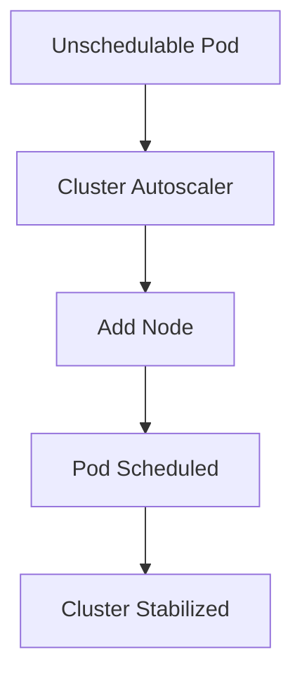
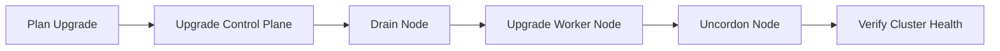
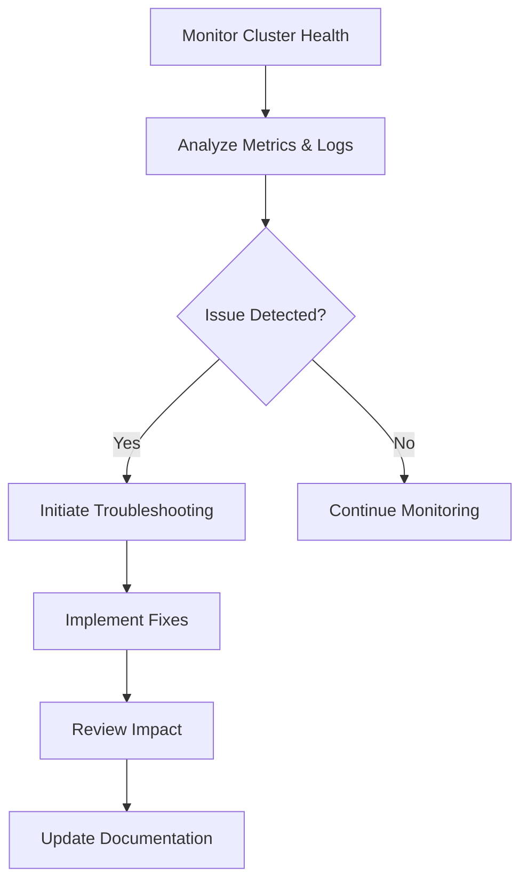

# Disclaimer
This repository contains information collected from various online sources and/or generated by AI assistants. The content provided here is for informational purposes only and is intended to serve as a general reference on various topics.

# Part 3: Day-to-Day Administration

## Table of Contents

1. [Overview](#overview)
2. [Monitoring and Logging](#monitoring-and-logging)
   - [Cluster Health Monitoring](#cluster-health-monitoring)
   - [Logging Strategies](#logging-strategies)
   - [Popular Tools and Dashboards](#popular-tools-and-dashboards)
3. [Scaling and Resource Management](#scaling-and-resource-management)
   - [Horizontal Pod Autoscaling (HPA)](#horizontal-pod-autoscaling-hpa)
   - [Vertical Pod Autoscaling (VPA)](#vertical-pod-autoscaling-vpa)
   - [Cluster Autoscaling](#cluster-autoscaling)
   - [Resource Quotas and Limits](#resource-quotas-and-limits)
4. [Upgrades and Maintenance](#upgrades-and-maintenance)
   - [Rolling Updates and Rollbacks](#rolling-updates-and-rollbacks)
   - [Node Maintenance and Draining](#node-maintenance-and-draining)
   - [Upgrading Kubernetes Components](#upgrading-kubernetes-components)
5. [Backup, Restore, and Disaster Recovery](#backup-restore-and-disaster-recovery)
   - [etcd Backup and Restore](#etcd-backup-and-restore)
   - [Application Data Backup Strategies](#application-data-backup-strategies)
   - [Disaster Recovery Planning](#disaster-recovery-planning)
6. [Security Administration](#security-administration)
   - [Access Control and RBAC](#access-control-and-rbac)
   - [Network Policies](#network-policies)
   - [Secrets Management](#secrets-management)
   - [Vulnerability Scanning and Auditing](#vulnerability-scanning-and-auditing)
7. [Troubleshooting and Diagnostics](#troubleshooting-and-diagnostics)
   - [Common Cluster Issues and Their Resolutions](#common-cluster-issues-and-their-resolutions)
   - [Diagnostic Tools and Commands](#diagnostic-tools-and-commands)
   - [Case Studies: Real-World Troubleshooting Scenarios](#case-studies-real-world-troubleshooting-scenarios)
8. [Automation and Tooling](#automation-and-tooling)
   - [Configuration Management](#configuration-management)
   - [CI/CD Integration](#cicd-integration)
   - [Scripting and Custom Tools](#scripting-and-custom-tools)
9. [Best Practices and Real-World Scenarios](#best-practices-and-real-world-scenarios)
   - [Operational Best Practices](#operational-best-practices)
   - [Scaling Challenges and Solutions](#scaling-challenges-and-solutions)
   - [Security Best Practices](#security-best-practices)
10. [Diagrams, Tables, and Design Visuals](#diagrams-tables-and-design-visuals)
11. [Summary and Next Steps](#summary-and-next-steps)

---

## Overview

Day-to-day administration of a Kubernetes cluster encompasses a wide range of tasks to ensure that the infrastructure runs efficiently, securely, and reliably. Administrators must monitor cluster health, optimize resource allocation, perform upgrades and maintenance without downtime, secure access, and be prepared to troubleshoot any issues that may arise. This part of the guide provides a deep dive into these daily responsibilities, supported by real-world examples, diagrams, and tables to aid in visualizing complex processes.

Administrators are encouraged to integrate automation wherever possible, use monitoring and logging tools to gain actionable insights, and follow well-documented best practices to maintain high availability and security.

---

## Monitoring and Logging

### Cluster Health Monitoring

Keeping track of your cluster’s health is essential for preempting issues and ensuring that applications remain available. Here are the key components to monitor:

- **Node Health:**  
  Monitor CPU, memory, disk I/O, and network performance on each node. Tools like `kubectl top nodes` provide immediate insights.

- **Pod and Container Health:**  
  Track pod status, restarts, resource usage, and container-level metrics. Utilize `kubectl get pods --all-namespaces` for an overview.

- **Control Plane Metrics:**  
  Monitor API server request rates, etcd performance, and scheduler latency. Metrics from these components can indicate bottlenecks or impending failures.

- **Custom Application Metrics:**  
  Use Prometheus and Grafana to collect application-level metrics and visualize trends over time.

#### Monitoring Architecture Diagram

Below is a Mermaid diagram illustrating a typical monitoring architecture:

```mermaid
flowchart TD
    A[Prometheus Server] --> B[Node Exporter]
    A --> C[Kube-State-Metrics]
    A --> D[Custom Metrics Exporter]
    E[Grafana Dashboard] <-- A
    F[Alertmanager] <-- A
```

*Figure: Monitoring components and data flow between Prometheus, exporters, Grafana, and Alertmanager.*

### Logging Strategies

Centralized logging is crucial for diagnosing issues and auditing cluster activity. Strategies include:

- **Centralized Log Aggregation:**  
  Use logging stacks like the ELK stack (Elasticsearch, Logstash, Kibana) or EFK (Fluentd instead of Logstash) to aggregate logs from all nodes and pods.

- **Structured Logging:**  
  Configure applications and Kubernetes components to output structured logs (e.g., JSON format) for easier parsing and searchability.

- **Log Retention Policies:**  
  Define retention periods and rotation policies to manage disk space and ensure compliance with regulatory requirements.

- **Real-Time Log Analysis:**  
  Integrate tools that allow real-time analysis and alerting on log patterns, such as detecting repeated error messages or security anomalies.

#### Logging Table: Tools and Their Functions

| Tool           | Function                                          | Key Benefits                                  |
|----------------|---------------------------------------------------|-----------------------------------------------|
| Fluentd/Logstash | Aggregates logs from various sources              | Customizable, high-performance ingestion      |
| Elasticsearch  | Indexes and stores log data                        | Fast querying and scalable search capabilities |
| Kibana         | Visualizes log data with interactive dashboards    | User-friendly and highly customizable         |
| Grafana Loki   | Aggregates and queries logs in a cloud-native way    | Seamless integration with Grafana             |

### Popular Tools and Dashboards

- **Prometheus:**  
  A leading open-source monitoring and alerting toolkit. It scrapes metrics from endpoints and stores time-series data.

- **Grafana:**  
  A powerful visualization tool that integrates with Prometheus, Elasticsearch, and other data sources to create dynamic dashboards.

- **Alertmanager:**  
  Manages alerts generated by Prometheus and routes notifications to email, Slack, PagerDuty, or other communication channels.

- **Kibana/EFK Stack:**  
  Provides search and visualization capabilities for log data aggregated using Fluentd or Logstash.

---

## Scaling and Resource Management

Efficient resource management ensures that applications perform optimally under varying loads. Kubernetes provides several mechanisms to scale applications and manage resources.

### Horizontal Pod Autoscaling (HPA)

HPA adjusts the number of pod replicas based on observed CPU utilization or custom metrics. Key steps include:

- **Configuration:**  
  Define a target metric in your Deployment or ReplicaSet YAML file.

- **Metrics Server:**  
  Ensure that the metrics server is installed and running in your cluster.

- **HPA Command Example:**

  ```bash
  kubectl autoscale deployment my-app --cpu-percent=50 --min=2 --max=10
  ```

- **Monitoring HPA:**  
  Use `kubectl get hpa` to monitor the current status and adjust thresholds as necessary.

#### HPA Example YAML

```yaml
apiVersion: autoscaling/v2
kind: HorizontalPodAutoscaler
metadata:
  name: my-app-hpa
spec:
  scaleTargetRef:
    apiVersion: apps/v1
    kind: Deployment
    name: my-app
  minReplicas: 2
  maxReplicas: 10
  metrics:
  - type: Resource
    resource:
      name: cpu
      target:
        type: Utilization
        averageUtilization: 50
```

### Vertical Pod Autoscaling (VPA)

VPA adjusts the resource requests and limits of individual pods based on observed usage patterns. It is particularly useful when workloads have fluctuating resource needs.

- **Key Benefits:**  
  Ensures pods have optimal resource allocation and prevents over/under provisioning.

- **Implementation:**  
  Install the VPA recommender, updater, and admission controller components.  
  Review recommendations and decide whether to apply them automatically or manually.

### Cluster Autoscaling

Cluster autoscaling adjusts the number of nodes in your cluster based on pod scheduling needs.

- **Use Cases:**  
  - When there are unscheduled pods due to insufficient resources.
  - When nodes are underutilized and can be scaled down.

- **Configuration:**  
  Configure the Cluster Autoscaler on cloud platforms like AWS, GCP, or Azure, or in on-premises clusters that support dynamic node scaling.

#### Cluster Autoscaling Flow Diagram



*Figure: Cluster Autoscaling process from detecting unschedulable pods to scaling nodes.*

### Resource Quotas and Limits

Administrators must prevent resource exhaustion by setting resource quotas and limits within namespaces.

- **Resource Quotas:**  
  Define limits on the total CPU, memory, and other resources that a namespace can consume.

- **Limit Ranges:**  
  Set default resource requests and limits for pods and containers in a namespace.

#### Example Resource Quota YAML

```yaml
apiVersion: v1
kind: ResourceQuota
metadata:
  name: compute-resources
  namespace: default
spec:
  hard:
    requests.cpu: "4"
    requests.memory: 8Gi
    limits.cpu: "8"
    limits.memory: 16Gi
```

---

## Upgrades and Maintenance

A critical aspect of day-to-day administration is ensuring that your cluster is up-to-date and maintained without impacting production workloads.

### Rolling Updates and Rollbacks

Rolling updates allow you to deploy new versions of applications with zero downtime.

- **Deployment Strategy:**  
  Use the `RollingUpdate` strategy in your Deployment manifest.

- **Configuration Options:**  
  Adjust parameters such as `maxUnavailable` and `maxSurge` to control the pace of updates.

- **Rollback Procedures:**  
  Kubernetes automatically maintains a revision history. Use `kubectl rollout undo deployment/my-app` to revert to a previous version if needed.

#### Deployment YAML Example with Rolling Update Strategy

```yaml
apiVersion: apps/v1
kind: Deployment
metadata:
  name: my-app
spec:
  replicas: 5
  strategy:
    type: RollingUpdate
    rollingUpdate:
      maxUnavailable: 1
      maxSurge: 2
  template:
    metadata:
      labels:
        app: my-app
    spec:
      containers:
      - name: my-app-container
        image: my-app:latest
        resources:
          requests:
            cpu: "200m"
            memory: "256Mi"
          limits:
            cpu: "400m"
            memory: "512Mi"
```

### Node Maintenance and Draining

For safe maintenance of worker nodes, draining a node is essential before performing upgrades or hardware maintenance.

- **Drain Command:**

  ```bash
  kubectl drain <node-name> --ignore-daemonsets --delete-local-data
  ```

- **Post-Maintenance:**  
  After maintenance, mark the node as schedulable again using:

  ```bash
  kubectl uncordon <node-name>
  ```

- **Automated Maintenance Windows:**  
  Schedule regular maintenance windows and notify stakeholders in advance.

### Upgrading Kubernetes Components

Upgrading your cluster involves a coordinated process to update the control plane and worker nodes with minimal disruption.

- **Control Plane Upgrades:**  
  Use `kubeadm upgrade` to upgrade the control plane components, then upgrade worker nodes sequentially.
- **Worker Node Upgrades:**  
  Upgrade the kubelet and container runtime on each node after cordoning and draining the node.

#### Upgrade Flow Diagram



*Figure: Step-by-step process for upgrading Kubernetes components.*

---

## Backup, Restore, and Disaster Recovery

Ensuring data integrity and being able to recover quickly from failures is paramount for production clusters.

### etcd Backup and Restore

Since etcd is the source of truth for your cluster state, regular backups are mandatory.

- **Backup Strategies:**  
  - Use `etcdctl snapshot save` to create a snapshot.
  - Schedule automated backups with cron jobs or backup operators.
  
- **Restore Procedures:**  
  Follow documented procedures to restore etcd from backups in the event of data corruption or cluster failure.

#### Example: etcd Snapshot Command

```bash
ETCDCTL_API=3 etcdctl snapshot save /backup/etcd-snapshot.db \
  --endpoints=https://127.0.0.1:2379 \
  --cacert=/etc/kubernetes/pki/etcd/ca.crt \
  --cert=/etc/kubernetes/pki/etcd/server.crt \
  --key=/etc/kubernetes/pki/etcd/server.key
```

### Application Data Backup Strategies

- **Stateful Applications:**  
  Use persistent volume snapshots provided by cloud providers or tools like Velero to backup application data.
- **Configuration Backups:**  
  Keep version-controlled backups of Kubernetes manifests, CRDs, and configuration files.

### Disaster Recovery Planning

A robust disaster recovery plan should include:

- **Recovery Objectives:**  
  Define Recovery Time Objectives (RTO) and Recovery Point Objectives (RPO).
- **DR Drills:**  
  Conduct regular disaster recovery drills to test backup and restore procedures.
- **Documentation:**  
  Maintain a comprehensive DR playbook accessible to all administrators.

#### DR Planning Table

| Aspect                | Description                                               | Recommended Action                           |
|-----------------------|-----------------------------------------------------------|----------------------------------------------|
| RTO                   | Maximum acceptable downtime for services                  | Define clear RTO for critical workloads      |
| RPO                   | Maximum acceptable data loss measured in time             | Implement frequent backups                   |
| Testing Frequency     | How often DR procedures are tested                        | At least quarterly                           |
| Stakeholder Notification | Procedures for informing teams during a DR event          | Pre-defined communication plan               |

---

## Security Administration

### Access Control and RBAC

Implementing strict access control is essential to secure your cluster:

- **RBAC Policies:**  
  Define roles and role bindings to ensure least privilege access. Regularly audit RBAC configurations to prevent privilege escalation.

- **Audit Logging:**  
  Enable audit logging for the API server to track user actions and system events.

- **Service Accounts:**  
  Use dedicated service accounts for applications, and limit their permissions.

#### Example: RBAC Policy YAML

```yaml
apiVersion: rbac.authorization.k8s.io/v1
kind: Role
metadata:
  namespace: default
  name: pod-reader
rules:
- apiGroups: [""]
  resources: ["pods"]
  verbs: ["get", "watch", "list"]
```

### Network Policies

Network policies restrict the flow of traffic between pods and external endpoints. Implement policies to isolate critical applications and prevent lateral movement in the event of a breach.

#### Network Policy YAML Example

```yaml
apiVersion: networking.k8s.io/v1
kind: NetworkPolicy
metadata:
  name: allow-app-traffic
  namespace: default
spec:
  podSelector:
    matchLabels:
      app: my-app
  ingress:
  - from:
    - podSelector:
        matchLabels:
          access: allowed
```

### Secrets Management

- **Encryption at Rest:**  
  Enable secret encryption in etcd to protect sensitive data.
- **External Secrets:**  
  Integrate with tools like HashiCorp Vault for advanced secrets management.
- **Rotation Policies:**  
  Regularly rotate secrets and certificates.

### Vulnerability Scanning and Auditing

- **Image Scanning:**  
  Utilize tools such as Clair or Trivy to scan container images for vulnerabilities.
- **Compliance Audits:**  
  Periodically audit cluster configurations against security benchmarks (e.g., CIS Kubernetes Benchmark).

---

## Troubleshooting and Diagnostics

### Common Cluster Issues and Their Resolutions

Administrators must be adept at identifying and resolving common issues. Some examples include:

- **Pod CrashLoops:**  
  Investigate container logs using `kubectl logs <pod-name>`, check resource limits, and validate application configuration.
- **Networking Issues:**  
  Validate network policies, inspect CNI plugin logs, and use tools like `tcpdump` for packet-level analysis.
- **Resource Contention:**  
  Monitor node metrics, adjust resource quotas, and investigate “OOMKilled” events.
- **API Server Latency:**  
  Analyze API server metrics and audit logs to identify heavy users or potential DDoS patterns.

### Diagnostic Tools and Commands

- **kubectl commands:**  
  - `kubectl describe node <node-name>`
  - `kubectl get events --all-namespaces`
  - `kubectl logs <pod-name> -n <namespace>`
- **Third-Party Tools:**  
  - Prometheus for time-series analysis.
  - K9s for interactive cluster management.
  - Lens IDE for a graphical overview.

### Case Studies: Real-World Troubleshooting Scenarios

#### Case Study 1: High API Server Latency
*Scenario:* Users report slow response times.  
*Resolution:*  
1. Inspect API server metrics using Prometheus.  
2. Identify an unexpected spike in requests from a misconfigured client.  
3. Update the client configuration and monitor for improvement.

#### Case Study 2: Unscheduled Pods Due to Resource Exhaustion
*Scenario:* Pods remain in a pending state.  
*Resolution:*  
1. Review node resource usage with `kubectl top nodes`.  
2. Scale out the cluster using Cluster Autoscaler.  
3. Adjust resource requests in the Deployment manifests.

---

## Automation and Tooling

Automation is key to reducing manual overhead and ensuring consistent cluster operations.

### Configuration Management

- **Infrastructure as Code (IaC):**  
  Use tools like Terraform or CloudFormation to define your Kubernetes infrastructure.
- **Configuration Management Tools:**  
  Leverage Ansible, Puppet, or Chef to deploy and maintain Kubernetes configurations and operating system settings.

### CI/CD Integration

- **Automated Testing:**  
  Integrate Kubernetes deployments into your CI/CD pipelines using tools like Jenkins, GitLab CI, or Argo CD.
- **GitOps Practices:**  
  Use Git as the single source of truth for cluster configurations. Tools such as Flux or Argo CD continuously synchronize the live cluster state with the Git repository.

### Scripting and Custom Tools

- **kubectl Plugins:**  
  Develop custom plugins to streamline repetitive administrative tasks.
- **Automation Scripts:**  
  Create scripts to handle node maintenance, certificate renewals, and bulk resource updates.

#### Table: Automation Tools Comparison

| Tool          | Functionality                             | Pros                                       | Cons                                 |
|---------------|-------------------------------------------|--------------------------------------------|--------------------------------------|
| Terraform     | IaC for Kubernetes clusters               | Declarative, version-controlled            | Learning curve for complex setups    |
| Ansible       | Configuration management and orchestration| Agentless, extensive community modules     | Can be slow on large-scale operations|
| Argo CD       | GitOps continuous delivery                | Real-time synchronization, easy rollback   | Requires strict Git workflow         |

---

## Best Practices and Real-World Scenarios

### Operational Best Practices

- **Documentation:**  
  Keep thorough, up-to-date documentation of cluster configurations, maintenance procedures, and troubleshooting guides.
- **Regular Audits:**  
  Conduct regular audits of resource usage, access logs, and RBAC configurations.
- **Alerting:**  
  Set up alerts for anomalous behavior, such as high error rates or unusual resource spikes.
- **Testing Environments:**  
  Use staging environments to validate changes before rolling them out to production.

### Scaling Challenges and Solutions

- **Bottlenecks:**  
  Identify and resolve bottlenecks in the control plane and worker nodes through detailed monitoring and performance analysis.
- **Load Distribution:**  
  Implement effective load balancing strategies using Ingress controllers and service meshes.
- **Capacity Planning:**  
  Regularly review capacity plans and adjust node pool sizes in response to changing workloads.

### Security Best Practices

- **Zero Trust:**  
  Implement a zero-trust security model across all cluster components.
- **Least Privilege:**  
  Continuously refine RBAC policies to grant only the minimum permissions required.
- **Regular Updates:**  
  Stay abreast of the latest security patches and updates for Kubernetes and underlying OS components.

---

## Diagrams, Tables, and Design Visuals

### Day-to-Day Administration Workflow Diagram



*Figure: Daily operational workflow for addressing cluster issues.*

### Resource Management Comparison Table

| Feature                   | Horizontal Autoscaling | Vertical Autoscaling | Cluster Autoscaling        |
|---------------------------|------------------------|----------------------|----------------------------|
| **Scale Granularity**     | Pod-level              | Container-level      | Node-level                |
| **Trigger Metric**        | CPU/Memory, Custom     | Historical Usage     | Pending pods, utilization  |
| **Response Time**         | Fast                   | Moderate             | Depends on cloud provider  |
| **Use Case**              | Web applications       | Batch jobs           | Dynamic workload changes   |

### Maintenance Operations Timeline

| Operation                     | Frequency         | Responsible Team           | Key Actions                                         |
|-------------------------------|-------------------|----------------------------|-----------------------------------------------------|
| Cluster Health Check          | Daily             | Operations                 | Monitor metrics, logs, and alerts                   |
| Security Audit                | Weekly/Monthly    | Security/DevOps            | Review RBAC, network policies, and audit logs       |
| Backup & DR Drill             | Monthly/Quarterly | DevOps/Infrastructure      | Test etcd backups, simulate disaster scenarios      |
| Software and OS Updates       | As Released       | Infrastructure             | Apply patches, upgrade Kubernetes components        |
| Performance Tuning Review     | Quarterly         | Operations/DevOps          | Evaluate autoscaling, resource quotas, load patterns  |

---

## Summary and Next Steps

In this part of the guide, we have delved into the day-to-day administrative tasks essential for running a healthy, secure, and scalable Kubernetes cluster. Key points covered include:

- **Monitoring and Logging:**  
  Techniques and tools for tracking cluster health, aggregating logs, and setting up effective dashboards and alerts.
- **Scaling and Resource Management:**  
  Strategies for autoscaling pods and nodes, setting resource quotas, and optimizing resource allocation.
- **Upgrades and Maintenance:**  
  Best practices for rolling updates, node maintenance, and upgrading cluster components with minimal downtime.
- **Backup, Restore, and Disaster Recovery:**  
  Critical procedures for safeguarding cluster state and application data, along with documented DR plans.
- **Security Administration:**  
  Implementing robust access controls, network policies, and regular audits to secure the cluster.
- **Troubleshooting and Diagnostics:**  
  Common issues, diagnostic commands, and real-world case studies that illustrate effective problem resolution.
- **Automation and Tooling:**  
  The importance of automating repetitive tasks, integrating CI/CD pipelines, and employing IaC practices.
- **Best Practices and Real-World Scenarios:**  
  A review of operational, scaling, and security best practices informed by real-world challenges.

---
