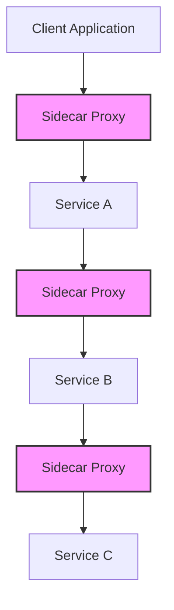
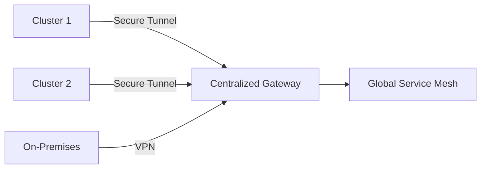
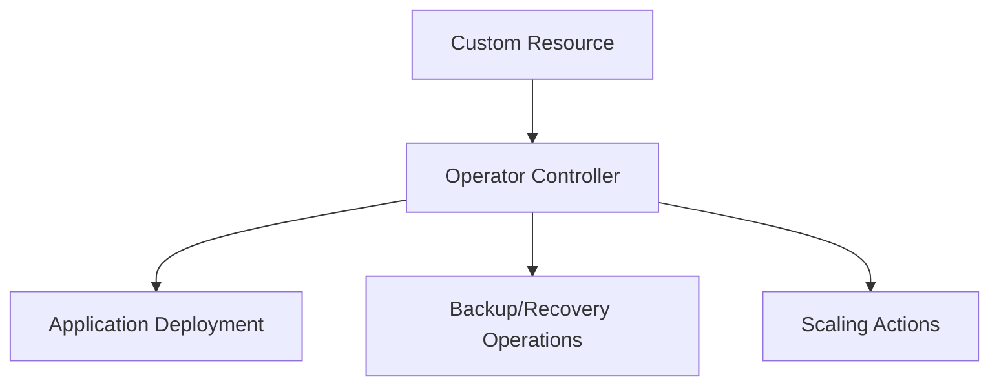
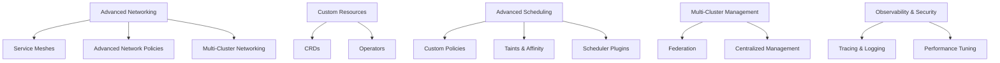

# Disclaimer
This repository contains information collected from various online sources and/or generated by AI assistants. The content provided here is for informational purposes only and is intended to serve as a general reference on various topics.

# Part 4: Advanced Topics

## Table of Contents

1. [Overview](#overview)
2. [Advanced Networking Configurations](#advanced-networking-configurations)
   - [Service Meshes](#service-meshes)
   - [Network Policies Deep Dive](#network-policies-deep-dive)
   - [Ingress and Egress Control](#ingress-and-egress-control)
   - [Multi-Cluster and Hybrid Networking](#multi-cluster-and-hybrid-networking)
3. [Custom Resource Definitions (CRDs) and Operators](#custom-resource-definitions-crds-and-operators)
   - [Understanding CRDs](#understanding-crds)
   - [Developing and Managing CRDs](#developing-and-managing-crds)
   - [Operators: Concepts and Implementation](#operators-concepts-and-implementation)
4. [Advanced Scheduling Techniques](#advanced-scheduling-techniques)
   - [Custom Scheduling Policies](#custom-scheduling-policies)
   - [Taints, Tolerations, and Affinity Rules](#taints-tolerations-and-affinity-rules)
   - [Scheduler Extenders and Plugins](#scheduler-extenders-and-plugins)
5. [Multi-Cluster Management and Federation](#multi-cluster-management-and-federation)
   - [Cluster Federation Concepts](#cluster-federation-concepts)
   - [Managing Multi-Cluster Deployments](#managing-multi-cluster-deployments)
   - [Case Studies and Best Practices](#case-studies-and-best-practices)
6. [Security, Observability, and Performance at Scale](#security-observability-and-performance-at-scale)
   - [Advanced Security Mechanisms](#advanced-security-mechanisms)
   - [Observability: Tracing and Distributed Logging](#observability-tracing-and-distributed-logging)
   - [Performance Tuning and Benchmarking](#performance-tuning-and-benchmarking)
7. [Automation and GitOps for Advanced Workloads](#automation-and-gitops-for-advanced-workloads)
   - [CI/CD for Complex Deployments](#cicd-for-complex-deployments)
   - [GitOps Workflows and Tools](#gitops-workflows-and-tools)
8. [Diagrams, Tables, and Visual References](#diagrams-tables-and-visual-references)
9. [Summary and Next Steps](#summary-and-next-steps)

---

## Overview

At this advanced stage, Kubernetes administrators are expected to handle complex architectures that go beyond basic installation and daily operations. This part covers topics that enable you to:
- Enhance network resilience and security through service meshes and advanced policies.
- Extend Kubernetes capabilities with CRDs and operators tailored to your applications.
- Customize scheduling policies to optimize resource utilization and meet specialized workloads.
- Manage multi-cluster environments and federate clusters for global deployments.
- Implement advanced observability, security, and performance tuning mechanisms.
- Leverage automation and GitOps methodologies to maintain consistency and streamline complex operations.

The following sections provide a detailed walkthrough of these advanced concepts, supported by diagrams, YAML examples, code snippets, and best-practice tables.

---

## Advanced Networking Configurations

Networking is the backbone of Kubernetes, and at scale, it requires a thorough understanding of both fundamental and advanced networking configurations.

### Service Meshes

Service meshes introduce an additional layer that manages inter-service communication. They provide features such as:

- **Traffic Management:**  
  Fine-grained control over routing, load balancing, and retries.
- **Security:**  
  Mutual TLS (mTLS) for encrypted service-to-service communication.
- **Observability:**  
  Distributed tracing, metrics, and logging for monitoring service interactions.
- **Resilience:**  
  Circuit breakers, fault injection, and rate limiting.

#### Popular Service Mesh Implementations

- **Istio:**  
  A widely adopted service mesh offering robust features including mTLS, traffic management, and policy enforcement.
- **Linkerd:**  
  Focused on simplicity and performance, Linkerd provides lightweight service mesh capabilities.
- **Consul Connect:**  
  Integrates service discovery with secure service-to-service communication.

#### Istio Deployment Example

Below is an example YAML snippet to deploy an Istio ingress gateway:

```yaml
apiVersion: networking.istio.io/v1alpha3
kind: Gateway
metadata:
  name: istio-ingressgateway
  namespace: istio-system
spec:
  selector:
    istio: ingressgateway
  servers:
  - port:
      number: 80
      name: http
      protocol: HTTP
    hosts:
    - "*"
```

> **Tip:** When deploying a service mesh, always monitor performance overhead and review security implications.

#### Service Mesh Architecture Diagram



*Figure: A simplified view of service mesh with sidecar proxies handling traffic between services.*

### Network Policies Deep Dive

Network policies are essential to control how pods communicate with each other and with external endpoints.

#### Complex Use Cases

- **Multi-Tier Applications:**  
  Isolate front-end, middleware, and database tiers with separate policies.
- **Dynamic Workloads:**  
  Define policies that change based on pod labels or namespaces.
- **Inter-Cluster Communication:**  
  Secure communication between services across federated clusters.

#### Advanced Network Policy Example

The following YAML demonstrates an advanced network policy that restricts ingress traffic to a pod labeled `role: backend` only from pods in the namespace `frontend` with the label `access: granted`:

```yaml
apiVersion: networking.k8s.io/v1
kind: NetworkPolicy
metadata:
  name: restrict-backend-access
  namespace: production
spec:
  podSelector:
    matchLabels:
      role: backend
  ingress:
  - from:
    - namespaceSelector:
        matchLabels:
          name: frontend
      podSelector:
        matchLabels:
          access: granted
  policyTypes:
  - Ingress
```

> **Note:** Use multiple policies to cover both ingress and egress controls for enhanced security.

### Ingress and Egress Control

Ingress controllers manage external access to services, while egress configurations ensure secure outbound traffic.

#### Ingress Controllers

- **NGINX Ingress Controller:**  
  Provides robust support for TLS termination, URL-based routing, and load balancing.
- **Traefik:**  
  Offers dynamic configuration and integrates with service discovery.
- **HAProxy:**  
  Known for its high performance and reliability in large-scale deployments.

#### Ingress Example with NGINX

```yaml
apiVersion: networking.k8s.io/v1
kind: Ingress
metadata:
  name: my-app-ingress
  annotations:
    nginx.ingress.kubernetes.io/rewrite-target: /
spec:
  rules:
  - host: myapp.example.com
    http:
      paths:
      - path: /
        pathType: Prefix
        backend:
          service:
            name: my-app-service
            port:
              number: 80
```

#### Egress Control Strategies

- **Egress Gateways:**  
  Use egress gateways to route all outbound traffic through a secure proxy.
- **Firewall Integration:**  
  Combine Kubernetes network policies with external firewall rules.
- **Logging and Monitoring:**  
  Track egress traffic to detect anomalies and potential data exfiltration.

### Multi-Cluster and Hybrid Networking

In environments where multiple clusters or hybrid architectures are used, advanced networking configurations ensure seamless connectivity and consistent security policies.

#### Multi-Cluster Networking Concepts

- **Inter-Cluster Communication:**  
  Enable services running in different clusters to communicate securely.
- **Centralized Policy Management:**  
  Use tools like Istio’s multi-cluster capabilities or Consul for consistent network policies.
- **Hybrid Cloud Connectivity:**  
  Bridge on-premises networks with public cloud clusters securely.

#### Diagram: Multi-Cluster Connectivity



*Figure: Multi-cluster connectivity model using a centralized gateway to interlink clusters and on-premises infrastructure.*

---

## Custom Resource Definitions (CRDs) and Operators

Extending Kubernetes through CRDs and operators allows you to create custom workflows and automate application management.

### Understanding CRDs

Custom Resource Definitions (CRDs) enable you to define new types of resources beyond the built-in ones (e.g., Pods, Services). With CRDs, you can:

- Model domain-specific objects.
- Define custom validation, conversion, and defaulting logic.
- Create a seamless integration between Kubernetes and your application’s operational needs.

#### CRD Example

Below is a simple CRD that defines a custom resource named `Database`:

```yaml
apiVersion: apiextensions.k8s.io/v1
kind: CustomResourceDefinition
metadata:
  name: databases.mycompany.com
spec:
  group: mycompany.com
  versions:
    - name: v1
      served: true
      storage: true
      schema:
        openAPIV3Schema:
          type: object
          properties:
            spec:
              type: object
              properties:
                engine:
                  type: string
                version:
                  type: string
                storage:
                  type: integer
  scope: Namespaced
  names:
    plural: databases
    singular: database
    kind: Database
    shortNames:
    - db
```

> **Tip:** Validate your CRD definitions using tools like `kubectl explain` to ensure they adhere to the schema.

### Developing and Managing CRDs

Administrators should use version control and CI/CD pipelines to manage CRDs and ensure compatibility during upgrades. Best practices include:

- **Versioning:**  
  Maintain multiple versions of a CRD to allow smooth transitions between API changes.
- **Validation:**  
  Use OpenAPI validation within CRDs to enforce data integrity.
- **Documentation:**  
  Provide clear documentation and examples for developers using your custom resources.

#### Table: CRD Best Practices

| Best Practice         | Description                                                  | Recommended Action                              |
|-----------------------|--------------------------------------------------------------|-------------------------------------------------|
| Versioning            | Support multiple versions for backward compatibility         | Implement version conversion strategies         |
| Schema Validation     | Enforce data types and constraints                           | Define `openAPIV3Schema` in your CRD manifest      |
| Clear Documentation   | Provide usage guides and examples for CRD consumers            | Maintain a README in your Git repository          |

### Operators: Concepts and Implementation

Operators extend Kubernetes by automating complex application lifecycle management. They encapsulate domain knowledge in custom controllers to manage CRDs.

#### Key Concepts

- **Operator Pattern:**  
  Uses a control loop to monitor and manage application-specific resources.
- **Automation:**  
  Automates tasks such as installation, upgrades, backup, and recovery for stateful applications.
- **Extensibility:**  
  Operators can be built using frameworks such as the Operator SDK, Kubebuilder, or Ansible Operator.

#### Operator Example Workflow

1. **Resource Definition:**  
   Create a CRD to represent your application (e.g., a Database resource).
2. **Controller Logic:**  
   Implement a controller that watches for changes to the CRD and performs actions (e.g., scaling or backup).
3. **Deployment:**  
   Package the operator as a container image and deploy it in your cluster.

#### Diagram: Operator Workflow



*Figure: A high-level operator workflow managing a custom resource lifecycle.*

#### Real-World Operators

- **Prometheus Operator:**  
  Manages the lifecycle of Prometheus instances, including configuration and scaling.
- **MongoDB Community Operator:**  
  Automates deployment, scaling, and backups for MongoDB clusters.
- **Custom Operators:**  
  Many organizations develop in-house operators to handle domain-specific needs.

---

## Advanced Scheduling Techniques

Optimizing how workloads are scheduled across your cluster can greatly improve efficiency and performance.

### Custom Scheduling Policies

Kubernetes offers ways to customize the default scheduling behavior:

- **Pod Affinity/Anti-Affinity:**  
  Define rules that ensure certain pods are co-located or separated.
- **Priority Classes:**  
  Assign priorities to pods so that critical workloads are scheduled before others.
- **Preemption:**  
  Allow higher-priority pods to preempt lower-priority ones if resources are constrained.

#### Custom Scheduling Example

```yaml
apiVersion: scheduling.k8s.io/v1
kind: PriorityClass
metadata:
  name: high-priority
value: 1000000
globalDefault: false
description: "This priority class should be used for critical workloads."
```

### Taints, Tolerations, and Affinity Rules

These scheduling features ensure optimal placement of pods based on node characteristics and workload requirements.

#### Taints and Tolerations

- **Taints:**  
  Mark nodes to repel certain pods unless they have the corresponding toleration.
- **Tolerations:**  
  Allow pods to be scheduled on tainted nodes if they tolerate the taint.

```yaml
apiVersion: v1
kind: Pod
metadata:
  name: tolerant-pod
spec:
  tolerations:
  - key: "dedicated"
    operator: "Equal"
    value: "critical"
    effect: "NoSchedule"
```

#### Node Affinity

- **Required Affinity:**  
  Specify hard rules that must be met for pod scheduling.
- **Preferred Affinity:**  
  Define soft rules that influence but do not guarantee scheduling decisions.

```yaml
apiVersion: v1
kind: Pod
metadata:
  name: affinity-pod
spec:
  affinity:
    nodeAffinity:
      requiredDuringSchedulingIgnoredDuringExecution:
        nodeSelectorTerms:
        - matchExpressions:
          - key: "region"
            operator: "In"
            values:
            - "us-east-1"
```

### Scheduler Extenders and Plugins

Extend Kubernetes scheduling capabilities with custom scheduler extenders or plugins. This allows you to integrate bespoke logic into the scheduling process.

#### Scheduler Extender Architecture

- **Extender API:**  
  The scheduler calls out to an external process that can filter or score nodes.
- **Custom Plugins:**  
  Build plugins using the Kubernetes scheduler framework to influence scheduling decisions.

#### Example: Custom Scheduler Plugin Outline

```go
// Pseudocode for a scheduler plugin
func (p *MyPlugin) Score(ctx context.Context, state *framework.CycleState, pod *v1.Pod, nodeName string) (int64, *framework.Status) {
    // Implement custom scoring logic here
    score := calculateCustomScore(pod, nodeName)
    return score, framework.NewStatus(framework.Success)
}
```

> **Note:** When using custom scheduling, thoroughly test your extenders or plugins in staging environments to prevent unexpected production issues.

---

## Multi-Cluster Management and Federation

Managing multiple Kubernetes clusters across regions or clouds introduces additional challenges but also offers significant advantages in terms of resilience and global reach.

### Cluster Federation Concepts

Cluster federation allows you to manage multiple clusters as a single entity. Key benefits include:

- **Global Load Balancing:**  
  Distribute traffic across clusters based on latency, availability, or region.
- **Centralized Policy Management:**  
  Apply security, resource, and deployment policies across clusters uniformly.
- **Disaster Recovery:**  
  Seamlessly fail over workloads from one cluster to another.

### Managing Multi-Cluster Deployments

Tools and frameworks for multi-cluster management include:

- **KubeFed (Kubernetes Federation):**  
  Provides a way to federate multiple clusters and manage resources across them.
- **Rancher:**  
  Offers a centralized management interface for multiple clusters.
- **Custom Automation:**  
  Use GitOps pipelines and configuration management to deploy consistent workloads.

#### Diagram: Federated Multi-Cluster Architecture

```mermaid
flowchart TD
    A[Cluster 1] ---|
                    |--> B[Federation Control Plane]
    C[Cluster 2] ---|
                    |--> D[Centralized Management]
    E[Cluster 3] ---|
```

*Figure: Federated clusters managed via a central control plane.*

### Case Studies and Best Practices

- **Case Study: Global Retail Deployment**  
  A global retailer deployed Kubernetes clusters in North America, Europe, and Asia. Using KubeFed and a centralized GitOps pipeline, they achieved:
  - **Consistent Policy Enforcement:** All clusters maintained identical security and resource policies.
  - **Traffic Management:** An external global load balancer routed user requests to the nearest available cluster.
  - **Disaster Recovery:** In the event of a regional outage, workloads were automatically rescheduled to clusters in unaffected regions.

- **Best Practices:**
  - **Version Synchronization:** Ensure that all clusters run compatible Kubernetes versions.
  - **Centralized Logging and Monitoring:** Aggregate metrics and logs from all clusters for unified observability.
  - **Automated Backups:** Use consistent backup strategies across clusters.

---

## Security, Observability, and Performance at Scale

When operating at scale, advanced security, observability, and performance tuning become paramount.

### Advanced Security Mechanisms

- **Pod Security Policies (PSP) / Pod Security Standards:**  
  Enforce policies to restrict container privileges, filesystem access, and host networking.
- **Admission Controllers:**  
  Use mutating and validating admission controllers to enforce security policies at the API level.
- **Runtime Security:**  
  Implement tools such as Falco or Aqua Security to monitor for suspicious container behaviors.
- **Zero Trust Networking:**  
  Combine service meshes with network segmentation to create a zero trust environment.

### Observability: Tracing and Distributed Logging

- **Distributed Tracing:**  
  Use tools like Jaeger or Zipkin to trace requests as they traverse microservices.
- **Centralized Logging at Scale:**  
  Enhance logging stacks to handle large volumes of log data. Consider Elasticsearch clusters or managed logging services.
- **Metric Aggregation:**  
  Fine-tune Prometheus configurations to scrape and store metrics efficiently. Use remote storage integrations if necessary.

### Performance Tuning and Benchmarking

- **Resource Allocation:**  
  Continuously monitor and adjust resource requests, limits, and node configurations.
- **Benchmarking Tools:**  
  Use tools such as kube-burner or custom scripts to simulate load and measure performance.
- **Capacity Planning:**  
  Regularly review resource usage trends and plan for future capacity needs.

#### Performance Tuning Checklist

| Aspect                      | Key Actions                                         | Recommended Tools                 |
|-----------------------------|-----------------------------------------------------|-----------------------------------|
| API Server Performance      | Monitor request latency, scale replicas as needed    | Prometheus, Grafana               |
| etcd Health                 | Tune snapshot intervals and compaction settings      | etcdctl, Prometheus               |
| Node Resource Utilization   | Adjust CPU, memory requests/limits, and autoscaling    | kubectl top, Cluster Autoscaler   |
| Network Throughput          | Optimize CNI configurations and review policy overhead | iperf, custom network testing     |

---

## Automation and GitOps for Advanced Workloads

Automation is crucial for managing complex, dynamic environments. GitOps practices can help ensure consistency and traceability.

### CI/CD for Complex Deployments

- **Pipeline Integration:**  
  Integrate Kubernetes deployments into CI/CD pipelines that automatically validate, test, and deploy changes.
- **Canary and Blue/Green Deployments:**  
  Use advanced deployment strategies to minimize risk during updates.
- **Rollout Strategies:**  
  Define automated rollback policies in case of deployment failures.

### GitOps Workflows and Tools

- **Flux and Argo CD:**  
  Both tools continuously reconcile cluster state with a Git repository, providing audit trails and automated deployments.
- **Configuration as Code:**  
  Store all Kubernetes manifests, CRDs, and operator configurations in Git. Use branch strategies to manage production and development environments.
- **Automated Testing:**  
  Integrate tools such as kubeval or conftest to validate configurations before they reach production.

#### GitOps Workflow Diagram


*Figure: A simplified GitOps workflow integrating CI/CD pipelines with automated production deployments.*

---

## Diagrams, Tables, and Visual References

### Advanced Topics Overview Diagram



### Advanced Topics Comparison Table

| Feature                          | Description                                               | When to Use                                               |
|----------------------------------|-----------------------------------------------------------|-----------------------------------------------------------|
| **Service Mesh**                 | Advanced traffic management and security layer            | Microservices with complex interdependencies              |
| **Custom Resource Definitions**  | Extend Kubernetes with new resource types                 | Domain-specific objects requiring custom logic             |
| **Operators**                    | Automated lifecycle management for stateful apps          | Complex applications that need continuous management       |
| **Custom Scheduling Policies**   | Fine-tuning workload placement based on custom metrics      | Workloads with specialized resource or latency requirements  |
| **Cluster Federation**           | Managing multiple clusters under a single control plane     | Global deployments and high availability across regions     |

---

## Summary and Next Steps

In this Part 4, we explored advanced topics that empower Kubernetes administrators to extend and optimize cluster functionalities at scale. Key points include:

- **Advanced Networking:**  
  Detailed configurations of service meshes, network policies, ingress/egress control, and multi-cluster networking ensure robust, secure, and flexible connectivity.
- **CRDs and Operators:**  
  By creating custom resources and implementing operators, you can automate complex application management tasks and extend Kubernetes’ native capabilities.
- **Advanced Scheduling:**  
  Custom scheduling techniques—including priority classes, affinity rules, and scheduler plugins—enable optimized workload placement to meet stringent performance requirements.
- **Multi-Cluster Management:**  
  Federation and multi-cluster management strategies facilitate global deployments and centralized control, enhancing resilience and scalability.
- **Security, Observability, and Performance:**  
  Advanced security measures, comprehensive observability through distributed tracing and logging, and performance tuning ensure that large-scale deployments remain secure and efficient.
- **Automation and GitOps:**  
  Implementing GitOps workflows and integrating CI/CD pipelines supports rapid, reliable deployments and reduces operational overhead.

---

