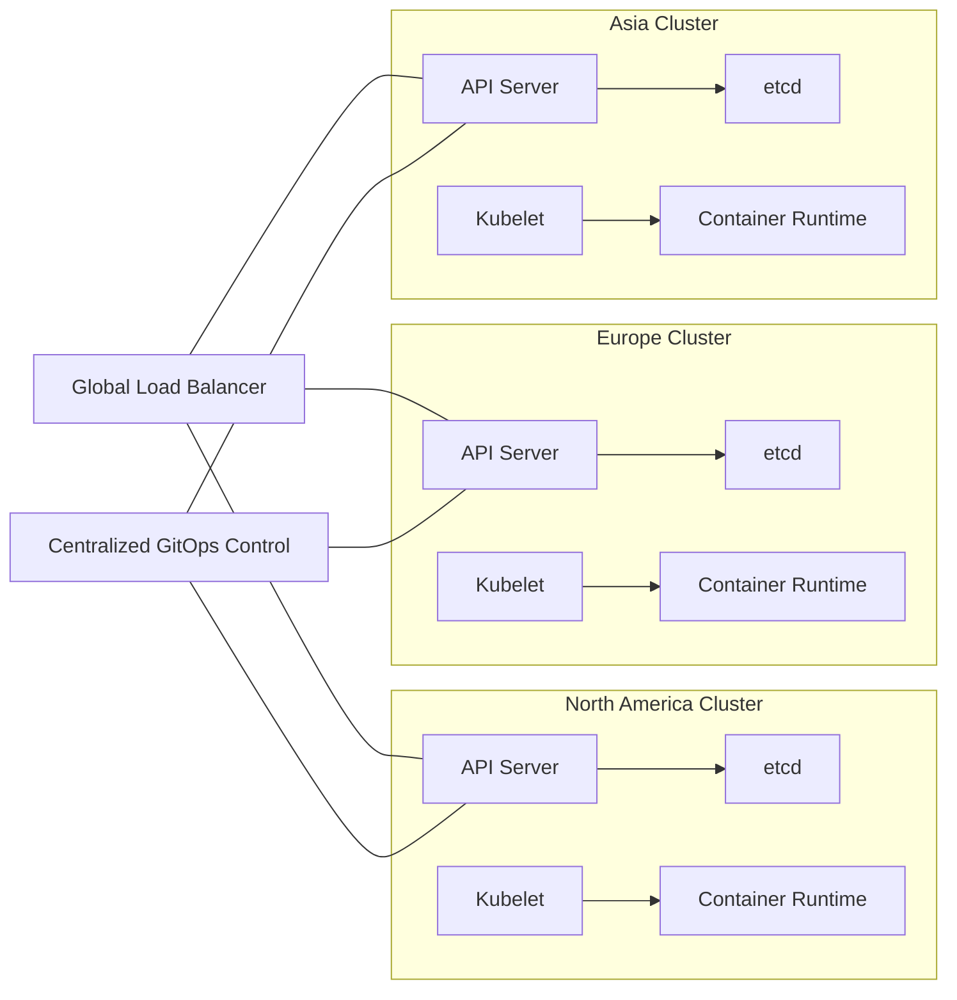

# Disclaimer
This repository contains information collected from various online sources and/or generated by AI assistants. The content provided here is for informational purposes only and is intended to serve as a general reference on various topics.

# Part 5: Case Studies, Best Practices, and Final Wrap-Up

## Table of Contents

1. [Introduction](#introduction)
2. [Case Studies](#case-studies)
   - [Case Study 1: Global Retail Deployment](#case-study-1-global-retail-deployment)
   - [Case Study 2: Financial Services High-Availability Cluster](#case-study-2-financial-services-high-availability-cluster)
   - [Case Study 3: Continuous Delivery in a Multi-Cloud Environment](#case-study-3-continuous-delivery-in-a-multi-cloud-environment)
3. [Best Practices for Kubernetes Administration](#best-practices-for-kubernetes-administration)
   - [Design and Architecture Best Practices](#design-and-architecture-best-practices)
   - [Security Best Practices](#security-best-practices)
   - [Performance and Resource Management Best Practices](#performance-and-resource-management-best-practices)
   - [Operational and Maintenance Best Practices](#operational-and-maintenance-best-practices)
4. [Performance Tuning and Benchmarking Strategies](#performance-tuning-and-benchmarking-strategies)
   - [Benchmarking Tools and Methodologies](#benchmarking-tools-and-methodologies)
   - [Tuning the API Server and etcd](#tuning-the-api-server-and-etcd)
   - [Node and Network Performance Optimization](#node-and-network-performance-optimization)
5. [Final Wrap-Up and Future Directions](#final-wrap-up-and-future-directions)
   - [Consolidated Summary of the Guide](#consolidated-summary-of-the-guide)
   - [Emerging Trends and Future Considerations](#emerging-trends-and-future-considerations)
6. [Appendices and Additional Resources](#appendices-and-additional-resources)
   - [Glossary of Terms](#glossary-of-terms)
   - [Reference Materials and Further Reading](#reference-materials-and-further-reading)
7. [Conclusion](#conclusion)

---

## Introduction

In this final part of the guide, we focus on sharing real-world experiences through case studies, outlining comprehensive best practices, and detailing performance tuning strategies to empower you to administer Kubernetes clusters at scale. We will also provide a consolidated wrap-up of the entire guide and discuss future trends that may affect Kubernetes administration. This section is aimed at administrators who have mastered the basics and advanced topics and are now looking to apply these concepts in diverse production environments.

---

## Case Studies

Case studies provide concrete examples of how Kubernetes has been deployed and managed in real-world scenarios. They highlight the challenges faced, solutions implemented, and lessons learned during the operation of large-scale Kubernetes clusters.

### Case Study 1: Global Retail Deployment

#### Overview

A major global retailer sought to modernize its IT infrastructure by deploying Kubernetes clusters across multiple geographic regions. The goal was to achieve global load balancing, improve application resiliency, and enforce centralized security policies while accommodating local regulatory requirements.

#### Architecture and Design

- **Multi-Cluster Federation:**  
  The retailer federated clusters across North America, Europe, and Asia. Each cluster was optimized for local latency and compliance while being managed centrally.
- **Service Mesh Implementation:**  
  Istio was deployed to manage inter-service communications, enabling secure mTLS connections, traffic splitting, and distributed tracing.
- **Centralized Management:**  
  A GitOps-based approach was adopted using Argo CD to ensure that policies and application configurations were consistently applied across clusters.

#### Key Challenges

- **Latency and Network Partitioning:**  
  Varying network conditions required adaptive load balancing and failover strategies.
- **Regulatory Compliance:**  
  Data sovereignty laws necessitated strict network segmentation and localized secret management.
- **Operational Complexity:**  
  Coordinating updates and policy changes across clusters demanded robust automation and clear documentation.

#### Solutions and Outcomes

- **Automated Rollouts:**  
  The use of canary deployments and blue/green strategies minimized downtime during updates.
- **Enhanced Observability:**  
  Centralized logging and distributed tracing enabled rapid troubleshooting of cross-region issues.
- **Resilient Architecture:**  
  High availability was ensured by deploying redundant control plane nodes and automating node replacement in the event of failure.

#### Diagram: Global Retail Deployment Architecture



*Figure: Simplified architecture of a federated, multi-region Kubernetes deployment for a global retailer.*

### Case Study 2: Financial Services High-Availability Cluster

#### Overview

A financial institution with mission-critical trading applications required a highly available Kubernetes cluster with stringent security and performance requirements. The objective was to minimize downtime, ensure rapid failover, and meet compliance mandates.

#### Architecture and Design

- **High Availability (HA) Setup:**  
  Multiple control plane nodes were deployed behind a robust load balancer. A distributed etcd cluster with regular automated backups ensured data integrity.
- **Strict Security Controls:**  
  RBAC policies, network segmentation, and runtime security monitoring were implemented. Secrets were managed with encryption at rest and integrated with an external vault.
- **Performance Optimization:**  
  Custom scheduling policies, node affinity rules, and real-time monitoring ensured that high-priority trading applications received the necessary resources.

#### Key Challenges

- **Downtime Minimization:**  
  The financial industry’s strict uptime requirements necessitated zero-downtime deployments and rapid failover mechanisms.
- **Security and Compliance:**  
  Continuous auditing and adherence to financial regulations required enhanced logging and real-time threat detection.
- **Resource Contention:**  
  Intensive trading workloads sometimes led to resource contention, requiring dynamic scaling and performance tuning.

#### Solutions and Outcomes

- **Automated Failover:**  
  The deployment of Cluster Autoscaler and preemptive scheduling ensured that resources were available even during peak loads.
- **Enhanced Monitoring:**  
  Prometheus and Grafana were configured with custom dashboards, alerting on resource usage anomalies and API server latency.
- **Compliance Auditing:**  
  Regular security audits and automated vulnerability scanning reduced the risk of breaches and maintained regulatory compliance.

#### Table: Key Metrics and SLA Targets

| Metric                   | Target SLA                          | Tool/Method                   |
|--------------------------|-------------------------------------|-------------------------------|
| API Server Latency       | < 100 ms (95th percentile)          | Prometheus, Grafana           |
| Node Availability        | 99.99% uptime                       | Health checks, Autoscaler     |
| Data Backup Frequency    | Every 15 minutes                    | etcdctl snapshot, Cron jobs   |
| Security Audit Frequency | Weekly                              | Automated scanning, Manual review |

### Case Study 3: Continuous Delivery in a Multi-Cloud Environment

#### Overview

A technology company operating in a competitive market adopted Kubernetes to support rapid application development and continuous delivery across multiple cloud providers. The aim was to accelerate time-to-market while maintaining stability and high quality.

#### Architecture and Design

- **Multi-Cloud Strategy:**  
  Clusters were deployed across AWS, GCP, and Azure, with a centralized GitOps repository to manage configurations.
- **CI/CD Integration:**  
  Jenkins pipelines and Argo CD were integrated to automate build, test, and deployment processes. Canary releases and automated rollbacks were implemented to reduce risk.
- **Dynamic Resource Management:**  
  Horizontal and vertical autoscaling were tuned to respond to varying workloads, and custom metrics were used to drive scaling decisions.

#### Key Challenges

- **Interoperability Across Clouds:**  
  Managing different cloud APIs and networking models required abstracted configuration management.
- **Rapid Deployment Cycles:**  
  High release frequency necessitated robust testing and rollback mechanisms.
- **Visibility and Control:**  
  Ensuring consistent monitoring and observability across diverse environments was critical.

#### Solutions and Outcomes

- **Unified Management:**  
  GitOps practices ensured that all clusters were synchronized, and configuration drift was minimized.
- **Automated Rollbacks:**  
  In the event of deployment failures, automated rollback procedures reduced downtime and minimized impact.
- **Performance Consistency:**  
  Standardized resource quotas and autoscaling policies across clouds ensured predictable performance.

#### Diagram: Multi-Cloud CI/CD Pipeline

```mermaid
flowchart LR
    A[Git Repository] --> B[CI Pipeline (Jenkins)]
    B --> C[Build & Test]
    C --> D[Argo CD Sync]
    D --> E[AWS Cluster]
    D --> F[GCP Cluster]
    D --> G[Azure Cluster]
    H[Monitoring & Logging] --- E
    H --- F
    H --- G
```

*Figure: A high-level overview of a CI/CD pipeline integrated with multi-cloud Kubernetes clusters.*

---

## Best Practices for Kubernetes Administration

To achieve a stable, secure, and high-performing Kubernetes environment, it is essential to follow comprehensive best practices that encompass design, security, performance, and operational procedures.

### Design and Architecture Best Practices

- **Cluster Planning:**  
  - Define clear roles and responsibilities for control plane and worker nodes.
  - Use node pools to segregate workloads by resource needs and security domains.
  - Design for high availability by deploying multiple control plane nodes and distributed etcd clusters.
- **Network Design:**  
  - Plan network topology with an emphasis on minimal latency and secure segmentation.
  - Choose the appropriate CNI plugin based on workload and policy requirements.
  - Implement service meshes for enhanced traffic management and observability.
- **Scalability Considerations:**  
  - Utilize autoscaling for pods and nodes to dynamically match resource demands.
  - Maintain a modular architecture that allows independent scaling of different components.

### Security Best Practices

- **Access Control:**  
  - Enforce strict RBAC policies with the principle of least privilege.
  - Regularly review and audit access permissions.
- **Data Protection:**  
  - Enable encryption for etcd data and Kubernetes secrets.
  - Integrate with external secrets management systems (e.g., HashiCorp Vault) for added security.
- **Network Security:**  
  - Define comprehensive network policies to restrict pod-to-pod and external communications.
  - Use service meshes to enforce mTLS for secure service-to-service communication.
- **Compliance and Auditing:**  
  - Enable audit logging on the API server and continuously monitor for unauthorized changes.
  - Regularly perform vulnerability scans on container images and cluster components.

### Performance and Resource Management Best Practices

- **Resource Requests and Limits:**  
  - Set clear CPU and memory requests/limits for each container to prevent resource contention.
  - Implement resource quotas and limit ranges at the namespace level.
- **Monitoring and Logging:**  
  - Deploy centralized monitoring solutions (e.g., Prometheus, Grafana) to capture real-time metrics.
  - Use distributed logging stacks (e.g., ELK or EFK) for comprehensive log analysis.
- **Autoscaling:**  
  - Leverage Horizontal Pod Autoscaling (HPA) and Vertical Pod Autoscaling (VPA) to optimize workload distribution.
  - Use Cluster Autoscaler to dynamically adjust node counts based on demand.

### Operational and Maintenance Best Practices

- **Automation and GitOps:**  
  - Store all configuration files and Kubernetes manifests in version-controlled repositories.
  - Utilize GitOps tools such as Argo CD or Flux to automate cluster configuration reconciliation.
- **Regular Maintenance:**  
  - Schedule routine health checks, security audits, and performance reviews.
  - Document maintenance procedures and perform regular disaster recovery drills.
- **Backup and Restore:**  
  - Implement automated etcd backups and regularly test restore procedures.
  - Maintain up-to-date backups of critical configuration files and custom resource definitions (CRDs).

#### Best Practices Checklist

| Category              | Best Practice                                                   | Actionable Steps                                         |
|-----------------------|-----------------------------------------------------------------|----------------------------------------------------------|
| **Design**            | High Availability and Scalability                              | Use multiple control planes, autoscaling, and node pools |
| **Security**          | Strict Access Control and Data Encryption                       | Enforce RBAC, enable audit logging, encrypt secrets      |
| **Performance**       | Resource Optimization and Monitoring                            | Set resource quotas, deploy Prometheus and Grafana         |
| **Operations**        | Automation and Regular Maintenance                              | Implement GitOps, schedule maintenance and DR drills     |

---

## Performance Tuning and Benchmarking Strategies

Achieving optimal performance in a Kubernetes cluster involves ongoing tuning and benchmarking. This section outlines strategies and tools for measuring and optimizing performance across various cluster components.

### Benchmarking Tools and Methodologies

- **kube-burner:**  
  A tool designed to simulate large-scale workloads and measure performance under stress.
- **Custom Load Testing:**  
  Use tools like Apache JMeter or Locust to simulate application-level traffic and identify bottlenecks.
- **Synthetic Monitoring:**  
  Implement synthetic tests to monitor API server responsiveness and network latency.

#### Methodology

1. **Baseline Measurements:**  
   - Establish baseline performance metrics for API server latency, node resource usage, and network throughput.
2. **Stress Testing:**  
   - Run load tests to simulate peak usage scenarios and observe scaling behavior.
3. **Continuous Monitoring:**  
   - Integrate benchmarking into CI/CD pipelines to detect performance regressions.
4. **Iterative Tuning:**  
   - Adjust resource limits, autoscaling parameters, and network configurations based on test outcomes.

### Tuning the API Server and etcd

- **API Server:**  
  - Scale API server replicas behind a load balancer.
  - Optimize request handling by tuning parameters (e.g., max-requests-inflight).
  - Monitor audit logs to identify excessive API calls.
- **etcd:**  
  - Regularly compact and defragment etcd to maintain optimal performance.
  - Configure snapshot intervals based on cluster size and activity.
  - Monitor etcd metrics such as commit durations and leader elections.

### Node and Network Performance Optimization

- **Node Configuration:**  
  - Optimize kernel parameters (e.g., `net.core.somaxconn`, `fs.file-max`) for high throughput.
  - Use high-performance storage (e.g., SSDs) for etcd and container images.
- **Network Optimization:**  
  - Fine-tune CNI plugin configurations for optimal packet processing.
  - Use network performance tools (e.g., iperf, netperf) to measure throughput and latency.
  - Implement traffic shaping and QoS policies to prioritize critical application traffic.

#### Performance Tuning Checklist

| Component             | Key Metrics                         | Tuning Recommendations                            |
|-----------------------|-------------------------------------|--------------------------------------------------|
| API Server            | Request latency, error rate         | Scale replicas, adjust concurrency settings      |
| etcd                  | Commit duration, snapshot size      | Regular compaction, optimized snapshot intervals |
| Nodes                 | CPU/memory utilization, I/O latency | Optimize kernel parameters, upgrade hardware       |
| Network               | Packet loss, throughput             | Tune CNI, implement QoS, monitor with iperf         |

---

## Final Wrap-Up and Future Directions

This section provides a consolidated summary of the guide and discusses emerging trends that will shape the future of Kubernetes administration.

### Consolidated Summary of the Guide

Over the course of this comprehensive guide, we have covered:

- **Foundational Concepts and Architecture:**  
  Understanding Kubernetes’ control plane, worker nodes, core components (API server, etcd, kubelet, kube-proxy), and how they interact.
- **Installation and Cluster Setup:**  
  Detailed steps for setting up a cluster using kubeadm, along with considerations for network configuration, high availability, and security.
- **Day-to-Day Administration:**  
  Practical aspects of monitoring, logging, autoscaling, upgrades, backups, and troubleshooting techniques.
- **Advanced Topics:**  
  In-depth coverage of service meshes, advanced network policies, custom resource definitions, operators, custom scheduling, and multi-cluster management.
- **Real-World Case Studies:**  
  Examples of global retail deployments, financial services clusters, and multi-cloud CI/CD pipelines that illustrate best practices and operational challenges.
- **Best Practices and Performance Tuning:**  
  Checklists, tables, and methodologies to ensure that your Kubernetes clusters are secure, performant, and resilient.

Collectively, this guide is designed to be a living document—a reference that administrators can adapt as technologies and best practices evolve.

### Emerging Trends and Future Considerations

As Kubernetes continues to grow and mature, several trends are poised to influence its administration:

- **Serverless and FaaS Integration:**  
  Increasing convergence of Kubernetes with serverless frameworks will change how workloads are deployed and scaled.
- **Edge Computing:**  
  The proliferation of edge devices will drive new use cases and architectural patterns for distributed Kubernetes clusters.
- **Enhanced Observability:**  
  With more advanced tracing, telemetry, and AI-driven anomaly detection, clusters will become even more self-healing and adaptive.
- **Security Automation:**  
  Future Kubernetes environments will likely incorporate more automated security controls, including AI-powered threat detection and self-remediation.
- **Standardization and Certification:**  
  Continued efforts to standardize Kubernetes distributions and administrative practices will ease the learning curve and promote interoperability.
- **Hybrid and Multi-Cloud Deployments:**  
  As enterprises increasingly adopt multi-cloud and hybrid strategies, federated cluster management will become a core competency for administrators.

Administrators are encouraged to stay current with the latest CNCF projects, community discussions, and vendor innovations to remain competitive in a rapidly evolving ecosystem.

---

## Appendices and Additional Resources

### Glossary of Terms

- **API Server:**  
  The central component that exposes the Kubernetes API.
- **etcd:**  
  A distributed key-value store used to hold cluster configuration and state.
- **Pod:**  
  The smallest deployable unit in Kubernetes, consisting of one or more containers.
- **CRD (Custom Resource Definition):**  
  A mechanism to define custom resource types.
- **Operator:**  
  An application-specific controller that extends Kubernetes’ capabilities by automating complex operations.
- **Service Mesh:**  
  A dedicated infrastructure layer for managing service-to-service communications.

### Reference Materials and Further Reading

- [Kubernetes Official Documentation](https://kubernetes.io/docs/)
- [CNCF Landscape](https://landscape.cncf.io/)
- [Prometheus Monitoring](https://prometheus.io/)
- [Istio Service Mesh](https://istio.io/)
- [KubeFed Documentation](https://github.com/kubernetes-sigs/kubefed)

---

## Conclusion

Kubernetes administration at scale demands a robust understanding of architecture, a commitment to security, and a proactive approach to monitoring and maintenance. In this guide, we have traversed the entire lifecycle of managing a Kubernetes cluster—from initial setup and daily operations to advanced networking, custom resource management, and multi-cluster federation. The case studies and best practices shared herein serve as real-world validations of the strategies discussed and offer actionable insights for tackling challenges in production environments.

As you continue to build and maintain Kubernetes clusters, remember that automation, rigorous monitoring, and continuous improvement are key to success. Embrace emerging technologies and community best practices to ensure that your clusters remain secure, scalable, and efficient in the face of evolving business needs and technological advancements.

Thank you for engaging with this comprehensive guide. We hope it serves as a valuable resource in your Kubernetes administration journey.

---

*End of Part 5*

---
