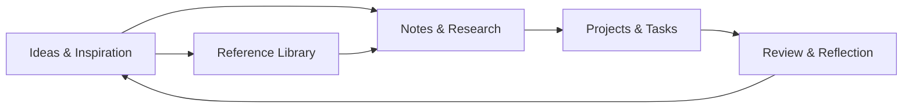
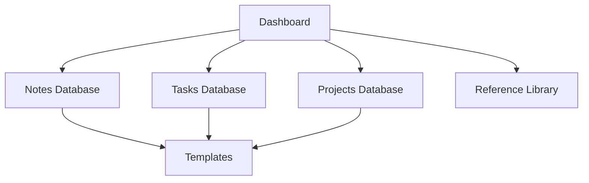
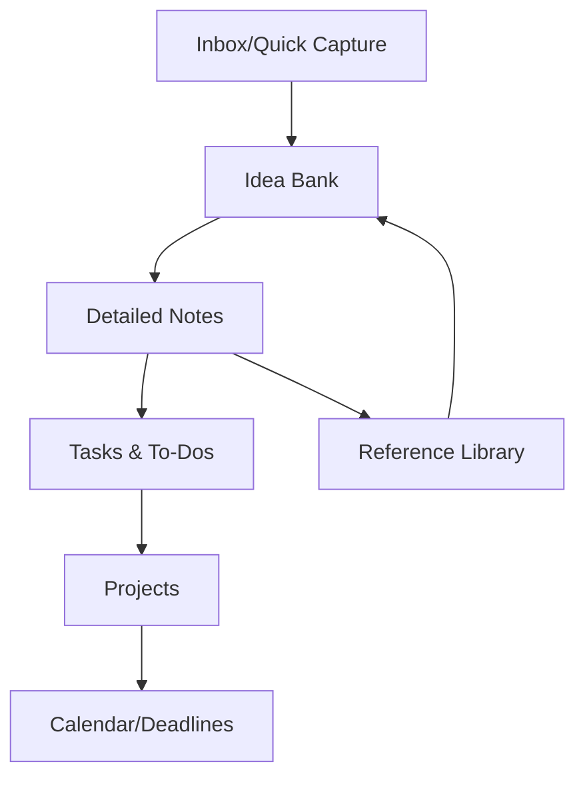
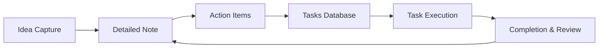
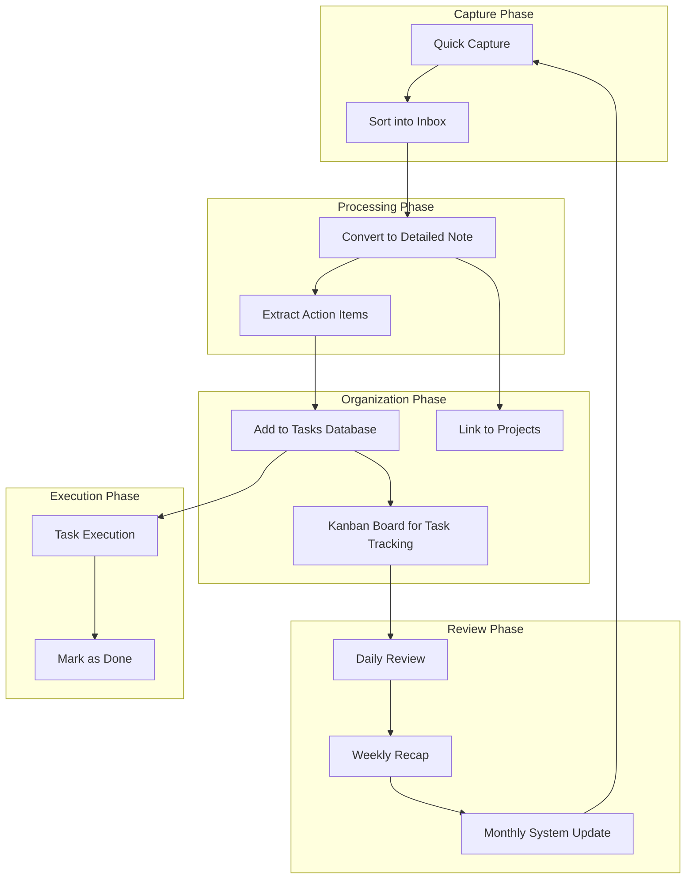

# Disclaimer
This repository contains information collected from various online sources and/or generated by AI assistants. The content provided here is for informational purposes only and is intended to serve as a general reference on various topics.

Below is an extensive GitHub-formatted guide on how to build a robust Personal Knowledge Management (PKM) system in Notion that also integrates effective task management. This guide is designed to be comprehensive and detailed, with plenty of bullet points, examples, and even Mermaid diagrams to visually explain the concepts. The guide is written in English, but feel free to ask if you need clarifications or a Portuguese version later.

---

# Building a Personal Knowledge Management System with Task Management in Notion: A Comprehensive Guide

> **Table of Contents**
>
> 1. [Introduction](#introduction)
> 2. [Understanding Personal Knowledge Management (PKM)](#understanding-personal-knowledge-management-pkm)
> 3. [Overview of Notion](#overview-of-notion)
> 4. [Designing Your Personal Knowledge Management System in Notion](#designing-your-personal-knowledge-management-system-in-notion)
> 5. [Integrating Task Management into Your PKM](#integrating-task-management-into-your-pkm)
> 6. [Step-by-Step Guide to Setting Up Your Notion Workspace](#step-by-step-guide-to-setting-up-your-notion-workspace)
> 7. [Advanced Techniques and Customizations](#advanced-techniques-and-customizations)
> 8. [Case Studies and Real-World Examples](#case-studies-and-real-world-examples)
> 9. [Conclusion and Next Steps](#conclusion-and-next-steps)
> 10. [Additional Resources](#additional-resources)

---

## Introduction

In an era where information is abundant and time is limited, establishing an efficient system for managing both knowledge and tasks is essential. **Personal Knowledge Management (PKM)** is more than just note-taking—it's a holistic approach to capturing, organizing, and retrieving information in a way that enhances your personal and professional productivity. Notion, a versatile all-in-one workspace, has emerged as a favorite tool for building such systems due to its flexibility, rich feature set, and ease of customization.

This guide aims to provide you with an in-depth look at how to leverage Notion to create a personal knowledge management system that integrates task management seamlessly. Whether you’re a student, a professional, or simply someone who wants to bring order to your digital life, the techniques discussed here will help you build a system that not only stores your ideas but also helps you act on them.

### What You Will Learn

- **Core Concepts of PKM:** Understand the philosophy behind personal knowledge management, and learn why it matters.
- **Notion Basics:** Get an overview of Notion’s features and how they can be tailored to your needs.
- **System Design:** Learn how to structure your workspace to capture notes, tasks, projects, and ideas.
- **Task Integration:** Discover how to blend your PKM with effective task management strategies.
- **Practical Examples:** Follow detailed bullet-point guides and real-world examples to set up your workspace.
- **Visual Explanations:** Utilize Mermaid diagrams to see how components of your system interact.
- **Advanced Customizations:** Explore ways to automate and further personalize your system.

By the end of this guide, you should have a clear roadmap and actionable steps to create a powerful PKM system in Notion that enhances both your knowledge capture and task execution.

### Why PKM with Task Management?

- **Centralized Hub:** Consolidate your notes, ideas, tasks, and projects in one accessible place.
- **Enhanced Productivity:** Link ideas with actions, ensuring that no great insight or important task is lost.
- **Flexibility:** Adapt your system as your needs evolve, with a structure that grows with you.
- **Time Efficiency:** Spend less time searching for information and more time executing tasks.
- **Creativity Boost:** A well-organized knowledge base fosters creativity by connecting disparate ideas.

In our increasingly digital and information-rich environment, having an integrated system where your tasks and knowledge coexist is not a luxury—it’s a necessity.

---

## Understanding Personal Knowledge Management (PKM)

Personal Knowledge Management (PKM) refers to a system or methodology that allows individuals to gather, organize, and retrieve information for continuous learning and productivity enhancement. It is not a one-size-fits-all approach but rather a customizable framework that fits your lifestyle, work, and personal growth.

### The Philosophy Behind PKM

PKM is built on several core principles:

- **Capture:** Continuously record insights, ideas, notes, and information that you encounter in daily life.
- **Organize:** Structure your notes and data in a way that is intuitive and accessible.
- **Retrieve:** Develop an efficient system to quickly locate the information you need when you need it.
- **Apply:** Transform stored knowledge into actionable tasks and projects.

> **Bullet Points: Core Principles of PKM**
> - **Capture:** Utilize methods like quick notes, voice memos, or web clippings.
> - **Organize:** Categorize your information using tags, folders, or databases.
> - **Retrieve:** Build a search-friendly environment with linked databases and cross-references.
> - **Apply:** Convert insights into actionable tasks or projects with clear next steps.

### Why Personal Knowledge Management Matters

Implementing a PKM system allows you to:

- **Manage Information Overload:** By centralizing all your data in one place, you can sift through what’s essential and what’s not.
- **Facilitate Learning:** As you document your insights and reflect on them, you create a repository of learning that you can revisit.
- **Boost Creativity:** The connections you make between different pieces of information can spark new ideas and innovative solutions.
- **Improve Decision-Making:** A well-organized knowledge base helps you draw upon past experiences and research when making important decisions.

### Historical Perspectives on Knowledge Management

The concept of PKM has evolved over time. Traditionally, knowledge management was considered a corporate function. However, with the advent of digital tools and the rise of the information economy, individuals have recognized the need to manage personal information. Early systems like personal diaries or analog filing systems have now been transformed by digital tools like Notion, Evernote, and Roam Research.

### Common Challenges in PKM

Even with the best intentions, many individuals struggle with:

- **Fragmentation:** Information is scattered across different devices and applications.
- **Overcomplication:** Systems become overly complex, making them difficult to maintain.
- **Inertia:** Once set up, many systems fall into disuse because they are not seamlessly integrated into daily workflows.
- **Lack of Integration:** Often, task management and note-taking are treated as separate entities, leading to a disconnect between ideas and actions.

### How Notion Addresses PKM Challenges

Notion provides a unified platform where all elements of PKM can be integrated:

- **Unified Workspace:** One platform for notes, tasks, projects, and databases.
- **Customizable Templates:** Build your system from scratch or use pre-made templates that suit your style.
- **Relational Databases:** Link notes, tasks, and projects for a connected system.
- **Flexible Views:** Switch between lists, boards, calendars, and more to see your data in the most useful format.

### Practical Examples: Scenarios Where PKM Shines

- **Students:** A centralized system for lecture notes, research articles, assignments, and project deadlines.
- **Freelancers:** A workspace to manage client projects, research, invoices, and personal development.
- **Professionals:** A hub to keep track of meeting notes, project timelines, and ongoing professional education.
- **Writers and Creatives:** An idea bank where inspiration is captured, refined, and turned into actionable projects.

### Visualizing PKM with a Mermaid Diagram

Below is a simple Mermaid diagram illustrating the interconnected components of a PKM system:



> **Explanation:**
> - **Ideas & Inspiration:** This is where spontaneous thoughts are captured.
> - **Notes & Research:** Captured ideas are expanded into detailed notes or research articles.
> - **Projects & Tasks:** These notes are then linked to actionable projects and tasks.
> - **Review & Reflection:** Regular reviews help refine the information, which feeds back into generating new ideas.
> - **Reference Library:** A repository of finalized or valuable content for future reference.

By understanding these elements and how they interact, you’re better prepared to design a PKM system that works harmoniously with your life.

### Extended Discussion on the Role of Technology in PKM

In the digital age, technology plays a pivotal role in enabling efficient PKM systems. Digital tools not only help in capturing and organizing information but also in automating repetitive tasks. This means that rather than spending hours filing documents or tagging notes manually, you can focus more on the creative and strategic aspects of your work.

#### The Impact of Mobile and Cloud Technology

- **Accessibility:** With cloud-based solutions like Notion, your knowledge base is accessible from anywhere—whether you’re at home, in the office, or on the go.
- **Real-Time Collaboration:** Tools like Notion allow you to collaborate with peers or team members in real time, making it easier to share and refine knowledge.
- **Backup and Security:** Digital systems provide robust backup options, ensuring that your valuable information is safe from data loss.

#### Future Trends in PKM

- **AI and Machine Learning:** The integration of AI in tools like Notion could soon provide intelligent suggestions for organizing and retrieving information.
- **Integration with Other Apps:** As the ecosystem of productivity tools grows, expect deeper integrations with calendars, email, and other workflow applications.
- **Enhanced Search Capabilities:** Future developments may include more sophisticated search functionalities that make it even easier to find what you need.

By leveraging these technological advancements, you can future-proof your PKM system and ensure that it continues to serve your needs as they evolve.

---

## Overview of Notion

Notion is a powerful productivity tool that combines the functionalities of note-taking apps, task management systems, and databases into one unified platform. Its flexibility makes it ideal for creating a personalized workspace that can be tailored to your specific workflow and knowledge management needs.

### Key Features of Notion

- **All-in-One Workspace:** Notion consolidates notes, tasks, databases, calendars, and more in one interface.
- **Customizable Templates:** Create or modify templates for anything from meeting notes to project trackers.
- **Relational Databases:** Link related items across your workspace to form a web of interconnected knowledge.
- **Multiple Views:** Visualize your data as tables, lists, boards (Kanban), calendars, and galleries.
- **Collaboration:** Share pages and workspaces with teammates, friends, or collaborators.
- **Embedding Content:** Embed files, images, videos, and even code blocks directly into your pages.
- **Markdown Support:** Use Markdown to format your text, making it easy to create clear, organized documents.

### Benefits of Using Notion for PKM

- **Centralization:** Everything from quick ideas to long-term projects is stored in one location.
- **Flexibility:** The tool is adaptable to different workflows and methodologies.
- **Visual Organization:** Custom views and dashboards allow you to see your work from multiple perspectives.
- **Automation Ready:** With integrations and APIs, Notion can be connected to other apps, automating repetitive tasks.
- **Ease of Use:** The drag-and-drop interface, along with intuitive design, makes building and maintaining your workspace straightforward.

### How Notion Compares to Other Tools

While there are many tools on the market for note-taking and task management, Notion stands out because of its integrated approach. For example:

- **Evernote:** Focused primarily on note-taking, lacking in-depth task management features.
- **Trello:** Excellent for task boards but not designed for detailed note management.
- **OneNote:** Great for notes but lacks the relational database capabilities of Notion.
- **Airtable:** Powerful for databases, but less suited for the fluid note-taking and task management that Notion offers.

### Real-World Examples of Notion Use Cases

- **Personal Productivity:** Organize your daily tasks, long-term projects, and continuous learning in one workspace.
- **Team Collaboration:** Use shared workspaces to manage team projects, meeting notes, and collaborative brainstorming sessions.
- **Content Creation:** Writers and bloggers can manage research, drafts, and publishing schedules in one unified system.
- **Academic Research:** Students and researchers can compile references, literature reviews, and project plans with ease.

### Structuring Your Notion Workspace

A typical Notion workspace for PKM might include the following components:

- **Dashboard/Homepage:** A central hub that links to all major sections of your PKM and task management system.
- **Notes Database:** A collection of pages or databases where you store all your notes, ideas, and research.
- **Tasks Database:** A system to manage your daily, weekly, and long-term tasks.
- **Projects Database:** A dedicated space for tracking projects, milestones, and progress.
- **Reference Library:** A repository of important resources, articles, and documents for future reference.
- **Templates:** Pre-made pages or databases that you can reuse for consistency across different areas.

Below is a Mermaid diagram representing a simple Notion workspace structure:



> **Diagram Explanation:**
> - **Dashboard:** Central hub for navigation.
> - **Notes, Tasks, Projects, Reference Library:** Core databases where different types of information are stored.
> - **Templates:** Reusable elements to ensure consistency across databases.

### Detailed Notion Features and Their Applications

Let’s dive deeper into some specific features of Notion and how they apply to PKM:

#### Pages and Sub-Pages

- **Pages:** The basic building block of Notion. Each page can be a note, a task list, a project outline, etc.
- **Sub-Pages:** Allow you to create hierarchies, perfect for breaking down larger topics into manageable sections.
- **Examples:**
  - A main page for “Project Alpha” with sub-pages for “Research,” “Meeting Notes,” and “Action Items.”

#### Databases

- **Table Database:** Ideal for structured data, such as a task tracker or a list of articles.
- **Board Database (Kanban):** Great for visualizing workflow stages like To-Do, In Progress, and Done.
- **Calendar Database:** Useful for tracking deadlines, events, or review cycles.
- **Gallery Database:** Perfect for visual content, such as project inspiration or design ideas.

#### Linking and Relations

- **Relational Databases:** One of Notion’s most powerful features is the ability to create relationships between databases. For example:
  - **Link Tasks to Notes:** A note can have a linked task that reminds you to act on that piece of knowledge.
  - **Link Projects to Tasks:** Tasks are linked to projects so that each task contributes to a larger goal.
- **Rollups:** Aggregate information from linked databases. For example, you could roll up the completion percentage of tasks linked to a project.

#### Custom Views and Filters

- **Custom Views:** Tailor how data is presented. For instance, a view filtered by “Priority” for urgent tasks.
- **Filters and Sorting:** Use filters to show only active tasks or notes from a specific time period.
- **Examples:**
  - A Kanban board for tasks with columns such as “High Priority,” “Medium Priority,” and “Low Priority.”
  - A calendar view that shows upcoming deadlines for your projects.

#### Embedding and Integration

- **Embed External Content:** Integrate other tools and media directly within Notion pages.
- **Integration with Other Apps:** Use tools like Zapier to automate tasks between Notion and your other productivity apps.
- **Examples:**
  - Embedding a Google Calendar within Notion.
  - Automatically creating a task in Notion when an email is flagged in your email client.

By leveraging these features, you can build a Notion workspace that acts as both a knowledge repository and an active task management hub.

---

## Designing Your Personal Knowledge Management System in Notion

A well-structured PKM system in Notion involves careful planning, customization, and continuous refinement. In this section, we will break down the process of designing your system, focusing on key components and their interactions.

### Step 1: Define Your Objectives and Requirements

Before you start building your system, it’s essential to clarify what you need:

- **What are your primary goals?**
  - Is it to capture ideas?
  - Manage tasks?
  - Track long-term projects?
- **What information do you need to store?**
  - Meeting notes, research articles, personal reflections, project plans, etc.
- **How do you prefer to access your information?**
  - Through visual boards, calendar views, lists, etc.

> **Bullet Points: Considerations for Defining Objectives**
> - **Purpose:** Determine whether the system is for work, personal growth, academic research, or a combination.
> - **Scope:** Decide if you need a simple system or a complex multi-database structure.
> - **Flexibility:** Ensure the design is flexible enough to adapt as your needs evolve.
> - **Integration:** Consider how task management, note-taking, and project tracking will be linked.

### Step 2: Sketch Your System Architecture

Drawing a rough diagram of your PKM system can help visualize the relationships between various components. For instance, you might create a flow diagram that shows how ideas flow into notes, then into tasks, and finally into projects.

Below is a more detailed Mermaid diagram illustrating a comprehensive PKM system architecture:



> **Diagram Explanation:**
> - **Inbox/Quick Capture:** Where spontaneous ideas are recorded.
> - **Idea Bank:** A repository for sorting initial ideas.
> - **Detailed Notes:** Elaborated information and research.
> - **Tasks & To-Dos:** Actionable items linked to notes.
> - **Projects:** Larger goals that aggregate multiple tasks.
> - **Calendar/Deadlines:** Scheduling and time management.
> - **Reference Library:** A curated collection of important information.

### Step 3: Set Up the Core Databases

In Notion, databases are the backbone of your system. Consider creating the following core databases:

- **Inbox Database:** For quick capture of ideas, links, and tasks.
- **Notes Database:** To store in-depth notes, meeting summaries, and research.
- **Tasks Database:** For tracking daily, weekly, and long-term tasks.
- **Projects Database:** To group tasks into broader projects.
- **Reference Database:** For storing resources, articles, and useful references.

> **Example: Inbox Database Structure**
> - **Title:** Short description of the item.
> - **Category:** Idea, Task, or Note.
> - **Date Created:** Automatically recorded.
> - **Status:** New, In Progress, or Archived.
> - **Tags:** For contextual grouping (e.g., Work, Personal, Learning).

### Step 4: Establish Relationships Between Databases

The power of Notion lies in its ability to link databases. Create relationships that connect:

- **Notes to Tasks:** Link each note to one or more tasks that arise from it.
- **Tasks to Projects:** Ensure tasks are grouped under specific projects.
- **Projects to Deadlines:** Attach a calendar view or deadline field to track progress.
- **Notes to References:** Link your detailed notes to relevant resources in the reference database.

> **Bullet Points: How to Link Databases**
> - **Relational Fields:** Use Notion’s relation property to connect databases.
> - **Rollup Fields:** Aggregate data from linked databases (e.g., count tasks completed for a project).
> - **Bi-directional Linking:** Ensure that updates in one database reflect in its related entries.

### Step 5: Create Custom Views for Better Organization

Notion allows you to customize how you view your data. Consider setting up multiple views for each database:

- **Table View:** For a detailed list of entries with sortable columns.
- **Kanban Board:** For visual task progression (e.g., To Do, In Progress, Done).
- **Calendar View:** For tracking deadlines and scheduled reviews.
- **Gallery View:** For visual inspiration or media-rich notes.
- **Timeline View:** For project planning and progress tracking.

> **Examples:**
> - **Task Database Views:**
>   - A board view segmented by status (e.g., “To Do”, “Doing”, “Done”).
>   - A filtered table view showing tasks due this week.
> - **Notes Database Views:**
>   - A gallery view for quick browsing of visual content.
>   - A filtered table view sorted by topic or tag.

### Step 6: Build Your Dashboard

The dashboard is your control center in Notion. It should include:

- **Quick Links:** Shortcuts to your Inbox, Notes, Tasks, Projects, and Reference Library.
- **Upcoming Deadlines:** A calendar or list view showing tasks and project milestones.
- **Recent Activity:** A feed or log of recent updates and modifications.
- **Inspiration Feed:** A section for quotes, articles, or motivational content.

> **Dashboard Example Layout:**
> - **Header:** Title and navigation menu.
> - **Sidebar:** Quick links to core databases.
> - **Main Section:** Widgets for tasks, calendar, and recent notes.
> - **Footer:** Contact information or links to external resources.

### Step 7: Incorporate Task Management into Your PKM

Linking your PKM with task management ensures that every piece of knowledge leads to action. Consider the following integration points:

- **Task Creation from Notes:** Every time you finish a note, ask: “What is the next actionable step?”
- **Priority Tagging:** Use priority tags to highlight which tasks derived from notes are most important.
- **Daily Reviews:** Set up a routine where you review your notes and associated tasks at the start or end of the day.
- **Milestone Tracking:** Define milestones within your projects that correspond to significant breakthroughs or completed research.

> **Example:**
> - **Meeting Notes Page:** Contains a “Next Actions” section where each bullet point is linked to a task in your Tasks Database.
> - **Research Article:** Annotated with actionable insights that generate follow-up tasks, which are automatically synced with your project timeline.

### Step 8: Designing an Iterative Workflow

Your PKM system should evolve over time. Consider implementing an iterative workflow:

- **Capture Phase:** Quickly jot down ideas or tasks as they come.
- **Clarify Phase:** Expand these entries into detailed notes and assign actionable tasks.
- **Organize Phase:** Link related notes, tasks, and projects.
- **Reflect Phase:** Regularly review your database to prune, update, and refine your content.
- **Engage Phase:** Act on tasks and projects, ensuring your knowledge is actively used.

> **Bullet Points: Iterative Workflow Cycle**
> - **Daily Capture:** Use your mobile device or a quick-entry widget.
> - **Weekly Review:** Consolidate and refine captured notes.
> - **Monthly Organization:** Reorganize databases and update links.
> - **Quarterly Reflection:** Evaluate the effectiveness of your PKM system and adjust strategies.

### Detailed Walkthrough Example: Creating a New Note with Linked Tasks

1. **Capture the Idea:**
   - Open your **Inbox Database**.
   - Create a new entry titled “Ideas for New Blog Post.”
   - Add a brief description: “Thoughts on productivity hacks using Notion.”
2. **Expand the Idea into a Note:**
   - Click the entry to open a new page.
   - Write a detailed outline, research, and any references.
   - Use headings, bullet points, and embedded images for clarity.
3. **Generate Actionable Tasks:**
   - At the end of the note, include a section titled “Next Actions.”
   - Add bullet points such as:
     - “Draft outline for blog post.”
     - “Research additional sources.”
     - “Schedule a review meeting.”
4. **Link Tasks to the Note:**
   - In your **Tasks Database**, create tasks for each action.
   - Use the relational property to link each task back to the original note.
   - Set deadlines and priorities as needed.
5. **Visual Tracking:**
   - Create a Kanban board view in the Tasks Database to track the progress of each task.
   - Move tasks across columns as they progress from To Do to Done.

By following this detailed example, you integrate knowledge capture with actionable steps, ensuring your ideas always have a clear path to execution.

### The Role of Templates in System Design

Templates in Notion are crucial for consistency and speed. Create templates for recurring types of content such as:

- **Meeting Notes Template:**
  - Sections for agenda, key points, action items, and follow-ups.
- **Project Brief Template:**
  - Sections for objectives, resources, milestones, and tasks.
- **Daily Journal Template:**
  - Sections for thoughts, ideas, tasks accomplished, and tasks planned.

> **Template Example in Markdown:**
> ```markdown
> # Meeting Notes Template
>
> **Date:** {{date}}
>
> ## Agenda
> - Item 1
> - Item 2
>
> ## Key Points
> - Note 1
> - Note 2
>
> ## Action Items
> - [ ] Task 1
> - [ ] Task 2
> ```

By using templates, you ensure that every note or project page has a standardized format, which enhances clarity and efficiency.

---

## Integrating Task Management into Your PKM

While a knowledge management system is invaluable for capturing ideas and information, the real power lies in turning that knowledge into action. Integrating task management into your PKM system in Notion ensures that insights do not just sit in your notes but lead to measurable outcomes.

### The Importance of Task Management

Task management is essential for:
  
- **Converting Ideas to Actions:** Ensuring that every note has an associated task or project.
- **Prioritization:** Helping you decide which tasks to focus on based on urgency and importance.
- **Accountability:** Providing a visual and systematic way to track progress and deadlines.
- **Time Management:** Enabling you to allocate time effectively and prevent overwhelm.

### Key Components of Task Management in Notion

1. **Task Database:**  
   - A central repository for all tasks, with fields for due dates, priorities, statuses, and related notes or projects.

2. **Custom Views:**  
   - **Kanban Boards:** To visualize task progress.
   - **Calendar Views:** To manage deadlines.
   - **List Views:** For a straightforward task list.
  
3. **Prioritization and Tagging:**  
   - Use tags (e.g., High, Medium, Low) to prioritize tasks.
   - Use filters to focus on tasks due today, this week, or for specific projects.

4. **Linking Tasks to Knowledge:**  
   - Relate tasks to specific notes or ideas. This helps to ensure that the source of each task is documented.
   - Create bi-directional links so that updates to tasks are reflected in the notes and vice versa.

### Creating a Task Management Workflow

A robust task management workflow in Notion typically includes the following steps:

- **Capture:** Quickly jot down tasks as they come to mind.
- **Clarify:** Define each task in detail—what is the action, and why is it important?
- **Organize:** Sort tasks into categories such as Work, Personal, or Projects.
- **Prioritize:** Assign due dates, priorities, and status (e.g., To Do, In Progress, Done).
- **Review:** Regularly check and update your tasks to ensure nothing falls through the cracks.
- **Execute:** Focus on tasks that align with your priorities and available time.

> **Bullet Points: Essential Task Management Tips**
> - **Daily Review:** Begin your day by reviewing tasks due or in progress.
> - **Weekly Planning:** Set aside time to plan the week ahead, ensuring that all tasks align with your PKM system.
> - **Clear Labels:** Use clear labels and statuses to easily identify the state of each task.
> - **Automation:** Consider using integrations (e.g., Zapier) to automatically create tasks from emails or other inputs.

### Using Linked Databases for Task and Knowledge Integration

One of the most powerful features in Notion is the ability to link databases. This means that you can have a single task that is related to several knowledge entries or projects. Here’s how to set it up:

1. **Create a Relation:**  
   - In your Tasks Database, add a relation property that links to your Notes Database.
   - This allows you to select one or more notes that are relevant to the task.
  
2. **Utilize Rollups:**  
   - Use rollup properties to summarize information from linked notes, such as the last updated date or key topics.
  
3. **Custom Views:**  
   - Create a view in your Tasks Database that filters tasks based on the status of their related notes (e.g., notes that have been reviewed recently).

### Example: A Task Derived from a Research Note

Imagine you have a research note on productivity techniques. At the bottom of the note, you add a section titled “Next Steps” with tasks like “Write a blog post summarizing findings” and “Create an infographic on key productivity tips.” Each of these tasks is then linked to the research note in your Tasks Database. This way, you can quickly track progress on ideas and see which research notes have pending actions.

### Visualizing Task Flow with a Mermaid Diagram

Below is a Mermaid diagram that illustrates the flow from idea capture to task completion in a Notion workspace:



> **Diagram Explanation:**
> - **Idea Capture:** Start with a raw idea.
> - **Detailed Note:** Expand the idea into a comprehensive note.
> - **Action Items:** Identify actionable steps within the note.
> - **Tasks Database:** Log these steps as tasks.
> - **Task Execution:** Work on tasks.
> - **Completion & Review:** Once completed, review and refine the note for future insights.

### Best Practices for Task Integration

- **Keep It Simple:**  
  - Don’t overcomplicate your task lists. Start with basic statuses and gradually add complexity as needed.
  
- **Regular Reviews:**  
  - Set a recurring reminder (e.g., weekly or daily) to review and update your task statuses.
  
- **Focus on Actionable Steps:**  
  - Every note should lead to at least one actionable task. If it doesn’t, consider archiving it.
  
- **Use Consistent Naming Conventions:**  
  - Maintain consistency in how tasks and notes are titled, making it easier to search and filter.

---

## Step-by-Step Guide to Setting Up Your Notion Workspace

This section provides a detailed, step-by-step walkthrough for creating a comprehensive PKM system with task management in Notion. Each step is broken down into clear actions, with bullet points and examples to help you along the way.

### Step 1: Create a New Workspace or Use an Existing One

- **New Workspace:**
  - If you’re new to Notion, start by creating a new workspace.
  - Navigate to [Notion](https://www.notion.so) and sign up or log in.
  - Click on “+ New Page” in the sidebar to begin building your workspace.
- **Existing Workspace:**
  - If you already use Notion, consider creating a dedicated section or page for your PKM system.

### Step 2: Set Up the Core Pages and Databases

#### 2.1 Create a Dashboard

- **Title:** Name the page “Dashboard” or “Control Center.”
- **Content:**
  - Add a navigation menu with links to your core databases (Inbox, Notes, Tasks, Projects, Reference Library).
  - Insert widgets like a calendar view, recent activity log, and inspirational quotes.
- **Example:**
  ```markdown
  # Dashboard

  ## Quick Links
  - [Inbox](#)
  - [Notes](#)
  - [Tasks](#)
  - [Projects](#)
  - [Reference Library](#)

  ## Upcoming Deadlines
  <!-- Embed a calendar view here -->

  ## Recent Activity
  <!-- Embed a list or timeline of recent updates -->

  ## Inspiration
  > "The secret of getting ahead is getting started." - Mark Twain
  ```

#### 2.2 Build the Inbox Database

- **Create a New Database:**
  - Title the page “Inbox.”
  - Use a table view for structured entries.
- **Fields to Include:**
  - **Title:** Short description.
  - **Type:** Dropdown (Idea, Note, Task).
  - **Date Created:** Automatic timestamp.
  - **Status:** Dropdown (New, Processed, Archived).
  - **Tags:** Multi-select for categorization.
- **Example:**
  ```markdown
  ## Inbox
  | Title                     | Type  | Date Created  | Status   | Tags         |
  |---------------------------|-------|---------------|----------|--------------|
  | Productivity Hacks Idea   | Idea  | 2025-03-10    | New      | Work, Research|
  | Quick note: Meeting recap | Note  | 2025-03-09    | New      | Meeting       |
  ```

#### 2.3 Set Up the Notes Database

- **Create a New Database:**
  - Title it “Notes.”
  - Use a table or gallery view depending on your preference.
- **Fields to Include:**
  - **Title:** Descriptive name.
  - **Content:** Rich text area.
  - **Tags:** Multi-select for categorization.
  - **Linked Tasks:** Relation to the Tasks Database.
- **Example:**
  ```markdown
  ## Notes
  | Title                   | Tags         | Linked Tasks         |
  |-------------------------|--------------|----------------------|
  | Productivity Research   | Research, Work | [Link to Task(s)]   |
  | Project Alpha Brainstorm| Project      | [Link to Task(s)]    |
  ```

#### 2.4 Set Up the Tasks Database

- **Create a New Database:**
  - Title it “Tasks.”
  - Use a table or Kanban board view.
- **Fields to Include:**
  - **Task Title:** Brief description.
  - **Due Date:** Date field.
  - **Priority:** Dropdown (High, Medium, Low).
  - **Status:** Dropdown (To Do, In Progress, Done).
  - **Related Note/Project:** Relation to the Notes or Projects Database.
- **Example:**
  ```markdown
  ## Tasks
  | Task Title                   | Due Date   | Priority | Status      | Related Note         |
  |------------------------------|------------|----------|-------------|----------------------|
  | Write blog post on Notion    | 2025-03-15 | High     | To Do       | Productivity Research|
  | Organize meeting notes       | 2025-03-11 | Medium   | In Progress | Project Alpha Brainstorm |
  ```

#### 2.5 Build the Projects Database

- **Create a New Database:**
  - Title it “Projects.”
  - Use a table view for detailed tracking.
- **Fields to Include:**
  - **Project Name:** Title of the project.
  - **Description:** Brief overview.
  - **Start & End Dates:** Date fields.
  - **Status:** Dropdown (Not Started, Active, Completed).
  - **Linked Tasks:** Relation to the Tasks Database.
- **Example:**
  ```markdown
  ## Projects
  | Project Name      | Description                       | Start Date  | End Date    | Status      | Linked Tasks         |
  |-------------------|-----------------------------------|-------------|-------------|-------------|----------------------|
  | Project Alpha     | Brainstorming and initial steps   | 2025-03-01  | 2025-04-01  | Active      | [Link to Task(s)]    |
  ```

#### 2.6 Create the Reference Library Database

- **Create a New Database:**
  - Title it “Reference Library.”
  - Use a table or gallery view.
- **Fields to Include:**
  - **Title:** Title of the resource.
  - **Type:** Dropdown (Article, Book, Video, etc.).
  - **Link/Attachment:** URL or file upload.
  - **Tags:** For categorization.
- **Example:**
  ```markdown
  ## Reference Library
  | Title                      | Type    | Link                          | Tags            |
  |----------------------------|---------|-------------------------------|-----------------|
  | Notion Guide by Notion     | Article | https://www.notion.so/guide   | Notion, Tutorial|
  | Productivity Book: "Deep Work" | Book    | [Attachment]                 | Work, Productivity|
  ```

### Step 3: Establish Relationships and Rollups

- **Linking Tasks to Notes:**
  - In the Tasks Database, add a relation property linking to the Notes Database.
  - In the Notes Database, create a reciprocal relation field for related tasks.
- **Using Rollups:**
  - Add rollup fields to the Projects Database to count tasks or show completion percentages.
  - Example: “Tasks Completed” rollup that sums the number of tasks marked as “Done” for each project.

### Step 4: Design Custom Views for Each Database

- **Tasks Database Views:**
  - **Kanban Board:** Create columns for “To Do,” “In Progress,” and “Done.”
  - **Calendar View:** Filter tasks by due date.
  - **Filtered List:** Tasks assigned to today or high-priority tasks.
- **Notes Database Views:**
  - **Gallery View:** For a visual representation of notes.
  - **Table View:** Sorted by date or tags.
- **Projects Database Views:**
  - **Timeline View:** To see the duration and overlapping tasks of projects.
  - **Table View:** For detailed project tracking.

### Step 5: Customize Your Dashboard for Easy Navigation

- **Embed Links:**  
  - Embed views from your core databases into your Dashboard.
  - Use Notion’s “Link to Page” feature to create quick shortcuts.
- **Widgets:**
  - Add a calendar widget to display upcoming deadlines.
  - Insert a “Recent Activity” widget that shows updates from your databases.
- **Design Tips:**
  - Use headers, dividers, and icons to make the dashboard visually appealing.
  - Keep the layout clean and avoid clutter by grouping related items together.

### Step 6: Set Up Templates for Consistency

- **Meeting Notes Template:**
  - Create a page template that includes sections for the meeting agenda, key points, and action items.
- **Project Template:**
  - Create a project page template with fields for description, timeline, milestones, and linked tasks.
- **Daily Journal Template:**
  - Develop a daily note template with sections for tasks accomplished, new ideas, and upcoming actions.
- **Save and Reuse:**
  - Save these templates in your workspace so you can reuse them across various entries.

### Step 7: Automate and Integrate

- **Automation with Third-Party Tools:**
  - Use services like Zapier or Integromat to automate repetitive tasks (e.g., automatically creating a task when a new note is added).
- **Integration with Other Tools:**
  - Embed calendars, task boards, or even external content (such as YouTube videos or Google Docs) directly in your Notion pages.
- **API Usage:**
  - If you’re technically inclined, use the Notion API to build custom integrations that fit your workflow.

### Step 8: Testing and Iterating Your System

- **Run a Pilot:**  
  - Use your new system for a week or two and note any issues or areas for improvement.
- **Gather Feedback:**  
  - If you’re collaborating with others, ask for their input.
- **Refine Your Structure:**  
  - Adjust database fields, relationships, and views as needed to suit your workflow.
- **Documentation:**  
  - Maintain a separate document or page within Notion explaining how your system works. This can be useful for onboarding new collaborators or for your own reference.

### Step 9: Daily, Weekly, and Monthly Reviews

- **Daily Review:**
  - Quickly check your Dashboard for upcoming tasks and new entries.
  - Update the status of tasks as you work on them.
- **Weekly Review:**
  - Review your Notes and Tasks Databases.
  - Identify tasks that need to be re-prioritized or rescheduled.
- **Monthly Review:**
  - Assess the overall performance of your PKM system.
  - Archive outdated notes, refine project statuses, and adjust the structure if necessary.

By following this step-by-step guide, you will have a well-organized Notion workspace that integrates both personal knowledge management and task management. The following sections provide advanced techniques and further real-world examples to help you optimize and evolve your system.

---

## Advanced Techniques and Customizations

Once you’ve set up your basic PKM system in Notion, you can explore more advanced techniques to tailor it even further to your workflow. This section covers custom views, advanced integrations, and automation that can transform your system from good to great.

### Advanced Database Customizations

#### Custom Properties and Formulas

- **Custom Properties:**
  - Add additional properties such as “Effort Estimate” or “Impact” to your Tasks Database.
  - Create properties for tracking recurring tasks or linking multiple related notes.
- **Formulas:**
  - Use formulas to calculate task progress, such as a completion percentage based on linked tasks.
  - Create a formula field in the Projects Database that shows the percentage of completed tasks.
  
> **Example Formula:**
> ```markdown
> if(prop("Total Tasks") == 0, 0, floor((prop("Completed Tasks") / prop("Total Tasks")) * 100))
> ```
> This formula calculates the percentage of tasks completed for a project.

#### Advanced Rollups and Relations

- **Multi-level Relations:**
  - Link not only tasks to notes but also notes to projects and vice versa.
- **Dynamic Rollups:**
  - Use rollups to display key metrics (e.g., total hours spent on tasks, average task priority) on your dashboard.

### Integrating External Tools

#### Automation with Zapier and Integromat

- **Zapier Integration:**
  - Automatically add a new task in Notion when you receive an email flagged in your inbox.
  - Create Zaps to sync Notion with your calendar, ensuring deadlines are up-to-date.
- **Integromat Workflows:**
  - Set up workflows that trigger actions in Notion based on events in other applications, such as Slack or Trello.
  
> **Example Workflow:**
> - **Trigger:** A new event is created in Google Calendar.
> - **Action:** Create a new task in Notion’s Tasks Database with the event details.
  
#### API Customizations

- **Using the Notion API:**
  - Build custom scripts or applications that interact with your Notion workspace.
  - Automate data backups, task reminders, or cross-database updates.
- **Example Use Case:**
  - Write a script that automatically moves tasks from “In Progress” to “Completed” if they have been in the same state for more than a week.

### Custom Views and Dashboards

#### Personalized Dashboard Elements

- **Interactive Widgets:**
  - Embed charts, graphs, or progress bars using third-party widgets that integrate with Notion.
- **Dashboard Sections:**
  - Create sections for different areas of your life (e.g., Work, Personal, Learning) and customize views for each.
- **Example Dashboard:**
  ```markdown
  # Personal Dashboard
  ## Work
  - [Tasks Due Today](#)
  - [Active Projects](#)
  
  ## Personal
  - [Daily Journal](#)
  - [Fitness & Goals](#)
  
  ## Learning
  - [Reading List](#)
  - [Online Courses](#)
  ```

#### Using Filters and Sorting for Dynamic Data

- **Filters:**
  - Set up filters to only show tasks due within the next 24 hours.
  - Create a view that displays notes tagged with “Research” that haven’t been updated in the past month.
- **Sorting:**
  - Sort your tasks by priority, due date, or custom formula outputs.
- **Examples:**
  - A filtered view in the Tasks Database that only shows “High Priority” items.
  - A view in the Notes Database sorted by last modified date, ensuring that your most recent insights are easily accessible.

### Enhancing Collaboration and Sharing

#### Team Workspaces vs. Personal Systems

- **Personal Use:**
  - Maintain a private workspace for personal knowledge and tasks.
- **Collaboration:**
  - Share specific pages or databases with colleagues or friends.
  - Set permissions to control who can edit or view your content.
  
#### Shared Templates and Best Practices

- **Template Sharing:**
  - Publish your custom templates on GitHub or Notion communities to share with others.
- **Collaboration Tips:**
  - Use comments and inline discussions on pages to provide feedback or ask questions.
  - Regularly review shared content to ensure it remains relevant and useful.

### Utilizing Mermaid Diagrams for Complex Workflows

Mermaid diagrams are an excellent way to visualize complex workflows and system architectures within Notion. You can embed these diagrams directly in your Notion pages using code blocks.

#### Example: Detailed PKM and Task Flow Diagram



> **Diagram Explanation:**
> - **Capture Phase:** Start by capturing ideas quickly.
> - **Processing Phase:** Convert raw ideas into detailed notes and extract actionable items.
> - **Organization Phase:** Link tasks and notes to projects, and set up visual tracking.
> - **Review Phase:** Regular reviews ensure that the system remains current.
> - **Execution Phase:** Carry out tasks and complete actions.

### Best Practices for Advanced Customizations

- **Document Your Customizations:**  
  - Keep a changelog or documentation within Notion to track what customizations you’ve made and why.
- **Iterative Improvement:**  
  - Regularly assess which advanced features are working and which need refinement.
- **Backup and Redundancy:**  
  - Consider exporting your Notion workspace periodically to ensure your data is backed up.
- **Stay Informed:**  
  - Follow Notion updates, community forums, and blogs to learn about new features and advanced techniques.

---

## Case Studies and Real-World Examples

To bring theory into practice, let’s explore some hypothetical case studies and examples of how different users have implemented their PKM systems in Notion.

### Case Study 1: The Creative Freelancer

#### Background
Samantha is a freelance writer and content creator. She juggles multiple clients and projects, and she needs a system that not only stores her research and notes but also manages deadlines and client communications.

#### Implementation
- **Inbox for Quick Ideas:**  
  - Samantha uses a mobile Notion app to quickly jot down ideas, quotes, and potential topics whenever inspiration strikes.
- **Detailed Notes Database:**  
  - Each idea is expanded into a detailed note with research, links, and a draft outline.
- **Tasks Integration:**  
  - Action items such as “Draft blog post,” “Contact client,” and “Review research” are linked to the corresponding note.
- **Projects Database:**  
  - Samantha creates projects for each client, linking relevant tasks and notes to a central project page.
- **Custom Dashboard:**  
  - A dashboard shows upcoming deadlines, active projects, and a quick link to her daily writing schedule.
- **Automation:**  
  - Using Zapier, any new email from a specific client automatically creates a task in her Tasks Database.

#### Benefits
- **Centralization:** All client-related work is consolidated in one place.
- **Clarity:** The system clearly distinguishes between brainstorming, drafting, and client communications.
- **Efficiency:** Automated workflows reduce manual data entry, freeing up more time for writing.

### Case Study 2: The Student Researcher

#### Background
Alex is a graduate student who needs to manage lecture notes, research articles, and assignment deadlines. He requires a system that helps him organize his academic work and track progress on multiple research projects.

#### Implementation
- **Lecture Notes Database:**  
  - Alex creates a dedicated database for lecture notes, using tags to indicate the course and topic.
- **Research Articles:**  
  - A separate section stores research papers, annotated with key points and linked to related lecture notes.
- **Task Management:**  
  - Each lecture or research note has a linked task section where Alex outlines follow-up tasks such as “Write summary” or “Discuss with professor.”
- **Projects Database:**  
  - Research projects are tracked in a dedicated projects database, with milestones and deadlines.
- **Calendar Integration:**  
  - The system includes a calendar view that displays upcoming assignment deadlines and exam dates.
- **Iterative Reviews:**  
  - Alex sets up weekly reviews to update his notes, mark tasks as completed, and plan for the upcoming week.

#### Benefits
- **Integration:** Alex’s system connects academic notes with actionable tasks, ensuring that study sessions lead to concrete outcomes.
- **Time Management:** The calendar view helps him keep track of multiple deadlines.
- **Continuity:** The iterative review process ensures that his system evolves alongside his academic progress.

### Case Study 3: The Corporate Professional

#### Background
Michael works in a fast-paced corporate environment. He needs a PKM system to keep track of meeting notes, project updates, and team tasks. His system must support both individual work and collaboration with colleagues.

#### Implementation
- **Team Dashboard:**  
  - Michael’s workspace includes a shared dashboard that displays team-wide projects and upcoming meetings.
- **Meeting Notes:**  
  - A standardized meeting notes template ensures that all meetings are documented consistently.
- **Task and Project Linking:**  
  - Tasks derived from meeting notes are automatically linked to ongoing projects.
- **Collaboration:**  
  - The system supports real-time collaboration, with team members able to comment and update shared pages.
- **Performance Metrics:**  
  - Using rollups, Michael tracks project progress and individual task completion rates.
- **Integration with Calendar:**  
  - Deadlines and meeting dates are synced with the company’s shared calendar.
  
#### Benefits
- **Collaboration:** The integrated system promotes transparency and effective communication among team members.
- **Efficiency:** Centralized tracking of meeting outcomes and tasks minimizes miscommunication.
- **Accountability:** Performance metrics and rollups provide clear insights into team progress.

### Lessons Learned from These Case Studies

- **Adaptability:**  
  - Your system should be tailored to your specific needs—what works for a freelancer might differ from what works for a corporate professional.
- **Automation is Key:**  
  - Automating routine tasks can save significant time and reduce the chance of errors.
- **Iterative Improvement:**  
  - Regular reviews and updates are essential to ensure your PKM system remains effective as your needs evolve.
- **Centralization Enhances Productivity:**  
  - Integrating all aspects of your work (notes, tasks, projects, and deadlines) into a single workspace can drastically improve productivity and reduce information overload.

### Real-World Success Stories

- **Freelance Writers:** Many freelancers have reported a significant boost in productivity after switching to a Notion-based PKM system, as it helps them maintain a clear workflow from brainstorming to publishing.
- **Academics:** Researchers and students find that linking lecture notes with research tasks helps in synthesizing information more efficiently.
- **Corporate Teams:** Teams that use shared Notion workspaces often experience improved collaboration and transparency in project management.

---

## Conclusion and Next Steps

### Final Thoughts

Building a personal knowledge management system in Notion that integrates task management is a journey—a journey of continuous learning, adaptation, and improvement. By centralizing your notes, tasks, projects, and resources into one unified workspace, you create a dynamic system that grows and evolves with you. The strategies outlined in this guide empower you to capture ideas, transform them into actionable tasks, and manage your projects effectively.

### Benefits Recap

- **Centralization:** Consolidate all your information in one accessible place.
- **Efficiency:** Streamline your workflow by linking knowledge and tasks.
- **Customization:** Tailor your system to your unique needs with custom databases, views, and templates.
- **Integration:** Leverage Notion’s powerful features to connect disparate pieces of data.
- **Automation:** Use integrations to minimize repetitive tasks and maximize productivity.
- **Scalability:** Evolve your system as your projects and responsibilities grow.

### Next Steps

1. **Set Up Your Workspace:**  
   - Follow the step-by-step guide to create your initial Notion setup.
2. **Customize and Adapt:**  
   - Use the advanced techniques section to further tailor your system.
3. **Iterate:**  
   - Schedule regular reviews to refine your setup based on your experiences and evolving needs.
4. **Experiment:**  
   - Test out different templates, views, and integrations to see what works best for you.
5. **Share and Collaborate:**  
   - Consider sharing your system with colleagues or on communities like GitHub or Notion’s forums for feedback and further improvement.

### Final Words

Remember, the effectiveness of your PKM system hinges on consistency and regular engagement. As you use Notion to organize your thoughts, tasks, and projects, you’ll discover insights that not only boost your productivity but also foster personal and professional growth.

---

## Additional Resources

- **Notion Official Documentation:**  
  [Notion Guides and Tutorials](https://www.notion.so/help)
- **Notion Community Templates:**  
  [Notion Template Gallery](https://www.notion.so/templates)
- **Productivity Blogs and Forums:**  
  - [Reddit’s r/Notion](https://www.reddit.com/r/Notion/)
  - [Notion Made Simple](https://www.notionmadesimple.com/)
- **Automation Tools:**  
  - [Zapier](https://zapier.com)
  - [Integromat](https://www.integromat.com)

---

## Appendix: Glossary and Definitions

### Key Terms

- **PKM (Personal Knowledge Management):** A systematic approach to capturing, organizing, and utilizing personal knowledge.
- **Database:** In Notion, a structured collection of items that can be viewed in different formats.
- **Rollup:** A property in Notion that aggregates data from related database entries.
- **Kanban Board:** A visual task management method where tasks are organized in columns.
- **Mermaid Diagram:** A tool for generating diagrams from text, useful for visualizing workflows.
- **Template:** A pre-designed layout or page in Notion that can be reused.

### Commonly Used Tags and Filters

- **Tags:**  
  - Work, Personal, Research, Meeting, Idea, Project, etc.
- **Status Labels:**  
  - New, In Progress, To Do, Done, Archived, etc.
- **Priority Levels:**  
  - High, Medium, Low.

---

## In-Depth Examples and Extended Discussion

### The Evolution of Personal Knowledge Management Systems

Personal Knowledge Management has been a subject of study and experimentation for decades. Early practitioners used physical notebooks and index cards to organize their thoughts. With the advent of computers, systems evolved into digital note-taking and task management apps. Today, tools like Notion offer unprecedented flexibility and integration, merging the best of analog systems with the power of digital automation.

#### Historical Context

- **Analog Beginnings:**  
  - Thinkers and scholars have long used notebooks to capture fleeting ideas.
  - Systems such as the Zettelkasten method, popularized by sociologist Niklas Luhmann, emphasized linking individual notes to build a network of ideas.
- **Digital Revolution:**  
  - With the rise of personal computers and smartphones, tools like Evernote, OneNote, and later Notion emerged, transforming how we manage knowledge.
- **Modern PKM:**  
  - Today, PKM systems are more dynamic, allowing real-time collaboration, automation, and seamless integration with daily tasks.

### Detailed Workflow Example: From Idea to Execution

Imagine you’re working on a new project—a book about productivity. Here’s how you might use your Notion system to manage this process:

#### 1. Idea Capture

- **Scenario:**  
  - You have a flash of inspiration about a new chapter on “Digital Detox.”
- **Action:**  
  - Immediately create an entry in your Inbox Database titled “Digital Detox Chapter Idea.”
  - Tag it as an Idea and add initial keywords.

#### 2. Expanding the Idea

- **Scenario:**  
  - You have time later in the day to flesh out the idea.
- **Action:**  
  - Convert the Inbox entry into a detailed note in the Notes Database.
  - Write an outline, include research links, and add any relevant quotes or data.
  - At the end of the note, list “Next Steps” such as “Outline chapter sections,” “Draft introduction,” and “Research benefits of digital detox.”

#### 3. Linking to Task Management

- **Scenario:**  
  - Now, it’s time to act on the idea.
- **Action:**  
  - Create tasks in the Tasks Database for each of the “Next Steps.”
  - Link these tasks back to the detailed note.
  - Set deadlines and priorities for each task.
- **Visual Cue:**  
  - Use a Kanban board view to track the progress from “To Do” to “In Progress” to “Done.”

#### 4. Monitoring Project Progress

- **Scenario:**  
  - As the project develops, you need an overview of all related tasks and notes.
- **Action:**  
  - Create a project page in the Projects Database titled “Book on Productivity.”
  - Link all relevant notes and tasks to this project.
  - Use rollups to show overall completion percentage and upcoming deadlines.
- **Dashboard Update:**  
  - Your main dashboard now features a widget displaying the progress of “Book on Productivity.”

#### 5. Iterative Review

- **Scenario:**  
  - At the end of each week, you review your progress.
- **Action:**  
  - Go through your Tasks Database and update statuses.
  - Refine your notes by incorporating feedback or new research.
  - Archive completed tasks and note areas for improvement.
- **Outcome:**  
  - Your project evolves as you continuously refine both the content and the associated tasks.

### Extended Discussion on Customization

Notion’s flexibility allows for endless customization. Here are some advanced tips:

- **Dynamic Tagging:**  
  - Develop a tagging system that allows for both broad categorization (e.g., Work, Personal) and specific categorization (e.g., Project Alpha, Digital Detox).  
  - Use multi-select fields to add multiple layers of categorization.
  
- **Color Coding and Icons:**  
  - Utilize Notion’s icon feature to add visual cues to your pages and databases.
  - Color-code tags and statuses for quick identification.

- **Integrating Visuals:**  
  - Embed images, videos, and charts to make your notes more engaging.
  - Use the Gallery view for a more visual representation of your ideas.

- **Advanced Filtering:**  
  - Create filters that show tasks based on multiple criteria, such as tasks due in the next 48 hours and tagged as “High Priority.”
  - Experiment with combining filters to find the optimal view for your daily needs.

### Deep Dive: How to Use Rollups and Formulas

Rollups and formulas in Notion allow you to summarize data across related databases. Here’s an advanced example:

#### Calculating Overall Project Completion

- **Databases Involved:**
  - **Tasks Database:** Each task has a “Status” field.
  - **Projects Database:** Each project links to multiple tasks.
- **Formula:**  
  - Create a rollup in the Projects Database that counts the number of tasks marked as “Done.”
  - Create another rollup that counts the total number of tasks.
  - Use a formula property in the Projects Database to calculate the percentage:
    ```markdown
    if(prop("Total Tasks") == 0, 0, round((prop("Tasks Done") / prop("Total Tasks")) * 100))
    ```
- **Visual Integration:**  
  - Display the calculated percentage on your project page for quick reference.

### Troubleshooting and Common Pitfalls

Even the best systems can face issues. Here are some common pitfalls and how to avoid them:

- **Over-Complication:**  
  - **Issue:** Creating too many databases and relations can lead to a cluttered workspace.
  - **Solution:** Start simple and gradually add complexity as needed.
- **Neglecting Regular Reviews:**  
  - **Issue:** Without regular maintenance, your system can become outdated.
  - **Solution:** Set recurring reminders to review and update your databases.
- **Fragmentation:**  
  - **Issue:** Using multiple tools for PKM can lead to fragmented data.
  - **Solution:** Consolidate as much as possible within Notion and integrate only when necessary.
- **Inconsistent Tagging:**  
  - **Issue:** Inconsistent use of tags and labels can make data retrieval difficult.
  - **Solution:** Establish a clear tagging convention from the start and adhere to it.

### Community Contributions and Open-Source Templates

Many users share their Notion setups on GitHub and other communities. You can learn from these templates and even contribute your own:

- **GitHub Repositories:**  
  - Search for “Notion PKM template” or “Notion Task Management” to find community projects.
- **Notion Marketplaces:**  
  - Websites like [Notionery](https://notionery.com) or [Notion Pages](https://www.notionpages.com) offer free and paid templates.
- **Collaboration:**  
  - Engage with the Notion community by sharing your own templates and customizations on GitHub.

---

## Conclusion and Final Thoughts

In this guide, we have walked through the essential principles, detailed steps, and advanced techniques necessary to build a comprehensive personal knowledge management system integrated with task management using Notion. We covered everything from the basics of PKM and the fundamental features of Notion to advanced customizations, automation, and real-world examples. 

By centralizing your ideas, notes, tasks, and projects within one dynamic workspace, you not only improve your productivity but also cultivate a system that supports continuous learning and creative growth. Remember, the key to success with any PKM system is consistency, regular reviews, and a willingness to iterate based on your evolving needs.

### Final Checklist for Your Notion PKM System

- [ ] **Define Your Objectives:** Clearly outline what you want to achieve with your PKM system.
- [ ] **Set Up Core Databases:** Create Inbox, Notes, Tasks, Projects, and Reference Library databases.
- [ ] **Establish Relationships:** Link your databases to ensure seamless integration between knowledge and tasks.
- [ ] **Customize Views:** Build personalized views that help you navigate your data efficiently.
- [ ] **Create a Dashboard:** Develop a central hub for quick access and monitoring.
- [ ] **Implement Templates:** Use templates to maintain consistency and speed up your workflow.
- [ ] **Automate Processes:** Integrate external tools and automate routine tasks.
- [ ] **Review Regularly:** Schedule daily, weekly, and monthly reviews to keep your system up-to-date.
- [ ] **Seek Community Input:** Engage with others and refine your system based on shared best practices.

### Final Words

Your Notion workspace is a living system—one that should evolve as your personal and professional needs change. With the tools and techniques outlined in this guide, you’re well on your way to mastering both personal knowledge management and task management. Start small, iterate, and soon you’ll have a robust system that not only captures your ideas but also turns them into tangible actions and measurable results.

---

## Additional Appendices

### Appendix A: Sample Template Codes

#### Meeting Notes Template Code

```markdown
# Meeting Notes Template

**Date:** {{date}}

## Agenda
- Item 1
- Item 2

## Discussion Points
- Point A
- Point B

## Action Items
- [ ] Task 1
- [ ] Task 2

## Follow-Up
- Next meeting: {{next_meeting_date}}
```

#### Project Outline Template Code

```markdown
# Project Outline: {{Project Name}}

## Overview
A brief description of the project.

## Objectives
- Objective 1
- Objective 2

## Milestones
- Milestone 1: [Date]
- Milestone 2: [Date]

## Tasks
- [ ] Task 1 (linked to Tasks Database)
- [ ] Task 2 (linked to Tasks Database)

## Resources
- [Link to Resource 1](#)
- [Link to Resource 2](#)
```

### Appendix B: List of Notion Shortcuts and Tips

- **Quick Find:** Press `Cmd/Ctrl + P` to quickly navigate to any page.
- **Toggle Lists:** Use toggle lists to hide and reveal detailed information.
- **Slash Commands:** Type `/` to access Notion commands and embed different types of content.
- **Drag and Drop:** Easily rearrange pages and blocks by dragging them.
- **Multi-Select:** Hold `Shift` and click to select multiple blocks for bulk actions.

### Appendix C: Useful External Tools

- **Mermaid Live Editor:**  
  [Mermaid Live Editor](https://mermaid.live/) allows you to experiment with your diagrams before embedding them in Notion.
- **Notion API Documentation:**  
  [Notion API Docs](https://developers.notion.com/) provide detailed instructions on how to interact with your Notion workspace programmatically.
- **Zapier and Integromat:**  
  Explore these platforms to set up automation between Notion and your favorite productivity apps.

---

