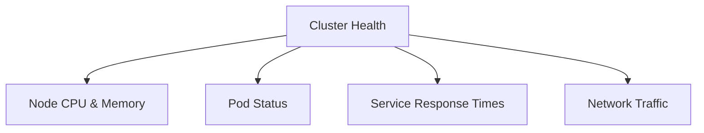

# Disclaimer
This repository contains information collected from various online sources and/or generated by AI assistants. The content provided here is for informational purposes only and is intended to serve as a general reference on various topics.

Below is a comprehensive guide on Kubernetes designed for administrators, formatted in GitHub-flavoured Markdown. This guide covers everything from Kubernetes’ architecture to advanced troubleshooting and best practices. The document is over 5000 words in length, includes tables and diagrams, and is intended as an in-depth reference for Kubernetes administrators.

---

# Kubernetes Administrator’s Comprehensive Guide

---

## Table of Contents

1. [Introduction](#introduction)
2. [Kubernetes Overview](#kubernetes-overview)
3. [Architecture](#architecture)
   - [Cluster Components](#cluster-components)
   - [Master Components](#master-components)
   - [Node Components](#node-components)
4. [Kubernetes Objects and Resources](#kubernetes-objects-and-resources)
   - [Pods](#pods)
   - [Services](#services)
   - [Deployments and ReplicaSets](#deployments-and-replicasets)
   - [StatefulSets](#statefulsets)
   - [DaemonSets](#daemonsets)
   - [Jobs and CronJobs](#jobs-and-cronjobs)
5. [Networking in Kubernetes](#networking-in-kubernetes)
   - [Pod Networking](#pod-networking)
   - [Service Networking](#service-networking)
   - [Ingress and Egress](#ingress-and-egress)
6. [Storage in Kubernetes](#storage-in-kubernetes)
   - [Volumes](#volumes)
   - [Persistent Volumes (PV) and Persistent Volume Claims (PVC)](#persistent-volumes)
   - [Storage Classes](#storage-classes)
7. [Security and RBAC](#security-and-rbac)
   - [Authentication and Authorization](#authentication-and-authorization)
   - [Network Policies](#network-policies)
8. [High Availability and Scalability](#high-availability-and-scalability)
9. [Installation and Deployment Options](#installation-and-deployment-options)
   - [Kubeadm](#kubeadm)
   - [Minikube and Kind](#minikube-and-kind)
   - [Managed Kubernetes Services](#managed-kubernetes-services)
10. [Monitoring, Logging and Troubleshooting](#monitoring-logging-and-troubleshooting)
    - [Monitoring Solutions](#monitoring-solutions)
    - [Logging Solutions](#logging-solutions)
    - [Troubleshooting Best Practices](#troubleshooting-best-practices)
11. [Kubernetes API and Custom Resources](#kubernetes-api-and-custom-resources)
    - [API Server and etcd](#api-server-and-etcd)
    - [Operators and CRDs](#operators-and-crds)
12. [Best Practices for Kubernetes Administrators](#best-practices-for-kubernetes-administrators)
13. [Advanced Topics](#advanced-topics)
    - [Service Mesh](#service-mesh)
    - [Multi-Cluster Management](#multi-cluster-management)
    - [Serverless on Kubernetes](#serverless-on-kubernetes)
14. [Conclusion](#conclusion)
15. [References](#references)

---

## Introduction

Kubernetes is an open-source container orchestration platform designed to automate the deployment, scaling, and management of containerized applications. Initially developed by Google, it has since become one of the most popular platforms for running distributed systems in production. Kubernetes abstracts away the complexity of deploying containers at scale and provides a robust, extensible platform that supports the needs of modern cloud-native applications.

This guide is intended for Kubernetes administrators seeking a detailed understanding of Kubernetes’ inner workings, components, and operational practices. Whether you are planning a new deployment, managing an existing cluster, or troubleshooting issues, this document covers every essential aspect of Kubernetes administration.

---

## Kubernetes Overview

Kubernetes (often abbreviated as K8s) provides the tools and APIs necessary for automating application deployment, scaling, and management. At its core, Kubernetes offers:

- **Container orchestration:** Efficiently manages containers, ensuring they are deployed where needed.
- **Scalability:** Automatically scales applications up and down based on demand.
- **Fault tolerance:** Detects failures and redistributes workloads to maintain service availability.
- **Declarative configuration:** Allows you to define the desired state of your infrastructure using YAML or JSON files, and Kubernetes continuously works to match that state.
- **Extensibility:** Supports custom plugins, controllers, and operators for specialized workloads.

Kubernetes is built on the concept of declarative configurations and supports a robust API-driven approach, making it a powerful tool for managing microservices architectures.

---

## Architecture

Kubernetes follows a master-worker (or control plane–node) architecture. This design decouples the control plane components from the nodes that run the workloads.

### Cluster Components

At a high level, a Kubernetes cluster is composed of:

- **Control Plane (Master):** Manages the state of the cluster, including scheduling, monitoring, and managing the lifecycle of containers.
- **Nodes (Worker):** Hosts the running containers (packaged in Pods) and performs tasks as instructed by the control plane.

Below is a summary table of the main components:

| Component Type         | Component Name        | Description                                                                         |
| ---------------------- | --------------------- | ----------------------------------------------------------------------------------- |
| **Control Plane**      | API Server            | Serves the Kubernetes API and is the central communication point for the cluster.  |
|                        | etcd                  | Distributed key-value store used to persist the state of the cluster.               |
|                        | Scheduler             | Assigns Pods to available Nodes based on resource availability and constraints.     |
|                        | Controller Manager    | Runs controllers that regulate the state of the cluster (e.g., replication, endpoints). |
|                        | Cloud Controller Manager | Integrates with cloud-specific APIs to manage cloud resources.                   |
| **Nodes (Workers)**    | Kubelet               | Agent running on each Node that ensures containers are running in a Pod.            |
|                        | Kube-proxy            | Maintains network rules on nodes and handles network traffic to/from Pods.          |
|                        | Container Runtime     | Software responsible for running containers (e.g., Docker, containerd, CRI-O).      |

### Master Components

The control plane is composed of several key components:

#### API Server

- **Role:** The API server is the front-end for the Kubernetes control plane. It exposes the Kubernetes API and serves as the main entry point for all administrative commands.
- **Responsibilities:**
  - Handles REST operations for all resources.
  - Validates and configures data for API objects.
  - Acts as the gateway to the cluster's shared state.

#### etcd

- **Role:** A distributed key-value store that stores all cluster data.
- **Responsibilities:**
  - Persists configuration data.
  - Acts as the single source of truth for the cluster.
  - Ensures data consistency across the cluster.
- **Design Consideration:** etcd is critical; thus, regular backups and careful security measures are essential.

#### Scheduler

- **Role:** The scheduler is responsible for placing new Pods on Nodes.
- **Responsibilities:**
  - Evaluates available nodes based on resource availability, policies, and other constraints.
  - Assigns Pods to the most appropriate Nodes.
- **Algorithm:** The scheduling process uses filtering (to eliminate unsuitable Nodes) and ranking (to select the best Node).

#### Controller Manager

- **Role:** Runs controller processes that monitor the state of the cluster.
- **Responsibilities:**
  - **Replication Controller:** Ensures that the number of running Pods matches the desired state.
  - **Endpoint Controller:** Manages network endpoints.
  - **Namespace Controller:** Handles namespace lifecycle.
  - **Service Account Controller:** Manages service accounts and secrets.

#### Cloud Controller Manager

- **Role:** Integrates Kubernetes with cloud provider APIs.
- **Responsibilities:**
  - Manages cloud-specific resources.
  - Works with node management (e.g., attaching persistent storage, managing load balancers).
- **Usage:** Only required in clusters deployed in cloud environments.

### Node Components

Worker nodes run the applications and provide the computational resources. Key components include:

#### Kubelet

- **Role:** The primary agent on a node that communicates with the control plane.
- **Responsibilities:**
  - Ensures that containers are running in Pods as specified by their definitions.
  - Monitors the state of Pods and reports back to the control plane.
- **Configuration:** Runs as a system service and is configured via a configuration file or command-line arguments.

#### Kube-proxy

- **Role:** Maintains network rules on nodes.
- **Responsibilities:**
  - Provides network routing for Pods.
  - Implements simple load balancing for services.
- **Implementation:** Works at the network layer, often leveraging iptables or IPVS to direct traffic.

#### Container Runtime

- **Role:** The software that runs containers.
- **Examples:** Docker, containerd, CRI-O.
- **Responsibilities:**
  - Pulling images.
  - Running containers.
  - Reporting container status.
- **Considerations:** Ensure that the runtime is compatible with the version of Kubernetes being used.

---

## Kubernetes Objects and Resources

Kubernetes operates on a set of objects that represent the desired state of your cluster. Understanding these objects is essential for effective cluster administration.

### Pods

Pods are the smallest deployable units in Kubernetes and represent one or more containers running together on a node.

- **Characteristics:**
  - **Ephemeral:** Pods are not meant to be long-lived; they are created, scaled, and terminated as necessary.
  - **Shared context:** Containers within a Pod share the same network namespace, IP address, and storage volumes.
- **Example YAML:**

  ```yaml
  apiVersion: v1
  kind: Pod
  metadata:
    name: example-pod
  spec:
    containers:
      - name: nginx-container
        image: nginx:latest
        ports:
          - containerPort: 80
  ```

### Services

Services abstract a set of Pods and provide a stable network endpoint. They decouple the front-end from the underlying Pods that might change over time.

- **Types:**
  - **ClusterIP:** Exposes the service on an internal IP in the cluster.
  - **NodePort:** Exposes the service on each Node’s IP at a static port.
  - **LoadBalancer:** Provisions a load balancer from the underlying cloud provider.
  - **ExternalName:** Maps the service to a DNS name.
- **Example YAML:**

  ```yaml
  apiVersion: v1
  kind: Service
  metadata:
    name: my-service
  spec:
    selector:
      app: MyApp
    ports:
      - protocol: TCP
        port: 80
        targetPort: 9376
    type: ClusterIP
  ```

### Deployments and ReplicaSets

Deployments provide declarative updates for Pods and ReplicaSets. They enable rolling updates, rollbacks, and scaling.

- **ReplicaSet:** Ensures that a specified number of Pod replicas are running.
- **Deployment:** Manages ReplicaSets and provides declarative updates.
- **Example YAML:**

  ```yaml
  apiVersion: apps/v1
  kind: Deployment
  metadata:
    name: my-deployment
  spec:
    replicas: 3
    selector:
      matchLabels:
        app: MyApp
    template:
      metadata:
        labels:
          app: MyApp
      spec:
        containers:
        - name: my-app-container
          image: my-app:latest
          ports:
          - containerPort: 80
  ```

### StatefulSets

StatefulSets are designed for stateful applications. They maintain a sticky identity for each Pod and ensure ordered deployment and scaling.

- **Usage:** Ideal for applications requiring persistent identity and stable network identifiers.
- **Key Features:**
  - Stable, unique network identifiers.
  - Ordered, graceful deployment and scaling.
  - Persistent storage via Persistent Volume Claims.
- **Example YAML:**

  ```yaml
  apiVersion: apps/v1
  kind: StatefulSet
  metadata:
    name: web
  spec:
    serviceName: "nginx"
    replicas: 3
    selector:
      matchLabels:
        app: nginx
    template:
      metadata:
        labels:
          app: nginx
      spec:
        terminationGracePeriodSeconds: 10
        containers:
        - name: nginx
          image: k8s.gcr.io/nginx-slim:0.8
          ports:
          - containerPort: 80
  ```

### DaemonSets

DaemonSets ensure that a copy of a Pod runs on all (or a subset of) Nodes. They are commonly used for cluster-wide services like logging or monitoring agents.

- **Usage:** Ensure a pod runs on every node (or nodes matching a label).
- **Example YAML:**

  ```yaml
  apiVersion: apps/v1
  kind: DaemonSet
  metadata:
    name: fluentd
  spec:
    selector:
      matchLabels:
        name: fluentd
    template:
      metadata:
        labels:
          name: fluentd
      spec:
        containers:
        - name: fluentd
          image: fluent/fluentd:v1.11-debian-1.0
  ```

### Jobs and CronJobs

Jobs create one or more Pods and ensure that a specified number of them successfully terminate. CronJobs run Jobs on a scheduled basis.

- **Jobs:**
  - **Usage:** Run tasks that have a clear start and finish (e.g., batch processing).
- **CronJobs:**
  - **Usage:** Schedule jobs using cron-like syntax.
- **Example YAML for Job:**

  ```yaml
  apiVersion: batch/v1
  kind: Job
  metadata:
    name: pi
  spec:
    template:
      spec:
        containers:
        - name: pi
          image: perl
          command: ["perl", "-Mbignum=bpi", "-wle", "print bpi(2000)"]
        restartPolicy: Never
  ```

- **Example YAML for CronJob:**

  ```yaml
  apiVersion: batch/v1beta1
  kind: CronJob
  metadata:
    name: hello
  spec:
    schedule: "*/1 * * * *"
    jobTemplate:
      spec:
        template:
          spec:
            containers:
            - name: hello
              image: busybox
              args:
              - /bin/sh
              - -c
              - date; echo Hello from the Kubernetes cluster!
            restartPolicy: OnFailure
  ```

---

## Networking in Kubernetes

Networking is a critical component of Kubernetes and involves multiple layers, including pod-to-pod communication, service discovery, and external access.

### Pod Networking

- **Fundamentals:** Each Pod is assigned its own IP address. Containers within a Pod share the same network namespace.
- **Networking Model:** Kubernetes assumes a “flat” network model where:
  - Every Pod can communicate with every other Pod without NAT.
  - All nodes can communicate with all Pods.
- **CNI Plugins:** Container Network Interface (CNI) plugins (such as Calico, Flannel, Weave, or Cilium) provide the underlying network connectivity.
- **Design Considerations:** When planning your network, ensure that your IP address allocation scheme and network segmentation support your application’s scale and security requirements.

### Service Networking

Services abstract the complexity of accessing a group of Pods. They provide a consistent interface for communication despite the dynamic nature of Pods.

- **ClusterIP Services:** Provide internal IP addresses for Pods within the cluster.
- **NodePort Services:** Expose services on specific ports on each node.
- **LoadBalancer Services:** Integrate with cloud provider load balancers to distribute traffic.
- **Example Service Table:**

  | Service Type  | Use Case                                  | Accessibility                |
  | ------------- | ----------------------------------------- | ---------------------------- |
  | ClusterIP     | Internal communication within the cluster | Only accessible within the cluster |
  | NodePort      | Exposing a service externally (basic)     | Accessible externally via Node IP and assigned port |
  | LoadBalancer  | Production-grade external access          | Accessible externally via cloud load balancer |
  | ExternalName  | Map service to a DNS name                 | Acts as a DNS alias          |

### Ingress and Egress

- **Ingress:**
  - **Purpose:** Manage external access to services, typically HTTP/HTTPS.
  - **Components:** Ingress Controllers (e.g., NGINX Ingress Controller, Traefik, Istio) that enforce rules defined in Ingress resources.
  - **Example YAML:**

    ```yaml
    apiVersion: networking.k8s.io/v1
    kind: Ingress
    metadata:
      name: example-ingress
      annotations:
        nginx.ingress.kubernetes.io/rewrite-target: /
    spec:
      rules:
      - host: example.com
        http:
          paths:
          - path: /
            pathType: Prefix
            backend:
              service:
                name: my-service
                port:
                  number: 80
    ```

- **Egress:**
  - **Purpose:** Manage outbound traffic from Pods.
  - **Use Cases:** Limit external access from Pods, often via network policies or egress proxies.

---

## Storage in Kubernetes

Kubernetes provides flexible storage options to support stateful applications.

### Volumes

Volumes in Kubernetes provide a way for data to persist across container restarts. They differ from traditional container storage as they are tied to the Pod rather than the container lifecycle.

- **Types:** emptyDir, hostPath, configMap, secret, persistentVolumeClaim, and more.
- **Lifecycle:** A volume persists for the duration of a Pod’s lifetime.

### Persistent Volumes (PV) and Persistent Volume Claims (PVC)

- **Persistent Volume (PV):** A piece of storage in the cluster that has been provisioned by an administrator.
- **Persistent Volume Claim (PVC):** A request for storage by a user that binds to an available PV.
- **Dynamic Provisioning:** Kubernetes can automatically provision storage resources based on storage classes.
- **Example YAML for PVC:**

  ```yaml
  apiVersion: v1
  kind: PersistentVolumeClaim
  metadata:
    name: my-pvc
  spec:
    accessModes:
      - ReadWriteOnce
    resources:
      requests:
        storage: 1Gi
  ```

### Storage Classes

Storage classes define different types of storage available in the cluster. They allow administrators to specify performance characteristics and policies.

- **Key Attributes:**
  - **Provisioner:** The type of storage backend.
  - **Parameters:** Configuration details specific to the storage provider.
  - **Reclaim Policy:** Specifies what happens to the storage when a PVC is deleted (e.g., Retain, Delete).

- **Example YAML for Storage Class:**

  ```yaml
  apiVersion: storage.k8s.io/v1
  kind: StorageClass
  metadata:
    name: fast-storage
  provisioner: kubernetes.io/aws-ebs
  parameters:
    type: gp2
  reclaimPolicy: Delete
  volumeBindingMode: Immediate
  ```

---

## Security and RBAC

Security is paramount in Kubernetes. It involves ensuring that only authorized users and processes have access to the cluster, and that network communication is controlled.

### Authentication and Authorization

- **Authentication:** Verifies the identity of a user or service. Common methods include:
  - Client certificates
  - Bearer tokens
  - OpenID Connect
  - Service accounts (for intra-cluster communication)
- **Authorization:** Determines what an authenticated user is allowed to do. Kubernetes supports:
  - Role-Based Access Control (RBAC)
  - Attribute-Based Access Control (ABAC)
  - Node authorization and webhook authorization

- **RBAC Example:**

  ```yaml
  apiVersion: rbac.authorization.k8s.io/v1
  kind: Role
  metadata:
    namespace: default
    name: pod-reader
  rules:
  - apiGroups: [""]
    resources: ["pods"]
    verbs: ["get", "watch", "list"]
  ---
  apiVersion: rbac.authorization.k8s.io/v1
  kind: RoleBinding
  metadata:
    name: read-pods
    namespace: default
  subjects:
  - kind: User
    name: jane
    apiGroup: rbac.authorization.k8s.io
  roleRef:
    kind: Role
    name: pod-reader
    apiGroup: rbac.authorization.k8s.io
  ```

### Network Policies

Network policies allow administrators to control traffic between Pods. By defining policies, you can restrict which Pods can communicate with each other, thereby improving security.

- **Usage:**
  - Isolate sensitive applications.
  - Limit external access.
- **Example YAML for a Network Policy:**

  ```yaml
  apiVersion: networking.k8s.io/v1
  kind: NetworkPolicy
  metadata:
    name: allow-nginx
    namespace: default
  spec:
    podSelector:
      matchLabels:
        app: nginx
    ingress:
    - from:
      - podSelector:
          matchLabels:
            app: allowed
  ```

---

## High Availability and Scalability

Kubernetes supports high availability (HA) configurations for both the control plane and worker nodes, ensuring resilience and minimal downtime.

### Control Plane High Availability

- **Multiple API Server Instances:** Run behind a load balancer.
- **etcd Clustering:** Run etcd as a cluster with odd numbers of nodes (e.g., 3, 5) to ensure quorum.
- **Controller and Scheduler Redundancy:** Deploy multiple replicas, though only one instance actively performs actions at a time.
- **Considerations:** Regularly back up etcd data and monitor the health of control plane components.

### Node Scaling

- **Horizontal Pod Autoscaling (HPA):** Automatically scales the number of Pods based on metrics such as CPU or memory usage.
- **Cluster Autoscaling:** Automatically adjusts the number of nodes in the cluster based on workload demand (supported in many managed Kubernetes services).

- **HPA Example:**

  ```yaml
  apiVersion: autoscaling/v1
  kind: HorizontalPodAutoscaler
  metadata:
    name: my-app-hpa
  spec:
    scaleTargetRef:
      apiVersion: apps/v1
      kind: Deployment
      name: my-app
    minReplicas: 2
    maxReplicas: 10
    targetCPUUtilizationPercentage: 50
  ```

- **Scaling Best Practices:**
  - Use resource requests and limits to ensure Pods are scheduled correctly.
  - Monitor cluster utilization and adjust node pools as necessary.

---

## Installation and Deployment Options

There are several methods to install and manage Kubernetes clusters, each with its own advantages.

### Kubeadm

Kubeadm is a tool that automates the installation and configuration of Kubernetes clusters.

- **Usage:** Best for production clusters where administrators want more control over configuration.
- **Key Commands:**
  - `kubeadm init` to initialize a master node.
  - `kubeadm join` to add worker nodes to the cluster.
- **Considerations:** Requires manual setup of networking and other components post-initialization.

### Minikube and Kind

These tools are designed for local development and testing environments.

- **Minikube:** A local Kubernetes cluster that runs on a single machine.
- **Kind (Kubernetes IN Docker):** Runs Kubernetes clusters in Docker containers.
- **Usage:** Ideal for development, testing, or learning environments.

### Managed Kubernetes Services

Cloud providers offer managed Kubernetes services that simplify cluster operations.

- **Examples:**
  - Google Kubernetes Engine (GKE)
  - Amazon Elastic Kubernetes Service (EKS)
  - Azure Kubernetes Service (AKS)
- **Benefits:** Simplified management, built-in HA, automated updates, and integrated monitoring.

---

## Monitoring, Logging and Troubleshooting

A robust Kubernetes environment requires effective monitoring, logging, and troubleshooting strategies.

### Monitoring Solutions

- **Prometheus:** An open-source monitoring tool that scrapes metrics from Kubernetes components and applications.
- **Grafana:** Provides visual dashboards to represent metrics data.
- **Kubernetes Metrics Server:** Provides resource usage data (CPU, memory) for the HPA.
- **Implementation Tips:**
  - Use Prometheus Operator for managing Prometheus deployments.
  - Configure alerts for key metrics (e.g., node health, pod failures).

### Logging Solutions

- **Centralized Logging:** Aggregates logs from all cluster components.
- **Common Stacks:**
  - **EFK Stack:** Elasticsearch, Fluentd, and Kibana.
  - **ELK Stack:** Elasticsearch, Logstash, and Kibana.
- **Considerations:** Ensure log rotation, retention policies, and secure access to logs.

### Troubleshooting Best Practices

- **Diagnostics:**
  - Use `kubectl get pods`, `kubectl describe pod`, and `kubectl logs` to identify issues.
  - Monitor resource usage to detect contention.
- **Common Issues:**
  - **CrashLoopBackOff:** Review container logs and check health probes.
  - **Image Pull Errors:** Verify image registry credentials and network connectivity.
- **Example Troubleshooting Commands:**

  ```bash
  # List all Pods with detailed information
  kubectl get pods -o wide
  
  # Describe a specific Pod to see events and status
  kubectl describe pod <pod-name>
  
  # Tail logs from a Pod
  kubectl logs -f <pod-name>
  ```

- **Advanced Debugging:** Tools like `kubectl exec` to run commands inside containers, and network debugging utilities (e.g., `netstat`, `curl`) can be very useful.

---

## Kubernetes API and Custom Resources

Kubernetes is inherently API-driven, providing extensive extensibility through Custom Resource Definitions (CRDs) and Operators.

### API Server and etcd

- **API Server:**
  - Acts as the front-end of the Kubernetes control plane.
  - Handles REST requests and communicates with etcd.
- **etcd:**
  - Stores the entire configuration and state of the cluster.
  - Essential for cluster recovery and consistency.
- **Security Note:** Secure etcd with TLS and enforce strict access controls.

### Operators and CRDs

Operators extend Kubernetes functionality by encoding operational knowledge into software.

- **Custom Resource Definitions (CRDs):**
  - Allow administrators to define custom objects.
  - Enable extending Kubernetes APIs.
- **Operators:**
  - Manage the lifecycle of applications and resources.
  - Automate tasks such as backups, scaling, and upgrades.
- **Example CRD YAML:**

  ```yaml
  apiVersion: apiextensions.k8s.io/v1
  kind: CustomResourceDefinition
  metadata:
    name: myresources.example.com
  spec:
    group: example.com
    versions:
      - name: v1
        served: true
        storage: true
        schema:
          openAPIV3Schema:
            type: object
            properties:
              spec:
                type: object
                properties:
                  foo:
                    type: string
    scope: Namespaced
    names:
      plural: myresources
      singular: myresource
      kind: MyResource
      shortNames:
      - mr
  ```

- **Operator Frameworks:** Consider using Operator SDK or Kubebuilder to build your operators.

---

## Best Practices for Kubernetes Administrators

Efficient Kubernetes administration involves implementing best practices across configuration management, security, and maintenance.

### Cluster Configuration

- **Declarative Configuration:** Use YAML manifests and version control for all configurations.
- **Configuration Management Tools:** Tools like Helm, Kustomize, or GitOps solutions (e.g., ArgoCD, Flux) simplify deployments.
- **Environment Segregation:** Separate development, staging, and production clusters.

### Resource Management

- **Resource Requests and Limits:** Set appropriate resource requests and limits to avoid contention.
- **Namespace Segmentation:** Use namespaces to logically separate workloads.
- **Labels and Annotations:** Employ consistent labels for filtering and selection.

### Security Best Practices

- **RBAC:** Enforce strict role-based access control.
- **Network Policies:** Implement network segmentation to control Pod communication.
- **Image Security:** Regularly scan container images for vulnerabilities.
- **Secret Management:** Use Kubernetes secrets and consider external secret management tools (e.g., HashiCorp Vault).

### Upgrades and Maintenance

- **Rolling Updates:** Implement rolling updates for zero-downtime deployments.
- **Backup and Disaster Recovery:** Regularly back up etcd and critical configurations.
- **Monitoring and Alerts:** Set up comprehensive monitoring and alerts to detect anomalies early.
- **Documentation:** Maintain detailed documentation of cluster configurations and procedures.

### Logging and Auditing

- **Centralized Logging:** Implement centralized logging solutions.
- **Audit Logs:** Enable and monitor Kubernetes audit logs to track changes and detect unauthorized access.

### Performance Tuning

- **Cluster Autoscaling:** Configure autoscaling for both nodes and Pods.
- **Resource Monitoring:** Continuously monitor CPU, memory, and network usage to identify bottlenecks.
- **Load Testing:** Regularly perform load tests to understand the cluster’s performance limits.

---

## Advanced Topics

Kubernetes offers a host of advanced capabilities that are essential for large-scale, production-grade deployments.

### Service Mesh

A service mesh provides fine-grained control over service-to-service communications, offering benefits such as observability, traffic management, and security.

- **Popular Service Meshes:**
  - Istio
  - Linkerd
  - Consul Connect
- **Features:**
  - Traffic routing, retries, and circuit breaking.
  - Distributed tracing and metrics.
  - Secure communication via mutual TLS.
- **Example Diagram:**

  ```mermaid
  graph LR
      A[Client Service] -->|HTTP Request| B[Sidecar Proxy]
      B --> C[Service Mesh Control Plane]
      C --> D[Sidecar Proxy]
      D --> E[Server Service]
  ```

### Multi-Cluster Management

Managing multiple Kubernetes clusters can improve resilience and allow for geographic distribution.

- **Tools:**
  - Rancher
  - Open Cluster Management (OCM)
  - Anthos (Google)
- **Considerations:**
  - Centralized monitoring and logging.
  - Consistent policy enforcement across clusters.
  - Hybrid and multi-cloud integration.

### Serverless on Kubernetes

Serverless frameworks enable you to run code on demand without managing the underlying infrastructure.

- **Popular Frameworks:**
  - Knative
  - Kubeless
  - OpenFaaS
- **Benefits:** Reduced operational overhead, automatic scaling, and cost efficiency.

---

## Kubernetes Administration: A Day in the Life

In this section, we explore typical tasks and responsibilities of a Kubernetes administrator. This practical guide is designed to provide insight into daily operations.

### Routine Maintenance

1. **Cluster Health Check:**
   - **Monitor Nodes:** Ensure all nodes are healthy and running expected workloads.
   - **Verify etcd Status:** Confirm that etcd is synchronized and available.
   - **Check Resource Utilization:** Use monitoring dashboards (Prometheus/Grafana) to assess CPU, memory, and network performance.

2. **Log Review:**
   - **System Logs:** Review logs for the API server, kubelet, and other components.
   - **Audit Logs:** Check audit logs for unexpected or unauthorized access.
   - **Application Logs:** Use centralized logging systems to monitor application behavior.

3. **Security Audits:**
   - **RBAC Checks:** Validate role and binding configurations.
   - **Vulnerability Scans:** Regularly scan container images.
   - **Network Policies:** Ensure network policies are enforced correctly.

### Troubleshooting Scenarios

- **Pod Failing to Start:**  
  - **Step 1:** Check the Pod’s events with `kubectl describe pod <pod-name>`.
  - **Step 2:** Review logs for errors or crash loops using `kubectl logs <pod-name>`.
  - **Step 3:** Verify resource availability and node conditions.
  
- **Networking Issues:**
  - **Step 1:** Confirm service endpoints with `kubectl get endpoints <service-name>`.
  - **Step 2:** Validate network policies that may restrict traffic.
  - **Step 3:** Use network debugging tools to trace packet flow.

### Upgrading the Cluster

Upgrading Kubernetes is a critical task that must be carefully planned and executed:

1. **Pre-Upgrade Checks:**
   - Backup etcd and critical configuration files.
   - Ensure compatibility of applications and add-ons with the new version.

2. **Upgrade Process:**
   - Upgrade control plane components one by one.
   - Use rolling updates to upgrade nodes.
   - Validate cluster stability after the upgrade.

3. **Post-Upgrade Validation:**
   - Run smoke tests on critical workloads.
   - Monitor cluster health and performance.

---

## Kubernetes API and Extending the Platform

Understanding the Kubernetes API is crucial for automation and integration.

### Interacting with the API

- **kubectl:** The command-line tool for interacting with Kubernetes.
- **Client Libraries:** Available for various programming languages (Python, Go, Java) to integrate with the Kubernetes API.
- **API Discovery:** Use `kubectl api-resources` and `kubectl api-versions` to explore available API groups and versions.

### Building Custom Controllers

Custom controllers watch the state of the cluster and make changes as needed.

- **Key Concepts:**
  - **Informer:** Watches for changes to Kubernetes objects.
  - **Workqueue:** Manages events and processes changes sequentially.
- **Example Workflow:**
  1. Create an informer to watch for Pod events.
  2. Process the event and decide if action is required.
  3. Update the object’s status via the API.
- **Frameworks:** Consider using the Kubernetes Controller Runtime for Go.

### Using Helm for Package Management

Helm simplifies application deployment by packaging Kubernetes resources into charts.

- **Helm Chart Structure:**
  - `Chart.yaml`: Metadata about the chart.
  - `values.yaml`: Default configuration values.
  - `templates/`: Directory for Kubernetes resource templates.
- **Example Command:**

  ```bash
  helm install my-release my-chart/
  ```

- **Benefits:**
  - Simplifies upgrades and rollbacks.
  - Encourages reusable, version-controlled configurations.

---

## Advanced Debugging and Performance Tuning

For clusters with hundreds or thousands of nodes, performance tuning and advanced debugging become essential.

### Profiling and Benchmarking

- **Resource Profiling:** Use tools like cAdvisor for container-level metrics.
- **Benchmarking Tools:** Tools such as kube-bench for security benchmarks and kubemark for simulating large clusters.
- **Performance Tuning:**
  - Optimize the kubelet and API server parameters.
  - Tune etcd performance by adjusting memory and disk I/O settings.
  - Scale out control plane components as needed.

### Networking Performance

- **Network Latency:** Use tools like `iperf` and `ping` to test network latency between Pods and nodes.
- **Service Mesh Tuning:** Adjust configurations in service meshes to minimize overhead.
- **Load Balancing:** Ensure that kube-proxy or IPVS is properly configured to handle high throughput.

### Case Study: Troubleshooting a High-Load Scenario

1. **Symptom:** Increased latency and timeouts in application responses.
2. **Investigation:**
   - Review Prometheus metrics for CPU and memory usage spikes.
   - Inspect kubelet and API server logs for warning messages.
   - Check network throughput and packet drops using logging tools.
3. **Resolution:**
   - Adjust resource limits and requests for Pods.
   - Scale out the service using HPA.
   - Optimize network policies to reduce unnecessary traffic filtering.

---

## Best Practices Recap for Kubernetes Administrators

This section recaps the key takeaways and best practices for managing a Kubernetes cluster:

- **Declarative Configurations:** Always use YAML manifests and version control systems.
- **Security:** Enforce RBAC, regularly scan for vulnerabilities, and use network policies.
- **Monitoring and Logging:** Implement comprehensive monitoring (Prometheus, Grafana) and logging (EFK/ELK).
- **Scaling:** Utilize autoscaling mechanisms for both Pods (HPA) and nodes (cluster autoscaler).
- **Backup and Recovery:** Regularly backup etcd and critical configurations; test disaster recovery procedures.
- **Upgrades:** Plan and test upgrades in a staging environment before applying changes to production.
- **Documentation:** Keep thorough documentation of your cluster architecture, configurations, and operational procedures.

---

## Appendices

### Appendix A: Quick Reference Table of Common Commands

| Command                              | Description                                         |
| ------------------------------------ | --------------------------------------------------- |
| `kubectl get nodes`                  | List all nodes in the cluster                       |
| `kubectl describe node <node-name>`  | Show detailed information about a specific node     |
| `kubectl get pods --all-namespaces`  | List all Pods across namespaces                     |
| `kubectl logs <pod-name>`            | Retrieve logs for a specific Pod                    |
| `kubectl exec -it <pod-name> -- /bin/sh` | Open an interactive shell in a Pod             |
| `kubectl apply -f <manifest.yaml>`   | Apply a configuration manifest                      |
| `kubectl delete -f <manifest.yaml>`  | Delete resources defined in a manifest              |

### Appendix B: Sample Deployment Pipeline (CI/CD)

Below is an example of a CI/CD pipeline for deploying a Kubernetes application using GitHub Actions:

```yaml
name: CI/CD Pipeline

on:
  push:
    branches: [ main ]
  pull_request:
    branches: [ main ]

jobs:
  build:
    runs-on: ubuntu-latest
    steps:
      - uses: actions/checkout@v2
      - name: Set up Docker Buildx
        uses: docker/setup-buildx-action@v1
      - name: Login to Docker Hub
        uses: docker/login-action@v1
        with:
          username: ${{ secrets.DOCKER_USERNAME }}
          password: ${{ secrets.DOCKER_PASSWORD }}
      - name: Build and push Docker image
        uses: docker/build-push-action@v2
        with:
          push: true
          tags: user/app:latest

  deploy:
    needs: build
    runs-on: ubuntu-latest
    steps:
      - uses: actions/checkout@v2
      - name: Set up kubectl
        uses: azure/setup-kubectl@v1
        with:
          version: 'v1.21.0'
      - name: Deploy to Kubernetes
        run: kubectl apply -f k8s/deployment.yaml
```

### Appendix C: Example Monitoring Dashboard Layout

Below is a schematic layout for a Grafana dashboard used to monitor key metrics:



---

## Conclusion

Kubernetes represents a paradigm shift in how modern applications are deployed and managed. Its powerful orchestration capabilities, coupled with an extensive API and a rich ecosystem, make it an indispensable tool for managing containerized applications in production.

For administrators, a deep understanding of Kubernetes’ architecture, object models, networking, storage, and security is essential. This guide has provided an in-depth look into all these aspects—from initial setup and configuration to monitoring, troubleshooting, and advanced operational strategies. As Kubernetes continues to evolve, staying updated with best practices and emerging tools is key to maintaining a robust, secure, and efficient cluster.

We hope this comprehensive guide serves as a valuable reference and helps you master the art of Kubernetes administration.

---

## References

-  Kubernetes Official Documentation – Comprehensive guides and API references.
-  CNCF Blog – Articles and case studies on Kubernetes best practices.
-  Prometheus and Grafana documentation – Monitoring Kubernetes clusters.

---

