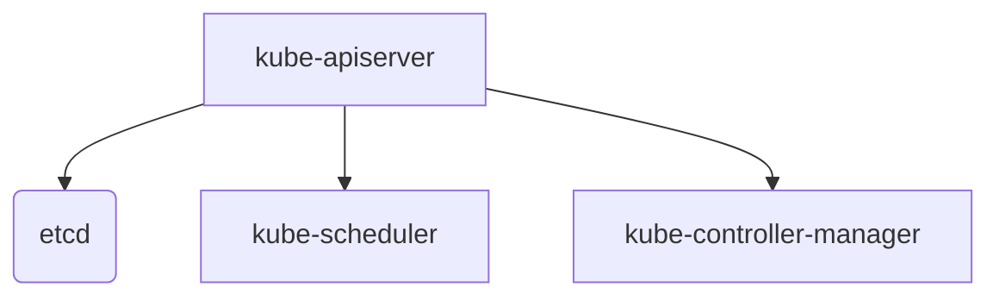
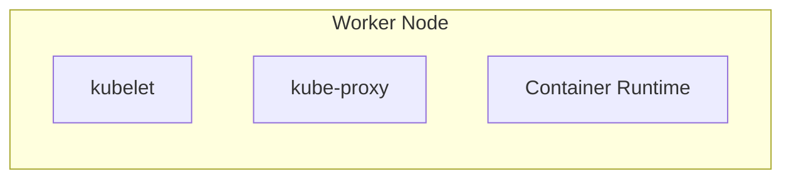
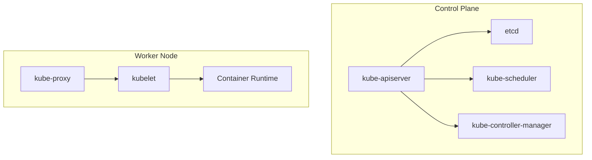

# Disclaimer
This repository contains information collected from various online sources and/or generated by AI assistants. The content provided here is for informational purposes only and is intended to serve as a general reference on various topics.

## Table of Contents

1. [Introduction](#introduction)  
2. [Background and History](#background-and-history)  
3. [Kubernetes Architecture Overview](#kubernetes-architecture-overview)  
   - [Master Node Components](#master-node-components)  
   - [Worker Node Components](#worker-node-components)  
4. [Core Concepts and Terminology](#core-concepts-and-terminology)  
5. [Detailed Component Analysis](#detailed-component-analysis)  
   - [API Server (kube-apiserver)](#api-server-kube-apiserver)  
   - [etcd: The Key-Value Store](#etcd-the-key-value-store)  
   - [Scheduler (kube-scheduler)](#scheduler-kube-scheduler)  
   - [Controller Manager (kube-controller-manager)](#controller-manager-kube-controller-manager)  
   - [Kubelet](#kubelet)  
   - [Kube-proxy](#kube-proxy)  
6. [Design Considerations for the Administrator](#design-considerations-for-the-administrator)  
   - [Cluster Design and Layout](#cluster-design-and-layout)  
   - [High Availability and Scalability](#high-availability-and-scalability)  
   - [Security and Access Control](#security-and-access-control)  
7. [Diagrams and Tables](#diagrams-and-tables)  
   - [Kubernetes Component Diagram](#kubernetes-component-diagram)  
   - [Comparison Table of Core Components](#comparison-table-of-core-components)  

---

## Introduction

Kubernetes is an open-source platform designed to automate the deployment, scaling, and operations of application containers across clusters of hosts. Developed originally by Google and now maintained by the Cloud Native Computing Foundation (CNCF), Kubernetes has become the de facto standard for container orchestration. This guide is specifically tailored for Kubernetes administrators and covers everything from foundational concepts to advanced administration techniques.

Administrators are responsible for the overall health, security, and performance of a Kubernetes cluster. They ensure that the infrastructure can support highly available, scalable, and resilient applications. This guide provides detailed insights into every layer of Kubernetes, making it a valuable resource for new and experienced administrators alike.

---

## Background and History

Kubernetes was conceived to address the challenges of deploying and managing containerized applications in production. Initially based on Google's internal Borg system, Kubernetes was open-sourced in 2014. Over the years, it has evolved into a robust platform capable of managing complex microservices architectures. Its architecture draws upon years of production experience at Google and the lessons learned from early container management systems.

### Key Milestones in Kubernetes Development

- **2014:** Kubernetes is introduced as an open-source project.
- **2015:** Kubernetes 1.0 is released, marking a stable foundation.
- **2016+:** Rapid adoption by cloud providers and enterprises; major cloud providers begin to offer managed Kubernetes services.
- **2020 and Beyond:** Enhanced support for stateful applications, improved security features, and integration with various CI/CD pipelines.

As Kubernetes has grown, so too have the responsibilities of administrators. Today, administrators not only need to understand the basic operational elements but also the advanced features that allow Kubernetes to run reliably at scale.

---

## Kubernetes Architecture Overview

The architecture of Kubernetes is designed around a distributed system that consists of a control plane (or master nodes) and a set of worker nodes. Understanding this architecture is essential for administrators who must design, deploy, and maintain clusters in production environments.

### Master Node Components

The **control plane** is the brain of the Kubernetes cluster. It manages the overall cluster state and makes decisions about scheduling, scaling, and updating the system. The main components of the control plane are:

1. **kube-apiserver:** The front-end of the Kubernetes control plane, handling all API requests.
2. **etcd:** A distributed key-value store used to store all cluster data.
3. **kube-scheduler:** Responsible for placing new pods onto worker nodes.
4. **kube-controller-manager:** Runs various controllers that handle routine tasks within the cluster (e.g., replication, endpoints, node management).

#### Diagram: Master Node Components

Below is a simplified diagram in Mermaid syntax that illustrates the control plane components:

This diagram shows that the API server acts as the main hub, interacting with etcd for configuration and state, while delegating scheduling and control tasks to the respective components.

### Worker Node Components

Worker nodes are responsible for running application workloads. Each worker node includes:

1. **kubelet:** An agent that communicates with the control plane and ensures that containers are running as expected.
2. **kube-proxy:** Manages network routing for services on the node.
3. **Container Runtime:** The software (such as Docker, containerd, or CRI-O) that runs the containers.

#### Diagram: Worker Node Components

The kubelet continuously monitors the state of the pods on its node, while kube-proxy manages network rules to ensure that traffic is properly routed to the correct containers.

---

## Core Concepts and Terminology

Before delving deeper into the administrative tasks, it is essential to understand some core Kubernetes concepts:

- **Cluster:** A set of machines (nodes) running containerized applications managed by Kubernetes.
- **Pod:** The smallest deployable unit in Kubernetes, which can host one or more containers that share the same network namespace.
- **Service:** An abstraction that defines a logical set of pods and a policy by which to access them.
- **Namespace:** A virtual cluster within a physical cluster, used to divide cluster resources between multiple users or teams.
- **Deployment:** A Kubernetes object that provides declarative updates for pods and ReplicaSets.
- **StatefulSet:** Similar to deployments but designed for stateful applications, ensuring the ordering and uniqueness of pods.

Understanding these terms is critical, as they form the basis for the configuration, management, and scaling decisions made by Kubernetes administrators.

---

## Detailed Component Analysis

In this section, we provide an in-depth look at the key components of Kubernetes. Each component is explained from an administrative perspective, highlighting configuration, scaling, and troubleshooting techniques.

### API Server (kube-apiserver)

The **kube-apiserver** is the central management entity that exposes the Kubernetes API. All communication between the administrator (or any client) and the cluster goes through this component. It is designed to be stateless and can be scaled horizontally to support high availability.

#### Key Responsibilities

- **Authentication & Authorization:** Validates user credentials and access rights.
- **API Request Handling:** Processes RESTful API requests and interacts with etcd for data persistence.
- **Admission Control:** Intercepts requests to enforce security and policy constraints.

#### Administrative Considerations

- **Scaling:** In high-demand clusters, multiple instances of kube-apiserver can be deployed behind a load balancer.
- **Security:** Ensure that TLS certificates are correctly configured and that RBAC (Role-Based Access Control) policies are in place.
- **Monitoring:** Track performance metrics (e.g., request latency, error rates) to identify potential bottlenecks.

### etcd: The Key-Value Store

**etcd** is a distributed key-value store that holds the entire state of the Kubernetes cluster. It is critical that etcd is highly available and backed up regularly.

#### Key Responsibilities

- **State Storage:** Maintains all cluster data, including configurations, statuses, and secrets.
- **Consistency:** Provides a consistent and reliable data store that supports Kubernetes’ eventual consistency model.

#### Administrative Considerations

- **Backup and Restore:** Regularly back up etcd data and test restore procedures to prevent data loss.
- **High Availability:** Deploy etcd in a cluster configuration with an odd number of nodes to maintain quorum.
- **Security:** Secure etcd communication using TLS and restrict access to authorized users only.

### Scheduler (kube-scheduler)

The **kube-scheduler** is responsible for placing pods onto available worker nodes based on resource requirements, policies, and constraints.

#### Key Responsibilities

- **Resource Allocation:** Ensures that pods are scheduled on nodes with sufficient CPU, memory, and other resources.
- **Policy Enforcement:** Adheres to affinity, anti-affinity, and taint/toleration rules defined by administrators.
- **Custom Schedulers:** Supports the use of custom scheduling algorithms for specific use cases.

#### Administrative Considerations

- **Performance Tuning:** Monitor scheduler performance and adjust scheduling policies as needed.
- **Troubleshooting:** Analyze unscheduled pods by checking scheduler logs and reviewing node resource availability.
- **Extensibility:** Leverage scheduler extender APIs to integrate custom logic into the scheduling process.

### Controller Manager (kube-controller-manager)

The **kube-controller-manager** runs several controllers that manage different aspects of the cluster. Each controller watches the shared state via the API server and makes changes to move the current state towards the desired state.

#### Key Responsibilities

- **Replication Controller:** Ensures that a specified number of pod replicas are running.
- **Node Controller:** Monitors the health of nodes and takes action if a node becomes unresponsive.
- **Endpoint Controller:** Manages the endpoints for services.
- **Other Controllers:** Manages aspects like namespaces, jobs, and garbage collection.

#### Administrative Considerations

- **Health Monitoring:** Ensure that controllers are running as expected and are not experiencing issues.
- **Resource Allocation:** In larger clusters, consider running critical controllers on dedicated nodes.
- **Logging and Metrics:** Enable detailed logging to diagnose issues with controller actions.

### Kubelet

The **kubelet** is the primary “node agent” that runs on each worker node. It ensures that containers are running in a pod as defined in the pod specification.

#### Key Responsibilities

- **Pod Lifecycle Management:** Monitors and reports on the status of pods.
- **Container Management:** Interacts with the container runtime to start, stop, and manage containers.
- **Health Checks:** Conducts liveness and readiness probes to determine container health.

#### Administrative Considerations

- **Configuration:** Properly configure the kubelet with parameters that suit the workload, including resource limits and eviction policies.
- **Security:** Ensure that the kubelet is secured with proper authentication and authorization mechanisms.
- **Debugging:** Utilize kubelet logs and diagnostic commands (e.g., `kubectl describe node`) to troubleshoot issues on worker nodes.

### Kube-proxy

The **kube-proxy** is responsible for maintaining network rules on each node. It ensures that network traffic is properly directed to the appropriate pods, handling both TCP and UDP protocols.

#### Key Responsibilities

- **Service Discovery:** Implements the virtual IPs for services.
- **Load Balancing:** Distributes network traffic evenly across pods.
- **Network Security:** Enforces network policies at the node level.

#### Administrative Considerations

- **Performance:** Monitor network performance and adjust proxy settings to minimize latency.
- **Security:** Combine kube-proxy configurations with network policies for fine-grained traffic control.
- **Troubleshooting:** Analyze network connectivity issues using kube-proxy logs and network diagnostic tools.

---

## Design Considerations for the Administrator

For Kubernetes administrators, planning and designing a cluster is a critical task. Below are key design aspects that should be carefully considered.

### Cluster Design and Layout

A well-designed Kubernetes cluster must account for the following elements:

- **Node Sizing:** Determining the optimal number of CPU cores, memory, and storage for nodes based on expected workloads.
- **Network Topology:** Designing network layouts that ensure minimal latency and high throughput between nodes.
- **Multi-Tenancy:** Using namespaces, RBAC, and resource quotas to segment the cluster for different teams or applications.
- **Geographic Distribution:** For global deployments, consider a multi-region or multi-zone cluster to enhance availability and fault tolerance.

#### Table: Node Sizing Recommendations

| Workload Type           | CPU Cores per Node | Memory (GB) | Storage (GB) | Typical Use Case                            |
|-------------------------|--------------------|-------------|--------------|---------------------------------------------|
| Development/Test        | 2 – 4              | 4 – 8       | 50 – 100     | Lightweight development and testing tasks   |
| Production – Small      | 4 – 8              | 8 – 16      | 100 – 250    | Small production workloads                  |
| Production – Medium     | 8 – 16             | 16 – 32     | 250 – 500    | Moderate to heavy production workloads      |
| Production – Enterprise | 16+                | 32+         | 500+         | Enterprise-grade, high-demand environments  |

### High Availability and Scalability

Ensuring high availability (HA) is a top priority in production environments. Key strategies include:

- **Control Plane HA:** Deploy multiple replicas of control plane components (API server, etcd, etc.) across different nodes or zones.
- **Worker Node Redundancy:** Distribute workloads evenly across nodes and implement pod anti-affinity rules.
- **Auto-scaling:** Use the Horizontal Pod Autoscaler (HPA) and Cluster Autoscaler to automatically adjust resources based on demand.
- **Backup Strategies:** Regularly back up etcd and other stateful data to recover from failures quickly.

### Security and Access Control

Security is paramount in Kubernetes administration. A robust security posture includes:

- **Role-Based Access Control (RBAC):** Define roles and permissions to restrict access.
- **Network Policies:** Enforce rules at the pod level to control traffic between services.
- **Secrets Management:** Store sensitive data using Kubernetes secrets, integrated with external vault solutions if necessary.
- **TLS and Certificate Management:** Ensure all communications are secured using TLS encryption and manage certificate lifecycles diligently.

#### Table: Key Security Components

| Component                     | Function                                           | Administrator Considerations                             |
|-------------------------------|----------------------------------------------------|---------------------------------------------------------|
| RBAC                          | Controls who can access which resources            | Define least-privilege roles and regularly audit roles   |
| Network Policies              | Restrict pod-to-pod communication                  | Implement default-deny policies and tailored rules       |
| Secrets Management            | Secure storage for sensitive data                | Use encryption at rest and integrate with external vaults|
| TLS Certificates              | Secure API and inter-component communication       | Regularly rotate certificates and enforce strong ciphers |

---

## Diagrams and Tables

### Kubernetes Component Diagram

Below is a detailed diagram that illustrates how various components interact in a typical Kubernetes cluster:

This diagram emphasizes the role of the API server as the central hub for state management and decision-making, while worker nodes handle container execution and networking.

### Comparison Table of Core Components

| Component                 | Type                | Primary Role                                      | Scalability Considerations                           |
|---------------------------|---------------------|---------------------------------------------------|------------------------------------------------------|
| **kube-apiserver**        | Control Plane       | API request handling, authentication, validation  | Can be horizontally scaled with load balancing     |
| **etcd**                  | Data Store          | Cluster state storage                             | Requires careful HA configuration and regular backups|
| **kube-scheduler**        | Control Plane       | Pod scheduling based on resource availability     | Monitor for performance; supports custom extensions  |
| **kube-controller-manager** | Control Plane    | Runs controllers for replication, nodes, etc.     | May require dedicated resources in larger clusters   |
| **kubelet**               | Node Agent          | Pod lifecycle management and container runtime      | Optimize configuration for performance               |
| **kube-proxy**            | Network Proxy       | Service discovery and load balancing               | Fine-tune network rules to reduce latency            |

---

## Summary of Part 1

In this first part, we have provided a detailed introduction to Kubernetes with a focus on the administrative perspective. We covered the historical background, overall architecture—including both control plane and worker node components—and introduced the key elements that administrators must master. We also looked at important design considerations, including cluster design, scalability, and security.

The following parts of this guide will continue with:

- **Part 2:** Installation and Cluster Setup (detailed walkthroughs on deploying Kubernetes clusters using different tools and platforms, configuration best practices, and initial security hardening).
- **Part 3:** Day-to-Day Administration (monitoring, scaling, updating, and troubleshooting clusters; logging, backup, and recovery strategies).
- **Part 4:** Advanced Topics (networking intricacies, service meshes, advanced scheduling, and custom resource definitions).
- **Part 5:** Case Studies and Best Practices (real-world scenarios, design patterns, and performance tuning for large-scale environments).

---

