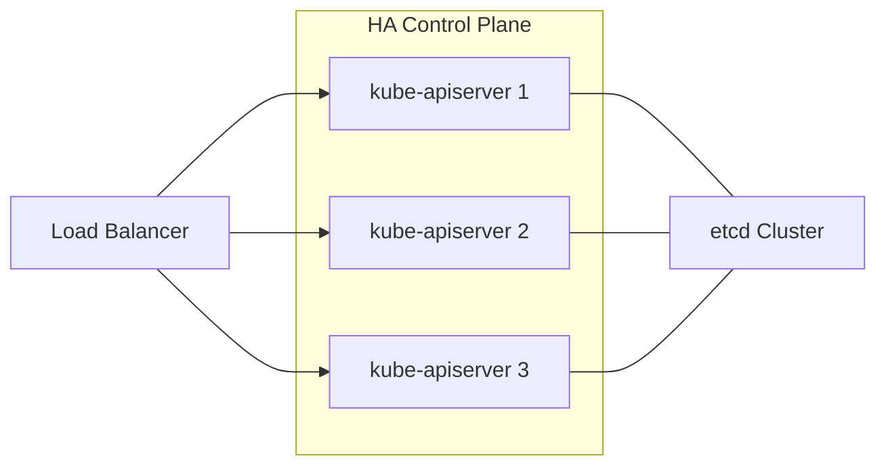
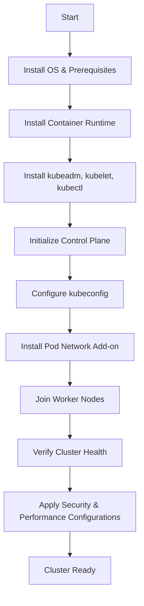
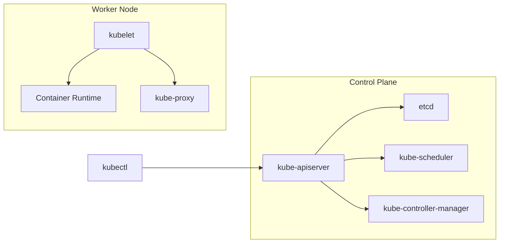

# Disclaimer
This repository contains information collected from various online sources and/or generated by AI assistants. The content provided here is for informational purposes only and is intended to serve as a general reference on various topics.

# Part 2: Installation and Cluster Setup

## Table of Contents

1. [Overview](#overview)
2. [Prerequisites](#prerequisites)
3. [Installation Methods](#installation-methods)
   - [Using kubeadm](#using-kubeadm)
   - [Using Minikube](#using-minikube)
   - [Using Kops](#using-kops)
   - [Managed Kubernetes Solutions](#managed-kubernetes-solutions)
4. [Detailed Setup with kubeadm](#detailed-setup-with-kubeadm)
   - [Control Plane Setup](#control-plane-setup)
   - [Worker Node Configuration](#worker-node-configuration)
   - [Networking Configuration](#networking-configuration)
5. [Installation Best Practices](#installation-best-practices)
6. [High Availability Considerations](#high-availability-considerations)
7. [Diagrams and Flowcharts](#diagrams-and-flowcharts)
8. [Troubleshooting Common Installation Issues](#troubleshooting-common-installation-issues)
9. [Security Hardening During Setup](#security-hardening-during-setup)
10. [Summary and Next Steps](#summary-and-next-steps)

---

## Overview

Setting up a Kubernetes cluster involves installing and configuring both the control plane and worker nodes, ensuring that the environment is secure, scalable, and efficient. As a Kubernetes administrator, your responsibilities start with choosing the right installation method and tools that best suit your production or development needs. This section covers a range of installation methods, including:

- **kubeadm:** A tool designed to simplify cluster bootstrap.
- **Minikube:** A local Kubernetes environment ideal for development.
- **Kops:** A production-grade tool primarily used on AWS.
- **Managed Kubernetes Services:** Cloud provider solutions like GKE, EKS, and AKS.

This part of the guide provides an in-depth look at installing Kubernetes using kubeadm as an example of a hands-on approach to cluster setup. We also discuss how to integrate various installation tools into your workflow.

---

## Prerequisites

Before installing Kubernetes, there are several prerequisites you must address:

### Hardware and Infrastructure Requirements

- **Control Plane Nodes:**  
  - Minimum: 2 vCPUs, 4 GB RAM (recommended: 4+ vCPUs, 8+ GB RAM)
  - Storage: SSDs recommended for etcd and system performance.
- **Worker Nodes:**  
  - Minimum: 2 vCPUs, 2 GB RAM (production: 4+ vCPUs, 8+ GB RAM)
  - Storage: Local disks or cloud-based block storage.

### Operating System and Kernel Versions

- Supported OS: Ubuntu, CentOS, RHEL, Debian, and other modern Linux distributions.
- Kernel version: 3.10 or later is typically recommended for compatibility.

### Networking Requirements

- **Ports and Protocols:**  
  - Ensure that required ports (e.g., 6443 for kube-apiserver, 2379–2380 for etcd) are open between nodes.
- **CNI Plugin:**  
  - Choose a Container Network Interface (CNI) such as Calico, Flannel, or Weave Net for pod networking.
- **DNS Resolution:**  
  - Ensure proper DNS setup as Kubernetes components communicate using service names.

### Software Requirements

- **Docker or containerd:**  
  - The container runtime must be installed and configured correctly on all nodes.
- **Kubernetes Binaries:**  
  - Download the kubeadm, kubelet, and kubectl binaries from the official repository.
- **Security Certificates:**  
  - TLS certificates are needed for secure communication among components.
- **Time Synchronization:**  
  - Install and configure NTP or chrony on all nodes to maintain clock synchronization.

### Pre-Installation Checklist

| Requirement                     | Description                                       | Verification Command/Notes                                  |
|---------------------------------|---------------------------------------------------|-------------------------------------------------------------|
| OS Compatibility                | Use a supported Linux distribution                | `cat /etc/os-release`                                       |
| Container Runtime Installed     | Docker, containerd, or CRI-O must be installed      | `docker --version` or `ctr version`                         |
| Networking Setup                | Ensure open ports and proper DNS resolution        | Validate with `nc` and DNS tools like `dig`                 |
| Time Synchronization            | Configure NTP/chrony                               | `timedatectl status`                                        |
| Kubernetes Binaries             | Download kubeadm, kubelet, and kubectl             | Follow installation guide from Kubernetes documentation     |

---

## Installation Methods

There are several methods available for installing Kubernetes. Each method offers its own advantages and is suitable for different use cases. Below is an overview of each:

### Using kubeadm

kubeadm is a widely used tool that automates much of the cluster bootstrap process. It performs the following:

- Initializes the control plane node.
- Joins worker nodes to the cluster.
- Generates and distributes necessary certificates.
- Configures cluster networking.

**Advantages:**  
- Hands-on and flexible.
- Suitable for production and development environments.
- Provides a deep understanding of Kubernetes internals.

### Using Minikube

Minikube is ideal for local development and testing. It runs a single-node Kubernetes cluster in a virtual machine on your local computer.

**Advantages:**  
- Fast and lightweight.
- Easy to set up and tear down.
- Great for learning and experimenting with Kubernetes features.

### Using Kops

Kops (Kubernetes Operations) is typically used to deploy clusters on AWS and provides production-grade features.

**Advantages:**  
- Automates cluster lifecycle management.
- Integrates with AWS services for scalability and monitoring.
- Supports rolling updates and cluster upgrades.

### Managed Kubernetes Solutions

Many cloud providers offer managed Kubernetes services, including:

- **Google Kubernetes Engine (GKE)**
- **Amazon Elastic Kubernetes Service (EKS)**
- **Azure Kubernetes Service (AKS)**

**Advantages:**  
- Eliminates the need for manual setup.
- Integrated security, scalability, and monitoring.
- Managed upgrades and maintenance.

---

## Detailed Setup with kubeadm

In this section, we dive into a step-by-step guide for setting up a Kubernetes cluster using kubeadm. This method is popular among administrators because it provides both flexibility and transparency.

### Step 1: Installing Kubernetes Components

Install kubeadm, kubelet, and kubectl on each node. Below is an example for Ubuntu:

```bash
# Update the apt package index and install packages needed to use the Kubernetes apt repository:
sudo apt-get update && sudo apt-get install -y apt-transport-https curl

# Download the Google Cloud public signing key:
curl -s https://packages.cloud.google.com/apt/doc/apt-key.gpg | sudo apt-key add -

# Add the Kubernetes apt repository:
cat <<EOF | sudo tee /etc/apt/sources.list.d/kubernetes.list
deb https://apt.kubernetes.io/ kubernetes-xenial main
EOF

# Update the apt package index, install kubelet, kubeadm and kubectl, and pin their version:
sudo apt-get update
sudo apt-get install -y kubelet kubeadm kubectl
sudo apt-mark hold kubelet kubeadm kubectl
```

### Step 2: Initializing the Control Plane

On the control plane node, run:

```bash
sudo kubeadm init --pod-network-cidr=192.168.0.0/16
```

**Explanation:**

- `--pod-network-cidr`: Specifies the network range for pods. This is required by many CNI plugins such as Calico or Flannel.

After initialization, you will see instructions to set up your local kubeconfig. For example:

```bash
mkdir -p $HOME/.kube
sudo cp -i /etc/kubernetes/admin.conf $HOME/.kube/config
sudo chown $(id -u):$(id -g) $HOME/.kube/config
```

### Step 3: Installing a Pod Network Add-on

Next, install a CNI plugin to manage networking between pods. For example, to install Calico:

```bash
kubectl apply -f https://docs.projectcalico.org/manifests/calico.yaml
```

Verify that the network add-on is running correctly:

```bash
kubectl get pods --all-namespaces
```

### Step 4: Joining Worker Nodes

On each worker node, run the command provided by kubeadm during control plane initialization. The join command looks similar to:

```bash
sudo kubeadm join <control-plane-ip>:6443 --token <token> \
    --discovery-token-ca-cert-hash sha256:<hash>
```

This command securely connects the worker node to the control plane.

---

## Control Plane Setup

The control plane is critical to the operation of a Kubernetes cluster. In a production environment, you should configure multiple control plane nodes to ensure high availability.

### High Availability with Multiple Control Plane Nodes

1. **Load Balancer:**  
   Place a load balancer in front of the kube-apiserver instances. This distributes requests and increases resilience.
2. **Distributed etcd Cluster:**  
   Deploy etcd on at least three nodes to maintain quorum and ensure data consistency.
3. **Configuration Synchronization:**  
   Use tools like etcdctl and configuration management systems (e.g., Ansible, Puppet) to manage the configuration of all control plane nodes uniformly.

#### Diagram: High Availability Control Plane



*Figure: A high-availability control plane using a load balancer and distributed etcd.*

---

## Worker Node Configuration

Worker nodes are where your application workloads run. It is important to correctly configure each node to ensure consistent performance and reliability.

### Node Preparation

1. **Operating System Updates:**  
   Keep all nodes updated with security patches and bug fixes.
2. **Container Runtime:**  
   Install and configure Docker, containerd, or an alternative container runtime.
3. **Kernel Modules and Network Settings:**  
   Enable necessary kernel modules (e.g., br_netfilter) and configure sysctl settings:

   ```bash
   sudo modprobe br_netfilter
   cat <<EOF | sudo tee /etc/sysctl.d/k8s.conf
   net.bridge.bridge-nf-call-ip6tables = 1
   net.bridge.bridge-nf-call-iptables = 1
   EOF
   sudo sysctl --system
   ```

### Joining the Cluster

As mentioned earlier, join each worker node using the kubeadm join command. Confirm successful registration by checking:

```bash
kubectl get nodes
```

---

## Networking Configuration

Networking is one of the most critical aspects of a Kubernetes installation. A well-configured network ensures that pods, services, and external clients communicate seamlessly.

### CNI Plugins

Several CNI plugins are available. Here are some popular choices:

- **Calico:** Provides advanced network policy features.
- **Flannel:** Simple overlay network suitable for basic requirements.
- **Weave Net:** Offers network encryption and flexible configuration.

#### Comparison Table: CNI Plugins

| Plugin    | Features                                  | Best Use Case                         | Performance Considerations                |
|-----------|-------------------------------------------|---------------------------------------|-------------------------------------------|
| Calico    | Network policy, BGP support               | Production with advanced security     | High performance with direct routing      |
| Flannel   | Simple overlay network                    | Development and small-scale clusters  | Lightweight, but limited policy support   |
| Weave Net | Encryption, multi-host networking         | Environments requiring network security | Moderate overhead due to encryption       |

### Service Networking

Configure kube-proxy to manage load balancing across pods. The default configuration uses iptables, but you can switch to IPVS for better performance in high-throughput environments.

### DNS and Service Discovery

CoreDNS is the default DNS service in Kubernetes. It maps service names to IP addresses within the cluster. Verify DNS functionality by creating a simple service and using tools such as `nslookup` or `dig`.

---

## Installation Best Practices

### Configuration Management

- **Version Control:**  
  Store all configuration files (e.g., YAML manifests, configuration scripts) in a version-controlled repository.
- **Automation:**  
  Use configuration management tools like Ansible, Chef, or Puppet to automate cluster setup and updates.
- **Documentation:**  
  Maintain thorough documentation of your cluster configuration, including node specifications, network settings, and security policies.

### Security Considerations

- **TLS Certificates:**  
  Rotate certificates regularly and store them securely.
- **RBAC Policies:**  
  Define strict RBAC rules and audit them periodically.
- **Network Segmentation:**  
  Use namespaces and network policies to isolate workloads and limit lateral movement.
- **Regular Updates:**  
  Keep Kubernetes components and underlying OS packages up-to-date with security patches.

### Performance and Scalability

- **Monitoring:**  
  Deploy monitoring tools (e.g., Prometheus, Grafana) to track system performance and resource utilization.
- **Logging:**  
  Centralize logs using tools such as the ELK stack (Elasticsearch, Logstash, Kibana) or Fluentd.
- **Resource Management:**  
  Implement resource quotas, limits, and requests to ensure fair usage and prevent resource exhaustion.

---

## High Availability Considerations

High availability (HA) is vital for production clusters. Here are some key strategies to ensure HA during installation and setup:

### Control Plane Redundancy

- Deploy multiple control plane nodes with a load balancer.
- Use a distributed etcd cluster with an odd number of members.
- Automate failover testing and simulate node failures.

### Worker Node Resilience

- Implement node auto-replacement strategies.
- Use pod anti-affinity rules to avoid scheduling all replicas on a single node.
- Regularly test node drain and maintenance procedures.

### Backup and Recovery

- **etcd Backups:**  
  Automate etcd backups and store them offsite.
- **Configuration Snapshots:**  
  Maintain periodic snapshots of configuration files and manifests.
- **Disaster Recovery Plan:**  
  Document and test a comprehensive disaster recovery plan that covers various failure scenarios.

#### Table: High Availability Checklist

| Aspect                      | Best Practice                                           | Administrator Action Item                            |
|-----------------------------|---------------------------------------------------------|------------------------------------------------------|
| Control Plane               | Use a load balancer and multiple nodes                  | Set up HAProxy or equivalent for kube-apiserver       |
| etcd                        | Configure as a distributed cluster with regular backups | Schedule automated backups with etcdctl or Velero     |
| Worker Nodes                | Ensure redundancy and use anti-affinity rules           | Monitor node health and configure auto-scaling policies|
| Disaster Recovery           | Document and test recovery procedures                   | Conduct regular DR drills and update procedures       |

---

## Diagrams and Flowcharts

### Installation Flowchart

Below is a flowchart illustrating the high-level steps of a Kubernetes installation using kubeadm:



*Figure: Step-by-step installation process for Kubernetes using kubeadm.*

### Detailed Component Interaction Diagram



*Figure: Interaction diagram between Kubernetes components during cluster operation.*

---

## Troubleshooting Common Installation Issues

Even with a careful setup, issues may arise during installation. Below are some common issues and troubleshooting steps:

### Issue 1: Node Join Failures

- **Symptoms:**  
  Worker nodes fail to join the cluster; error messages about token expiration or certificate mismatches.
- **Troubleshooting Steps:**  
  1. Verify that the token provided is valid by checking the expiration time.
  2. Check network connectivity between the worker node and the control plane.
  3. Ensure that the kubeadm join command is executed with the correct parameters.
  4. Inspect the kubelet logs on the worker node for more details:
     
     ```bash
     sudo journalctl -u kubelet -f
     ```

### Issue 2: Network Add-on Not Working

- **Symptoms:**  
  Pods cannot communicate with each other; DNS resolution fails.
- **Troubleshooting Steps:**  
  1. Ensure that the correct CNI plugin manifest is applied.
  2. Validate that the pod network CIDR matches the configuration specified during control plane initialization.
  3. Check the logs of the network add-on pods:
     
     ```bash
     kubectl logs -n kube-system <network-addon-pod>
     ```
  4. Verify that kernel modules (e.g., br_netfilter) are loaded on all nodes.

### Issue 3: High CPU or Memory Usage on Control Plane

- **Symptoms:**  
  The kube-apiserver or etcd experiences high resource usage, impacting cluster performance.
- **Troubleshooting Steps:**  
  1. Monitor metrics using Prometheus or a similar monitoring tool.
  2. Check for unusually high API request rates.
  3. Scale out the control plane by adding more replicas behind a load balancer.
  4. Optimize etcd performance by tuning its configuration settings.

---

## Security Hardening During Setup

Security is a crucial aspect of Kubernetes cluster installation. Follow these practices to ensure a secure setup:

### Secure Communication

- **TLS Certificates:**  
  Ensure that all Kubernetes components use valid TLS certificates. Use kubeadm’s built-in certificate generation or supply your own.
- **API Server Security:**  
  - Enable RBAC and configure Role-Based Access Control to restrict permissions.
  - Use audit logging to monitor API access and detect suspicious activity.

### Node Hardening

- **OS Security:**  
  - Apply all OS updates and security patches.
  - Disable unnecessary services to reduce the attack surface.
- **Container Runtime Security:**  
  - Configure runtime security settings and enforce security policies.
  - Use container image scanning tools to detect vulnerabilities in container images.

### Network Policies

Implement network policies to control traffic between pods. For example, a default-deny policy can be enforced to block all ingress traffic unless explicitly allowed:

```yaml
apiVersion: networking.k8s.io/v1
kind: NetworkPolicy
metadata:
  name: default-deny-ingress
  namespace: default
spec:
  podSelector: {}
  policyTypes:
  - Ingress
```

### Secrets Management

- **Encryption at Rest:**  
  Enable encryption for Kubernetes secrets stored in etcd.
- **External Secrets Management:**  
  Integrate Kubernetes with external secret management tools (e.g., HashiCorp Vault).

---

## Summary and Next Steps

In this part, we have covered the detailed process of installing and setting up a Kubernetes cluster with kubeadm. Key highlights include:

- **Installation Prerequisites:**  
  Hardware, software, and network requirements.
- **Control Plane and Worker Node Setup:**  
  Step-by-step instructions for initializing the control plane, installing networking plugins, and joining worker nodes.
- **High Availability and Security:**  
  Best practices for ensuring HA and hardening the cluster during the installation phase.
- **Troubleshooting:**  
  Strategies for diagnosing and resolving common installation issues.

The next part of this guide (Part 3) will cover **Day-to-Day Administration**. It will provide detailed instructions on monitoring, scaling, updating, and troubleshooting your Kubernetes cluster in production.

---
