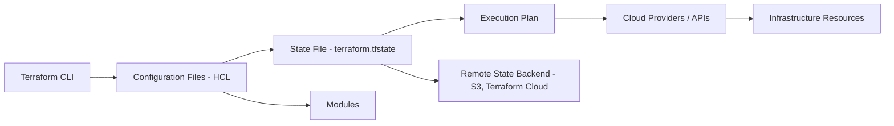

# Disclaimer
This repository contains information collected from various online sources and/or generated by AI assistants. The content provided here is for informational purposes only and is intended to serve as a general reference on various topics.

Below is a comprehensive guide in Markdown format that explores Infrastructure as Code (IaC) with a strong focus on Terraform, while also covering Terragrunt and other key concepts. This document is structured with a table of contents and detailed sections, complete with diagrams and tables for clarity.

---

# Table of Contents
1. [Introduction to Infrastructure as Code (IaC)](#introduction-to-infrastructure-as-code-iac)
2. [Core Concepts of IaC](#core-concepts-of-iac)
   - [Benefits and Challenges](#benefits-and-challenges)
   - [Declarative vs. Imperative](#declarative-vs-imperative)
3. [Terraform: An Overview](#terraform-an-overview)
   - [History and Evolution](#history-and-evolution)
   - [Key Features](#key-features)
4. [How Terraform Works](#how-terraform-works)
   - [Configuration Files and HCL](#configuration-files-and-hcl)
   - [State Management](#state-management)
   - [Provisioners, Providers, and Modules](#provisioners-providers-and-modules)
   - [The Terraform Lifecycle](#the-terraform-lifecycle)
5. [Terraform Architecture Diagram](#terraform-architecture-diagram)
6. [Best Practices in Terraform](#best-practices-in-terraform)
   - [Code Organization](#code-organization)
   - [Security Considerations](#security-considerations)
   - [Testing and Validation](#testing-and-validation)
7. [Terragrunt: Enhancing Terraform Workflows](#terragrunt-enhancing-terraform-workflows)
   - [What is Terragrunt?](#what-is-terragrunt)
   - [Key Features and Benefits](#key-features-and-benefits)
   - [How Terragrunt Works with Terraform](#how-terragrunt-works-with-terraform)
   - [Example Directory Structure with Terragrunt](#example-directory-structure-with-terragrunt)
8. [Comparative Analysis: Terraform vs. Other IaC Tools](#comparative-analysis-terraform-vs-other-iac-tools)
   - [Terraform vs. CloudFormation](#terraform-vs-cloudformation)
   - [Terraform vs. Ansible](#terraform-vs-ansible)
9. [Additional Considerations in IaC](#additional-considerations-in-iac)
   - [Version Control and CI/CD Integration](#version-control-and-cicd-integration)
   - [Security and Compliance](#security-and-compliance)
   - [Collaboration and Code Reviews](#collaboration-and-code-reviews)
10. [Conclusion](#conclusion)
11. [References](#references)

---

## Introduction to Infrastructure as Code (IaC)
Infrastructure as Code (IaC) is a modern approach to managing and provisioning computing infrastructure through machine-readable configuration files rather than physical hardware configuration or interactive configuration tools. This approach brings software engineering practices such as version control, automated testing, and continuous integration to the realm of infrastructure management.

IaC allows organizations to manage infrastructure at scale while reducing errors and promoting consistency. By defining your infrastructure as code, you can automate the deployment process, rapidly iterate on environments, and ensure that all infrastructure configurations are versioned and reproducible.

## Core Concepts of IaC

### Benefits and Challenges
IaC brings numerous advantages:
- **Consistency and Repeatability:** Code ensures that environments are consistent across development, staging, and production.
- **Speed and Efficiency:** Automated provisioning speeds up deployments and reduces manual errors.
- **Version Control:** Infrastructure definitions can be versioned, allowing for rollbacks and history tracking.
- **Scalability:** Easily scale infrastructure up or down with minimal manual intervention.
- **Collaboration:** Teams can collaborate on infrastructure changes using familiar code review processes.

However, there are challenges too:
- **Learning Curve:** Requires teams to learn new tools and practices.
- **Complexity:** Managing large codebases for complex infrastructures can become challenging.
- **Security:** Sensitive data within configuration files must be managed carefully.

### Declarative vs. Imperative
IaC tools generally fall into two categories: declarative and imperative.

- **Declarative (e.g., Terraform):** You define the desired state of your infrastructure, and the tool figures out the steps required to reach that state.
- **Imperative (e.g., scripting with Bash or Python):** You explicitly define the steps to create and configure infrastructure.

The declarative approach is favored in modern IaC because it simplifies management and reduces the risk of errors by focusing on the "what" rather than the "how."

## Terraform: An Overview
Terraform is one of the most popular IaC tools, created by HashiCorp. It allows users to define and provision data center infrastructure using a high-level configuration language known as HashiCorp Configuration Language (HCL).

### History and Evolution
Terraform was introduced in 2014 and has since evolved into a robust, multi-cloud IaC solution. Its support for multiple cloud providers (AWS, Azure, Google Cloud, etc.) and on-premises solutions has made it a go-to tool for organizations looking to manage hybrid or multi-cloud environments.

### Key Features
- **Multi-Provider Support:** Terraform supports numerous providers, which makes it flexible in managing different environments.
- **Immutable Infrastructure:** Terraform promotes the concept of immutable infrastructure, meaning that rather than modifying resources in place, it rebuilds resources when changes occur.
- **State Management:** Terraform maintains a state file that keeps track of your real-world infrastructure. This state file is essential for planning and applying changes.
- **Modularity:** Terraform supports modules, allowing you to reuse and share configuration code.
- **Plan and Apply Workflow:** The workflow includes generating an execution plan with `terraform plan` and then applying it with `terraform apply`.

## How Terraform Works

### Configuration Files and HCL
Terraform configurations are written in HCL, a domain-specific language that is both human-readable and machine-friendly. These configuration files describe the desired state of the infrastructure.

**Example HCL Configuration:**
```hcl
provider "aws" {
  region = "us-east-1"
}

resource "aws_instance" "example" {
  ami           = "ami-0c55b159cbfafe1f0"
  instance_type = "t2.micro"

  tags = {
    Name = "TerraformExample"
  }
}
```

In this example:
- The `provider` block specifies AWS as the cloud provider and sets the region.
- The `resource` block creates an AWS EC2 instance with specified attributes.

### State Management
Terraform uses a state file (commonly named `terraform.tfstate`) to map the configuration defined in the code to the real-world infrastructure. This file:
- **Tracks Resources:** Maintains a record of each resource and its attributes.
- **Enables Planning:** Allows Terraform to determine the differences between the current state and the desired state.
- **Facilitates Collaboration:** When stored remotely (e.g., in an S3 bucket or Terraform Cloud), the state file supports collaborative workflows.

**State Management Table:**

| Aspect             | Description                                                         |
|--------------------|---------------------------------------------------------------------|
| **State File**     | JSON file representing the infrastructure's current state           |
| **Local vs. Remote** | Local state files can be used for small projects; remote backends are recommended for team environments. |
| **Locking**        | Remote state backends provide locking to prevent concurrent modifications. |

### Provisioners, Providers, and Modules
Terraform’s power lies in its modularity and extensive plugin ecosystem:

- **Providers:** They define the APIs used to interact with cloud platforms and services. Each provider is responsible for understanding resource types and operations.
- **Resources:** Represent infrastructure components like compute instances, databases, networks, etc.
- **Modules:** Reusable units of Terraform code. A module can be thought of as a container for multiple resources that are used together.
- **Provisioners:** Scripts or configuration management tools that execute on the remote machine after the resource is created (e.g., running a shell script).

**Diagram of Terraform Components:**

```
+--------------------------------+
|         Terraform CLI          |
+--------------------------------+
               |
               v
+--------------------------------+
|   Terraform Configuration      |
|   (HCL Files + Variables)      |
+--------------------------------+
               |
               v
+--------------------------------+
|          Terraform Plan        |
+--------------------------------+
               |
               v
+--------------------------------+
|         Execution Plan         |
+--------------------------------+
               |
               v
+--------------------------------+
|      Terraform Apply & State   |
+--------------------------------+
```

### The Terraform Lifecycle
Terraform follows a lifecycle that includes several key phases:
1. **Write:** Developers write configuration files using HCL.
2. **Plan:** The `terraform plan` command compares the desired state with the actual state (from the state file) and produces an execution plan.
3. **Apply:** The `terraform apply` command executes the plan to achieve the desired state.
4. **Destroy:** Resources can be destroyed using the `terraform destroy` command.

This lifecycle allows for clear and controlled changes, reducing the risk of unexpected modifications.

## Terraform Architecture Diagram
Below is a simplified architectural diagram illustrating how Terraform interacts with various components:



This diagram shows the flow from writing configuration files to updating the real-world infrastructure, emphasizing the role of the state file and modules.

## Best Practices in Terraform

### Code Organization
Organizing your Terraform code effectively is essential for maintainability, collaboration, and scalability. Here are some best practices:

- **Use Modules:** Break your code into reusable modules for common components such as VPCs, security groups, and compute instances.
- **Separate Environments:** Maintain separate directories or workspaces for different environments (development, staging, production).
- **Naming Conventions:** Establish clear naming conventions for resources and variables to enhance readability.
- **Version Control:** Always use version control (e.g., Git) to track changes in your Terraform configuration.
- **Remote State:** For team projects, use remote state backends to store the state file securely and enable locking.

### Security Considerations
Security is paramount in IaC:

- **Sensitive Data:** Avoid hardcoding secrets, passwords, or API keys in your configuration files. Use secure methods like environment variables or secret managers.
- **Access Control:** Restrict access to the state file, especially when stored remotely.
- **Policy as Code:** Integrate tools such as Sentinel or Open Policy Agent (OPA) to enforce compliance and security policies.

### Testing and Validation
Testing your IaC configurations can prevent issues before they reach production:

- **Linting:** Use tools like tflint to identify syntax errors or potential misconfigurations.
- **Unit Testing:** Tools like Terratest allow you to write automated tests for your Terraform modules.
- **Plan Reviews:** Always review the execution plan before applying changes to ensure they align with your expectations.

## Terragrunt: Enhancing Terraform Workflows

### What is Terragrunt?
Terragrunt is a thin wrapper for Terraform that provides extra tooling and conventions to help manage complex Terraform configurations. It helps address issues such as code duplication and state management in multi-environment projects.

### Key Features and Benefits
- **DRY (Don't Repeat Yourself):** Terragrunt encourages code reuse by allowing you to define common configurations once and reference them across multiple environments.
- **State Management:** It simplifies remote state management by automatically configuring backend settings.
- **Dependency Management:** Terragrunt can manage dependencies between modules, ensuring that resources are created in the correct order.
- **Improved CLI Experience:** Offers commands to simplify common workflows, reducing boilerplate code and manual steps.

### How Terragrunt Works with Terraform
Terragrunt wraps your Terraform configuration in a higher-level configuration file (usually named `terragrunt.hcl`). It reads these files to inject extra logic into the Terraform process.

**Example Terragrunt File:**
```hcl
terraform {
  source = "../modules/vpc"
}

remote_state {
  backend = "s3"
  config = {
    bucket = "my-terraform-state"
    key    = "${path_relative_to_include()}/terraform.tfstate"
    region = "us-east-1"
  }
}
```

In this example:
- The `terraform` block specifies the source module for a VPC.
- The `remote_state` block configures the remote state backend automatically, reducing configuration duplication across environments.

### Example Directory Structure with Terragrunt
A well-organized project using Terragrunt might have the following structure:

```
├── terragrunt.hcl         # Root configuration with common settings
├── environments
│   ├── dev
│   │   └── terragrunt.hcl # Environment-specific overrides for dev
│   ├── staging
│   │   └── terragrunt.hcl # Environment-specific overrides for staging
│   └── prod
│       └── terragrunt.hcl # Environment-specific overrides for production
└── modules
    ├── vpc
    │   └── main.tf       # Terraform module for VPC creation
    ├── ec2
    │   └── main.tf       # Terraform module for EC2 instance creation
    └── rds
        └── main.tf       # Terraform module for RDS instance creation
```

This structure helps maintain consistency and simplifies managing differences between environments.

## Comparative Analysis: Terraform vs. Other IaC Tools

### Terraform vs. CloudFormation
**Terraform:**
- **Pros:**
  - Multi-cloud support.
  - More flexible due to its modular design.
  - Strong community and ecosystem.
- **Cons:**
  - Requires learning HCL.
  - State management can be challenging for very large deployments.

**CloudFormation:**
- **Pros:**
  - Native to AWS, so it is tightly integrated.
  - No need for an external state management system.
- **Cons:**
  - Limited to AWS.
  - More verbose and less modular than Terraform.

### Terraform vs. Ansible
Although Ansible is often used for configuration management, it can also provision infrastructure, but there are key differences:

**Terraform:**
- **Pros:**
  - Declarative syntax, making it easier to manage infrastructure state.
  - Better suited for provisioning resources across multiple providers.
- **Cons:**
  - Less focused on configuration management of installed software.
  
**Ansible:**
- **Pros:**
  - Excellent for configuration management and software installation.
  - Agentless architecture.
- **Cons:**
  - Imperative style for provisioning can be less predictable.
  - Not primarily designed for managing infrastructure state.

## Additional Considerations in IaC

### Version Control and CI/CD Integration
Managing your IaC in version control (e.g., Git) is critical for tracking changes, facilitating code reviews, and rolling back if necessary. Integrating IaC into CI/CD pipelines ensures:
- **Automated Testing:** Linting and testing of Terraform configurations before deployment.
- **Plan Automation:** Automatically generating and reviewing Terraform plans on pull requests.
- **Deployment Automation:** Applying changes through CI/CD workflows, ensuring consistency across environments.

**Table: Example CI/CD Pipeline for Terraform**
| Stage          | Purpose                                        | Tools/Commands                  |
|----------------|------------------------------------------------|---------------------------------|
| **Linting**    | Check code quality and adherence to style      | `tflint`, `terraform fmt`       |
| **Plan**       | Generate execution plan                        | `terraform plan`                |
| **Approval**   | Manual review and approval of changes          | GitHub PR reviews               |
| **Apply**      | Apply changes to the infrastructure            | `terraform apply` (via pipeline)|

### Security and Compliance
Securing your infrastructure code is critical:
- **Secrets Management:** Use tools like Vault to manage secrets rather than hardcoding them.
- **Compliance Checks:** Integrate security scanning tools (e.g., Checkov, tfsec) to catch misconfigurations or insecure practices.
- **Audit Trails:** With version control, every change is recorded. Ensure that only authorized personnel can modify infrastructure configurations.

### Collaboration and Code Reviews
Using IaC in a team setting means collaboration is key:
- **Peer Reviews:** Regularly review Terraform code via pull requests.
- **Pair Programming:** Consider pair programming sessions to share knowledge and reduce errors.
- **Documentation:** Maintain clear documentation within the repository to explain module usage and configuration parameters.

## Conclusion
Infrastructure as Code is revolutionizing the way we manage and deploy IT infrastructure. Terraform stands out as a leading tool due to its declarative approach, extensive provider support, and modular design. Coupled with Terragrunt, teams can greatly enhance their workflows by reducing duplication, simplifying state management, and enforcing consistency across environments.

As organizations scale their operations, the benefits of using IaC become more pronounced. By automating infrastructure provisioning, ensuring code quality through version control and testing, and integrating security best practices, teams can achieve more reliable and efficient deployments. Moreover, understanding the differences between Terraform and other tools like CloudFormation or Ansible helps teams choose the right tool for their specific needs.

This comprehensive guide should serve as a valuable resource for anyone looking to deepen their understanding of IaC, Terraform, and complementary tools like Terragrunt. Whether you’re managing a small project or a large-scale multi-cloud environment, the principles and practices outlined here provide a strong foundation for building robust, scalable, and secure infrastructure.

## References
-  – [Terraform Official Documentation](https://www.terraform.io/docs)
-  – [Terragrunt Official Documentation](https://terragrunt.gruntwork.io/)
-  – [Infrastructure as Code Overview](https://www.hashicorp.com/resources/infrastructure-as-code)

---
