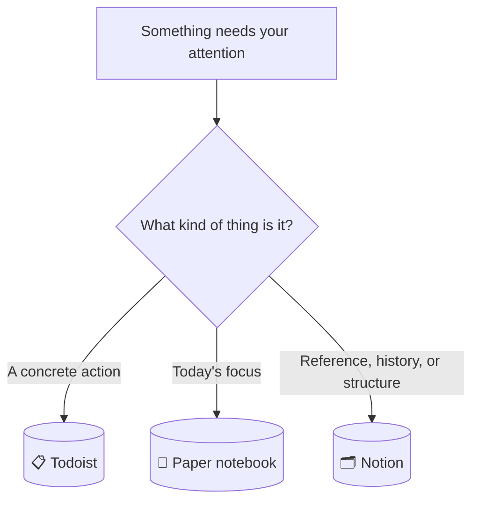
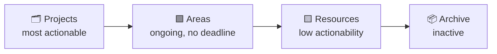
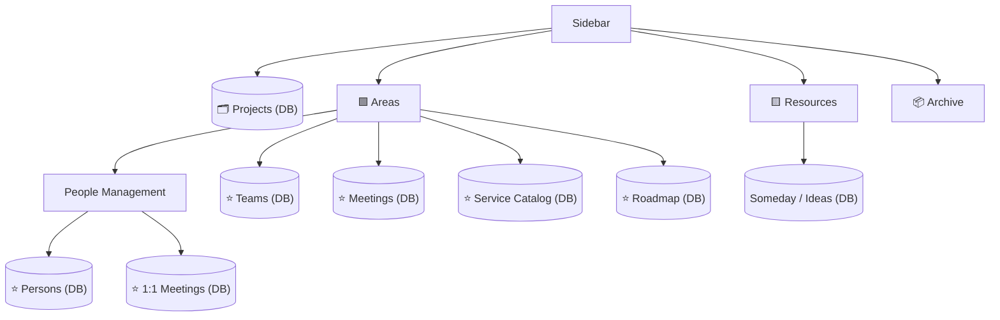
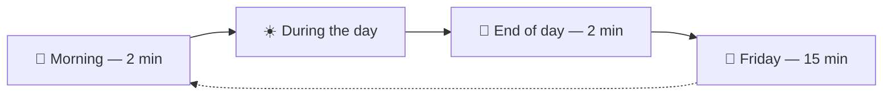

# Cheatsheet — Quick Reference

A condensed, scannable companion to `personal-productivity-system.md`. Use this when you already know the system and just need a quick answer — go back to the full document for the reasoning behind any of it.

---

## Where does this go?

| If it's... | It goes to |
|---|---|
| Something to *do* | Todoist |
| Today's top 3 focus | Notebook (shortlist from Todoist) |
| Reference, history, or something to compare against others | Notion |
| Not committed to yet, just an idea | Notion → Someday / Ideas |
| Didn't happen today, still open | Notebook `→` — stays in Todoist, no action |
| No longer needed | Notebook `✕` — clear it from Todoist too |

---

## Todoist

| Element | Values |
|---|---|
| Projects (simple containers) | `#Work` · `#Personal` |
| Priority | `p1`/`p2`/`p3` — only when genuinely elevated; default (no flag) otherwise |
| Saved filters | `Today` (query: `overdue \| today`) · `Due in 7 days` (query: `due before: in 7 days`) — both catch overdue |
| Naming rule | **Always start with a verb** — "Schedule X," not "X" |

No Labels at all — `@waiting`/`@quick`/`@email` were cut for not earning their tagging cost. Todoist's "Projects" here just means a plain container (`#Work`/`#Personal`); it's not the same thing as a GTD/PARA Project, which lives in Notion (Part 7).

**Type it all in one line:** `Schedule vendor meeting #work tomorrow at 8 p1` → task name + project + due date/time + priority, parsed from a single line, no extra clicks. Skip the date entirely when there isn't a real one — an undated task just sits on the list.

GTD loop this maps to: **Capture** (quick-add) → **Clarify** (verb-first naming) → **Organize** (Projects as containers) → **Reflect** (rituals) → **Engage** (saved filters).

---

## Notebook

Big 3 = a **shortlist pulled from Todoist**, not a second task system. The task still lives, and still gets completed, in Todoist.

| Symbol | Meaning | When |
|---|---|---|
| `□` | Picked from Todoist this morning | Morning |
| `✓` | Done — check it off in Todoist too | Evening |
| `→` | Still open — stays in Todoist as-is | Evening |
| `✕` | No longer needed — clear it from Todoist too | Evening |

- No index, no migration, no weekly review of old pages — every page dies at midnight.
- Optional: one line drafting tomorrow's first item, at day's end. Skip it whenever it doesn't come naturally.

---

## PARA (Notion)

| Category | Rule of thumb |
|---|---|
| **Projects** | Has an end. Multiple sessions of work. |
| **Areas** | Ongoing. Never ends. |
| **Resources** | Reference. No responsibility attached. |
| **Archive** | Inactive. Never deleted. |

> **Golden rule:** never create an empty folder, tag, or database before you have real content for it.

---

## Database or Page?

| Question | → Page | → Database |
|---|---|---|
| How many items? | Few, stable (≤ ~8–10) | Many, or growing |
| Same shape (same fields)? | No | Yes |
| Need to filter/sort/compare? | No | Yes |
| Repeats often? | No | Yes |

Two or more answers on one side decide it. Tie → keep what you already have.

| Property choice | Use it when... |
|---|---|
| **Select** | One exclusive value from a fixed list (Status, Stage) |
| **Multi-select (Tags)** | Zero, one, or many loose labels — no forced category |
| **Relation** | A genuine two-way link, or a value duplicated across 3+ databases |
| **Date (manual)** | A deliberate human signal (e.g. "I reviewed this") |
| **Created / Last edited time (built-in)** | Free, automatic — use instead of a manual date whenever editing *is* the update |

---

## The Notion structure

---

## All databases, at a glance

| Database | Lives in | ⭐ Favorited | Key fields | One-liner |
|---|---|---|---|---|
| **Projects** | Top level, alone | — (it IS a top-level category) | Status, Risk, Team, Target Date | Anything with an end date |
| **Teams** | Areas, direct | ✓ | Name only | The hub everything else relates to |
| **Persons** | Areas → People Management | ✓ | Team, Role, Last 1:1 | Who you work with |
| **1:1 Meetings** | Areas → People Management | ✓ | Team | One row per person, log grows forever |
| **Meetings** | Areas, direct | ✓ | Type, Project, Team | Recurring + one-off, together |
| **Service Catalog** | Areas, direct | ✓ | Team, Criticality, Status, Last Reviewed | Living memory of systems you own |
| **Roadmap** | Areas, direct | ✓ | Horizon, Year (optional), Status, Team | One DB, every year, never recreated |
| **Someday / Ideas** | Resources | ✗ (checked occasionally, on purpose) | Tags | Loose ideas, not yet committed |

---

## Closing things out (Archive, in practice)

| Thing | How it "archives" |
|---|---|
| A **Project** | `Status → Done`. Stays in the DB. Split into two views: active / done. |
| A **Service Catalog** entry | `Status → Deprecated` or `Being Phased Out`. Stays in the DB. |
| A **Someday/Ideas** row | Graduates into a Project, then **gets deleted**. No record kept — the Project is the record now. |
| Anything living as a **plain page** (no Status field) | Physically moved to the **Archive** folder. |

Rule: if it's in a database with a Status field, change the status — don't move the row. Archive-the-folder is only for things that don't have a status of their own to retire into.

---

## Daily, weekly & periodic rituals

| When | Do |
|---|---|
| Morning | Todoist "Due in 7 days" filter → pick the notebook's Big 3 |
| During the day | Mark symbols as shortlisted items close |
| End of day | Close symbols (`✓`/`→`/`✕`) · `✕` items get cleared from Todoist too · optionally draft tomorrow |
| Friday (15 min) | Open "Due in 7 days" filter, nudge stalled/delegated items → update Project statuses. Nothing else. |
| Every 4–6 weeks | Service Catalog (check oldest `Last Reviewed`) · Someday/Ideas (prune) · Roadmap (recheck Horizons) |

---

## Designing any new database

1. Few properties — only what you'll actually filter or sort by.
2. Right type per field: Select (fixed), Relation (only for real 2-way links or 3+ duplication), Date (only real dates).
3. Title identifies the row on its own.
4. Rich content → page body, never a property.
5. 2–3 views cover almost everything: filtered daily view, grouped overview, unfiltered audit.
6. Use built-in Created/Last edited time before adding a manual date field.
7. Before adding a DB, Relation, or property: name the concrete question it answers *today*. No answer → don't add it.

If rows start needing very different fields from each other → split into two databases, or it shouldn't be a database at all.
