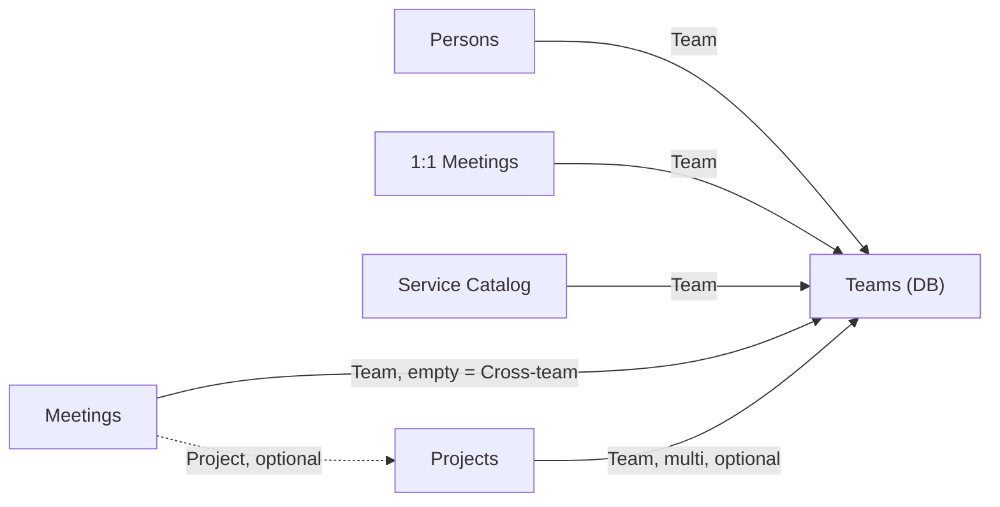

# Personal Productivity System — Todoist + Notebook + Notion (PARA)

This document describes a personal productivity system built around three tools, each with a single responsibility, and organized in Notion according to the PARA method. It is neither a diagnosis nor a history of decisions—it is a snapshot of how the system currently works, so it can be replicated exactly as it is.

---

## 1. The Core Idea: Three Tools, Three Responsibilities

Most productivity systems fail because they try to do everything in a single tool—a Notion setup that tries to be a task list, long-term memory, and a scratchpad at the same time ends up doing all three jobs poorly.

This system divides the work across three tools, each answering a different question:

| Tool | Question it answers | Time horizon |
|---|---|---|
| **Todoist** | What do I need to do? | Now / this week |
| **Physical notebook** | What will I focus on today? | Today, disposable |
| **Notion** | What do I need to remember or consult? | Months / years |

Simple rule for deciding where something belongs: if it is a concrete action, it goes into Todoist. If it is the focus for the day, it goes into the notebook. If it is reference material, history, or something that will be consulted more than once, it goes into Notion.

---

## 2. Todoist — Capture and Actions

### Why Todoist

Fast, frictionless capture with reliable notifications. It does not try to be more than that—it does not store knowledge, it is not where you think, it is where you check things off.

### Task Names: Always Start with a Verb

A task such as “Meeting with the supplier” becomes ambiguous after a few days: was it supposed to be scheduled, prepared, or confirmed? A task such as **“Schedule”** a meeting with the supplier never loses its meaning because it states exactly what the next physical action is—which is the very definition of a “next action” in GTD (David Allen, *Getting Things Done*).

| Instead of | Write |
|---|---|
| Meeting with the supplier | Schedule meeting with the supplier |
| Cluster proposal | Review the cluster upgrade proposal |
| Roadmap slides | Update the Q4 roadmap slides |

### Structure

- **Projects** are used as top-level separators, not as multi-phase GTD projects: `#Work` and `#Personal`. Simple, direct, and without overengineering.
- **Labels**, applied when creating or reviewing a task:
  - `@aguardo` — the classic GTD “Waiting For” list: delegated items that are easy to forget
  - `@rapida` — tasks that take less than 2 minutes, to be handled in batches
  - `@email` — tasks that only require an email
- **3 saved filters**, pinned at the top:
  - `today` — what is due today
  - `7 days` — the weekly view
  - `@aguardo` — everything pending from other people

### Example

```
☐ Schedule meeting with Aiven supplier       #Work      @aguardo
☐ Update Q4 roadmap slide                   #Work      @rapida
☐ Send calendar invite for kickoff          #Work      @email
☐ Schedule car appointment                  #Personal  @aguardo
☐ Confirm availability for the offsite      #Work      @rapida
```

---

## 3. Physical Notebook — Daily Focus, Deliberately Disposable

### Why Paper, and Why Disposable

The notebook exists for one purpose: to decide what to focus on today, without the burden of maintaining a system. There is no index, no migration of old pages, and no review of previous weeks—each page dies at the end of the day. This is a deliberate choice, not a limitation: a system that requires looking back creates more friction than this use case justifies.

### The “Big 3”

Three priorities per day, written down in the morning. Not a long list—three things that, if they happen, make the day a good one.

### Symbols — Keep Them to a Minimum

The creator of the Bullet Journal method, Ryder Carroll, is explicit: *“Keep custom symbols to an absolute minimum—each one you invent adds friction, not less.”* This system uses only three:

| Symbol | Meaning | When it is written |
|---|---|---|
| `○` | Not done yet | In the morning, next to each Big 3 item |
| `✓` | Done | At night, replacing the `○` |
| `✕` | Not completed | At night, replacing the `○` |

There is no dedicated symbol for “moved to Todoist”—if an item marked `✕` still matters, the task is created in Todoist at that moment. The notebook retains nothing for more than one day; the decision about what persists is made explicitly, tool by tool.

### Two Simple Additions

1. **“Parking lot” box** — a fixed square in one corner of the page. Any idea or distraction that comes up during the day is written there without interrupting what you are doing. At the end of the day, each item is processed: Todoist, the Notion Inbox, or deleted.
2. **One-line draft for tomorrow** — at the end of the day, write down a possible item for the next Big 3. This removes the friction of the “blank page” the following morning without requiring more than 10 seconds.

### Example of a Page

```
Friday, September 18
─────────────────────────────────────
BIG 3
✓  Review Aiven supplier proposal
✕  Prepare Q4 roadmap slides (moved to Todoist)
○  1:1 with Maria — discuss promotion

┌─ PARKING LOT ──────────────────────┐
│ “Ask João whether he has tested    │
│  PgBouncer”                        │
│ “Idea: video onboarding template”  │
└─────────────────────────────────────┘
- - - - - - - - - - - - - - - - - - -
Tomorrow, maybe: review yesterday’s interview feedback
```

---

## 4. Notion — Structured Memory, Organized Using PARA

### Why PARA

PARA (Tiago Forte, *Building a Second Brain*) organizes information by **actionability**, not by subject—the question is never “what is this about?”, but “how ready for action is this right now?”

| Category | Definition | Actionability |
|---|---|---|
| **Projects** | A defined outcome, with an expected end, requiring multiple work sessions | Highest |
| **Areas** | An ongoing responsibility with no end | High, but without a deadline |
| **Resources** | Reference material or interest, without responsibility | Low |
| **Archive** | Everything else—out of sight, but not lost | None |

Information **flows** between categories over time: a Resource can become a Project when you decide to act; a Project becomes Archive when it is completed; an Area can become inactive and move to Archive.

**Golden rule** (from Tiago Forte himself): never create an empty folder, tag, or database before there is real content to put in it. Building structure “for the future” before it is needed is the most common mistake—and the easiest one to avoid.

### Deciding: Database or Page?

There are two ways to store something in Notion, with clear criteria for choosing between them:

| Question | Page signal | Database signal |
|---|---|---|
| How many items are there in total? | Few and stable (up to ~8–10) | Many, or growing over time |
| Do they all have the same “shape” (the same fields)? | No—each one is different | Yes—the same properties across all items |
| Do you need to compare, filter, or sort several at once? | No | Yes |
| Is it a structure that repeats many times? | Not repetitive | Yes, and duplicating it manually is annoying |

Quick rule: two or more answers on the same side decide. In a tie, choose based on what you have today—migrating from a Page to a Database later is inexpensive.

**When to use Relation instead of Select:** only when you genuinely need a bidirectional link (to view the information from both sides), or when the same value is repeated across three or more different databases and could become inconsistent. Otherwise, a simple Select with a filtered view provides the same value with less configuration.

---

## 5. The Complete Notion Structure

### Top Level

Only the four PARA categories occupy the top level of the sidebar. The **Projects** database counts as the “Projects” category itself—it is not a separate fifth item, nor does it live inside a “Projects” folder.

```
Sidebar
├── Projects (DB) ─────────────── standalone; it is the category
├── Areas (folder)
├── Resources (folder)
└── Archive (folder)
```

### Inside Areas

```
Areas
├── People Management (page)
│     ├── Persons (DB)
│     └── 1:1 Meetings (DB)
├── Hiring & Recruiting (page)
│     ├── Candidates (DB)
│     └── process pages (interview rules, etc.)
├── Teams (DB) ─────────────────── central hub; see section 6
├── Meetings (DB)
└── Service Catalog (DB)
```

**Why Teams, Meetings, and Service Catalog live directly in Areas rather than inside a specific team:** none of the three has a single owning team—they serve all teams at the same time. A database that serves multiple teams does not physically fit “inside” one of them without becoming awkward.

### Resources and Archive

- **Resources**: useful commands, guides, rules (e.g. how to create an Outlook rule), and process notes. Reference material that does not expire and has no owner.
- **Archive**: things that are no longer needed, grouped by year. It is never a database itself—it is always a destination.

### Quick Access Without Breaking Classification: Favorites

Persons, 1:1 Meetings, Teams, Meetings, and Service Catalog correctly live inside Areas—but they are all marked as **Favorites** in Notion, placing them at the top of the sidebar for one-click access without physically moving them outside the folder. Classification and access speed are two independent concerns; there is no need to choose one over the other.

---

## 6. The Teams Database — The Central Hub

Persons, 1:1 Meetings, Service Catalog, Meetings, and Projects all have a team associated with them in some way. Without a dedicated database, this means repeating the same list of teams (Data Management, DevOps, Infrastructure Platform) as a Select in five different places—becoming out of sync as soon as a team changes its name or a new team appears.

**Teams** solves this: it is the only place where team names actually exist. The other five databases point to it through a Relation. Renaming or adding a team happens once, not in five places.



Each row in Teams (e.g. “Data Management”) is a complete page in its own right and can contain free-form team notes—but the main value comes from the **automatic rollups**: opening the “Data Management” page shows all Meetings, the entire Service Catalog, and all Projects linked to that team, without any manually configured filtered view.

Projects that do not belong to a specific team (e.g. “Hiring: DevOps Engineer 2026”) are left without a Team value—the title itself already makes the context clear.

---

## 7. Complete Schema for Each Database

### Projects
*Standalone at the top level—it is the “Projects” category in PARA.*

| Field | Type | Notes |
|---|---|---|
| Name | Title | Name of the initiative |
| Status | Select | `Now` · `Next` · `Later` · `On Hold` · `Done` |
| Target Date | Date | Optional—only if there is a real deadline |
| Risk | Select | 🟢 · 🟠 · 🔴 |
| Team | Relation → Teams | Multi-relation for cross-team projects; empty for Hiring & Recruiting |
| Tracker | URL | Link to the ticketing system, if applicable |

### Teams
*Directly in Areas—the central hub (see section 6).*

| Field | Type | Notes |
|---|---|---|
| Name | Title | Data Management · DevOps · Infrastructure Platform |

### Persons
*In Areas → People Management. Favorite.*

| Field | Type | Notes |
|---|---|---|
| Name | Title | Person’s name |
| Team | Relation → Teams | |
| Role | Text / Select | Job title or role |
| Last 1:1 | Rollup | Optional—pulls the most recent date from 1:1 Meetings |

### 1:1 Meetings
*In Areas → People Management. Favorite. One row per person, not per session.*

| Field | Type | Notes |
|---|---|---|
| Person | Title | Person’s name |
| Team | Relation → Teams | |
| Last Updated | Date | Updated with each new entry in the log |

Page body: a “Next” block at the top, followed by dated entries, one per session. The page is never recreated—it only grows.

### Meetings
*Directly in Areas. Favorite. Recurring and one-off meetings together, distinguished by Type.*

| Field | Type | Notes |
|---|---|---|
| Name | Title | Name of the series (recurring) or the meeting (one-off) |
| Type | Select | `Recurring` · `On Demand` |
| Project | Relation → Projects | Optional—links a one-off meeting to the relevant Project |
| Team | Relation → Teams | Empty = Cross-team |
| Last Updated | Date | |

Usage rule: one row per **recurring series** (not per occurrence)—the page body grows with a dated entry for each session, just as it does for 1:1 meetings.

### Service Catalog
*Directly in Areas. Favorite. Living memory for each technical system/asset.*

| Field | Type | Notes |
|---|---|---|
| Name | Title | Name of the system or asset |
| Team | Relation → Teams | |
| Category | Select | `Database` · `Streaming` · `CI/CD` · `Cloud` · `Internal Tool` · `DBaaS` |
| Criticality | Select | 🔴 Critical · 🟠 Important · 🟢 Low |
| Status | Select | `Active` · `Deprecated` · `Being Phased Out` |
| Last Reviewed | Date | Flags outdated records |

Page body, with 4 fixed sections: *Known Limitations*, *Common Issues & Fixes*, *Improvement Ideas*, *Useful Links*.

### Candidates
*In Areas → Hiring & Recruiting.*

| Field | Type | Notes |
|---|---|---|
| Name | Title | Candidate’s name |
| Role | Select | Distinguishes the hiring round (e.g. DevOps, SRO) |
| First Interview | Date | Always populated—the anchor for sorting/filtering |
| Stage | Select | `To Schedule` · `Interview 1 (Intro)` · `Interview 2 (Technical)` · `Interview 3 (Final)` |
| Decision | Select | `Pending` · `Approved` · `Rejected` |
| Rating | Select / Number | Overall impression, for comparing candidates at a glance |

Stage and Decision are separate fields by design: Stage says how far the process has progressed; Decision says the outcome—a candidate may be rejected immediately after Interview 1 without reaching the third interview. First Interview is never empty, unlike a “next round” date, which would disappear once the process ended. Subsequent rounds are recorded in the page body as a log (“Next” plus dated entries), just as in 1:1 Meetings and Meetings.

A single shared database is used across hiring rounds (DevOps 2026, SRO 2026, and future rounds)—the Role field distinguishes them, avoiding the creation of a new database for every round.

---

## 8. The Ritual — Daily and Weekly

| When | Duration | What happens |
|---|---|---|
| **Morning** | 2 min | Open Todoist and use the “Today” filter. Choose the Big 3 for the notebook—use yesterday’s draft if there is one. |
| **During the day** | — | Keep the notebook open. Mark the symbols as tasks are completed. Loose ideas go into the parking lot box, never in the middle of the page. |
| **End of day** | 2 min | Close out the pending symbols (`✓` or `✕`). If an item marked `✕` still matters, create the task in Todoist. Process the parking lot: Todoist, Notion Inbox, or delete. Write tomorrow’s draft. |
| **Friday** | 15 min | Weekly Notion review: empty the Inbox → update the Status of each active Project → review 1–2 Service Catalog records touched that week. |

The weekly Notion ritual is triggered by a recurring task in Todoist—it never depends on memory or willpower.

---

## 9. General Principles for Structuring Any New Database

1. **Few properties**—only those that answer a real filtering or sorting question.
2. **The right type for each field**—Select for fixed values; Date only for real dates; Relation only when there is a meaningful bidirectional rollup to gain.
3. **The title identifies the row on its own**—without needing to open the page.
4. **Rich content lives in the page body**, never in a property—properties are for filtering, not storytelling.
5. **2–3 views cover almost everything**—one filtered for daily use, one grouped for an overview, and one unfiltered for occasional audits.

If the rows in a database start needing very different fields from one another, that is a sign they should be two databases—or perhaps should not be databases at all.
