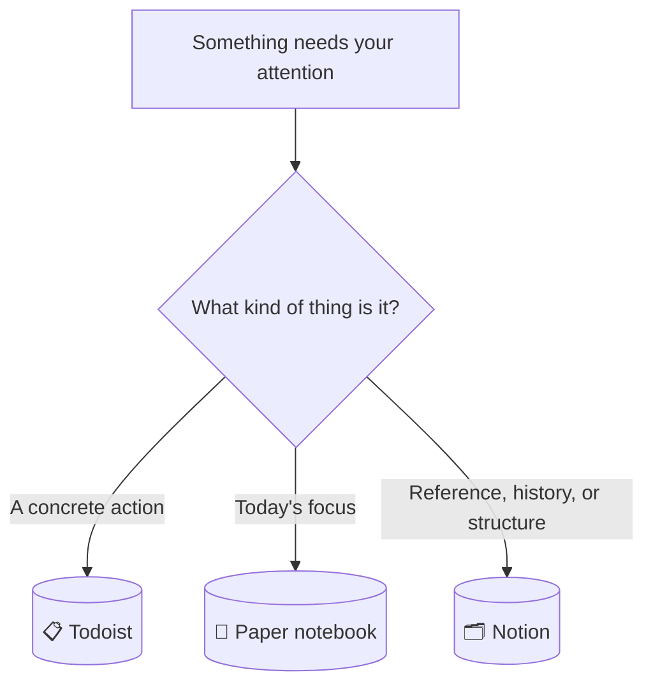
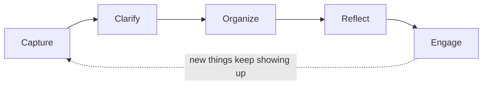
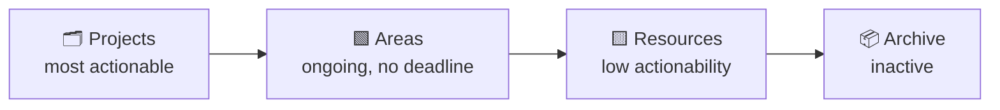
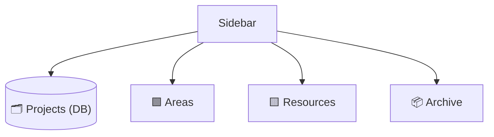
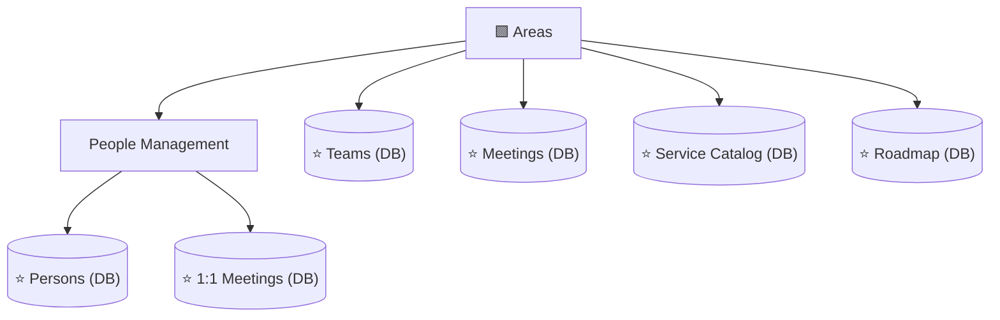
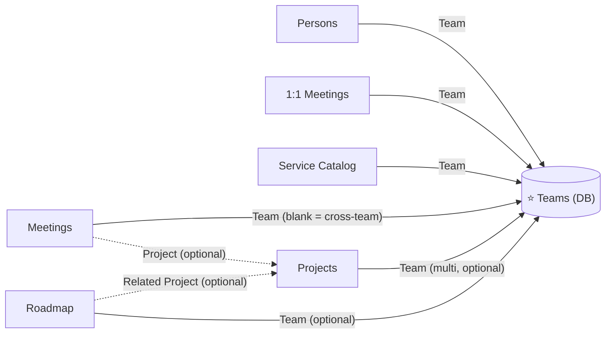
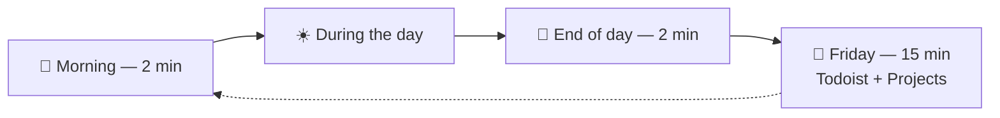
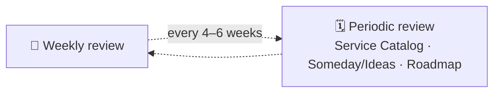

# A Three-Tool Personal Productivity System: GTD + PARA in Practice

This document describes a personal productivity system built on three tools, each with exactly one job, tied together by two well-known frameworks: **GTD** (Getting Things Done, David Allen) for capturing and acting on tasks, and **PARA** (Tiago Forte, *Building a Second Brain*) for organizing long-term knowledge in Notion.

It is not a diagnosis or a changelog — it's a snapshot of a working system, detailed enough to be copied as-is.

## Table of contents

- [Overview](#overview)
- [Part 1 — GTD in Todoist: capture with (almost) zero friction](#part-1--gtd-in-todoist-capture-with-almost-zero-friction)
  - [What GTD actually says](#what-gtd-actually-says)
  - [Capture: the step Todoist is built for](#capture-the-step-todoist-is-built-for)
  - [Clarify: verb-first naming forces the decision at capture time](#clarify-verb-first-naming-forces-the-decision-at-capture-time)
  - [Organize: Projects as containers, no Labels](#organize-projects-as-containers-no-labels)
  - [Priority: only when it's actually true](#priority-only-when-its-actually-true)
  - [Engage: two saved filters, pinned to the top](#engage-two-saved-filters-pinned-to-the-top)
  - [Example](#example)
- [Part 2 — The Notebook: today's focus, made disposable](#part-2--the-notebook-todays-focus-made-disposable)
  - [Philosophy](#philosophy)
  - [The "Big 3"](#the-big-3)
  - [Symbols — kept to a minimum, but expressive enough](#symbols--kept-to-a-minimum-but-expressive-enough)
  - [An optional addition: drafting tomorrow](#an-optional-addition-drafting-tomorrow)
  - [Example page](#example-page)
- [Part 3 — PARA in Notion: organizing by actionability, not topic](#part-3--para-in-notion-organizing-by-actionability-not-topic)
  - [Origin, and how it relates to GTD](#origin-and-how-it-relates-to-gtd)
  - [Four categories, ordered by actionability](#four-categories-ordered-by-actionability)
  - [Why PARA fits Notion specifically](#why-para-fits-notion-specifically)
  - [Closing things out: when "Archive" means a status, not a move](#closing-things-out-when-archive-means-a-status-not-a-move)
- [Part 4 — Database or Page? A decision framework](#part-4--database-or-page-a-decision-framework)
- [Part 5 — The Notion structure](#part-5--the-notion-structure)
  - [Top level](#top-level)
  - [Inside Areas](#inside-areas)
  - [Resources and Archive](#resources-and-archive)
  - [A home for loose ideas: Someday/Maybe](#a-home-for-loose-ideas-somedaymaybe)
  - [Roadmaps: continuous, not a Project](#roadmaps-continuous-not-a-project)
  - [Fast access without breaking the classification: Favorites](#fast-access-without-breaking-the-classification-favorites)
- [Part 6 — The Teams database: a relational hub](#part-6--the-teams-database-a-relational-hub)
- [Part 7 — Full database schemas](#part-7--full-database-schemas)
  - [Projects](#projects)
  - [Teams](#teams)
  - [Persons](#persons)
  - [1:1 Meetings](#11-meetings)
  - [Meetings](#meetings)
  - [Service Catalog](#service-catalog)
  - [Roadmap](#roadmap)
  - [Someday / Ideas](#someday--ideas)
- [Part 8 — The daily, weekly, and periodic rituals](#part-8--the-daily-weekly-and-periodic-rituals)
- [Part 9 — General principles for structuring any new database](#part-9--general-principles-for-structuring-any-new-database)

---

## Overview

Most productivity systems collapse because one tool is asked to do everything — a Notion workspace that tries to be a task list, a knowledge base, and a daily planner at once ends up mediocre at all three. This system avoids that by giving each tool a single, non-overlapping responsibility:



| Tool | Answers the question | Time horizon | Governing framework |
|---|---|---|---|
| **Todoist** | What do I need to *do*? | Now / this week | GTD |
| **Paper notebook** | What am I focusing on *today*? | Today, disposable | — |
| **Notion** | What do I need to *remember* or look up? | Months / years | PARA |

The routing rule is simple: if it's an action, it goes to Todoist. If it's today's focus, it goes to the notebook. If it's reference material, history, or something you'll compare against other things, it goes to Notion.

---

## Part 1 — GTD in Todoist: capture with (almost) zero friction

### What GTD actually says

David Allen's *Getting Things Done* is built on one observation: anything that has your attention but isn't captured in a system you trust creates background stress — what Allen calls an "open loop." The method closes those loops through five stages:



| Stage | What it means | Where it happens in this system |
|---|---|---|
| **Capture** | Collect everything that has your attention, immediately, without judging it | Todoist quick-add |
| **Clarify** | Decide what each captured item actually means and what the next physical action is | Verb-first task naming (below) |
| **Organize** | File the clarified item where it belongs | Projects as simple containers (`#Work` / `#Personal`) |
| **Reflect** | Review the system regularly so you keep trusting it | Daily notebook ritual + weekly Todoist/Projects review |
| **Engage** | Choose what to do right now with confidence | Saved filters (Today / Due in 7 days) |

### Capture: the step Todoist is built for

The entire value of GTD's capture step depends on friction being close to zero. If jotting something down takes more than a few seconds, you stop trusting yourself to do it consistently — and the moment you stop trusting the capture step, the whole method quietly falls apart, because things start living in your head again.

Todoist is used here purely as a capture-and-action engine: quick-add from any device, reliable notifications. It deliberately does **not** try to hold knowledge, context, or history — that discipline is what keeps capture fast.

**Smart Date Recognition** is what makes this concrete. Typing `Schedule vendor meeting #work tomorrow at 8` into the quick-add box in one go creates a task named "Schedule vendor meeting," filed under `#work`, due tomorrow at 8am — three fields filled from a single continuous line of typing, no extra clicks, no switching to a date picker mid-thought. The project and the date are both optional, not habitual: type `tomorrow at 8` only when there's a real time constraint, and leave it off otherwise — an undated task simply sits on the `#work` or `#personal` list until it's picked up during a normal pass through it. Forcing a due date onto something that doesn't have one yet would be the same false precision already avoided for Projects' Target Date and Roadmap's Year (Part 5) — just one level further down, on the individual task.

### Clarify: verb-first naming forces the decision at capture time

GTD defines a "next action" as a physical, visible activity — not a topic, not a vague intention. A task named **"Vendor meeting"** is ambiguous within a few days: was it to schedule the meeting? prepare for it? just show up? A task named **"Schedule vendor meeting"** never loses its meaning, because the verb *is* the clarification GTD asks for.

| Instead of | Write |
|---|---|
| Vendor meeting | Schedule vendor meeting |
| Cluster upgrade proposal | Review cluster upgrade proposal |
| Roadmap slides | Update roadmap slides |

This single habit — always start with a verb — does most of the "Clarify" work for you, right at the moment of capture, so nothing sits half-formed on the list.

### Organize: Projects as containers, no Labels

Todoist's "Projects" feature just means a simple container here — a folder to file a task into, nothing more. That's different from "a Project" in the GTD or PARA sense (a multi-step initiative with a defined outcome and an end date), which lives in Notion instead (Part 7). The word never carries that heavier meaning inside Todoist — it's used exactly as Todoist itself uses it, a place to file things, not a methodology term:

- `#Work` and `#Personal` — the only two containers, both flat. No sub-projects, no nesting.

No Labels are used at all. `@waiting`, `@quick`, and `@email` looked useful on paper, but asked for more tagging discipline at capture time than they paid back in practice; removing them applies the same rule as everywhere else in this system — structure that isn't earning its cost gets cut. The one real thing `@waiting` protected against — a delegated task quietly falling through the cracks — moves to the weekly review instead (Part 8): a single fast scan, done once a week, rather than a tag maintained on every task all week long.

### Priority: only when it's actually true

Todoist has four priority levels, and `P4` — no flag at all — is the state every task starts in. It should stay that way for almost everything. Mark `P1`, `P2`, or `P3` only when something is genuinely more urgent than the rest of the list, typed inline the same way as a project tag or a date (`p1` while capturing sets it directly). Applied as a habit to every task, priority would just recreate the "everything is important" noise it exists to cut through — most days, nothing gets flagged, and that's the system working, not something missing.

This doesn't compete with the Big 3 (Part 2). Big 3 is which three things get today's attention, decided fresh each morning; Priority is a property on the task itself, useful the moment you're scanning a longer list — this week's "Due in 7 days," say — and want the genuinely urgent items to visually stand out from everything that's merely due.

### Engage: two saved filters, pinned to the top

- **Today** — query `overdue | today`. Includes anything overdue, not just what's freshly due — the morning pick (below) should never miss something that slipped.
- **Due in 7 days** — query `due before: in 7 days`. This catches overdue items too, not just the week ahead: anything with a due date before "7 days from now" includes everything already late, since late is by definition earlier than that. A plain "next 7 days" filter would miss those — a task quietly slipping past its date shouldn't fall out of view.

A saved filter trades a repeated mental query for a single tap.

### Example

```
☐ Schedule vendor meeting  (p1)           #Work
☐ Update roadmap slides                   #Work
☐ Send calendar invite for kickoff        #Work
☐ Book car service appointment            #Personal
☐ Confirm attendance for offsite          #Work
```

---

## Part 2 — The Notebook: today's focus, made disposable

### Philosophy

The notebook exists to answer one question: what am I focusing on *today*? There is no index, no migrating unfinished items to a new page, no reviewing last week — every page is meant to die at the end of the day. That's a deliberate choice, not a limitation: a system that requires looking backward carries more overhead than this use case justifies.

### The "Big 3"

Three items, picked each morning straight from Todoist's Due in 7 days filter — which also surfaces anything overdue, so nothing that slipped gets missed — written down as today's focus. This is a **shortlist**, not a second place where tasks live: the task itself still exists, and still gets completed, in Todoist. The notebook just spotlights three of them so the day has a clear center of gravity instead of a scrolling list.

### Symbols — kept to a minimum, but expressive enough

The creator of the Bullet Journal method, Ryder Carroll, is explicit about this: *"keep custom bullets and signifiers to an absolute minimum — the more you invent, the more complex it is, and the slower you become."* This system uses exactly four:

| Symbol | Meaning | Written |
|---|---|---|
| `□` | Picked from Todoist this morning, not resolved yet | Morning |
| `✓` | Done — also checked off in Todoist | Evening |
| `→` | Still open — stays in Todoist as-is, just not today | Evening |
| `✕` | No longer needed — cleared from Todoist too | Evening |

The arrow and the cross separate two different reasons a shortlisted item doesn't close out. `→` means it's still a live Todoist task, simply not today's — there's nothing to *do*, it stays exactly where it already was and can get picked again tomorrow if it's still relevant. `✕` means the opposite: the task itself is done for, and that needs to be reflected back in Todoist too, or it'll keep resurfacing on a list it no longer belongs on. Either way, Todoist stays the single source of truth for which tasks exist — the notebook only ever tracks how today's chosen three went.

### An optional addition: drafting tomorrow

**One line drafting tomorrow** — at the end of the day, optionally write one likely item for tomorrow's Big 3. It removes the "blank page" friction the next morning, for a cost of about ten seconds. This isn't a core habit like the symbols — skip it on any day it doesn't come naturally; the only thing that matters is that today's page still dies at midnight either way.

### Example page

```
Friday, September 18
─────────────────────────────────────
BIG 3
✓  Review vendor proposal
→  Draft roadmap slides
✕  Confirm attendance for offsite (event got cancelled — cleared from Todoist too)
- - - - - - - - - - - - - - - - - - -
Tomorrow, maybe: review yesterday's interview feedback
```

All three items started the morning as `□` — three tasks pulled straight from Todoist's Due in 7 days filter. By evening, one is finished (and checked off in Todoist too), one simply didn't happen and stays exactly where it already was, and one no longer applies at all, which gets cleared out of Todoist so it doesn't linger. The last line is the optional draft for tomorrow — present here, skippable on any other day.

---

## Part 3 — PARA in Notion: organizing by actionability, not topic

### Origin, and how it relates to GTD

PARA comes from Tiago Forte's *Building a Second Brain*, where it is the "Organize" step of a larger loop called **CODE** — Capture, Organize, Distill, Express. That parallels GTD's own Capture step neatly: GTD governs the flow of *actions* (handled by Todoist, Part 1); PARA governs the structure of *knowledge* (handled by Notion, this part). The two frameworks aren't competing — they cover different halves of the same problem.

### Four categories, ordered by actionability

PARA's central move is to file things by **how actionable they are right now**, never by subject. The question is never "what is this about" — it's "how ready for action is this":



| Category | Definition | Example |
|---|---|---|
| **Projects** | A defined outcome with an end date, spanning multiple work sessions | "Migrate the primary database to a new provider" |
| **Areas** | An ongoing responsibility with no end | "Team A operations" |
| **Resources** | Reference material or an interest, with no responsibility attached | "Internal tooling tips" |
| **Archive** | Everything else — out of sight, not deleted | A finished project, a defunct system |

Items **flow** between categories over time: a Resource can become a Project the moment you decide to act on it; a Project becomes Archive when it's done; an Area can go inactive and move to Archive.

> **The golden rule** (Tiago Forte's own words): never create an empty folder, tag, or database before you have real content for it. Structure built "for later" before it's needed is the single most common mistake in systems like this — and the easiest one to avoid.

### Why PARA fits Notion specifically

Notion has a quiet structural feature that makes it a very good fit for PARA: **every database row is, under the hood, a full page.** You are never forced to choose between "structured list" and "rich freeform content" — a row can have filterable properties *and* an open canvas of notes, exactly the two things PARA needs (structured Projects/Areas plus freeform pages for narrative and context).

### Closing things out: when "Archive" means a status, not a move

Forte's original model treats Archive as a place you move things to — a Project finishes, its page gets dragged into an Archive folder. That works for plain pages, but a *database* like Projects already has something a folder doesn't: a Status field that can represent "finished" on its own. Physically removing a completed row would throw away exactly the structure that makes it worth keeping — its Team, its history, its Tracker link, all still queryable.

The better move for anything backed by a database: **let a Status value do the archiving, and split the view instead of moving the row.**

- Projects already has a `Done` status. One view filters it out (`Status is not Done`) for the day-to-day list; a second view filters for it (`Status is Done`) as a running record of everything shipped — still filterable by Team, still sortable by date, still fully structured.
- Service Catalog already works this way, without ever being framed as a rule: a system moves to `Deprecated` or `Being Phased Out` and disappears from the default "Active" view without ever leaving the database.

The physical Archive folder is still the right destination for things that *don't* have a Status field of their own to retire into — an Area that stops being relevant, a Resource page that goes stale, anything living as a plain page rather than a database row. For anything structured, the database itself is the archive; a view is just a lens on it.

**Someday/Maybe** (the lightweight database for still-uncommitted ideas, detailed in Part 5) **follows a different rule, because it isn't meant to keep a record.** When an idea there gets acted on, it graduates into a Project — and the Project is now the permanent home for that work (a glance at its Created time tells you how long it sat as "just an idea" first, if that's ever worth knowing). The Someday/Ideas row can simply be deleted at that point. Keeping resolved ideas around, tagged or not, would slowly turn a quick-glance list back into something that needs its own review ritual — exactly what it was built to avoid.

---

## Part 4 — Database or Page? A decision framework

Every time something new needs a home in Notion, the same four questions decide the format:

| Question | Signal for a Page | Signal for a Database |
|---|---|---|
| How many items, in total? | Few and stable (up to ~8–10) | Many, or growing over time |
| Do they all share the same "shape" (the same fields)? | No — each one is its own world | Yes — the same properties across all of them |
| Do you need to compare, filter, or sort several at once? | No | Yes |
| Is it a structure that repeats often? | Not repetitive | Yes, and duplicating it by hand is annoying |

Rule of thumb: two or more answers on the same side decide it. On a tie, default to what you already have today — migrating from Page to Database later is cheap.

> **When to use a Relation instead of a Select:** only when you genuinely need a two-way link (seeing the connection from both sides) or when the same value would otherwise be duplicated across three or more databases, risking them drifting out of sync. Outside of that, a plain Select with a filtered view gives the same value with far less setup.

> **Select vs. Multi-select (Tags):** a Select forces every row into exactly one value from a fixed list — good for a genuine single state (Status, Stage). A Multi-select ("Tags") lets a row carry none, one, or several values, and new ones get added on the fly without touching a schema. When the items don't share a clean, exclusive category but you still want to filter across them, Tags is the looser tool for the job — it adds a filter without forcing a shape.

---

## Part 5 — The Notion structure

### Top level

Only the four PARA categories sit at the top of the sidebar. The **Projects** database counts as the category itself — it is not a fifth thing bolted on, and it does not live inside a "Projects" folder.



### Inside Areas



**Why Teams, Meetings, Service Catalog, and Roadmap sit directly in Areas, rather than inside one specific team:** none of the four has a single owning team — they all serve every team at once. A database that serves several teams doesn't fit physically "inside" any one of them without feeling out of place.

### Resources and Archive

- **Resources** — commands, guides, house rules, process notes. Reference material that doesn't expire and has no single owner.
- **Archive** — whatever is no longer needed, grouped by year. It is never itself a database — always a destination.

### A home for loose ideas: Someday/Maybe

Not every thought fits Projects, Areas, or even Resources. A reorg idea, a "maybe worth trying someday" note, a stray thought that doesn't belong to any one team or system yet — none of these are a committed Project (no action decided), an Area (not an ongoing responsibility), or quite a Resource (Resources are things you already know are useful reference; this is closer to "might become useful, not sure yet"). GTD has a name for this: **Someday/Maybe** — things worth keeping without committing to act on them.

**Where it lives:** a small database called "Someday / Ideas," inside Resources, with exactly two fields plus a free timestamp (full schema in Part 7).

This looks like a contradiction of the golden rule at first — but it isn't. The rule warns against a rigid **Select** (a Category or Status forcing every idea into one exclusive bucket, before you even know what your buckets should be). **Tags are structurally different**: an idea can carry none, one, or five of them, new ones get created without touching a schema, and nothing is forced into a single category. It adds a filter, not a shape.

The alternative — a single plain page listing ideas as bullets — genuinely can't give you this. A standalone Notion page can carry its own properties, but that only shows you its tags once you've already opened that one page; there's no view that gathers every idea tagged, say, "team," across separate pages. That kind of aggregate filtering is specifically what a database's table or board view does — it isn't available any other way. If filtering by tag matters, a database is the right tool, even a minimal one.

**How to use it:**

- Every idea is a row with a name, tagged if useful. Most stay a one-line page forever, at zero extra cost.
- If an idea outgrows a line or two — more context, a few options worth weighing, some reasoning — write straight into that row's page body. Nothing has to be decided upfront; the row was always a full page underneath.
- If the idea is really about something already tracked elsewhere — say, one specific team — skip this database and drop the note directly onto that team's own page in Teams instead. It already carries the right context; a generic ideas list shouldn't compete with a home that already exists.
- A quarterly glance (Part 8) is the only ritual this gets — enough to stop it slowly turning into a graveyard of old ideas, without asking for more attention than these are worth week to week. An idea only leaves the list when you decide to act on it, at which point it graduates into a Project.

The database stays exactly as small as it needs to be — two fields, one of them as loose as a property can get — which is the same golden rule as everywhere else in this system, just satisfied with a database instead of a page once filtering by tag was the actual requirement.

### Roadmaps: continuous, not a Project

A roadmap looks, at first glance, like it might belong under Projects — "2027 roadmap" sounds like something with a natural year-long arc, an end date built into its own name. But look closer: the *activity* of maintaining a roadmap never actually ends. There's a 2027 one, then a 2028 one, then a 2029 one, indefinitely. That's the same shape already seen twice in this system — recurring Meetings and 1:1s — not a single event with a finish line, but an ongoing responsibility that keeps producing new instances of itself.

The fix is the same one already used for both: don't create a new artifact every time it recurs. No "Roadmap 2027" and "Roadmap 2028" as separate pages or databases, each starting from zero — one database, accumulating roadmap items across every year, with a field distinguishing which year each one belongs to.

Because a roadmap can span more than one team, it lives directly in Areas, alongside Meetings and Service Catalog, rather than being folded into any single team's page. Favorited, same as its Areas-mates. Full schema in Part 7.

A specific year is also often less certain than it looks. Something aimed at "2028" is frequently really just *"later than next year, not worth pinning down further yet"* — forcing a firm Year onto it borrows the same false precision that Now/Next/Later already exists to avoid for Projects. The fix is the same one: a `Horizon` field (`This year` / `Next year` / `Someday`) carries the honest, low-confidence version by default, and `Year` only gets filled in once a specific year is a real decision, not a guess dressed up as one.

This is the actionability flow from Part 3 made concrete: a roadmap item starts out closer to a Resource — an idea with more weight behind it than Someday/Maybe, but nothing committed yet — and crosses into Projects the moment Status flips to `In Progress` and a Related Project gets linked. The Roadmap row doesn't disappear when that happens; it just sits there as the record of *when the idea became real work*, while the Project itself carries the week-to-week execution.

### Fast access without breaking the classification: Favorites

Persons, 1:1 Meetings, Teams, Meetings, Service Catalog, and Roadmap all live correctly inside Areas — but each is also marked as a **Favorite** in Notion, which pins it to the top of the sidebar for one-click access without physically moving it out of its folder. Classification and access speed are two independent problems; you don't have to trade one for the other.

---

## Part 6 — The Teams database: a relational hub

Persons, 1:1 Meetings, Service Catalog, Meetings, Projects, and Roadmap each need some notion of "which team." Without a dedicated database, that means the same short list of team names duplicated as a Select field in six different places — guaranteed to drift out of sync the moment a team is renamed or a new one appears.

**Teams** solves this: it's the single place where team names actually exist. The other six databases point to it through a Relation. Renaming or adding a team happens once, not six times.



Each row in Teams (say, "Team A") is a complete page in its own right, and can hold freeform notes about that team — but the real value comes from **automatic rollups**: opening the "Team A" page shows every Meeting, every Service Catalog entry, every Project, and every Roadmap item linked to it, with no manually configured filtered view required.

Projects that don't belong to any one team are simply left with the Team field empty — the project's own name usually makes that obvious without needing a category to say so too.

---

## Part 7 — Full database schemas

### Projects
*Alone at the top level — this database **is** the "Projects" category.*

| Field | Type | Notes |
|---|---|---|
| Name | Title | The initiative's name |
| Status | Select | `Now` · `Next` · `Later` · `On Hold` · `Done` — see below |
| Target Date | Date | Optional — only if there's a real deadline |
| Risk | Select | 🟢 · 🟠 · 🔴 |
| Team | Relation → Teams | Multi-relation for cross-team projects; left blank for team-agnostic ones |
| Tracker | URL | Link to the ticketing system, if applicable |
| Created time | Built-in | Free reference point — how long an idea sat before becoming a committed Project |

**Where Status comes from, and what each value is for.** The three core values — Now, Next, Later — come from a product-management technique popularized by Janna Bastow (co-founder of ProdPad), usually called a **Now-Next-Later roadmap**. It exists as a deliberate alternative to date-based roadmaps: a specific ship date for something you haven't started yet is usually a guess wearing the costume of a fact, and treating it as one erodes trust the first time it slips. A horizon communicates honestly how confident you actually are — exactly what a personal Project list needs, for the same reason.

| Value | Meaning |
|---|---|
| `Now` | Actively being worked on — this week's real priority |
| `Next` | Reasonably well-defined, queued up to start once something in `Now` clears |
| `Later` | On the radar, wanted eventually, but not yet defined or prioritized enough to commit to |
| `On Hold` | Was moving, but is paused for a reason outside your control — blocked, waiting on someone, deliberately deprioritized for now |
| `Done` | Finished — stays in the database as a structured record; see Part 3 for why it never moves to Archive |

`On Hold` and `Done` aren't part of Bastow's original three-horizon model — they're practical additions for tracking real, individual work, where "paused because blocked" and "finished" both need to be visible states, not just implied by absence from the other three.

### Teams
*Directly inside Areas. Favorited — the relational hub described in Part 6.*

| Field | Type | Notes |
|---|---|---|
| Name | Title | e.g. Team A, Team B, Team C |

### Persons
*Inside Areas → People Management. Favorited.*

| Field | Type | Notes |
|---|---|---|
| Name | Title | The person's name |
| Team | Relation → Teams | |
| Role | Text / Select | Job title or function |
| Last 1:1 | Rollup | Optional — pulls the most recent date from 1:1 Meetings |

### 1:1 Meetings
*Inside Areas → People Management. Favorited. One row per person, not per session.*

| Field | Type | Notes |
|---|---|---|
| Person | Title | The person's name |
| Team | Relation → Teams | |
| Last edited time | Built-in | Notion tracks this automatically — no manual field needed |

Page body: a "Next" block at the top, followed by dated log entries — one per session. The page is never recreated, it only ever grows.

### Meetings
*Directly inside Areas. Favorited. Recurring and one-off meetings live together, distinguished by Type.*

| Field | Type | Notes |
|---|---|---|
| Name | Title | The series name (recurring) or the meeting's name (one-off) |
| Type | Select | `Recurring` · `On Demand` |
| Project | Relation → Projects | Optional — links a one-off meeting to the relevant Project |
| Team | Relation → Teams | Blank = cross-team |
| Last edited time | Built-in | Notion tracks this automatically — no manual field needed |

Usage rule: one row per recurring **series** (never per occurrence) — the page body grows with one dated entry per session, exactly like 1:1 Meetings.

### Service Catalog
*Directly inside Areas. Favorited. Living memory for the systems and assets you own.*

| Field | Type | Notes |
|---|---|---|
| Name | Title | The system or asset's name |
| Team | Relation → Teams | |
| Category | Select | e.g. `Database` · `Messaging` · `CI/CD` · `Cloud` · `Internal Tool` |
| Criticality | Select | 🔴 Critical · 🟠 Important · 🟢 Low |
| Status | Select | `Active` · `Deprecated` · `Being Phased Out` |
| Last Reviewed | Date | Manual — means "a person confirmed this is accurate," not just "something changed" |
| Last edited time | Built-in | Supplementary — a cheap automatic backstop; if both dates are old, the entry is almost certainly stale |

Page body, with four fixed sections: *Known Limitations*, *Common Issues & Fixes*, *Improvement Ideas*, *Useful Links*.

### Roadmap
*Directly inside Areas. Favorited. One database spanning every year — see Part 5 for why this is never recreated per year.*

| Field | Type | Notes |
|---|---|---|
| Name | Title | The initiative or theme |
| Horizon | Select | `This year` · `Next year` · `Someday` — the honest default; use until a specific year is a real decision |
| Year | Select | `2027` · `2028` · `2029` … — optional, filled in only once genuinely committed |
| Status | Select | `Planned` · `In Progress` · `Done` · `Cut` |
| Theme | Select | Optional grouping, e.g. `Reliability`, `Developer Experience`, `Cost` |
| Team | Relation → Teams | Optional — blank for cross-team initiatives |
| Related Project | Relation → Projects | Filled in once the item is committed and work begins |
| Created time | Built-in | How long an initiative has been on the radar before being planned |

### Someday / Ideas
*Inside Resources. Not favorited — this one is checked occasionally, by design. See Part 5 for the reasoning.*

| Field | Type | Notes |
|---|---|---|
| Name | Title | The idea, in a few words |
| Tags | Multi-select | Freeform — invent a new tag on the spot, apply zero, one, or several |
| Created time | Built-in | Lets you sort by age — a quiet signal that an idea sitting for years probably isn't going anywhere |

---

## Part 8 — The daily, weekly, and periodic rituals

Not everything moves at the same speed. Todoist and active Projects change daily, so they get a weekly look. Service Catalog, Someday/Ideas, and Roadmap move far more slowly — reviewing them every week would either eat into the 15 minutes meant for the fast-moving stuff, or turn into a rushed glance that doesn't actually catch anything stale. Splitting the two keeps the weekly review honest and short, and gives the slower databases a check that's actually thorough when it happens.



| Moment | Duration | What happens |
|---|---|---|
| **Morning** | 2 min | Open Todoist's "Due in 7 days" filter (overdue included). Pick the notebook's Big 3 — use yesterday's draft line if there is one. |
| **During the day** | — | Notebook stays open. Symbols get marked as shortlisted items close. |
| **End of day** | 2 min | Close out pending symbols (`✓`, `→`, or `✕`). Anything marked `✕` gets cleared from Todoist too. Optionally, draft tomorrow's first item. |
| **Friday** | 15 min | Open the "Due in 7 days" filter — anything overdue jumps out immediately. Nudge whatever's stalled or delegated, then update the Status of every active Project. Nothing else — that's the whole point. |



| Database | Cadence | What happens |
|---|---|---|
| **Service Catalog** | Monthly-ish | Check `Last Reviewed` on a few entries, starting with the oldest. Update or flag anything stale. |
| **Someday/Ideas** | Quarterly | Skim the list, sorted by `Created time`. Drop anything that's clearly not going anywhere; leave the rest. This is the one thing standing between the database and slowly becoming a graveyard of ideas nobody revisits. |
| **Roadmap** | Quarterly | Recheck anything still sitting on a rough `Horizon` — does it still feel right, has anything become concrete enough to earn a real `Year`? |

Both rituals run off a recurring Todoist task as their trigger — neither depends on memory or willpower alone.

---

## Part 9 — General principles for structuring any new database

1. **Few properties** — only the ones that answer a real filtering or sorting question.
2. **The right type for each field** — Select for fixed values; Date only for real dates; Relation only when there's a genuine two-way rollup to gain.
3. **The title identifies the row on its own** — without needing to open the page.
4. **Rich content lives in the page body**, never in a property — properties are for filtering, not for narrating.
5. **Two or three views cover almost everything** — one filtered for daily use, one grouped for a bird's-eye view, one unfiltered for the rare full audit.
6. **Let Notion's built-in Created time and Last edited time do free work.** Both cost nothing to add and nothing to maintain — Notion fills them in automatically, with no discipline required. Add **Created time** wherever "how long has this existed" is useful context — Projects, Roadmap, and Someday/Ideas all benefit from it. Prefer **Last edited time** over a manual "Last updated" field whenever editing the page *is* the update, as with Meetings and 1:1 Meetings — a manual field there only duplicates what Notion already tracks for free. Reserve a manual date field for a signal Notion can't infer on its own, like Service Catalog's Last Reviewed, which means "a person deliberately confirmed this is still accurate," not just "something changed."
7. **Before adding anything — a database, a Relation, even a single property — name the concrete question it answers today.** Not a question you might have someday; one you actually have right now. If you can't name it, the thing you're about to add is decoration, not structure, no matter how small it looks. This is the golden rule from Part 3 applied one level down, to individual fields and not just whole databases — it's the same discipline that removed Todoist's `@waiting` label (Part 1) and keeps Roadmap's `Year` optional (Part 5) instead of forced.

If the rows in a database start needing very different fields from one another, that's a sign it should be two databases — or not a database at all.
