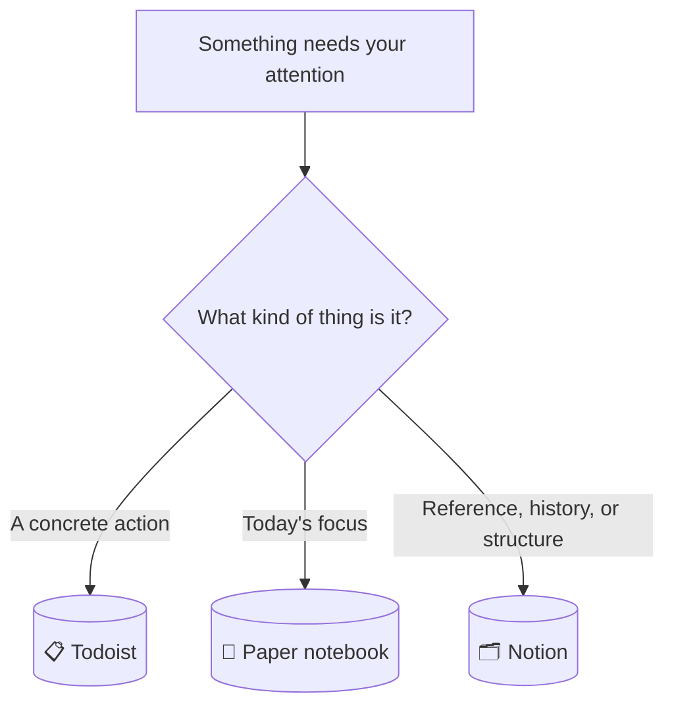
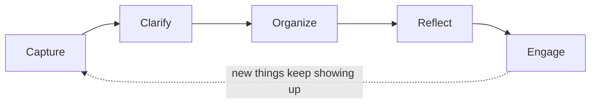
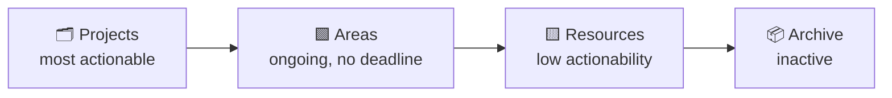
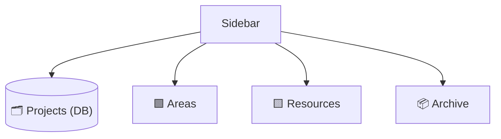
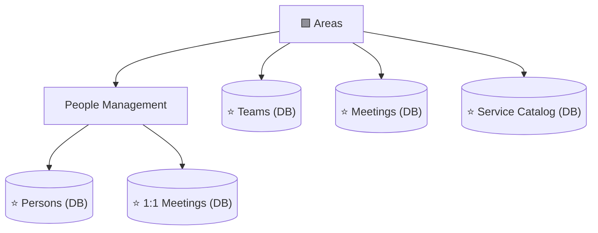
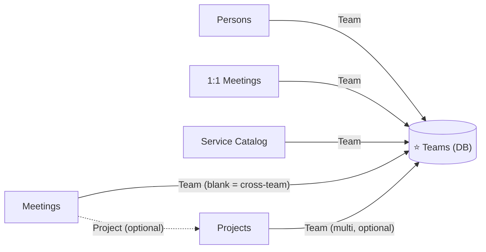
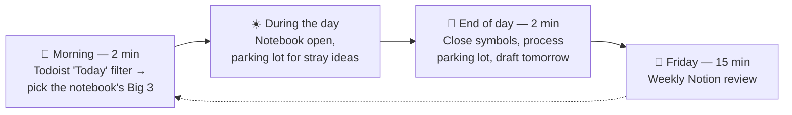

# A Three-Tool Personal Productivity System: GTD + PARA in Practice

This document describes a personal productivity system built on three tools, each with exactly one job, tied together by two well-known frameworks: **GTD** (Getting Things Done, David Allen) for capturing and acting on tasks, and **PARA** (Tiago Forte, *Building a Second Brain*) for organizing long-term knowledge in Notion.

It is not a diagnosis or a changelog — it's a snapshot of a working system, detailed enough to be copied as-is.

---

## Overview

Most productivity systems collapse because one tool is asked to do everything — a Notion workspace that tries to be a task list, a knowledge base, and a daily planner at once ends up mediocre at all three. This system avoids that by giving each tool a single, non-overlapping responsibility:



| Tool | Answers the question | Time horizon | Governing framework |
|---|---|---|---|
| **Todoist** | What do I need to *do*? | Now / this week | GTD |
| **Paper notebook** | What am I focusing on *today*? | Today, disposable | — |
| **Notion** | What do I need to *remember* or look up? | Months / years | PARA |

The routing rule is simple: if it's an action, it goes to Todoist. If it's today's focus, it goes to the notebook. If it's reference material, history, or something you'll compare against other things, it goes to Notion.

---

## Part 1 — GTD in Todoist: capture with (almost) zero friction

### What GTD actually says

David Allen's *Getting Things Done* is built on one observation: anything that has your attention but isn't captured in a system you trust creates background stress — what Allen calls an "open loop." The method closes those loops through five stages:



| Stage | What it means | Where it happens in this system |
|---|---|---|
| **Capture** | Collect everything that has your attention, immediately, without judging it | Todoist quick-add |
| **Clarify** | Decide what each captured item actually means and what the next physical action is | Verb-first task naming (below) |
| **Organize** | File the clarified item where it belongs | Projects-as-tags + Labels |
| **Reflect** | Review the system regularly so you keep trusting it | Daily notebook ritual + weekly Notion review |
| **Engage** | Choose what to do right now with confidence | Saved filters (Today / 7 days / Waiting) |

### Capture: the step Todoist is built for

The entire value of GTD's capture step depends on friction being close to zero. If jotting something down takes more than a few seconds, you stop trusting yourself to do it consistently — and the moment you stop trusting the capture step, the whole method quietly falls apart, because things start living in your head again.

Todoist is used here purely as a capture-and-action engine: quick-add from any device, natural-language date parsing, reliable notifications. It deliberately does **not** try to hold knowledge, context, or history — that discipline is what keeps capture fast.

### Clarify: verb-first naming forces the decision at capture time

GTD defines a "next action" as a physical, visible activity — not a topic, not a vague intention. A task named **"Vendor meeting"** is ambiguous within a few days: was it to schedule the meeting? prepare for it? just show up? A task named **"Schedule vendor meeting"** never loses its meaning, because the verb *is* the clarification GTD asks for.

| Instead of | Write |
|---|---|
| Vendor meeting | Schedule vendor meeting |
| Cluster upgrade proposal | Review cluster upgrade proposal |
| Roadmap slides | Update roadmap slides |

This single habit — always start with a verb — does most of the "Clarify" work for you, right at the moment of capture, so nothing sits half-formed on the list.

### Organize: Projects as tags, Labels as cross-cutting attributes

Todoist's "Projects" feature is used here as a simple top-level separator, not as GTD-style multi-step projects (that job belongs to Notion — see Part 4):

- `#Work` and `#Personal` — the only two top-level containers. No sub-projects, no nesting.

**Labels**, applied while capturing or reviewing a task:

- `@waiting` — GTD's classic "Waiting For" list: things delegated to someone else, easy to lose track of
- `@quick` — anything under two minutes, batched together and cleared in one pass
- `@email` — anything that only needs an email to be sent

### Engage: three saved filters, pinned to the top

- **Today** — everything due today
- **Next 7 days** — a week-ahead view for light planning
- **@waiting** — everything currently pending on someone else

A saved filter trades a repeated mental query ("what did I delegate again?") for a single tap.

### Example

```
☐ Schedule vendor meeting                 #Work      @waiting
☐ Update roadmap slides                   #Work      @quick
☐ Send calendar invite for kickoff        #Work      @email
☐ Book car service appointment            #Personal  @waiting
☐ Confirm attendance for offsite          #Work      @quick
```

---

## Part 2 — The Notebook: today's focus, made disposable

### Philosophy

The notebook exists to answer one question: what am I focusing on *today*? There is no index, no migrating unfinished items to a new page, no reviewing last week — every page is meant to die at the end of the day. That's a deliberate choice, not a limitation: a system that requires looking backward carries more overhead than this use case justifies.

### The "Big 3"

Three priorities, written each morning. Not a long list — three things that, if they happen, make the day a good one.

### Symbols — kept to an absolute minimum

The creator of the Bullet Journal method, Ryder Carroll, is explicit about this: *"keep custom bullets and signifiers to an absolute minimum — the more you invent, the more complex it is, and the slower you become."* This system uses exactly three:

| Symbol | Meaning | Written |
|---|---|---|
| `○` | Not done yet | In the morning, next to each Big 3 item |
| `✓` | Done | In the evening, turning the `○` into a check |
| `✕` | Didn't happen | In the evening, turning the `○` into a cross |

There is no dedicated symbol for "moved to Todoist." If something marked `✕` still matters, the task gets created in Todoist right then — the notebook never holds anything for more than a day; what survives is decided explicitly, tool by tool.

### Two small additions

1. **A "parking lot" box** — a fixed square in a corner of the page. Any stray idea or distraction that shows up mid-day gets written there instead of interrupting whatever you're doing. At day's end, each item is processed: Todoist, Notion Inbox, or discarded.
2. **One line drafting tomorrow** — at the end of the day, write one likely item for tomorrow's Big 3. It removes the "blank page" friction the next morning, for a cost of about ten seconds.

### Example page

```
Friday, September 18
─────────────────────────────────────
BIG 3
✓  Review vendor proposal
✕  Draft roadmap slides (moved to Todoist)
○  1:1 with a direct report — discuss promotion

┌─ PARKING LOT ──────────────────────┐
│ "Ask about the connection pool fix" │
│ "Idea: record an onboarding video"  │
└─────────────────────────────────────┘
- - - - - - - - - - - - - - - - - - -
Tomorrow, maybe: review yesterday's interview feedback
```

---

## Part 3 — PARA in Notion: organizing by actionability, not topic

### Origin, and how it relates to GTD

PARA comes from Tiago Forte's *Building a Second Brain*, where it is the "Organize" step of a larger loop called **CODE** — Capture, Organize, Distill, Express. That parallels GTD's own Capture step neatly: GTD governs the flow of *actions* (handled by Todoist, Part 1); PARA governs the structure of *knowledge* (handled by Notion, this part). The two frameworks aren't competing — they cover different halves of the same problem.

### Four categories, ordered by actionability

PARA's central move is to file things by **how actionable they are right now**, never by subject. The question is never "what is this about" — it's "how ready for action is this":



| Category | Definition | Example |
|---|---|---|
| **Projects** | A defined outcome with an end date, spanning multiple work sessions | "Migrate the primary database to a new provider" |
| **Areas** | An ongoing responsibility with no end | "Team A operations" |
| **Resources** | Reference material or an interest, with no responsibility attached | "Internal tooling tips" |
| **Archive** | Everything else — out of sight, not deleted | A finished project, a defunct system |

Items **flow** between categories over time: a Resource can become a Project the moment you decide to act on it; a Project becomes Archive when it's done; an Area can go inactive and move to Archive.

> **The golden rule** (Tiago Forte's own words): never create an empty folder, tag, or database before you have real content for it. Structure built "for later" before it's needed is the single most common mistake in systems like this — and the easiest one to avoid.

### Why PARA fits Notion specifically

Notion has a quiet structural feature that makes it a very good fit for PARA: **every database row is, under the hood, a full page.** You are never forced to choose between "structured list" and "rich freeform content" — a row can have filterable properties *and* an open canvas of notes, exactly the two things PARA needs (structured Projects/Areas plus freeform pages for narrative and context).

---

## Part 4 — Database or Page? A decision framework

Every time something new needs a home in Notion, the same four questions decide the format:

| Question | Signal for a Page | Signal for a Database |
|---|---|---|
| How many items, in total? | Few and stable (up to ~8–10) | Many, or growing over time |
| Do they all share the same "shape" (the same fields)? | No — each one is its own world | Yes — the same properties across all of them |
| Do you need to compare, filter, or sort several at once? | No | Yes |
| Is it a structure that repeats often? | Not repetitive | Yes, and duplicating it by hand is annoying |

Rule of thumb: two or more answers on the same side decide it. On a tie, default to what you already have today — migrating from Page to Database later is cheap.

> **When to use a Relation instead of a Select:** only when you genuinely need a two-way link (seeing the connection from both sides) or when the same value would otherwise be duplicated across three or more databases, risking them drifting out of sync. Outside of that, a plain Select with a filtered view gives the same value with far less setup.

---

## Part 5 — The Notion structure

### Top level

Only the four PARA categories sit at the top of the sidebar. The **Projects** database counts as the category itself — it is not a fifth thing bolted on, and it does not live inside a "Projects" folder.



### Inside Areas



**Why Teams, Meetings, and Service Catalog sit directly in Areas, rather than inside one specific team:** none of the three has a single owning team — they all serve every team at once. A database that serves several teams doesn't fit physically "inside" any one of them without feeling out of place.

### Resources and Archive

- **Resources** — commands, guides, house rules, process notes. Reference material that doesn't expire and has no single owner.
- **Archive** — whatever is no longer needed, grouped by year. It is never itself a database — always a destination.

### Fast access without breaking the classification: Favorites

Persons, 1:1 Meetings, Teams, Meetings, and Service Catalog all live correctly inside Areas — but each is also marked as a **Favorite** in Notion, which pins it to the top of the sidebar for one-click access without physically moving it out of its folder. Classification and access speed are two independent problems; you don't have to trade one for the other.

---

## Part 6 — The Teams database: a relational hub

Persons, 1:1 Meetings, Service Catalog, Meetings, and Projects each need some notion of "which team." Without a dedicated database, that means the same short list of team names duplicated as a Select field in five different places — guaranteed to drift out of sync the moment a team is renamed or a new one appears.

**Teams** solves this: it's the single place where team names actually exist. The other five databases point to it through a Relation. Renaming or adding a team happens once, not five times.



Each row in Teams (say, "Team A") is a complete page in its own right, and can hold freeform notes about that team — but the real value comes from **automatic rollups**: opening the "Team A" page shows every Meeting, every Service Catalog entry, and every Project linked to it, with no manually configured filtered view required.

Projects that don't belong to any one team are simply left with the Team field empty — the project's own name usually makes that obvious without needing a category to say so too.

---

## Part 7 — Full database schemas

### Projects
*Alone at the top level — this database **is** the "Projects" category.*

| Field | Type | Notes |
|---|---|---|
| Name | Title | The initiative's name |
| Status | Select | `Now` · `Next` · `Later` · `On Hold` · `Done` |
| Target Date | Date | Optional — only if there's a real deadline |
| Risk | Select | 🟢 · 🟠 · 🔴 |
| Team | Relation → Teams | Multi-relation for cross-team projects; left blank for team-agnostic ones |
| Tracker | URL | Link to the ticketing system, if applicable |

### Teams
*Directly inside Areas — the relational hub described in Part 6.*

| Field | Type | Notes |
|---|---|---|
| Name | Title | e.g. Team A, Team B, Team C |

### Persons
*Inside Areas → People Management. Favorited.*

| Field | Type | Notes |
|---|---|---|
| Name | Title | The person's name |
| Team | Relation → Teams | |
| Role | Text / Select | Job title or function |
| Last 1:1 | Rollup | Optional — pulls the most recent date from 1:1 Meetings |

### 1:1 Meetings
*Inside Areas → People Management. Favorited. One row per person, not per session.*

| Field | Type | Notes |
|---|---|---|
| Person | Title | The person's name |
| Team | Relation → Teams | |
| Last Updated | Date | Updated every time a new log entry is added |

Page body: a "Next" block at the top, followed by dated log entries — one per session. The page is never recreated, it only ever grows.

### Meetings
*Directly inside Areas. Favorited. Recurring and one-off meetings live together, distinguished by Type.*

| Field | Type | Notes |
|---|---|---|
| Name | Title | The series name (recurring) or the meeting's name (one-off) |
| Type | Select | `Recurring` · `On Demand` |
| Project | Relation → Projects | Optional — links a one-off meeting to the relevant Project |
| Team | Relation → Teams | Blank = cross-team |
| Last Updated | Date | |

Usage rule: one row per recurring **series** (never per occurrence) — the page body grows with one dated entry per session, exactly like 1:1 Meetings.

### Service Catalog
*Directly inside Areas. Favorited. Living memory for the systems and assets you own.*

| Field | Type | Notes |
|---|---|---|
| Name | Title | The system or asset's name |
| Team | Relation → Teams | |
| Category | Select | e.g. `Database` · `Messaging` · `CI/CD` · `Cloud` · `Internal Tool` |
| Criticality | Select | 🔴 Critical · 🟠 Important · 🟢 Low |
| Status | Select | `Active` · `Deprecated` · `Being Phased Out` |
| Last Reviewed | Date | Flags stale entries |

Page body, with four fixed sections: *Known Limitations*, *Common Issues & Fixes*, *Improvement Ideas*, *Useful Links*.

---

## Part 8 — The daily and weekly ritual



| Moment | Duration | What happens |
|---|---|---|
| **Morning** | 2 min | Open Todoist, filter by "Today." Pick the notebook's Big 3 — use yesterday's draft line if there is one. |
| **During the day** | — | Notebook stays open. Symbols get marked as tasks close. Stray ideas go into the parking lot, never into the middle of the page. |
| **End of day** | 2 min | Close out pending symbols (`✓` or `✕`). If a `✕` still matters, create the Todoist task right away. Process the parking lot: Todoist, Notion Inbox, or discard. Draft tomorrow's first item. |
| **Friday** | 15 min | Weekly Notion review: clear the Inbox → update the Status of every active Project → check one or two Service Catalog entries touched that week. |

The weekly Notion review runs off a recurring Todoist task as its trigger — it never depends on memory or willpower alone.

---

## Part 9 — General principles for structuring any new database

1. **Few properties** — only the ones that answer a real filtering or sorting question.
2. **The right type for each field** — Select for fixed values; Date only for real dates; Relation only when there's a genuine two-way rollup to gain.
3. **The title identifies the row on its own** — without needing to open the page.
4. **Rich content lives in the page body**, never in a property — properties are for filtering, not for narrating.
5. **Two or three views cover almost everything** — one filtered for daily use, one grouped for a bird's-eye view, one unfiltered for the rare full audit.

If the rows in a database start needing very different fields from one another, that's a sign it should be two databases — or not a database at all.
